# Linux脚本编程：P39：常用特殊符号补充 📝


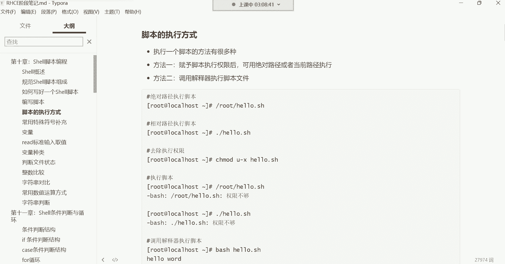

在本节课中，我们将学习Shell脚本的几种执行方式，并深入探讨几个在脚本中常用的特殊符号，包括引号和四则运算符号。理解这些符号的功能和区别，对于编写高效、健壮的脚本至关重要。

## 脚本的执行方式

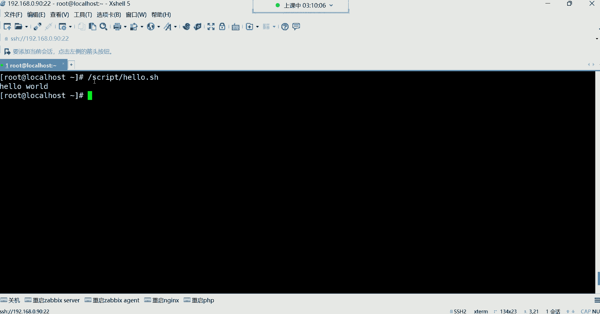

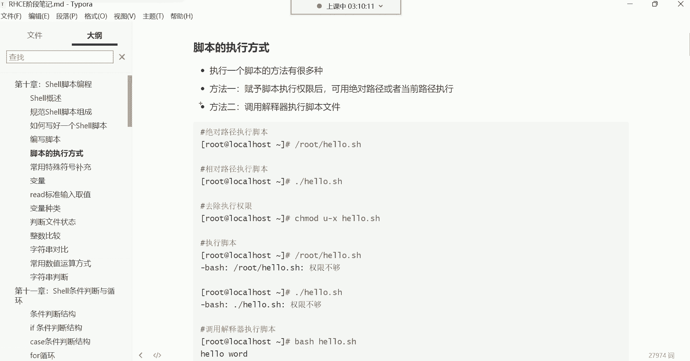

上一节我们介绍了如何编写脚本，本节中我们来看看如何执行一个脚本。脚本的执行主要有两种方式。

### 方式一：赋予执行权限后执行

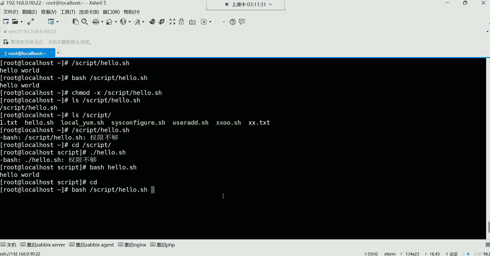

这是最常用的方法。首先需要赋予脚本文件执行权限，然后通过指定其路径来执行。

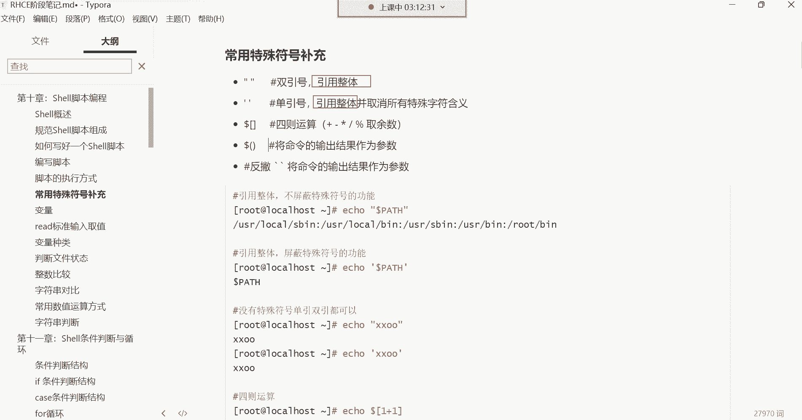

以下是具体步骤：
1.  使用 `chmod +x` 命令为脚本文件添加执行权限。
2.  使用**绝对路径**（如 `/root/hello.sh`）或**相对路径**（如 `./hello.sh`）来执行脚本。

**注意**：使用相对路径执行时，必须在脚本名前加上 `./`（点杠），以告知系统这是一个当前目录下的文件，而不是一条系统命令。如果不加，系统会提示“未找到命令”。

### 方式二：调用解释器执行

这种方式无需为脚本文件赋予执行权限，可以直接通过指定解释器（如 `bash`）来执行脚本。

以下是具体命令：
```bash
bash /root/hello.sh
```
或者进入脚本所在目录后执行：
```bash
bash ./hello.sh
```
这种方法适用于临时执行一个没有执行权限的脚本文件，但在日常操作中不如第一种方式常用。

## 常用的特殊符号：引号

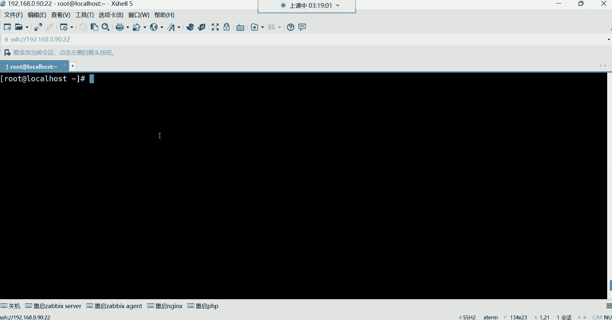

接下来，我们学习在脚本中用于“引用整体”的特殊符号——引号。引号的主要作用是将多个单词或特殊字符组合成一个不可分割的整体。

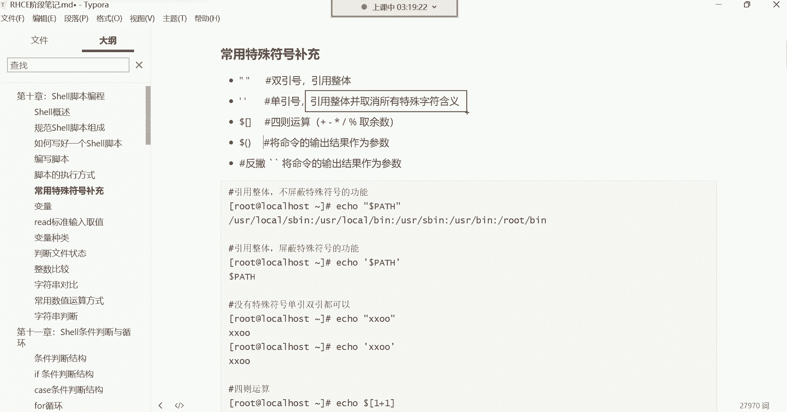

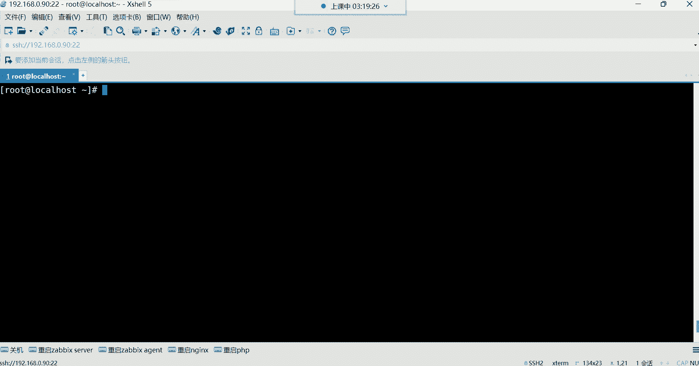

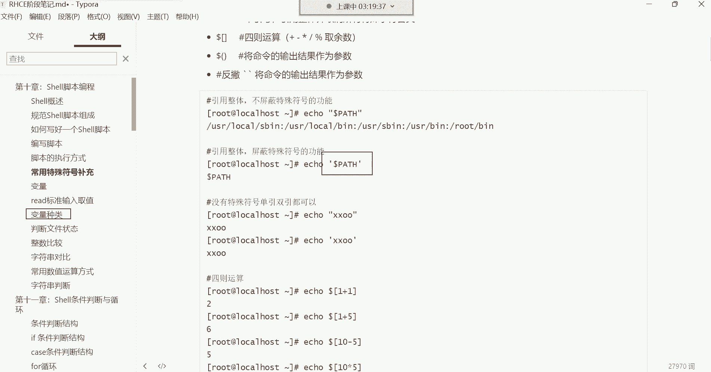

### 双引号与单引号的功能

双引号（`"`）和单引号（`'`）都能实现“引用整体”的功能。例如，当你想创建一个包含空格的文件名时，必须使用引号将其括起来，否则系统会将其识别为两个独立的参数。


**示例**：创建名为 `a b` 的文件。
```bash
touch “a b”
```
如果不加引号，`touch a b` 命令会创建两个文件：`a` 和 `b`。

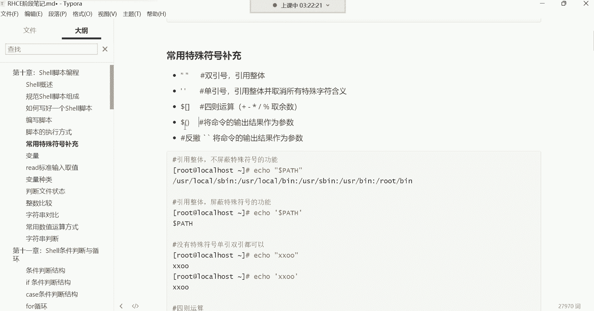

引号在处理包含空格等特殊字符的文件时尤其重要。有时你可能会遇到无法删除的文件，很可能是因为文件名首尾包含看不见的空格，此时删除命令也需要用引号将完整的文件名括起来。

### 双引号与单引号的区别

虽然两者都能引用整体，但关键区别在于**是否保留特殊符号的原有功能**。

*   **双引号**：会保留其中**美元符（`$`）、反引号（`` ` ``）、反斜杠（`\`）** 等特殊符号的功能。
*   **单引号**：会取消其中**所有**特殊符号的特殊含义，将其视为普通字符。


**示例**：假设有一个变量 `x=10`。
```bash
echo “软件包数量为：$x” # 输出：软件包数量为：10
echo ‘软件包数量为：$x’ # 输出：软件包数量为：$x
```
在双引号中，`$x` 被解析为变量并输出其值 `10`；在单引号中，`$x` 被当作普通字符串原样输出。


**总结**：需要变量替换或命令替换时，使用双引号；需要完全原样输出字符串时，使用单引号。

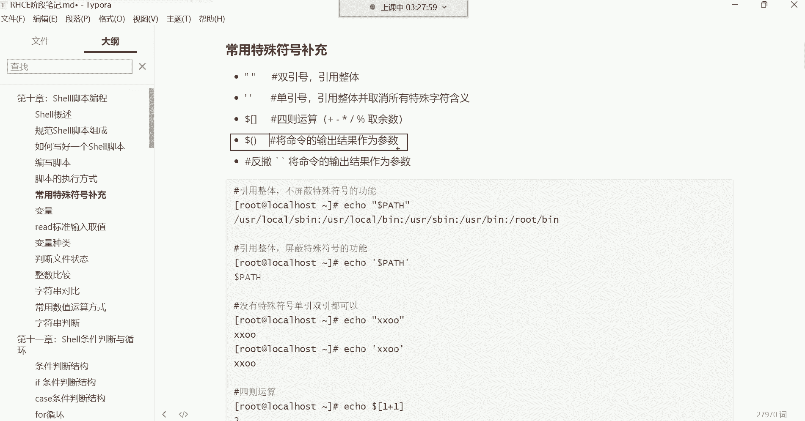

## 常用的特殊符号：四则运算

在Shell脚本中，我们也可以进行数学计算，即四则运算（加、减、乘、除、取余）。

### 使用 `$[]` 进行运算

最基本的运算方式是使用 `$[]` 符号。我们可以通过 `echo` 命令输出运算结果。

以下是基本运算符：
*   **加法（`+`）**：`echo $[1 + 1]` 输出 `2`
*   **减法（`-`）**：`echo $[5 - 2]` 输出 `3`
*   **乘法（`*`）**：`echo $[3 * 4]` 输出 `12`
*   **除法（`/`）**：`echo $[10 / 2]` 输出 `5`
*   **取余（`%`）**：`echo $[10 % 3]` 输出 `1`（即10除以3的余数）

取余运算在后期脚本编程中非常有用，例如可以用来控制数字的范围或实现循环。

## 常用的特殊符号：命令替换

命令替换是一个强大的功能，它能**将一个命令的输出结果，作为另一个命令的参数**。这可以通过反引号（`` ` ``）或 `$()` 来实现。

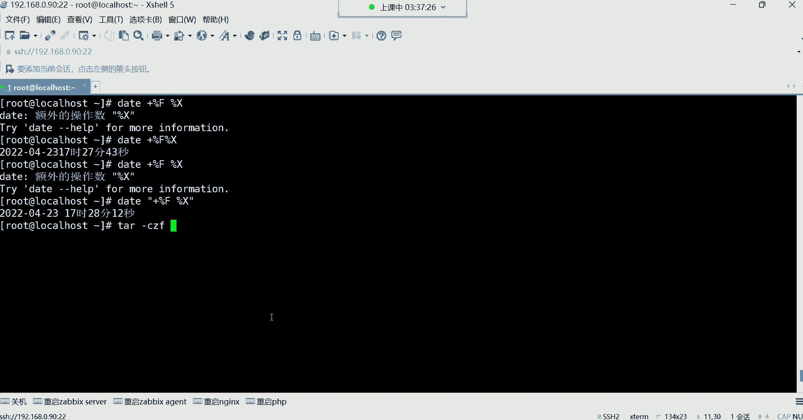

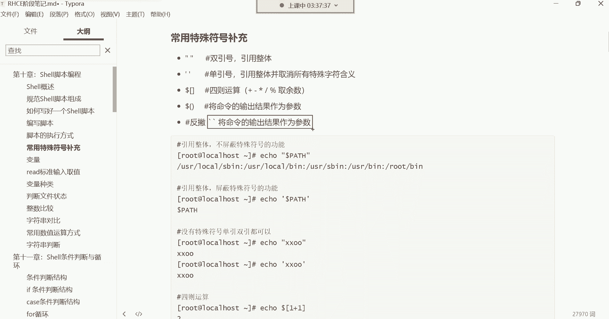

### 反引号与 `$()` 的用法

假设我们想在创建文件或备份数据时，在文件名中加入当前系统时间。

**错误示范**：直接将 `date` 命令当作字符串的一部分。
```bash
touch “file_$(date +%F_%X).txt”
```
这样创建的文件名会包含字面字符串 “date +%F_%X”，而不是时间结果。

**正确方法**：使用命令替换。
```bash
touch “file_$(date +%F_%X).txt”
```
或者使用反引号：
```bash
touch “file_`date +%F_%X`.txt”
```
此时，`date +%F_%X` 这个命令会先被执行，其输出的时间字符串（如 `2023-10-27_14:30:25`）会替换掉原位置，从而生成一个动态的文件名。

### 实际应用示例：带时间戳的备份

这个功能在自动化备份时极其有用，可以确保每次备份生成的文件名都不相同，避免覆盖旧备份。

**示例备份命令**：
```bash
tar -czf “/backup/log_$(date +%F_%H%M%S).tar.gz” /var/log/*.log
```
这条命令会将 `/var/log/` 目录下的所有 `.log` 文件打包，并以 `log_年-月-日_时分秒.tar.gz` 的格式命名备份文件。每次运行都会生成一个独一无二的文件名。

**注意**：当命令替换的结果中包含空格时，通常需要在外层使用双引号将其引为一个整体参数，以确保命令正确解析。

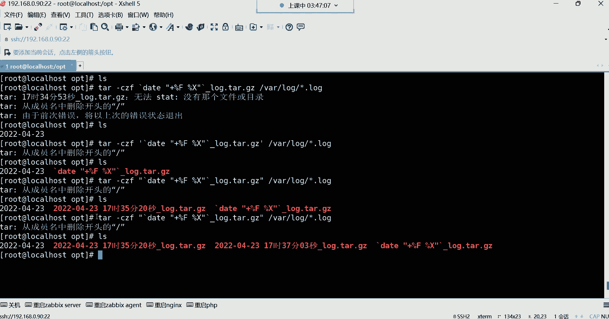

---

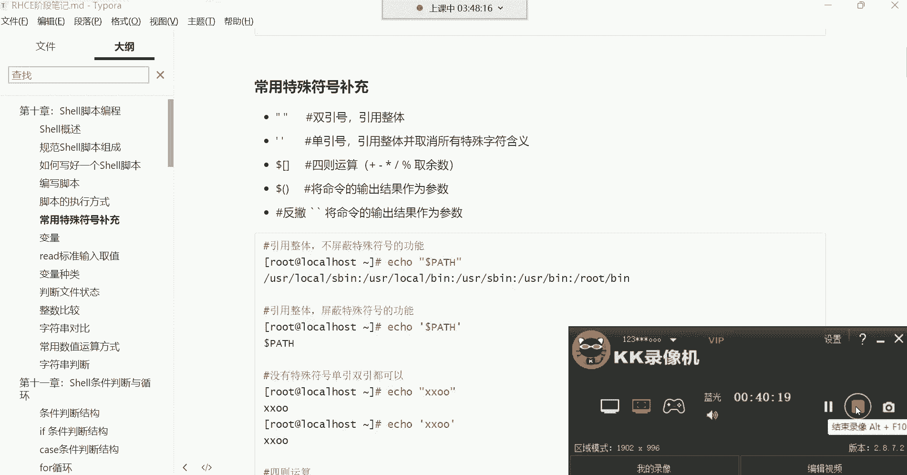

本节课中我们一起学习了Shell脚本的多种执行方式，并重点掌握了双引号、单引号、四则运算符号以及命令替换符号的功能与用法。这些特殊符号是Shell脚本编程的基石，理解它们能帮助你写出更灵活、更强大的脚本。记住，双引号会解析特殊符号，单引号则完全原样输出；`$[]` 用于计算；而 `` ` `` 或 `$()` 能将命令输出变为可用参数。多加练习，你就能熟练运用它们。