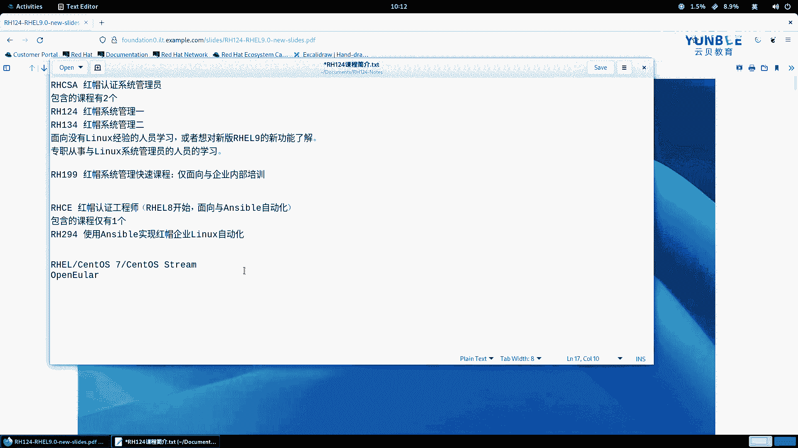
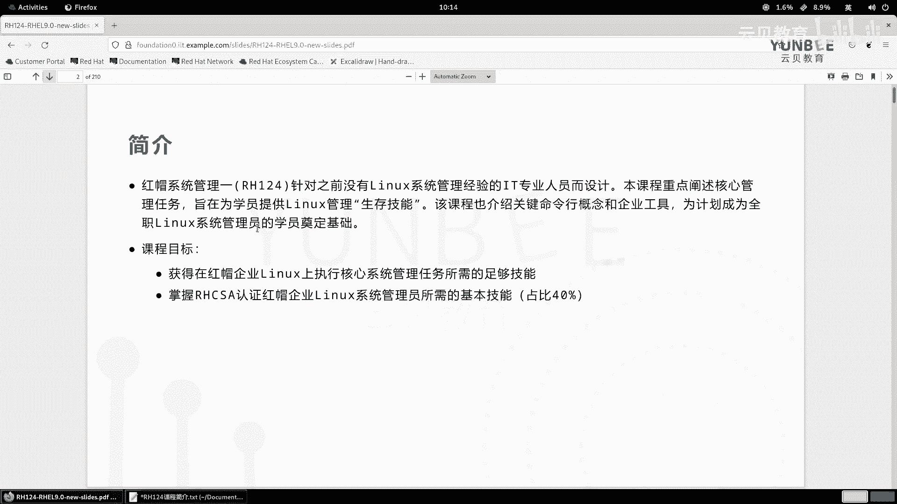
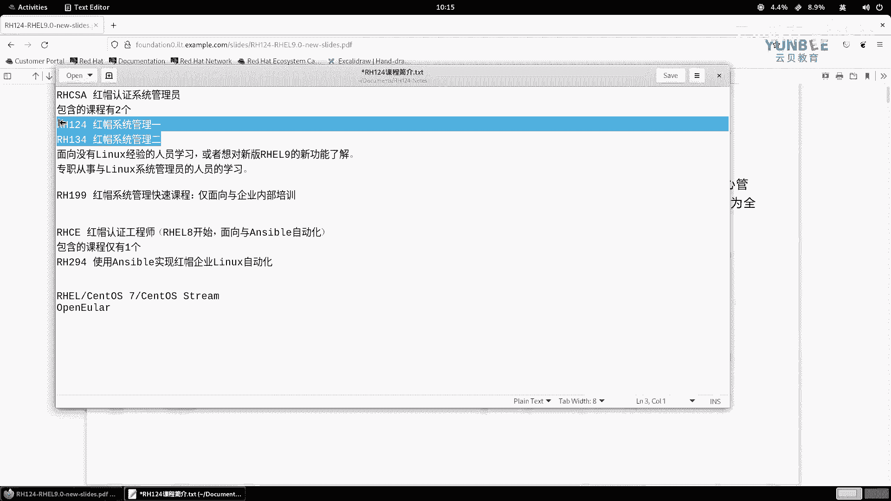
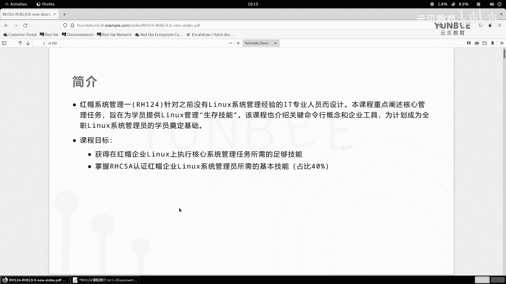
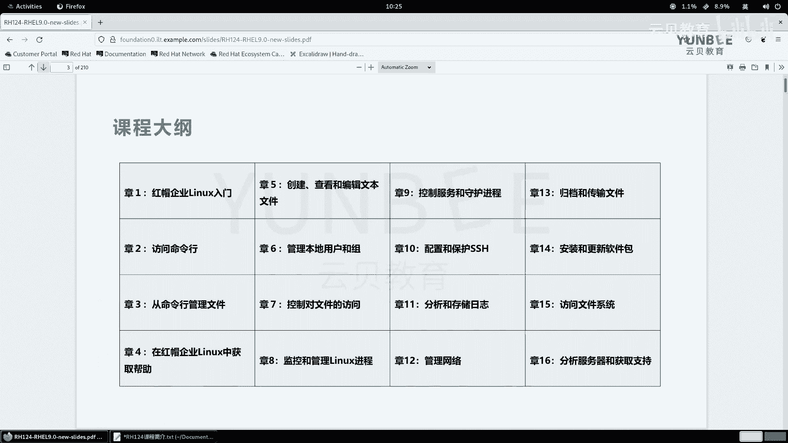

# 零基础入门Linux：P3：课程简介与规划 📚

## 概述
在本节课中，我们将介绍《RHCSA红帽认证系统管理员》课程的整体结构、包含的子课程以及《RH124 系统管理一》的详细章节内容。这将帮助你清晰地了解学习路径和即将掌握的知识点。

## 课程体系介绍
上一节我们完成了学习环境的搭建，本节中我们来看看整个课程体系的构成。

RHCSA（红帽认证系统管理员）认证包含两门核心课程：
*   **RH124**：红帽系统管理一。
*   **RH134**：红帽系统管理二。

这两门课程面向没有Linux经验的初学者，或希望了解Red Hat Enterprise Linux 9新功能的用户，也适合专职Linux系统管理员学习。

此外，还有一门**RH199**（红帽系统管理快速课程），这门课程仅面向企业内部培训，它将RH124和RH134的核心知识点合并讲解。

完成上述基础课程后，若希望学习自动化运维，可以继续学习**RHCE**（红帽认证工程师）认证课程。从RHEL8开始，该认证侧重于Ansible自动化，其对应课程为：
*   **RH294**：使用Ansible实现红帽企业Linux自动化。

即使工作中不使用红帽系统，所学知识也适用于CentOS、OpenEuler、麒麟服务器版等使用类似包管理方式的系统。上手Ubuntu等系统可能需要额外适应，但基础概念是相通的。

## RH124 系统管理一课程大纲
接下来，我们详细了解一下《RH124 系统管理一》这门入门课程的具体内容。本课程专为没有经验的IT专业人员设计，旨在提供从零到一的“生存技能”，为后续学习打下坚实基础。它涵盖了RHCSA认证考试中约40%的知识点。

以下是本课程包含的16个标准章节及其核心内容简介：

**第一章：访问命令行**
介绍Linux与红帽企业Linux，解释开源等关键术语，并了解红帽产品线。

**第二章：从命令行管理文件**
学习如何使用命令行，包括图形界面操作、提高效率的快捷键等。

**第三章：在RHEL中获取帮助**
介绍如何使用`man`手册和`GNU info`获取命令帮助信息。

**第四章：创建、查看和编辑文本文件**
涉及输入/输出重定向、`Vim`文本编辑器的使用以及Shell环境定制。

**第五章：管理本地用户和组**
学习如何切换用户、在本地系统中添加、修改、删除用户和组，并管理用户密码策略。

**第六章：控制对文件的访问**
理解并修改Linux文件系统权限，包括基本权限、默认权限和特殊权限。课程额外增加了访问控制列表（ACL）和文件属性管理的内容。

**第七章：监控和管理Linux进程**
介绍进程概念，学习如何查看进程状态、监控系统性能指标。

**第八章：控制服务和守护进程**
学习RHEL9中管理和控制服务（守护进程）的系统。课程额外增加了如何自定义编写服务控制文件的实用内容。

**第九章：配置和保护SSH**
学习使用SSH进行远程连接，并掌握保护SSH服务安全的方法。课程会补充更多安全配置方式。

**第十章：分析和存储日志**
学习如何查看系统日志，并使用RHEL9全新的日志系统服务（`journald`）。同时介绍时间同步解决方案。

**第十一章：管理网络**
学习查看和修改网络配置，包括通过命令行和图形界面两种方式。课程将补充更简单实用的网络配置方法。

**第十二章：归档和传输文件**
学习创建归档与压缩文件，以及在不同主机间传输文件（包括普通传输和同步）。

**第十三章：安装和更新软件包**
学习软件包管理，包括注册红帽订阅（或创建学习账户）、查看软件包信息、安装更新软件包以及创建自定义软件仓库。

**第十四章：访问Linux文件系统**
学习挂载存储设备（如磁盘），并在文件系统中查找文件。

**第十五章：使用Web控制台管理系统**
介绍从RHEL8开始提供的Web控制台（Cockpit）的使用，用于监控服务器和获取帮助。

按照本教程的讲解，实际章节会扩展到约19章，以涵盖所有补充的实用知识点。

## 总结
本节课中，我们一起学习了RHCSA认证的课程体系，并详细了解了《RH124 系统管理一》的完整大纲。从Linux基础概念、命令行操作、用户权限管理，到网络、日志、软件包管理等核心系统管理技能，本课程将为你构建坚实的Linux入门知识框架。接下来，我们将正式进入第一章的学习。