# Linux运维工程师升职加薪宝典：P3：虚拟机网络配置、远程连接与Linux岗位介绍 🖥️

在本节课中，我们将学习如何配置虚拟机的网络，使用远程工具连接Linux系统，并了解Linux相关的职业发展路径。课程内容从实践操作出发，最终落脚于行业认知，旨在为初学者构建清晰的学习地图。

## 系统登录与初步操作 🔑

上一节我们完成了Linux系统的安装。系统安装完成后，我们会看到一个命令行登录界面。

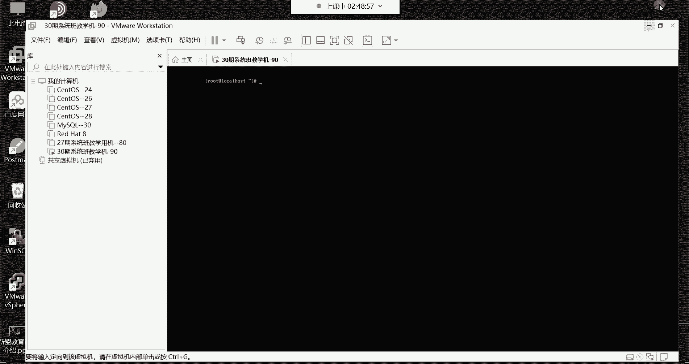

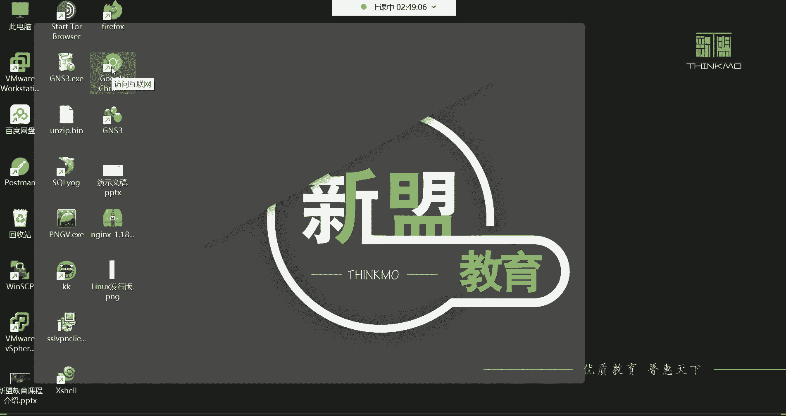

以下是登录系统的步骤：
1.  在 `localhost login:` 提示符后，输入用户名 **`root`**，然后按回车键。
2.  在 `Password:` 提示符后，输入安装时设置的密码（例如 `1`）。输入时屏幕不会显示任何字符，这是出于安全考虑。输入完成后直接按回车键。
3.  登录成功后，命令行提示符会变为 **`[root@localhost ~]#`**，这表示您已成功以root管理员身份进入系统。

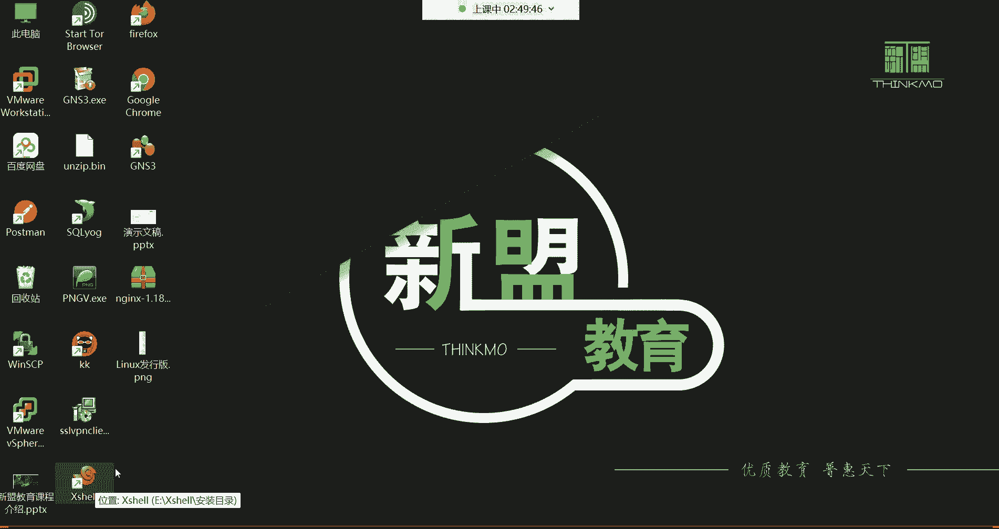

登录后，可以使用 **`Ctrl + L`** 快捷键清空当前终端屏幕，让界面更整洁。

## 配置虚拟机网络 🌐

系统登录后，为了能够从我们的物理机（宿主机）远程连接到虚拟机，需要正确配置虚拟机的网络环境。这主要涉及两个部分的设置。

### 1. 配置VMware虚拟网络编辑器

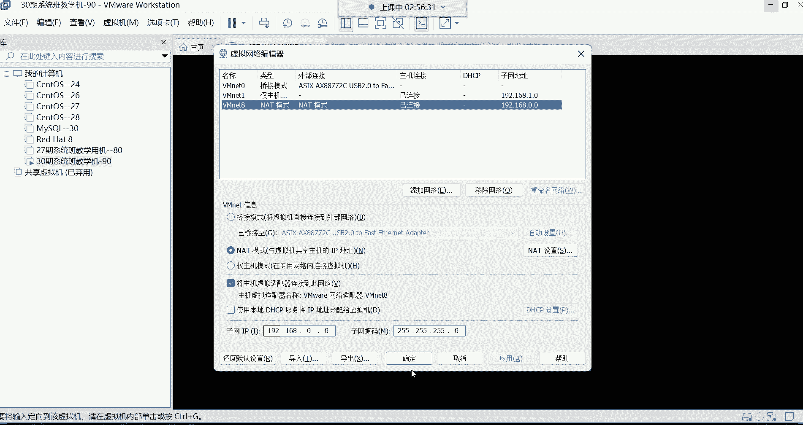

首先，我们需要在VMware软件中设置虚拟网络的参数。

以下是配置虚拟网络编辑器的步骤：
1.  打开VMware，点击顶部菜单栏的“编辑”，选择“虚拟网络编辑器”。
2.  在打开的窗口中，选中“VMnet8（NAT模式）”，然后取消勾选窗口下方的“使用本地DHCP服务将IP地址分配给虚拟机”选项。这一步是为了固定虚拟机的IP地址，避免每次启动时IP变化。
3.  查看并记住“子网IP”和“子网掩码”。例如，子网IP为 `192.168.0.0`，子网掩码为 `255.255.255.0`。
4.  点击“NAT设置”按钮，查看并设置“网关IP”。例如，设置为 `192.168.0.254`。这个地址需要牢记。
5.  点击“确定”保存设置，然后点击“应用”。

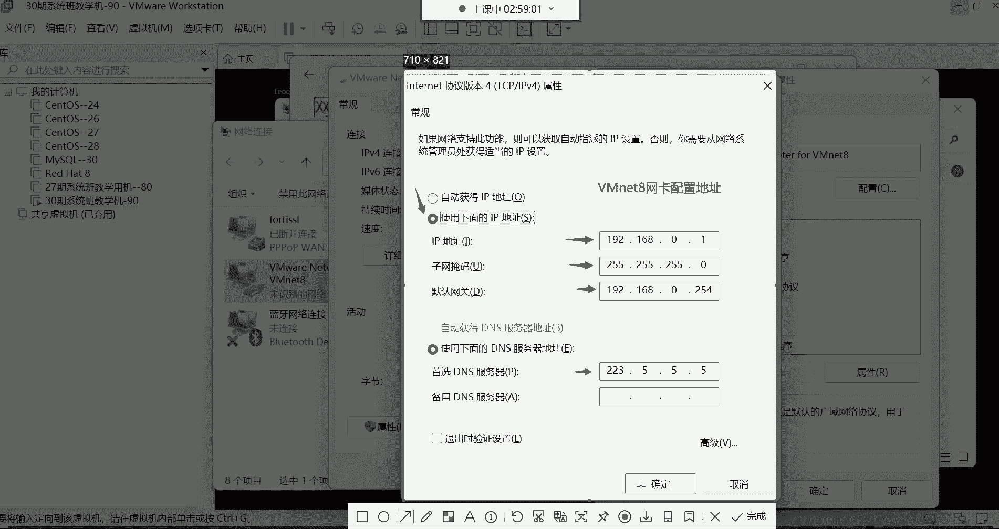

### 2. 配置宿主机的VMnet8网卡

其次，我们需要在Windows系统中配置用于与虚拟机通信的虚拟网卡。

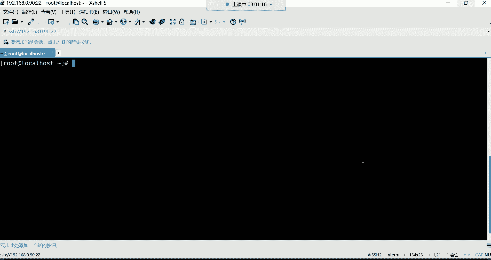

以下是配置VMnet8网卡的步骤：
1.  打开Windows系统的“控制面板” -> “网络和 Internet” -> “网络和共享中心”，点击左侧的“更改适配器设置”。
2.  找到名为“VMware Network Adapter VMnet8”的网络连接，右键点击并选择“属性”。
3.  在属性窗口中，双击“Internet协议版本4 (TCP/IPv4)”。
4.  选择“使用下面的IP地址”，并填写信息：
    *   IP地址：`192.168.0.1` (需与虚拟机在同一网段，即`192.168.0.x`)
    *   子网掩码：`255.255.255.0`
    *   默认网关：`192.168.0.254` (必须与虚拟网络编辑器中设置的网关一致)
5.  在“使用下面的DNS服务器地址”中，可以填写公共DNS，例如 `223.5.5.5`。
6.  点击“确定”保存所有设置。

完成以上两步后，虚拟机的网络环境就配置好了。

## 使用远程连接工具 🔌

在企业中，服务器通常不在本地，因此我们需要通过远程连接工具来管理。本节我们将使用Xshell进行连接。

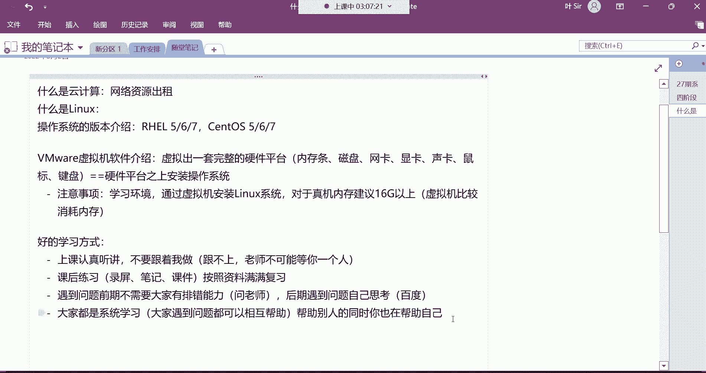

以下是获取和使用Xshell的步骤：
1.  **获取工具**：您可以从课程提供的资料包中获取Xshell，也可以从腾讯软件中心等正规网站搜索“Xshell”进行下载安装。
2.  **建立连接**：打开Xshell，点击“新建”会话。在“主机”栏中输入虚拟机的IP地址（例如 `192.168.0.90`），协议选择“SSH”，然后点击“连接”。
3.  **首次连接验证**：首次连接时会弹出“SSH安全警告”，询问是否接受服务器的主机密钥，选择“接受并保存”。
4.  **身份验证**：在登录界面中，输入用户名 **`root`** 和密码 **`1`**，即可成功登录到远程的Linux虚拟机。

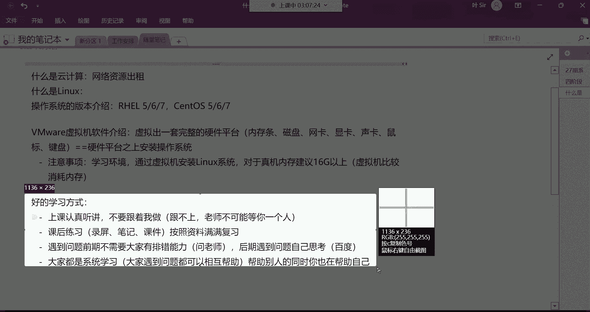

从此，所有对Linux系统的操作和管理都可以在这个远程终端窗口中完成。

## Linux学习与职业发展指南 🧭

掌握了基本的操作环境后，我们来探讨如何有效学习以及未来的职业发展方向。

### 高效的学习方法

正确的学习方法是成功的一半，尤其对于初学者至关重要。

以下是一些推荐的学习方法：
*   **课堂以听和理解为主**：上课时紧跟老师思路，理解概念和原理，不要急于同步操作，以免跟不上节奏。
*   **课后反复练习**：利用课程录屏、笔记和课件，在课后自己动手实践，巩固所学知识。
*   **前期积极提问**：学习初期遇到问题，应及时在课程群中向答疑老师或同学请教。
*   **后期培养独立解决能力**：随着学习的深入，遇到问题应首先尝试自己思考、搜索（如利用百度、谷歌），培养排查和解决问题的能力。
*   **提倡互帮互助**：在帮助同学解决问题的过程中，也能加深自己对知识的理解，实现共同进步。

### Linux的应用领域与岗位

Linux系统几乎无处不在，支撑着现代数字社会的运行。

以下是Linux系统的主要应用领域：
*   **基础服务**：网站、APP后端服务（微信、淘宝、各类游戏服务器）、云计算平台。
*   **尖端科技**：超级计算机（如神威·太湖之光）、人工智能、大数据分析。
*   **嵌入式与终端**：安卓手机系统、路由器、智能电视等设备。

因此，掌握Linux技能可以从事多种技术岗位。

以下是常见的Linux相关技术岗位：
*   **运维工程师**：入门首选，负责服务器和业务系统的稳定运行。
*   **云计算运维工程师**：专注于公有云/私有云平台的管理和维护。
*   **容器运维工程师**：负责基于Docker、Kubernetes的容器化环境。
*   **数据库管理员（DBA）**：专职负责数据库系统的运维和优化。
*   **运维开发/架构师**：需要编程能力，通过自动化工具和系统架构提升运维效率。

对于初学者，建议从“运维工程师”岗位切入，平均薪资可达8000-10000元。后续可根据公司业务和个人兴趣，向专业化方向发展。

### 需要谨慎选择的岗位

并非所有与“运维”相关的岗位都适合作为技术发展的起点。

以下是一些技术含量较低、发展空间有限的岗位：
*   **IDC运维**：主要工作是机房巡检（检查温湿度、电力等），多为外包岗位，技术提升有限。
*   **监控运维**：负责盯守监控系统，发送报警信息，同样多为倒班制的外包岗位。
*   **技术支持**：类似客服，处理用户初级咨询和工单，技术深度不足。

这些岗位通常门槛低，但薪资和发展也受限，不属于我们技术学习的目标方向。

### 运维岗位的优势

与其他技术岗位相比，运维岗位有其独特优势。

以下是运维岗位的几个特点：
*   **入门门槛相对较低**：零基础学员通过系统学习可以入门，对专业和天赋的要求不像开发岗位那样苛刻。
*   **职业生命周期长**：随着经验积累越有价值，不存在严重的“35岁危机”。
*   **岗位需求量大**：任何需要IT支撑的企业都需要运维人员，就业机会广泛。
*   **工作节奏相对稳定**：相较于开发岗位的强创新压力和快节奏，运维更侧重于保障和稳定。

当然，最大的前提是 **坚持学习**。技术学习会有疲劳期，克服惰性、持之以恒是最终能否成功转型的关键。

## 课程总结 📚

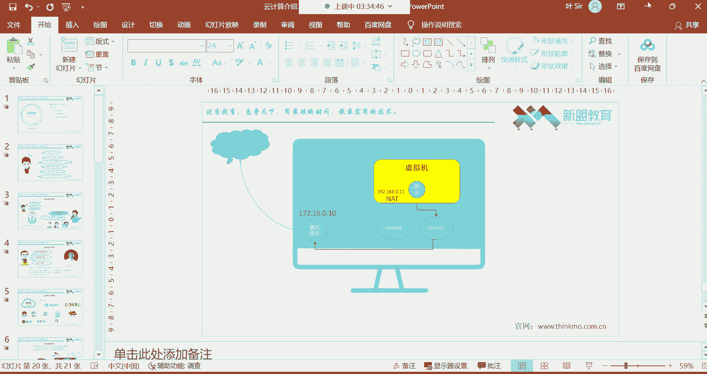

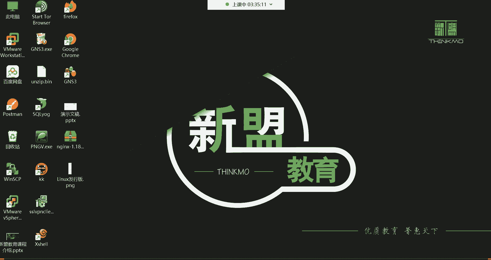

本节课中我们一起学习了三个核心内容：
1.  **操作基础**：学会了登录Linux系统，并配置了虚拟机的网络环境（虚拟网络编辑器与VMnet8网卡），为远程管理打下基础。
2.  **管理工具**：掌握了使用Xshell远程连接工具连接到Linux服务器的方法，这是运维工程师的日常操作。
3.  **行业认知**：了解了Linux广泛的应用领域、明确的技术岗位路径（如运维、云计算、DBA等），以及需要避免的初级岗位。同时，确立了“课前听讲、课后练习、互帮互助、坚持到底”的学习方法。

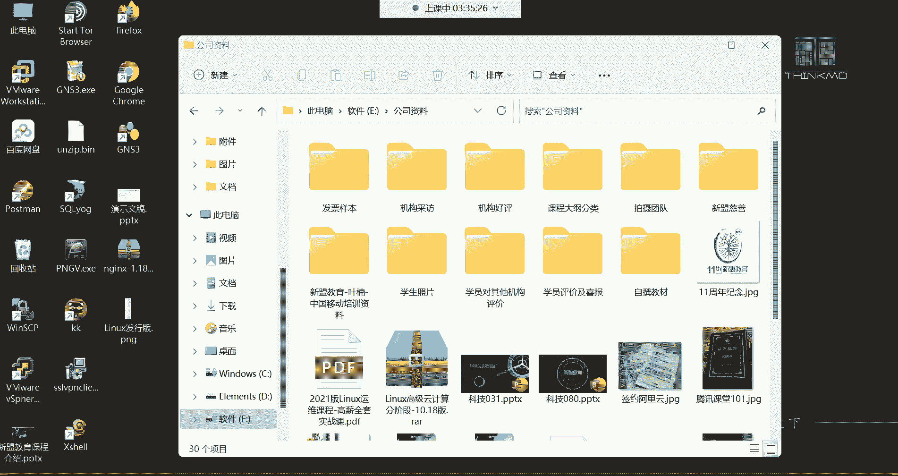

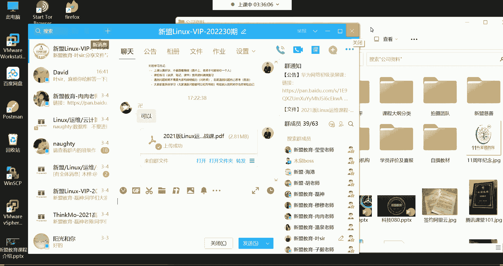

系统安装和基础环境搭建已经完成，从下节课开始，我们将正式进入Linux命令行的学习世界。