# Linux运维教程：P40：判断文件状态、整数比较、字符串对比、常用数值运算方式、字符串判断


在本节课中，我们将学习Shell脚本中几种核心的判断与运算方式。内容包括如何判断文件的状态、如何进行整数和字符串的比较、常用的数值运算方法，以及如何判断字符串是否为空。这些是编写条件判断脚本的基础知识。

## 判断文件状态


上一节我们介绍了Shell的基本概念，本节中我们来看看如何判断文件的状态。Shell提供了一系列单字母操作符，用于在条件判断中检查文件的各种属性。

以下是常用的文件状态判断操作符及其用法：

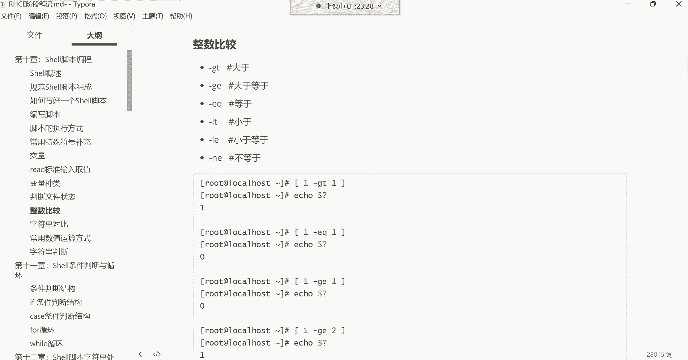


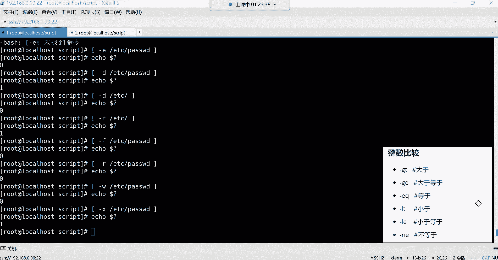

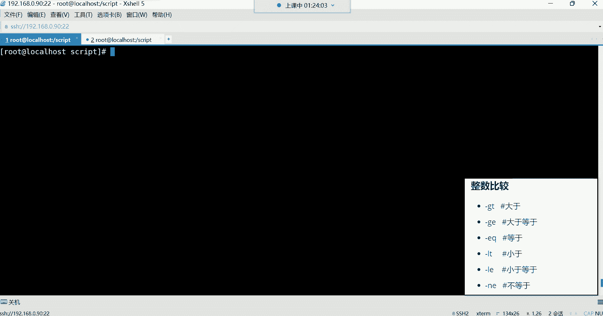

*   **`-e`**：判断文件或目录是否存在。例如：`[ -e /etc/passwd ]`
*   **`-d`**：判断路径是否为目录。例如：`[ -d /etc ]`
*   **`-f`**：判断路径是否为普通文件。例如：`[ -f /etc/passwd ]`
*   **`-r`**：判断当前用户对文件是否具有读权限。例如：`[ -r /etc/passwd ]`
*   **`-w`**：判断当前用户对文件是否具有写权限。例如：`[ -w /etc/passwd ]`
*   **`-x`**：判断当前用户对文件是否具有执行权限。例如：`[ -x /etc/passwd ]`


**使用格式**：所有判断都需要放在方括号 `[ ]` 内，并且方括号内各部分必须用空格隔开。判断命令本身不会输出结果，需要通过 `$?` 来获取上一条命令的返回值（0表示真/成功，非0表示假/失败）。

```bash
[ -e /etc/passwd ]  # 判断文件是否存在
echo $?             # 查看上一条命令的返回值，0表示存在
```

> **学习提示**：现阶段无需死记硬背所有操作符，重点是认识它们。当在他人脚本中看到 `-e` 时，能知道这是在判断文件是否存在；看到 `-x` 时，能知道这是在判断文件是否可执行。

## 整数比较


了解了文件状态判断后，我们进入数值运算领域。首先学习如何进行整数比较。Shell中的整数比较有专用的操作符，与数学符号略有不同。


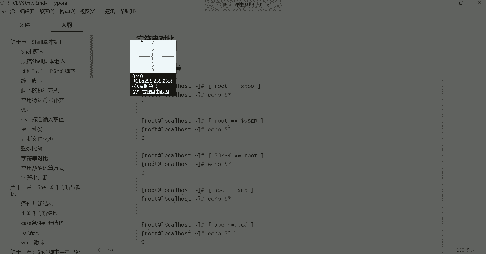

以下是整数比较的操作符：

*   **`-eq`**：等于（Equal）。例如：`[ 1 -eq 1 ]`
*   **`-ne`**：不等于（Not Equal）。例如：`[ 1 -ne 2 ]`
*   **`-gt`**：大于（Greater Than）。例如：`[ 2 -gt 1 ]`
*   **`-ge`**：大于等于（Greater or Equal）。例如：`[ 2 -ge 2 ]`
*   **`-lt`**：小于（Less Than）。例如：`[ 1 -lt 2 ]`
*   **`-le`**：小于等于（Less or Equal）。例如：`[ 1 -le 1 ]`

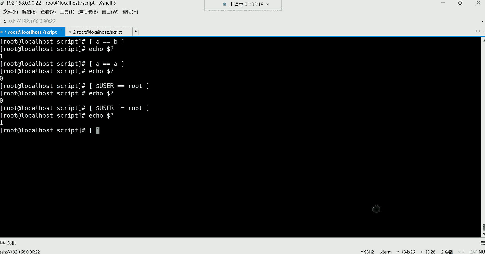

**重要区别**：直接使用 `=` 或 `==` 在 `[ ]` 中进行比较，系统会将其视为**字符串比较**。即使比较的是数字，如 `[ 1 = 1 ]`，系统也是将其作为字符“1”来处理的。要进行真正的整数比较，必须使用上述专用操作符。


```bash
[ 10 -gt 5 ]  # 判断10是否大于5，结果为真（返回0）
echo $?
```


## 字符串对比


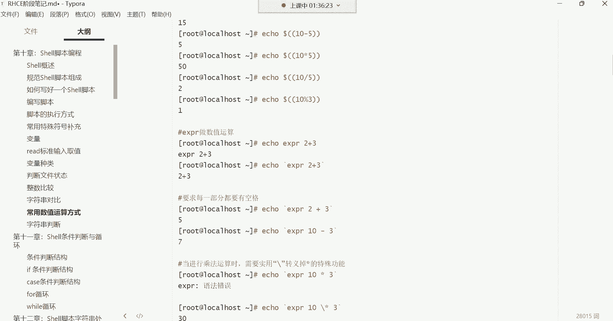

与整数比较相对应的是字符串对比。字符串对比使用我们更熟悉的符号。

以下是字符串对比的常用方法：

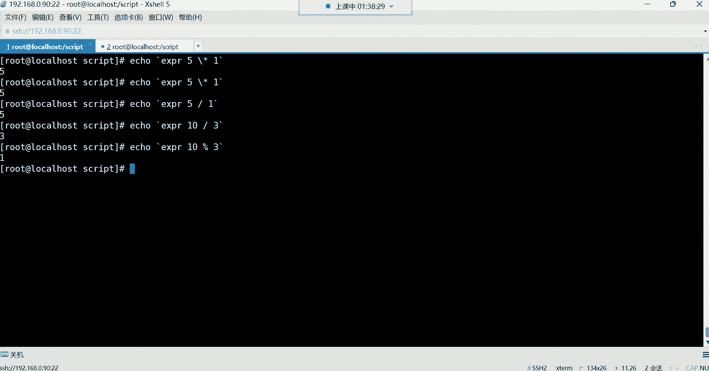


*   **`=` 或 `==`**：判断两个字符串是否相等。例如：`[ "$USER" = "root" ]`
*   **`!=`**：判断两个字符串是否不相等。例如：`[ "$USER" != "nobody" ]`


**使用注意**：变量建议用双引号引起来，防止变量值为空或包含空格时导致语法错误。字符串对比时，数字也会被当作字符处理。


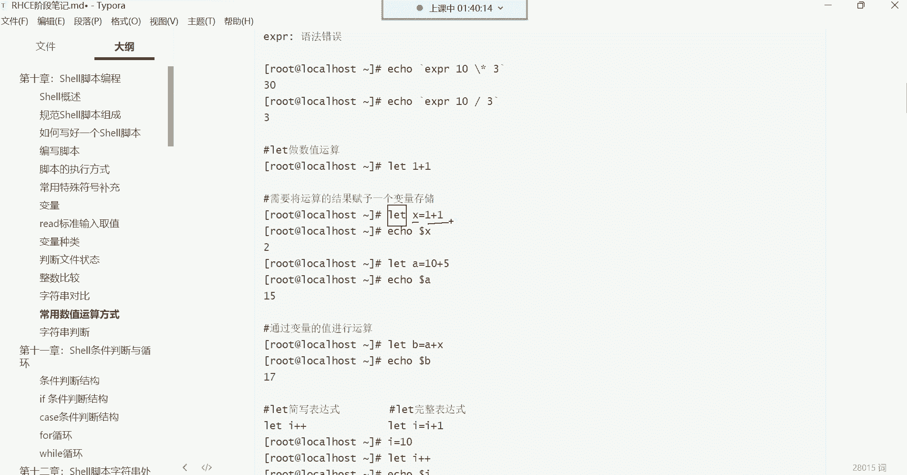

```bash
[ "$USER" = "root" ]  # 判断当前用户是否为root
echo $?
```


## 常用数值运算方式

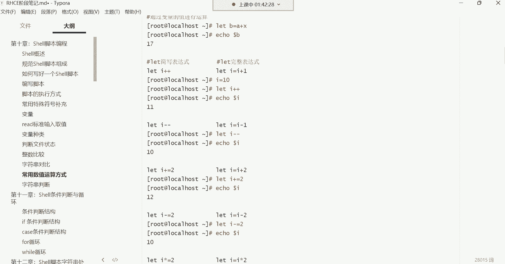

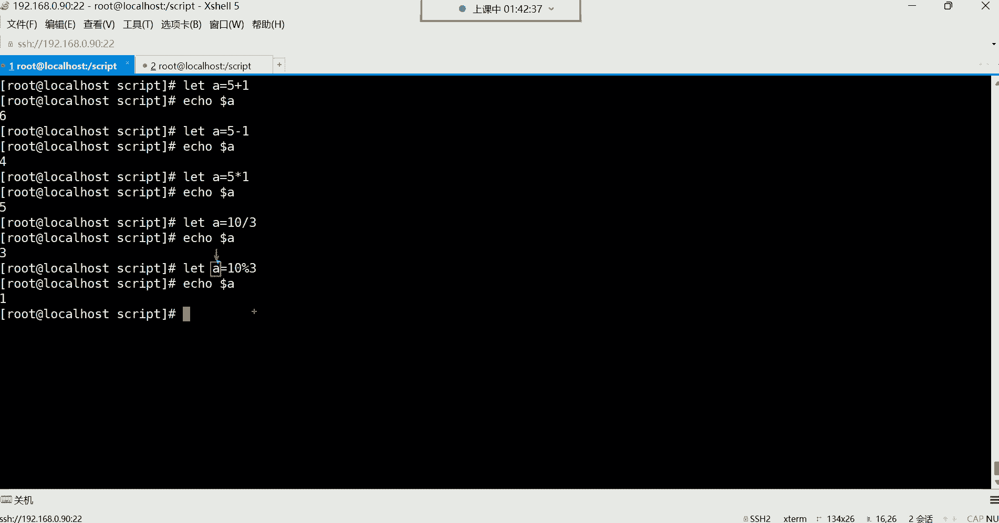


在脚本中，我们经常需要进行算术运算。Shell提供了多种数值运算的方法，各有特点。

以下是几种常用的数值运算方式：


1.  **`$[ ]` 方式**：这是比较简洁常用的一种。
    ```bash
    echo $[ 5 + 3 ]   # 输出 8
    echo $[ 10 / 3 ]  # 输出 3 (整数除法)
    echo $[ 10 % 3 ]  # 输出 1 (取余)
    ```


2.  **`$(( ))` 方式**：这是C语言风格的写法，功能与 `$[ ]` 类似。
    ```bash
    echo $(( 5 + 3 ))   # 输出 8
    ```


3.  **`expr` 命令**：一种较老的运算方式，格式要求严格。
    ```bash
    expr 1 + 1      # 输出 2 (运算符两侧必须有空格)
    expr 5 \* 2     # 输出 10 (乘号*需要转义)
    ```

4.  **`let` 命令**：通常用于将运算结果赋值给变量，在脚本中很常见，并且支持一些简写形式。
    ```bash
    let a=5+3       # 将运算结果赋值给变量a
    echo $a         # 输出 8

    let a++         # 等同于 a=a+1，变量a自增1
    let a+=2        # 等同于 a=a+2，变量a加2
    let a*=2        # 等同于 a=a*2，变量a乘以2
    ```


> **提示**：对于初学者，掌握 `$[ ]` 和 `let` 命令的基本用法即可。`let` 的简写形式（如 `i++`）在循环脚本中非常常见，看到时能理解其含义即可。

## 字符串判断


最后，我们学习如何判断一个字符串或变量的值是否为空。


以下是字符串判断的操作符：

*   **`-z`**：判断字符串长度是否为零（Zero）。如果为空，则返回真（0）。
    ```bash
    [ -z "$var" ]  # 判断变量var是否为空
    ```
*   **`-n`**：判断字符串长度是否非零（Non-zero）。如果不为空，则返回真（0）。
    ```bash
    [ -n "$var" ]  # 判断变量var是否非空
    ```

**应用示例**：可以用来判断变量是否被赋值，或者文件内容是否为空。
```bash
my_var="hello"
[ -n "$my_var" ] && echo "变量非空"  # 条件满足则执行echo
```


## 条件判断的简单应用：命令连接符


学习了这么多判断和运算，它们如何结合起来使用呢？本节介绍几个简单的命令连接符，它们可以基于前一个命令的执行结果来决定是否执行后一个命令，这是条件逻辑的雏形。

以下是三个常用的命令连接符：


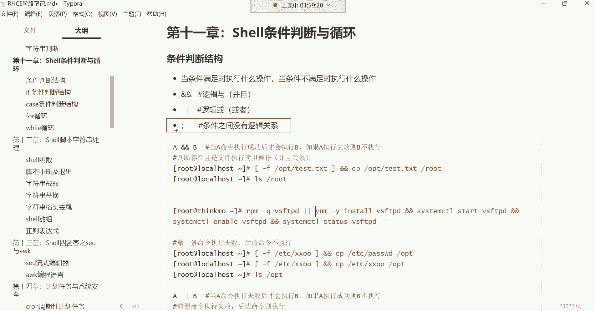

*   **`&&`（逻辑与）**：只有**前面**的命令执行成功（返回值为0），**后面**的命令才会执行。
    ```bash
    # 如果/etc/passwd文件存在，则将其拷贝到/opt目录
    [ -f /etc/passwd ] && cp /etc/passwd /opt
    ```

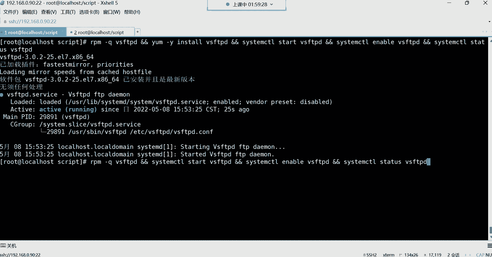

*   **`||`（逻辑或）**：只有**前面**的命令执行失败（返回值非0），**后面**的命令才会执行。
    ```bash
    # 如果vsftpd软件包未安装，则安装它
    rpm -q vsftpd || yum install -y vsftpd
    ```


*   **`;`（分号）**：没有任何逻辑关系。用于在一行内顺序执行多条命令，无论前一条命令成功与否，后一条都会执行。
    ```bash
    touch /tmp/test.txt; ls -l /tmp; date
    ```


**综合示例**：一个简单的软件安装检查脚本逻辑。
```bash
# 查询vsftpd是否安装，如果没安装则安装，安装后启动并设置开机自启
rpm -q vsftpd || yum install -y vsftpd && systemctl start vsftpd && systemctl enable vsftpd
```
**逻辑解释**：
1.  `rpm -q vsftpd`：查询包。
2.  如果查询失败（`||`），表示未安装，则执行 `yum install -y vsftpd`。
3.  如果安装成功（`&&`），则继续执行 `systemctl start vsftpd`。
4.  如果启动成功（`&&`），则继续执行 `systemctl enable vsftpd`。

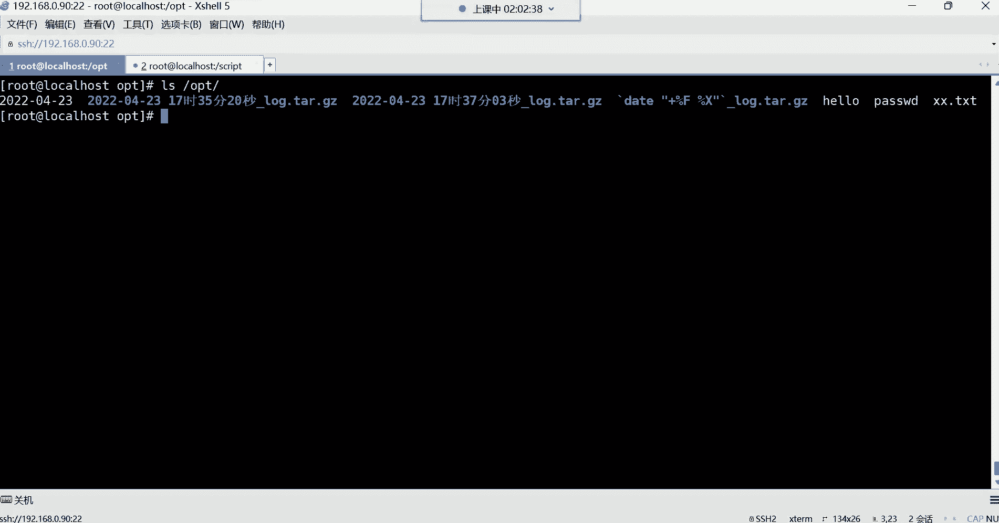


---


本节课中我们一起学习了Shell中关于判断和运算的基础知识。我们掌握了如何判断文件状态、进行整数和字符串的比较、使用几种方法进行数值运算，以及判断字符串是否为空。最后，我们还了解了 `&&`、`||`、`;` 这三个命令连接符，它们可以将简单的判断逻辑串联起来。这些是编写更复杂的条件判断语句（如 `if`）的基石，请务必理解其概念和用法。