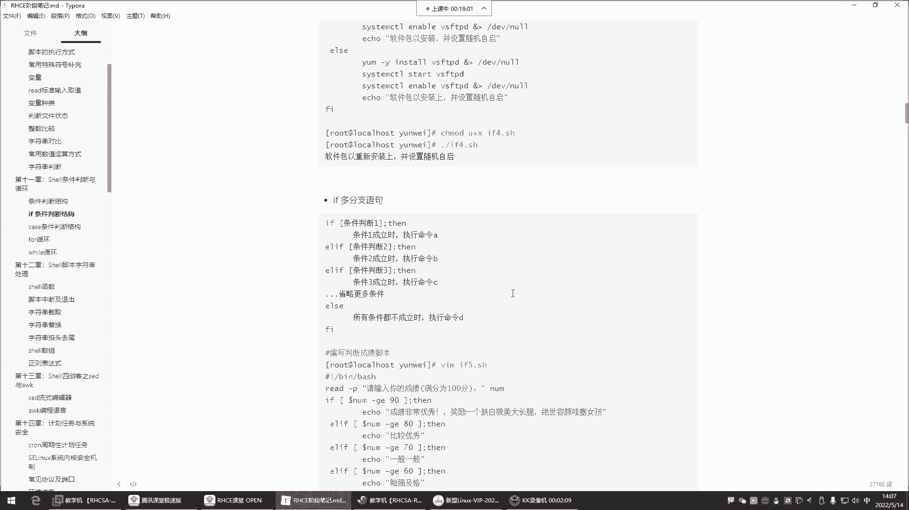
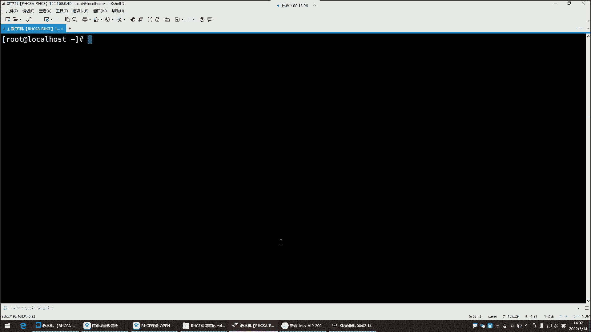
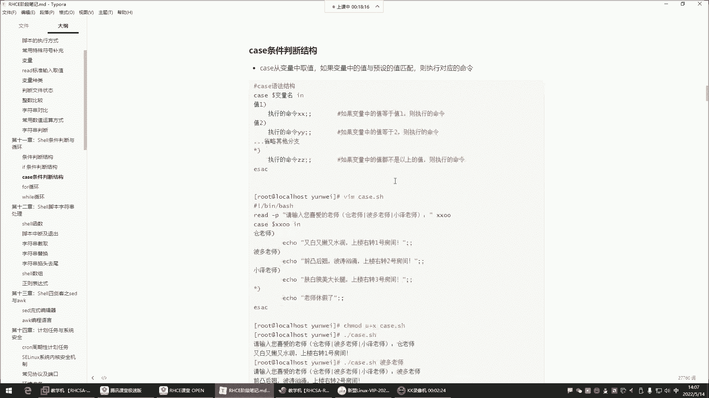
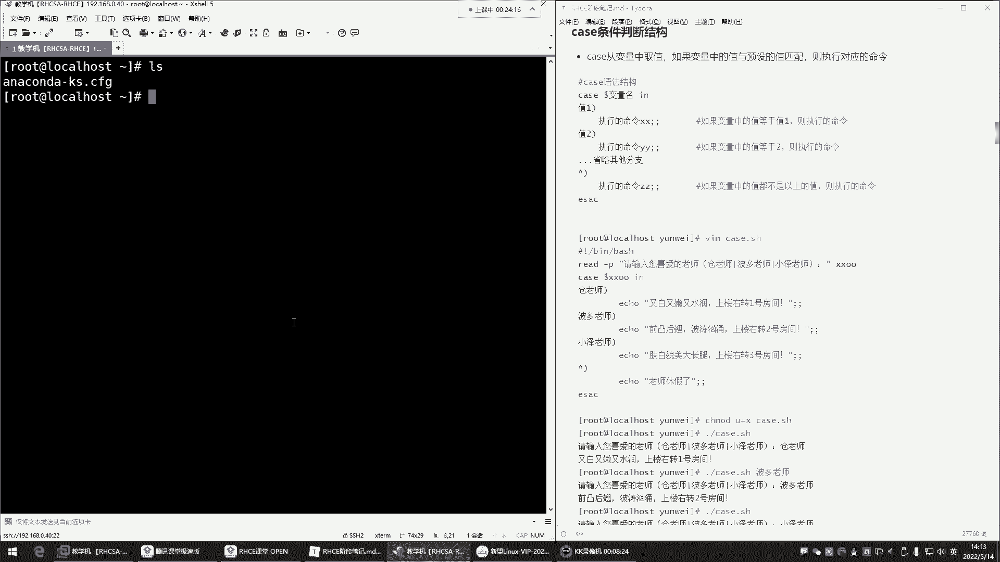
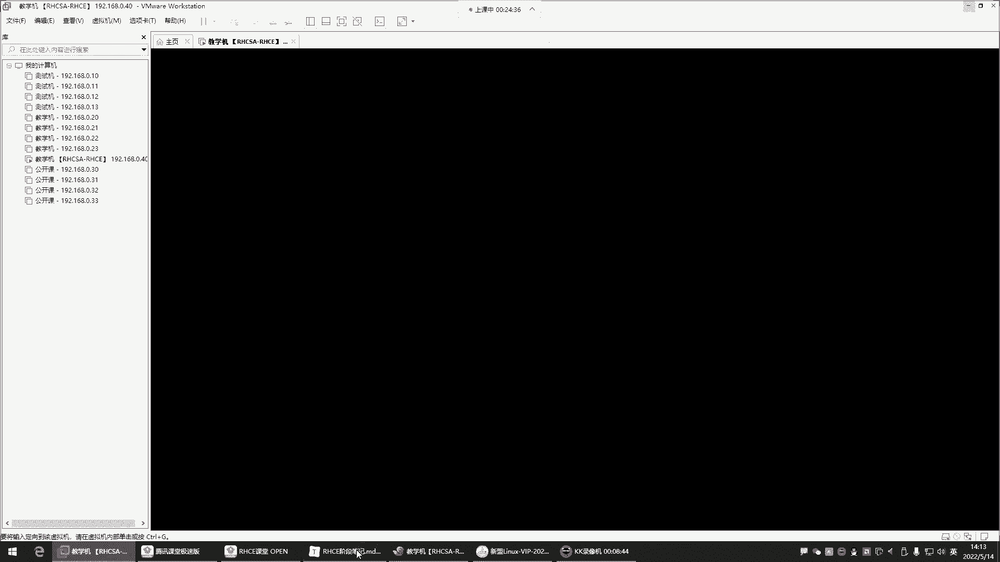
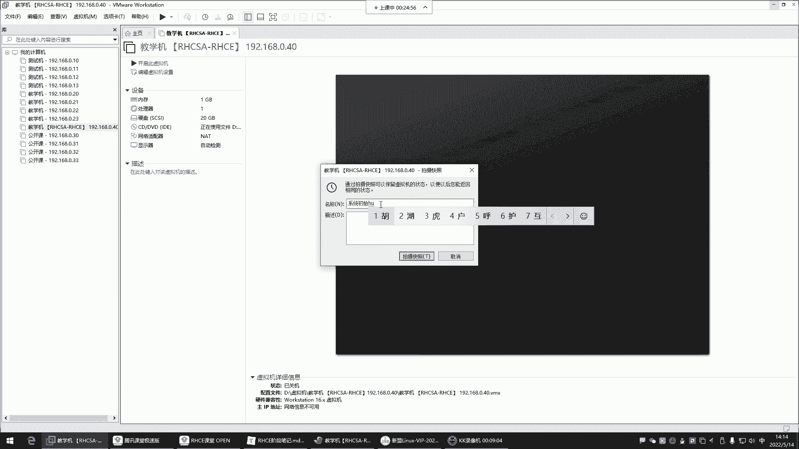
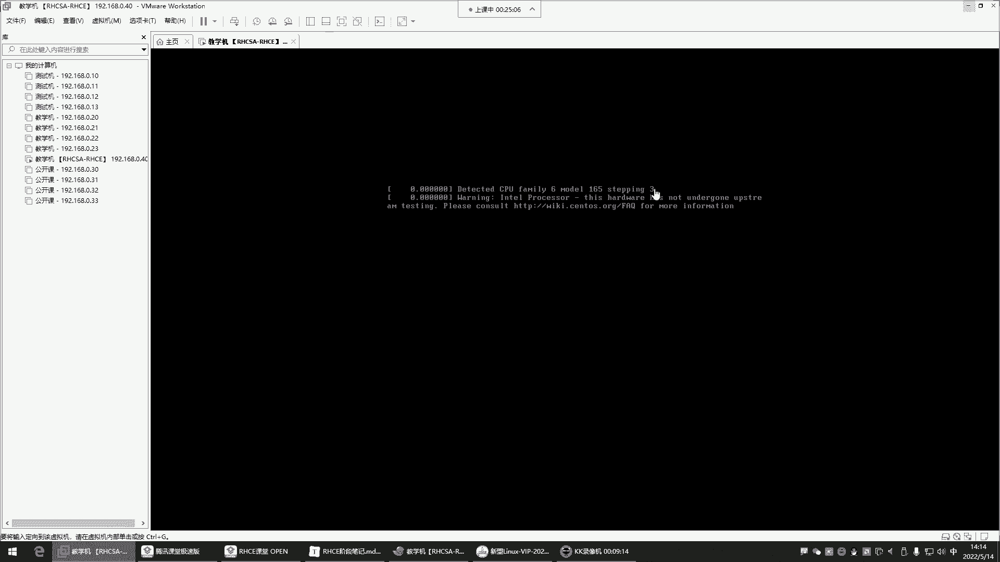
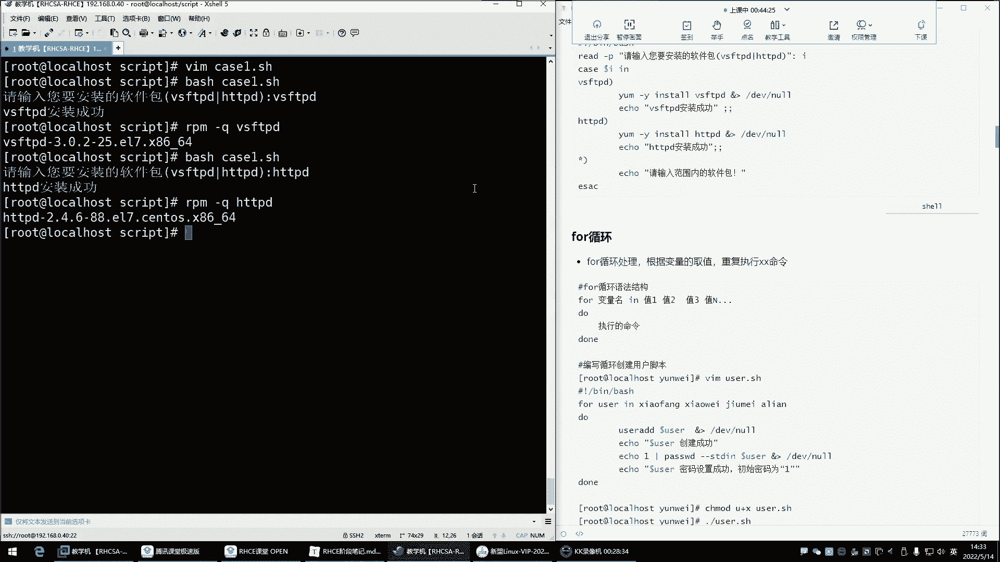
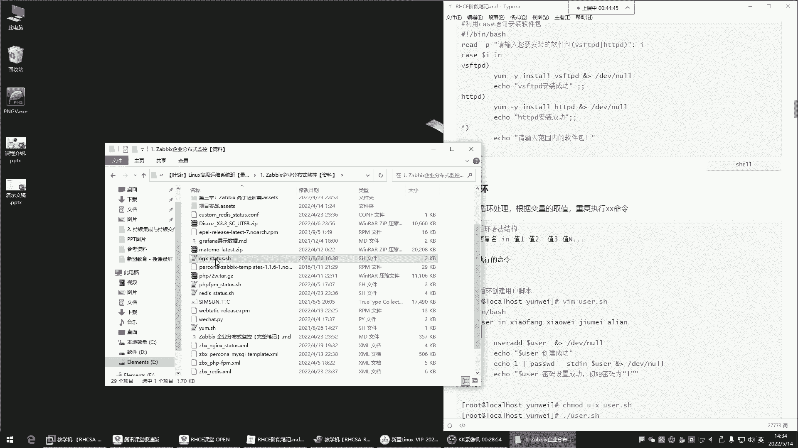
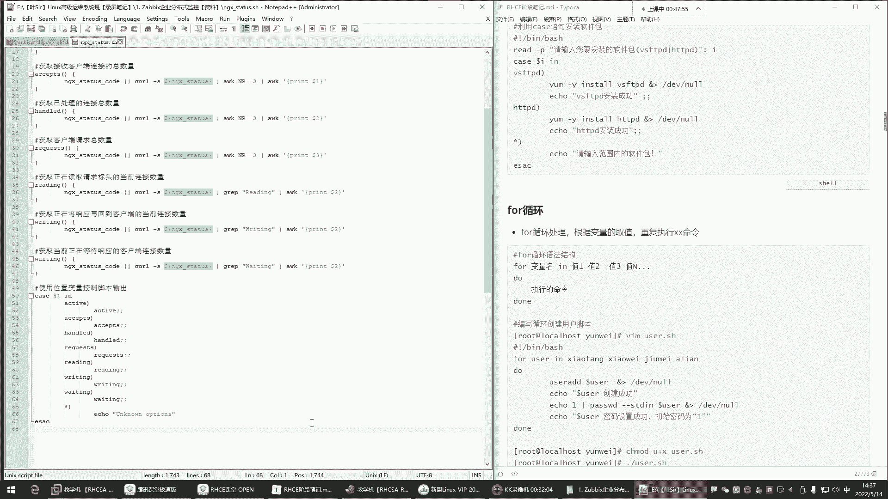

# Linux脚本编程：42：case条件判断与for循环







在本节课中，我们将学习Shell脚本中的`case`条件判断语句和`for`循环结构。它们是实现自动化任务和流程控制的重要工具。

## 概述

上一节我们介绍了`if`条件判断，本节中我们来看看另一种条件判断方式——`case`语句，以及用于重复执行任务的`for`循环。

## case条件判断

`case`语句的功能与`if`类似，都是根据条件执行不同的命令。它的特点是语法更简洁，适用于对单一变量进行多种固定值的匹配判断。









其核心语法结构如下：
```bash
case 变量名 in
"值1")
    命令序列1
    ;;
"值2")
    命令序列2
    ;;
*)
    默认命令序列
    ;;
esac
```
`case`语句会从变量中取值，并与预设的值进行匹配。匹配成功即执行对应的命令序列，并以`;;`表示该分支结束。如果所有预设值都不匹配，则执行`*)`分支的默认命令。整个语句以`esac`结尾。

以下是`case`语句的一个典型应用示例：
```bash
#!/bin/bash
read -p "请输入你喜欢的老师名字：" teacher
case $teacher in
"苍老师")
    echo "特点：又白又嫩又水润"
    echo "位置：上楼右转一号房间"
    ;;
"波多老师")
    echo "特点：前凸后翘，波涛汹涌"
    echo "位置：上楼右转二号房"
    ;;
"小泽老师")
    echo "特点：肤白貌美大长腿"
    echo "位置：上楼右转三号房"
    ;;
*)
    echo "该老师今日休息。"
    ;;
esac
```
这个脚本让用户输入老师名字，并根据输入显示不同的描述信息。如果输入不在预设列表中，则执行默认分支。

`case`语句也常用于根据用户选择执行不同的安装任务：
```bash
#!/bin/bash
read -p "请输入你要安装的软件包（vsftpd/httpd）：" package
case $package in
"vsftpd")
    yum -y install vsftpd &> /dev/null
    echo "vsftpd安装成功。"
    ;;
"httpd")
    yum -y install httpd &> /dev/null
    echo "httpd安装成功。"
    ;;
*)
    echo "请输入范围内的软件包。"
    ;;
esac
```
这个脚本根据用户输入的软件包名称，执行对应的安装命令。

## for循环

在介绍了条件判断后，我们来看如何让脚本重复执行任务，这就需要用到循环。`for`循环是其中最常用的一种，它用于遍历一个列表中的每个项目，并对每个项目执行相同的操作。

`for`循环的基本语法如下：
```bash
for 变量 in 项目列表
do
    命令序列
done
```
循环会依次将列表中的每个项目赋值给变量，并执行`do`和`done`之间的命令序列。

以下是`for`循环的几个基础应用示例：

1.  **遍历数字序列**：循环执行固定次数。
    ```bash
    #!/bin/bash
    for i in {1..5}
    do
        echo "这是第 $i 次循环。"
    done
    ```

2.  **遍历字符串列表**：对列表中的每个字符串执行操作。
    ```bash
    #!/bin/bash
    for name in Alice Bob Charlie
    do
        echo "Hello, $name!"
    done
    ```

3.  **遍历命令执行结果**：常用于处理文件或目录。
    ```bash
    #!/bin/bash
    for file in $(ls /tmp/*.log)
    do
        echo "正在处理文件: $file"
        # 可以在此处添加处理文件的命令，例如压缩、删除等
    done
    ```

`for`循环在系统管理中的一个典型应用是批量创建用户：
```bash
#!/bin/bash
for username in user01 user02 user03
do
    useradd $username
    echo "密码已设置为123456" | passwd --stdin $username
done
```
这个脚本会循环创建三个用户，并为它们设置初始密码。





## 总结

本节课中我们一起学习了Shell脚本中的`case`条件判断和`for`循环。
*   `case`语句提供了一种清晰、简洁的多分支条件判断方法，特别适合匹配固定的字符串值。
*   `for`循环则使我们能够轻松地重复执行任务，无论是遍历项目列表、数字序列还是命令输出结果。



掌握这两种结构，你将能编写出功能更强大、自动化程度更高的Shell脚本。