# Linux脚本编程：P43：case条件判断与for循环

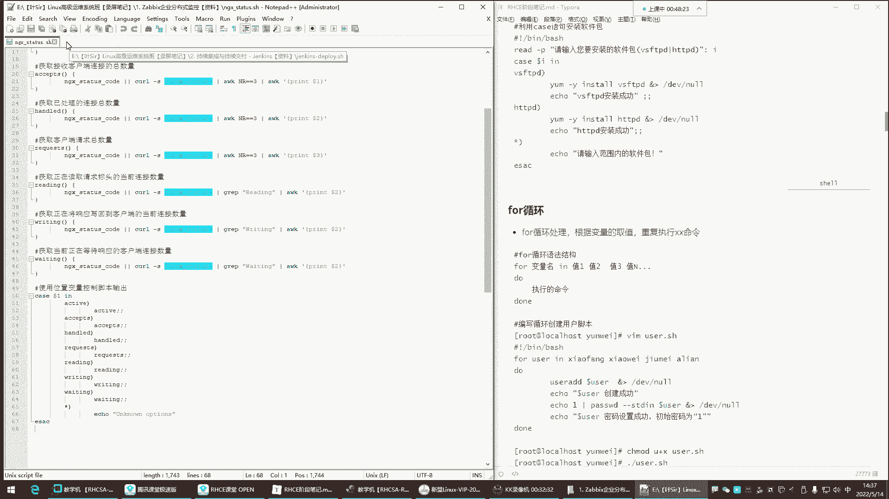


在本节课中，我们将学习Shell脚本中的两种重要结构：`case`条件判断语句和`for`循环语句。我们将通过具体的例子来理解它们的工作原理和实际应用场景。

## case条件判断语句

上一节我们介绍了基础的`if`条件判断，本节中我们来看看另一种更清晰的多分支判断结构——`case`语句。`case`语句用于根据变量的不同取值，执行不同的命令序列。

其基本语法结构如下：
```bash
case 变量 in
模式1)
    命令序列1
    ;;
模式2)
    命令序列2
    ;;
*)
    默认命令序列
    ;;
esac
```
当执行脚本时，需要给`case`语句中的变量传递一个值。脚本会根据该值匹配对应的模式，如果匹配成功，则执行该模式下的命令；如果所有模式都不匹配，则执行默认（用`*`表示）的命令。

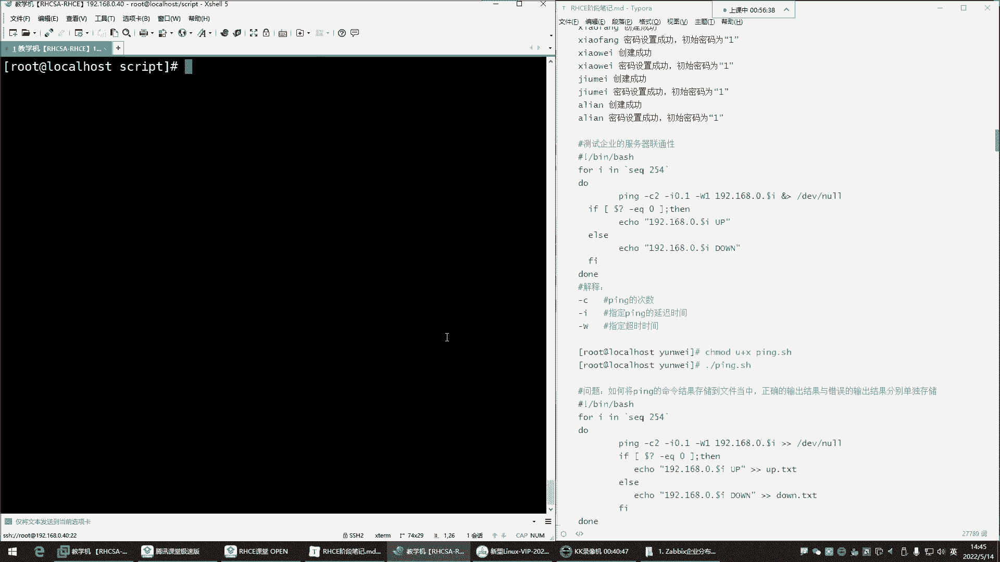

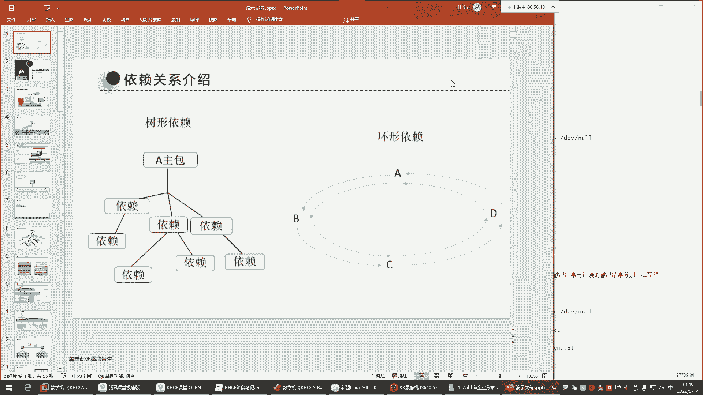


简单来说，`case`语句就是一个多路判断工具，条件成功则执行对应命令，条件失败则不执行。

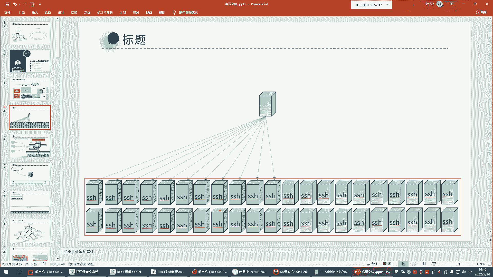

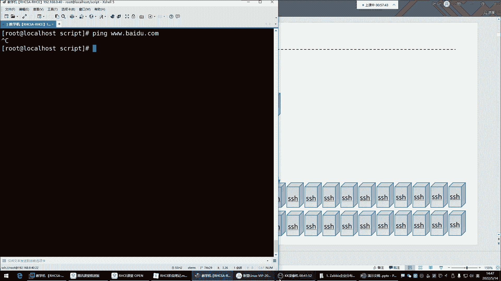

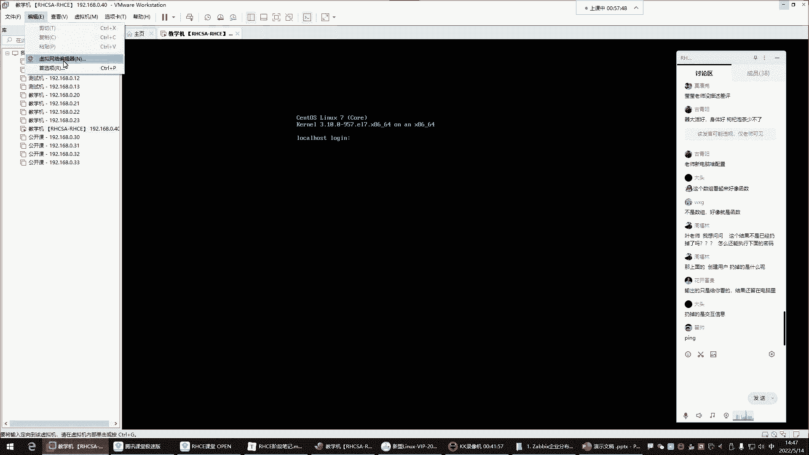

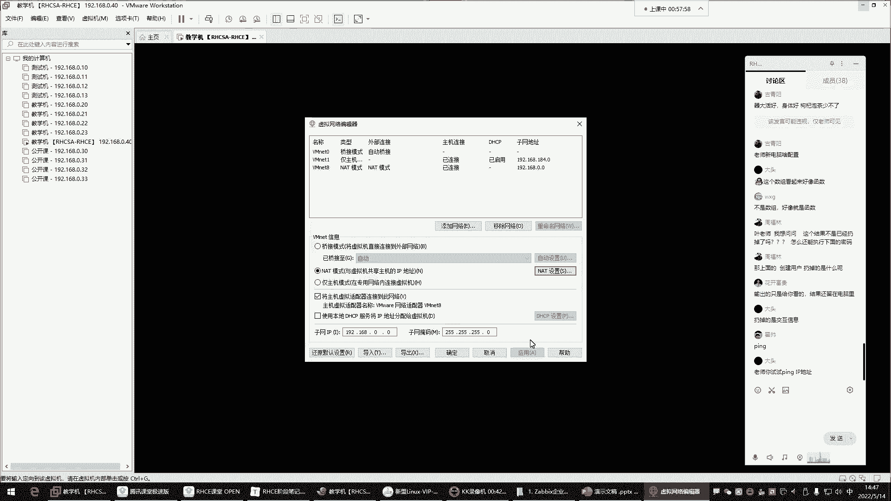

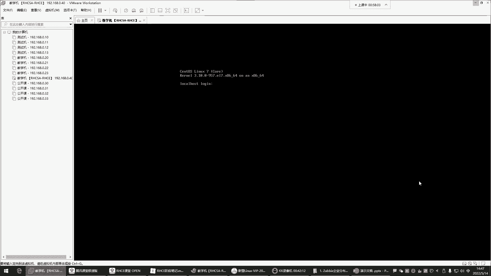

## for循环语句

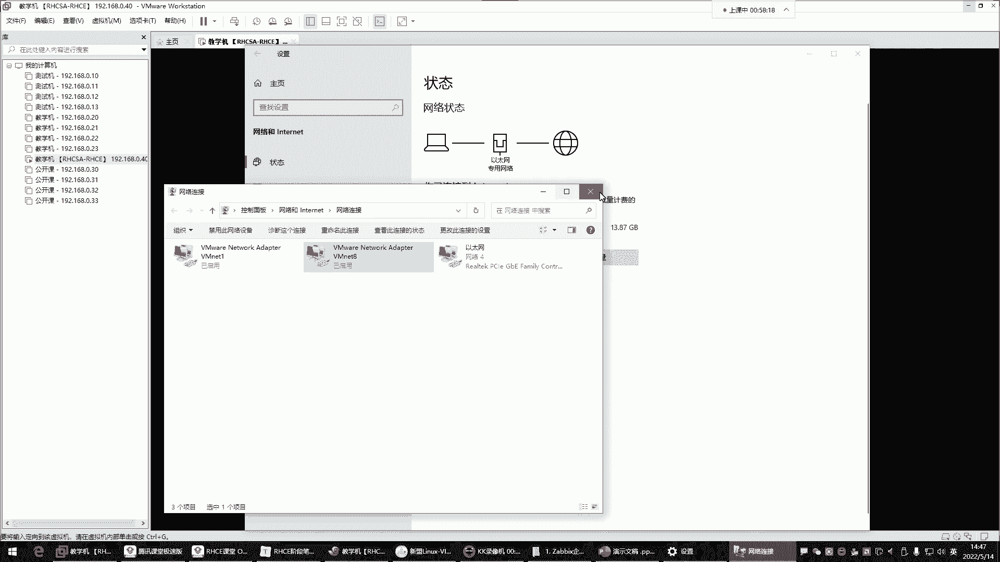

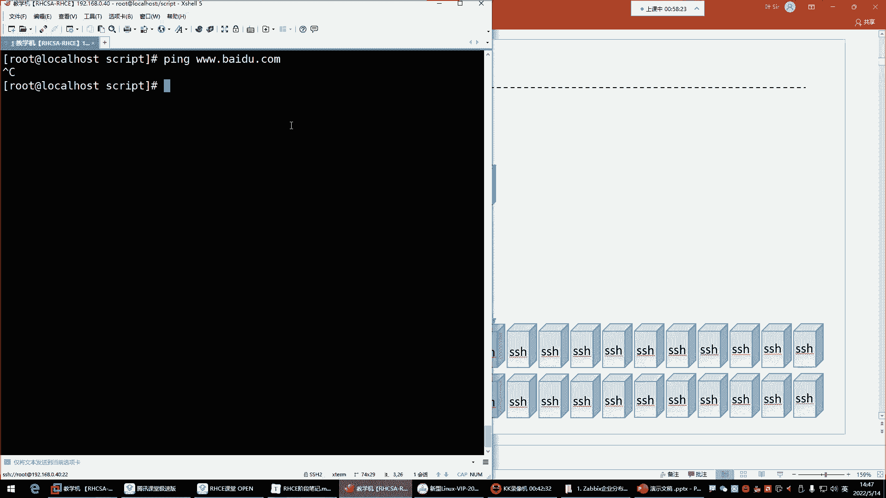

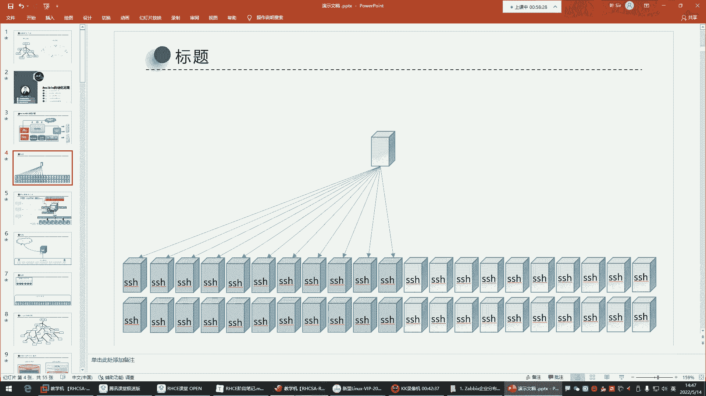

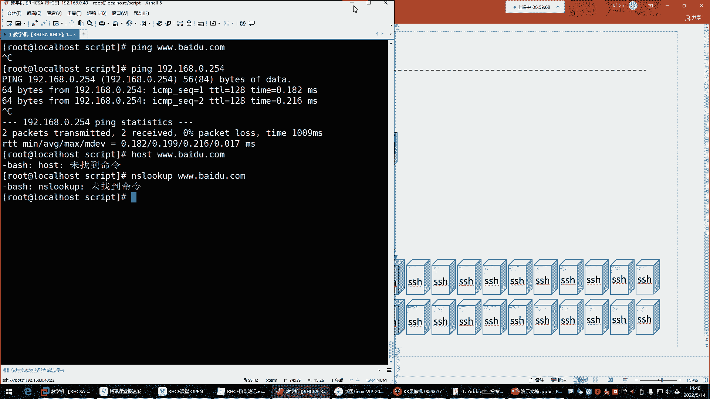

了解了`case`判断后，我们来看看如何让脚本重复执行任务，这就需要用到循环。`for`循环可以根据变量取值，重复执行一系列命令。

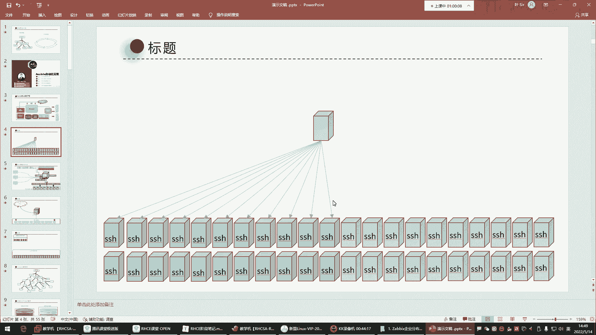


`for`循环的基本语法是：
```bash
for 变量名 in 值列表
do
    命令序列
done
```
循环会对`in`关键字后面的值列表进行遍历。每次循环，都会将列表中的一个值赋给变量，然后执行`do`和`done`之间的命令。当列表中的所有值都被遍历后，循环结束。

为了更直观地理解，我们来看一个创建用户的脚本例子。

以下是`for`循环创建用户的脚本示例：
```bash
#!/bin/bash
for user in xiaofang xiaowei jiumei alian
do
    useradd $user
    echo “用户 $user 创建成功”
    echo “1” | passwd --stdin $user &> /dev/null
    echo “用户 $user 密码设置成功”
done
```
脚本执行过程如下：
1.  第一次循环，变量`user`的值为“xiaofang”，脚本执行创建用户“xiaofang”并设置密码的命令。
2.  本次循环结束后，回到`in`后面查看下一个值“xiaowei”，开始第二次循环。
3.  如此重复，直到值列表中的“alian”也被处理完毕，整个循环结束。

这个例子展示了`for`循环如何帮助我们自动化重复性任务。

## for循环实践：测试服务器连通性

`for`循环的一个典型应用是批量测试网络中服务器的连通性。例如，作为系统维护员，需要快速检查一批服务器（IP地址为192.168.0.1到192.168.0.254）是否在线。

手动逐个ping测试显然不现实，我们可以用`for`循环自动完成。

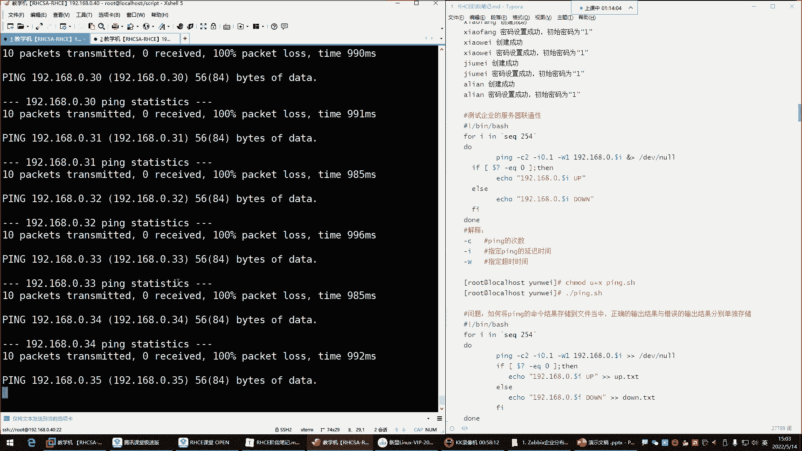

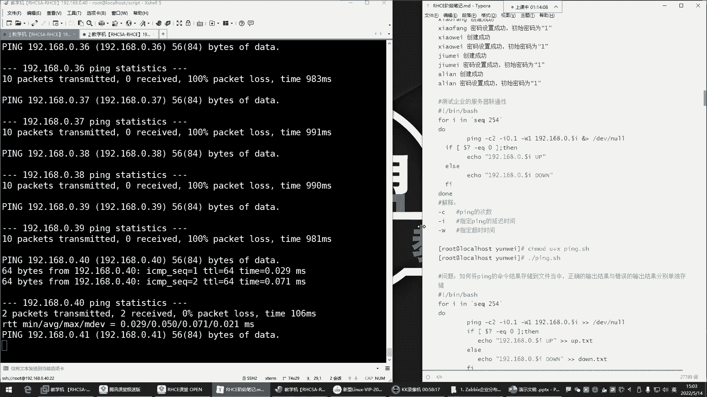

首先，我们尝试一个基础版本：
```bash
#!/bin/bash
for ip in 192.168.0.{1..254}
do
    ping -c 2 -i 0.1 -W 1 $ip
done
```
这里使用了`{1..254}`来生成数字序列。`-c 2`表示ping 2次，`-i 0.1`设置间隔为0.1秒，`-W 1`设置超时时间为1秒，以加快测试速度。

但直接运行上述脚本，输出会非常杂乱。我们通常需要对结果进行整理和判断。

以下是优化后的脚本，它会将在线和离线的服务器IP分别记录到不同文件：
```bash
#!/bin/bash
for ip in 192.168.0.{1..254}
do
    ping -c 2 -i 0.1 -W 1 $ip &> /dev/null
    if [ $? -eq 0 ]; then
        echo “$ip is UP” >> /opt/net_up.txt
    else
        echo “$ip is DOWN” >> /opt/net_down.txt
    fi
done
```
脚本说明：
*   `ping ... &> /dev/null`：将ping命令的所有输出丢弃，不显示在屏幕上。
*   `$?`：这是一个特殊变量，用于获取上一条命令（即ping）的执行返回值。返回值为0通常表示成功（即ping通）。
*   `[ $? -eq 0 ]`：这是一个条件判断，`-eq`用于比较两个整数是否相等。这里判断上一条命令是否成功执行。
*   `>>`：将输出内容追加到文件末尾，避免覆盖原有内容。

你可以使用`&`符号将脚本放到后台运行：
```bash
bash ping_scan.sh &
```
然后，就可以通过查看`/opt/net_up.txt`和`/opt/net_down.txt`文件来快速了解所有服务器的状态。

**补充说明：生成数字序列的另一种方法**
除了使用`{1..254}`，还可以使用`seq`命令来生成数字序列：
```bash
for ip in $(seq 1 254)
do
    ping -c 2 192.168.0.$ip
done
```
`$(seq 1 254)`的作用与`{1..254}`相同。

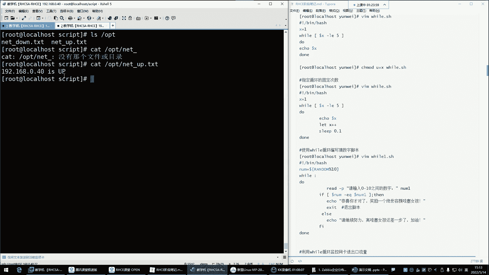


## 本节课总结

本节课中我们一起学习了Shell脚本编程中的两个核心结构。
1.  **case条件判断**：用于实现清晰的多分支选择逻辑，根据变量值匹配不同模式并执行相应命令。
2.  **for循环**：用于自动化重复性任务，通过遍历一个值列表来重复执行命令序列。我们通过创建用户和批量测试服务器连通性两个实例，深入理解了`for`循环的语法和应用方法。

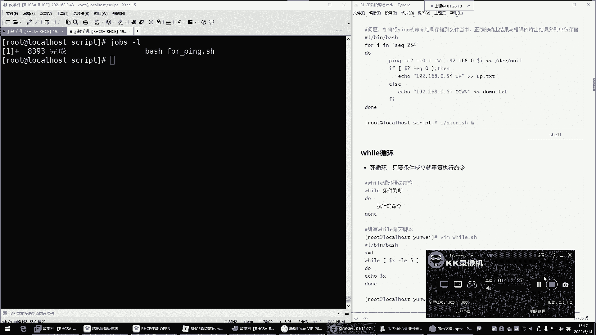

掌握这两种结构，将极大增强你编写自动化脚本的能力。