# Linux运维教程：P45：shell函数、脚本中断及退出、字符串处理

在本节课中，我们将学习Shell脚本编程中的三个核心概念：**while循环的持续监控应用**、**函数的定义与使用**，以及**脚本流程控制（中断与退出）**。这些知识将帮助你编写更高效、更智能的脚本。

## 🔁 while循环的持续监控应用

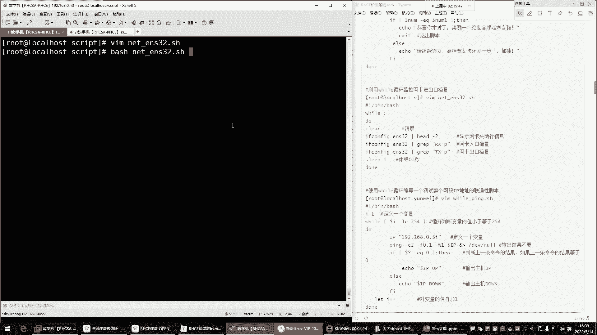

上一节我们介绍了while循环的基本语法，本节中我们来看看如何利用while循环执行持续性的监控任务。

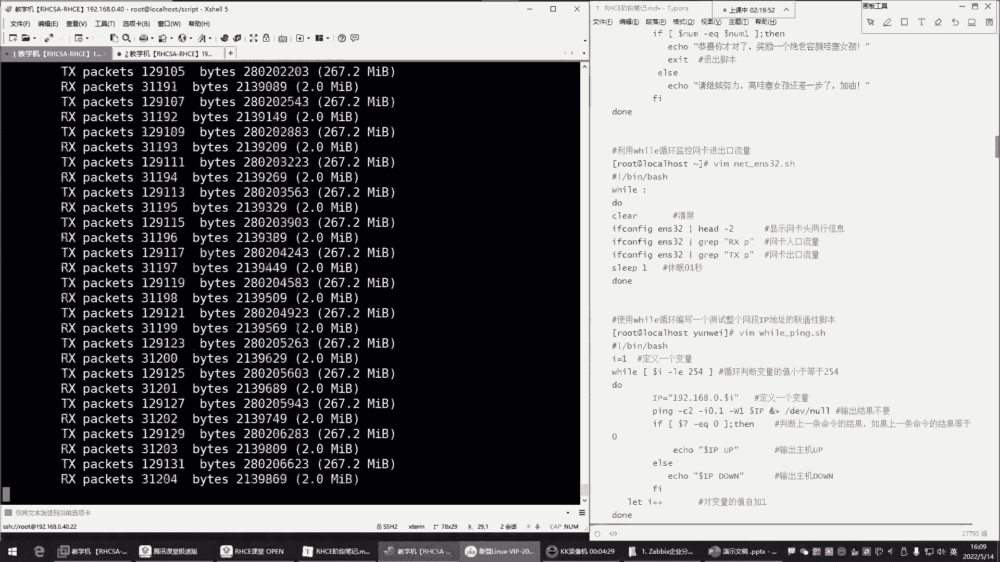

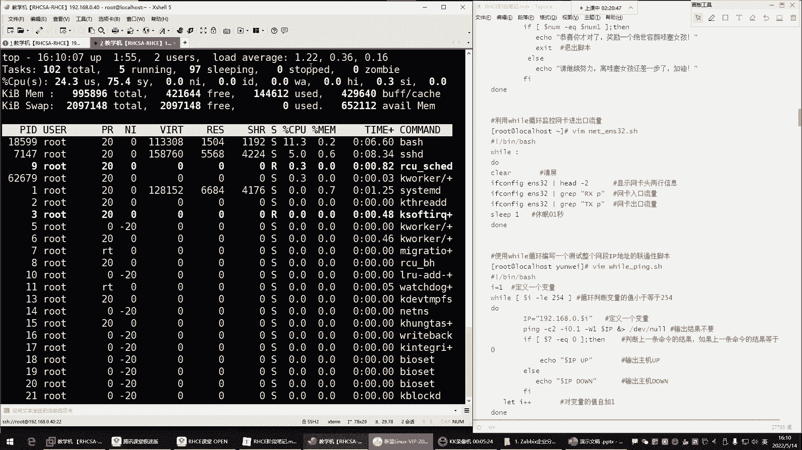

很多情况下，我们需要循环持续工作，例如监控网卡流量、内存或CPU使用率。这种监控没有明确的结束条件，因此适合使用死循环。

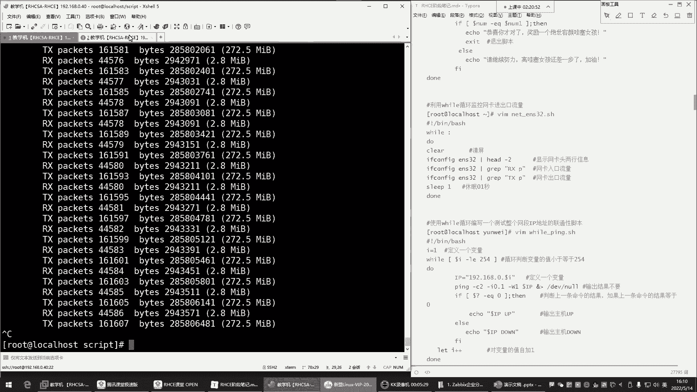

while循环的死循环有多种写法：
*   `while :`
*   `while true`
*   `while t` (同样是true的表示)

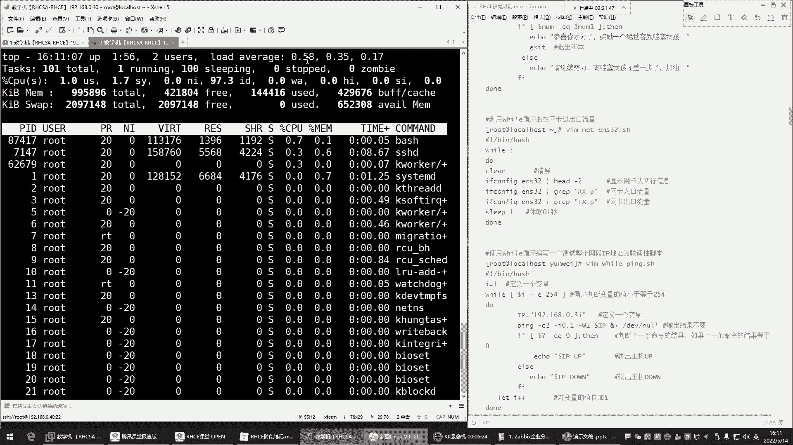

其中，`while :` 的写法较为简洁。

以下是监控网卡流量的一个基础示例：

```bash
#!/bin/bash
while :
do
    # 获取ens32网卡的入口流量
    ifconfig ens32 | grep "RX"
    # 获取ens32网卡的出口流量
    ifconfig ens32 | grep "TX"
done
```

直接运行上述脚本会导致CPU使用率急剧上升，因为循环执行速度过快。为了解决这个问题，我们可以在循环内使用 `sleep` 命令让脚本暂停片刻。

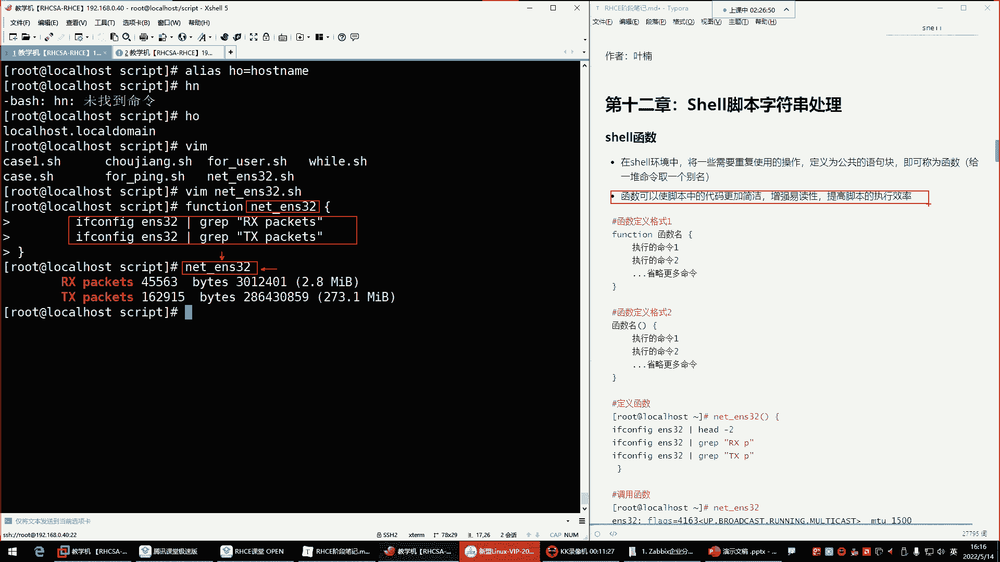

```bash
#!/bin/bash
while :
do
    clear  # 清屏，使输出更清晰
    ifconfig ens32 | grep "RX"
    ifconfig ens32 | grep "TX"
    sleep 0.2  # 每次循环暂停0.2秒，降低CPU负载
done
```
加入 `sleep` 和 `clear` 命令后，脚本既能持续监控，又不会过度消耗系统资源，输出结果也更清晰易读。

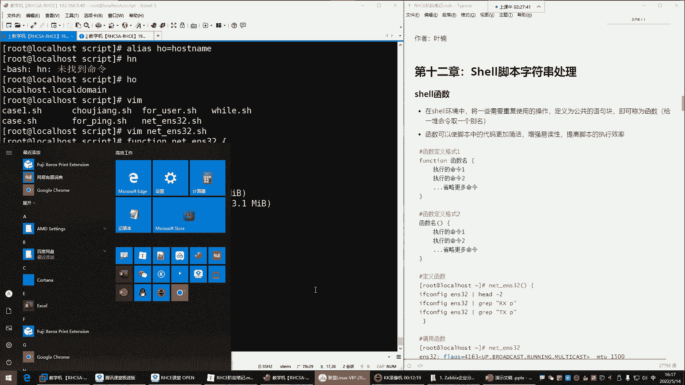

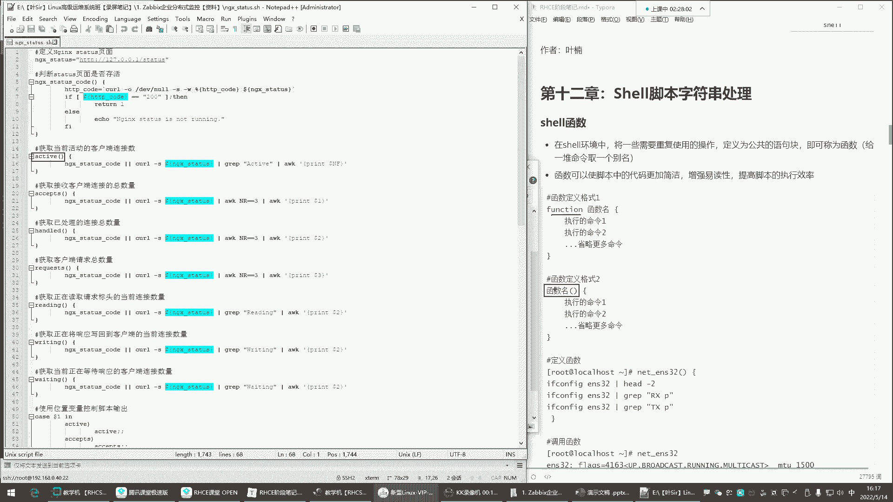

while循环也可用于测试网络连通性，但此类任务通常更直接地使用 `for` 循环来实现。

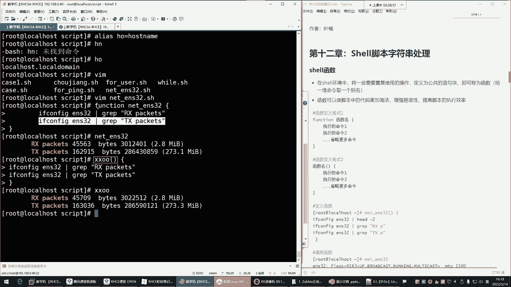

## 📦 Shell函数：给一组命令起别名

函数可以将一系列需要重复使用的操作封装成一个公共的语句块。你可以将其理解为**给一组命令起一个别名**。

这与 `alias` 命令类似，但功能更强大。`alias` 只能为单条命令设置别名，而函数可以封装任意多条命令。

函数有两种定义格式，第二种更为常用：

**格式一：使用 `function` 关键字**
```bash
function 函数名 {
    命令1
    命令2
    ...
}
```

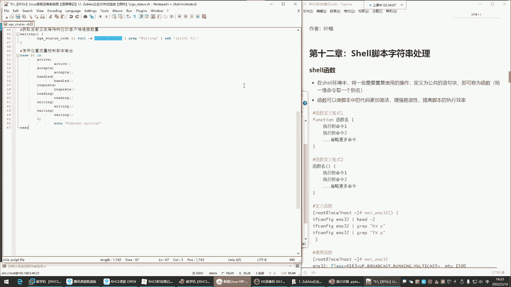

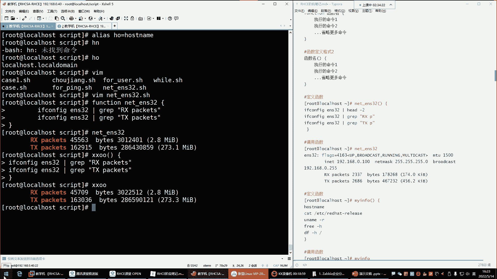

**格式二：直接使用函数名和小括号（推荐）**
```bash
函数名() {
    命令1
    命令2
    ...
}
```

定义函数后，在脚本中需要执行这些命令时，只需调用函数名即可。

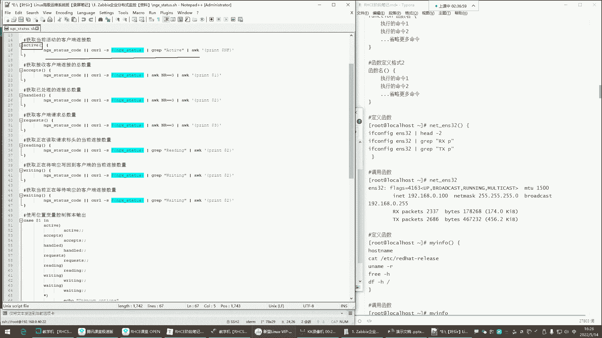

以下是函数的一个简单示例，它封装了查看系统信息的几条命令：

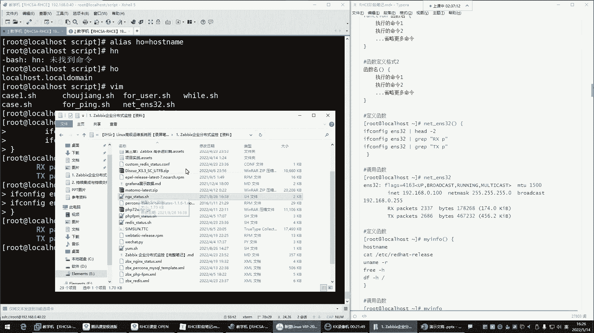

```bash
sys_info() {
    hostname      # 查看主机名
    cat /etc/redhat-release  # 查看系统版本
    free -h       # 查看内存使用情况
    df -h /       # 查看根分区使用情况
}
```
定义好 `sys_info` 函数后，在命令行或脚本中执行 `sys_info`，就会依次运行上述所有命令。

在复杂的脚本中，函数能大幅提高代码的简洁性、易读性和执行效率。它允许你将功能模块化，并在脚本的不同位置多次调用。

## ⏹️ 脚本的中断与退出：控制脚本执行流程

在脚本执行过程中，有时我们需要根据条件提前结束循环或整个脚本。这就需要用到流程控制命令：`continue`、`break` 和 `exit`。

以一个简单的 `for` 循环脚本为例：

```bash
#!/bin/bash
for i in {1..5}
do
    echo $i
done
echo "over"
```
这个脚本会输出数字1到5，然后输出“over”。

**1. `continue`：结束本次循环，进入下一次循环**
`continue` 会跳过循环体内**剩余的命令**，直接开始下一轮循环。
```bash
#!/bin/bash
for i in {1..5}
do
    [ $i -eq 3 ] && continue  # 当i等于3时，跳过本次循环
    echo $i
done
echo "over"
```
执行结果：`1 2 4 5 over`。数字3被跳过。

**2. `break`：结束整个循环**
`break` 会立即终止它所在的**整个循环**，但会继续执行循环体之后的脚本命令。
```bash
#!/bin/bash
for i in {1..5}
do
    [ $i -eq 3 ] && break  # 当i等于3时，终止整个循环
    echo $i
done
echo "over"
```
执行结果：`1 2 over`。循环在i=3时终止，但“over”依然被输出。

**3. `exit`：退出整个脚本**
`exit` 会立即**终止整个脚本**的执行，包括循环体外的所有命令。
```bash
#!/bin/bash
for i in {1..5}
do
    [ $i -eq 3 ] && exit  # 当i等于3时，退出整个脚本
    echo $i
done
echo "over"
```
执行结果：`1 2`。脚本在i=3时直接退出，“over”不会被输出。

这些命令在需要根据条件（如用户猜对答案、检测到特定IP地址）控制脚本行为时非常有用。

## ✂️ 字符串处理（了解即可）

在脚本中进行判断或测试时，经常需要从命令结果中过滤和提取特定字符串。Shell提供了字符串截取等功能。

定义一个变量并查看其长度：
```bash
phone="13800138000"
echo ${#phone}  # 输出：11，表示字符串长度为11
```

**字符串截取语法：**
`${变量名:起始位置:截取长度}`
*   起始位置从 **0** 开始计数。
*   截取长度是可选的，如果不指定，则截取到字符串末尾。

```bash
phone="13800138000"
echo ${phone:0:3}   # 输出：138，从第0位开始，截取3位
echo ${phone:3:4}   # 输出：0013，从第3位开始，截取4位
echo ${phone:7}     # 输出：8000，从第7位开始，截取到末尾
```
字符串处理功能在需要对文本进行精细操作时使用，初学者了解其基本用法即可。

---

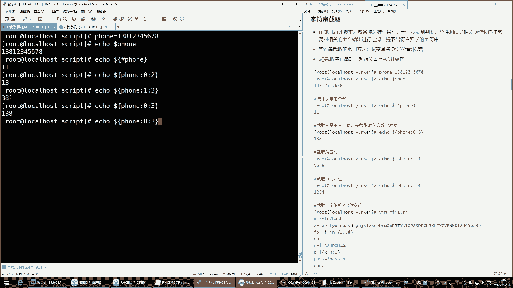

本节课中我们一起学习了while循环在监控场景下的实际应用、如何使用函数来封装和复用代码块，以及通过`continue`、`break`和`exit`命令来控制脚本的执行流程。这些是编写高效、可维护Shell脚本的重要基础。字符串处理作为补充知识，大家有所了解即可。