# Linux运维教程：P46：Shell字符串处理与脚本实践

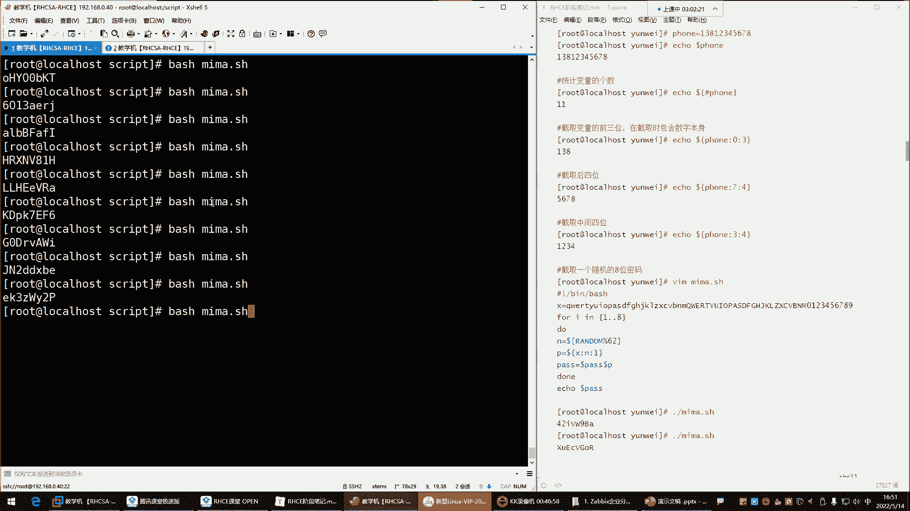

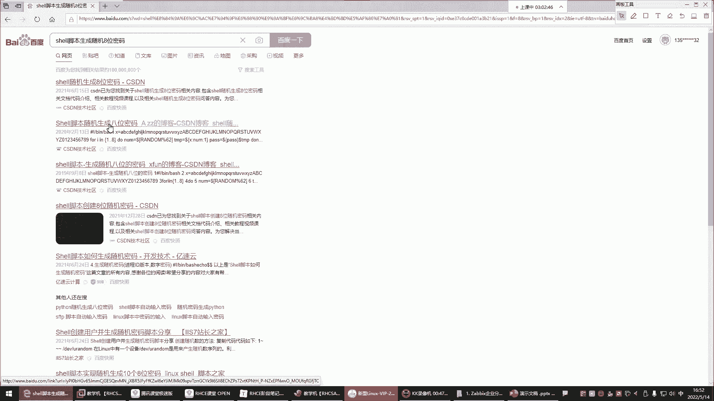

在本节课中，我们将学习Shell脚本中的字符串处理技巧，包括截取、替换和掐头去尾等操作。同时，我们也将探讨一个重要的理念：在运维工作中，学会借鉴和修改现有脚本往往比从零开始编写更为高效。

## 字符串截取

字符串截取是Shell脚本中处理文本的常见操作，其基本语法是 `${变量名:起始位置:长度}`。这里的起始位置从0开始计数。

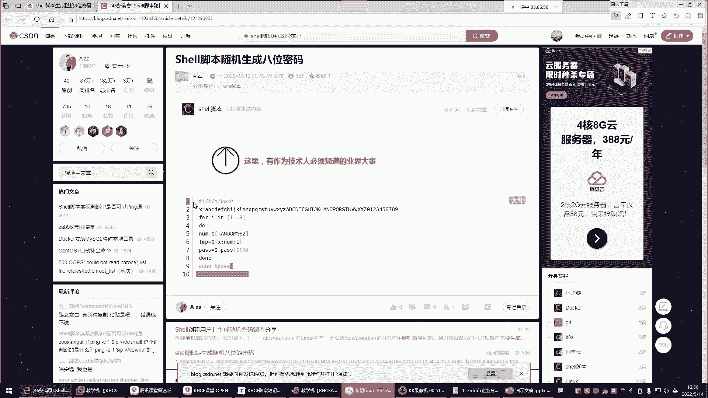

例如，我们有一个变量 `phone="13812345678"`，想要截取后四位“5678”：
```bash
phone="13812345678"
echo ${phone:7:4}
```
执行上述命令，将从第7位（即数字‘5’）开始，向后截取4位字符，输出结果为“5678”。

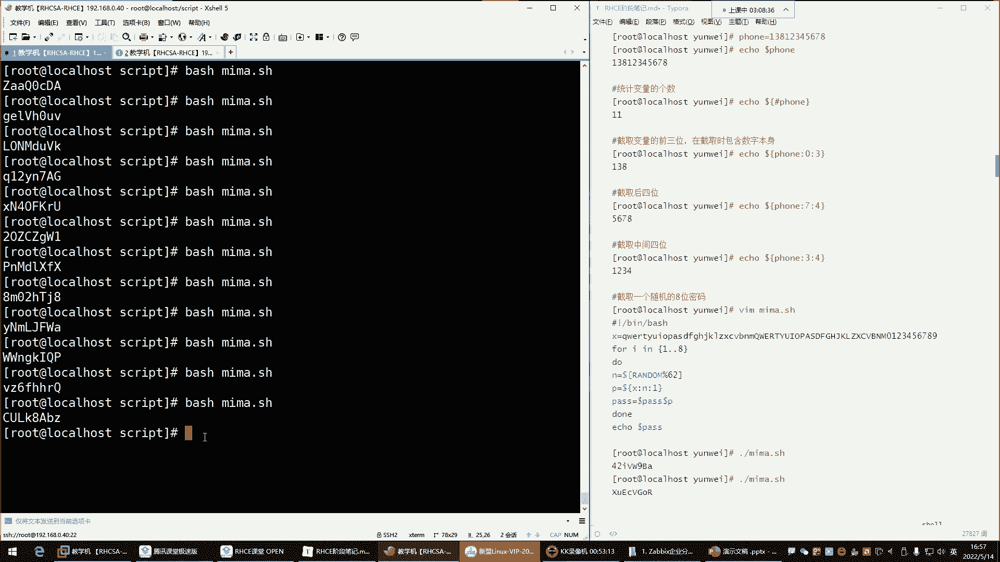

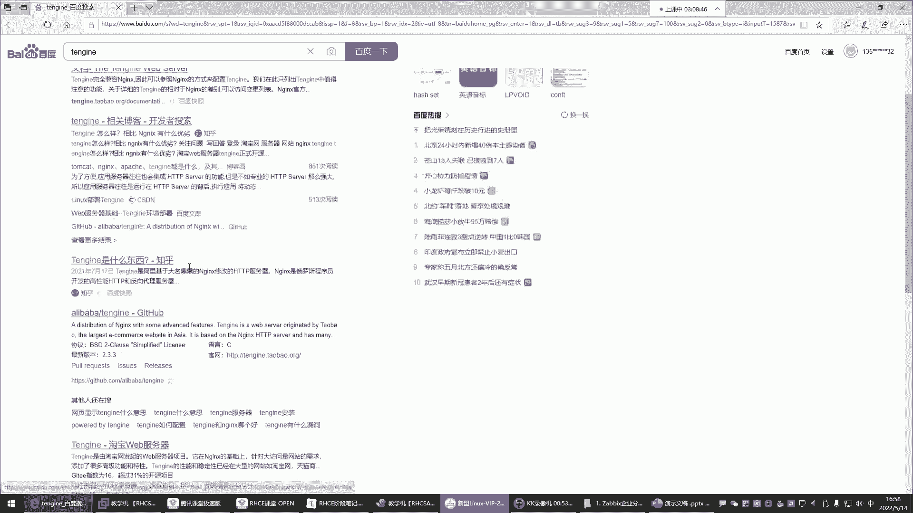

字符串截取功能非常灵活，不仅可以处理数字，也可以用于截取文件内容或其他文本数据。

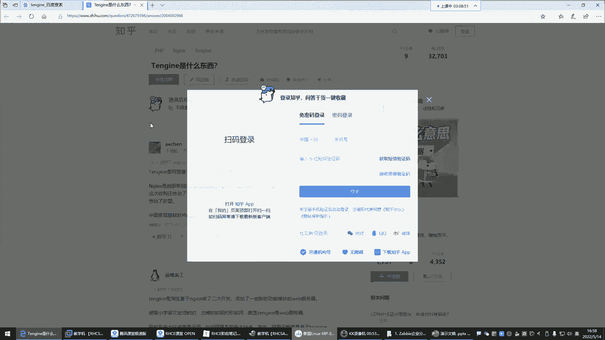

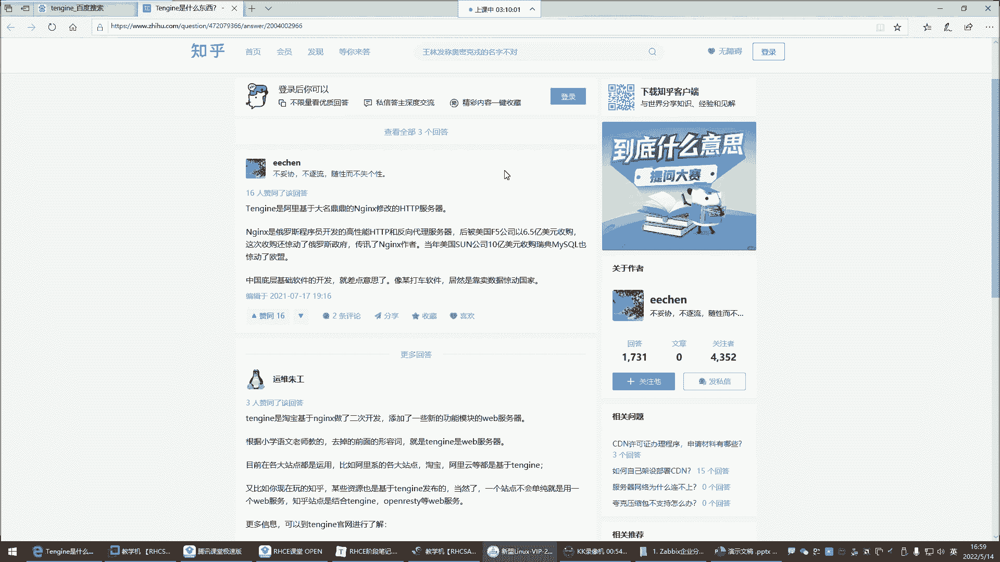

## 生成随机密码示例

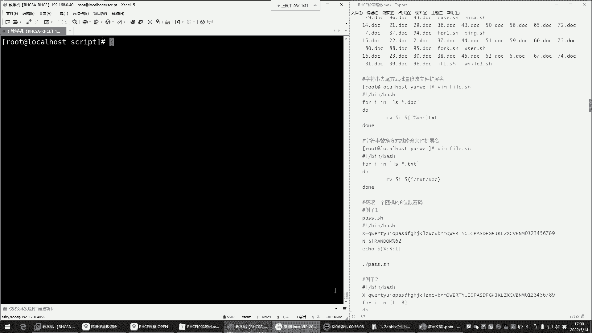

上一节我们介绍了字符串截取，本节中我们来看看如何利用它来生成随机密码。Shell作为一门脚本语言，支持变量、循环、函数等编程特性，可以实现复杂的功能。

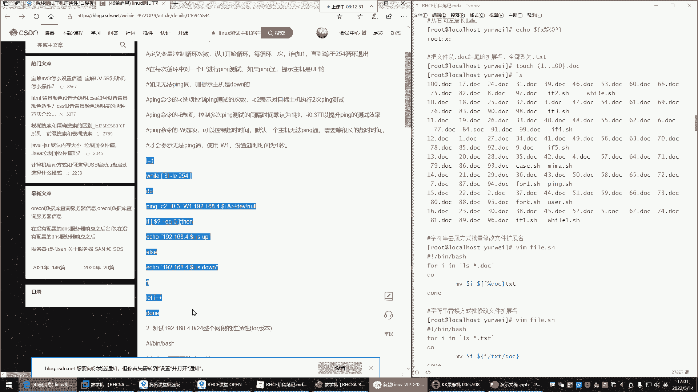

以下是生成随机8位密码的一个脚本示例：
```bash
#!/bin/bash
# 定义包含大小写字母和数字的字符串
str="abcdefghijklmnopqrstuvwxyzABCDEFGHIJKLMNOPQRSTUVWXYZ0123456789"
pass=""
# 循环8次，每次随机选取一个字符
for i in {1..8}
do
    num=$[RANDOM%62]  # 生成0-61的随机数
    tmp=${str:num:1}  # 从字符串中截取一位
    pass=$pass$tmp    # 将截取的字符拼接到密码中
done
echo $pass
```
这个脚本的思路是：
1.  将62个可能字符（26小写+26大写+10数字）存入变量。
2.  通过循环8次，每次利用 `$RANDOM` 生成一个随机数并对62取余，确保数值在0-61之间。
3.  根据这个随机数作为起始位置，从字符集中截取一位。
4.  将每次截取的字符拼接起来，最终形成一个8位的随机密码。

**核心提示**：在实际工作中，类似的需求通常不需要自己从头编写。善于利用网络资源，搜索现成的、经过验证的脚本，是提升效率的重要途径。关键在于能够理解并适当修改这些脚本，使其适应自己的环境。

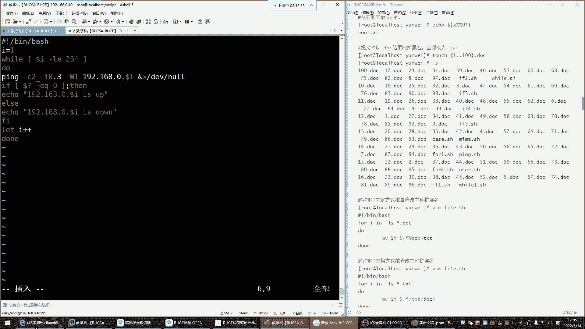

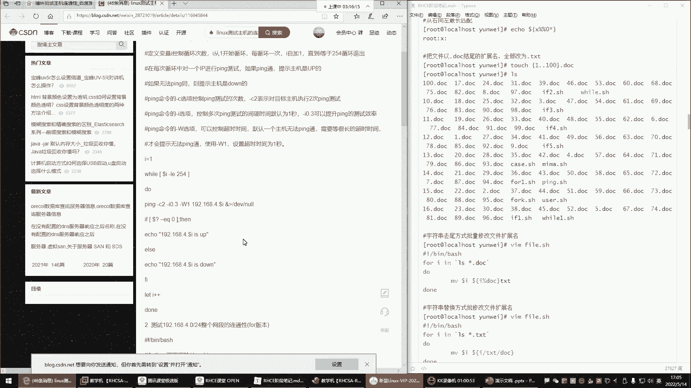

## 字符串替换

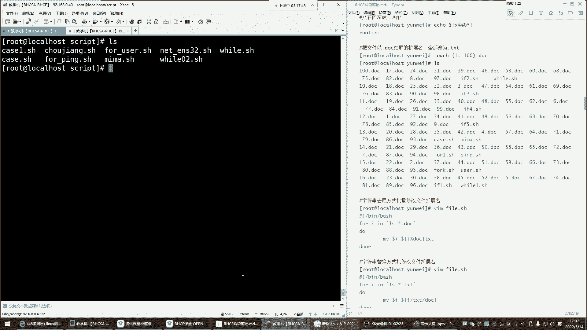

字符串替换的语法是 `${变量名/旧字符串/新字符串}`。用单斜杠`/`替换第一个匹配项，用双斜杠`//`替换所有匹配项。

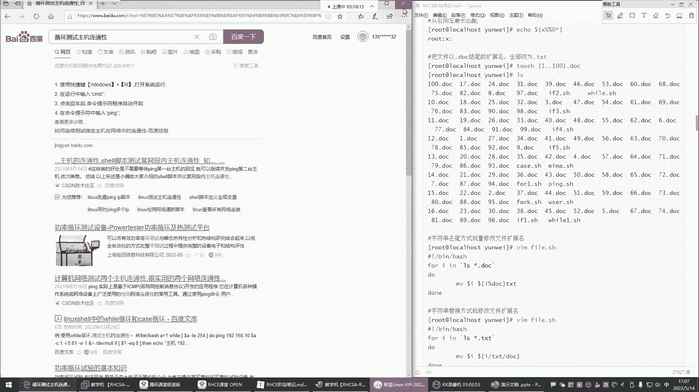

例如，我们有一个变量 `file="test1234.txt"`：
```bash
file="test1234.txt"
# 将“1234”替换为“****”
echo ${file/1234/****}
# 输出：test****.txt

# 将所有数字“3”替换为星号“*”
num="313233"
echo ${num//3/*}
# 输出：*1*2**
```
这个功能类似于文本编辑器中的“查找并替换”，可以方便地修改变量中的内容。

## 字符串掐头去尾

“掐头去尾”是指删除字符串开头或结尾的指定部分。
*   **掐头（从左向右删）**：使用 `${变量名#匹配规则}`。`#` 表示最短匹配，`##` 表示最长匹配。
*   **去尾（从右向左删）**：使用 `${变量名%匹配规则}`。`%` 表示最短匹配，`%%` 表示最长匹配。

这个概念可能有些抽象，我们通过一个例子来理解。假设变量 `path="/usr/local/bin"`：
```bash
path="/usr/local/bin"
# 掐头：删除从左开始第一个`/`及其之前的部分（最短匹配）
echo ${path#*/}
# 输出：usr/local/bin

# 掐头：删除从左开始最后一个`/`及其之前的部分（最长匹配）
echo ${path##*/}
# 输出：bin

# 去尾：删除从右开始第一个`/`及其之后的部分（最短匹配）
echo ${path%/*}
# 输出：/usr/local

# 去尾：删除从右开始最后一个`/`及其之后的部分（最长匹配）
echo ${path%%/*}
# 输出：（空）
```

## 实践：批量修改文件扩展名

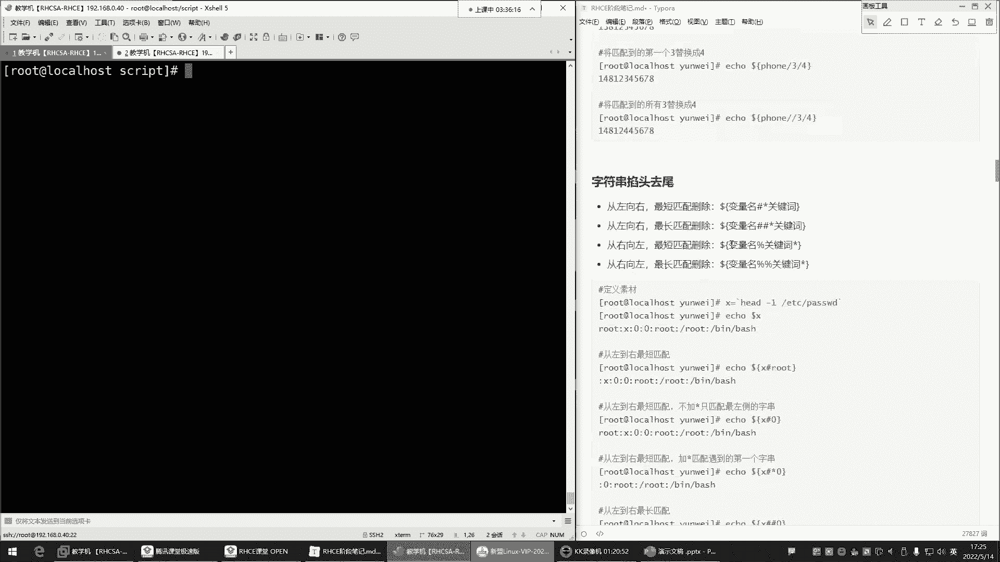

学习了字符串处理的基本操作后，我们来看一个实际应用场景：批量修改文件扩展名。以下是两种实现方法：

**方法一：使用字符串替换**
```bash
#!/bin/bash
for file in *.txt
do
    # 将文件扩展名 .txt 替换为 .doc
    newname=${file/.txt/.doc}
    mv "$file" "$newname"
done
echo “扩展名修改完成。”
```

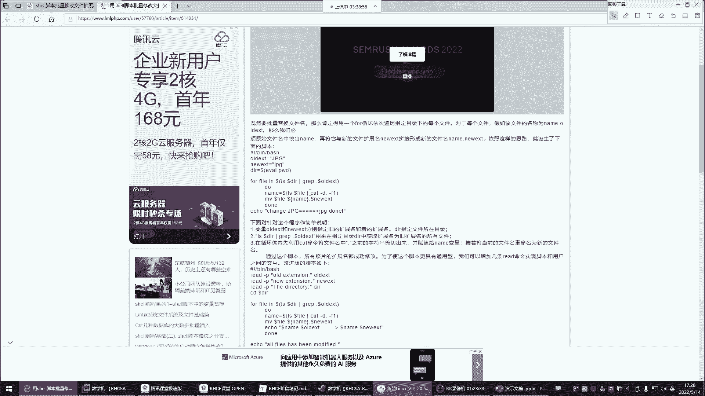

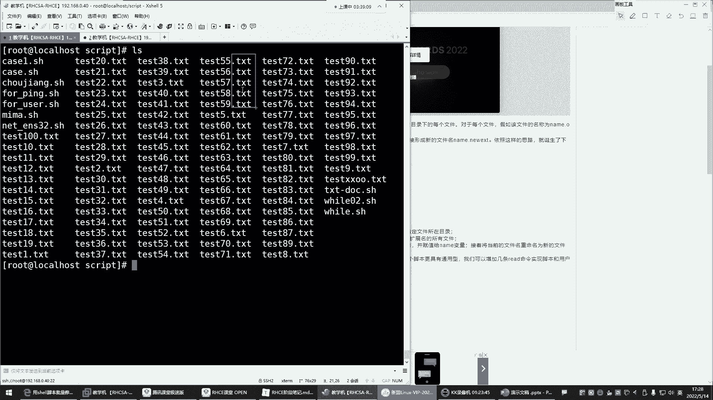

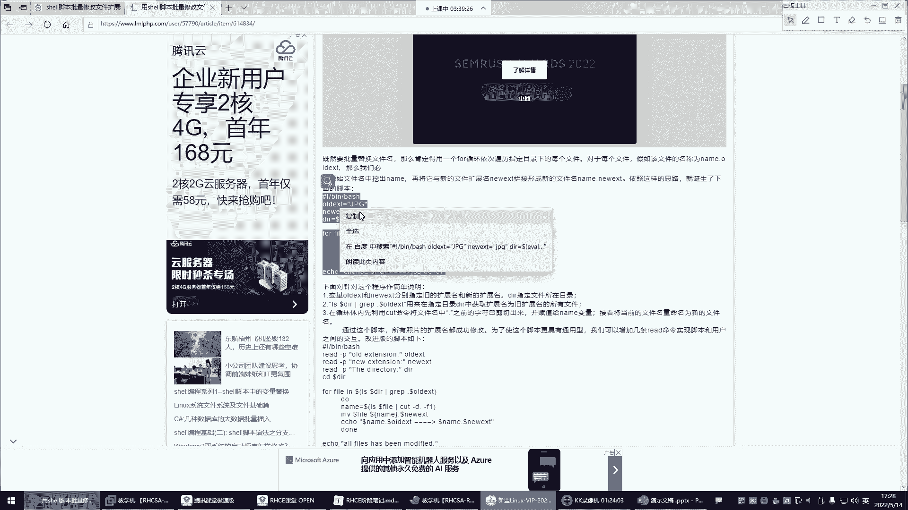

**方法二：使用“去尾”操作**
```bash
#!/bin/bash
for file in *.doc
do
    # 去掉末尾的 .doc，然后加上 .txt
    prefix=${file%.doc}
    mv "$file" "$prefix.txt"
done
echo “扩展名修改完成。”
```

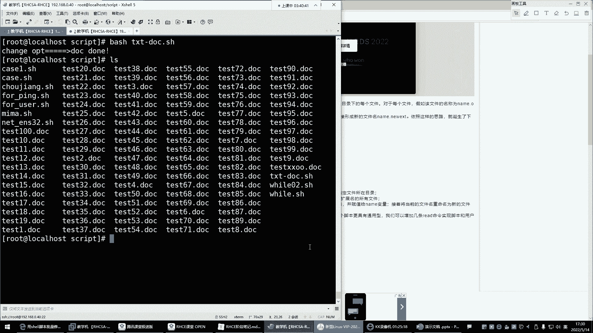

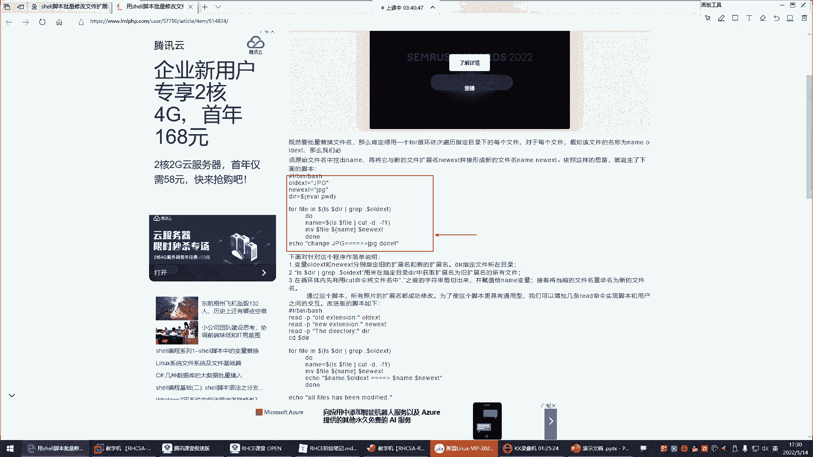

**脚本学习心得**：在运维领域，完全从零开始编写复杂脚本的情况并不多见。更多的时候，我们是在已有脚本的基础上进行修改和调试，以适应特定的需求。因此，培养阅读、理解和修改脚本的能力，比死记硬背语法更为重要。当遇到问题时，知道如何搜索、如何借鉴、如何调试，这才是核心技能。

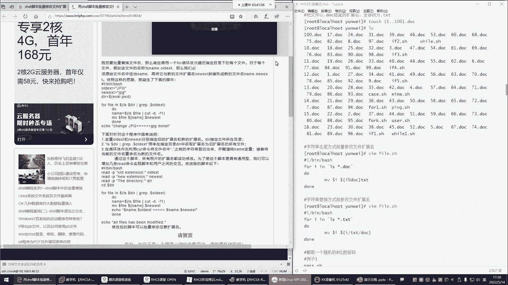

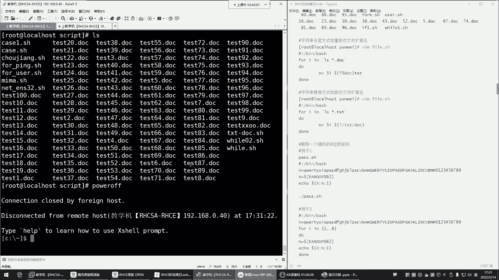

## 总结

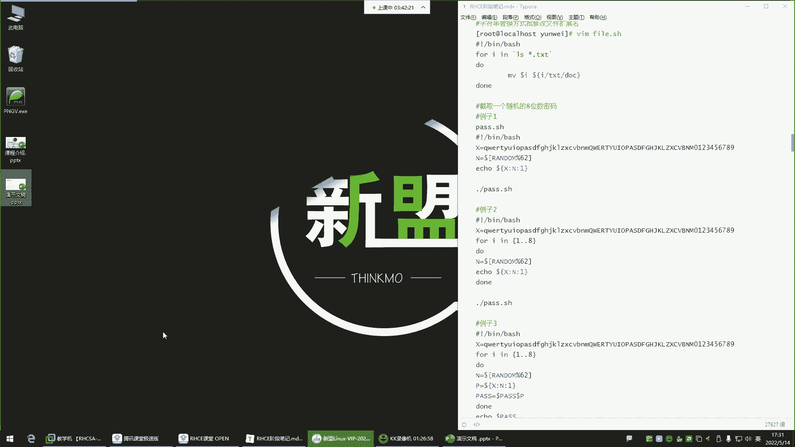

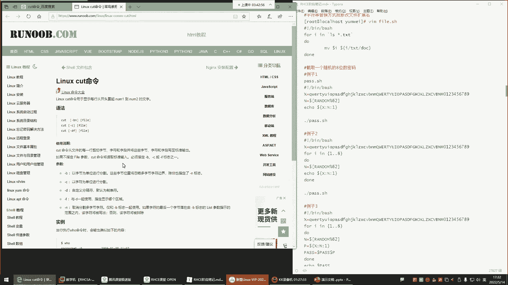

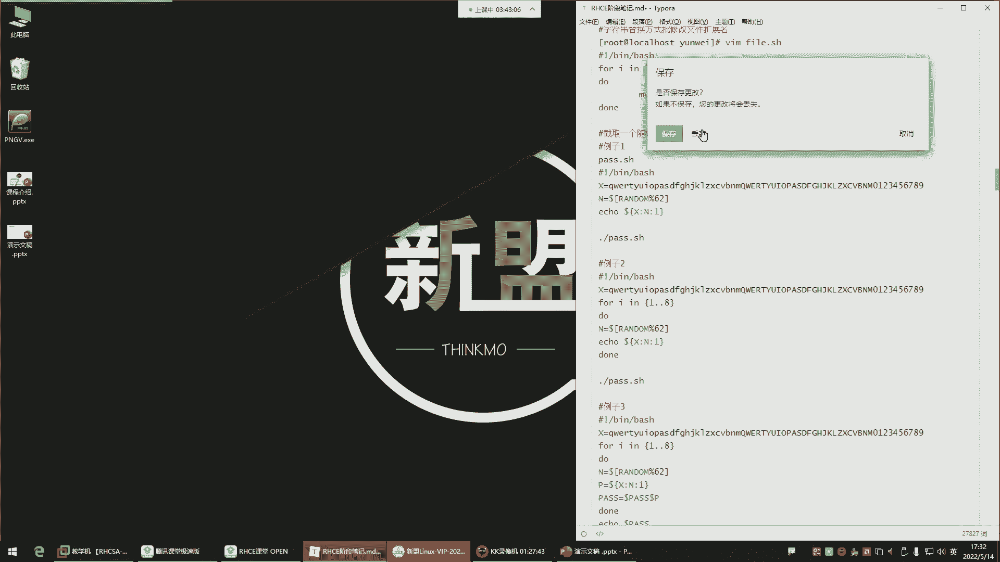

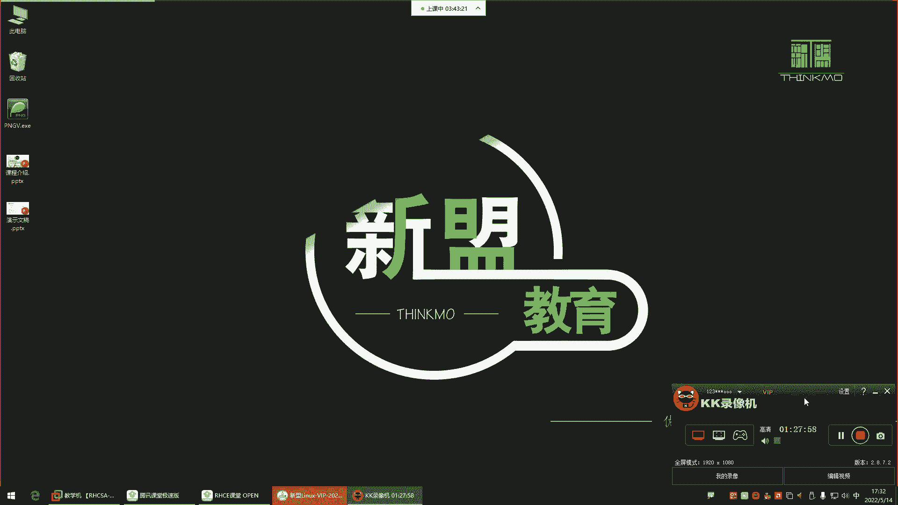

本节课中我们一起学习了Shell字符串的截取、替换和掐头去尾操作，并通过生成随机密码和批量修改文件名的例子进行了实践。更重要的是，我们探讨了高效学习Shell脚本的思维：**理解基础，善于借鉴，灵活修改**。掌握这个思路，你就能更从容地应对各种自动化运维任务。