# Linux运维教程：P47：Shell数组与正则表达式

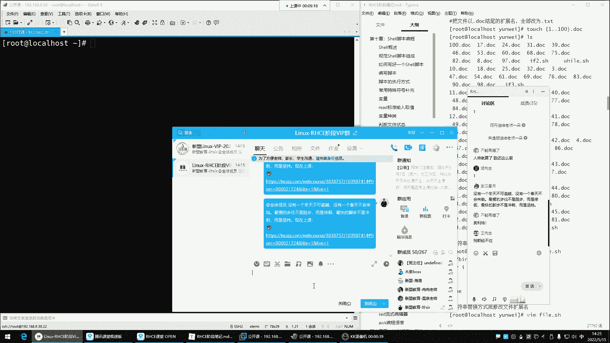

## 概述
在本节课中，我们将学习Shell脚本中的两个重要概念：数组和正则表达式。数组允许我们在一个变量中存储多个值，而正则表达式则是一套用于匹配和处理文本的强大工具。掌握它们将极大地提升你编写脚本和进行文本处理的能力。

上一节我们介绍了Shell脚本的基础语法和控制结构，本节中我们来看看如何利用数组存储数据，以及如何使用正则表达式进行复杂的文本匹配。

---

## Shell数组

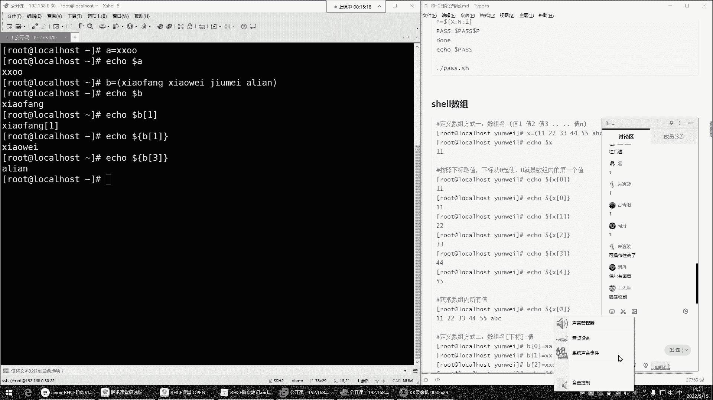

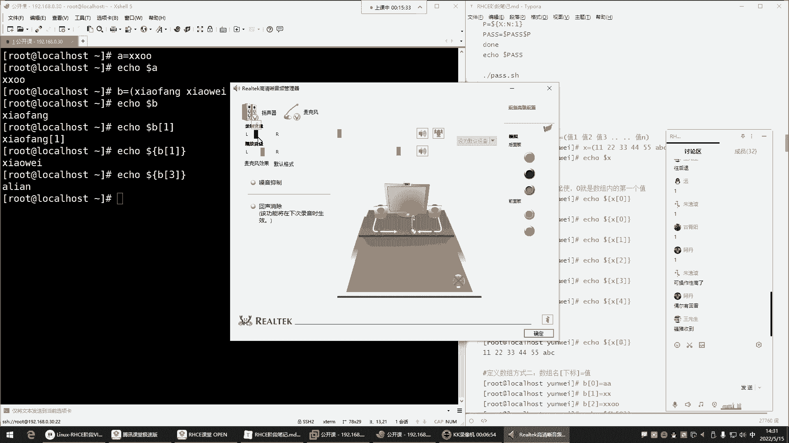

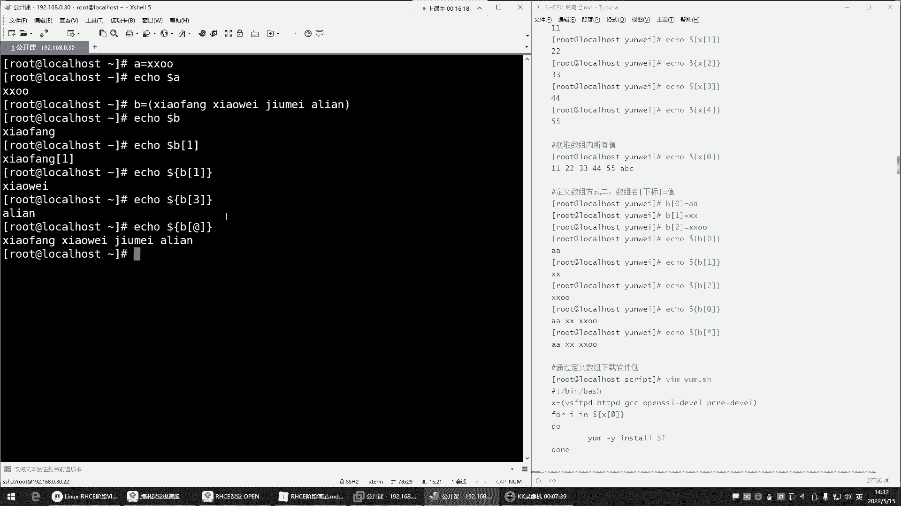

数组是Shell变量的一种高级形式，它允许在一个变量名下存储多个值。这与我们之前学习的普通变量（一个变量存储一个值）不同，数组提供了更强的数据组织能力。

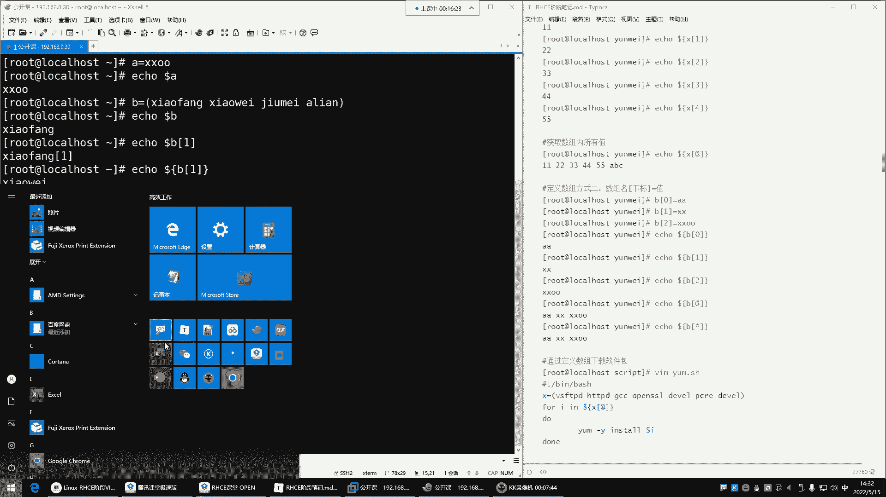

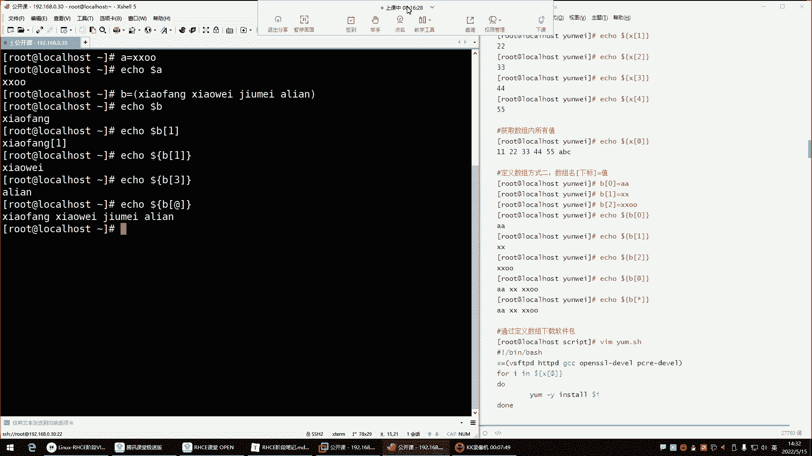

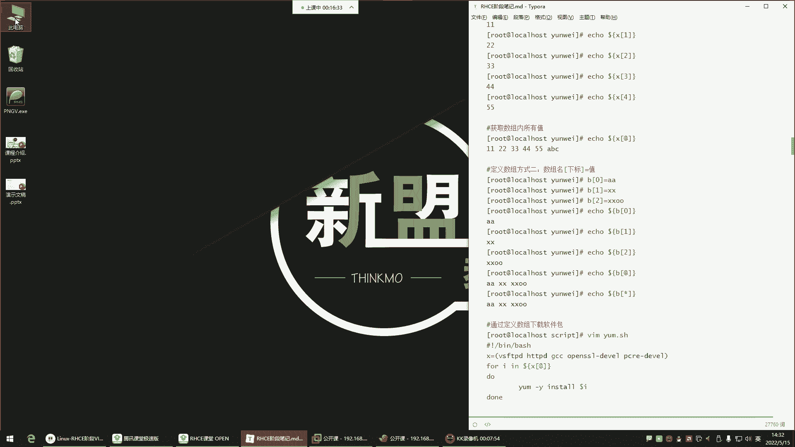

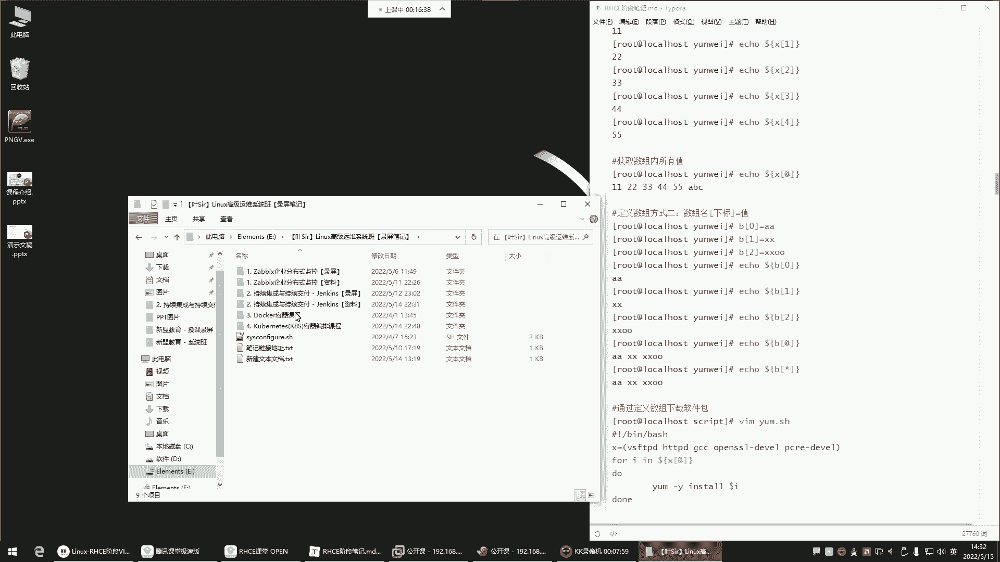

### 数组的定义与赋值
定义数组的语法与定义变量类似，但需要用小括号 `()` 将多个值括起来，值之间用空格分隔。

**公式**：
```bash
数组名=(值1 值2 值3 ...)
```

**示例**：
```bash
B=(小芳 小V 九妹 阿莲)
```
这条命令定义了一个名为 `B` 的数组，其中包含了四个值。

### 数组值的读取
数组中的每个值都有一个对应的“下标”（索引）来标识其位置。在Shell数组中，下标从 **0** 开始计数。

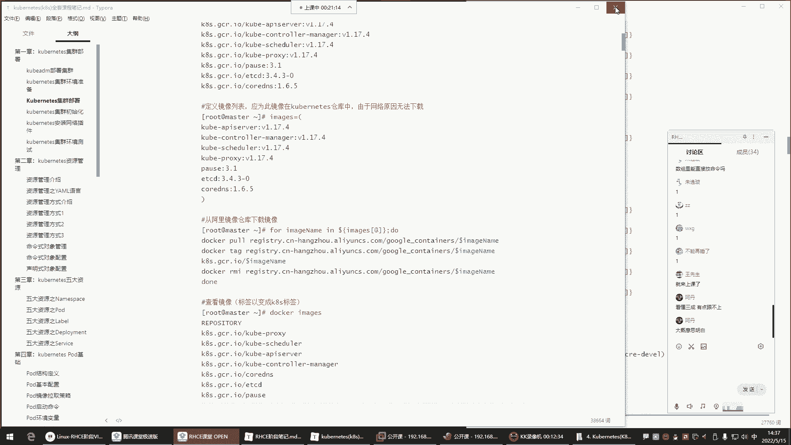

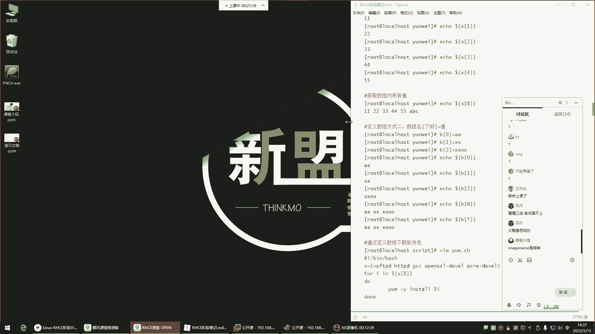

**公式**：
```bash
${数组名[下标]}
```

**示例**：
```bash
echo ${B[0]}  # 输出：小芳 (第一个值)
echo ${B[1]}  # 输出：小V  (第二个值)
echo ${B[3]}  # 输出：阿莲 (第四个值)
```
**注意**：取值时必须使用 `${}` 语法，直接使用 `$B[1]` 会导致错误。

### 读取数组的所有值
如果你想一次性获取数组中的所有值，可以使用 `@` 或 `*` 符号。

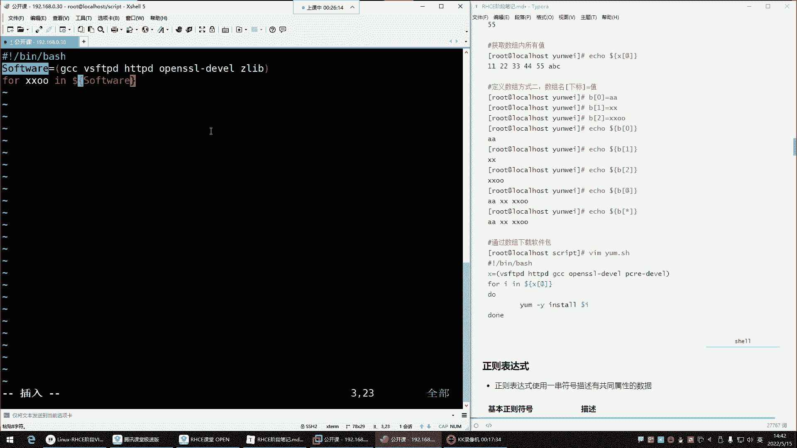

**公式**：
```bash
${数组名[@]}  或 ${数组名[*]}
```

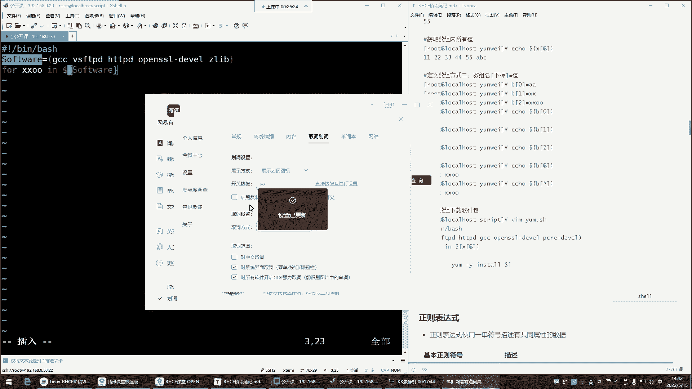

**示例**：
```bash
echo ${B[@]}
# 输出：小芳 小V 九妹 阿莲
```

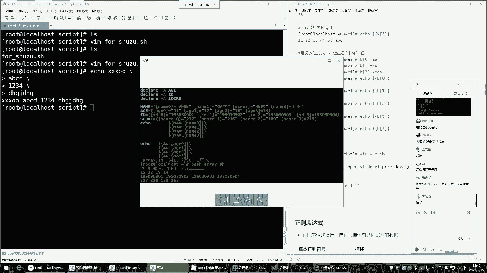

### 数组的实用场景
数组最常见的用途是与循环结构（如 `for` 循环）结合，批量处理数据。

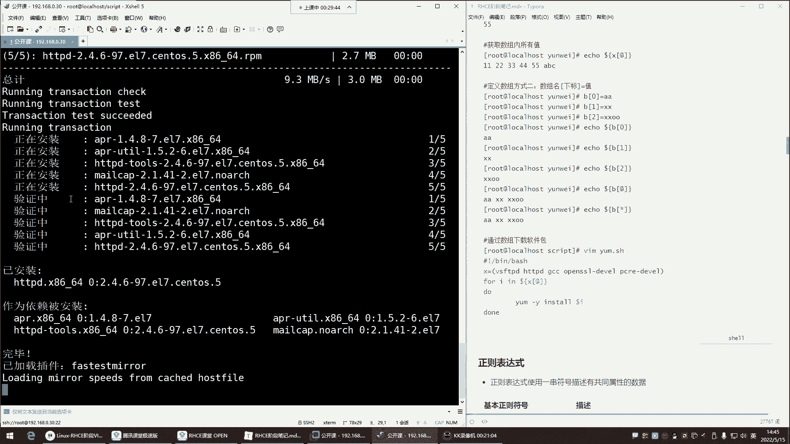

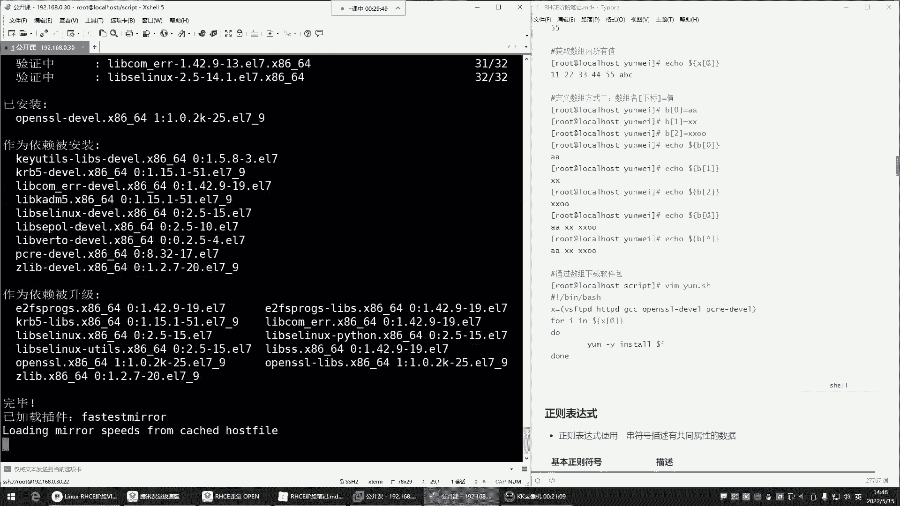

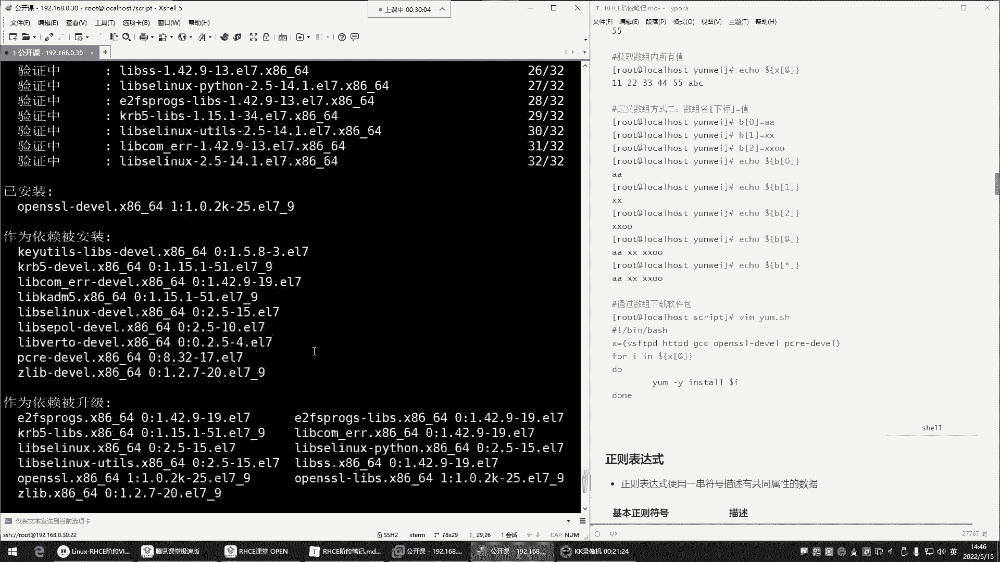

以下是数组的一个典型应用示例，用于批量安装软件包：

**代码**：
```bash
#!/bin/bash
# 定义一个包含多个软件包名的数组
SOFTWARE=(gcc vsftpd httpd)

# 使用for循环遍历数组并安装每个软件包
for pkg in ${SOFTWARE[@]}
do
    yum -y install $pkg
done
```
在这个脚本中，`for` 循环会依次将数组 `SOFTWARE` 中的每个值（软件包名）赋给变量 `pkg`，然后执行 `yum install` 命令进行安装。

---

## 正则表达式

正则表达式是一种用于描述字符串模式的强大工具，它通过一系列特殊字符来定义搜索规则。正则表达式在文本搜索、替换、验证等场景中应用广泛，并且其语法在多种编程语言中通用。

上一节我们学习了数组的存储功能，本节中我们来看看如何使用正则表达式进行精确的文本匹配和过滤。

### 基础正则表达式元字符
以下是几个最常用且重要的正则表达式元字符：

1.  **`^` (尖角号)**：匹配行首。
    *   **示例**：`grep '^root' /etc/passwd`
    *   **作用**：只匹配以 `root` 开头的行。

2.  **`$` (美元符)**：匹配行尾。
    *   **示例**：`grep 'bash$' /etc/passwd`
    *   **作用**：只匹配以 `bash` 结尾的行，常用于查找使用bash shell的用户。

3.  **`[]` (中括号)**：匹配括号内的任意**单个**字符。
    *   **示例**：`grep '[Rr]oot' file.txt`
    *   **作用**：匹配包含 `Root` 或 `root` 的行。
    *   **取反**：在中括号内使用 `^` 表示“非”。`grep '[^0-9]' file.txt` 匹配包含非数字字符的行。

4.  **`.` (点号)**：匹配任意**单个**字符（除了换行符）。
    *   **示例**：`grep 'r..t' file.txt`
    *   **作用**：匹配像 `root`、`rapt`、`r123t` 这样的字符串，其中 `..` 代表任意两个字符。

5.  **`*` (星号)**：匹配前一个字符出现**零次或多次**。
    *   **示例**：`grep 'ro*t' file.txt`
    *   **作用**：匹配 `rt`、`rot`、`root`、`rooooot` 等。

### 扩展正则表达式
扩展正则表达式提供了更多元字符，使用时通常需要给 `grep` 命令加上 `-E` 选项，或直接使用 `egrep` 命令。

1.  **`+` (加号)**：匹配前一个字符出现**一次或多次**。
    *   **示例**：`grep -E 'ro+t' file.txt`
    *   **作用**：匹配 `rot`、`root`、`rooooot`，但不匹配 `rt`。

2.  **`?` (问号)**：匹配前一个字符出现**零次或一次**。
    *   **示例**：`grep -E 'colou?r' file.txt`
    *   **作用**：匹配 `color` 和 `colour`。

3.  **`|` (竖线)**：表示“或”关系。
    *   **示例**：`grep -E 'root|admin' file.txt`
    *   **作用**：匹配包含 `root` **或** `admin` 的行。

4.  **`()` (小括号)**：将模式组合为一个整体，常用于分组或与 `|` 结合。
    *   **示例**：`grep -E '(very )+good' file.txt`
    *   **作用**：匹配 `good`、`very good`、`very very good` 等。

### 正则表达式的应用
正则表达式主要与文本处理命令结合使用，最常用的就是 `grep` 命令进行过滤。

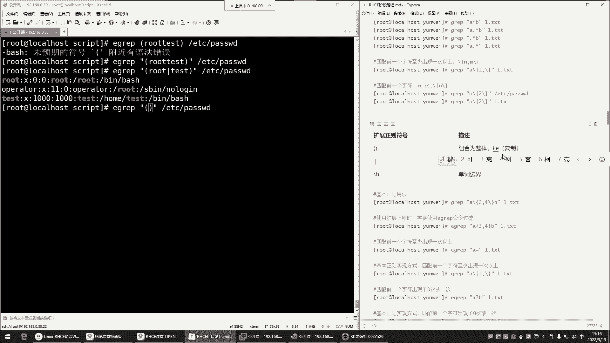

以下是使用正则表达式进行复杂过滤的示例：

**代码**：
```bash
# 查找/etc/passwd中，用户名以`s`或`r`开头，并且以`nologin`结尾的行
egrep '^(s|r).*nologin$' /etc/passwd

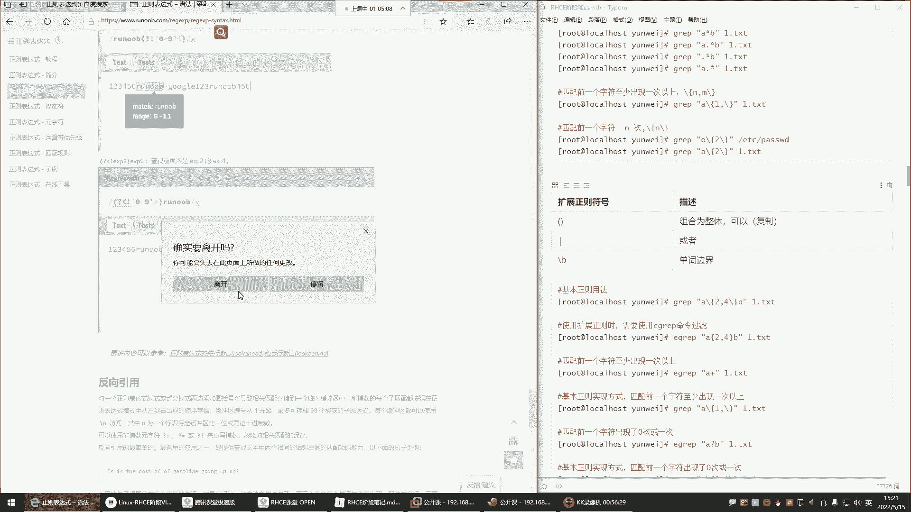

# 查找日志文件中所有格式为`192.168.1.x`的IP地址
grep -E '192\.168\.1\.[0-9]{1,3}' /var/log/secure
```

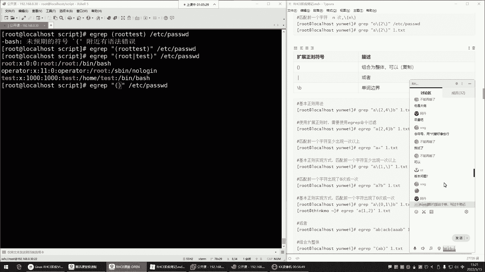

---

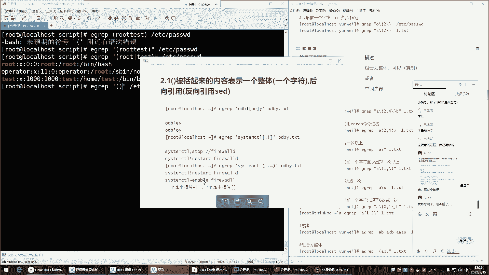

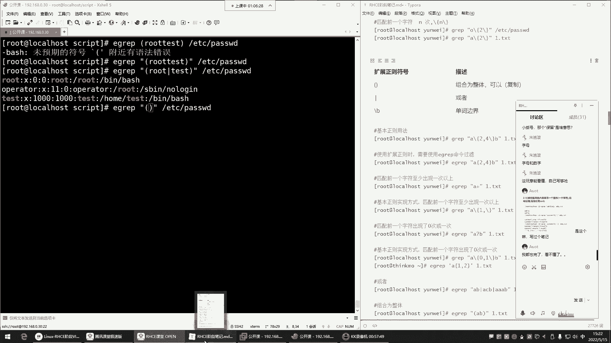

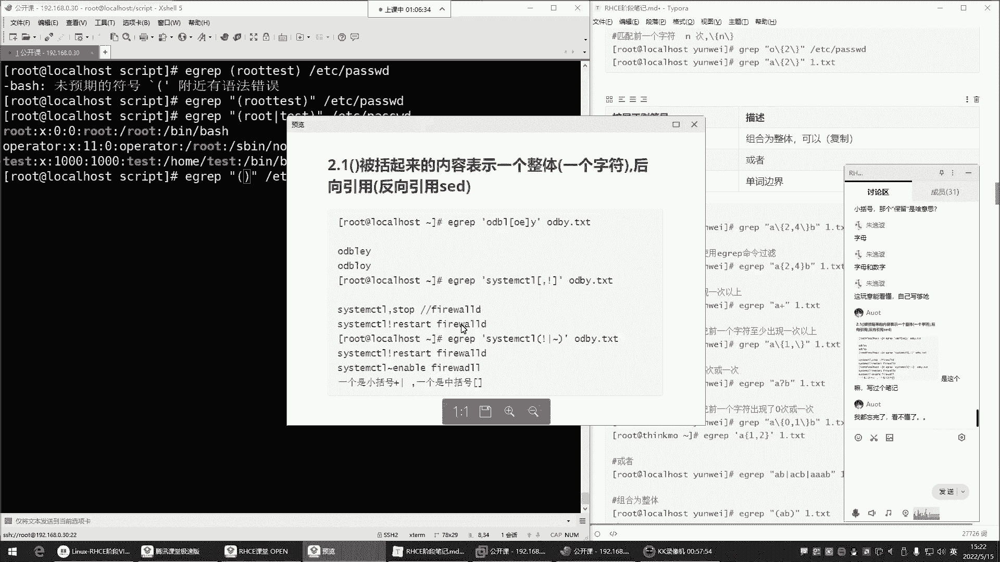

## 总结
本节课我们一起学习了Shell数组和正则表达式这两个核心工具。

*   **Shell数组**：我们了解了如何定义数组、通过下标访问特定元素、遍历所有元素，并看到了数组在批量操作（如软件安装）中的实际应用。数组是组织和管理多个数据的有效方式。
*   **正则表达式**：我们认识了 `^`、`$`、`[]`、`.`、`*` 等基础元字符，以及 `+`、`?`、`|`、`()` 等扩展元字符的功能。正则表达式是进行精确文本匹配和过滤的利器，掌握它能让你在日志分析、数据提取等任务中事半功倍。

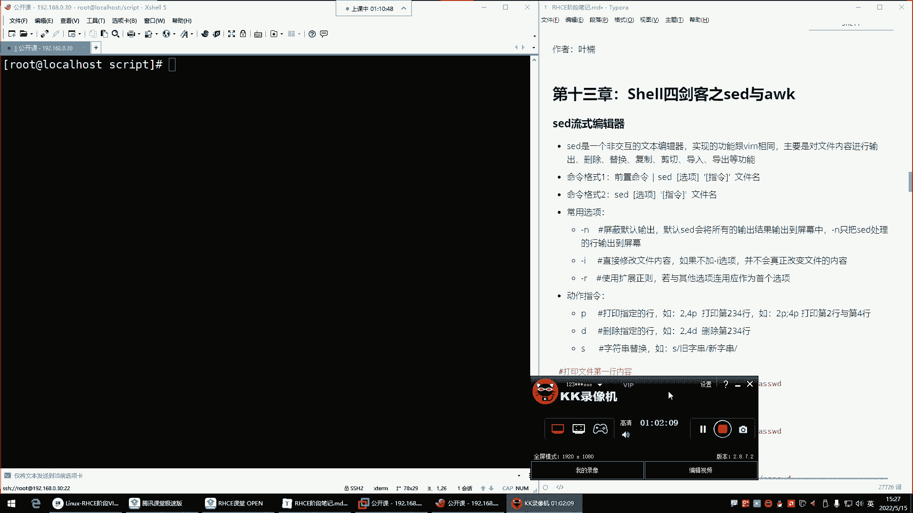

正则表达式初看可能有些复杂，但从最常用的几个元字符开始练习，结合实际需求慢慢深入，你就能逐渐掌握这门强大的文本处理语言。在接下来的学习中，我们会看到它们与更多命令（如 `sed`、`awk`）结合，发挥更大的威力。