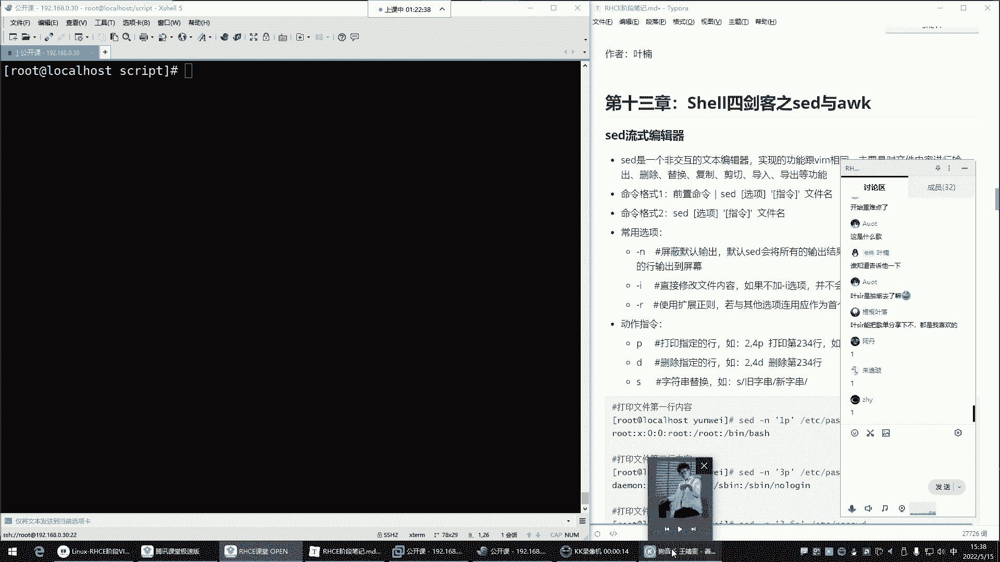
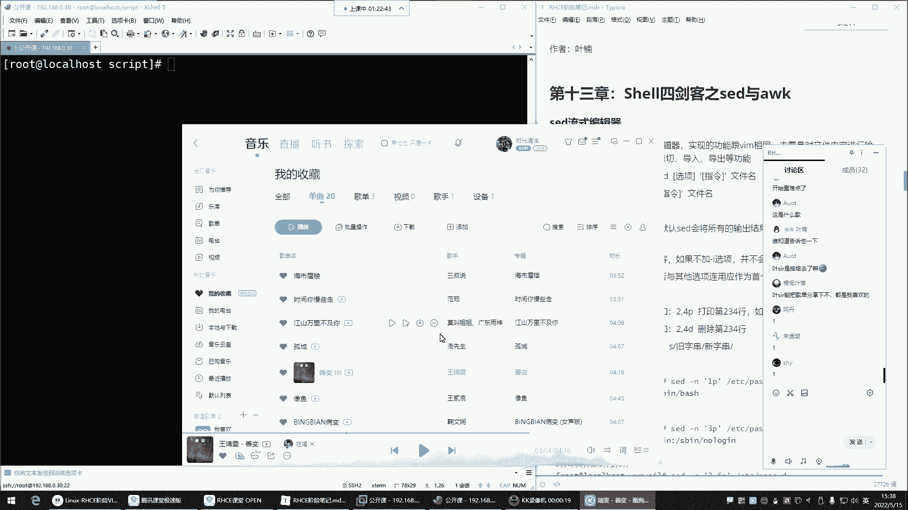
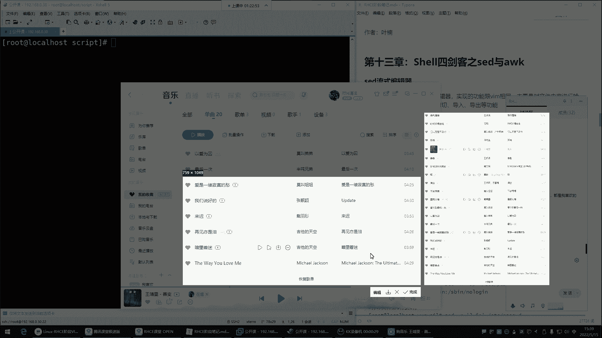
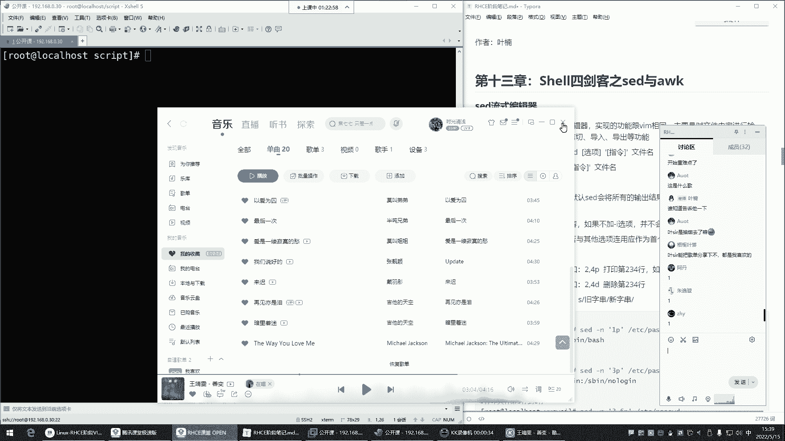
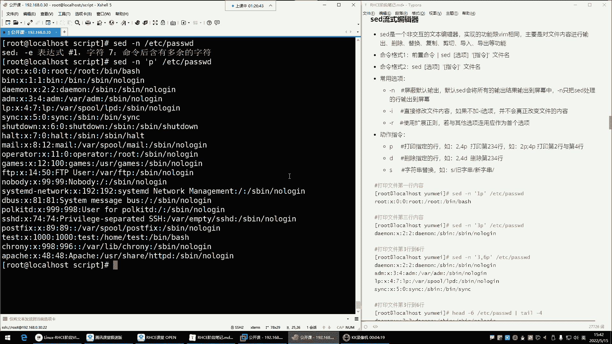
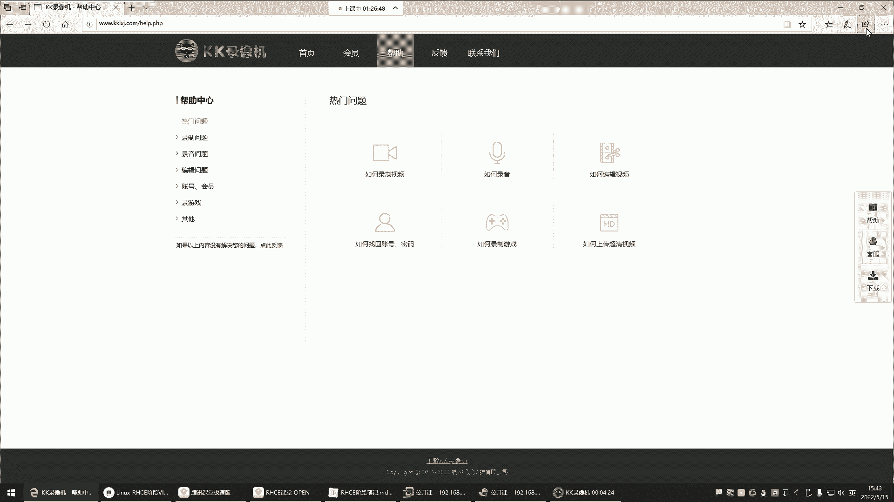
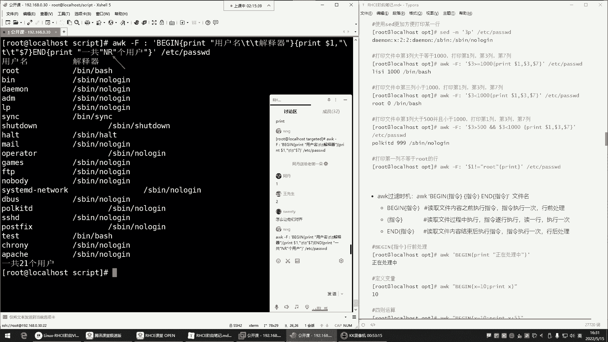
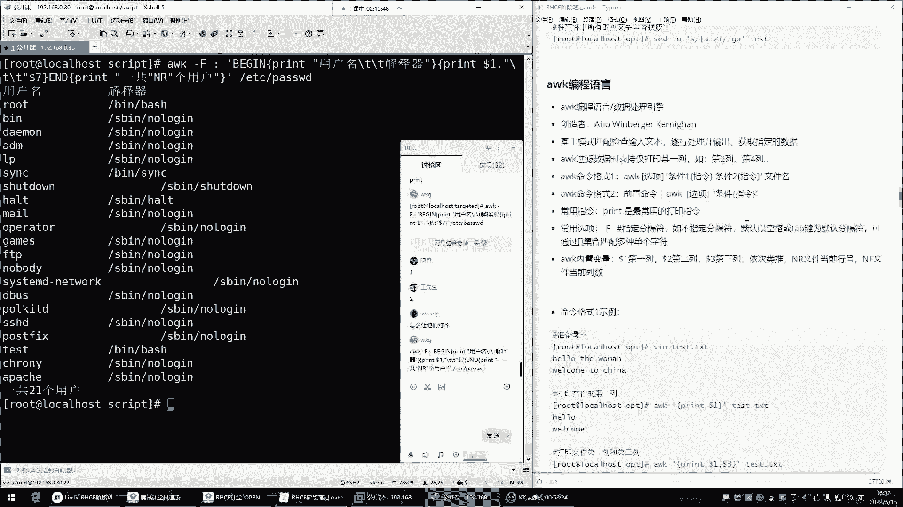
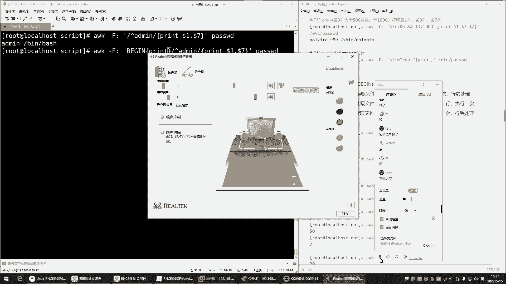
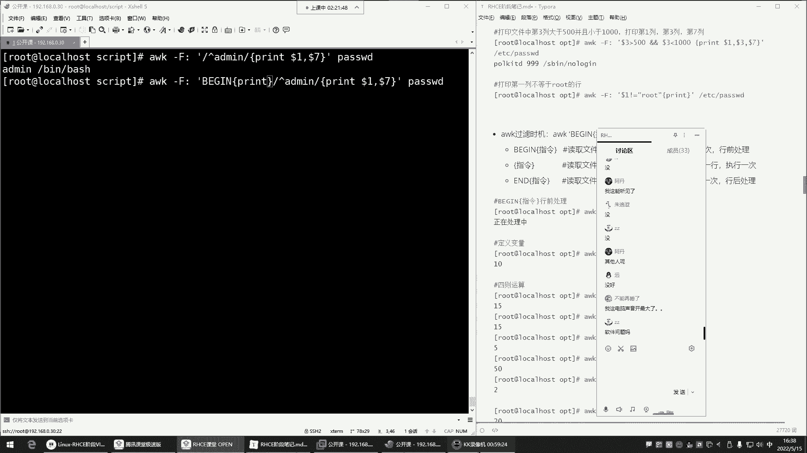

# Linux运维：P48：Shell四剑客之Sed编辑器 🛠️









在本节课中，我们将要学习Shell四剑客中的Sed编辑器。Sed是一个强大的流式文本编辑器，它允许我们以非交互的方式对文件内容进行增、删、改、查等操作，非常适合在脚本中自动化处理文本文件。

---

## Sed简介：非交互式文本编辑器





上一节我们介绍了Shell脚本的基础知识，本节中我们来看看Sed编辑器。Sed，全称Stream Editor，即流式编辑器。你可以将它理解为Vim编辑器的非交互式版本。

Vim是交互式的，需要用户手动打开文件并进行编辑，这使其难以集成到自动化脚本中。而Sed则不同，它可以直接在命令行中接收指令，对文件内容进行批量修改，整个过程无需人工干预，非常适合脚本编程。

Sed的基本命令格式主要有两种：
1.  前置命令通过管道 `|` 传递给Sed处理。
2.  直接使用Sed命令处理文件。

我们主要学习第二种方式。其通用语法结构如下：
```bash
sed [选项] ‘指令’ 文件名
```
其中，常用选项包括 `-n`（屏蔽默认输出）、`-i`（直接修改原文件）、`-r`（使用扩展正则表达式）。指令则包括打印（p）、删除（d）、替换（s）等。

---

## 打印文件内容

首先，我们来看看如何使用Sed查看文件内容。与`cat`或`less`命令不同，Sed可以精确地打印指定行。

以下是Sed打印功能的基本用法：

*   **打印整个文件**：`sed ‘p’ 文件名`。但此命令会默认重复输出每一行。
*   **屏蔽默认输出**：使用 `-n` 选项可以只显示我们指定处理的行。例如 `sed -n ‘p’ 文件名` 不会产生重复输出，但依然会打印全部内容。
*   **打印指定单行**：`sed -n ‘行号p’ 文件名`。例如 `sed -n ‘3p’ /etc/passwd` 会打印该文件的第三行。
*   **打印连续多行**：使用逗号分隔起始和结束行号。例如 `sed -n ‘2,4p’ 文件名` 会打印第2到第4行。
*   **打印不连续的多行**：使用分号分隔不同的行号。例如 `sed -n ‘6p;10p’ 文件名` 会分别打印第6行和第10行。

**注意**：在编写包含特殊符号（如分号）的Sed命令时，建议使用引号将指令部分括起来，以避免Shell误解。

---

## 删除文件内容

接下来，我们学习如何使用Sed删除文件中的特定行。删除操作使用指令 `d`。

以下是删除操作的步骤与示例：

*   **演练删除**：直接使用 `sed ‘行号d’ 文件名` 会在屏幕上显示删除指定行后的文件内容，但**不会真正修改原文件**。这常用于预览操作结果。
*   **实际删除**：要永久删除文件中的行，必须加上 `-i` 选项。例如 `sed -i ‘5d’ 文件名` 会直接删除该文件的第五行。
*   **删除连续行**：同样可以使用逗号指定范围。例如 `sed -i ‘2,4d’ 文件名` 会删除第2到第4行。

一个安全的操作习惯是：在执行删除前，先用 `sed -n ‘行号p’ 文件名` 确认目标行内容，确认无误后再使用 `-i` 选项执行真正的删除。

---

## 替换文件内容

替换是Sed最核心的功能之一，其语法与Vim中的替换非常相似，使用指令 `s`。

替换操作的基本格式为 `s/旧内容/新内容/修饰符`。以下是具体用法：

*   **演练替换**：使用 `sed -n ‘s/旧内容/新内容/p’ 文件名` 可以预览替换效果，而不修改原文件。
*   **实际替换**：使用 `sed -i ‘s/旧内容/新内容/’ 文件名` 会直接修改原文件。例如 `sed -i ‘s/root/admin/’ a.txt` 会将文件`a.txt`中每行**第一个**出现的`root`替换为`admin`。
*   **全局替换**：默认只替换每行中第一个匹配项。若想替换行内所有匹配项，需要在命令末尾加上修饰符 `g`。例如 `sed -i ‘s/root/admin/g’ a.txt`。
*   **结合正则表达式**：Sed支持在`/.../`中使用正则表达式进行模式匹配。例如 `sed -n ‘/^demo/p’ 文件名` 会打印所有以`demo`开头的行。

与删除操作类似，建议先使用 `-n` 和 `p` 预览替换结果，确认无误后再使用 `-i` 选项保存更改。

---

## AWK简介：数据提取与报告生成工具 🧮

上一节我们详细介绍了Sed编辑器，本节中我们来看看另一个强大的文本处理工具——AWK。AWK不仅仅是一个命令，它是一门功能完整的编程语言，特别擅长对结构化文本数据（如表格数据）进行处理、分析和生成报告。

AWK的设计初衷是用于数据过滤和报告生成，它能完成许多`grep`命令无法实现的复杂操作，尤其是基于列（字段）的数据处理。

AWK的基本命令格式如下：
```bash
awk [选项] ‘模式 {动作}’ 文件名
```
常用选项是 `-F`，用于指定输入文件的字段分隔符（默认为空格或制表符）。`模式`用于筛选行，`动作`则定义对筛选出的行要执行的操作，最常用的动作是 `print`。

---

## AWK核心概念与内置变量

AWK的强大之处在于它能自动将每一行文本按分隔符划分为多个字段，并通过内置变量轻松访问这些字段。

以下是AWK的核心概念和常用内置变量：

*   **指定分隔符 (`-F`)**：使用 `-F‘分隔符’` 来定义字段分隔符。例如，处理`/etc/passwd`文件（冒号分隔）时，使用 `awk -F‘:’`。
*   **字段变量 (`$n`)**：`$1` 代表当前行的第一个字段，`$2` 代表第二个字段，以此类推。`$0` 代表整行内容。
*   **行号变量 (`NR`)**：`NR` 代表AWK正在处理的当前行号（累计行号）。
*   **字段数量变量 (`NF`)**：`NF` 代表当前行被分隔后的字段总数。

一个简单的例子：`awk -F‘:’ ‘{print $1}’ /etc/passwd` 会打印出系统所有用户的用户名（即`/etc/passwd`文件每行的第一列）。

---

## AWK高级用法：BEGIN与END模式

AWK支持两个特殊的模式：`BEGIN`和`END`。它们允许你在处理数据之前和之后执行特定的动作。

以下是`BEGIN`和`END`模式的作用：

*   **BEGIN模式**：在开始处理文件的第一行**之前**执行一次。常用于初始化变量、打印表头等。
    ```bash
    awk -F‘:’ ‘BEGIN {print “用户名\t解释器”} {print $1 “\t” $7}’ /etc/passwd
    ```
*   **END模式**：在处理完文件的**最后一行之后**执行一次。常用于打印汇总信息、统计结果等。
    ```bash
    awk -F‘:’ ‘END {print “总用户数:”, NR}’ /etc/passwd
    ```
*   **组合使用**：你可以将BEGIN、主体动作和END组合在一个AWK命令中，生成完整的报告。
    ```bash
    awk -F‘:’ ‘BEGIN {print “用户列表：”} {print “用户名:”, $1} END {print “共计”, NR, “个用户”}’ /etc/passwd
    ```





---

## 总结

本节课中我们一起学习了Shell四剑客中的Sed和AWK。
*   **Sed** 是一个流式编辑器，专注于对文本内容进行**非交互式**的增、删、改、查。我们重点掌握了使用 `-n` 预览、`-i` 修改、以及 `p`（打印）、`d`（删除）、`s`（替换）等核心指令。
*   **AWK** 是一门用于数据提取和报告生成的编程语言。我们理解了其按列处理数据的能力，学会了使用 `-F` 指定分隔符，通过 `$1`、`$NF` 等引用字段，并利用 `BEGIN` 和 `END` 模式生成结构化的输出报告。





掌握Sed和AWK，将极大提升你在Linux环境下自动化处理文本和日志文件的能力。