# 零基础入门Linux：P4：01.1 什么是Linux

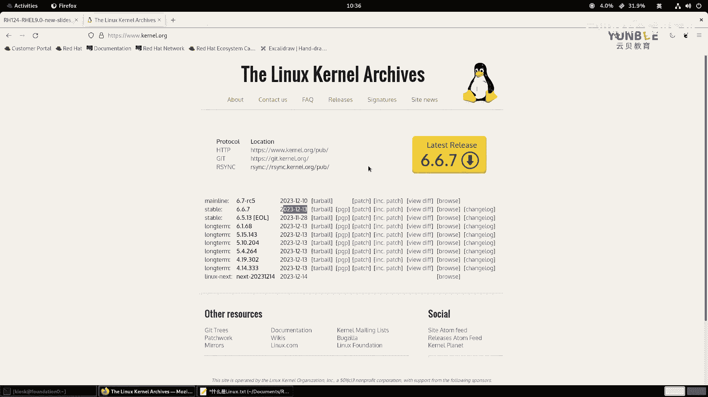

在本节课中，我们将要学习Linux操作系统的基础概念。我们将从开源的定义开始，逐步了解Linux内核、发行版，以及红帽企业Linux在整个开源生态中的角色和重要性。

## 什么是Linux？

Linux这个词有广义和狭义之分。

狭义上的Linux，指的是由林纳斯·托瓦兹（Linus Torvalds）创建并维护的**Linux内核**。其官方网站是 `www.kernel.org`，内核版本会持续更新。

广义上的Linux，指的是基于Linux内核，并集成了其他必要软件（如GNU工具、图形界面、应用软件等）的完整操作系统，我们称之为 **Linux发行版**。例如，我们即将学习的红帽企业Linux就是一个著名的发行版。

## 为什么学习Linux？

Linux的应用极其广泛，是现代IT基础设施的基石。以下是几个关键原因：

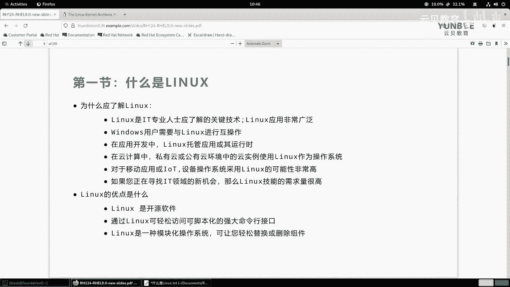

*   **无处不在**：从智能手机（安卓系统基于Linux）、智能家居设备、到互联网巨头（如谷歌、脸书）的后台服务器，Linux无处不在。即使你不是IT从业者，日常使用的许多服务也运行在Linux之上。
*   **IT领域核心**：从事软件开发、系统运维、云计算、网络安全等工作，几乎都必须与Linux打交道。绝大部分的服务器、云计算平台和容器技术都运行在Linux系统上。
*   **就业优势**：掌握Linux技能，特别是获得像红帽认证（RHCE）这样的专业证书，能显著提升在IT领域的竞争力。
*   **开源与自由**：Linux是开源软件，这意味着它的源代码公开、可查看、可修改、可再分发。这带来了透明度、安全性和可定制性。

## 开源软件简介

上一节我们提到了Linux是开源软件，本节中我们来详细看看开源的含义及其优势。

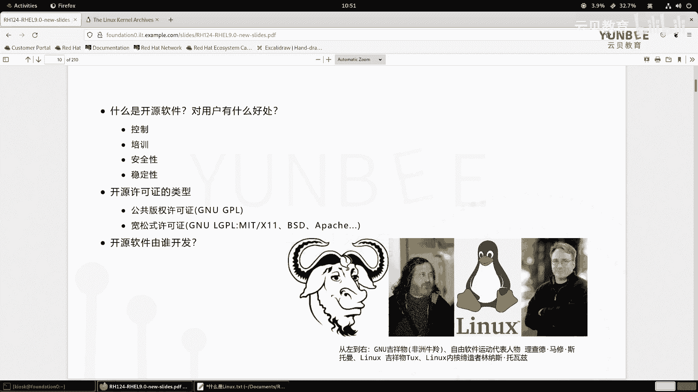

所谓“开源”，即开放源代码。软件的作者将程序的原始代码公开，允许任何人查看、学习、修改甚至重新分发。

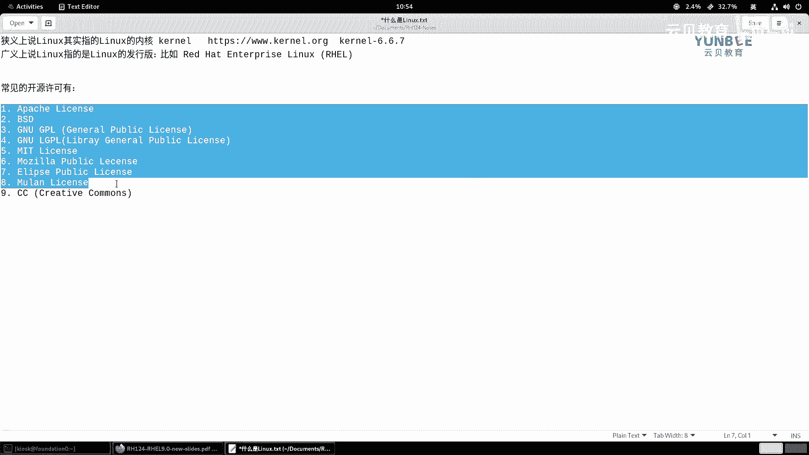

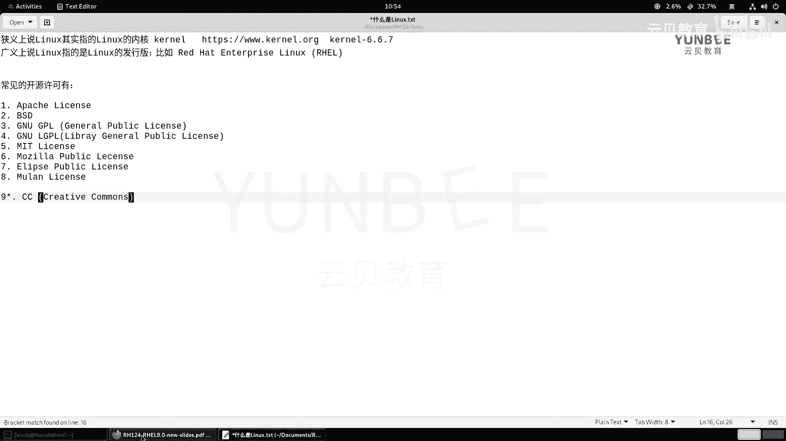

与闭源软件（如微软Windows的大部分代码不公开）相比，开源软件具有以下优点：

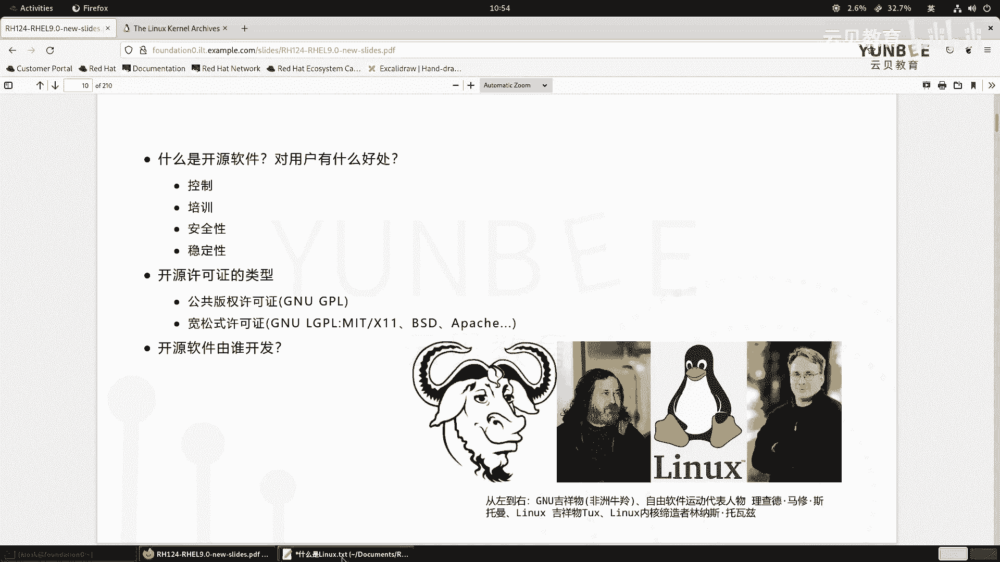

*   **透明度与控制力**：用户可以审查代码，了解软件的实际行为，确保没有恶意功能，并能根据自己的需求进行改进。
*   **学习与协作**：开发者可以直接从优秀的开源项目中学习，甚至参与贡献，这是提升技能的绝佳途径。
*   **安全性与稳定性**：因为代码公开，全球的开发者可以共同审查和修复安全漏洞。即使原开发团队停止维护，社区也可以接手，保证软件的持续发展。
*   **灵活性**：用户可以根据许可协议自由使用、修改和分发软件，不受单一供应商的限制。

为了保护开源作者的权益并规范使用方式，产生了多种**开源许可证**。常见的许可证包括：
*   **GPL**：通用公共许可证，要求修改后的衍生作品也必须以GPL开源。
*   **LGPL**：较宽松的GPL，主要针对软件库。
*   **Apache**：阿帕奇许可证，允许专利授权和商业使用。
*   **BSD**：伯克利软件发行版许可证，非常宽松，允许闭源商用。
*   **MIT**：麻省理工学院许可证，条款极为简单和宽松。

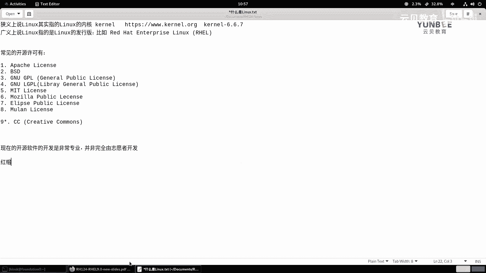

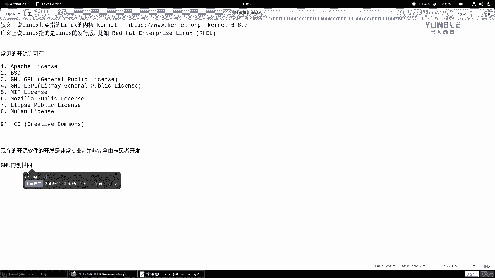

## GNU项目与Linux的诞生

现代Linux发行版的诞生，离不开两个重要的项目：GNU和Linux内核。

*   **GNU项目**：由理查德·斯托曼发起，目标是创建一个完全自由、类Unix的操作系统。该项目开发了大量高质量的系统工具和库（如GCC编译器、Bash shell），但唯独缺少一个可用的内核。
*   **Linux内核**：由林纳斯·托瓦兹在1991年出于个人兴趣开发。它功能完善，恰好填补了GNU项目缺失的核心部分。

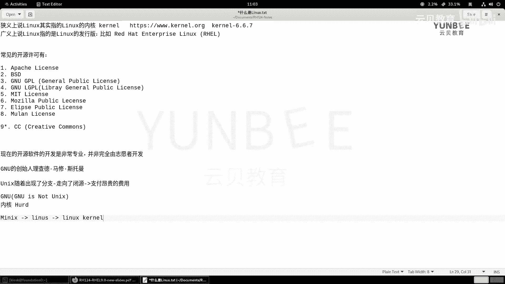

因此，更准确地说，我们今天使用的许多“Linux”系统，应该称为 **“GNU/Linux”系统**，因为它结合了GNU项目的用户空间工具和Linux内核。

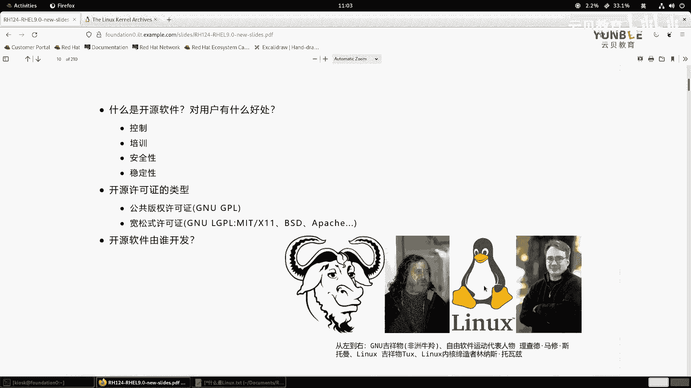

## 红帽公司简介

既然本课程围绕红帽认证展开，我们有必要了解红帽公司。

红帽是全球领先的开源解决方案提供商。它并不简单地开发软件，而是：
1.  从活跃的开源社区（如Fedora）中筛选优秀的软件项目。
2.  对其进行企业级的测试、加固、集成和支持服务。
3.  形成稳定的、适合企业关键业务使用的商业产品，例如 **Red Hat Enterprise Linux**。

这种模式既推动了开源社区的发展，又为企业提供了可靠的技术支持，形成了良性循环。红帽的产品线还包括OpenShift（容器平台）、Ansible（自动化工具）等。

## Linux发行版简介

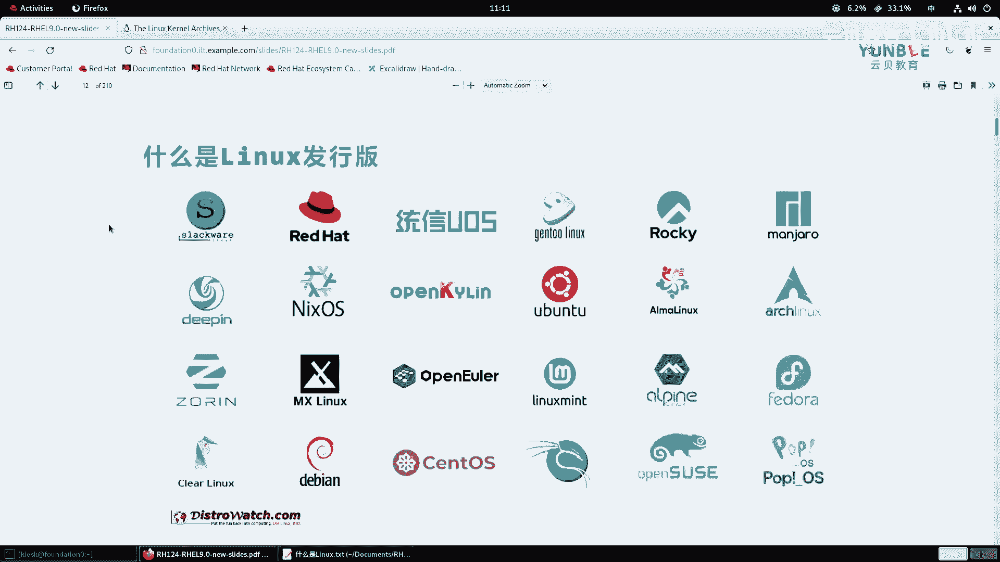

Linux内核本身只是一个“引擎”，需要配上“车身、轮子和内饰”才能成为一辆可驾驶的“汽车”。这就是发行版的作用。

发行版由个人、社区或公司将Linux内核、GNU工具、软件包管理系统、桌面环境等打包而成。以下是一些常见的发行版分类：

*   **红帽系**：
    *   **Red Hat Enterprise Linux**：商业版，稳定，支持周期长。
    *   **Fedora**：社区版，创新性强，是RHEL的上游试验场。
    *   **CentOS Stream**：RHEL的上游开发版，适合参与生态贡献。
    *   **Rocky Linux / AlmaLinux**：旨在与RHEL完全兼容的社区发行版。

*   **Debian系**：
    *   **Debian**：以稳定著称的社区发行版。
    *   **Ubuntu**：基于Debian，用户友好，桌面和服务器应用广泛。

*   **其他独立发行版**：
    *   **openEuler**：华为贡献的开源发行版，聚焦数字基础设施。
    *   **Deepin**：国产发行版，拥有美观易用的桌面环境。
    *   **Arch Linux**：滚动更新，高度可定制，适合高级用户。

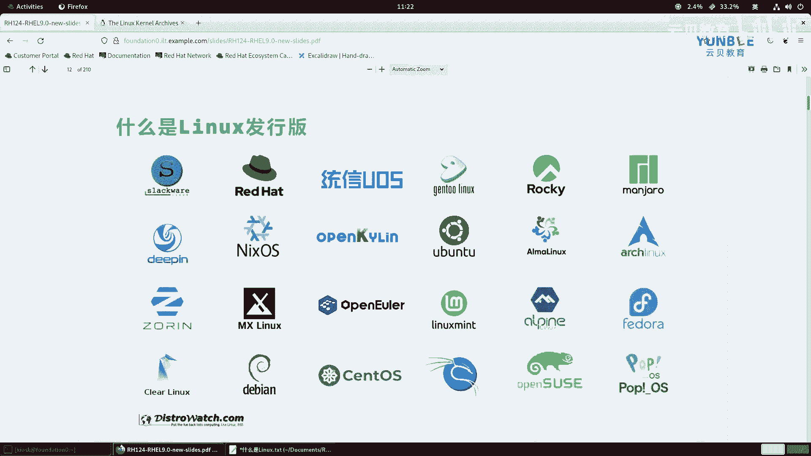

选择发行版取决于你的需求：学习企业环境推荐RHEL或其兼容版；追求易用性可选Ubuntu；喜欢挑战和定制可选Arch。

## Fedora, CentOS Stream 与 RHEL 的关系

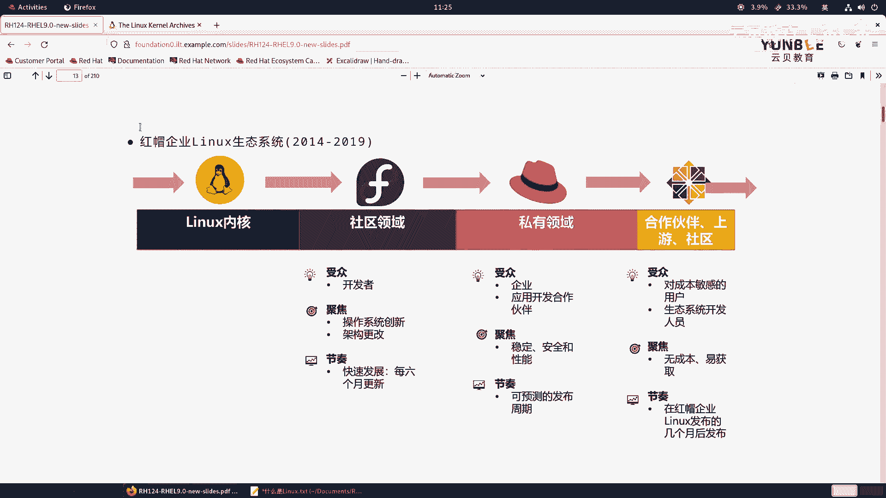

理解这三者的关系对学习红帽生态至关重要。

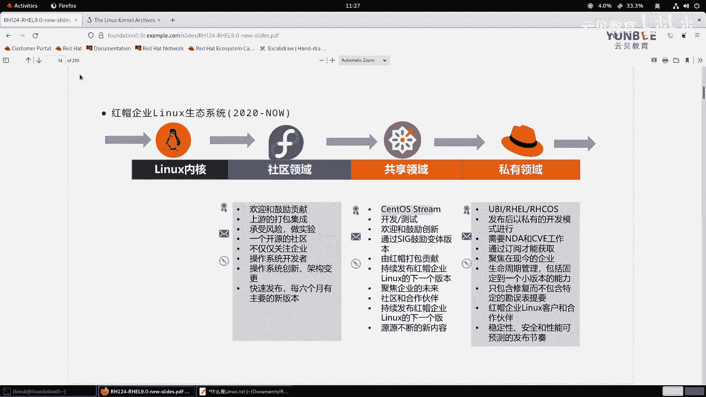

1.  **Fedora**：是前沿的社区项目，大约每6个月发布一个新版本，包含最新的软件和技术。它充当了“创新实验室”的角色。
2.  **RHEL**：红帽企业Linux。红帽将Fedora中经过验证的、稳定的技术提取出来，进行更严格的测试和长达10年的支持，形成面向企业的商业发行版。
3.  **CentOS Stream**：它位于Fedora和RHEL之间。可以看作是 **RHEL的持续开发版**。新功能会先进入CentOS Stream进行社区预览和测试，稳定后再进入下一个RHEL小版本。它不适合追求绝对稳定的生产环境，但非常适合开发者和想提前体验RHEL新特性的用户。

简单来说，技术流向是：`Fedora -> CentOS Stream -> RHEL`。

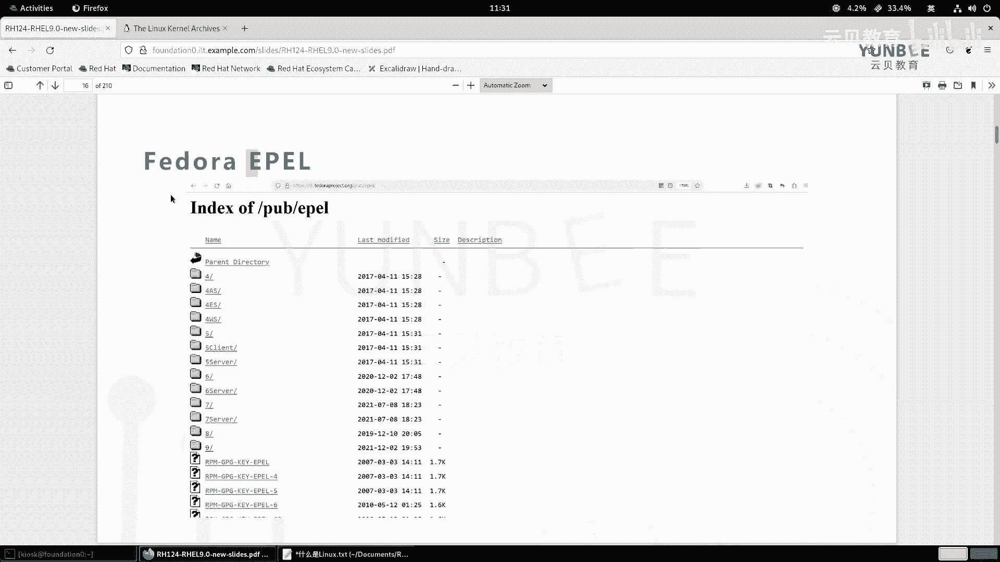

## 有用的资源

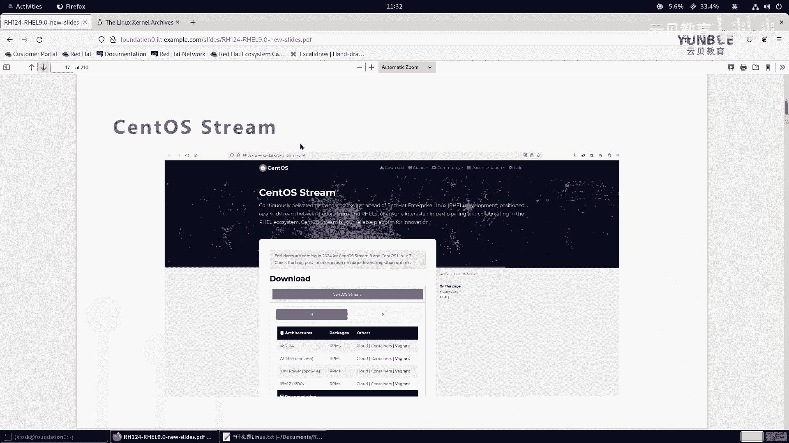

在学习过程中，以下网站可能会对你有所帮助：
*   **内核官网**：`https://www.kernel.org/`
*   **GNU官网**：`https://www.gnu.org/`
*   **红帽官网**：`https://www.redhat.com`
*   **Fedora官网**：`https://getfedora.org/`
*   **Linux中国**：`https://linux.cn/` （国内开源资讯站）

## 总结

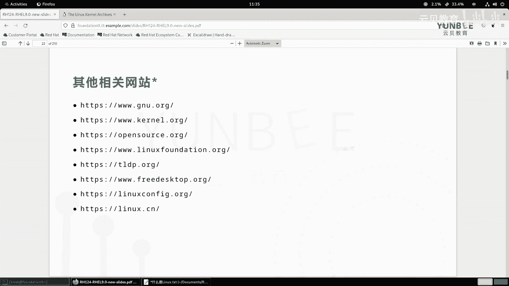

本节课中我们一起学习了Linux的基础概念。我们明确了Linux内核与发行版的区别，理解了开源软件的价值和许可方式，回顾了GNU项目与Linux内核结合的历史。我们还重点介绍了红帽公司在开源生态中的独特角色，梳理了Fedora、CentOS Stream和RHEL之间的关系，并列举了主流的Linux发行版。这些知识是后续深入学习Linux系统和红帽认证的坚实基础。