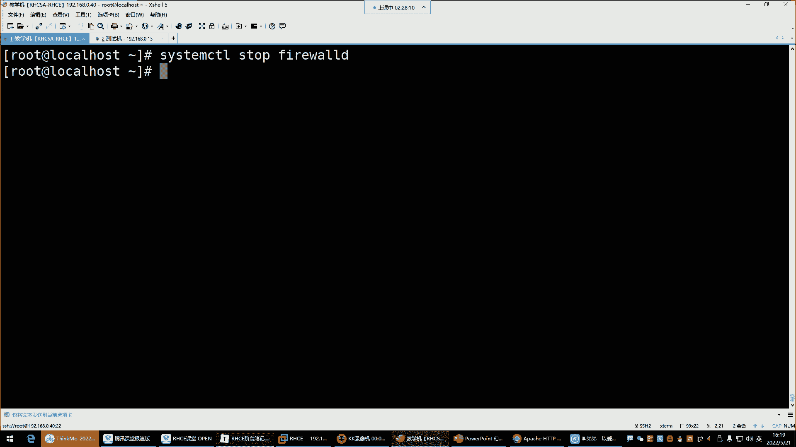
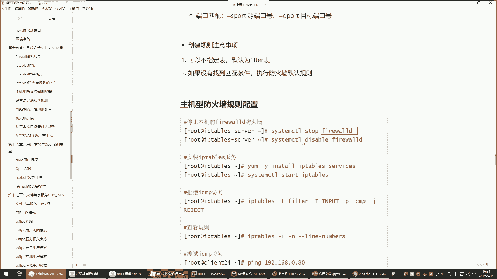
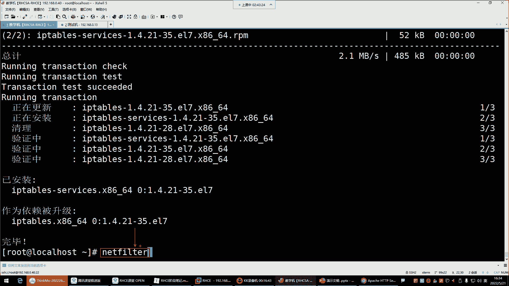
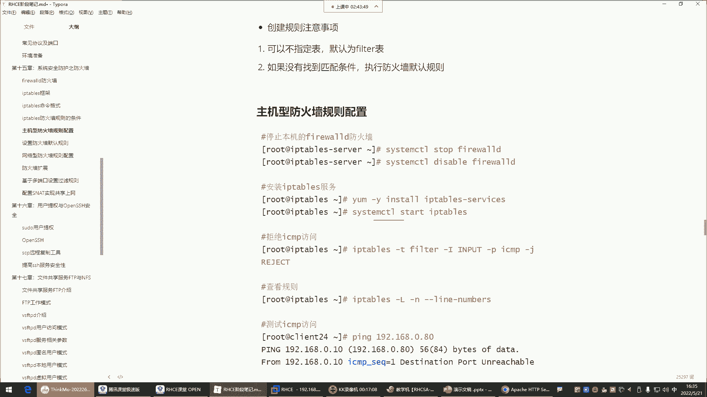
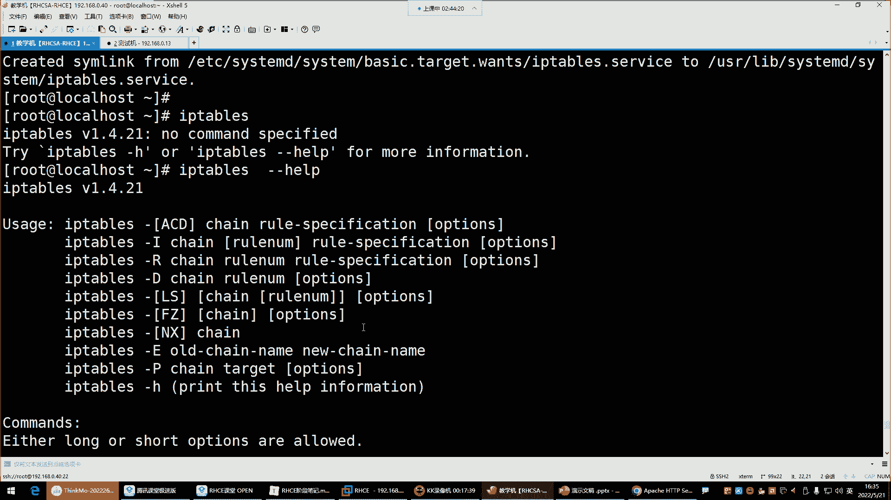
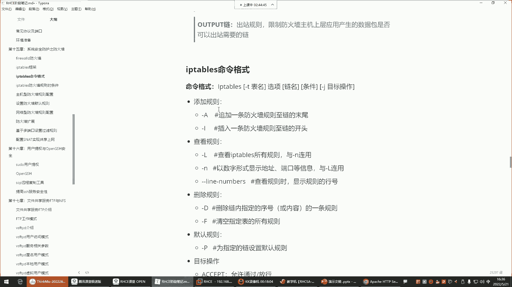
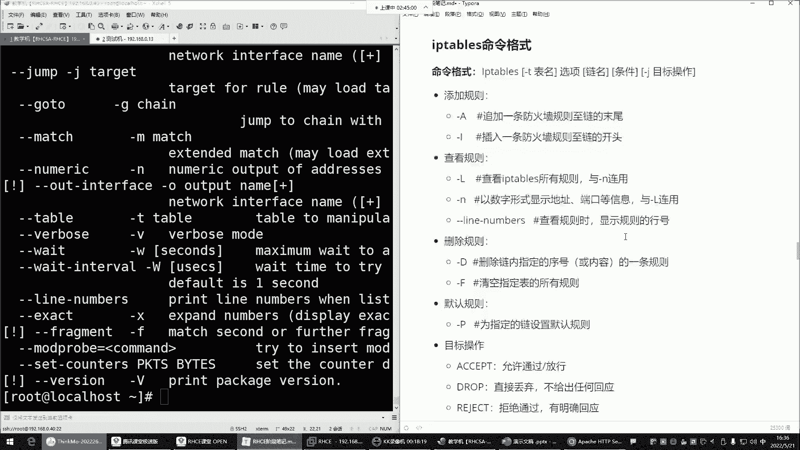

# Linux防火墙管理：P52：iptables四表五链详解

## 概述
在本节课中，我们将学习iptables防火墙的核心概念——四表五链。我们会了解iptables与firewalld的关系，深入解析每个表和链的功能与适用场景，并掌握iptables的基本命令格式。这是理解Linux防火墙策略配置的基础。


## 四表五链基本概念



上一节我们介绍了防火墙的基本概念，本节中我们来看看iptables的架构核心。

iptables与firewalld都是用于管理Linux内核中Netfilter模块的工具。由于两者操控同一个内核模块，因此无法同时启用，通常选择其一使用。我们选择学习iptables，因此需要先停止firewalld服务。

iptables的规则体系建立在“表”和“链”之上。表用于分类不同的功能，而链则是规则的实际挂载点。

### 四张表及其功能
以下是iptables中的四张表及其主要作用：

1.  **filter表**：这是iptables的默认表，核心功能是**对数据包进行过滤**。它就像地铁站的安检口，决定哪些数据包可以通行，哪些需要拒绝。我们配置的绝大多数防火墙规则都位于此表。
2.  **nat表**：此表用于**网络地址转换**，可以修改数据包中的源IP、目标IP或端口。常用于实现共享上网、端口映射等功能。
3.  **mangle表**：此表主要用于**修改数据包的标志位**，以实现策略路由等高级功能。在企业日常运维中较少使用。
4.  **raw表**：此表用于**数据包的状态跟踪**。由于全程跟踪数据包会消耗大量系统资源，因此在生产环境中通常不启用。

**核心规律**：一个表的功能决定了其内部所有链的功能。例如，filter表用于过滤，那么它内部的链就都是用来过滤数据包的。

### 五条链及其作用
链是规则的集合，数据包会按照特定路径流经不同的链。以下是五条主要的链：

1.  **INPUT链**：处理**目标地址是本机**的数据包。用于保护本机上的服务（如Web服务器、SSH服务）。这是配置主机型防火墙的关键链。
2.  **OUTPUT链**：处理**由本机发出**的数据包。通常很少在此链配置拒绝规则，因为如果数据包有危险，在INPUT链就会被拦截。
3.  **FORWARD链**：处理**需要经过本机转发**的数据包。当Linux主机作为网关或网络防火墙时，保护的是其背后的其他服务器，此时规则配置在FORWARD链。
4.  **PREROUTING链**：在数据包进入路由决策**之前**进行处理。主要用于目标地址转换。
5.  **POSTROUTING链**：在数据包离开路由决策**之后**进行处理。主要用于源地址转换。

### 表与链的对应关系
不同的链存在于不同的表中，以实现特定功能。以下是常见的对应关系：

*   **filter表**：包含 `INPUT`, `OUTPUT`, `FORWARD` 链。
*   **nat表**：包含 `PREROUTING`, `POSTROUTING`, `OUTPUT` 链。

对于初学者和大多数运维场景，我们学习的重点是 **filter表的INPUT链和FORWARD链**，以及 **nat表的部分功能**。

## 核心链工作流程详解

理解了表和链的概念后，我们来看看关键链是如何工作的。

### INPUT链与OUTPUT链
这两个链用于构建**主机防火墙**，保护本机。
*   **数据包进入流程**：外界访问本机的数据包，首先经过 `PREROUTING` 链，然后路由判断目标为本机后，进入 `INPUT` 链。我们在 `INPUT` 链中配置的规则将决定是否允许该数据包访问本机的服务。
*   **数据包发出流程**：本机应用程序发出的数据包，经过路由判断后，进入 `OUTPUT` 链，然后经 `POSTROUTING` 链发出。`OUTPUT` 链规则控制本机数据能否外出。

**简单比喻**：`INPUT` 链是进入地铁站的安检口，`OUTPUT` 链是离开地铁站的出口。我们只关心进入时的安检，一般不关心离开时的检查。

### FORWARD链
这条链用于构建**网络防火墙**，保护内部网络的其他机器。
当数据包的目的地址不是本机，并且本机开启了路由转发功能时，数据包会流经 `FORWARD` 链。在此链配置规则，可以控制是否允许数据包从一块网卡转发到另一块网卡，从而访问内部网络的其他服务器。

### PREROUTING与POSTROUTING链
这两条链主要与 **nat表** 配合，用于地址转换。
*   **PREROUTING (DNAT)**：常用在端口映射场景。例如，将访问防火墙公网IP的80端口请求，转发给内网Web服务器的8080端口。命令逻辑示例：`-t nat -A PREROUTING -p tcp --dport 80 -j DNAT --to-destination 192.168.1.100:8080`
*   **POSTROUTING (SNAT)**：常用在内网机器访问互联网的场景。例如，将内网所有机器的私网IP，统一转换为防火墙的公网IP再访问外网。命令逻辑示例：`-t nat -A POSTROUTING -s 192.168.1.0/24 -j SNAT --to-source 公网IP`

## iptables基础环境准备与命令格式

在开始配置规则前，我们需要准备好iptables的运行环境。

### 环境准备步骤
以下是切换到iptables并启动服务的步骤：

1.  停止并禁用firewalld服务：
    ```bash
    systemctl stop firewalld
    systemctl disable firewalld
    ```
2.  安装iptables服务软件包：
    ```bash
    yum install -y iptables-services
    ```
3.  启动iptables服务并设置开机自启：
    ```bash
    systemctl start iptables
    systemctl enable iptables
    ```





### iptables命令格式初探
iptables命令结构复杂但逻辑清晰。一个完整的规则命令通常包含以下几个部分：
`iptables [-t 表名] 命令选项 链名 匹配条件 -j 处理动作`



*   **-t 表名**：指定操作的表，如 `filter`, `nat`。省略时默认为 `filter`。
*   **命令选项**：指定要执行的操作，如 `-A` (追加规则), `-I` (插入规则), `-D` (删除规则), `-L` (查看规则)。
*   **链名**：指定要操作的链，如 `INPUT`, `FORWARD`。
*   **匹配条件**：指定规则生效的条件，如 `-p tcp --dport 22` (协议为TCP且目标端口为22)。
*   **-j 处理动作**：指定匹配条件后的处理方式，如 `ACCEPT` (接受), `DROP` (丢弃), `REJECT` (拒绝并回复)。



查看现有规则可以使用：`iptables -L -n --line-numbers`。其中 `-n` 表示以数字形式显示地址和端口，`--line-numbers` 显示规则编号。





## 总结
本节课我们一起学习了iptables防火墙的核心架构。我们明确了iptables与firewalld的关系，深入理解了**四表（filter, nat, mangle, raw）** 和**五链（INPUT, OUTPUT, FORWARD, PREROUTING, POSTROUTING）** 的功能与用途。我们知道了配置主机防火墙主要使用 **filter表的INPUT链**，配置网络防火墙主要使用 **filter表的FORWARD链**，而地址转换功能则在 **nat表** 的 `PREROUTING` 和 `POSTROUTING` 链中实现。最后，我们完成了iptables服务的基础环境搭建，并初步了解了其命令格式，为后续实际配置防火墙规则打下了坚实的基础。