# Linux运维：P56：FTP服务排错与权限配置 🔧

在本节课中，我们将学习FTP服务常见的排错方法，特别是SELinux安全策略对FTP操作的影响，并详细讲解如何为匿名用户配置不同的文件操作权限。

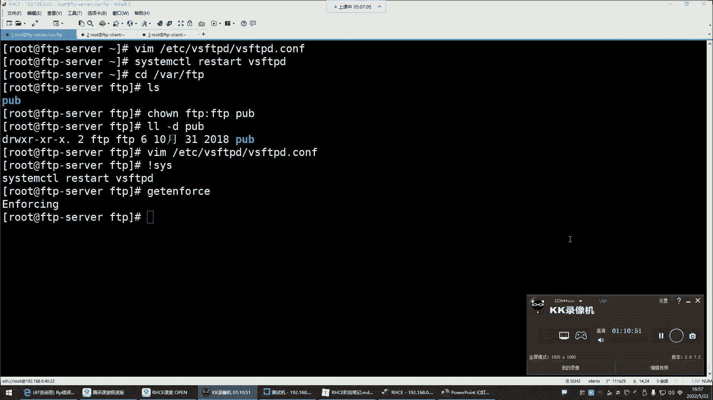

---

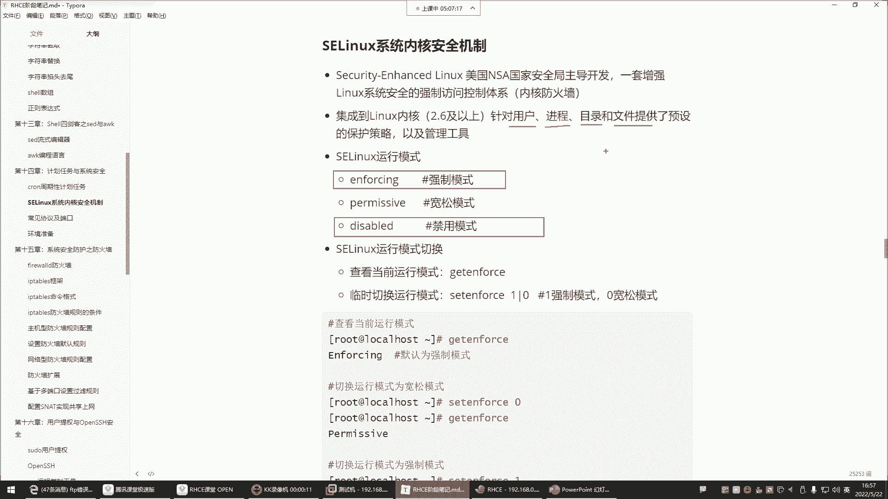

## SELinux强制模式导致的FTP问题 🚫

上一节我们介绍了FTP的基本配置，本节中我们来看看一个常见的排错场景。在企业环境中，SELinux常被禁用，原因在于其强制模式会严格管控所有用户进程、目录和文件。


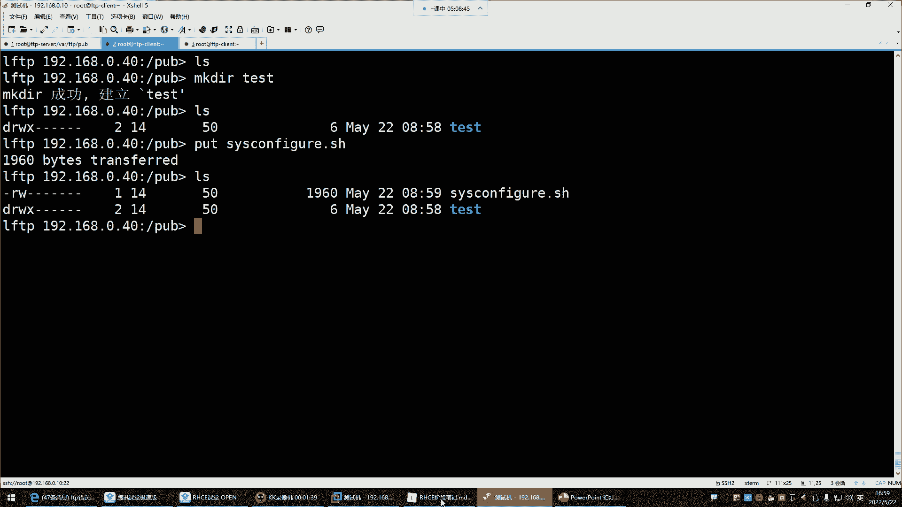

当SELinux处于强制模式（`enforcing`）时，即使系统文件和目录权限设置正确，FTP用户也可能无法执行创建文件等操作，因为SELinux策略会拒绝该操作。


检查当前SELinux模式：
```bash
getenforce
```
若输出为 `enforcing`，则表示处于强制模式。此时需要将其关闭或改为宽容模式以排除干扰。

临时关闭SELinux（重启后失效）：
```bash
setenforce 0
```
永久关闭需修改配置文件 `/etc/selinux/config`，将 `SELINUX=` 的值改为 `disabled`，然后重启系统。

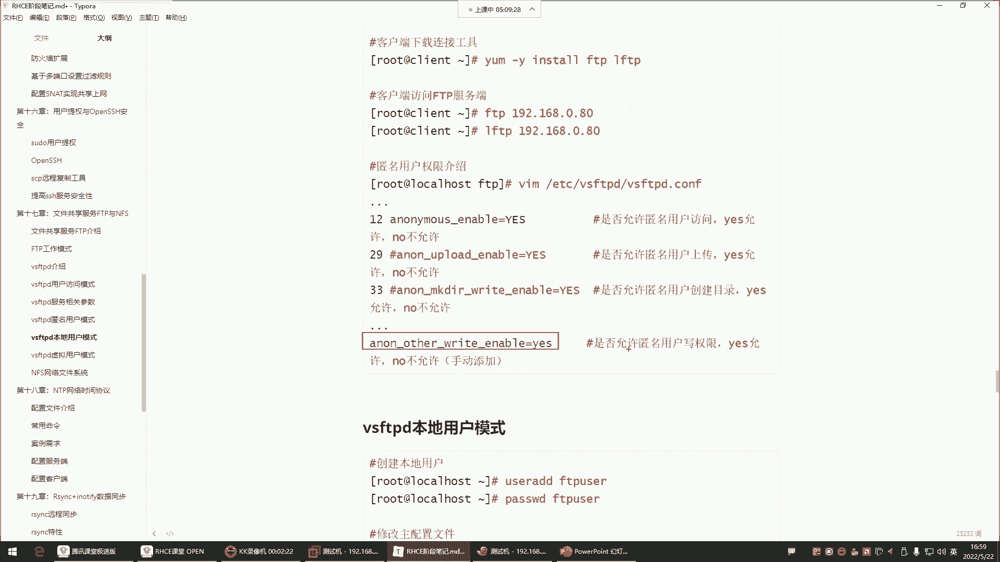

关闭SELinux后，之前失败的FTP文件创建操作通常可以成功执行。

---

## 配置FTP匿名用户权限 ⚙️

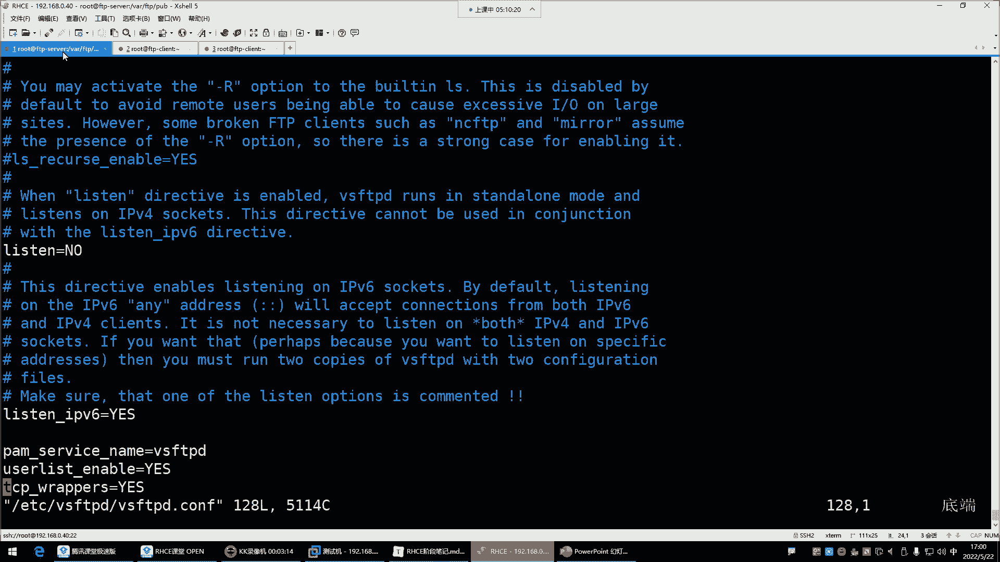

解决了SELinux问题后，我们来看看如何为FTP匿名用户配置具体的操作权限。默认情况下，匿名用户仅有查看和下载文件的权限。

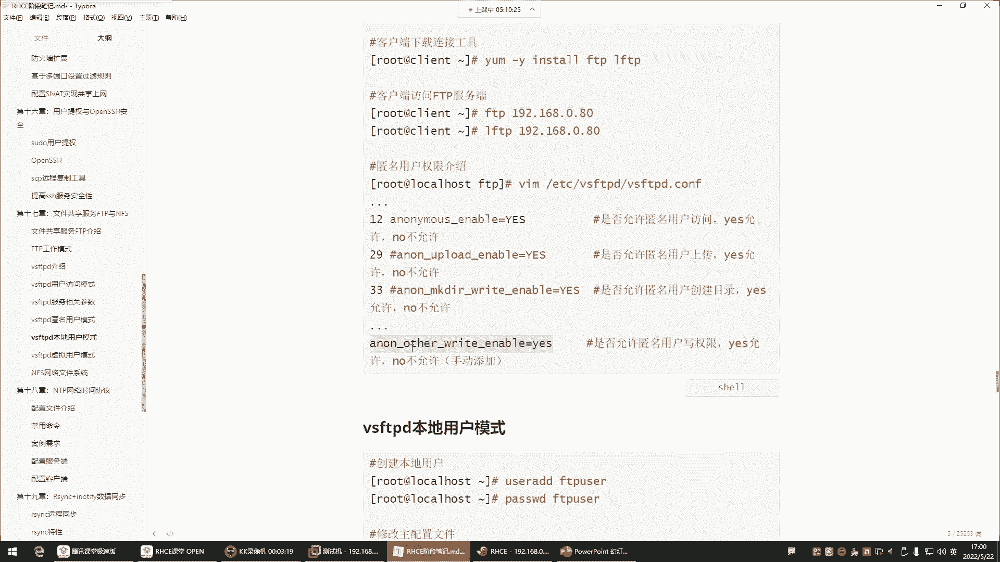

以下是FTP配置文件 `/etc/vsftpd/vsftpd.conf` 中与匿名用户权限相关的核心参数：

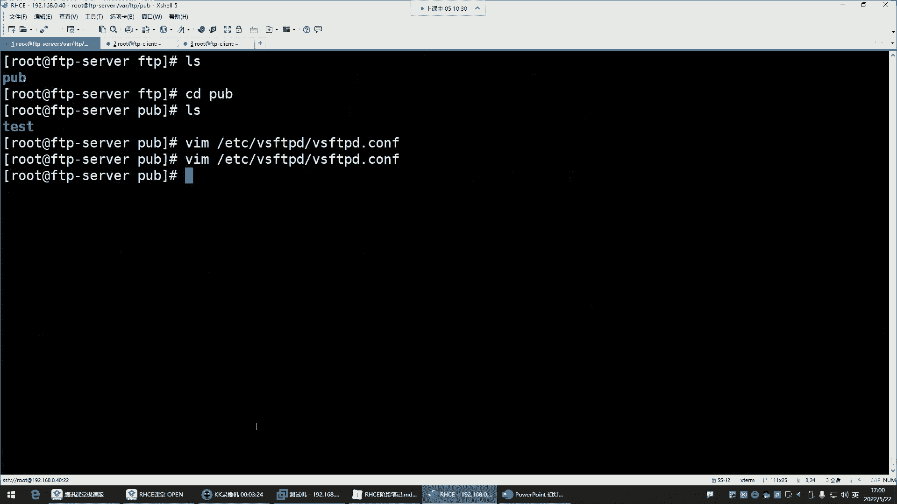

*   **`anon_upload_enable=YES`**：允许匿名用户上传文件。
*   **`anon_mkdir_write_enable=YES`**：允许匿名用户创建目录。
*   **`anon_other_write_enable=YES`**：允许匿名用户执行其他写入操作，如**重命名**和**删除**文件。

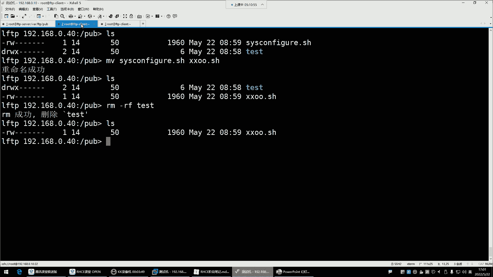

默认配置中，写权限（特别是删除和重命名）是未开启的。


例如，未开启 `anon_other_write_enable` 时，匿名用户尝试删除 (`rm`) 或重命名 (`mv`) 文件会显示“权限不足”。

若需开启这些权限，需编辑配置文件：

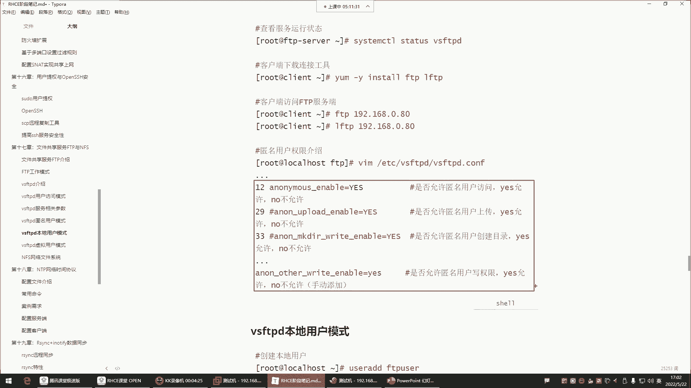


1.  打开配置文件 `/etc/vsftpd/vsftpd.conf`。
2.  在文件末尾添加或取消注释相应的参数行。
3.  保存并退出编辑器。
4.  重启vsftpd服务使配置生效。

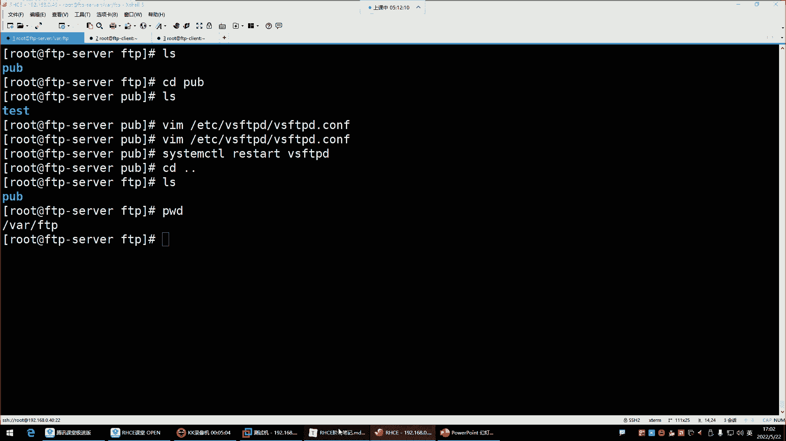

```bash
systemctl restart vsftpd
```


服务重启后，匿名用户即可执行重命名和删除操作。


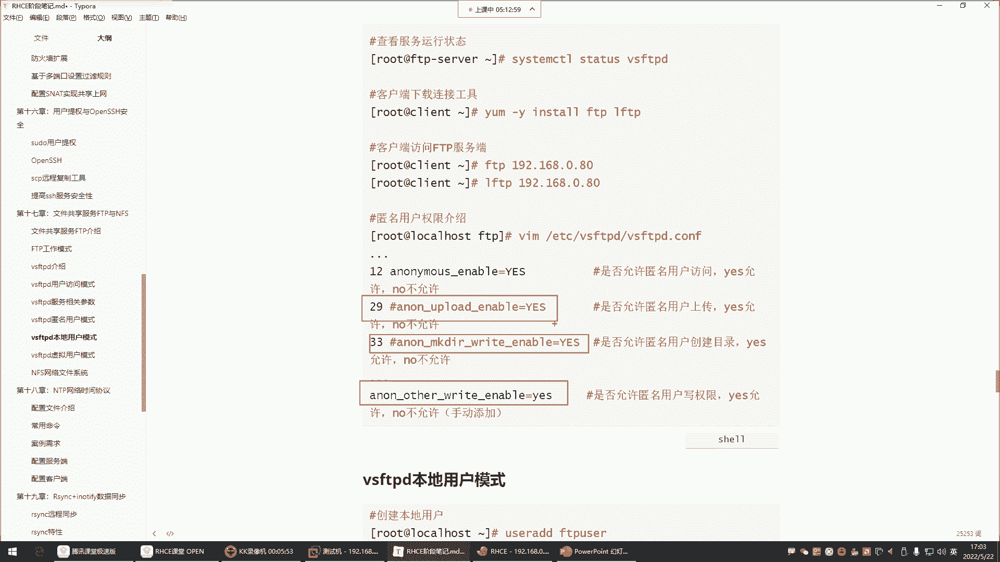

---

## 企业级FTP权限管理实践 🏢

经过一系列的配置和测试，我们对FTP服务器权限有了更深的了解。FTP服务默认启用匿名用户访问模式，此匿名用户实际对应系统账号 `ftp`。

关于权限管理的总结如下：

*   **默认权限**：匿名用户可**查看**和**下载**文件。
*   **扩展权限**：如需上传、创建目录、删除或重命名文件，必须在配置文件中显式开启相应选项。
*   **目录规划**：通常不会直接开放FTP根目录（如 `/var/ftp`）的全部权限。最佳实践是在其下创建子目录（如 `/var/ftp/pub`）用于存放共享数据，并仅对该子目录进行权限配置。


以上讲解的权限配置均针对**匿名用户**。但在实际企业环境中，出于安全考虑，通常不会授予匿名用户过大的权限。


企业场景通常只允许匿名用户下载，因此会禁用上传、创建、删除和重命名权限。这类似于网盘服务，你只希望他人从你这里获取文件，而不允许他人随意修改你的存储内容。


因此，标准的做法是注释掉或删除配置文件中所有为匿名用户赋予写权限的选项（所有以 `anon_` 开头的写权限参数），然后重启服务。

```bash
# 示例：注释掉匿名用户写权限
# anon_upload_enable=YES
# anon_mkdir_write_enable=YES
# anon_other_write_enable=YES
```

重启后，匿名用户将恢复为仅可浏览和下载，无法再进行修改操作。

关于文件下载，需注意共享文件本身需要对其他用户（`others`）具有读（`r`）权限。通常由文件所有者放置的文件，其默认权限允许他人读取，即可正常下载。无需也不建议将共享文件权限改为 `777`。

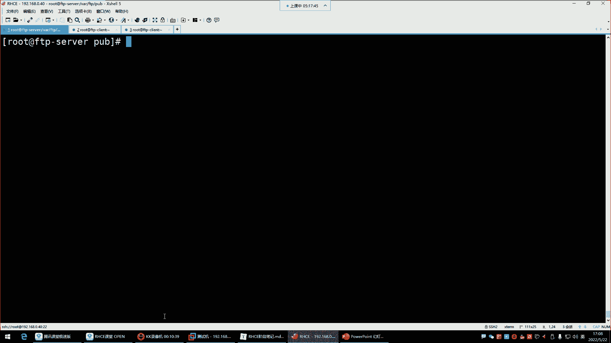


本节课中我们一起学习了如何排查因SELinux导致的FTP问题，并掌握了为FTP匿名用户配置不同级别权限（从仅下载到完全控制）的方法，最后了解了企业环境中严格权限控制的最佳实践。

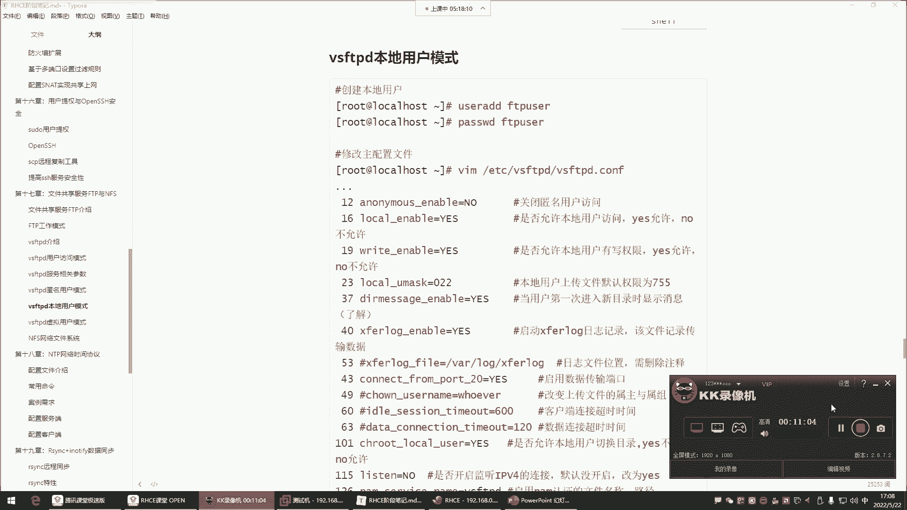

