# Linux运维：P59：Rsync+Inotify数据增量备份 🔄

在本节课中，我们将要学习如何使用 Rsync 工具进行高效的数据同步与增量备份，并了解如何结合 Inotify 实现实时监控与自动同步。我们将从基本概念入手，逐步讲解本地同步、远程同步以及自动化脚本的编写。

---

## 什么是 Rsync 与增量备份

Rsync 是一个开源的、快速的、多功能的数据同步工具，可以实现本地或远程主机之间的数据同步与增量备份。它主要应用于数据备份和数据同步领域。

传统的备份方式（如 `cp` 或 `tar` 命令）在每次备份时都会复制整个文件或目录，即使只有部分内容发生了变化。这会导致存储空间被大量重复数据占用。

**增量备份** 则不同。它只同步发生变化的部分。例如：
*   第一次备份时，文件有两条数据，备份文件包含这两条数据。
*   文件新增两条数据后，第二次备份**仅同步新增的这两条数据**，不会重复备份已有的数据。
*   再次新增数据后，第三次备份同样只同步最新的变化。

这种方式的核心优势是**节约存储空间**。Rsync 就是实现增量备份的优秀工具。

---

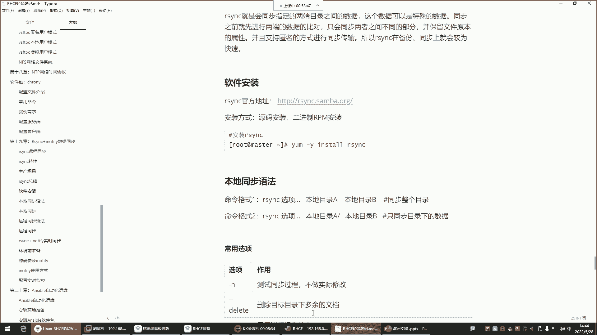


## Rsync 的基本使用

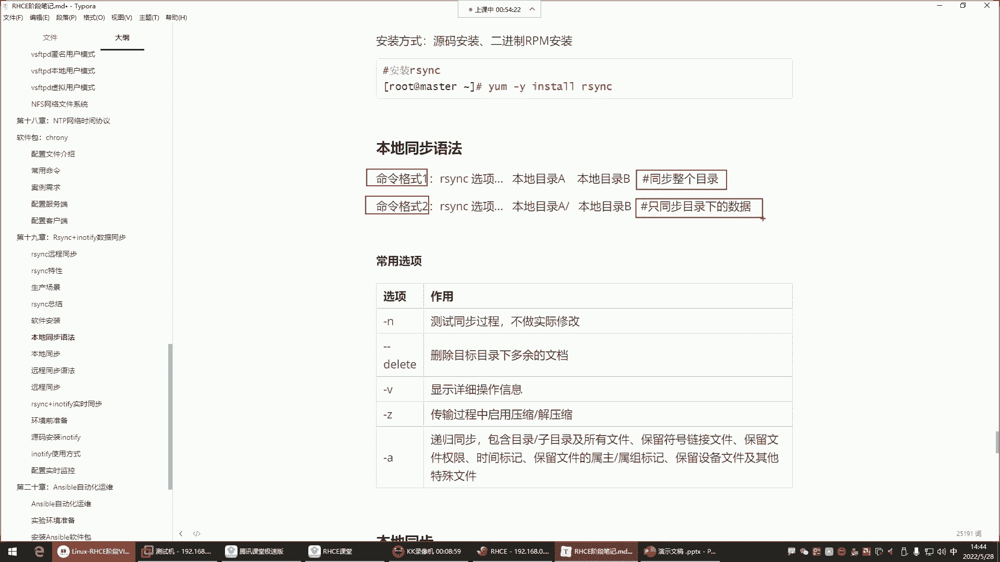

上一节我们介绍了 Rsync 的基本概念，本节中我们来看看它的具体安装与使用方法。


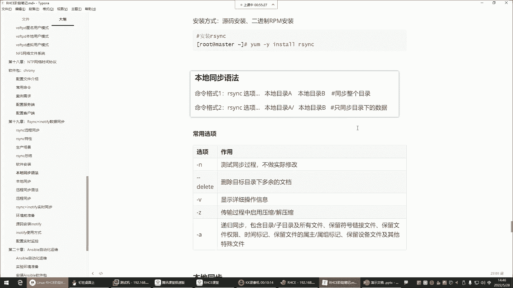

首先，需要确保系统已安装 Rsync 软件包。如果没有，可以使用以下命令安装：


```bash
yum -y install rsync
```

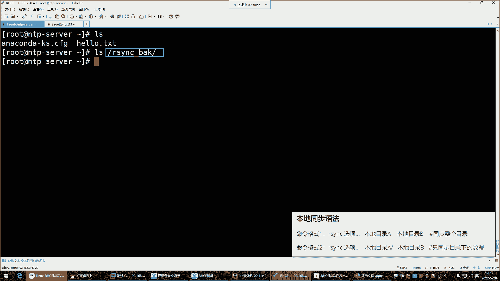

Rsync 是一个命令行工具，安装后即可使用，没有独立的服务。

它的命令格式主要有两种，区别在于源目录路径后是否添加斜杠 `/`：
1.  **同步整个目录**：源目录路径后**不加**斜杠，会将目录本身及其内容一同同步到目标位置。
2.  **同步目录下的数据**：源目录路径后**添加**斜杠，只同步目录内的内容到目标位置。


以下是 Rsync 的常用选项说明：
*   `-n`：测试运行，不做实际修改。
*   `--delete`：删除目标目录下源目录中没有的额外文件，以保持两端完全一致。**此选项需谨慎使用**。
*   `-v`：显示详细的操作信息。
*   `-z`：在传输过程中进行压缩，适用于大文件，可以加快传输速度。
*   `-a`：归档模式，相当于 `-rlptgoD`，可以保留文件的权限、属性等信息，是常用的备份选项。

通常，我们会组合使用 `-avz` 选项进行备份。

---

## 本地同步实战

接下来，我们通过实际操作来理解上述两种命令格式和选项的效果。

首先，创建用于测试的目录和文件：

```bash
mkdir /rsync_back
cd ~
touch hello.txt abc.txt
```


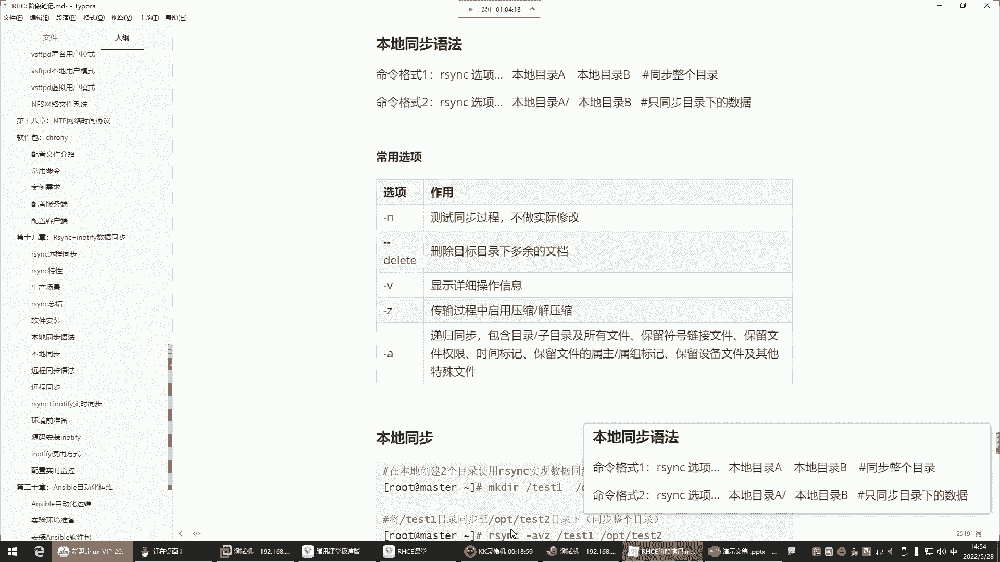

**示例1：同步整个目录（不加 `/`）**
以下命令将 `/root` 目录本身同步到 `/rsync_back` 下。

```bash
rsync -avz /root /rsync_back
```
执行后，查看 `/rsync_back`，会发现里面有一个 `root` 目录，其中包含了原 `/root` 目录下的所有文件。


**示例2：同步目录下的数据（加 `/`）**
删除刚才的目标目录，重新执行带斜杠的命令。

```bash
rm -rf /rsync_back/root
rsync -avz /root/ /rsync_back
```
此时查看 `/rsync_back`，会发现文件（如 `hello.txt`）被直接同步到了该目录下，而没有 `root` 这个上层目录。


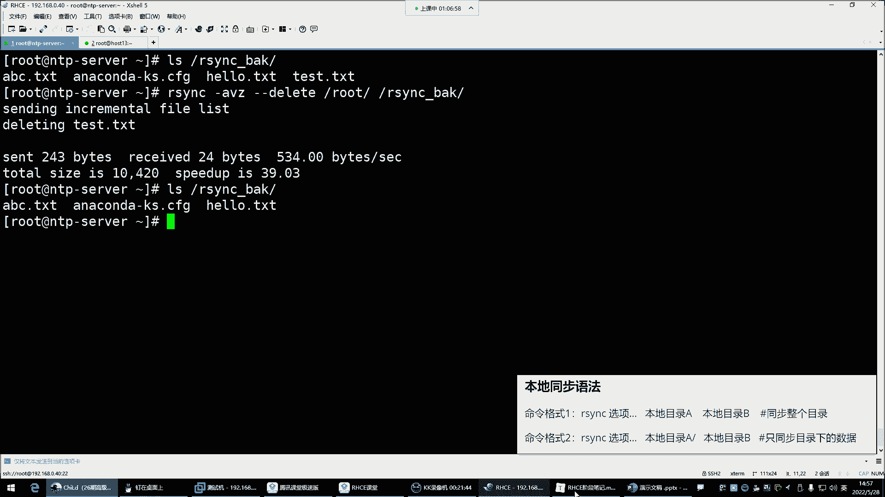

**验证增量备份**
现在，我们修改一个文件，然后再次同步，观察 Rsync 的行为。

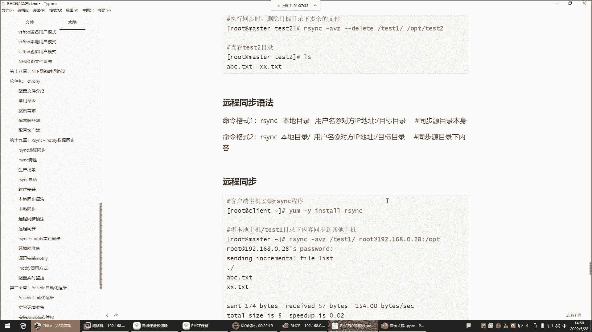

```bash
echo "new content" >> /root/hello.txt
rsync -avz /root/ /rsync_back
```
输出信息会显示只有 `hello.txt` 被同步，其他未变化的文件不会被重复处理，这证明了其增量备份的特性。

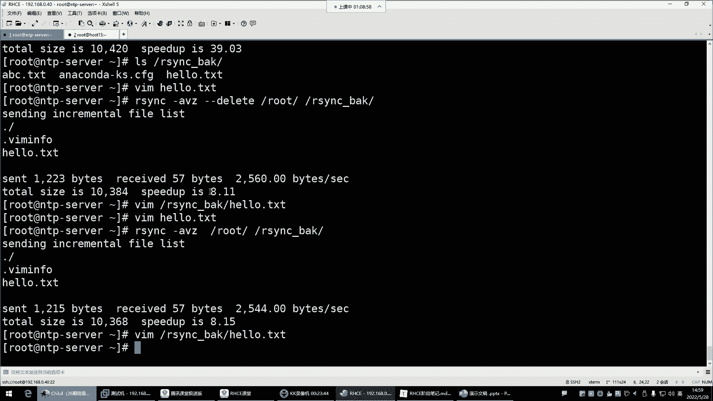

**`--delete` 选项演示**
在目标目录 `/rsync_back` 中创建一个源目录 `/root` 中没有的文件。

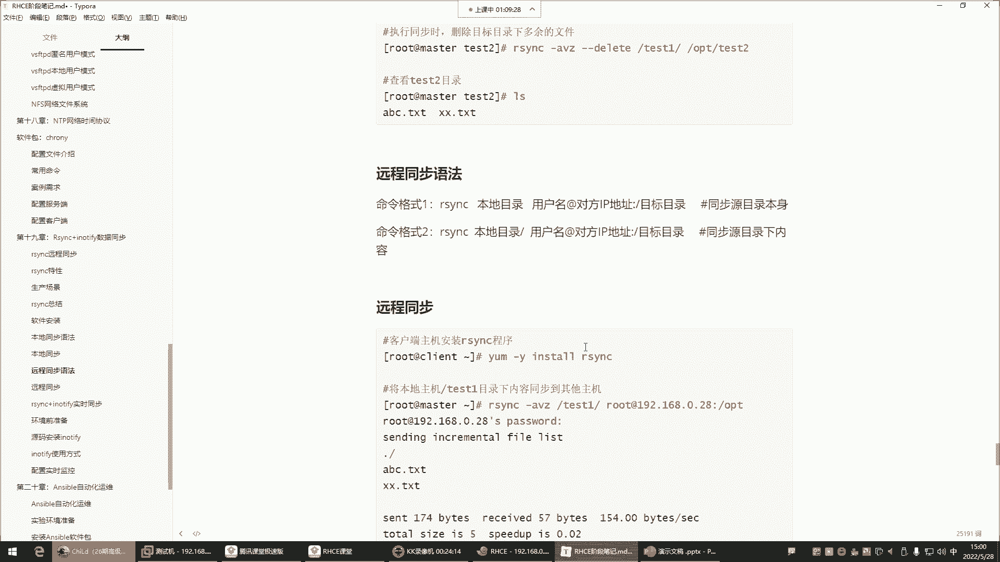

```bash
touch /rsync_back/extra.txt
```
此时，如果使用普通同步命令，`extra.txt` 会保留在目标目录。但如果使用 `--delete` 选项：

```bash
rsync -avz --delete /root/ /rsync_back
```
Rsync 会在同步后删除目标目录中的 `extra.txt` 文件，使两个目录内容完全一致。

---

## 远程同步实战

上一节我们掌握了本地同步，本节中我们来看看如何在不同机器之间进行远程同步。其命令格式与本地同步非常相似。


远程同步的基本语法如下：

```bash
rsync [选项] 本地文件或目录 用户名@远程主机IP:目标路径
rsync [选项] 用户名@远程主机IP:源文件或目录 本地路径
```

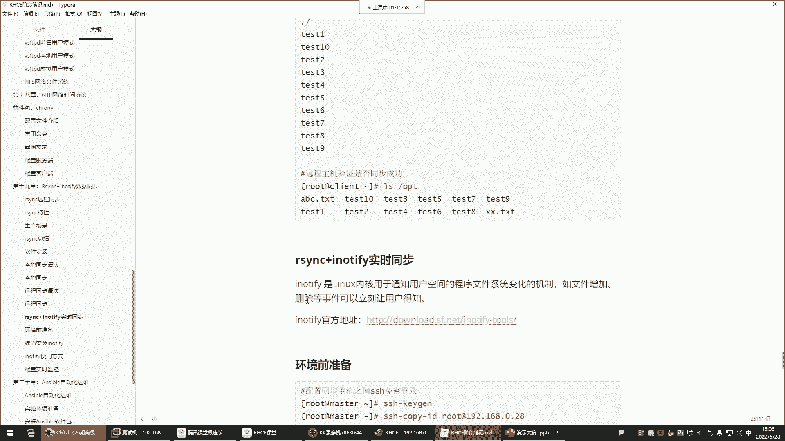

**准备工作**：确保**远程主机**也安装了 `rsync` 软件包。为了免去每次输入密码的麻烦，建议配置 SSH 密钥对实现免密登录。

1.  **生成并分发密钥**（在本地主机执行）：
    ```bash
    ssh-keygen -t rsa
    ssh-copy-id root@192.168.0.13
    ```

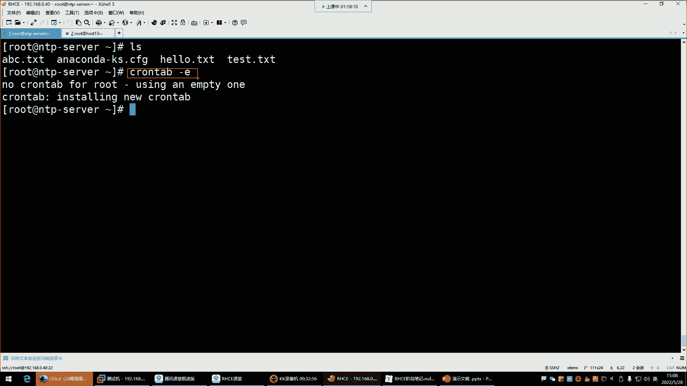

2.  **执行远程同步**：
    将本地 `/root` 目录下的内容同步到远程主机 `192.168.0.13` 的 `/opt` 目录。

    ```bash
    rsync -avz /root/ root@192.168.0.13:/opt/
    ```
    命令执行后，本地 `/root/` 下的文件就会被增量同步到远程主机的 `/opt/` 目录下。

远程同步的核心就是在路径前加上 `用户名@主机IP:`，其他选项和逻辑与本地同步完全一致。

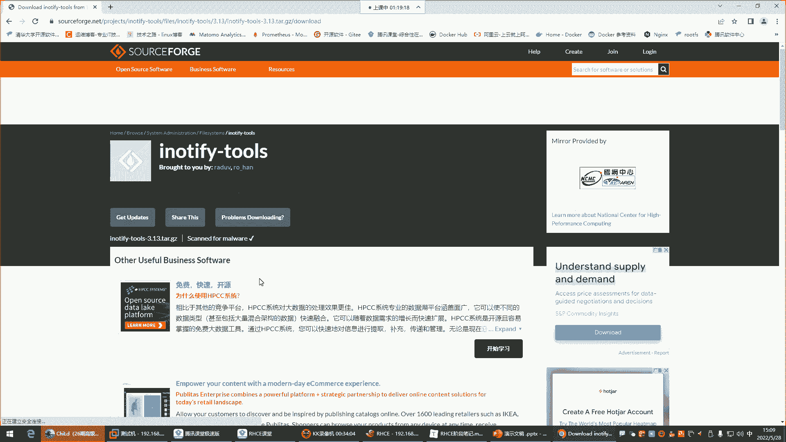

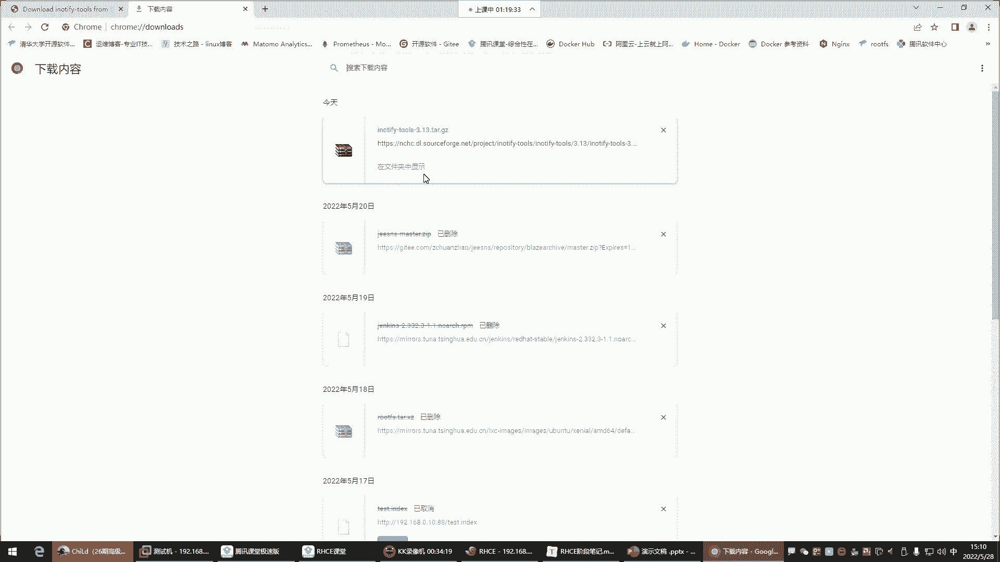

---


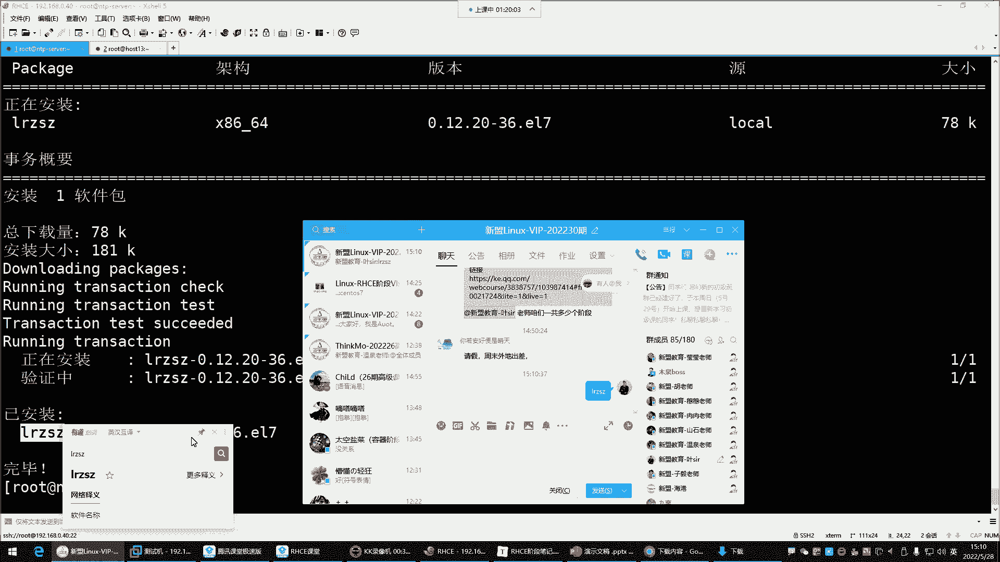

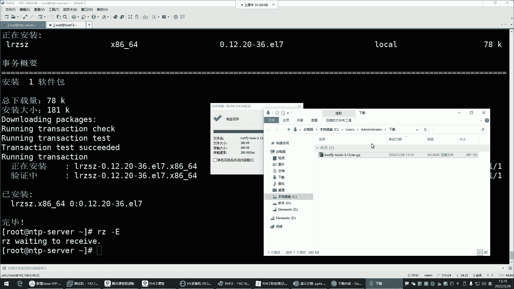

## 结合 Inotify 实现实时自动同步

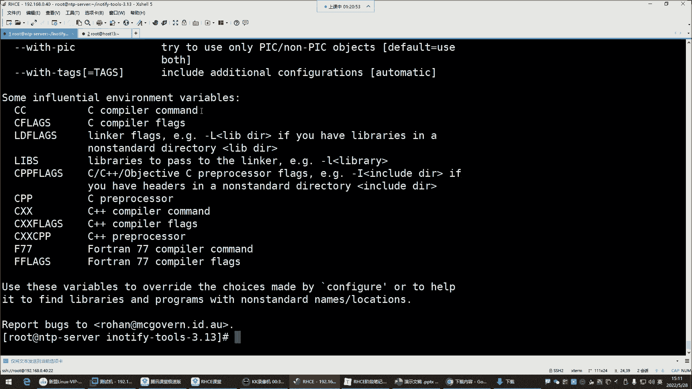


虽然我们可以通过计划任务（Cron）定时执行 Rsync 脚本实现自动备份，但这无法做到实时。Inotify 是一个 Linux 内核特性，可以监控文件系统的变化（如创建、修改、删除事件）。结合 Rsync，可以实现近乎实时的自动同步。

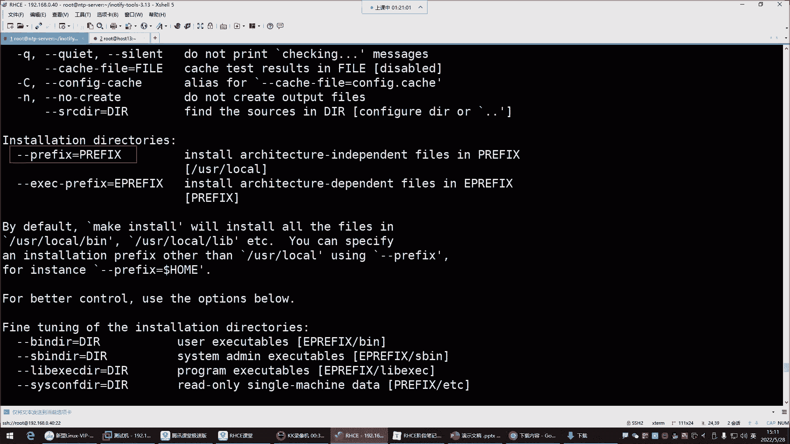


**注意**：Inotify 持续监控会消耗一定的系统资源，在生产环境中需评估使用。更常见的做法是使用 Cron 定时任务。


以下是部署与使用 Inotify-tools 的基本步骤：


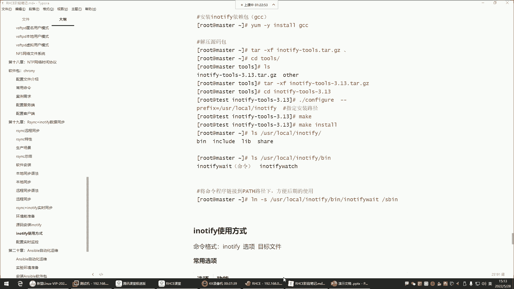

1.  **编译安装 Inotify-tools**：
    这是一个第三方工具集，需要从官网下载源码编译安装。
    ```bash
    # 假设已下载 inotify-tools-3.13.tar.gz
    tar -zxf inotify-tools-3.13.tar.gz
    cd inotify-tools-3.13
    ./configure --prefix=/usr/local/inotify
    make && make install
    ```


2.  **创建命令软链接**：
    ```bash
    ln -s /usr/local/inotify/bin/inotifywait /usr/sbin/inotifywait
    ```

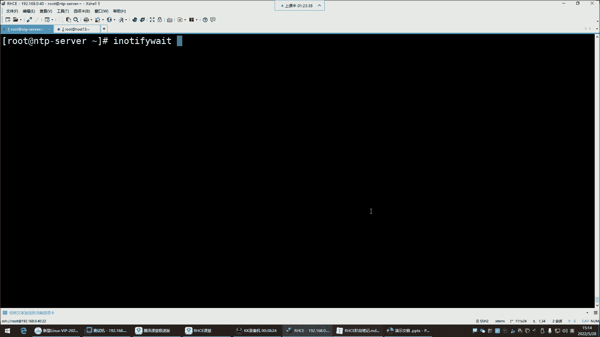

3.  **编写监控同步脚本**：
    创建一个脚本（如 `/scripts/auto_rsync.sh`），使用 `inotifywait` 监控目录，一旦有变化就触发 `rsync` 同步。

    ```bash
    #!/bin/bash
    # 监控 /root 目录，同步到 192.168.0.13 的 /opt 目录
    /usr/sbin/inotifywait -mrq -e modify,create,delete /root | while read event
    do
        rsync -avz --delete /root/ root@192.168.0.13:/opt/
    done
    ```

4.  **运行脚本**：
    给脚本添加执行权限，并可以放入后台运行。
    ```bash
    chmod +x /scripts/auto_rsync.sh
    /scripts/auto_rsync.sh &
    ```
    现在，当你在 `/root` 目录下创建、修改或删除文件时，脚本会自动将这些变化同步到远程主机。

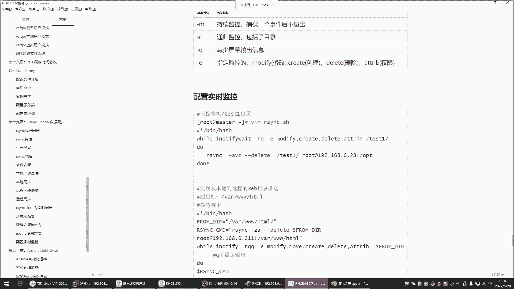

---


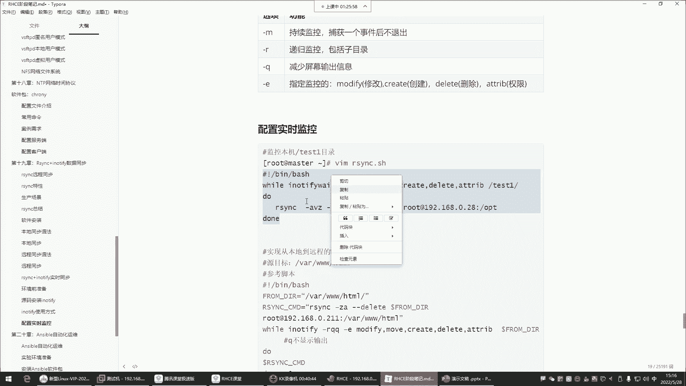

## 总结

本节课中我们一起学习了数据备份的重要工具 Rsync 和 Inotify。


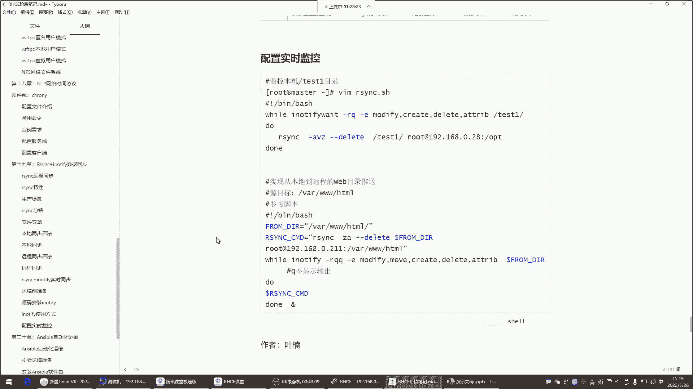

我们首先了解了**增量备份**相比传统全量备份的优势。然后，详细讲解了 **Rsync 命令的两种基本格式**（是否加 `/`）及其核心**选项**（如 `-a, -v, -z, --delete`），并通过实例演示了**本地同步**与**远程同步**的操作。

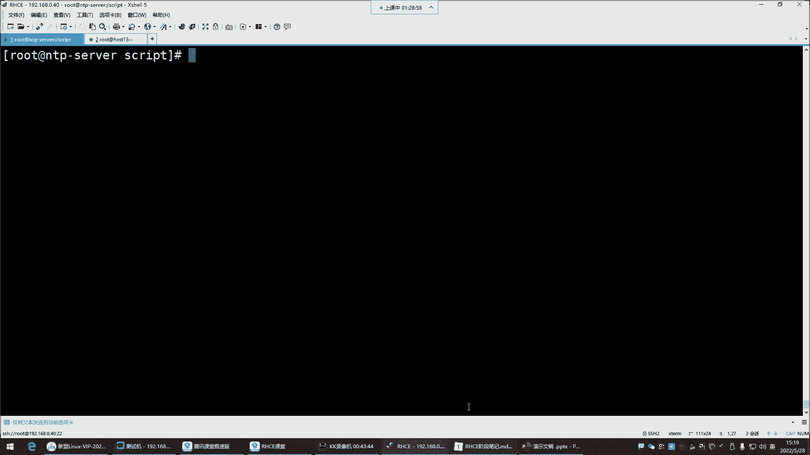

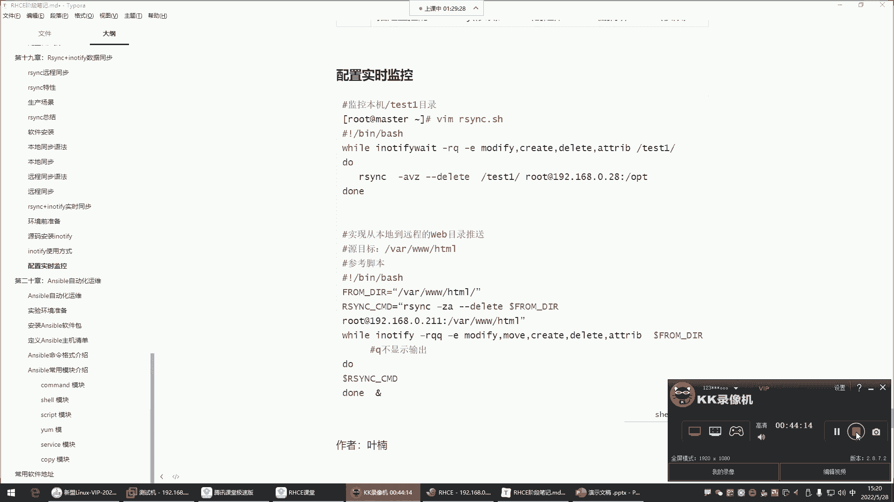

最后，我们介绍了如何使用 **Inotify** 监控文件系统变化，并编写脚本将其与 Rsync 结合，实现**数据的实时自动同步**方案。请记住，实时同步会消耗更多资源，在实际生产环境中，通常使用 **Cron 定时任务执行 Rsync 脚本**来平衡效率与资源消耗。