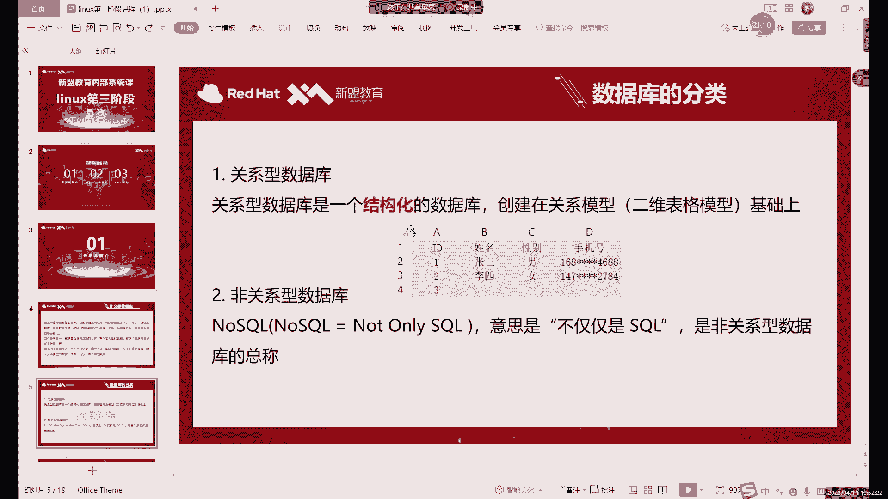
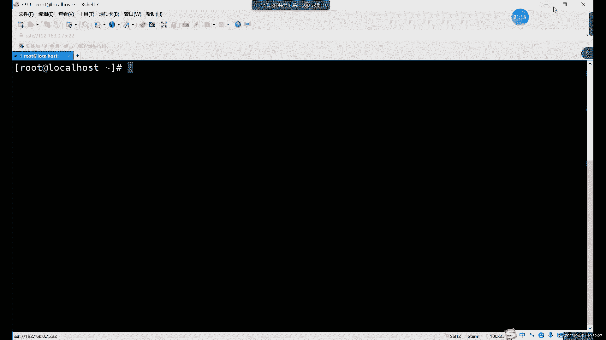
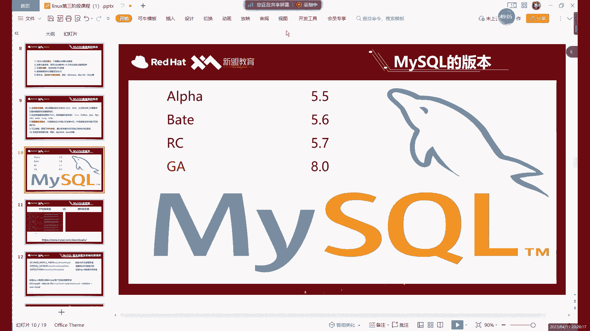
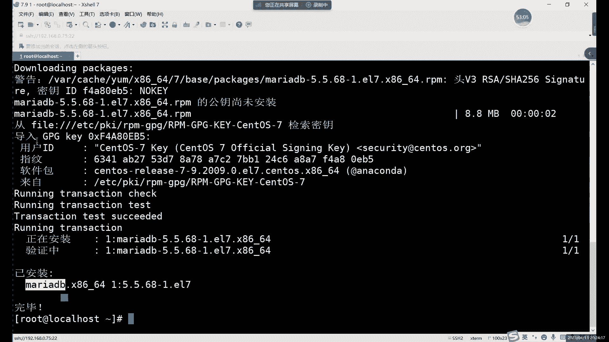
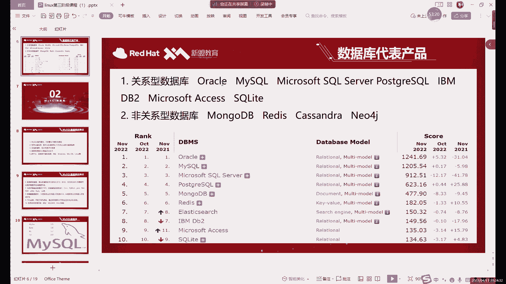

# Linux中级运维：P62：MySQL介绍及安装-上

## 概述
在本节课中，我们将开始学习Linux中级运维的第三阶段课程。这一阶段的核心内容是数据库和网站架构。本节课，我们将首先聚焦于数据库，特别是关系型数据库MySQL。我们将了解数据库的基本概念、分类，并开始学习MySQL的安装准备工作。

## 数据库简介
数据库，顾名思义，是存放数据的仓库。它的存储空间很大，可以存放百万、千万甚至更多的数据记录。数据库与直接将文件存放在磁盘中的方式有本质区别，它通过特定的规则和结构来组织数据，这使得数据的查询和管理效率远高于文件系统。

在数据库诞生之前，数据通常直接存放在文件系统中。这种方式在查找特定数据时效率很低，因为系统需要遍历磁盘中的大量文件。数据库通过结构化的方式存储数据，极大地提升了数据操作的效率，例如查询一条记录可能仅需几毫秒。

## 数据库的分类
数据库主要分为两大类：关系型数据库和非关系型数据库。

### 关系型数据库
关系型数据库是一种结构化的数据库，其数据组织方式类似于Excel表格，由行和列构成二维表。
*   **表**：每个表有固定的结构。
*   **字段**：表的每一列称为一个字段，定义了该列数据的类型和规则（例如，只能存储数字或特定长度的字符串）。
*   **记录**：表的每一行是一条具体的数据记录。
*   **关联**：多个表之间可以通过共同的字段（如ID、姓名）建立联系，方便进行联合查询。

关系型数据库的核心特点在于其严谨的结构和数据之间的关联关系。MySQL、Oracle、SQL Server都属于这一类。

### 非关系型数据库
非关系型数据库则没有固定的表结构，存储数据的方式更加灵活，通常以键值对（如 `A=3`）等形式存储。它更多地被用于缓存等场景，很多非关系型数据库的数据直接运行在内存中，以提升访问速度。Redis、MongoDB是典型的非关系型数据库。

**核心概念对比：**
*   **关系型数据库**：`数据存储在由行和列组成的结构化表格中。`
*   **非关系型数据库**：`数据常以键值对形式存储，如 redis.set(‘A’, ‘3‘)。`

> 本节课我们主要学习关系型数据库。非关系型数据库（如Redis）将在后续课程中详细讲解。

## MySQL数据库详解
在众多关系型数据库中，我们将重点学习MySQL。

### MySQL的特点
1.  **开源免费**：社区版开源且免费，这是其广泛流行的重要原因。
2.  **性能强大**：支持多线程，能充分利用多核CPU资源处理大量数据。
3.  **使用SQL语言**：使用标准的SQL（结构化查询语言）进行数据管理和操作。
    *   `CREATE DATABASE` 用于创建数据库。
    *   `INSERT INTO` 用于向表中插入数据。
4.  **跨平台支持**：可在Windows、Linux、macOS等多种操作系统上运行。
5.  **支持多语言**：通过设置字符编码（如UTF-8）来支持包括中文在内的多种语言，避免乱码问题。
6.  **可定制性**：开源特性允许有能力的用户进行二次开发。
7.  **存储引擎**：MySQL的核心组件之一，如同数据库的“大脑”，负责数据的存储和读写。后续会有专门课程讲解。

### MySQL的版本
当前MySQL的主流版本是5.7和8.0。
*   **5.7版本**：目前市场占有率最高，非常稳定且常用。
*   **8.0版本**：新版本，功能更多，正被越来越多的公司采用。

两个版本在基本命令上大部分相同，但存在一些差异。对于初学者，从5.7版本开始学习是很好的选择。

## MySQL安装准备
在Linux系统中，安装软件主要有几种方式。我们将为安装MySQL做好准备。

### 软件安装方式
在CentOS/Red Hat系统中，常见的安装方式有：
1.  **RPM包安装**：安装扩展名为 `.rpm` 的预编译软件包。
2.  **YUM安装**：基于RPM包的高级包管理工具，能自动解决依赖关系并从仓库下载安装。`yum install -y 软件名`
3.  **源码编译安装**：最通用的方式，从源代码编译安装，适用于所有Linux发行版。

YUM本质上也是安装RPM包，但它更加自动化。需要注意的是，YUM仓库中的软件包可能不全或版本较旧。

### 获取安装包
我们将使用RPM包方式安装MySQL。课程所需的MySQL 5.7安装包已提供。

**重要提示**：
直接使用 `yum install -y mysql` 命令可能会安装一个名为 `MariaDB` 的旧版本数据库（MySQL的一个分支）。为了安装正版MySQL，我们需要使用特定的RPM包。

## 总结
本节课我们一起学习了数据库的基础知识。我们了解了数据库相较于文件系统的优势，掌握了关系型与非关系型数据库的核心区别，并详细认识了MySQL数据库的特点和版本情况。最后，我们为下一节课的实际安装操作做好了准备，明确了软件安装的方式和注意事项。下节课，我们将正式开始安装和配置MySQL数据库。