# Linux运维：P65：中级运维-4.SQL语句，数据类型，约束 📚


在本节课中，我们将学习MySQL中的SQL语句类型、数据类型以及约束。我们将从创建数据库和表格开始，逐步了解如何定义数据的存放规则，并进行基本的数据操作。

---

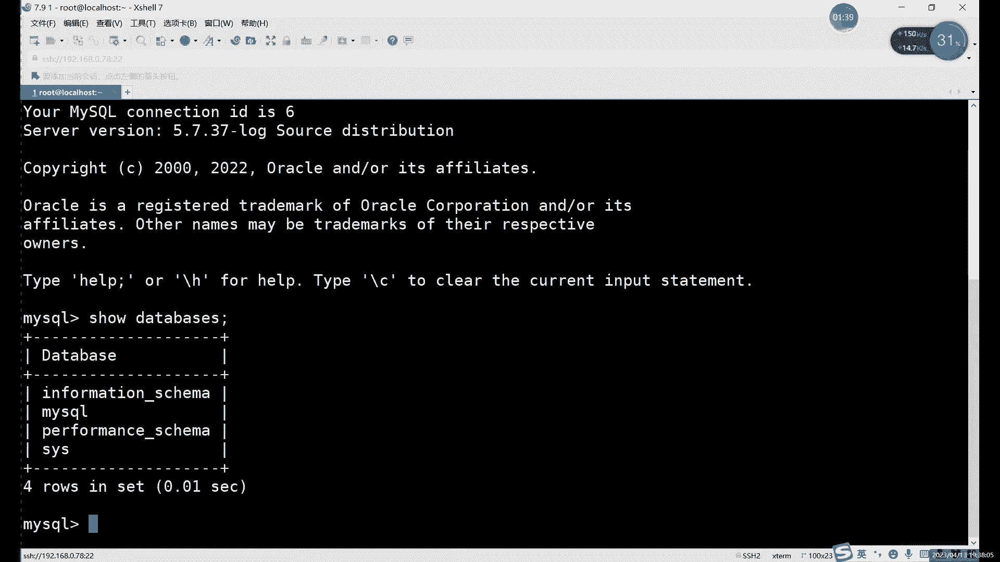

## SQL语句的主要类型 🗂️

上一节我们介绍了MySQL的安装和基本连接，本节中我们来看看SQL语句的主要类型。

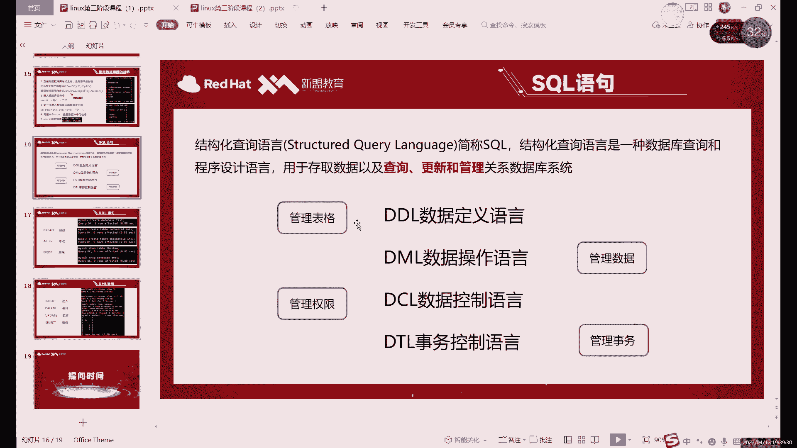

SQL语句一般分为四种，它们分别用于管理数据库中的不同对象和操作。

以下是四种主要的SQL语句类型：

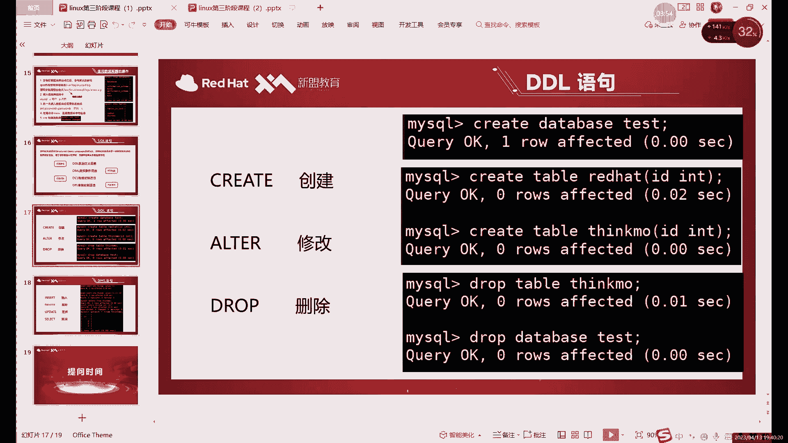

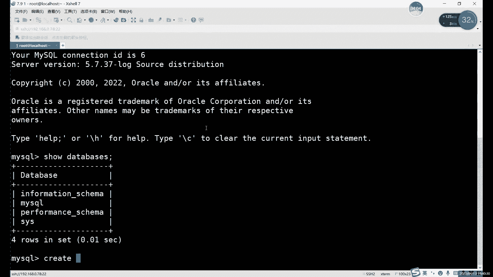

*   **DDL (数据定义语言)**：用于定义和管理数据库、表、视图、索引等结构。主要命令有 `CREATE`、`ALTER`、`DROP`。
*   **DML (数据操作语言)**：用于对表中的数据进行增、删、改、查操作。主要命令有 `INSERT`、`DELETE`、`UPDATE`、`SELECT`。
*   **DCL (数据控制语言)**：用于控制数据库的访问权限和事务。主要命令有 `GRANT`、`REVOKE`。
*   **TCL (事务控制语言)**：用于管理数据库中的事务。主要命令有 `COMMIT`、`ROLLBACK`、`SAVEPOINT`。

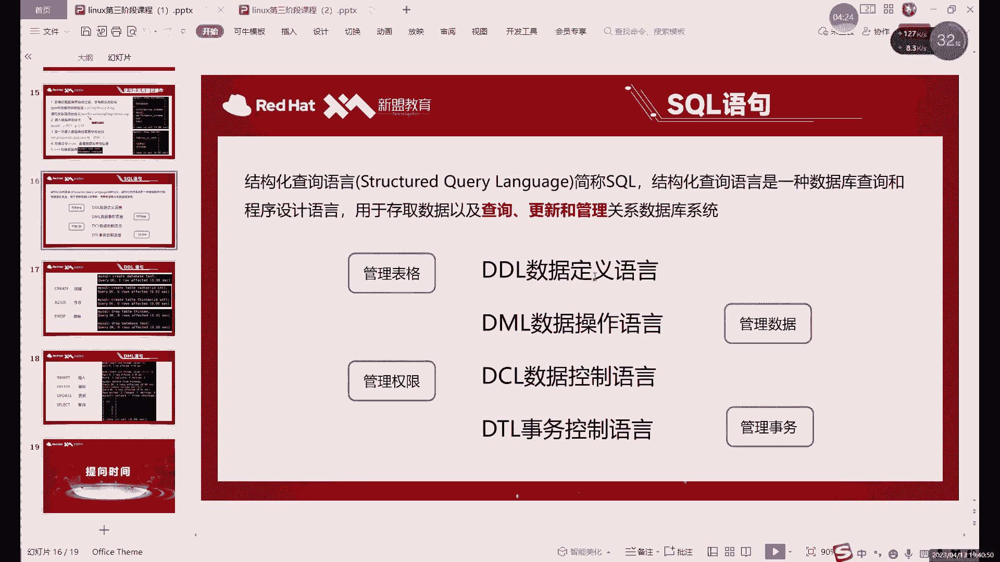

---


## DDL：数据定义语言 🏗️

DDL语言的核心是定义数据的存放结构，即创建和修改表格的规则。接下来，我们将学习如何使用DDL命令。

### 创建数据库与表格

首先，我们需要创建一个数据库，并在其中创建表格。

以下是创建数据库和表格的步骤：

1.  **创建数据库**：使用 `CREATE DATABASE` 命令。
    ```sql
    CREATE DATABASE mydb;
    ```

2.  **切换到数据库**：使用 `USE` 命令进入特定的数据库。
    ```sql
    USE mydb;
    ```

3.  **创建表格**：使用 `CREATE TABLE` 命令定义表的结构，包括字段名和数据类型。
    ```sql
    CREATE TABLE xh (
        id INT,
        db VARCHAR(18),
        system CHAR(3)
    );
    ```
    *   `INT` 表示整数类型。
    *   `VARCHAR(18)` 表示可变长度字符串，最大长度为18个字符。
    *   `CHAR(3)` 表示固定长度字符串，长度固定为3个字符。字符类型的长度单位是字符数，不是字节。

### 修改表格结构

`ALTER` 命令用于修改已存在的表结构，可以修改表名、字段名、数据类型或添加约束等。

以下是修改表名的示例：

```sql
ALTER TABLE xh RENAME TO new_table;
```

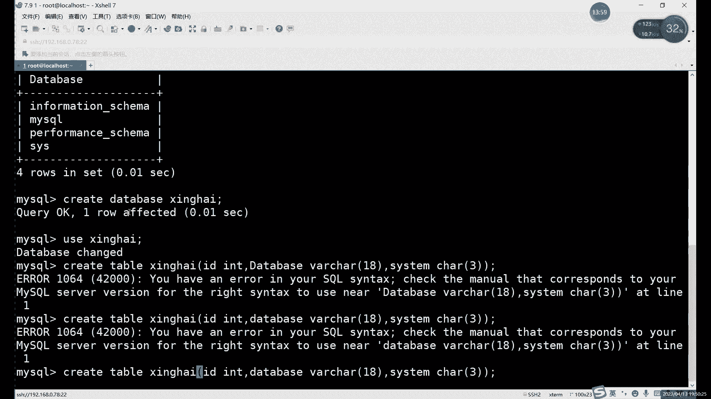

### 删除表格或数据库


`DROP` 命令用于删除整个表或数据库。**此操作不可逆，需谨慎使用。**

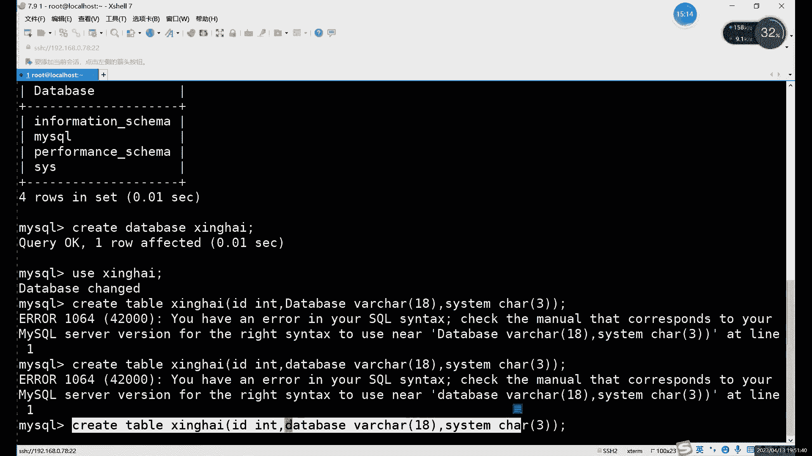

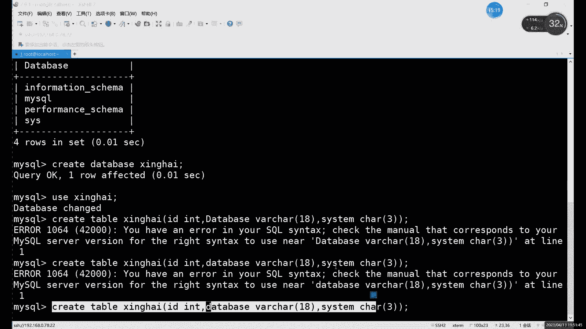

以下是删除操作的命令：

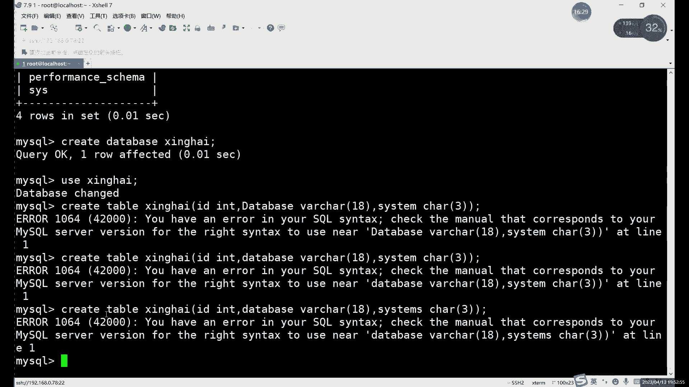

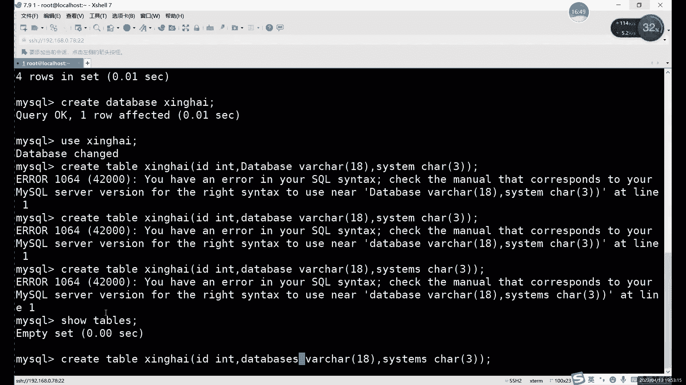

*   删除表格：`DROP TABLE table_name;`
*   删除数据库：`DROP DATABASE database_name;`

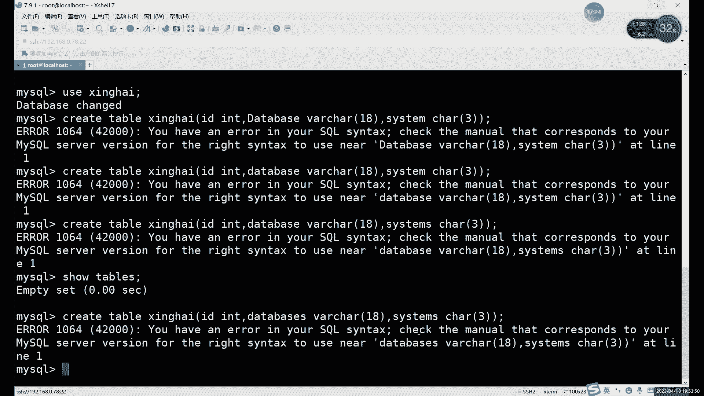

---

## DML：数据操作语言 📝

在定义好表格结构后，我们就可以使用DML语言来操作其中的数据了。本节我们将学习数据的增、删、改、查。

### 插入数据 (INSERT)

`INSERT INTO` 命令用于向表中添加新数据。

以下是插入数据的几种方式：

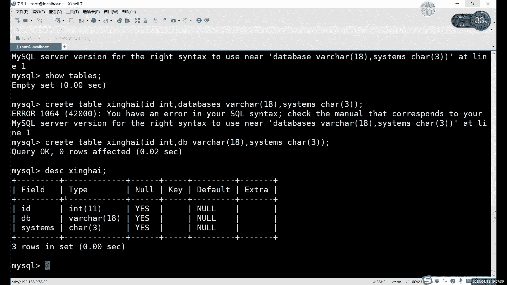

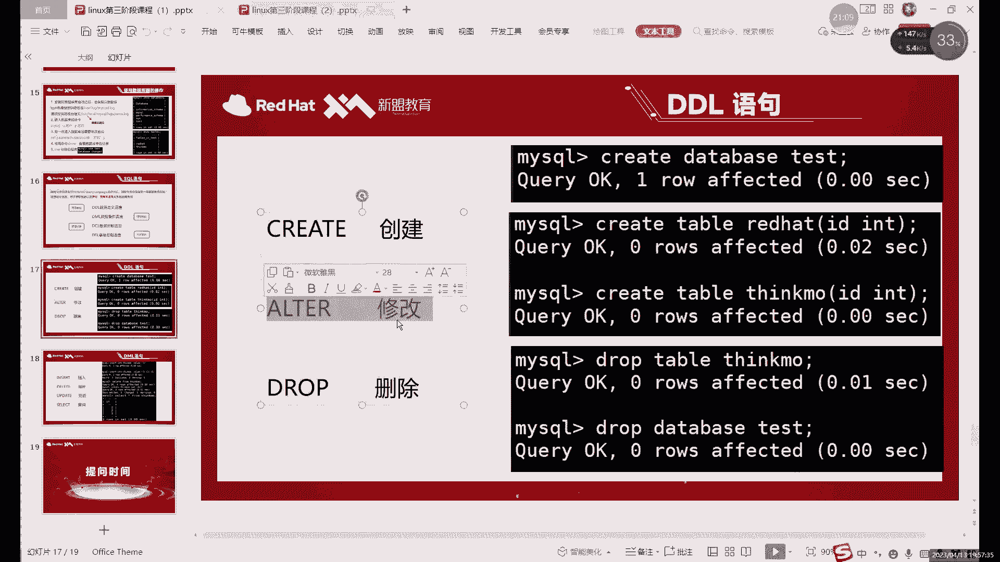

*   **插入完整行数据**：必须提供所有列的值，顺序与表定义一致。
    ```sql
    INSERT INTO new_table VALUES (1, 'information_schema', 'yes');
    ```
*   **插入多行数据**：用逗号分隔多组值。
    ```sql
    INSERT INTO new_table VALUES
    (2, 'mysql', 'yes'),
    (3, 'performance_schema', 'yes');
    ```
*   **插入指定列的数据**：只向部分列插入数据，未指定的列会显示为 `NULL`（空值）。
    ```sql
    INSERT INTO new_table (id, db) VALUES (5, 'testdb');
    ```
    *   注意：字符类型的数据需要加引号，数值类型可以不加。

### 查询数据 (SELECT)

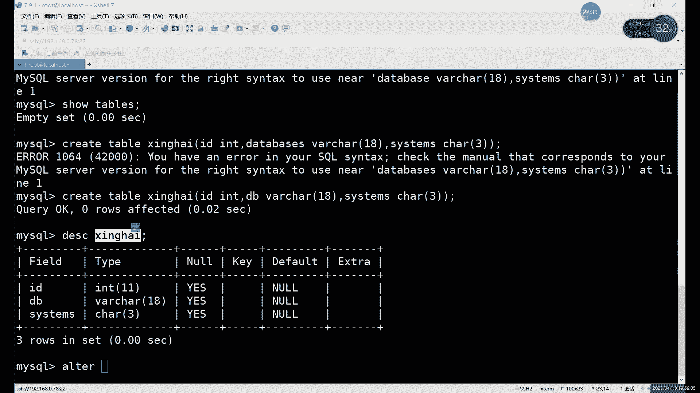

`SELECT` 命令用于从表中查询数据，是SQL中最复杂也最常用的命令。

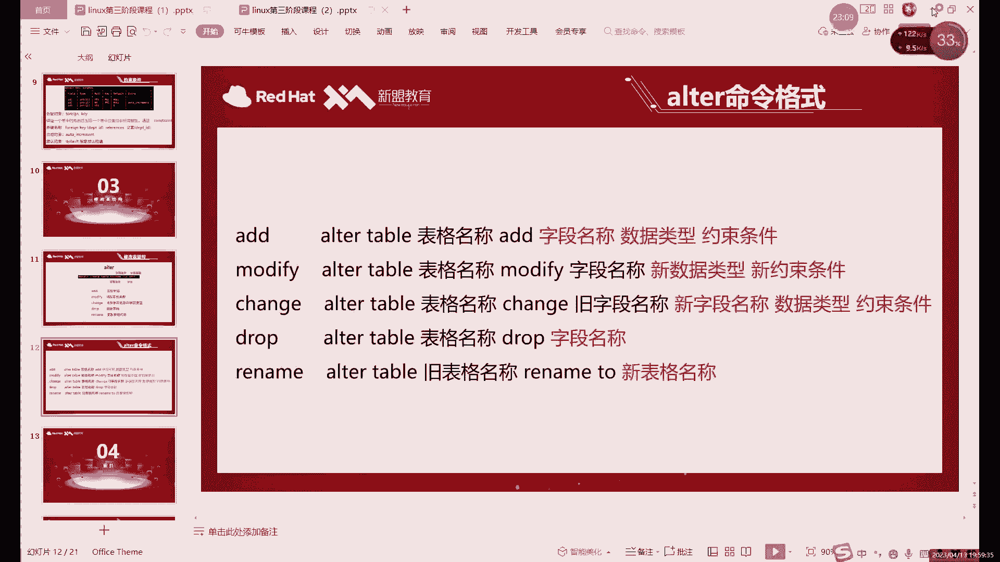

以下是基本的查询语法：

```sql
SELECT * FROM new_table;
```
*   `*` 是通配符，表示选择所有列。

### 更新数据 (UPDATE)

`UPDATE` 命令用于修改表中已有的数据。

以下是更新数据的语法：

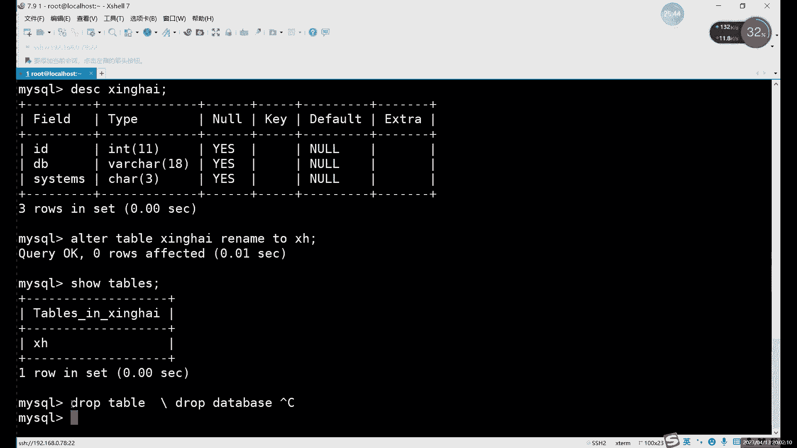

```sql
UPDATE table_name SET column1 = value1, column2 = value2 WHERE condition;
```
*   `WHERE` 子句用于指定要更新哪些行，如果省略则会更新表中所有行。

### 删除数据 (DELETE)

`DELETE` 命令用于删除表中的行。

以下是删除数据的语法：


```sql
DELETE FROM table_name WHERE condition;
```
*   **重要**：`DELETE` 只删除数据行，不删除表本身。删除表需要使用 `DROP TABLE`。
*   同样，`WHERE` 子句指定删除条件，省略则会清空整个表的数据。

---

## 数据类型与约束 🔒

为了确保数据的准确性和一致性，我们需要在创建表时定义数据类型和约束。

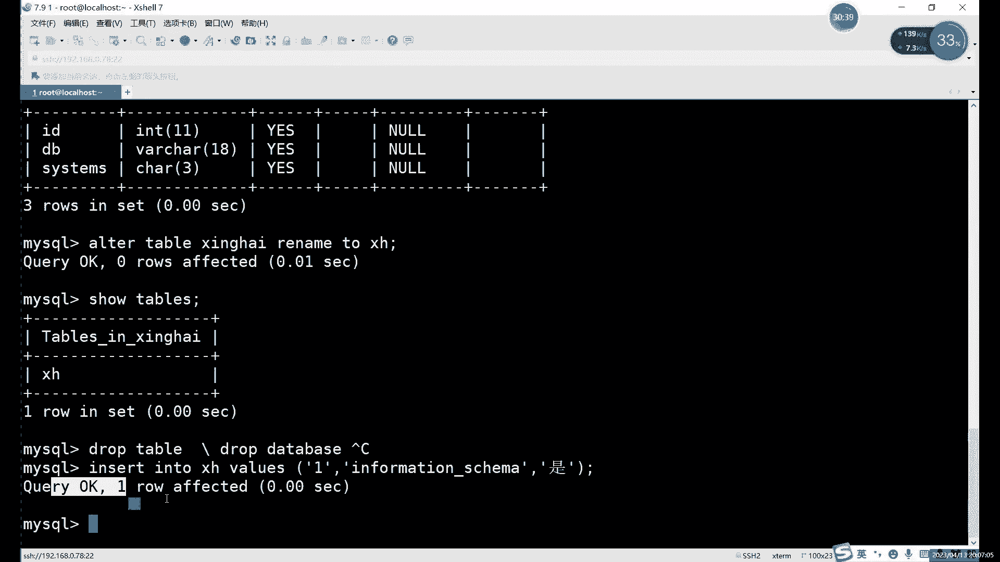

### 常见数据类型

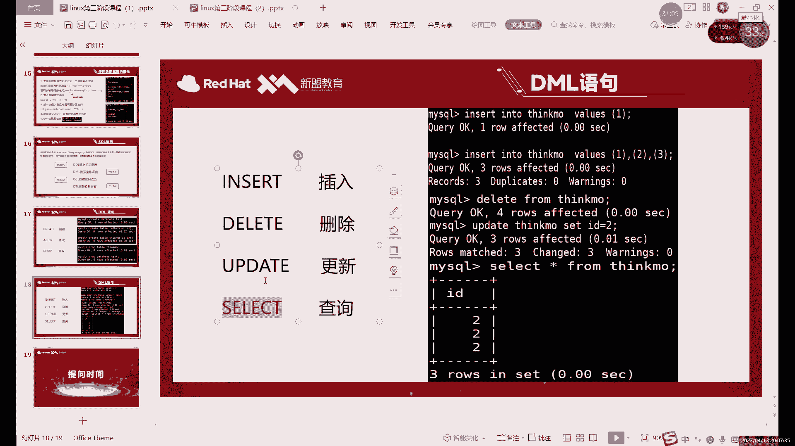

数据类型决定了该列可以存储什么类型的数据。

以下是几种基本的数据类型：

*   **整数类型**：`INT`，存储整数。
*   **字符串类型**：
    *   `CHAR(n)`：固定长度的字符串。
    *   `VARCHAR(n)`：可变长度的字符串，`n` 代表最大字符数。
*   **注意**：字符串类型的长度指的是字符数，不是字节数。一个汉字或一个英文字母都算一个字符。

### 数据约束

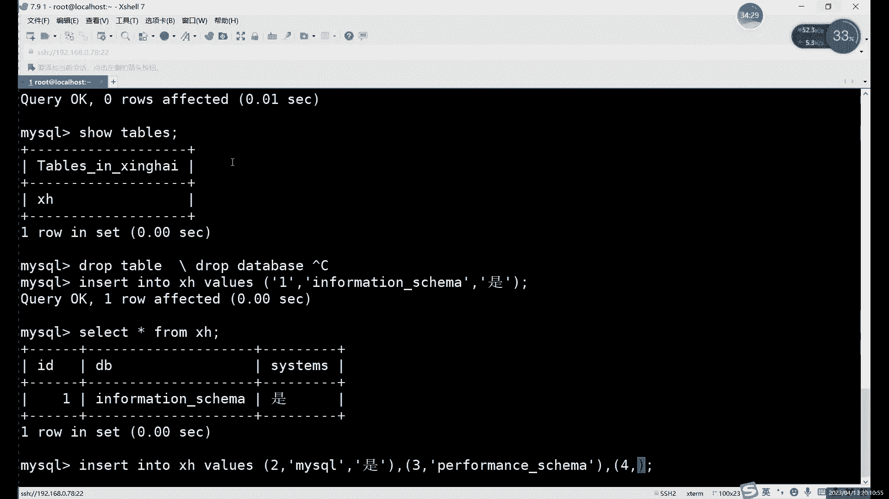

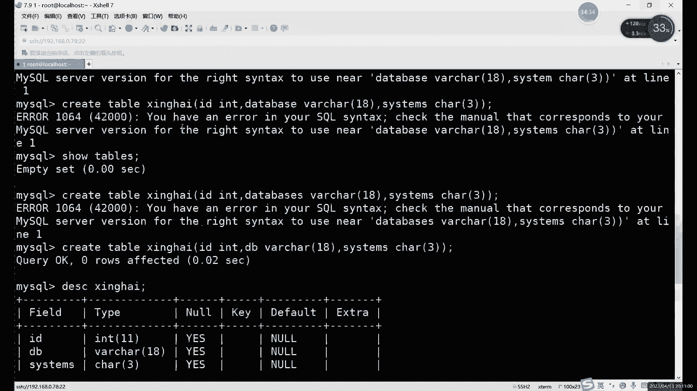

约束是施加在表列上的规则，用于限制允许输入的数据。

以下是几种常见的约束：

*   **主键约束 (PRIMARY KEY)**：唯一标识表中的每一行，不允许重复和NULL值。
    ```sql
    id INT PRIMARY KEY
    ```
*   **非空约束 (NOT NULL)**：确保该列不能存储NULL值。
    ```sql
    name VARCHAR(50) NOT NULL
    ```
*   **唯一约束 (UNIQUE)**：确保该列中的所有值都是不同的。
*   **外键约束 (FOREIGN KEY)**：确保一个表中的数据匹配另一个表中的值，维护表间关系。
*   **默认值约束 (DEFAULT)**：当没有给该列指定值时，自动填充一个默认值。
    ```sql
    status CHAR(1) DEFAULT 'Y'
    ```

`ALTER TABLE` 命令也可以用来在创建表后添加或修改这些约束。

---

## 总结 📖

本节课中我们一起学习了SQL的核心组成部分。

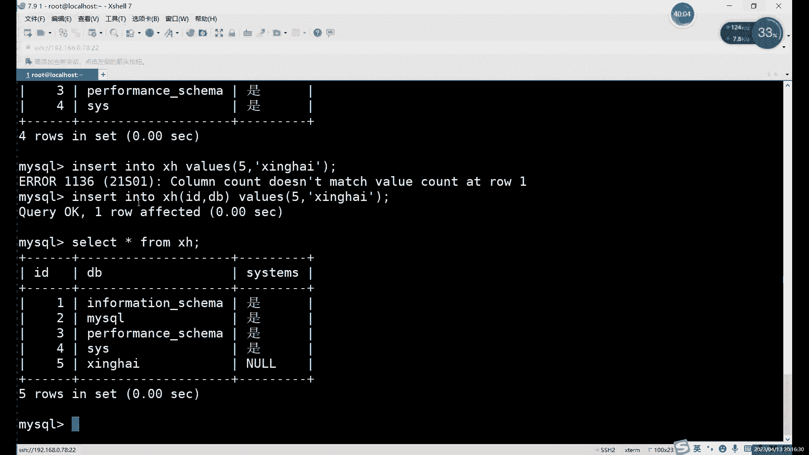

我们首先了解了SQL的四种语句类型：**DDL**（定义结构）、**DML**（操作数据）、**DCL**（控制权限）和**TCL**（控制事务）。接着，我们重点实践了DDL和DML，学会了如何创建、修改数据库和表格，以及如何对数据进行插入、查询、更新和删除操作。最后，我们探讨了数据类型（如`INT`，`VARCHAR`）和约束（如`PRIMARY KEY`，`NOT NULL`）的重要性，它们共同保证了数据库中数据的有效性和完整性。

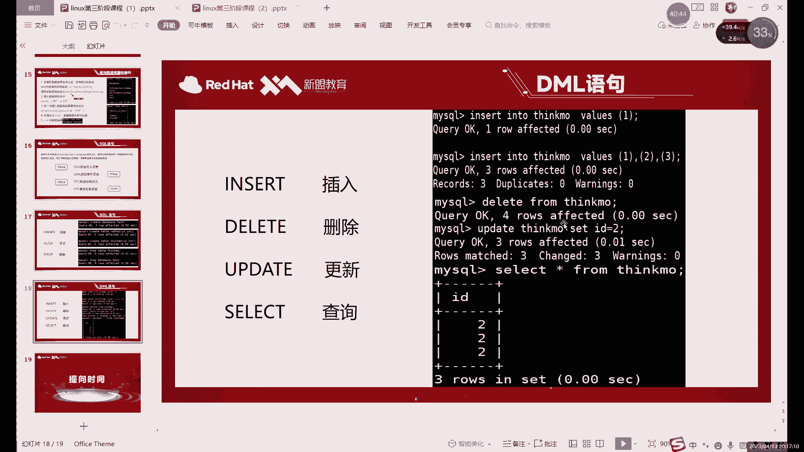

掌握这些基础知识是进行高效数据库管理和运维的关键。