# Linux运维与数据库管理：P66：中级运维-5.SQL语句，数据类型，约束


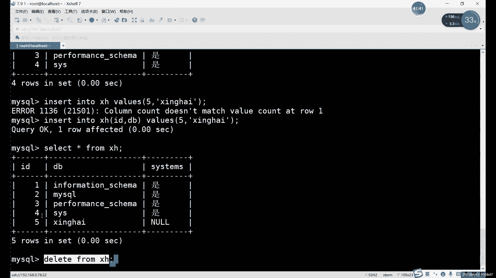


## 概述 📋

在本节课中，我们将深入学习SQL语句的核心组成部分，特别是数据操作语言（DML）中的删除与更新命令，以及数据控制语言（DCL）的权限管理。同时，我们将详细介绍MySQL中的数据类型，包括整数型和小数型，并解释它们的使用场景和限制条件。通过本课的学习，你将能够更精确地操作数据库中的数据，并理解如何控制用户访问权限。

---

## 数据删除：DELETE命令详解 🗑️

上一节我们介绍了数据的插入操作，本节中我们来看看如何删除数据。`DELETE`命令用于从数据库表中移除记录。

`DELETE FROM` 语句可以删除表中的所有数据。例如：
```sql
DELETE FROM table_name;
```
这条命令会清空指定表内的所有行，但表结构本身会保留。由于此操作不可逆，需谨慎使用。

### 删除指定数据

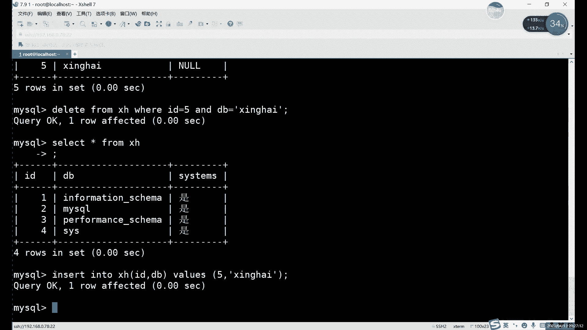

通常情况下，我们不会删除所有数据，而是有选择地删除特定行。这时需要使用 `WHERE` 子句来指定条件。

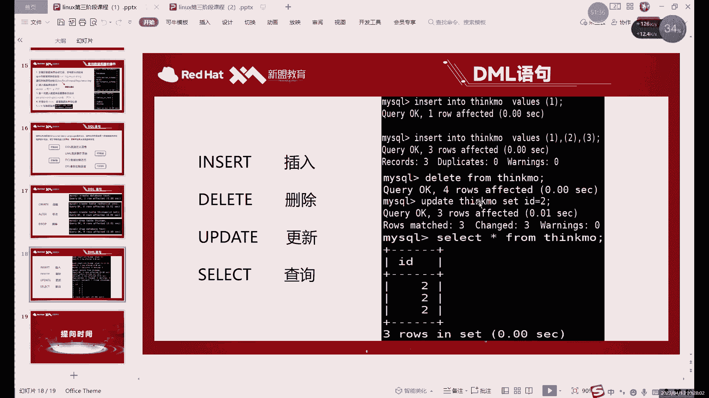

`WHERE` 子句在SQL语句中用于设定条件，它不仅用于 `DELETE`，也用于 `UPDATE`（更新）和 `SELECT`（查询）命令，其核心作用是**限制操作的范围**。

以下是使用 `WHERE` 子句删除指定行的方法：
```sql
DELETE FROM table_name WHERE condition;
```
这里的 `condition` 是一个逻辑表达式，用于筛选出要删除的行。

### 如何精确指定要删除的行


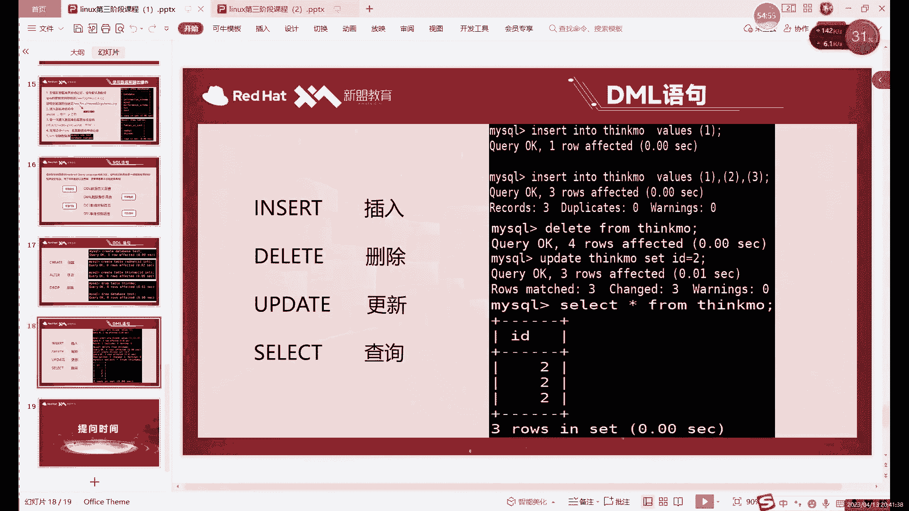

为了精确删除某一行，我们需要找到一个具有**唯一性**的字段（列）作为条件。通常，每个表都会设计一个唯一标识列，例如自增的ID。

假设我们有一个表 `example_table`，其中 `id` 列是唯一的。要删除 `id` 为5的行，命令如下：
```sql
DELETE FROM example_table WHERE id = 5;
```
`DELETE` 命令一次只能删除整行数据，无法只删除行中的某个单元格。

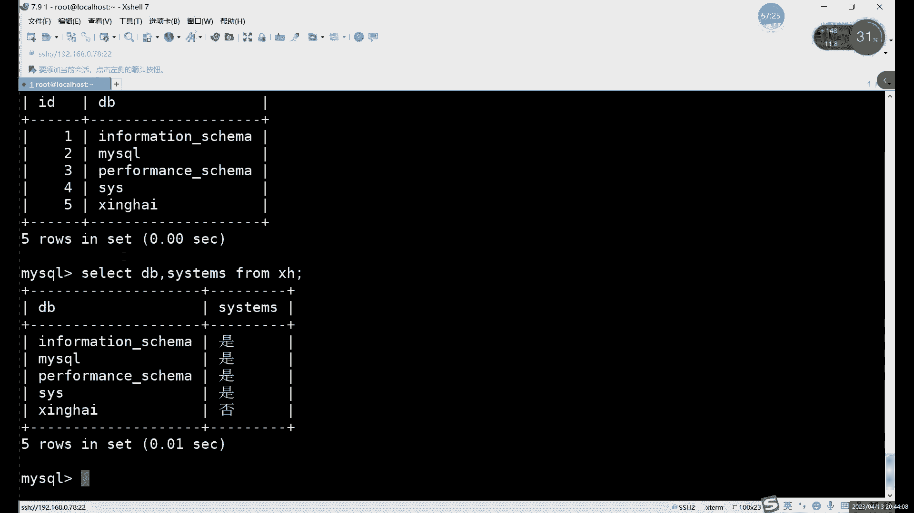

### 处理可能重复的条件

如果用于筛选的条件不是唯一的（例如，有多个行的 `name` 字段都是“张三”），我们可以组合多个条件来精确锁定目标行：
```sql
DELETE FROM example_table WHERE name = ‘张三‘ AND age = 25;
```
通过 `AND` 连接多个条件，可以逐步缩小范围。在设计数据库时，通常会设置一个具有**UNIQUE**约束的列，以确保其值的唯一性，从而方便进行此类精确操作。

常见的唯一性数据包括身份证号、手机号等。如果表中没有天然的唯一列，可以创建一个自增的数字序列（如 `AUTO_INCREMENT` 的主键）来充当唯一标识。


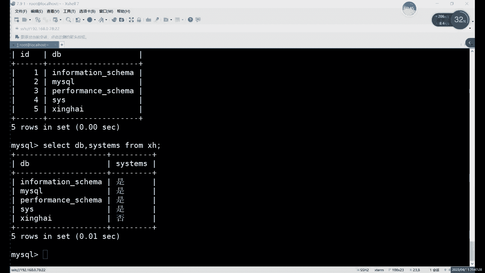

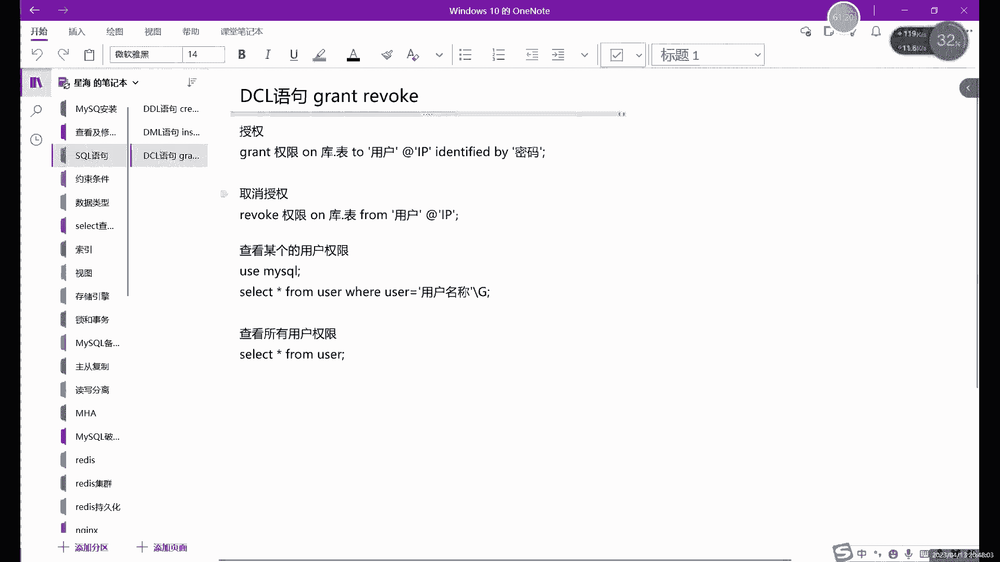

---

## 数据更新：UPDATE命令详解 🔄


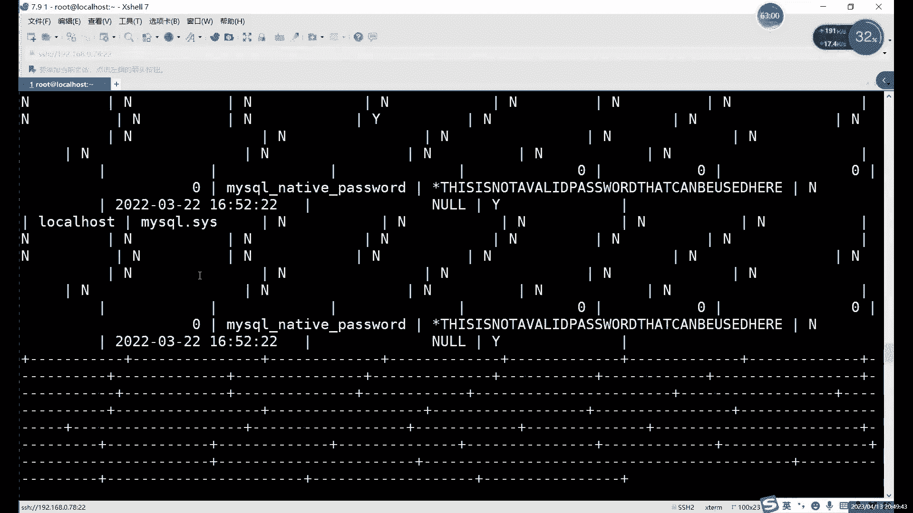

删除数据后，我们来看看如何修改已有的数据。`UPDATE` 命令用于修改表中现有的记录。

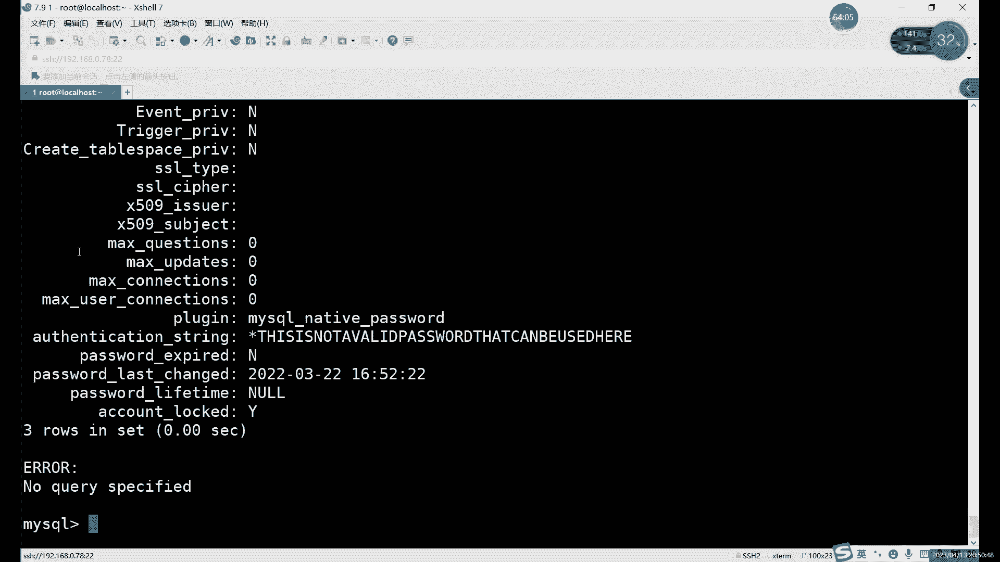


`UPDATE` 命令的基本语法与 `DELETE` 有相似之处，但它使用 `SET` 子句来指定要修改的列和值。
```sql
UPDATE table_name SET column1 = value1 WHERE condition;
```
与 `DELETE` 一样，**`WHERE` 子句在 `UPDATE` 中至关重要**。如果不加 `WHERE` 条件，更新操作将应用于表中的**所有行**，这通常不是我们想要的结果。

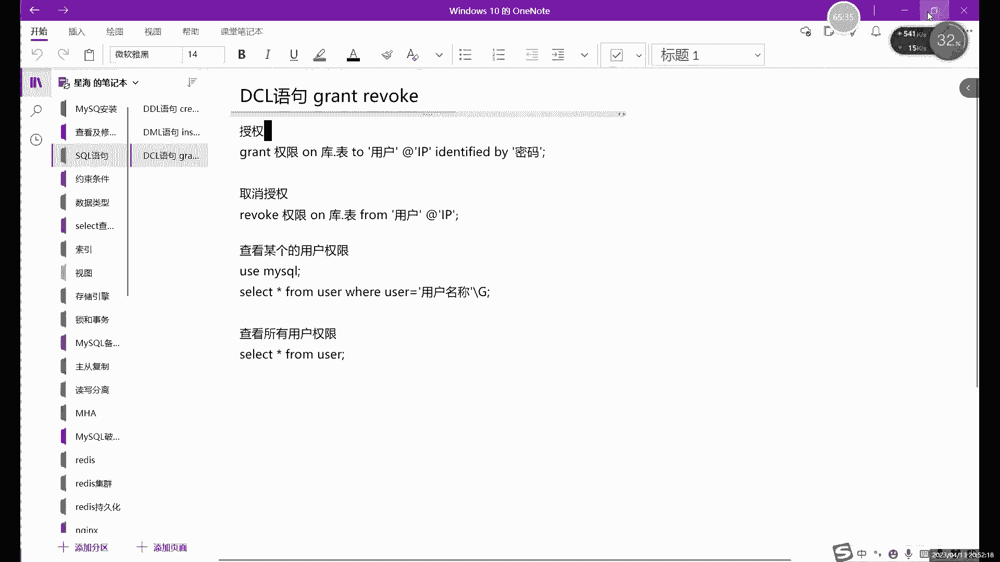

例如，如果我们想将 `id` 为5的记录的 `status` 字段改为 ‘active‘，命令如下：
```sql
UPDATE example_table SET status = ‘active‘ WHERE id = 5;
```
**务必注意**：在执行 `UPDATE` 和 `DELETE` 操作时，养成先写 `WHERE` 条件的好习惯，以避免误操作导致大规模数据丢失或更改。

---

## 数据控制语言：权限管理 🔐

在掌握了数据的增删改之后，我们需要了解如何控制谁可以执行这些操作。这就是数据控制语言（DCL）的范畴，它主要用于管理数据库的访问权限。

DCL的核心命令只有两个：`GRANT`（授权）和 `REVOKE`（撤销权限）。

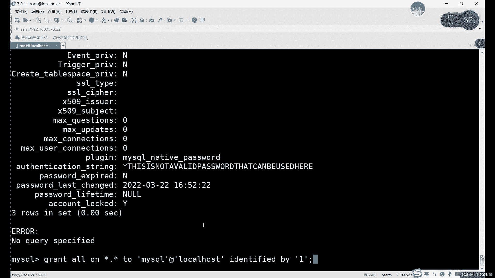

### GRANT 命令：授予权限

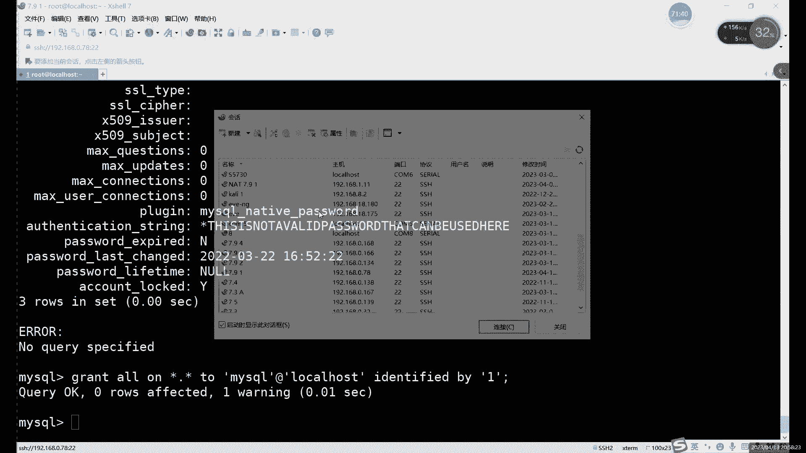


`GRANT` 命令用于给用户授予对特定数据库或表的操作权限。其基本语法结构如下：
```sql
GRANT privileges ON database_name.table_name TO ‘username‘@‘host‘ IDENTIFIED BY ‘password‘;
```
*   **privileges**： 要授予的权限，如 `SELECT`， `INSERT`， `UPDATE`， `ALL PRIVILEGES`（所有权限）等。
*   **database_name.table_name**： 权限作用的对象。使用 `*.*` 表示所有数据库的所有表。
*   **‘username‘@‘host‘**： 用户名和允许其连接的主机。`‘localhost‘` 表示只允许本地连接，`‘%‘` 表示允许任何主机连接。
*   **IDENTIFIED BY ‘password‘**： 为用户设置密码。如果用户不存在，此命令会同时创建该用户。

例如，授予用户 `‘myuser‘` 在本地对所有数据库的所有权限：
```sql
GRANT ALL PRIVILEGES ON *.* TO ‘myuser‘@‘localhost‘ IDENTIFIED BY ‘mypassword‘;
```
执行后，`myuser` 用户将获得几乎与 `root` 同等的操作权限（除了不能给其他用户授权）。

### REVOKE 命令：撤销权限

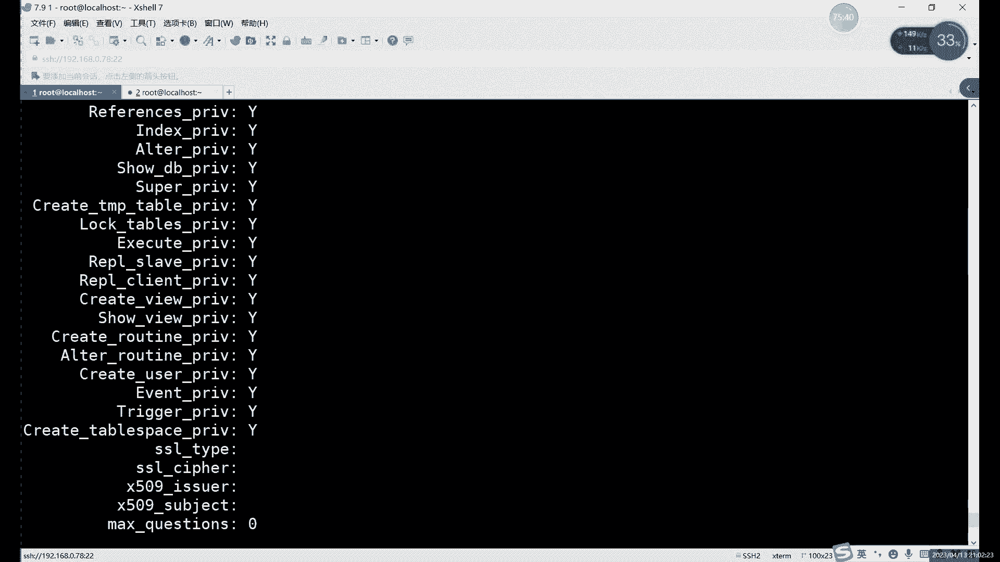


如果我们需要收回已授予的权限，则使用 `REVOKE` 命令。
```sql
REVOKE privileges ON database_name.table_name FROM ‘username‘@‘host‘;
```
其语法与 `GRANT` 类似，但将 `TO` 换成了 `FROM`，并且不需要指定密码。
例如，撤销 `myuser` 用户的所有权限：
```sql
REVOKE ALL PRIVILEGES ON *.* FROM ‘myuser‘@‘localhost‘;
```
执行后，该用户将失去相应的数据库操作能力。权限管理是数据库安全的重要组成部分，它确保了只有授权的用户才能访问和操作特定的数据。


---

## 数据类型：数值型 📊

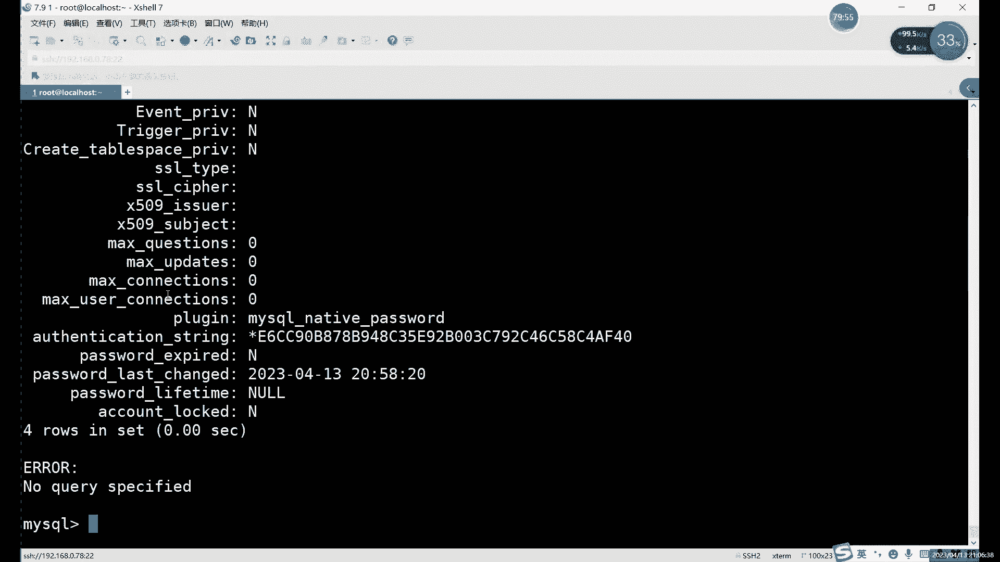

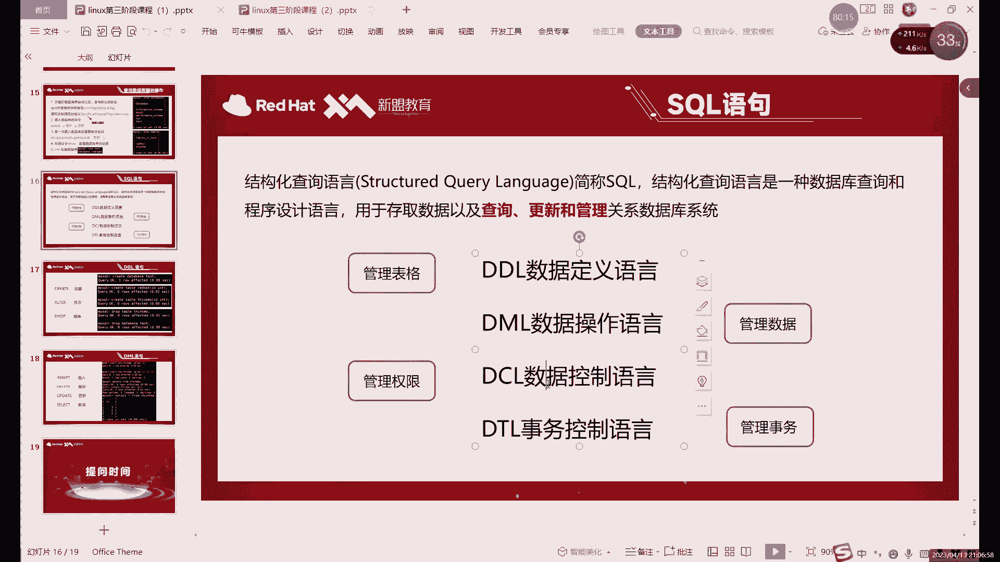

在对数据进行操作和管理权限之后，我们需要更深入地理解数据本身的属性。接下来，我们将探讨MySQL中的数据类型，首先从数值型开始。


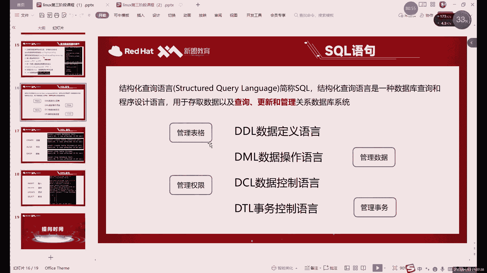

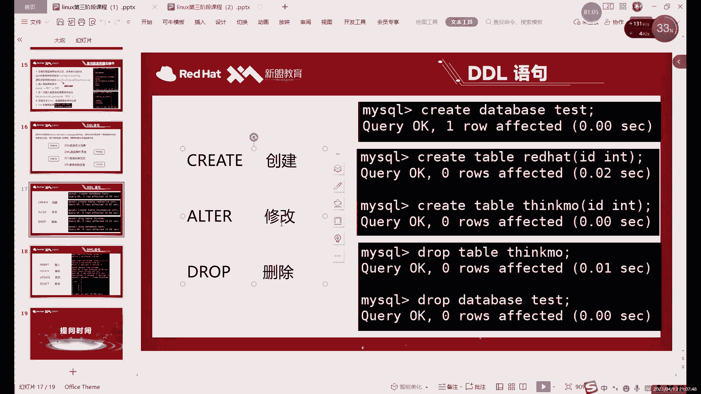

数据类型定义了列中可以存储的数据种类，如数字、文本、日期等。使用 `DESC table_name;` 命令可以查看表的结构和每列的数据类型。

数值型数据主要分为两大类：**整数型**和**小数型（浮点型）**。


### 整数型

整数型用于存储没有小数部分的数字。MySQL提供了多种整数类型，区别主要在于它们的存储范围和占用的空间。


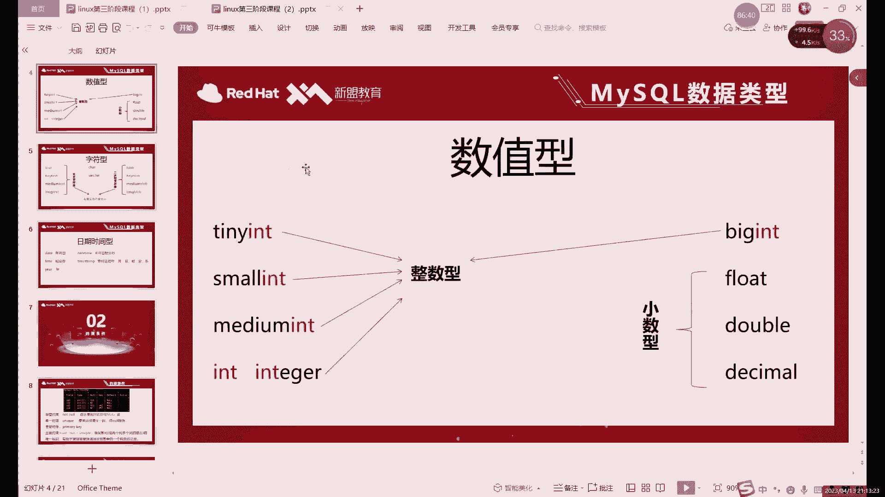

以下是常见的整数类型及其范围（基于2的幂次方）：
*   **TINYINT**： 非常小的整数，范围约 ±2^7（-128 到 127）。
*   **SMALLINT**： 小整数，范围约 ±2^15。
*   **MEDIUMINT**： 中等整数，范围约 ±2^23。
*   **INT**： 标准整数，最常用，范围约 ±2^31（约±21亿）。
*   **BIGINT**： 大整数，范围约 ±2^63。

在定义整数列时，可以指定一个显示宽度，例如 `INT(11)`。**需要注意的是，这个宽度在整数类型中只是一个“提示”或显示建议，并不硬性限制可存储数值的范围**。真正的存储范围由数据类型本身（如 `INT`）决定。例如，一个 `INT(2)` 的列仍然可以存储数字100。

### 小数型（浮点型）

小数型用于存储带有小数点的数字，也称为浮点数。主要类型有 `FLOAT` 和 `DOUBLE`，它们通过 `(M, D)` 格式来定义精度：
*   **M**： 表示总位数（整数部分+小数部分）。
*   **D**： 表示小数部分的位数。

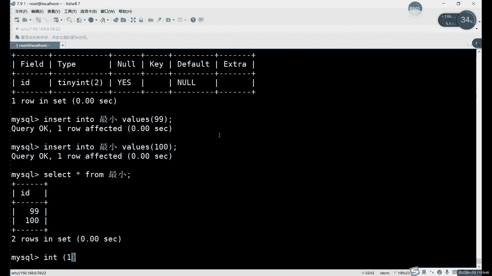

例如，`FLOAT(5,2)` 表示总位数为5，其中小数位占2位。那么它可以存储像 `123.45` 这样的数字，但不能存储 `1234.56`（总位数超了）或 `123.456`（小数位超了）。


与整数型不同，对于 `FLOAT` 和 `DOUBLE`，`(M, D)` 的值是**硬性限制**，插入数据时必须遵守。如果未指定 `(M, D)`，`FLOAT` 默认约有6-7位有效数字。

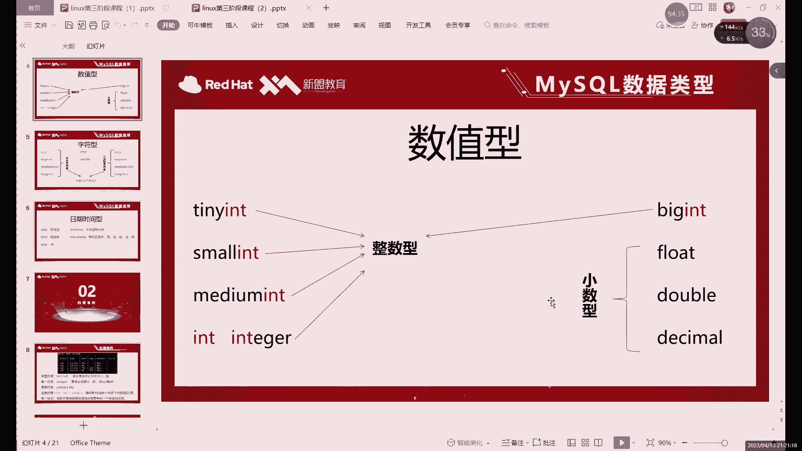

---


## 总结 🎯

本节课中我们一起学习了SQL中几个关键的操作与管理概念：
1.  **数据删除**： 使用 `DELETE FROM ... WHERE ...` 命令删除指定行，强调了 `WHERE` 条件的重要性以避免误删全部数据。
2.  **数据更新**： 使用 `UPDATE ... SET ... WHERE ...` 命令修改现有数据，同样依赖 `WHERE` 子句进行精确更新。
3.  **权限管理**： 通过DCL的 `GRANT` 和 `REVOKE` 命令控制用户对数据库的访问和操作权限，这是数据库安全的基础。
4.  **数值数据类型**： 理解了整数型（`INT`， `BIGINT`等）和小数型（`FLOAT(M,D)`， `DOUBLE`）的区别。整数型的宽度参数多为显示建议，而浮点型的精度参数则是硬性限制。


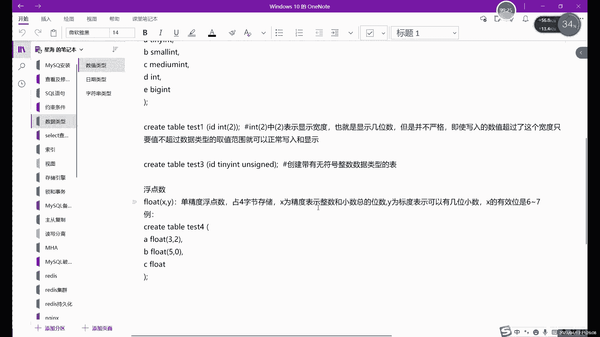


掌握这些知识，将使你能够更安全、更精准地管理和操作数据库中的数据。下一节，我们将深入探讨 `SELECT` 查询语句的丰富用法以及其他数据类型和约束条件。