# Linux运维与数据库管理：P67：SQL数据类型与约束详解

在本节课中，我们将深入学习MySQL数据库中的核心概念：数据类型和约束。理解这些概念是设计高效、可靠数据库表结构的基础。我们将通过简单的示例，逐一解析数值型、字符型、日期时间型数据的特点，并探讨如何运用约束来保证数据的完整性和准确性。

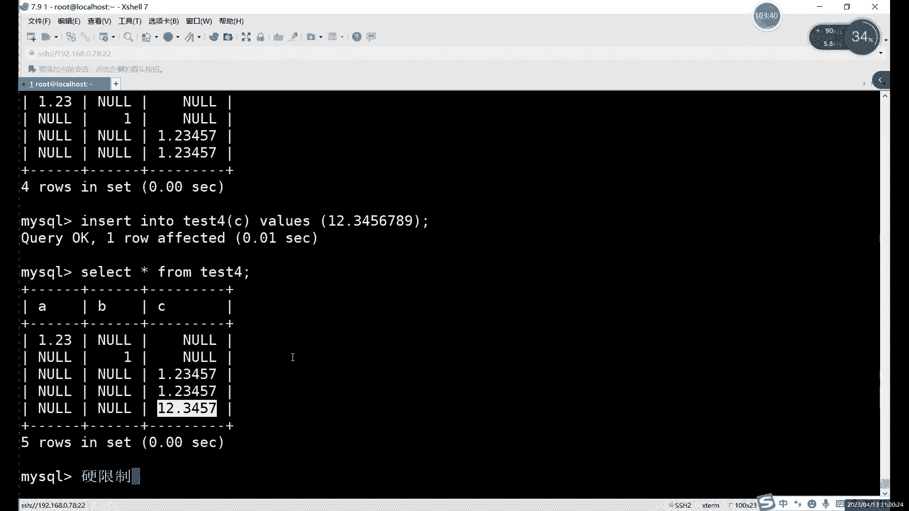

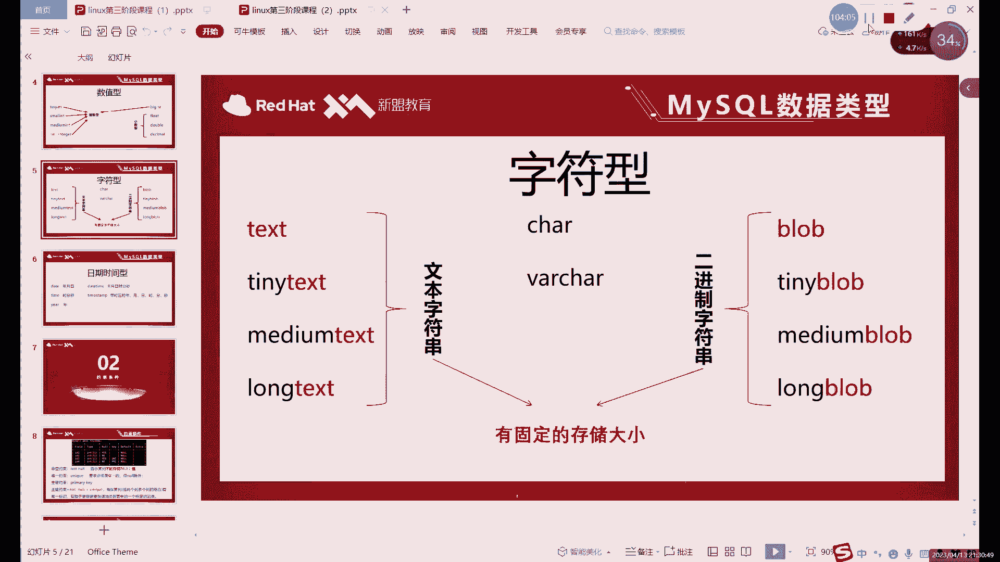

## 数据类型详解

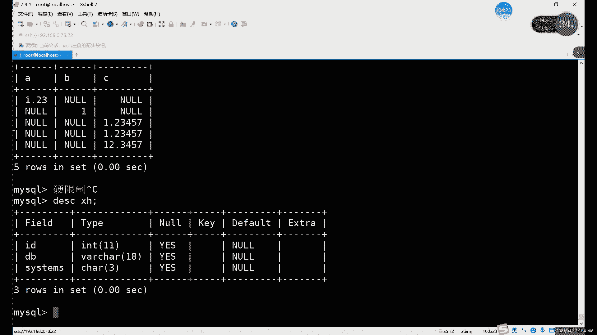

上一节我们介绍了创建表的基本语法，本节中我们来看看如何为表中的列定义具体的数据类型。数据类型决定了该列可以存储何种数据以及如何存储。

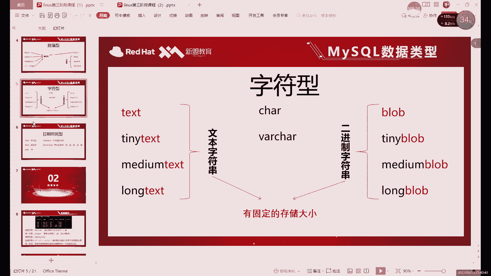

### 数值型数据

数值型数据用于存储数字，主要分为整数和小数两大类。

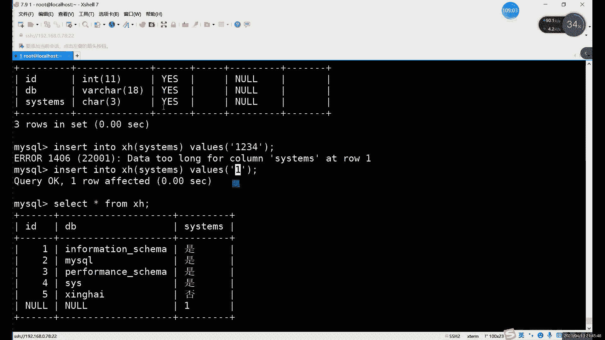

**整数类型**使用 `INT` 关键字定义。其特点是存储整数值，如果插入小数，系统会自动进行四舍五入取整。

**小数类型**使用 `DECIMAL` 或 `FLOAT` 关键字定义。定义时需要指定精度，格式为 `DECIMAL(M, D)`。
*   **M**：表示数字的总位数（整数位+小数位）。
*   **D**：表示小数点后的位数。

例如，`DECIMAL(5,2)` 表示总共5位数字，其中小数占2位，因此能存储的最大值是 `999.99`。

以下是关于小数类型的重要注意事项：
1.  如果插入的数据整数部分超出范围，系统会报错。
2.  如果插入的数据小数部分位数超出 `D`，系统会自动进行四舍五入。
3.  如果未指定 `D`（如 `FLOAT(6)`），则只限制总位数 `M`，对小数位数不做限制，超出部分会四舍五入。

与接下来要讲的字符型不同，数值型数据的限制相对宽松，只要不触及定义的范围底线，通常不会报错。

### 字符型数据

字符型数据用于存储文本信息，其核心特点是**硬性限制**，即插入数据的长度绝对不能超过定义的长度，否则会报错。

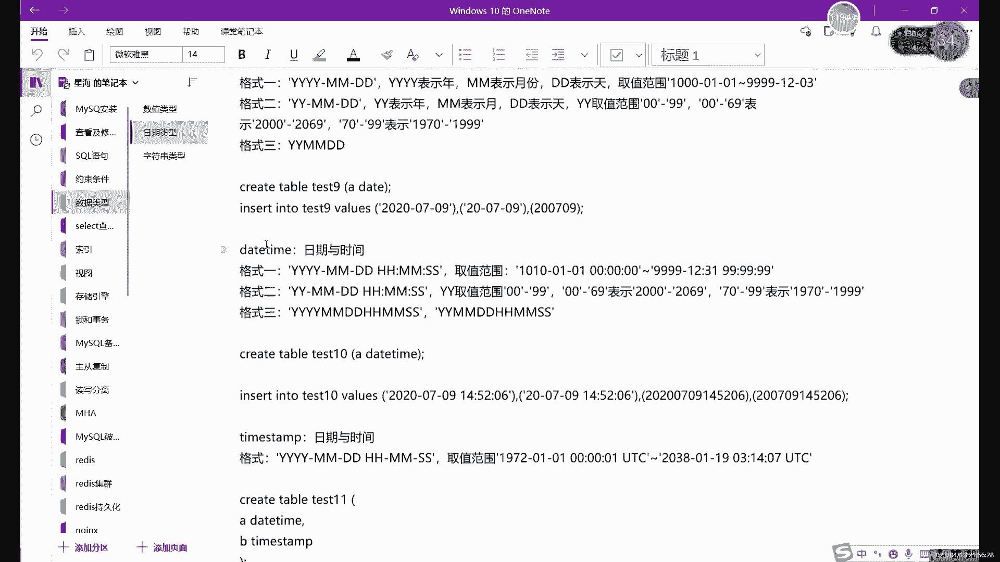

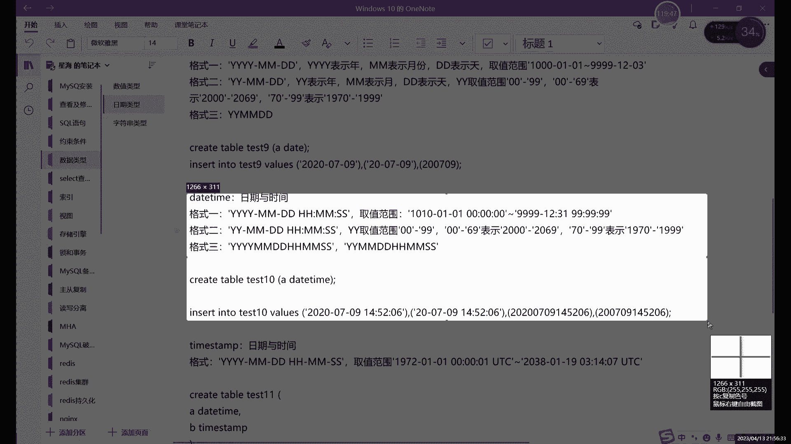

以下是MySQL中常用的两种字符类型：

*   **CHAR**：固定长度字符串。定义为 `CHAR(n)`，`n` 表示字符数（最大255）。即使实际存储的字符不足 `n` 个，系统也会用空格补足到 `n` 位，因此可能浪费存储空间。
*   **VARCHAR**：可变长度字符串。定义为 `VARCHAR(n)`，`n` 表示最大字符数（最大65535）。系统仅存储实际的字符，并额外使用1-2个字节记录数据的实际长度，更为节省空间。

**选择建议**：
*   如果能确定该列所有数据的长度完全一致（如性别、国家代码），使用 `CHAR` 效率更高。
*   如果数据长度可变（如姓名、地址、描述），强烈推荐使用 `VARCHAR` 以节省存储空间。

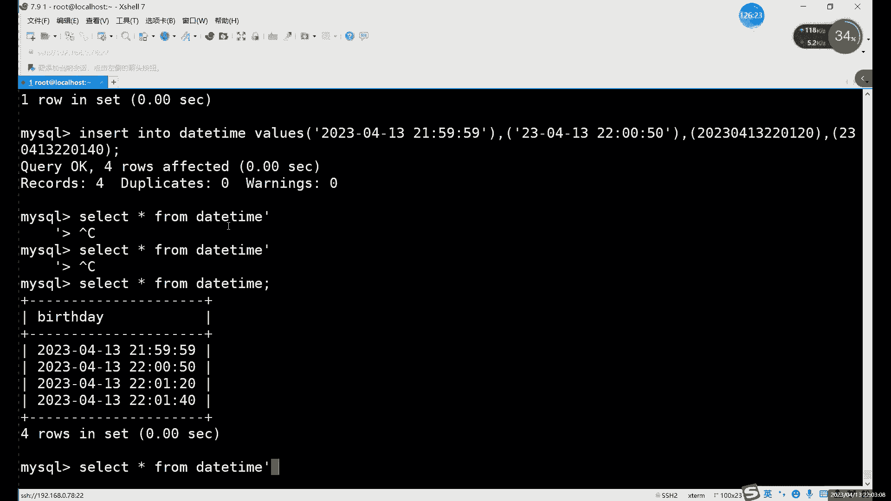

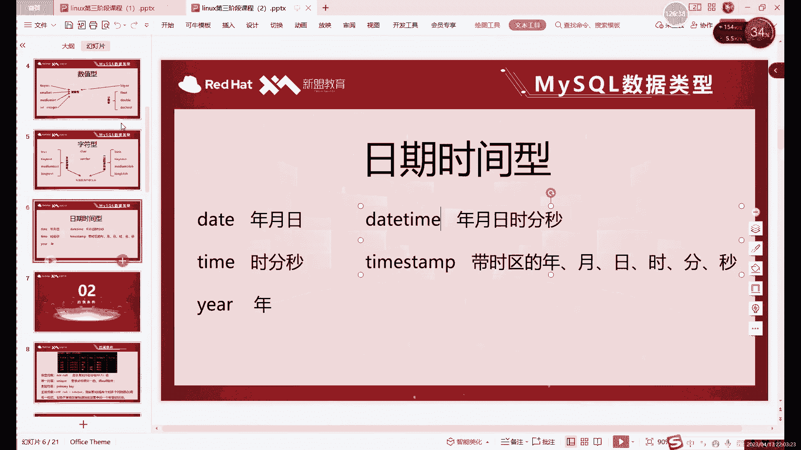

此外，对于大段文本（如文章内容），可以使用 `TEXT` 系列类型（如 `TEXT`, `LONGTEXT`），它们的存储容量远大于 `VARCHAR`。
**重要提示**：插入字符型数据时，**必须使用引号**（单引号或双引号）将值括起来。

### 日期时间型数据

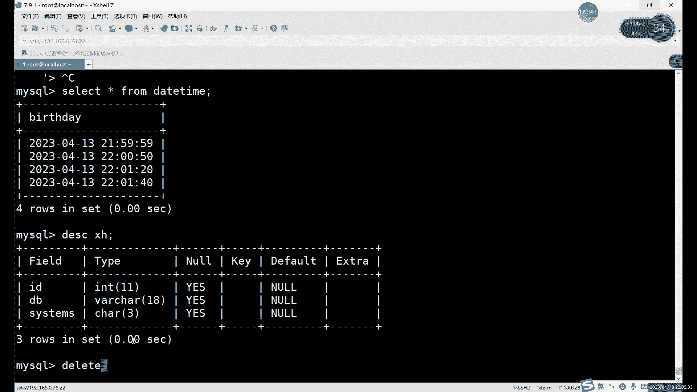

日期时间型数据用于存储日期和时间，它是带有特殊格式的数值。

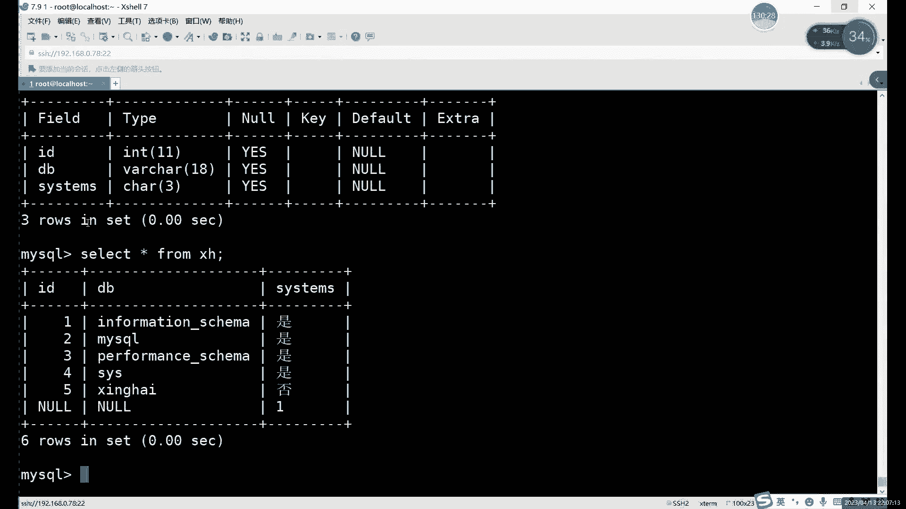

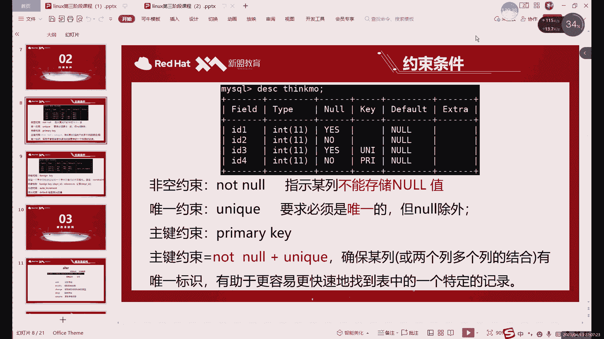

最常用的类型是 `DATETIME`，它包含年月日时分秒，格式为 `‘YYYY-MM-DD HH:MM:SS’`。插入数据时，可以加引号作为字符串插入，也可以不加引号，系统都能识别。MySQL支持多种宽松的格式，例如 `‘20230102153045’` 或 `‘2023@01@02 15-30-45’`，系统会自动将其转换为标准格式显示。

## 数据约束入门

理解了数据类型后，我们来看看如何通过“约束”为数据添加更多的规则和限制，这是确保数据质量的关键。

### 非空约束 (NOT NULL)

非空约束强制要求某列不能存储 `NULL` 值（即空值）。
*   **作用**：避免因遗漏而导致的数据缺失。
*   **用法**：在创建表时，在数据类型后加上 `NOT NULL`。
*   **效果**：如果尝试向该列插入 `NULL` 或不提供值，插入操作会失败并报错。

### 唯一约束 (UNIQUE)

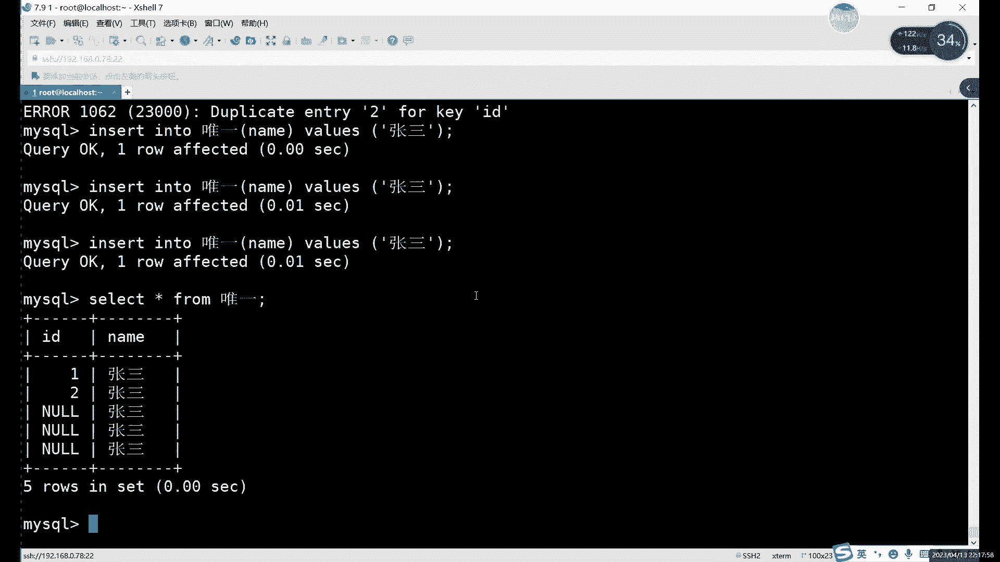

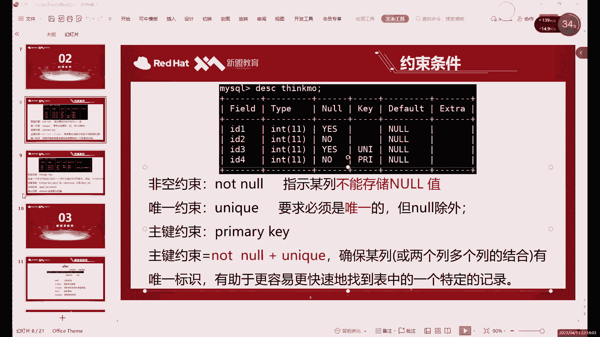

唯一约束要求某列中的每行数据值必须是唯一的，不允许重复。
*   **作用**：防止数据重复。例如，确保邮箱、用户名不重复。
*   **用法**：在数据类型后加上 `UNIQUE`。
*   **注意**：唯一约束允许存在多个 `NULL` 值，因为 `NULL` 被视为未知，不等于任何值（包括另一个 `NULL`）。

### 主键约束 (PRIMARY KEY)

主键约束是 **非空约束** 和 **唯一约束** 的结合。
*   **作用**：唯一标识表中的每一行记录。一张表只能有一个主键。
*   **用法**：在数据类型后加上 `PRIMARY KEY`。
*   **重要性**：主键是表中每行数据的“身份证号”，在查询、更新、删除以及建立表间关系时至关重要。

### 其他约束简介

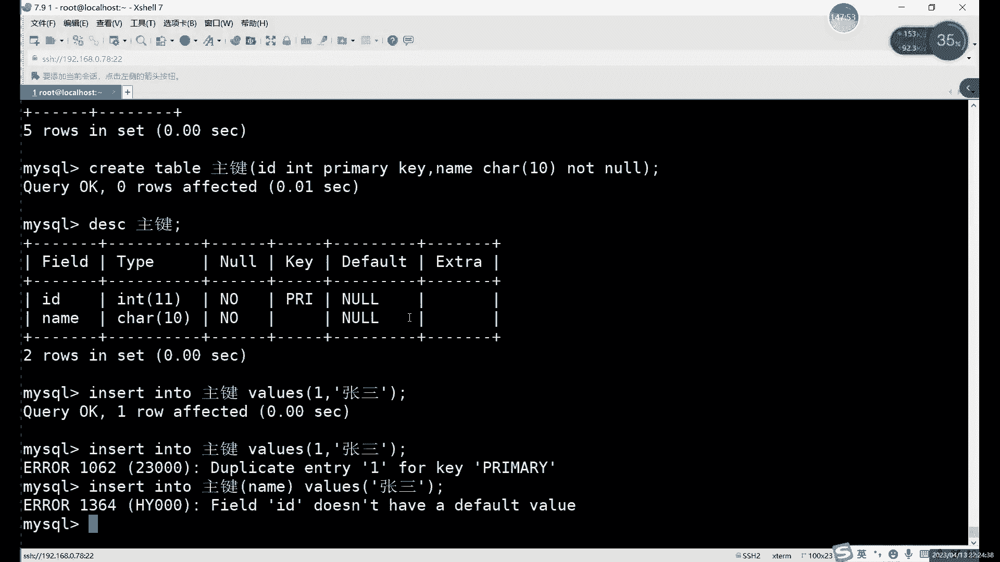

除了上述三个，还有三个重要的约束：
*   **外键约束 (FOREIGN KEY)**：用于建立两个表之间的链接。它要求一个表（子表）中的某列值，必须在另一个表（父表）的主键列中存在。这保证了数据的一致性和参照完整性。
*   **默认约束 (DEFAULT)**：为列指定一个默认值。当插入数据未指定该列值时，将自动填入默认值。
*   **自增约束 (AUTO_INCREMENT)**：通常用于主键。列值会自动递增，无需手动插入。仅适用于整数类型。

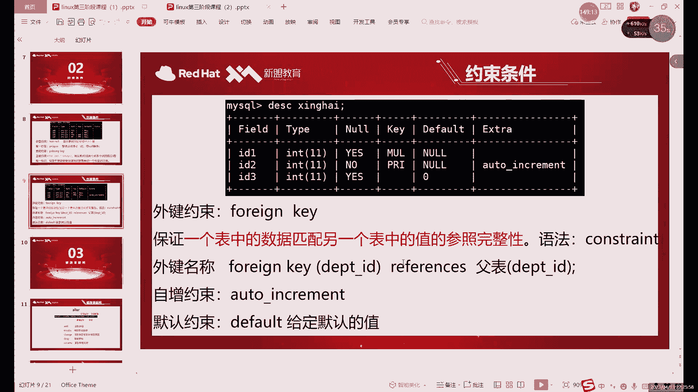

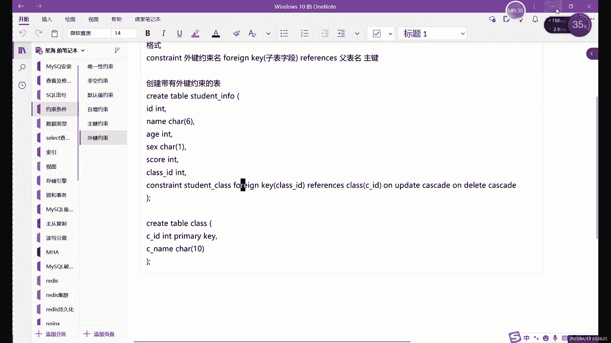

外键、默认值和自增约束的具体应用，我们将在后续课程中详细展开。

## 课程总结

本节课中我们一起学习了MySQL数据库的基石——数据类型与约束。
1.  我们探讨了**数值型**、**字符型**和**日期时间型**数据的特点与定义方式，明白了字符型的硬性限制和数值型的四舍五入行为。
2.  我们深入了解了**数据约束**的作用：`NOT NULL` 防止数据为空，`UNIQUE` 确保数据唯一，`PRIMARY KEY` 则是唯一且非空的特殊约束，作为记录的唯一标识。
3.  我们还简要认识了**外键**、**默认值**和**自增**约束的概念，为后续学习表关系和数据自动管理打下了基础。

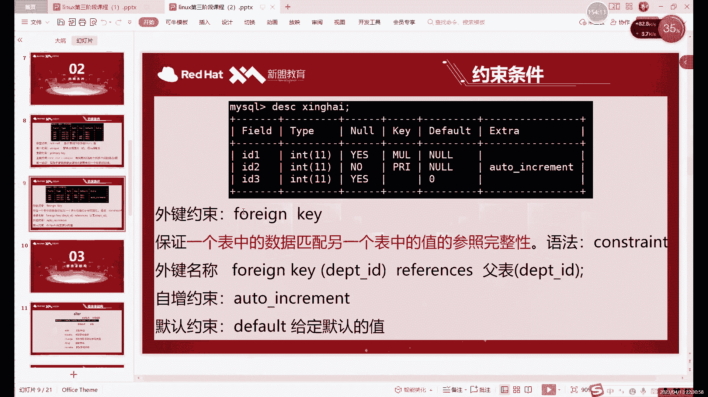

熟练掌握这些知识，你将能够设计出结构严谨、高效且易于维护的数据库表。