# MySQL数据库管理：P68：约束、ALTER命令、索引与SELECT查询


在本节课中，我们将深入学习MySQL中的约束条件，包括外键、自增和默认约束，并掌握如何使用ALTER命令修改表结构。最后，我们会初步了解索引和SELECT查询的基本概念。


## 外键约束 🔗

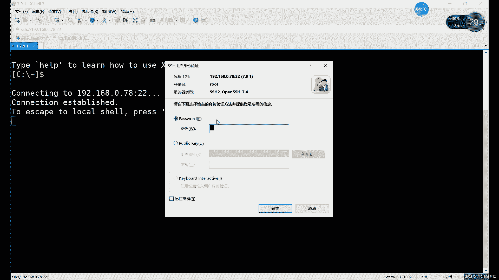

上一节我们介绍了非空、唯一性和主键约束，本节中我们来看看外键约束。外键的主要作用是在两个不同的表格之间实现数据同步。

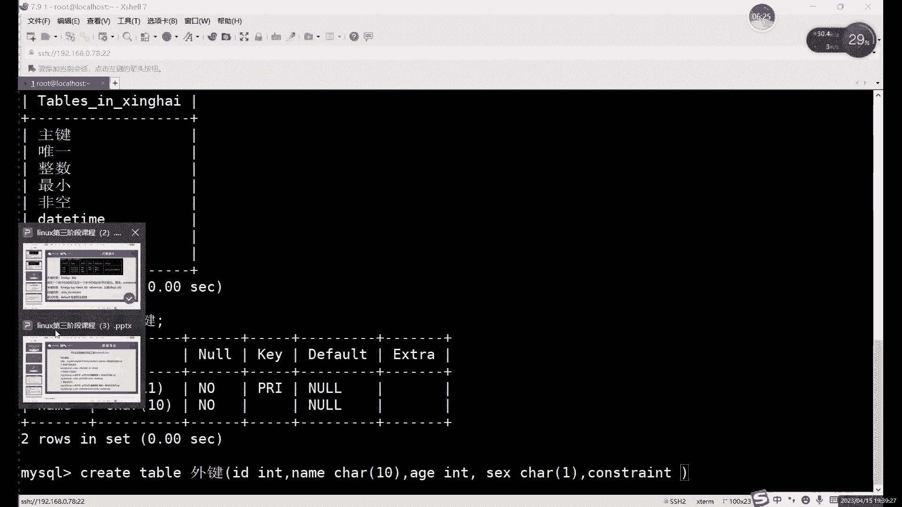

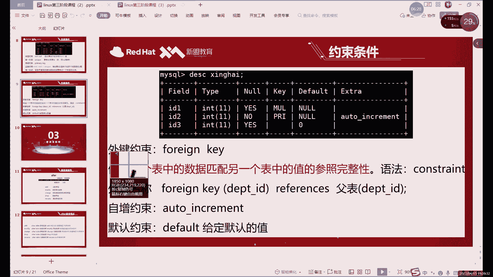

外键约束基于两个表格中的某一列建立联系，通常这两列数据具有相同的含义，例如都是ID号或姓名。设置外键后，主表（主键所在表）的数据更新或删除时，从表（外键所在表）的对应数据会同步变化，类似于一种数据联动机制。但需要注意的是，外键列本身不能主动修改或删除数据，只能添加新数据，并且必须与主键保持同步。

外键的创建格式与其他约束不同，它通常在所有字段定义完成后单独声明。

以下是创建外键的基本语法结构：
```sql
CONSTRAINT 外键名称 FOREIGN KEY (外键字段名) REFERENCES 主表名 (主键字段名) ON UPDATE CASCADE ON DELETE CASCADE
```

**关键点解析：**
1.  **外键名称**：可自定义，用于标识此外键关系。
2.  **外键字段**：当前表中需要设置为外键的列名。
3.  **主表名**：被引用的、包含主键的表名。
4.  **主键字段名**：主表中被引用的主键列名。
5.  **ON UPDATE CASCADE**：当主键更新时，外键同步更新。
6.  **ON DELETE CASCADE**：当主键删除时，外键同步删除。

**重要注意事项：**
*   外键字段与主键字段的**数据类型必须完全一致**。
*   外键关系建立后，**外键表的数据变更受主键表约束**，外键表不能单独更新或删除已关联的数据。
*   主键表是一个独立实体，其变更会影响外键表，但**外键表的变更不会影响主键表**。

## 自增约束 🔢

接下来我们学习自增约束。自增约束的作用是让某一列的数字值自动按顺序增长，无需手动插入，常用于ID、学号、工号等需要按顺序排列的列。

自增约束只能应用于数值类型的列。一旦设置，在插入新数据时，数据库会自动为该列生成一个递增值（默认从1开始，每次增加1）。

创建自增约束时，该列通常需要配合主键或唯一约束，以确保其值的唯一性。

以下是创建带自增主键的表示例：
```sql
CREATE TABLE 自增表名 (
    id INT PRIMARY KEY AUTO_INCREMENT,
    name VARCHAR(50)
);
```
插入数据时，可以忽略自增列：
```sql
INSERT INTO 自增表名 (name) VALUES ('张三');
```
执行后，`id` 列会自动填充为1，下次插入会自动变为2，以此类推。

自增的初始值和增量可以修改，但实践中较少使用。

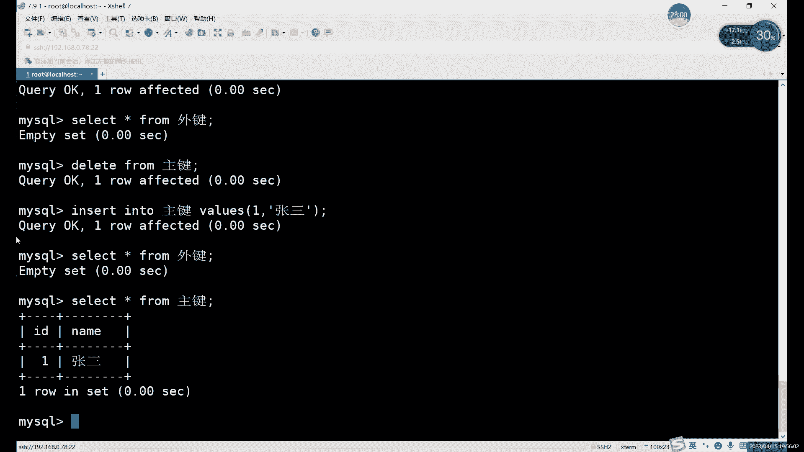

## 默认约束 ⚙️

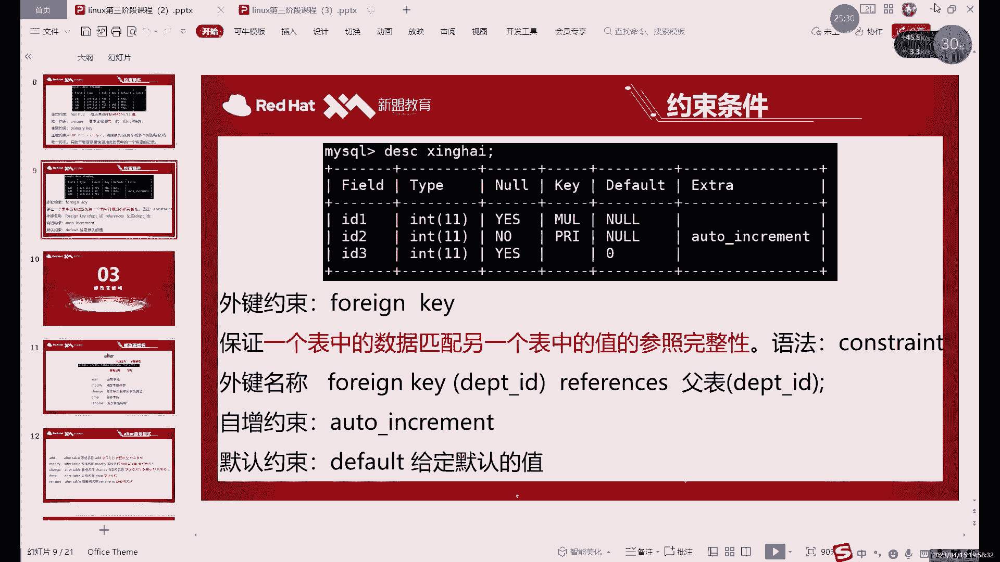

最后，我们探讨默认约束。默认约束的作用是为某一列指定一个预设值。当插入新数据行且未给该列提供值时，数据库会自动填入这个默认值。

默认约束适用于该列存在一个高频出现值的场景，例如将“性别”列的默认值设为“男”。

定义表示例：
```sql
CREATE TABLE 默认表名 (
    id INT,
    name VARCHAR(50),
    gender VARCHAR(10) DEFAULT '男'
);
```
插入数据时，如果不指定`gender`列的值，它将自动填充为“男”：
```sql
INSERT INTO 默认表名 (id, name) VALUES (1, '李四');
```
如果显式提供了该列的值，则会使用提供的值，覆盖默认值。

**默认约束与自增约束的异同：**
*   **相同点**：两者都提供自动填充数据的功能。
*   **不同点**：自增填充的是按序增长的数字；默认约束填充的是一个固定的、预先定义的值（可以是数字、字符等）。

## 约束条件总结 📋

我们已经学习了MySQL中六种主要的约束条件，它们各自有不同的用途和适用场景：

1.  **非空约束 (NOT NULL)**：确保列不能存储NULL值。几乎所有列都可以设置。
2.  **唯一约束 (UNIQUE)**：确保列中的所有值都是不同的。适用于确保数据唯一性但非主键的列，如邮箱、身份证号（需确保绝对不重复）。
3.  **主键约束 (PRIMARY KEY)**：结合了非空和唯一约束，唯一标识表中的每一行。一张表只能有一个主键。
4.  **外键约束 (FOREIGN KEY)**：建立两个表之间的链接，确保引用完整性，实现数据同步。
5.  **自增约束 (AUTO_INCREMENT)**：使数值列自动递增，常用于主键。通常与主键约束一起使用。
6.  **默认约束 (DEFAULT)**：为列指定一个默认值。

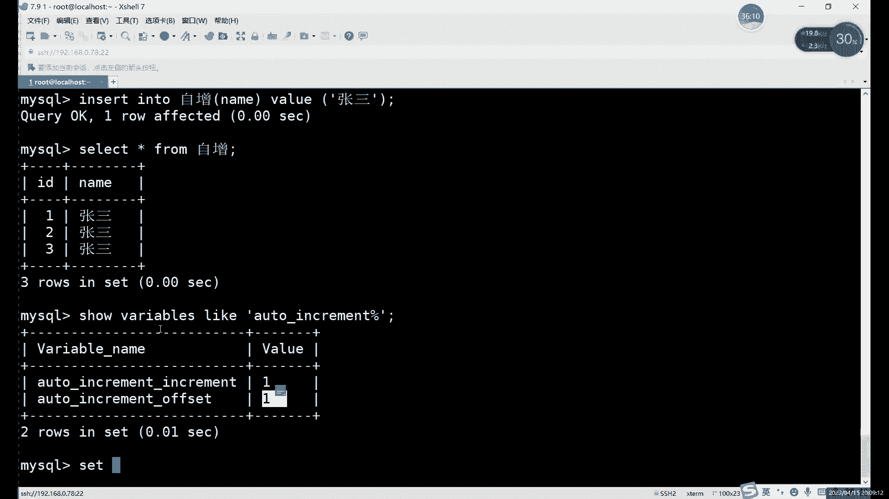

**使用约束时的注意事项：**
*   选择约束类型需根据字段的实际业务需求决定。
*   违反约束的数据操作（如插入重复的唯一值）会导致执行失败。
*   唯一约束和主键约束不能随意设置，必须确保该列在逻辑上确实不会出现重复值。
*   自增约束的适用对象最为严格，通常仅用于序号ID类字段。


## ALTER 命令 ✏️

在掌握了所有约束类型后，我们现在可以学习如何使用ALTER命令来修改已有的表结构，而无需删除重建。ALTER命令是数据定义语言(DDL)的重要组成部分。

ALTER命令功能强大，可以用于：
*   添加、删除或修改表的列。
*   添加或删除各种约束。
*   修改列的数据类型。
*   重命名表或列。

以下是ALTER命令的一些常见用法示例：

**1. 添加新列：**
```sql
ALTER TABLE 表名 ADD 列名 数据类型 [约束];
```
**2. 删除列：**
```sql
ALTER TABLE 表名 DROP COLUMN 列名;
```
**3. 修改列数据类型：**
```sql
ALTER TABLE 表名 MODIFY COLUMN 列名 新数据类型;
```
**4. 添加主键约束：**
```sql
ALTER TABLE 表名 ADD PRIMARY KEY (列名);
```
**5. 添加外键约束：**
```sql
ALTER TABLE 表名 ADD CONSTRAINT 外键名 FOREIGN KEY (外键列) REFERENCES 主表名(主键列);
```
**6. 修改表名：**
```sql
ALTER TABLE 旧表名 RENAME TO 新表名;
```
**注意**：虽然也可以修改数据库名，但操作复杂且可能引发问题，通常不建议直接修改。

## 索引与SELECT查询简介 🔍

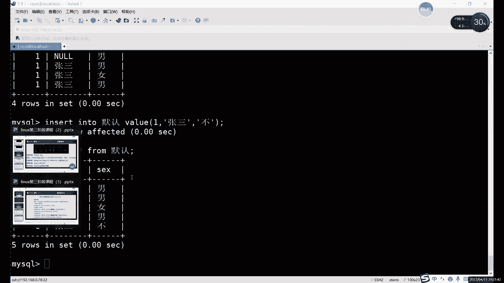

作为向下一阶段学习的过渡，我们简要介绍索引和SELECT查询。

**索引**是一种特殊的数据库结构，类似于书籍的目录，它可以加快对表中数据的查询速度。我们之前看到的`KEY`字段（如PRI, UNI, MUL）就与索引类型有关。合理创建索引是优化数据库性能的关键手段。

**SELECT查询**是用于从数据库中检索数据的最核心命令。它是数据操作语言(DML)的基础。其基本语法如下：
```sql
SELECT 列名1, 列名2 FROM 表名 [WHERE 条件];
```
例如，查看“主键”表中的所有数据：
```sql
SELECT * FROM 主键;
```

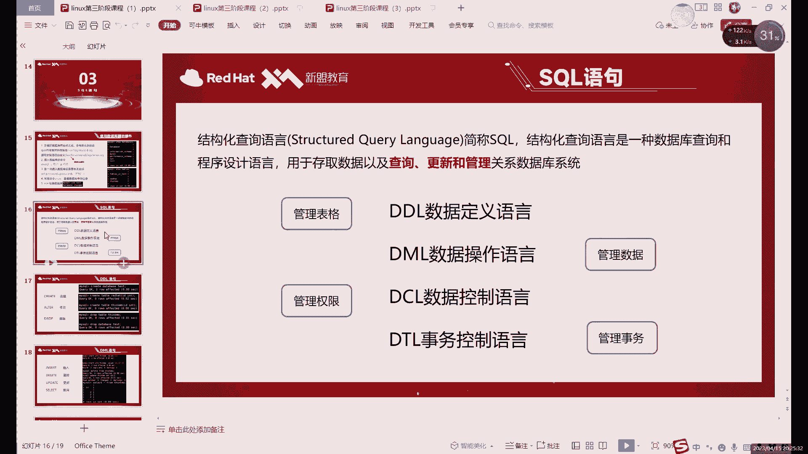

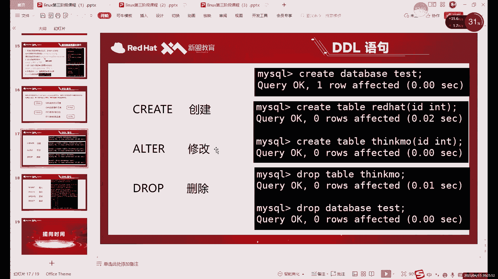

---

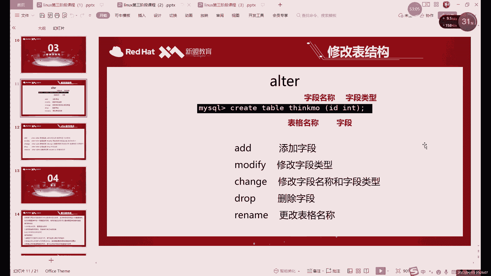

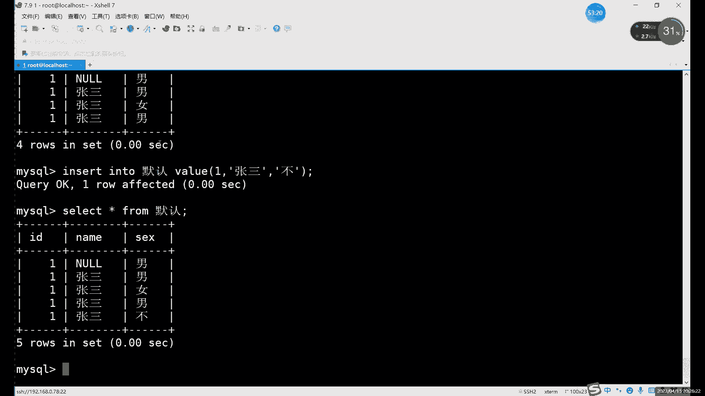

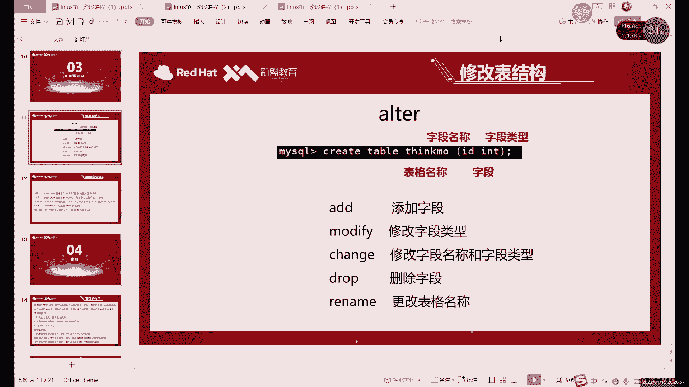

本节课中我们一起学习了外键、自增和默认约束的详细用法，掌握了使用ALTER命令灵活修改表结构的技巧，并对索引和SELECT查询有了初步认识。理解并正确应用这些约束和命令，是设计和管理高效、可靠数据库表的基础。下一节课，我们将深入探讨SELECT查询的更多强大功能。