# MySQL数据库管理：P69：ALTER命令与索引详解

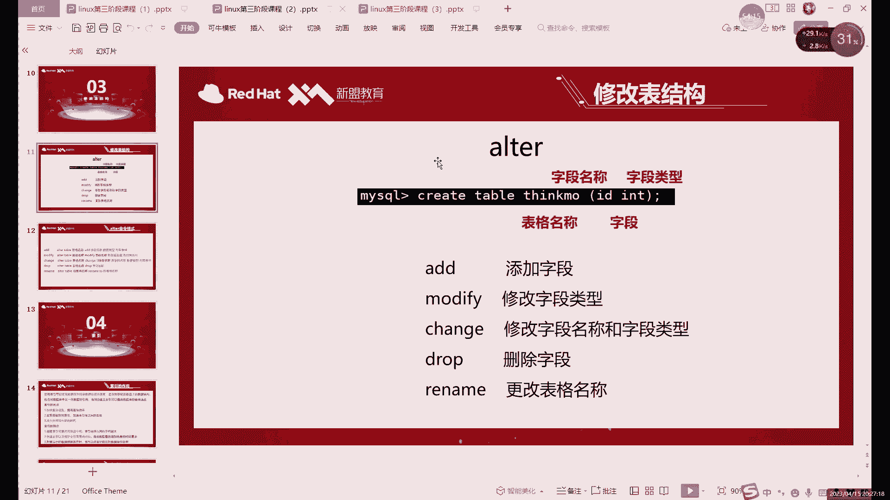

在本节课中，我们将深入学习MySQL中用于修改表结构的`ALTER`命令，并探讨索引的概念、作用及其与约束的关系。通过本课，你将掌握如何灵活调整表结构以及如何利用索引优化查询性能。

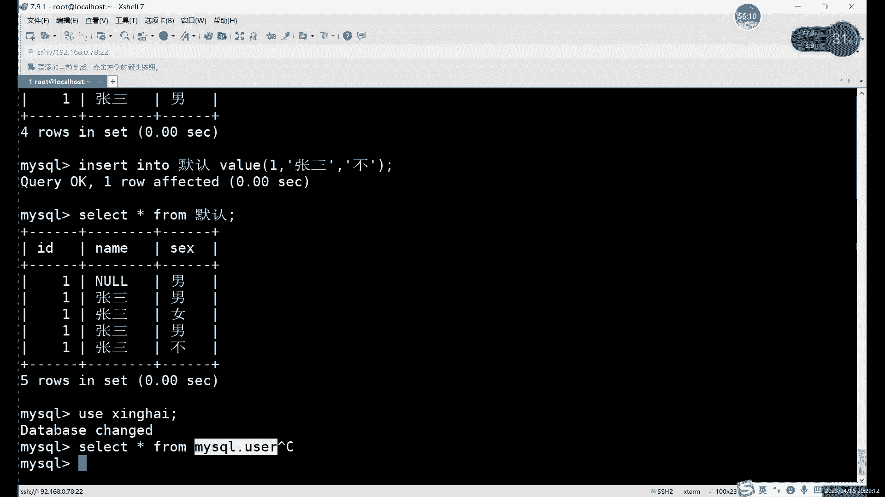

## 概述：表结构与查询优化

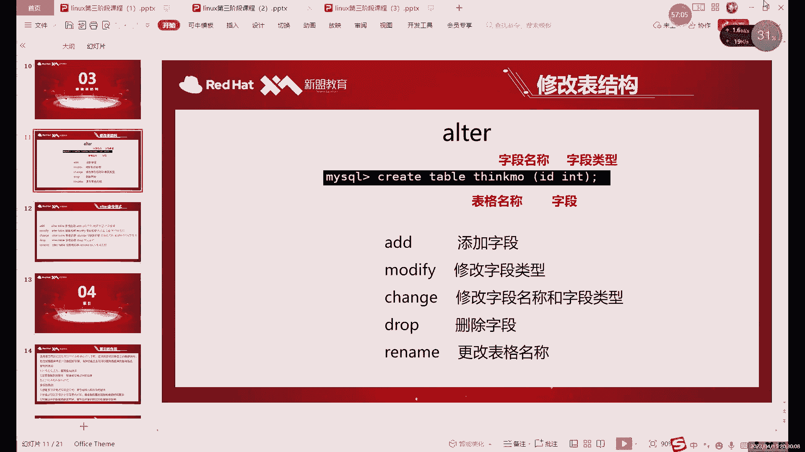

上一节我们介绍了约束，它用于限制表格中数据的有效性。本节中，我们来看看如何修改已创建的表结构，并引入“索引”这一核心概念来提升数据查询的效率。

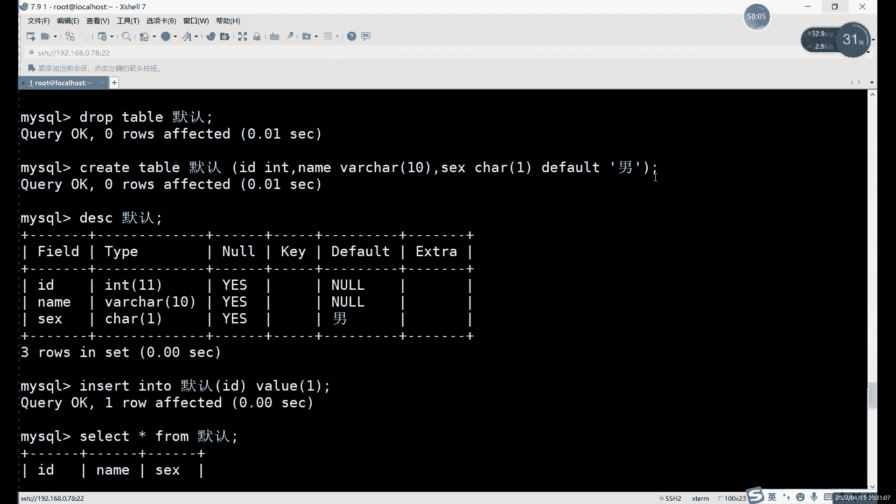

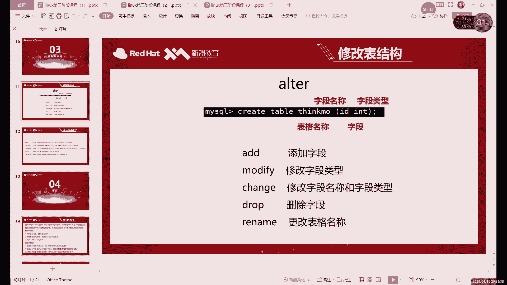

## 修改表结构：ALTER命令详解

`ALTER`命令是修改现有数据库表结构的主要工具。它可以修改表的名称、字段（列）的名称、数据类型以及约束条件。

### 修改表名与注意事项

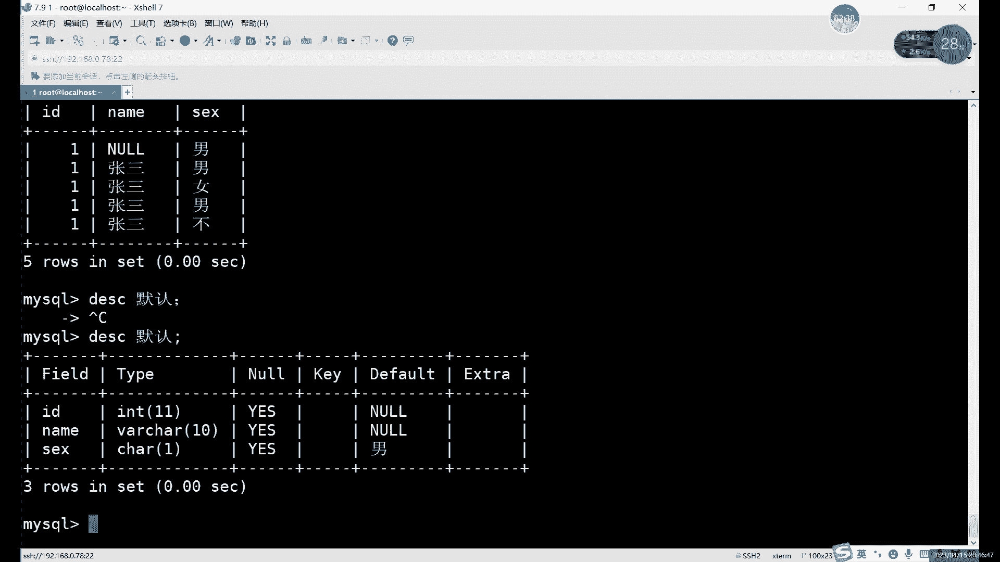

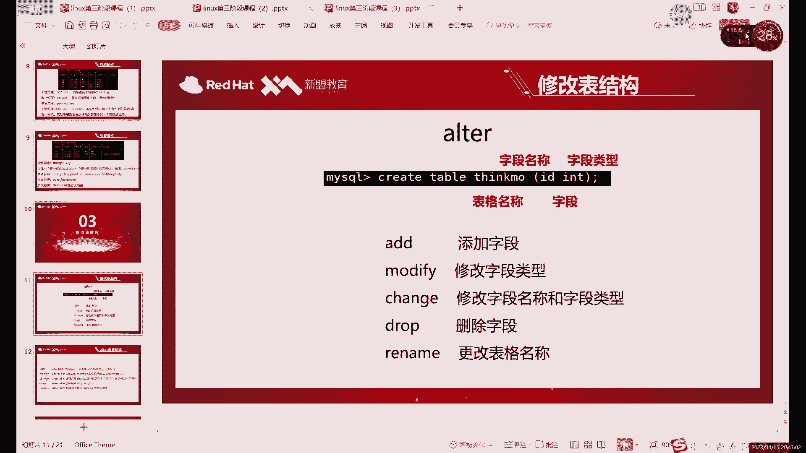

修改表名相对简单，使用`ALTER TABLE 旧表名 RENAME TO 新表名`即可。

然而，**强烈不建议修改数据库名**。因为每个表的完整名称实际上是`数据库名.表名`。修改数据库名意味着所有表都需要更新其完整名称，这个过程非常复杂且容易出错。已存在的表在SQL语句中引用时，如果涉及跨库操作，必须使用`库名.表名`的完整格式。

**核心命令格式：**
```sql
ALTER TABLE old_table_name RENAME TO new_table_name;
```

### ALTER命令的核心功能

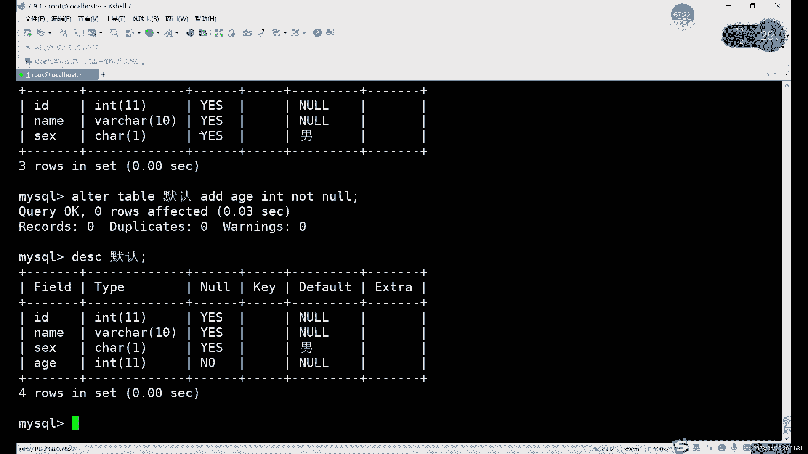

`ALTER TABLE`命令后需要配合具体的选项来执行不同的修改操作。表结构主要包括三部分：字段名、字段数据类型、字段约束。`ALTER`命令能够修改所有这些部分。

以下是`ALTER`命令常用的几个选项：
*   `ADD`: 添加新字段。
*   `MODIFY`: 修改现有字段的数据类型或约束。
*   `CHANGE`: 修改现有字段的名称、数据类型或约束。
*   `DROP`: 删除现有字段。
*   `RENAME TO`: 修改表名（前文已介绍）。

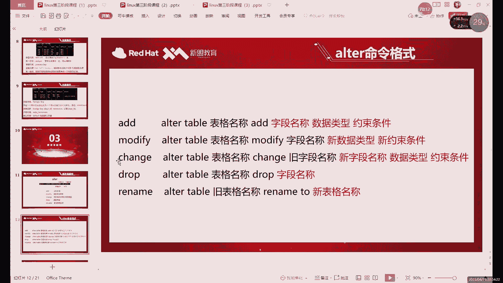

**基本语法格式：**
```sql
ALTER TABLE table_name 选项;
```

### 使用ALTER命令修改字段

以下是各个选项的具体应用示例。

**1. 添加字段 (ADD)**
用于在现有表中新增一列。
```sql
-- 在表末尾添加一个名为age，数据类型为INT且不允许为NULL的字段
ALTER TABLE mytable ADD age INT NOT NULL;

-- 在指定字段sex之后添加一个名为birthday，数据类型为DATE的字段
ALTER TABLE mytable ADD birthday DATE AFTER sex;

-- 在表首列之前添加一个字段
ALTER TABLE mytable ADD new_column VARCHAR(10) BEFORE id;
```
*   `AFTER 字段名` 指定新字段添加在某个已有字段之后。
*   `BEFORE 字段名` 指定新字段添加在某个已有字段之前。

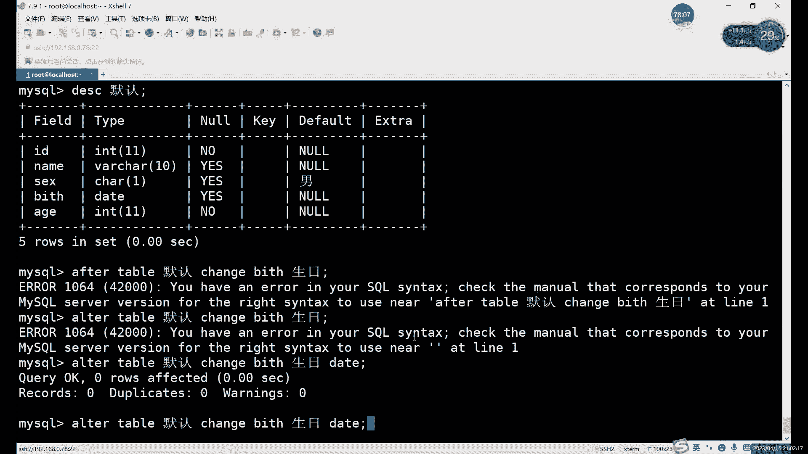

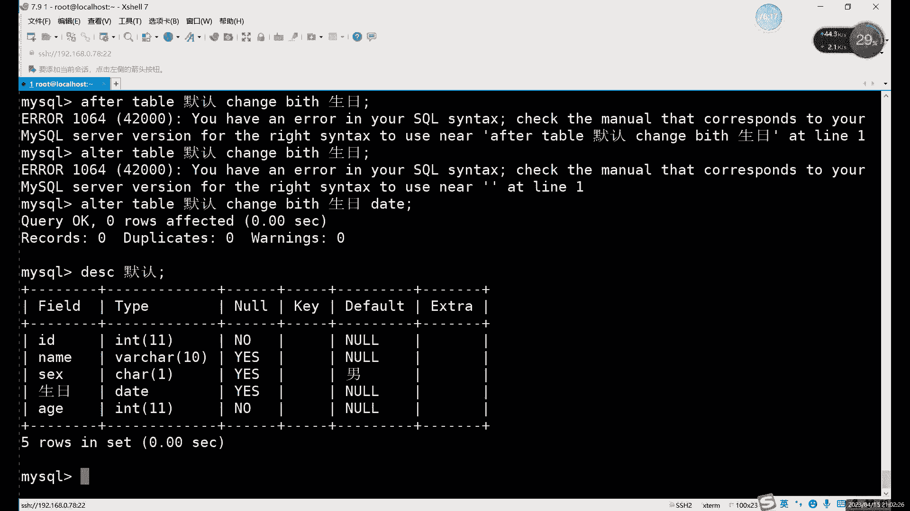

**2. 修改字段 (MODIFY vs CHANGE)**
两者都用于修改字段属性，主要区别在于`CHANGE`可以重命名字段。
*   `MODIFY`: 不能修改字段名，只能改数据类型或约束。
    ```sql
    -- 将字段age的数据类型改为TINYINT
    ALTER TABLE mytable MODIFY age TINYINT;
    ```
*   `CHANGE`: 可以修改字段名、数据类型和约束。使用时需先写旧字段名，再写新字段名。
    ```sql
    -- 将字段birthday改名为birth_date，并保持DATE类型不变
    ALTER TABLE mytable CHANGE birthday birth_date DATE;
    ```
    **注意**：使用`CHANGE`时，即使不打算修改数据类型，也必须将原有的数据类型重新声明一遍。

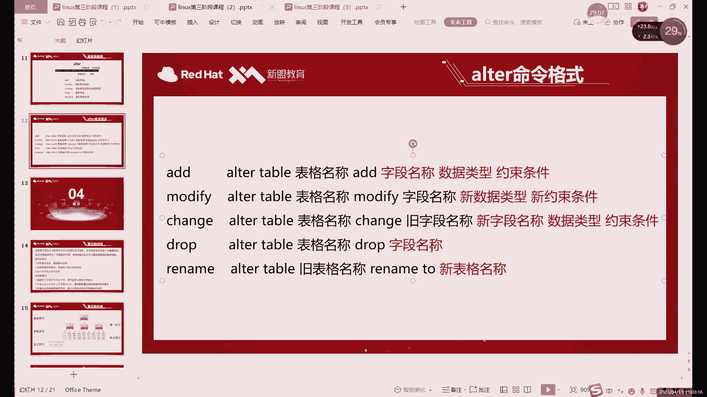

**3. 删除字段 (DROP)**
用于删除表中的某一列。
```sql
-- 删除名为age的字段
ALTER TABLE mytable DROP age;
```

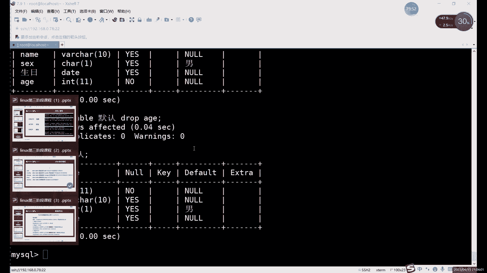

**重要提示**：在使用`MODIFY`或`CHANGE`为已有数据的字段添加`PRIMARY KEY`或`UNIQUE`约束时，必须确保现有数据满足该约束的条件（如无重复值），否则操作会失败。

## 提升查询效率：索引(Index)入门

在介绍了如何修改表结构后，我们引入一个至关重要的概念——索引。索引是数据库系统中用于**加快数据查询速度**的一种数据结构。

### 索引是什么？

可以将索引类比为书籍的**目录**。如果没有目录，查找内容需要逐页翻阅，效率低下。数据库索引的作用类似，它通过创建额外的数据结构（在MySQL中通常是B+树），使得数据库引擎能够快速定位到所需数据，而不必扫描整个表。

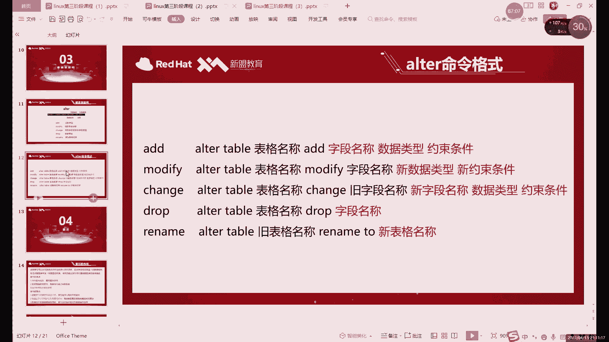

### 索引与约束的关系

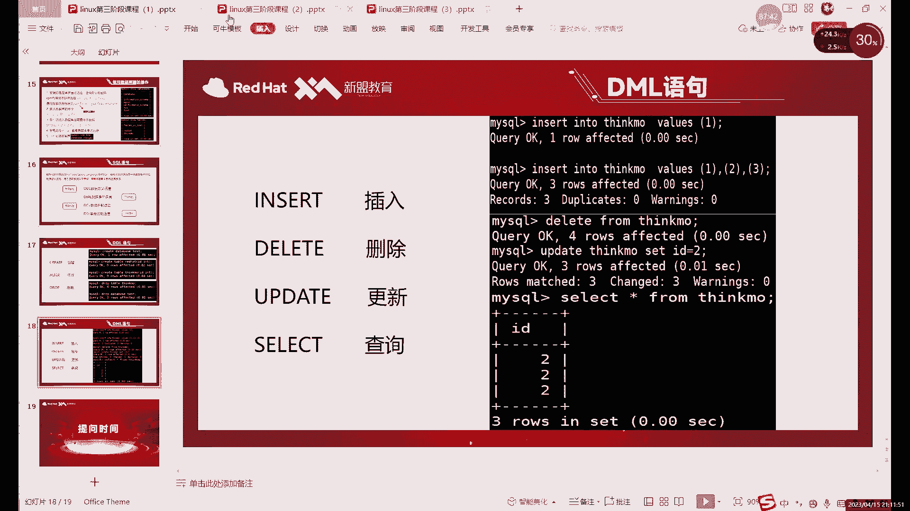

索引和约束是两个不同的概念：
*   **约束**：用于保证数据的**完整性和一致性**（如唯一、非空）。
*   **索引**：用于提高数据**查询的效率**。

但是，它们之间存在交集。在创建以下三种约束时，MySQL会自动创建对应的索引：
1.  **主键约束 (PRIMARY KEY)**: 自动创建主键索引，性能最优。
2.  **唯一约束 (UNIQUE)**: 自动创建唯一索引。
3.  **外键约束 (FOREIGN KEY)**: 自动创建普通索引。

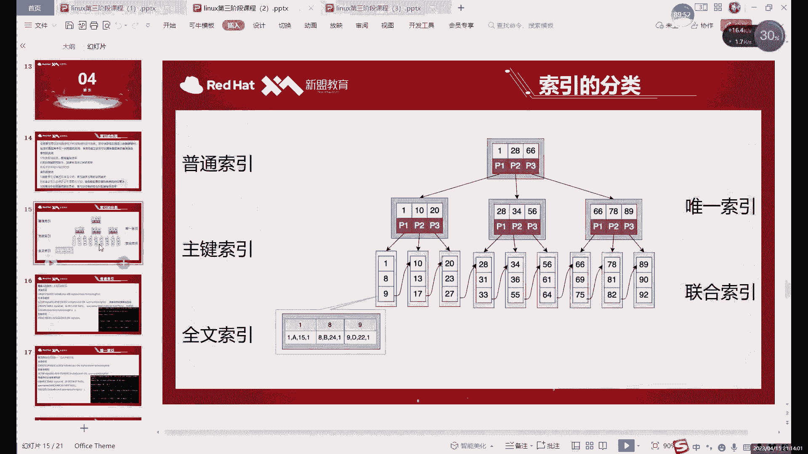

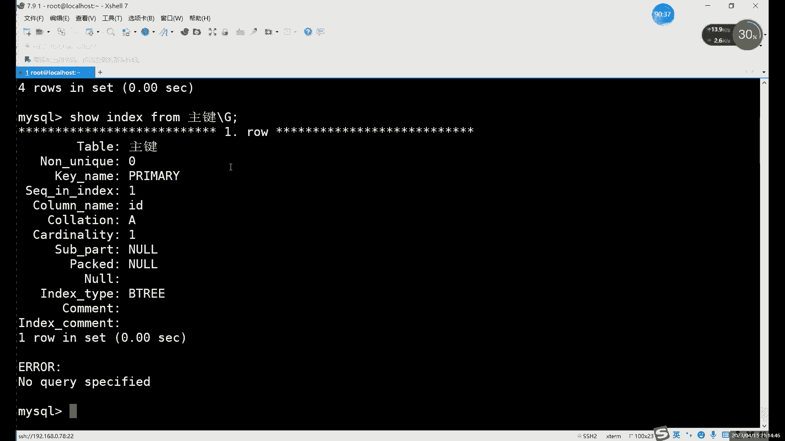

你可以通过`SHOW INDEX FROM 表名;`命令查看表的索引信息。在`DESC 表名;`的结果中，`Key`列标识了该字段的索引或约束类型（`PRI`, `UNI`, `MUL`）。

### 索引的创建与管理

对于不适合设置上述约束，但需要频繁用于查询条件的字段，可以手动创建**普通索引**。

**创建普通索引：**
```sql
-- 方法一：使用CREATE INDEX语句
CREATE INDEX index_name ON table_name (column_name);

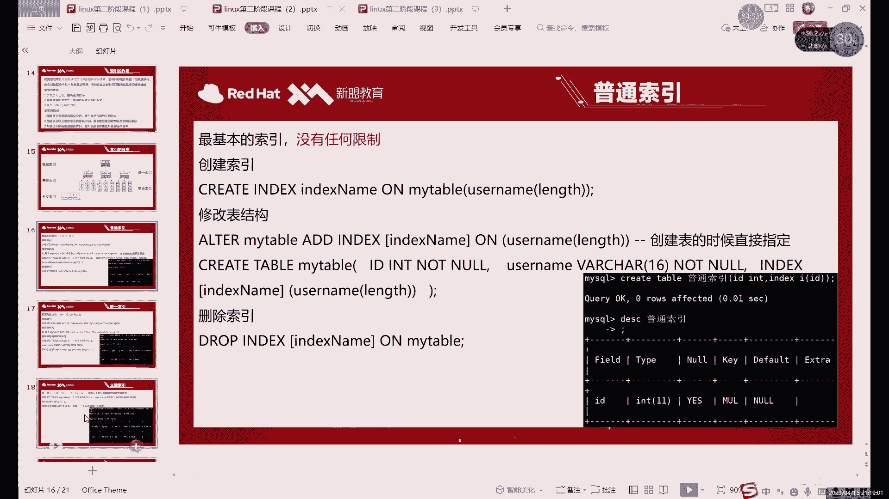

-- 方法二：使用ALTER TABLE语句
ALTER TABLE table_name ADD INDEX index_name (column_name);
```

**删除索引：**
```sql
-- 使用DROP INDEX语句
DROP INDEX index_name ON table_name;

-- 或使用ALTER TABLE语句
ALTER TABLE table_name DROP INDEX index_name;
```

### 如何判断查询是否使用了索引？

使用`EXPLAIN`命令可以分析一条`SELECT`语句的执行计划，从而判断是否使用了索引。

```sql
EXPLAIN SELECT * FROM mytable WHERE id = 1;
```
查看结果中的`type`列：
*   如果`type`为 **`ALL`**，表示进行了**全表扫描**，没有使用索引，在数据量大时效率最低。
*   如果`type`为 **`const`** 或 **`eq_ref`** 等，表示查询有效地使用了索引（如主键或唯一索引），这是高效的查询方式。

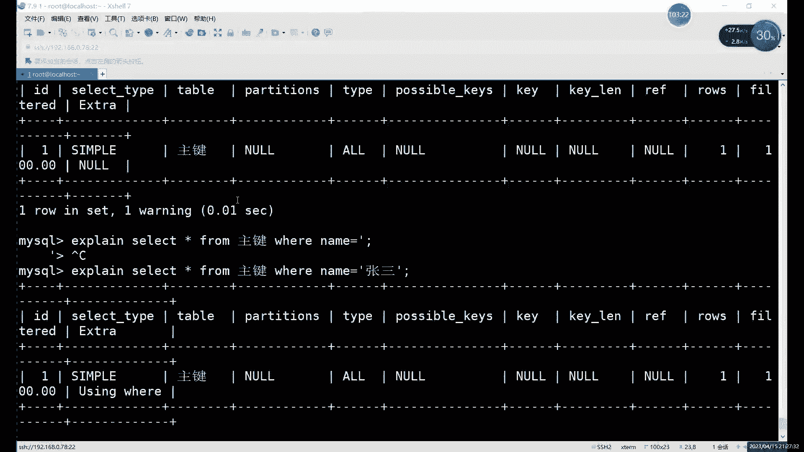

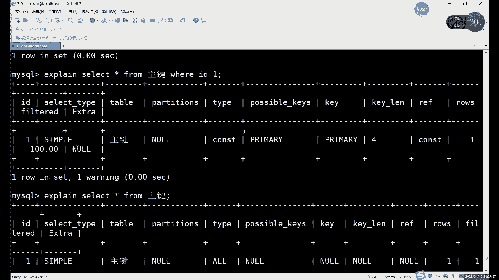

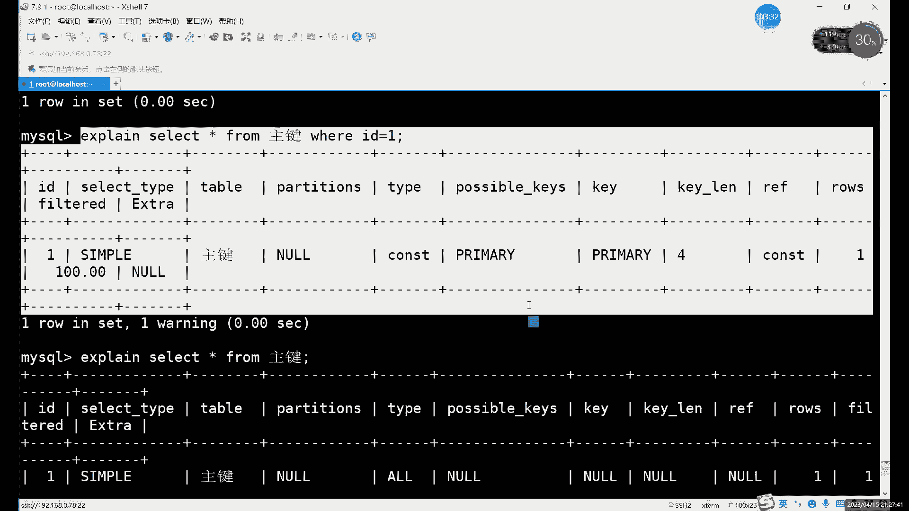

### 索引使用建议

1.  **为查询频繁的字段创建索引**：索引主要用于优化`WHERE`子句中的查询条件。
2.  **索引不是越多越好**：索引会占用额外的磁盘空间，并会在数据增删改时降低性能（因为索引也需要维护）。需要平衡查询速度与维护成本。
3.  **选择合适的主键**：主键会自动创建索引。应选择一个唯一且稳定的字段作为主键（如自增ID），这通常是最常用的查询条件。

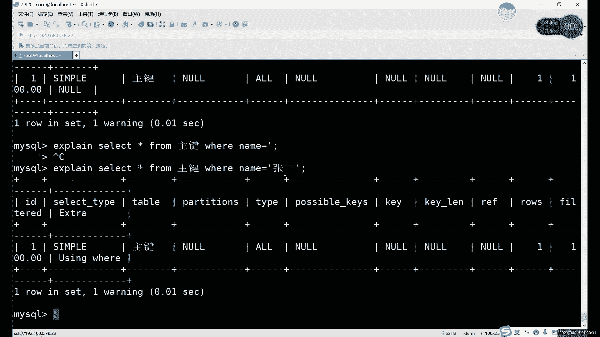

## 总结

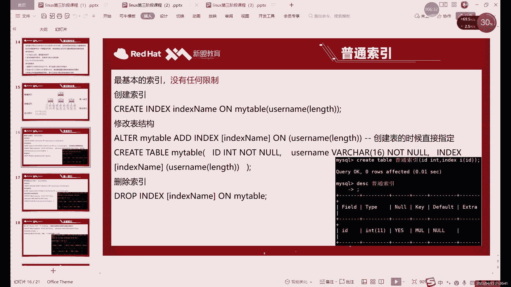

本节课中我们一起学习了：
1.  **`ALTER`命令**：用于修改表结构，包括重命名表、增删改字段及其属性。它是维护数据库表的重要工具。
2.  **索引(Index)**：一种提高数据库查询性能的数据结构，类似于书的目录。
3.  **索引与约束**：主键、唯一、外键约束会自动创建索引。普通索引可以手动创建以优化不含这些约束的常用查询字段。
4.  **索引管理**：可以使用`CREATE INDEX`或`ALTER TABLE ... ADD INDEX`创建索引，使用`DROP INDEX`或`ALTER TABLE ... DROP INDEX`删除索引。
5.  **性能分析**：使用`EXPLAIN`命令可以查看SQL语句的执行计划，判断是否使用了索引。

合理使用`ALTER`命令和索引，是进行高效数据库管理和优化应用性能的关键技能。