# Linux运维工程师升职加薪宝典：P6：命令行编辑技巧与学习方法 📝

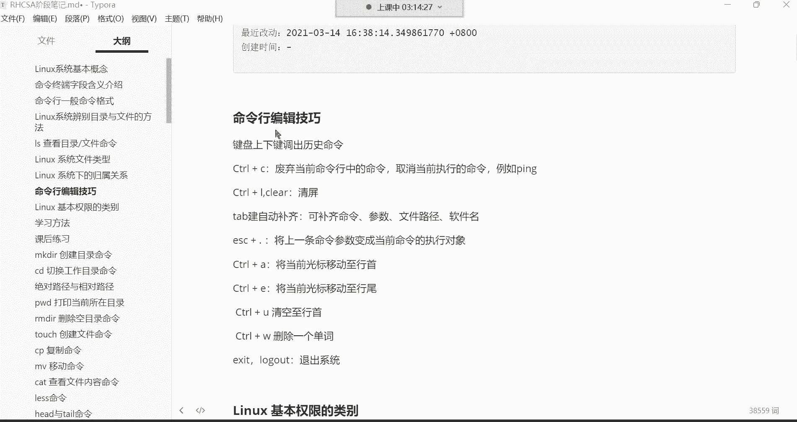

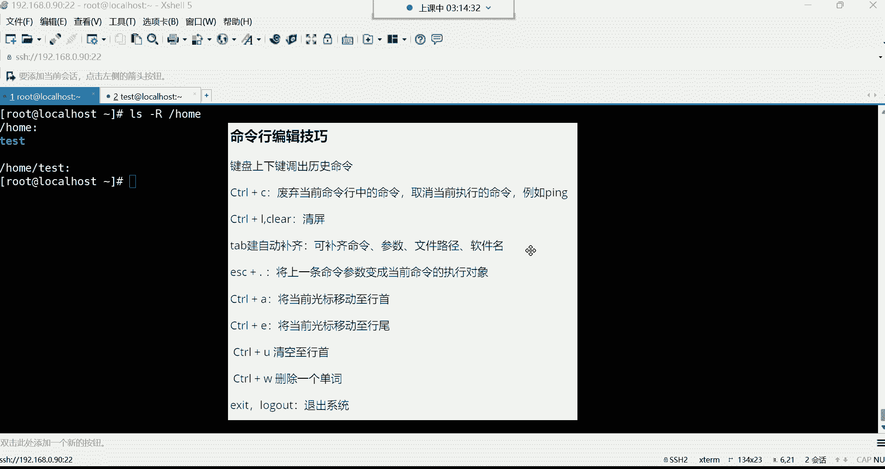

在本节课中，我们将要学习Linux命令行中的高效编辑技巧，以及一些重要的学习方法。掌握这些技巧能显著提升你的工作效率，而正确的学习方法则能帮助你更扎实地掌握知识。

## 命令行编辑技巧 ⌨️

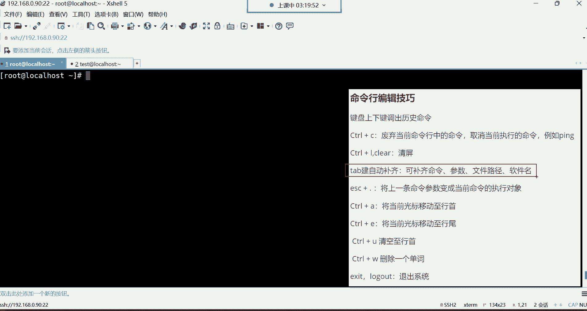

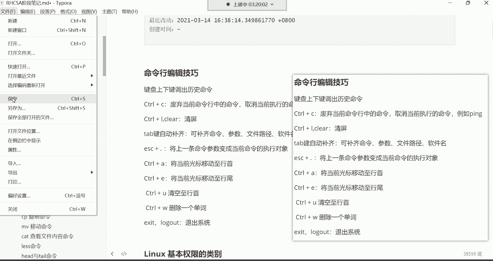

上一节我们介绍了`ls`命令的基本用法，本节中我们来看看如何更高效地在命令行中操作。这些技巧可以理解为命令行的“快捷操作”。

### 1. 调出历史命令
使用键盘的**上方向键**和**下方向键**可以调出曾经执行过的命令。系统会记录最近执行的1000条命令。通常，我们只会上翻最近的两三条命令来重复执行，因为翻找太旧的命令不如直接重新输入。

### 2. 废弃或取消命令
`Ctrl + C` 组合键有两个核心功能：
*   **废弃当前命令行中的命令**：当你输入了一条命令但还未按回车执行时，按 `Ctrl + C` 可以清空当前行，让你重新输入。
*   **取消当前正在执行的命令**：如果一个命令（如持续运行的 `ping` 命令）正在执行，按 `Ctrl + C` 可以强制终止它。

### 3. 清屏
`Ctrl + L` 组合键可以快速清空当前终端屏幕，效果等同于输入 `clear` 命令。

### 4. 自动补齐
`Tab` 键是命令行中极其重要的效率工具，它可以自动补齐：
*   **命令**
*   **文件或目录路径**
*   **软件包名**

**使用方法**：
*   输入部分字符后按一次 `Tab` 键，如果只有一个匹配项，系统会自动补齐。
*   如果有多项匹配，按一次 `Tab` 可能无反应，此时再按一次 `Tab` 键，系统会列出所有可能的匹配项供你选择。

**示例**：要进入 `/etc/sysconfig/network-scripts/` 目录，可以这样操作：
```bash
cd /etc/sys<Tab><Tab>   # 列出所有以 `sys` 开头的目录
cd /etc/sysconfig/      # 手动补全 `config` 后按 `/`
cd /etc/sysconfig/net<Tab><Tab> # 列出所有以 `net` 开头的目录
cd /etc/sysconfig/network-<Tab> # 自动补齐 `scripts/`
```

### 5. 调用上一条命令的参数
`Esc + .`（先按 `Esc` 键，松开后再按 `.` 键）可以将上一条命令的最后一个参数快速粘贴到当前光标位置。

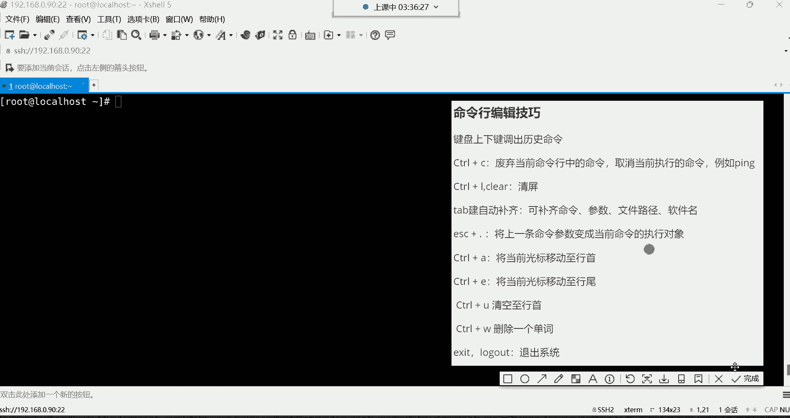

**示例**：
```bash
ls -l /etc/passwd
# 上方向键调出命令，然后按 `Esc + .`，会得到：
ls -l /etc/passwd
cat # 此时再按 `Esc + .`，`/etc/passwd` 就会被粘贴过来
cat /etc/passwd
```

### 6. 其他编辑快捷键（了解即可）
以下是几个有用的光标控制快捷键，了解后可在需要时使用：
*   `Ctrl + A`：将光标移动到行首。
*   `Ctrl + E`：将光标移动到行尾。
*   `Ctrl + U`：删除从光标位置到行首的所有字符。
*   `Ctrl + W`：删除光标前的一个单词（以空格为分隔）。

### 7. 退出系统
以下是退出当前登录会话的命令：
*   `exit`
*   `logout`
两者功能相同，任选其一记住即可。

---

## 学习方法与重点总结 🧠

本节课中我们一起学习了系统概念、命令格式、`ls`命令和命令行技巧。以下是需要重点掌握和了解的内容梳理。

### 本节课核心掌握点
你需要重点复习和掌握以下内容：
1.  **命令终端字段含义**：理解命令行提示符 `[root@localhost ~]#` 每一部分的含义。
2.  **辨别目录与文件的方法**：主要通过颜色区分，例如蓝色通常代表目录。
3.  **`ls` 命令及其常用选项**：特别是 `-l`（长格式）、`-a`（显示隐藏文件）、`-h`（人性化显示文件大小）的组合使用。
4.  **命令行编辑技巧**：尤其是 **上下键**、**`Ctrl+C`**、**`Tab`键** 和 **`Esc+.`** 的使用。

### 本节课了解内容
以下内容目前仅作了解，后续课程会深入讲解：
*   系统基本概念（多用户、多任务、根目录等）。
*   文件类型（通过 `ls -l` 结果首字符识别，如 `-` 表示普通文件，`d` 表示目录）。
*   文件归属关系与基本权限类别。

### 高效学习建议
为了在5个半月的学习周期内取得最佳效果，请遵循以下方法：

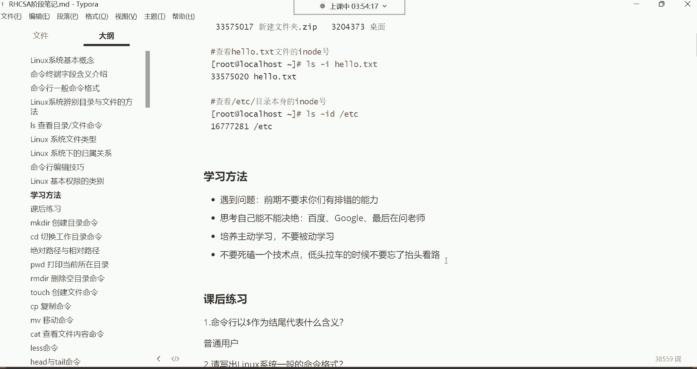

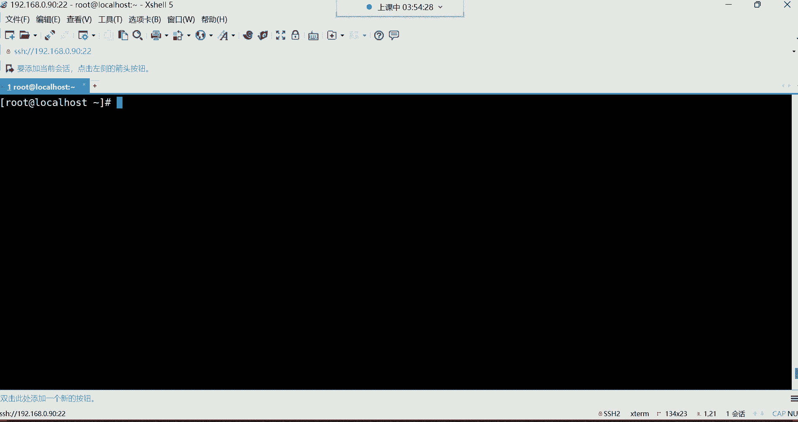

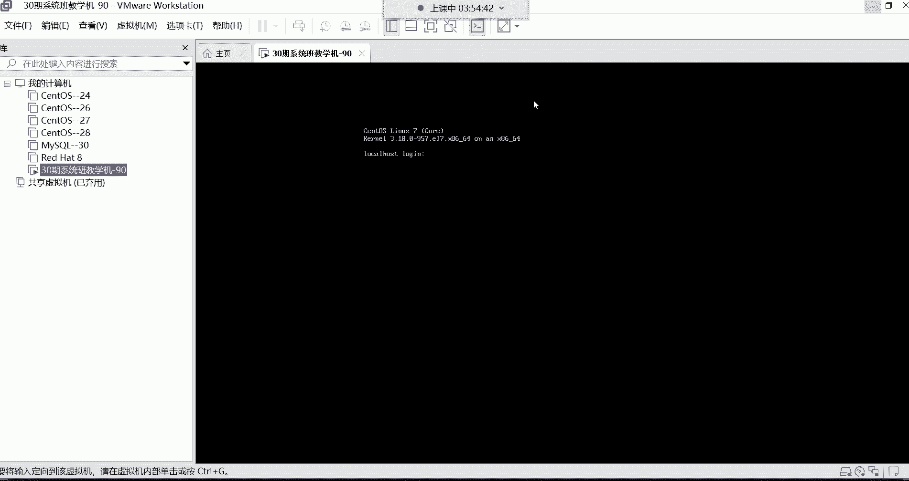

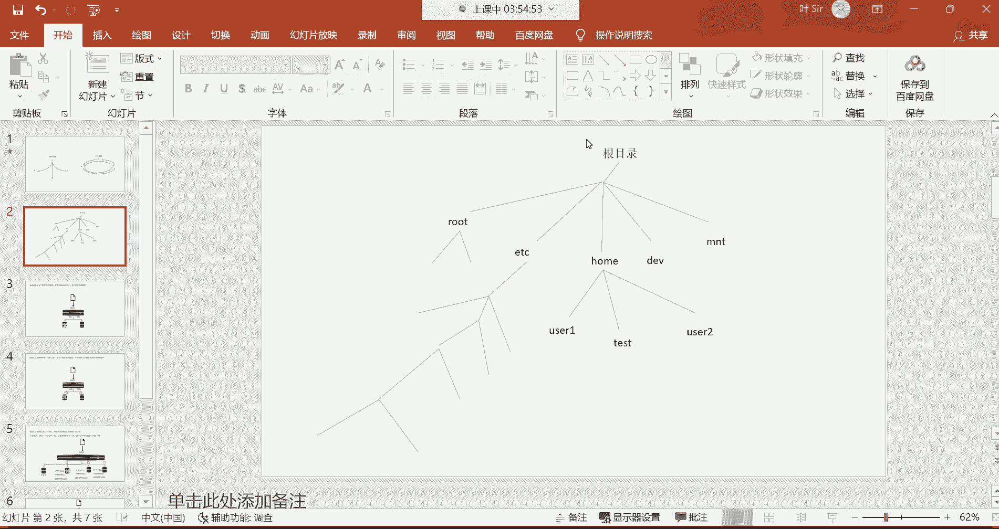

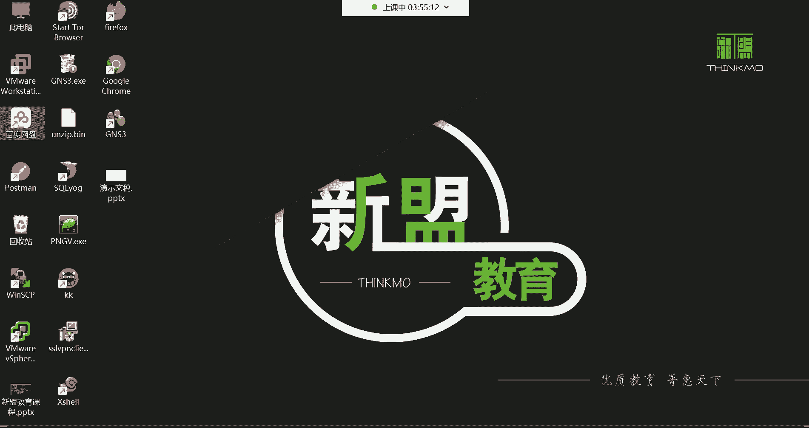

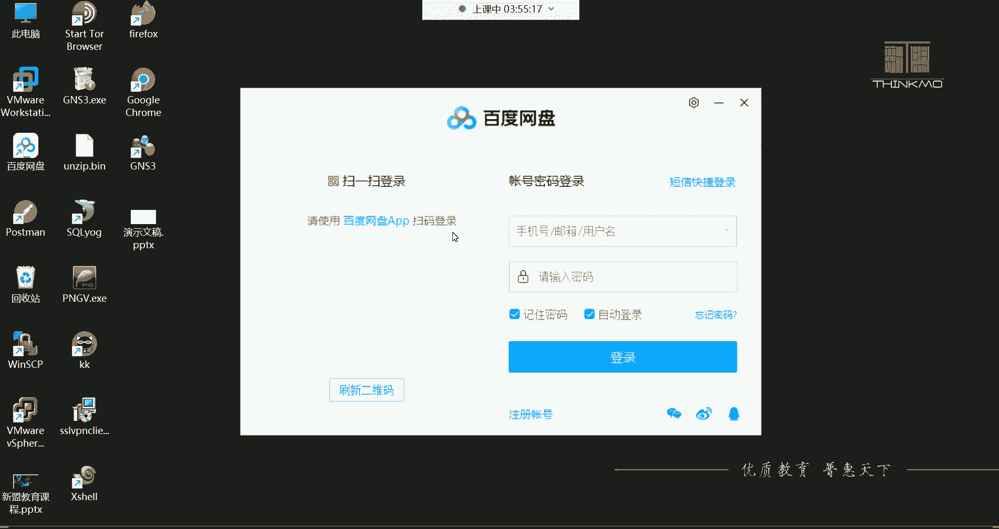

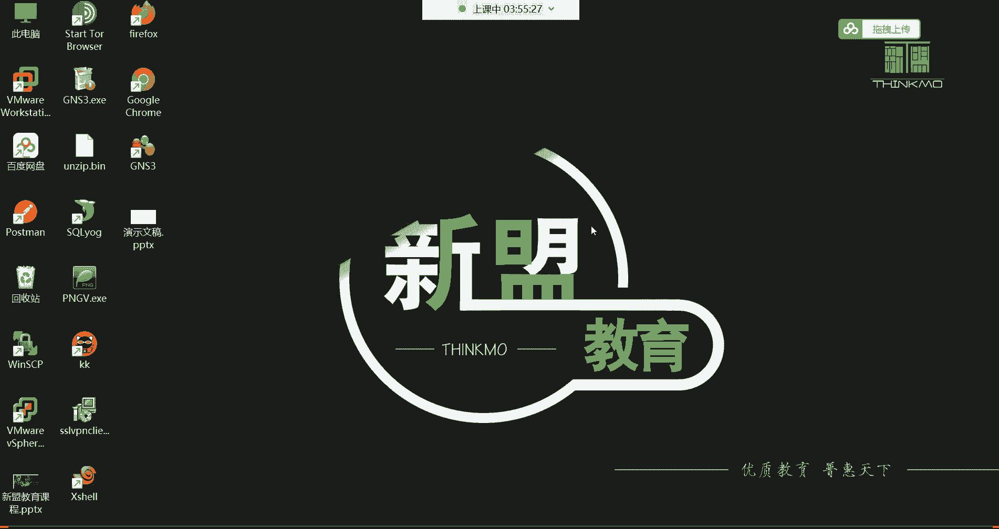

**遇到问题怎么办？**
1.  **初期**：遇到问题可直接在群内提问，有专门的答疑老师（如磊神老师）和班主任（木木老师）提供帮助。
2.  **后期**：应主动培养**独立解决问题的能力**。尝试按以下步骤处理：
    *   清晰、准确地描述你遇到的问题。
    *   利用百度、谷歌等搜索引擎寻找答案。
    *   如果仍无法解决，再向老师或社区求助。这种能力是运维工程师的核心竞争力。

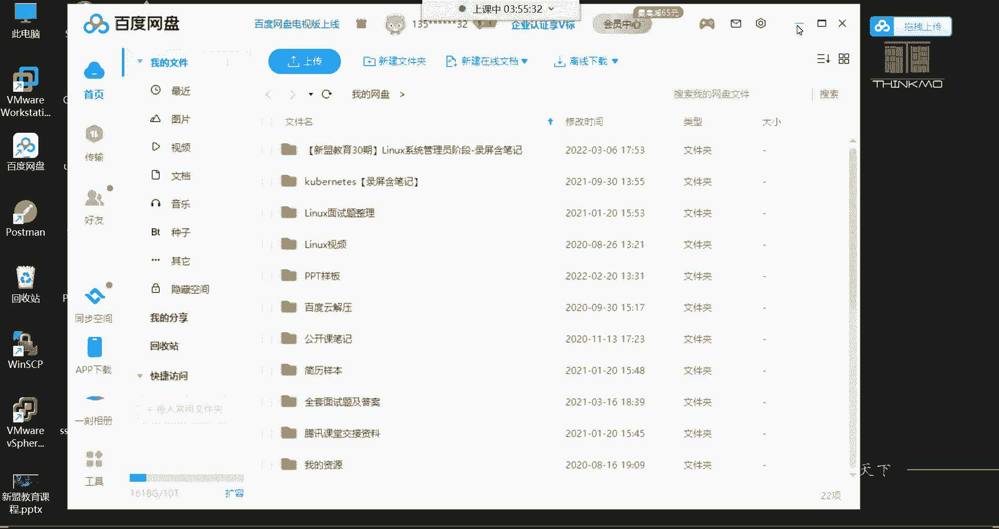

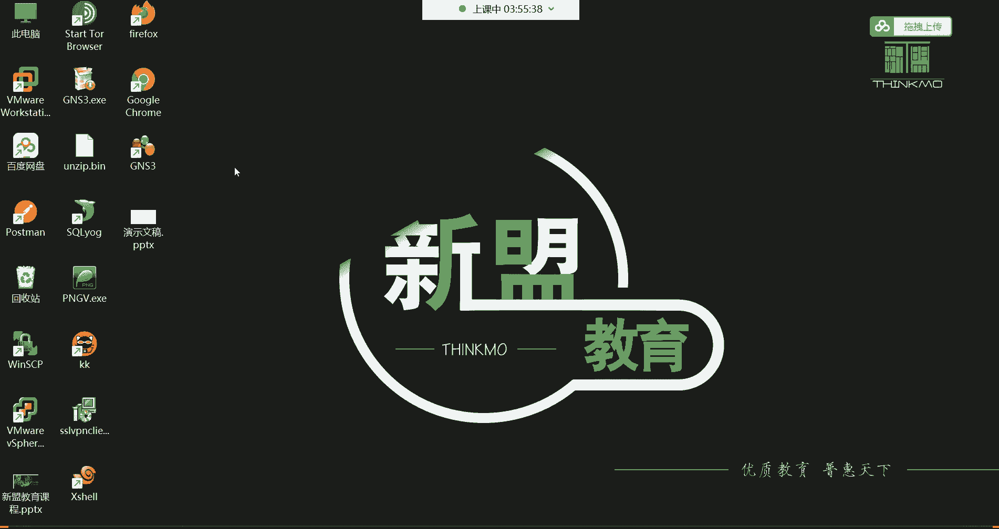

**学习态度与节奏**
*   **主动学习**：不要局限于课堂内容。例如，学了 `ls` 命令后，可以主动查阅资料了解它的其他选项和用法。
*   **坚持不懈**：将接下来5个半月视为“闭关修炼期”，全力以赴。今天的付出是为了换取未来更广阔的职业生涯和更高的收入。
*   **避免钻牛角尖**：如果某个知识点暂时无法理解，不要死磕。可以先做标记，继续往后学习，往往在学到后续知识时，前面的疑问会自然解开。要“低头拉车，也要抬头看路”。

**学习资料使用**
*   课程笔记（含源码MD格式和PDF格式）和录屏会上传至网盘，请在群公告内查看下载链接。
*   推荐使用 `Typora` 软件打开和编辑MD格式的笔记源码。软件下载链接也已在群公告中提供。
*   多利用碎片时间（如通勤时）通过手机复习PDF版笔记。

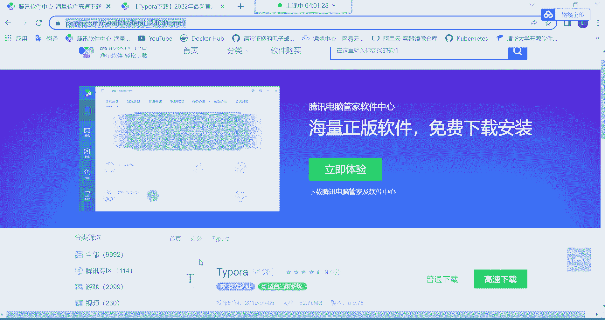

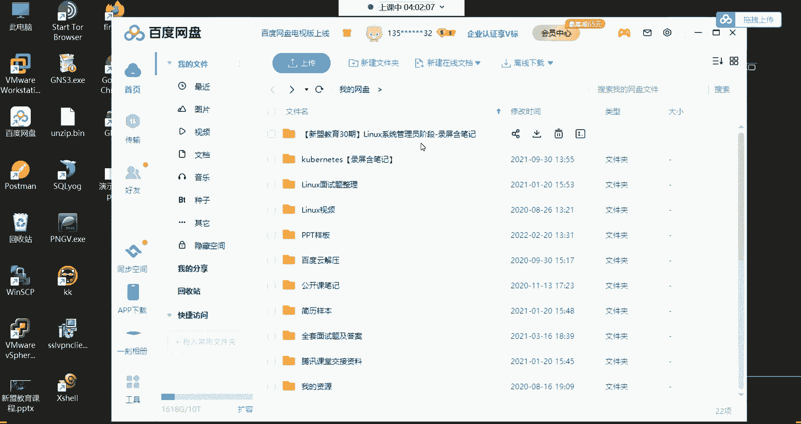

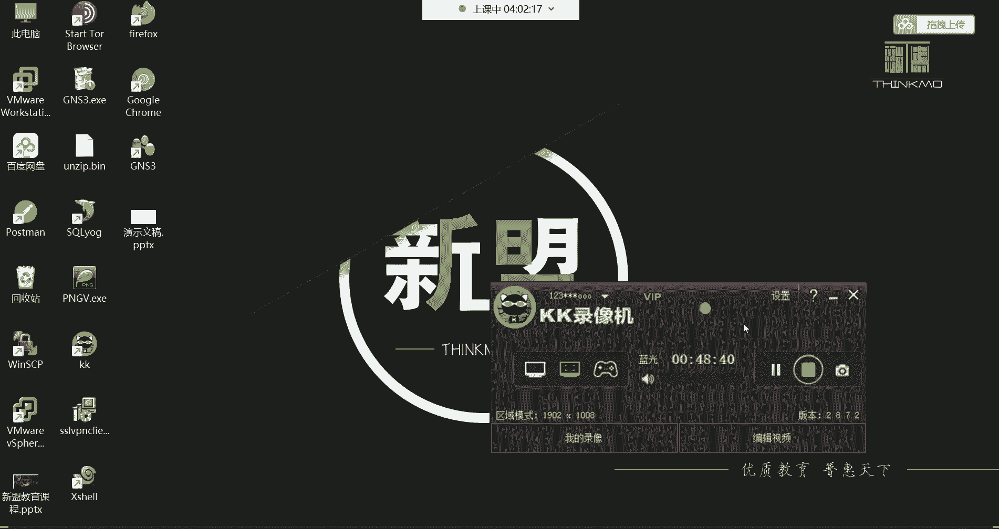

---
**总结**：本节课我们重点学习了提升命令行操作效率的编辑技巧，并对整个课程的学习方法进行了规划。记住核心的快捷键，并保持积极、主动、坚持的学习态度，是迈向一名合格Linux运维工程师的关键第一步。下节课我们将开始学习更多的实用命令。