# Linux运维教程：P73：中级运维-12.SELECT单表查询与嵌套查询

在本节课中，我们将深入学习SQL中的`SELECT`单表查询，并重点探讨嵌套查询（子查询）的多种用法。我们将从基础的查询结构开始，逐步深入到复杂的条件组合与多语句嵌套，帮助你掌握从数据表中精确提取所需信息的核心技能。

## 概述：SELECT语句的核心结构

一个完整的`SELECT`查询语句由多个子句构成，每个子句承担着不同的功能。理解它们的执行顺序和作用是编写高效查询的关键。

上一节我们介绍了数据库的基本操作，本节中我们来看看如何从单个表中进行复杂的查询。

## SELECT子句：指定要查询的字段

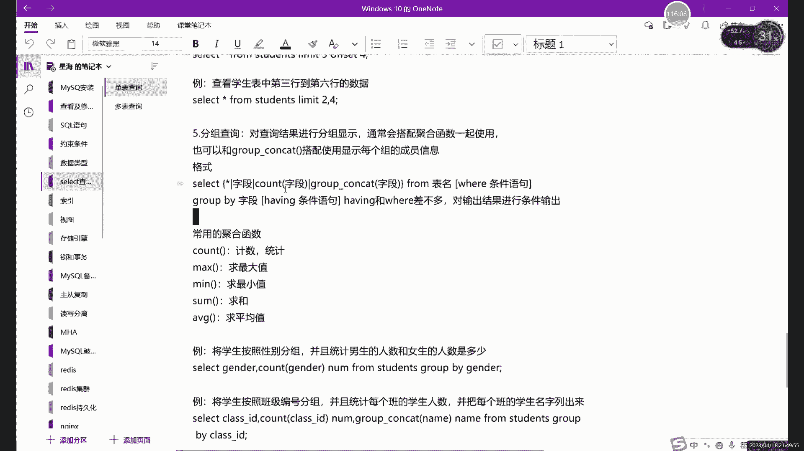

`SELECT`子句用于指定要从表中检索哪些列的数据。以下是几种常见的写法：

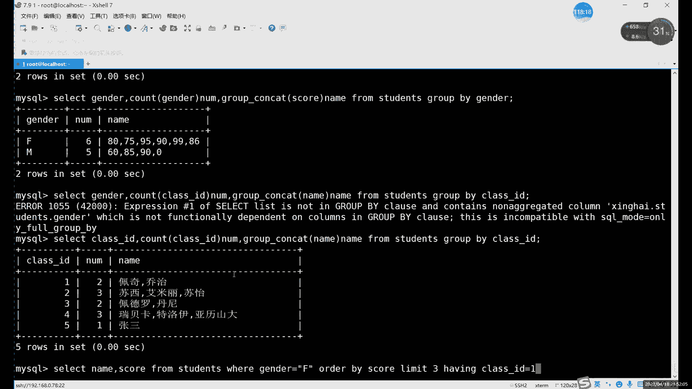

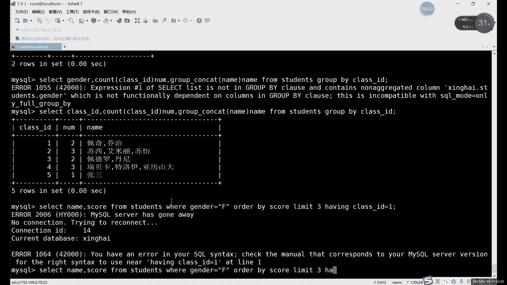

*   **查询所有列**：使用星号`*`代表选择表中的所有字段。
    ```sql
    SELECT * FROM table_name;
    ```
*   **查询特定列**：直接写出字段名，多个字段用逗号分隔。
    ```sql
    SELECT name, score FROM students;
    ```
*   **使用聚合函数**：如`COUNT()`用于计数。它可以单独使用，也常与`GROUP BY`一起使用。
    ```sql
    SELECT COUNT(*) FROM students;
    ```
*   **使用GROUP_CONCAT函数**：此函数必须与`GROUP BY`分组一起使用，用于显示每个分组内的详细信息。
    ```sql
    SELECT class_id, GROUP_CONCAT(name) FROM students GROUP BY class_id;
    ```

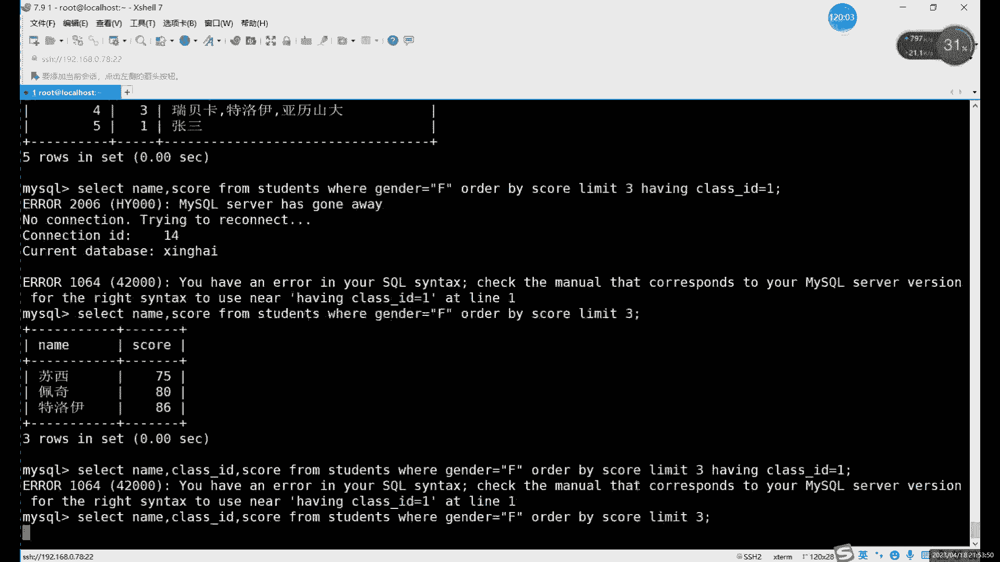

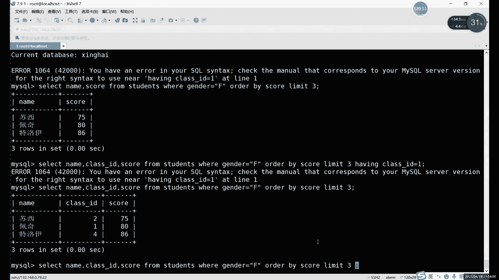

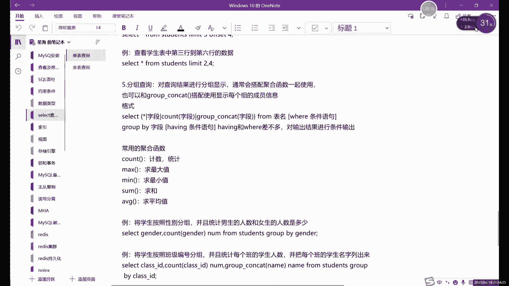

## FROM子句：指定数据来源

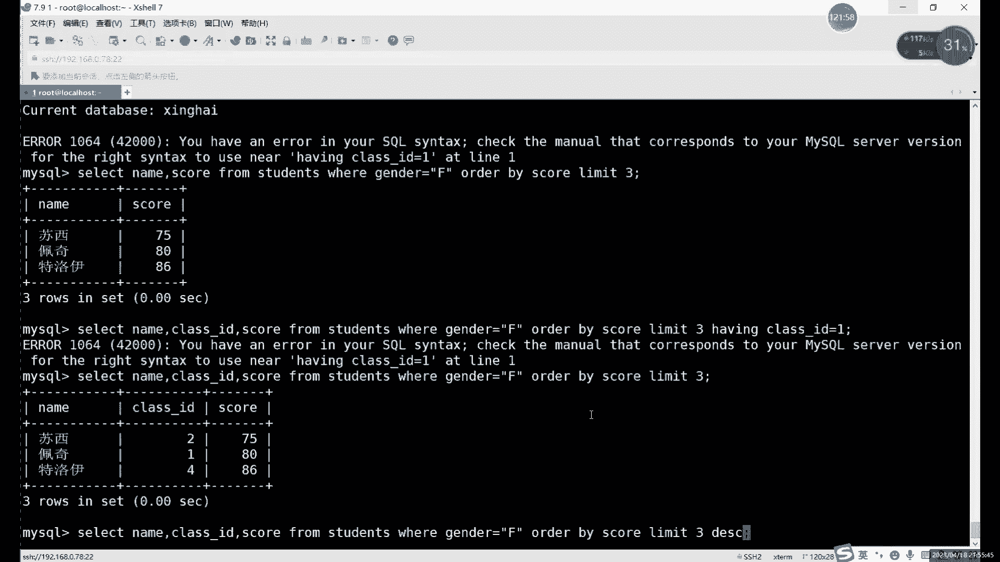

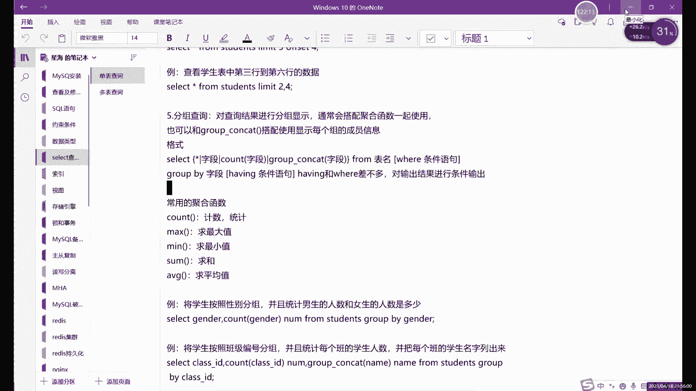

`FROM`子句用于指定查询的数据来自哪个表。在单表查询中，只需写一个表名。其语法非常简单，但至关重要。
```sql
SELECT * FROM students;
```
> **注意**：在多表查询时，`FROM`后可以跟多个用逗号分隔的表名，但这属于后续课程的内容。

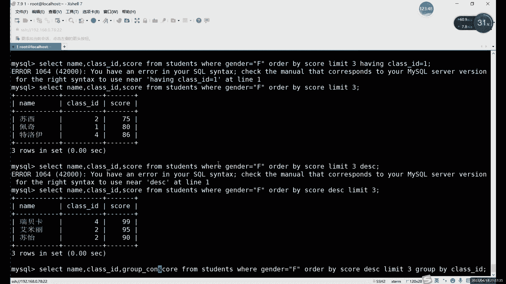

## WHERE子句：设置过滤条件

`WHERE`子句用于对查询结果进行初步筛选，它**不是必须的**，但加上它可以限制返回数据的范围。`WHERE`条件在分组和排序**之前**生效。
```sql
SELECT * FROM students WHERE gender = ‘女’;
```

## GROUP BY与ORDER BY：分组与排序

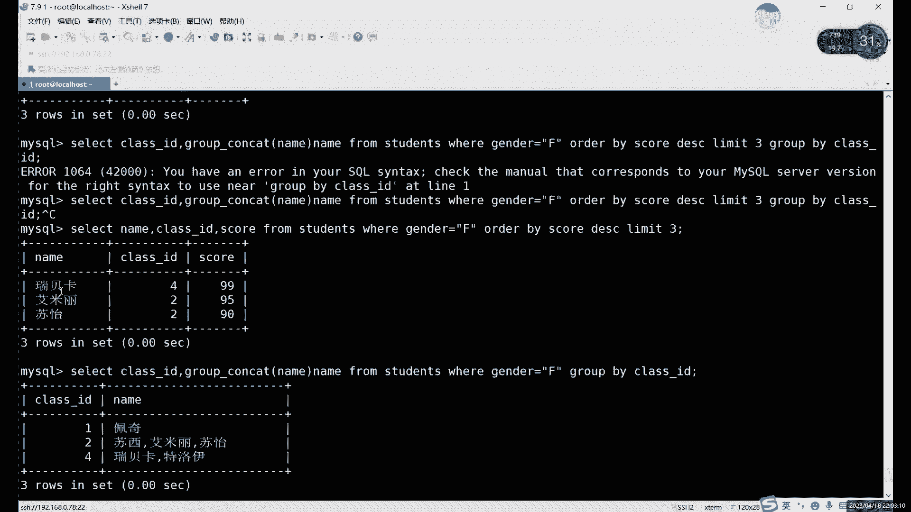

`GROUP BY`用于将数据分组，`ORDER BY`用于对结果排序。它们通常放在`WHERE`子句之后，对`WHERE`筛选出的数据进行“二次处理”，只改变数据的呈现形式，不改变数据本身。

以下是`GROUP BY`和`ORDER BY`等子句的执行顺序和作用：
1.  **WHERE**：首先过滤出符合条件的数据行。
2.  **GROUP BY**：然后对过滤后的数据进行分组。
3.  **ORDER BY**：接着对分组结果（或普通结果）进行排序。
4.  **LIMIT**：最后限制返回的结果数量（分页）。

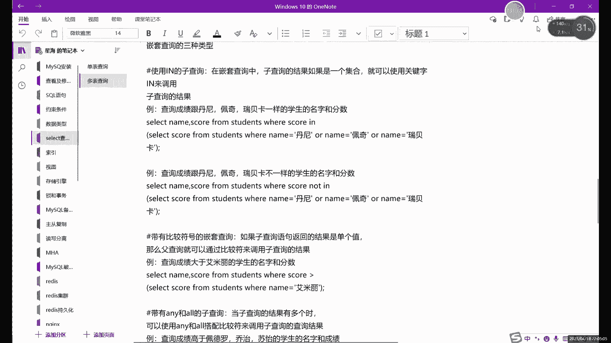

## HAVING子句：分组后的过滤

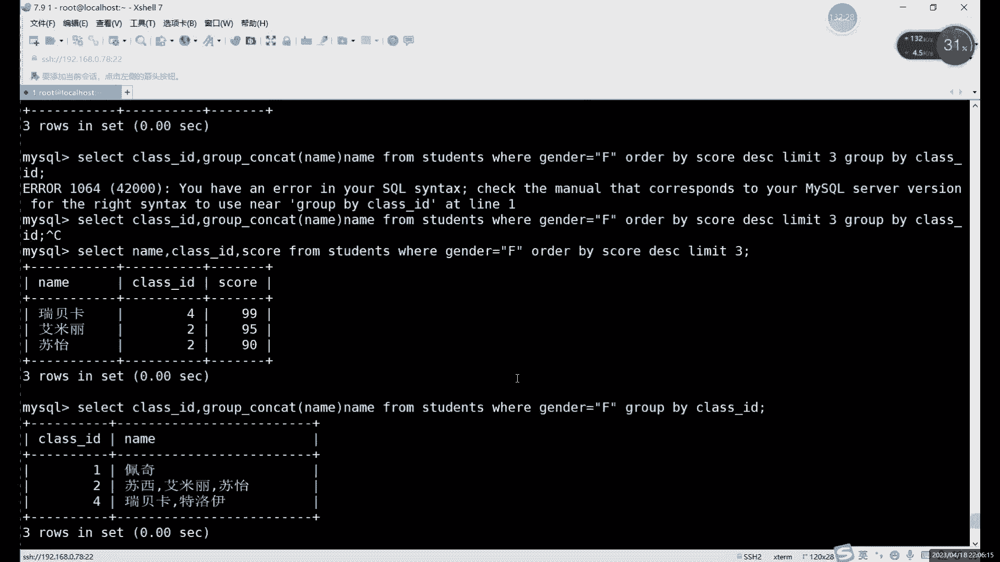

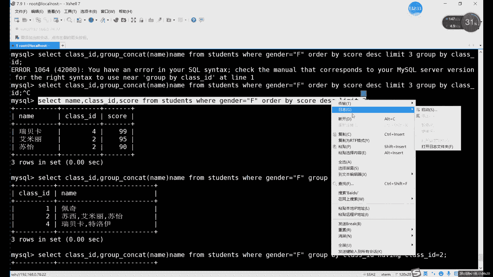

`HAVING`子句也是一个条件语句，其用法与`WHERE`类似。关键区别在于它们的**生效位置**：
*   `WHERE`在分组**前**过滤，作用于原始数据行。
*   `HAVING`在分组**后**过滤，作用于`GROUP BY`产生的分组结果。

通常，`HAVING`与聚合函数一起使用，对分组后的统计结果进行再次筛选。例如，查询平均分大于80的班级：
```sql
SELECT class_id, AVG(score) as avg_score FROM students GROUP BY class_id HAVING avg_score > 80;
```

## 综合查询示例

让我们将上述大部分子句组合在一个查询中。这个查询会找出女生中成绩排名前三的学生，并按班级分组显示学生姓名。
```sql
SELECT class_id, GROUP_CONCAT(name)
FROM students
WHERE gender = ‘女’
GROUP BY class_id
ORDER BY score DESC
LIMIT 3;
```
> **提示**：当查询变得非常复杂时，一个`SELECT`语句可能无法完成所有需求，这时就需要用到嵌套查询。

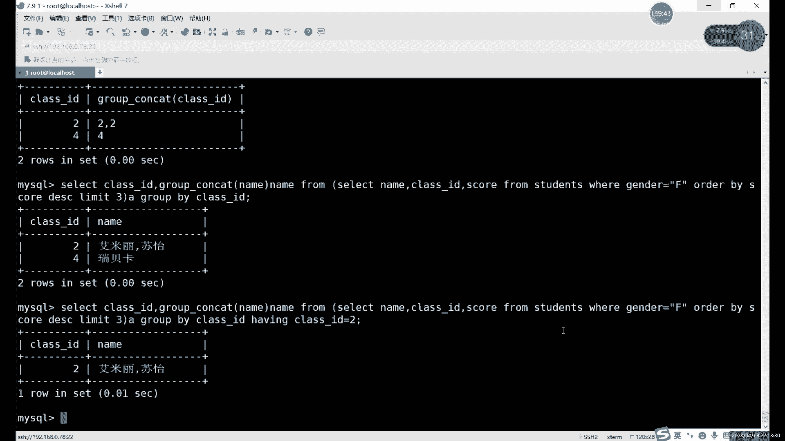

## 嵌套查询（子查询）

嵌套查询，或称子查询，是指将一个`SELECT`查询语句嵌套在另一个`SELECT`语句中。它主要用于解决一个查询无法直接完成的复杂问题。

### 嵌套查询的两种主要类型

1.  **子查询作为条件（用在WHERE/HAVING中）**：将一个查询的结果作为另一个查询的过滤条件。
2.  **子查询作为数据源（用在FROM中）**：将一个查询的结果视为一张临时表，供外层查询使用。

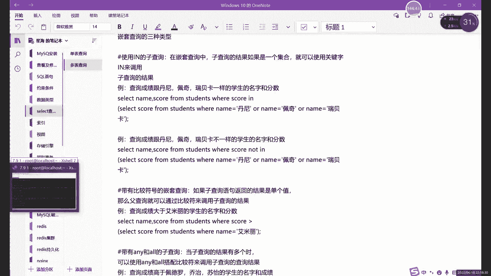

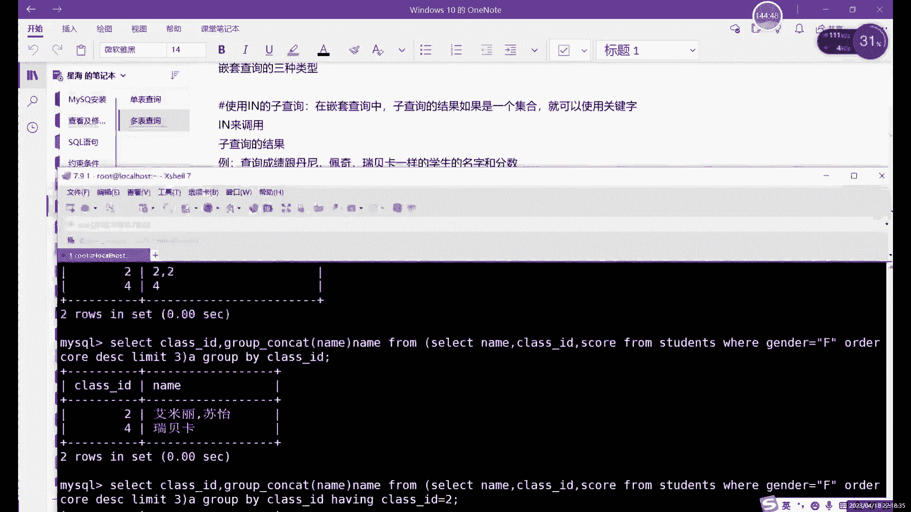

### 类型一：子查询作为条件

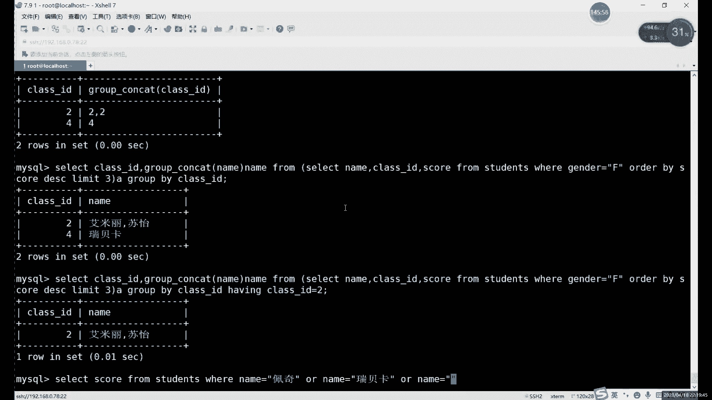

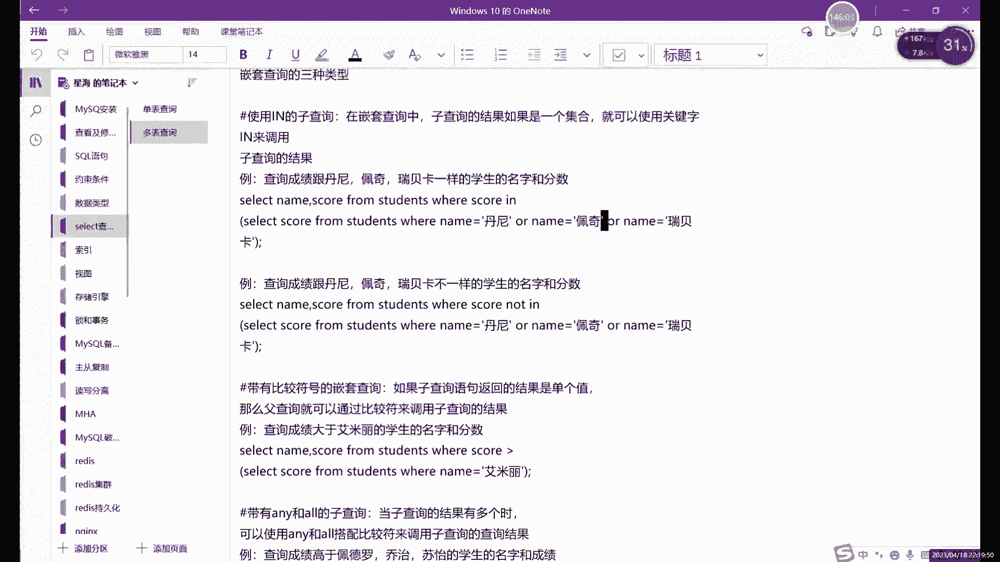

**示例：查询与“佩奇”、“瑞贝卡”成绩相同的学生姓名和分数。**
思路：首先需要查出“佩奇”和“瑞贝卡”的成绩，然后用这个成绩集合去匹配其他学生。
```sql
SELECT name, score
FROM students
WHERE score IN (
    SELECT score
    FROM students
    WHERE name IN (‘佩奇‘， ’瑞贝卡‘)
);
```
> **关键点**：作为条件的子查询（括号内部分）通常只返回**单个字段**的多个值。

**子查询与比较运算符（ANY/ALL）**：
当子查询返回多个结果，并且需要比较时（如大于、小于），需使用`ANY`或`ALL`。
*   `> ALL(子查询)`：大于子查询结果中的所有值（即大于最大值）。
*   `> ANY(子查询)`：大于子查询结果中的任意一个值（即大于最小值）。
*   `< ALL(子查询)`：小于子查询结果中的所有值（即小于最小值）。
*   `< ANY(子查询)`：小于子查询结果中的任意一个值（即小于最大值）。

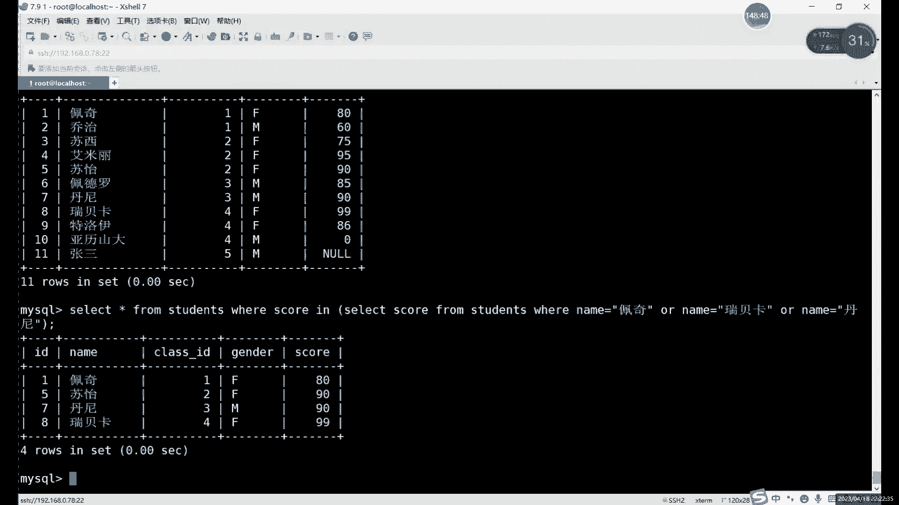

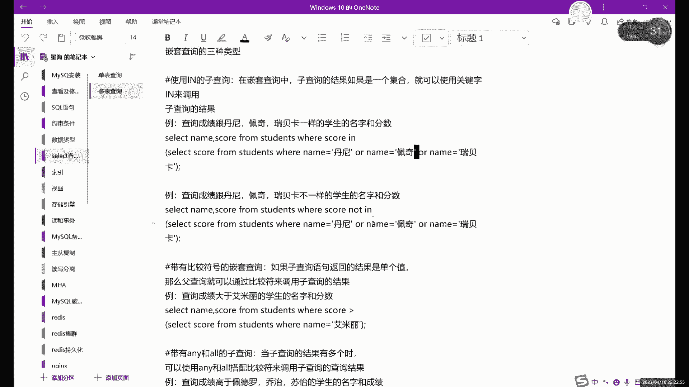

### 类型二：子查询作为数据源（派生表）

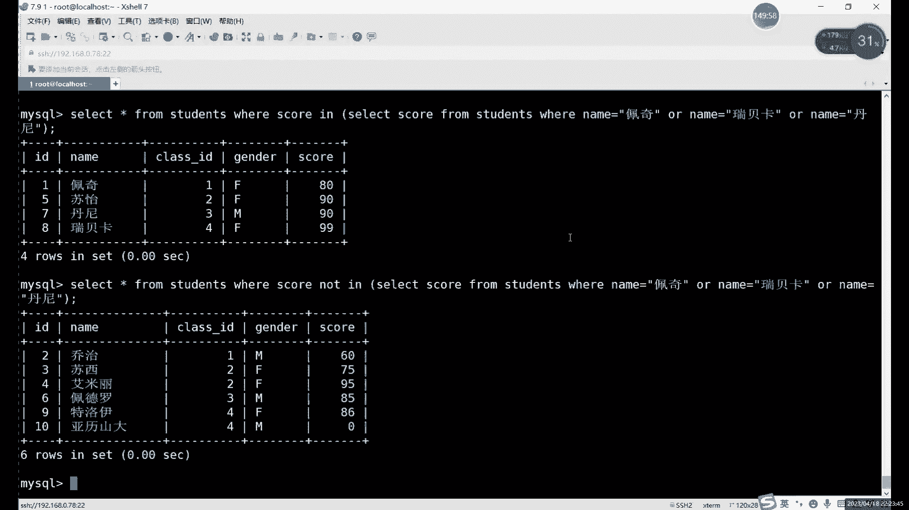

**示例**：对一个复杂的查询结果（临时表）继续进行分组操作。
```sql
SELECT class_id, GROUP_CONCAT(name)
FROM (
    — 这是一个复杂的子查询，其结果被当作一张临时表
    SELECT name, class_id, score
    FROM students
    WHERE gender = ‘女’
    ORDER BY score DESC
    LIMIT 5
) AS temp_table — 必须为派生表起一个别名
GROUP BY class_id;
```
> **关键点**：用在`FROM`后的子查询必须使用`AS`关键字为其赋予一个**别名**（如`temp_table`），以便外层查询引用。

### 特殊的EXISTS子查询

`EXISTS`用于判断子查询是否返回结果。如果子查询有结果，则外层查询执行；如果子查询无结果，则外层查询不返回数据。
```sql
SELECT *
FROM students
WHERE EXISTS (
    SELECT 1 FROM classes WHERE class_id = 6 — 假设没有6班，则外层查询不执行
);
```

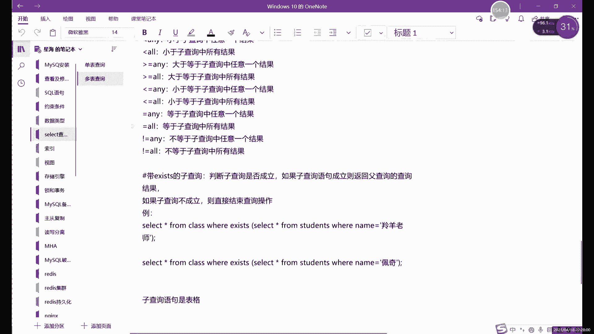

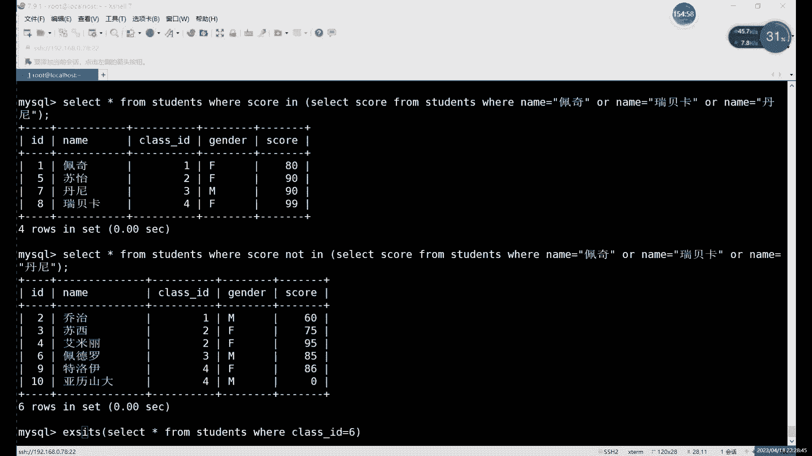

## 总结

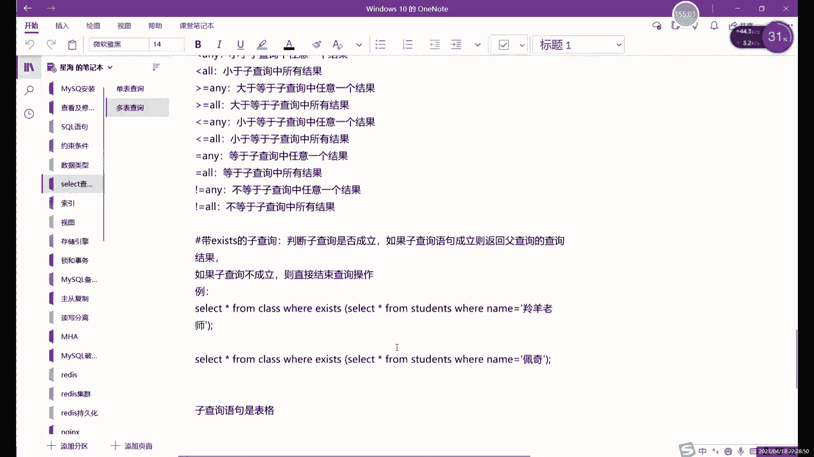

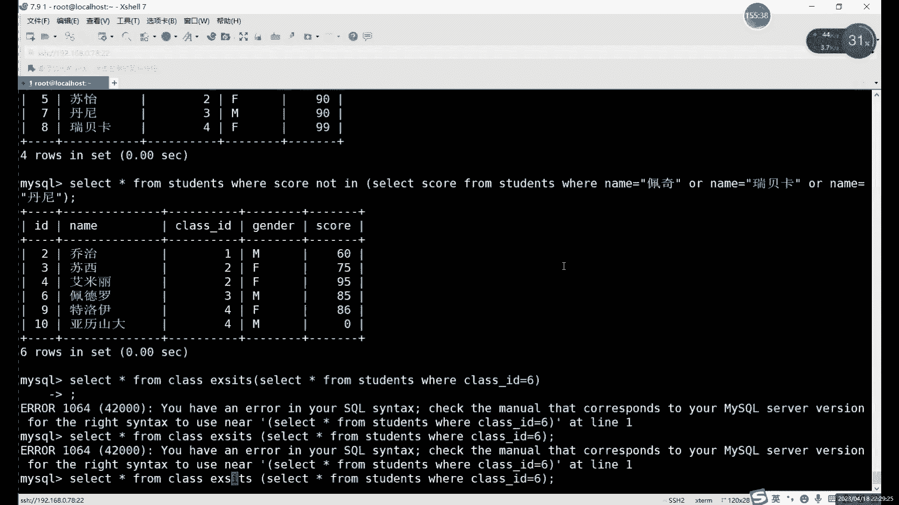

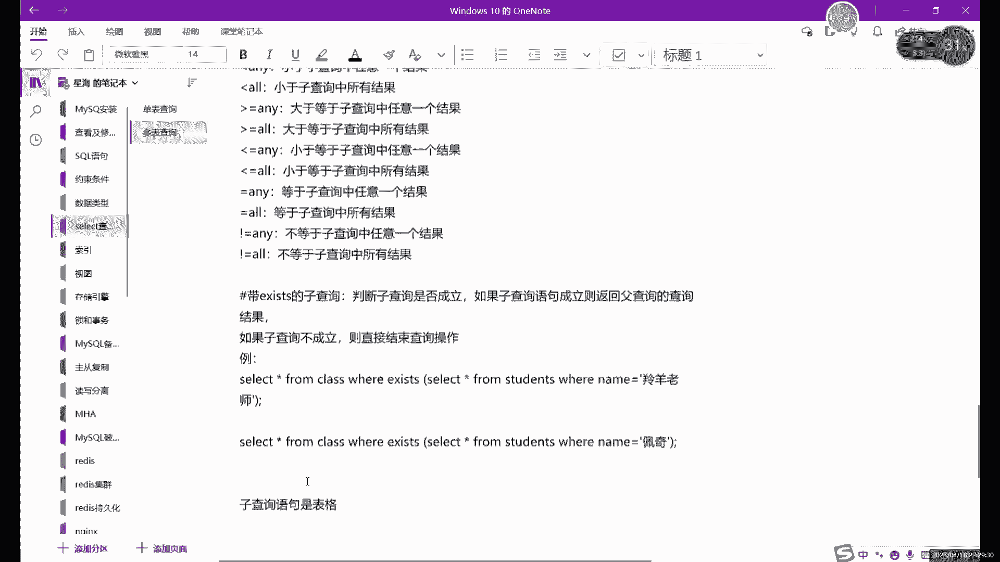

本节课我们一起深入学习了`SELECT`单表查询的完整结构和嵌套查询的灵活应用。

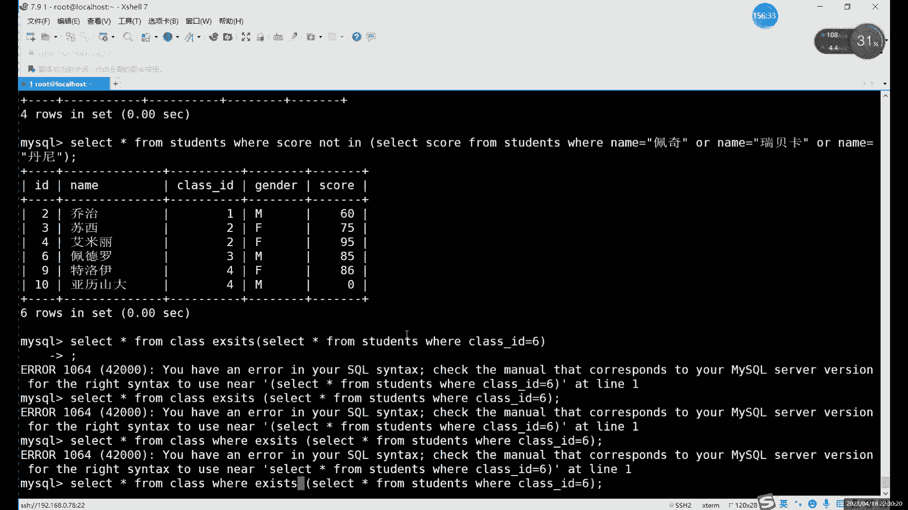

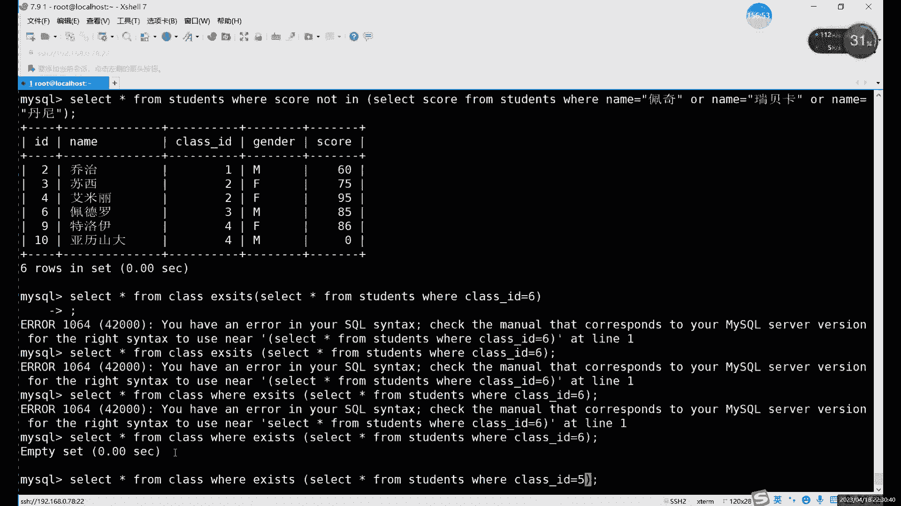

我们首先回顾了`SELECT`语句的核心子句：`SELECT`指定字段，`FROM`指定表，`WHERE`进行初步过滤，`GROUP BY`和`ORDER BY`进行二次处理，`HAVING`对分组结果进行再过滤。

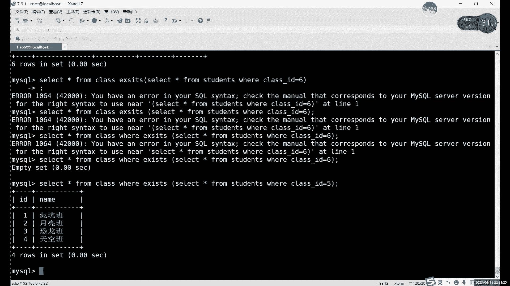

随后，我们重点攻克了**嵌套查询**。掌握了两种主要形式：
1.  将子查询结果作为**条件**，用在`WHERE`或`HAVING`中，常与`IN`、`ANY`、`ALL`等运算符结合。
2.  将子查询结果作为**临时表**，用在`FROM`中，**必须为其指定别名**。

我们还了解了特殊的`EXISTS`判断查询。嵌套查询是处理复杂数据检索的强大工具，当单个查询语句无法满足需求时，通过将查询逻辑拆分并嵌套，可以优雅地解决难题。

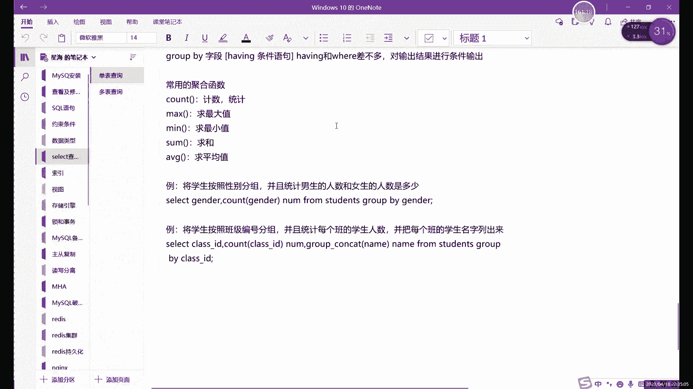

下一节课，我们将进入**多表查询**的学习，探索如何从多个相互关联的表中联合提取数据。