# MySQL数据库管理：P79：中级运维-18.事务，锁，备份 📚

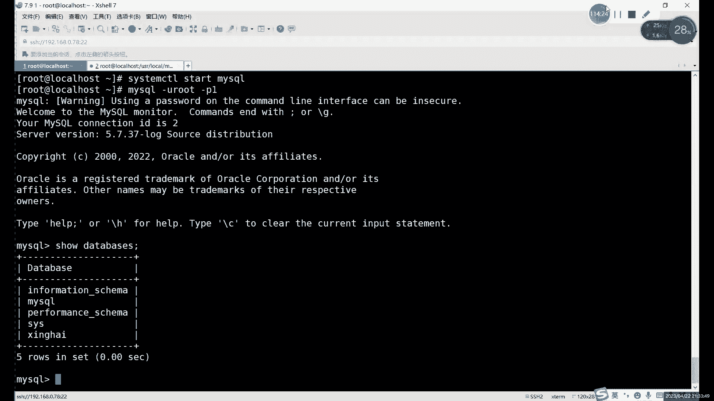

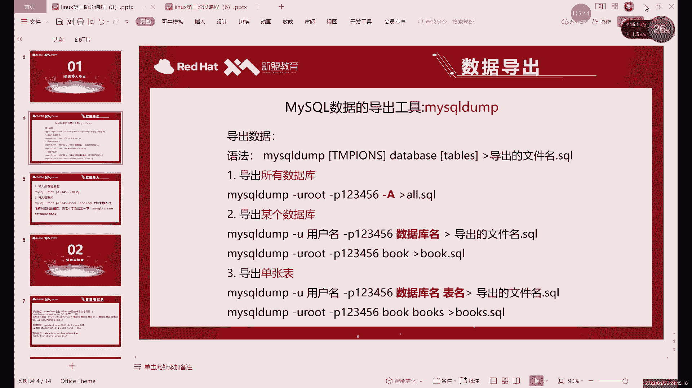

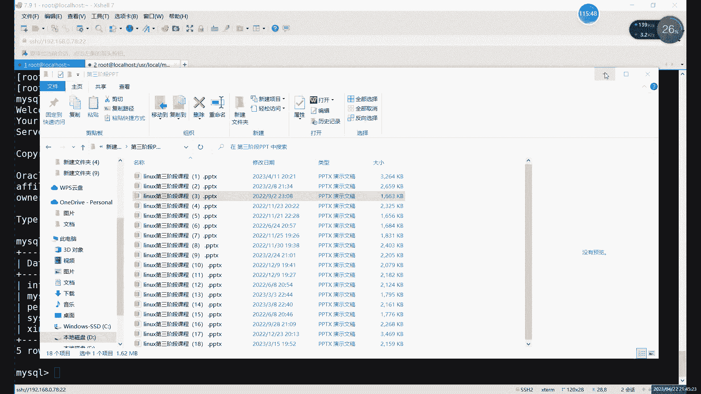

## 概述
在本节课中，我们将学习MySQL数据库的逻辑备份与恢复。我们将重点掌握使用 `mysqldump` 命令进行数据导出（备份），以及使用 `mysql` 和 `source` 命令进行数据导入（恢复）的方法和注意事项。

---

## 逻辑备份与 `mysqldump` 命令

上一节我们介绍了物理备份，本节中我们来看看逻辑备份。逻辑备份的核心工具是 `mysqldump` 命令，它是MySQL数据库自带的导入导出工具，主要用于数据的导出操作。

`mysqldump` 命令执行的是逻辑备份，其本质是将数据库中的结构和数据转换为一系列的SQL语句（主要是 `CREATE` 和 `INSERT` 语句）并保存到文件中。这个过程类似于备份，而将文件内容重新执行一遍就是恢复。

### `mysqldump` 的基本用法

以下是 `mysqldump` 命令的几种常见用法：

**1. 备份所有数据库**
这是最简单的用法，使用 `-A` 或 `--all-databases` 选项。
```bash
mysqldump -uroot -p密码 -A > 备份文件名.sql
```

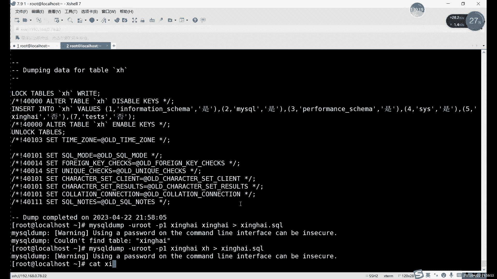

**2. 备份单个数据库**
直接在命令后指定数据库名称即可。
```bash
mysqldump -uroot -p密码 数据库名 > 备份文件名.sql
```

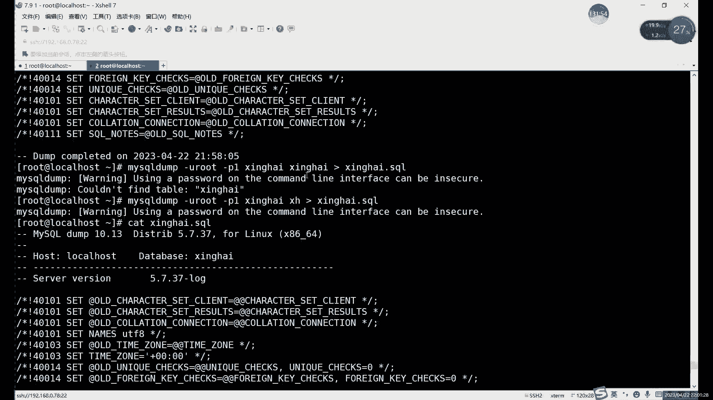

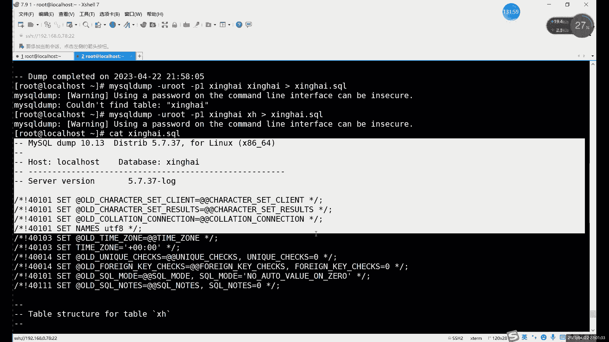

**3. 备份单张数据表**
通过 `数据库名 表名` 的格式指定要备份的表。
```bash
mysqldump -uroot -p密码 数据库名 表名 > 备份文件名.sql
```

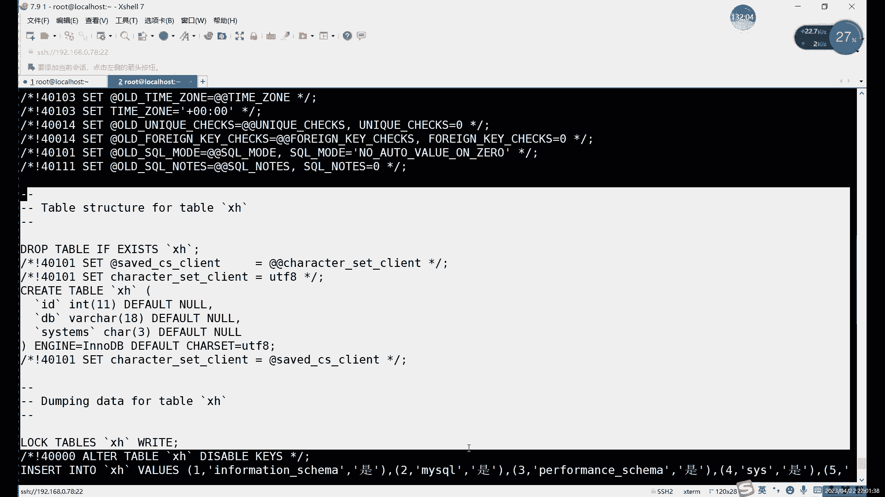

**4. 仅备份表结构**
使用 `-d` 选项，导出的文件只包含 `CREATE TABLE` 语句，不包含数据。
```bash
mysqldump -uroot -p密码 -d 数据库名 > 仅结构备份.sql
```

**5. 仅备份数据**
使用 `-t` 选项，导出的文件只包含 `INSERT` 语句，不包含表结构。
```bash
mysqldump -uroot -p密码 -t 数据库名 > 仅数据备份.sql
```

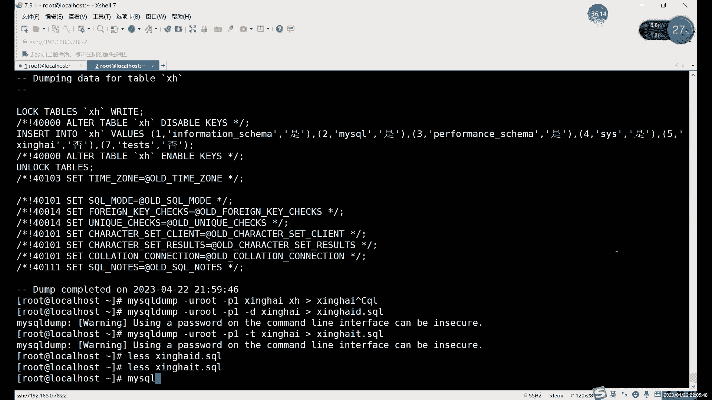


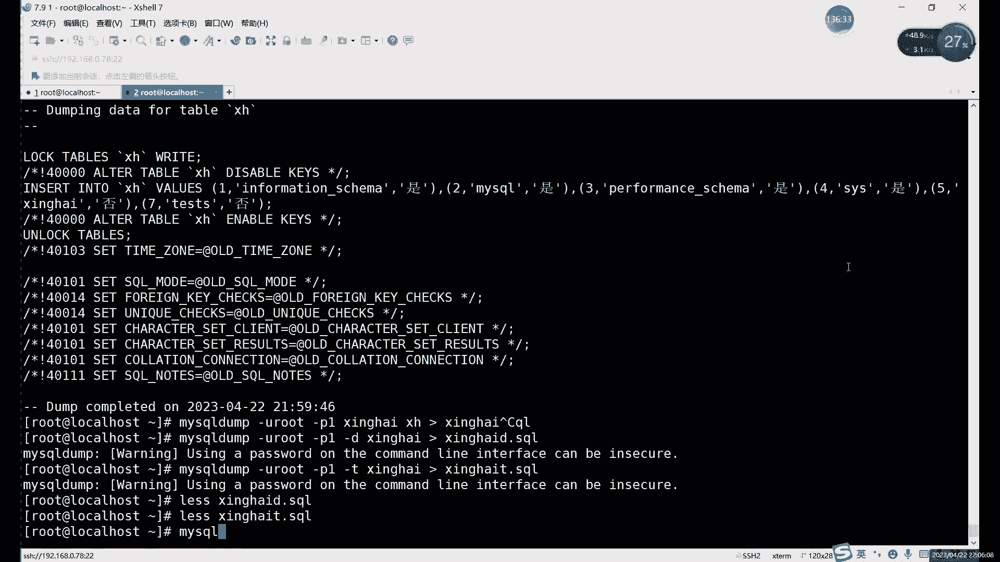

### 备份文件内容解析
使用 `mysqldump` 导出的文件是一个文本文件，可以直接查看。其内容主要由以下几类SQL命令构成：
*   `DROP TABLE IF EXISTS`：在创建表之前，先删除已存在的同名表，这是为了避免恢复时因表已存在而报错。
*   `CREATE TABLE`：创建表结构的语句。
*   `INSERT INTO`：插入数据的语句。

这种“先删除、再创建、后插入”的顺序，保证了恢复过程的顺利进行。需要注意的是，备份文件中**不会**包含 `UPDATE` 或 `ALTER` 等修改性语句，因为最新的数据状态已经通过 `INSERT` 语句体现了。


---

## 逻辑恢复的两种方法

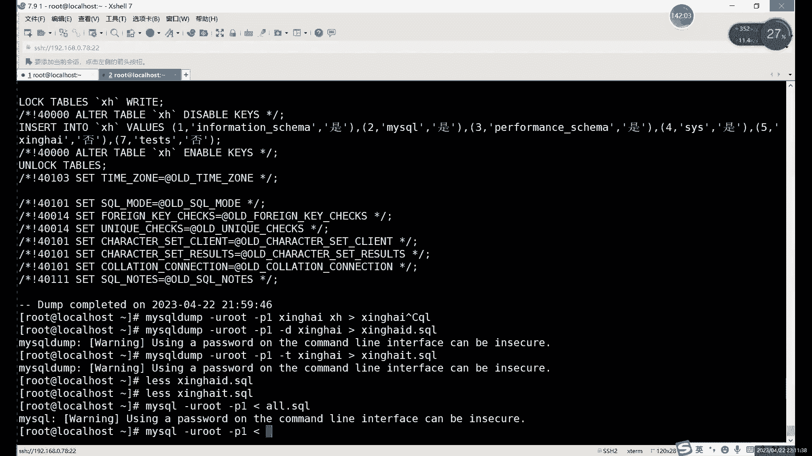

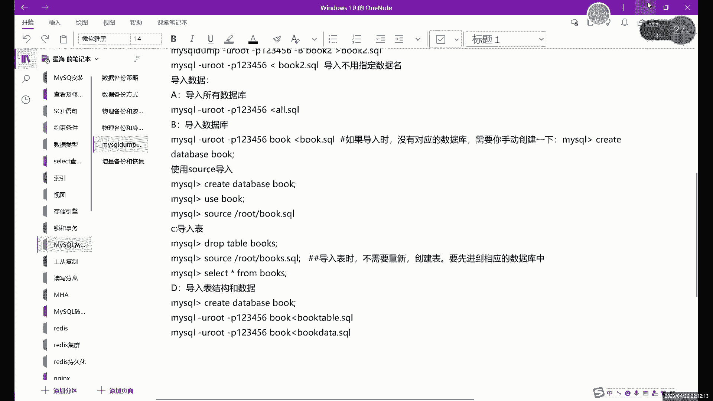

备份完成后，当需要还原数据时，就需要进行逻辑恢复。恢复的本质是执行备份文件中的SQL语句。主要有两种方法。

### 方法一：使用 `mysql` 命令在命令行恢复
这种方法直接在操作系统命令行中执行，适用于恢复整个备份文件或单个数据库的备份。

**恢复所有数据库或单个数据库备份**
```bash
mysql -uroot -p密码 < 备份文件名.sql
```
**重要提示**：在恢复**单个数据库**的备份文件时，**必须**提前在MySQL中创建好该数据库，否则恢复过程会因找不到目标数据库而失败。
```sql
-- 首先，登录MySQL并创建数据库
CREATE DATABASE 数据库名;
```
```bash
-- 然后，在命令行执行恢复
mysql -uroot -p密码 数据库名 < 备份文件名.sql
```
恢复单个表则无需此操作，因为备份文件中已包含删除和创建表的语句。

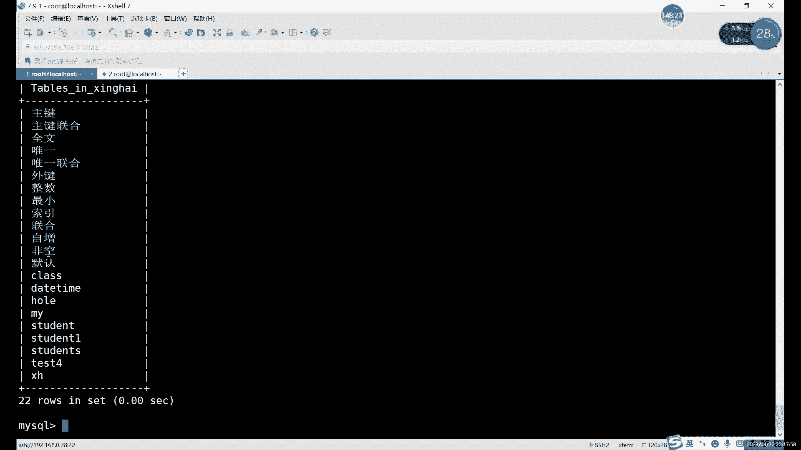

### 方法二：使用 `source` 命令在MySQL客户端内恢复
这种方法需要先登录到MySQL客户端，然后在 `mysql>` 提示符下执行。


**恢复步骤**：
1.  登录MySQL客户端。
    ```bash
    mysql -uroot -p
    ```
2.  选择（`USE`）要恢复数据的目标数据库。如果要恢复的是整个库的备份，也需要先创建并切换到该库。
    ```sql
    CREATE DATABASE 数据库名;
    USE 数据库名;
    ```
3.  执行 `source` 命令，后面跟上备份文件的**绝对路径**。
    ```sql
    SOURCE /path/to/备份文件.sql;
    ```

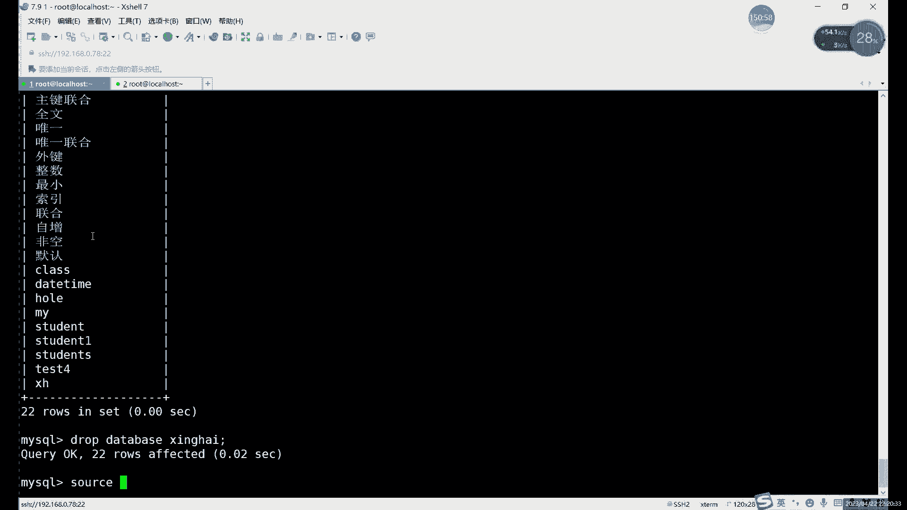


### 关于热备份的说明
无论是使用 `mysqldump` 备份还是使用 `mysql`/`source` 恢复，都需要数据库服务处于**运行状态**，因为整个过程都需要连接和操作数据库。因此，逻辑备份属于**热备份**的范畴。这与直接复制数据文件的物理冷备份有本质区别。

---

## 增量备份简介

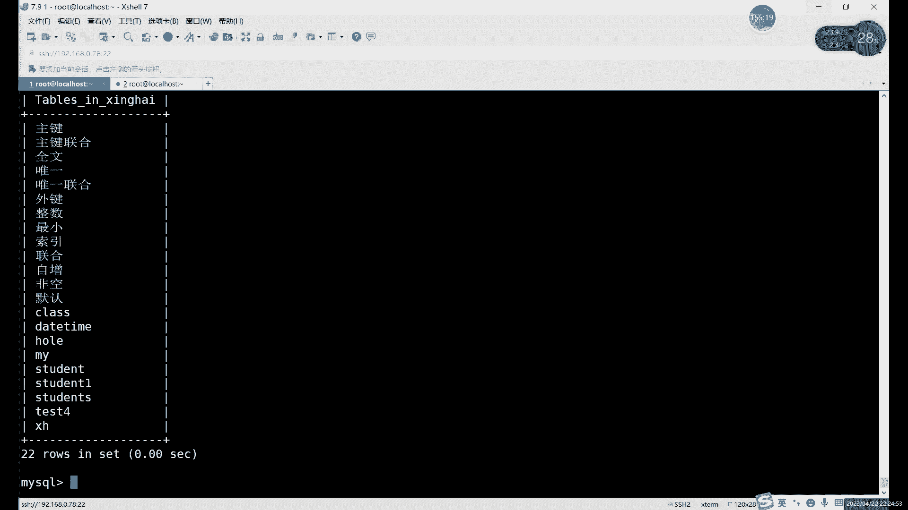


全量备份会备份所有数据，当数据量很大时，每次备份耗时较长。增量备份则只备份自上次备份以来发生变化的数据，具有备份速度快、数据量小的优点。

MySQL本身没有直接的增量备份命令，但可以通过**二进制日志（Binary Log）** 来实现增量备份的功能。二进制日志记录了所有对数据库的更改操作（`INSERT`, `UPDATE`, `DELETE`, `CREATE` 等，除了查询）。因此，定期备份二进制日志文件，就相当于拥有了数据库的“变更记录”。

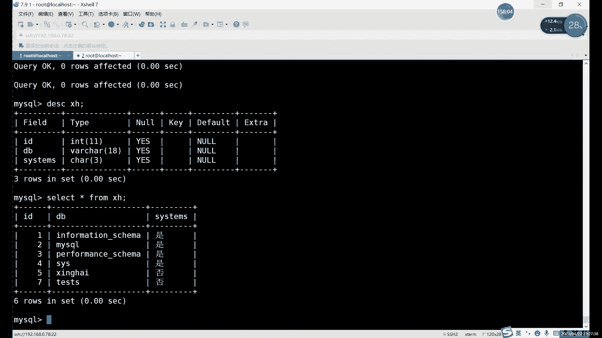


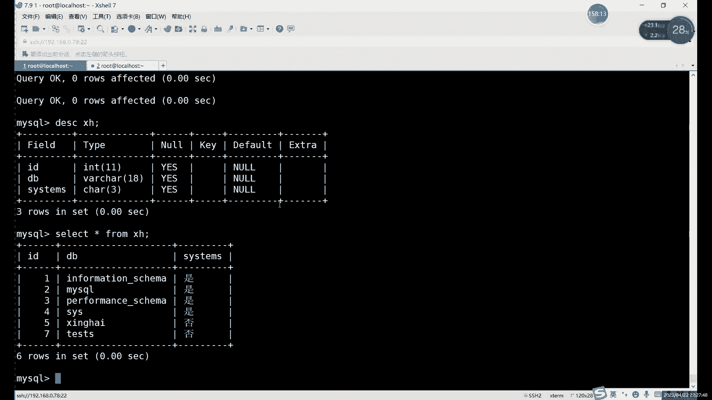


恢复时，需要先恢复最近一次的全量备份，然后按顺序重放（执行）后续的增量备份（二进制日志），从而将数据库恢复到最新的状态。增量备份的恢复过程比全量备份复杂，我们将在下节课详细讲解。

---

## 总结

本节课中我们一起学习了MySQL的逻辑备份与恢复。
*   我们掌握了使用 **`mysqldump`** 命令进行全量逻辑备份的多种方式，包括备份所有库、单个库、单张表，以及单独备份结构或数据。
*   我们学习了两种逻辑恢复方法：在命令行使用 **`mysql`** 命令和在MySQL客户端内使用 **`source`** 命令，并特别注意了恢复单库备份前需要创建数据库的细节。
*   我们了解到逻辑备份属于热备份，需要数据库服务在线。
*   最后，我们简单介绍了基于二进制日志的**增量备份**概念，为下节课的内容做了铺垫。

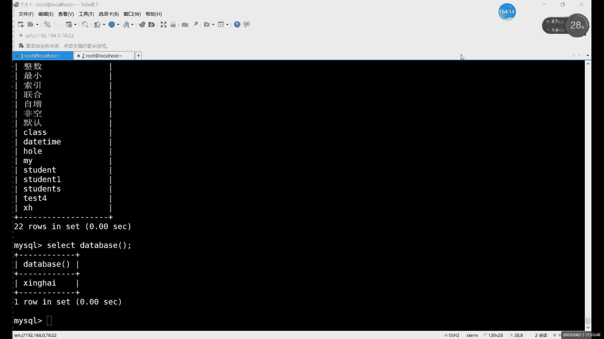

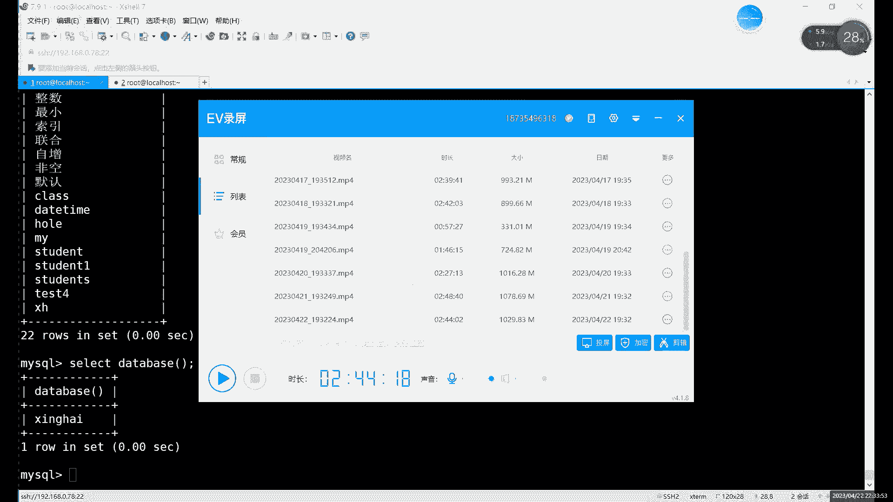

通过掌握这些备份与恢复技能，你可以有效地保护MySQL数据库中的数据安全，应对数据丢失或损坏的风险。