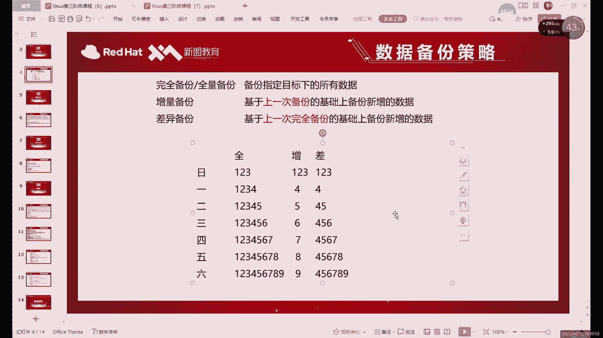
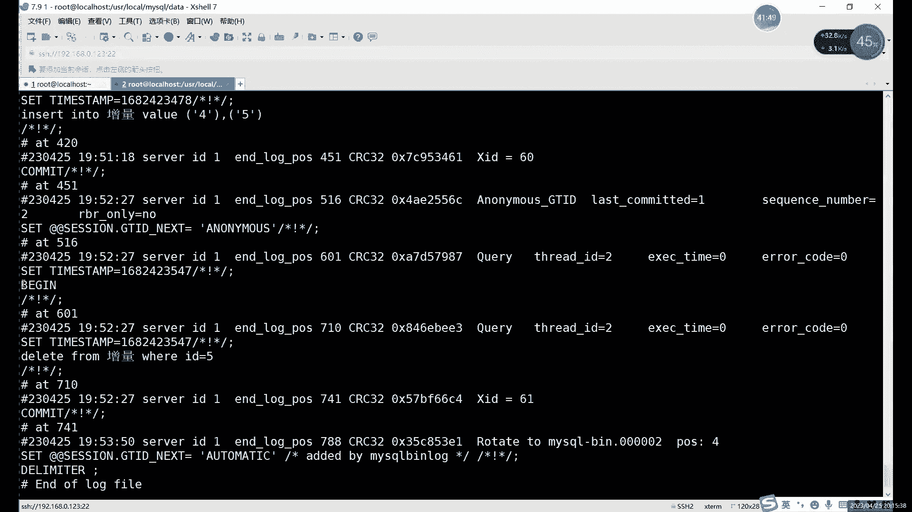
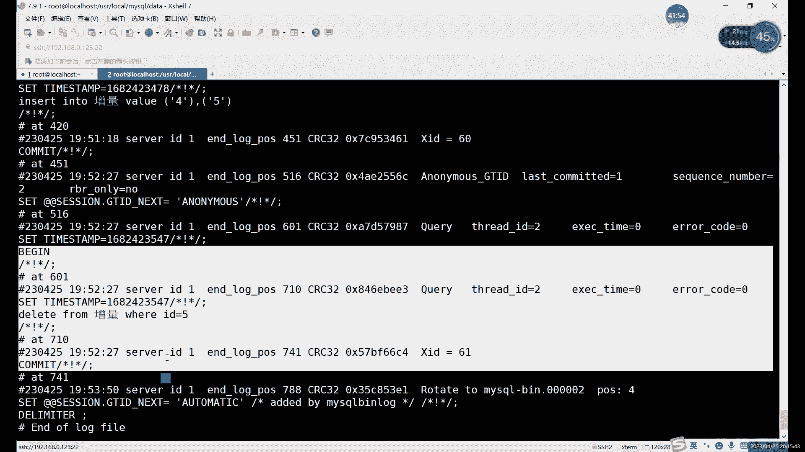
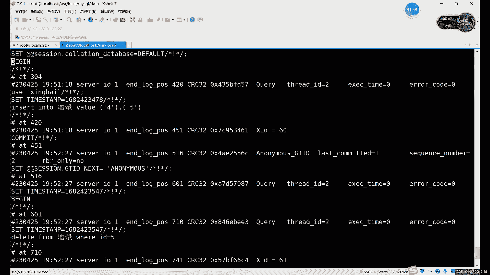
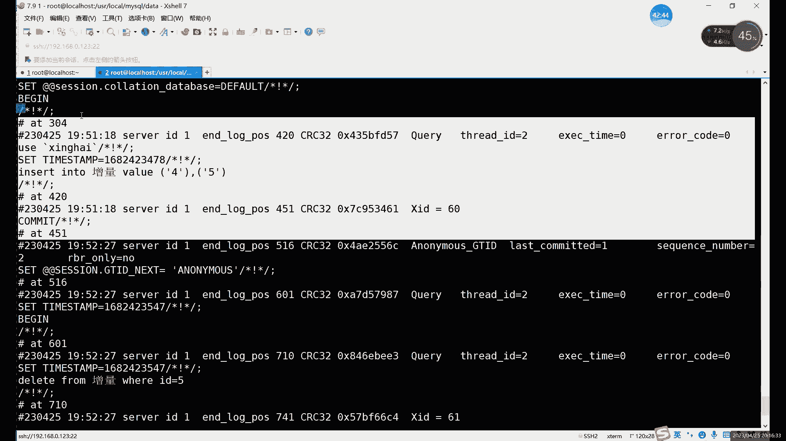
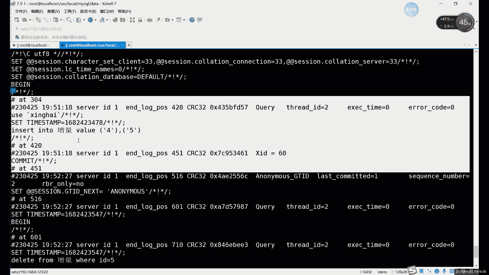
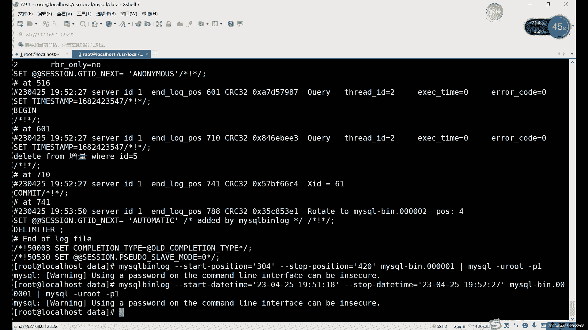

# Linux运维教程：P80：中级运维-19.增量备份，主从复制 📊


在本节课中，我们将要学习MySQL数据库备份策略中非常重要的一环——增量备份。我们将了解什么是增量备份，为什么它比全量备份和差异备份更高效，以及如何利用MySQL的二进制日志来实现增量备份与恢复。

## 概述



备份是数据库管理中的核心任务。之前我们已经介绍了物理备份和逻辑备份等备份方式。本节中，我们来看看一种基于数据变化量的备份策略：增量备份。增量备份的核心思想是只备份自上次备份以来发生变化的数据，从而极大地减少备份所需的时间和存储空间。

## 增量备份的概念与优势

上一节我们介绍了备份的不同方式，本节中我们来看看备份数据量的分类：全量备份、差异备份和增量备份。

增量备份在所有备份方式中备份的数据量是最少的。它只备份自上次备份（无论是全量还是增量）之后新增或修改的数据。随着时间推移，数据库数据会不断增长。如果每天进行全量备份或差异备份，备份文件会变得越来越大，占用大量存储空间。然而，备份数据在未发生故障时基本用不到。因此，备份操作本身（耗时、占空间）的成本应尽可能降低。

增量备份完美解决了这个问题。其标准做法是：
1.  **首先进行一次全量备份**。
2.  **后续的每次备份（例如每天一次）只备份新增或修改的数据**。

这样，所有增量备份文件的总和，加上最初的全量备份，就构成了完整的数据库数据。这种方法将备份数据量减少到了最低程度。

## 实现增量备份的关键：二进制日志 🗂️

在MySQL中，并没有一个直接叫做“增量备份”的工具。那么，如何准确地找到哪些数据是新增或修改的呢？答案就是利用 **二进制日志（Binary Log）**。

二进制日志是MySQL服务层的一种日志，它会记录所有对数据库数据进行修改的操作语句，例如：
*   `INSERT` (插入数据)
*   `UPDATE` (更新数据)
*   `DELETE` (删除数据)
*   `CREATE TABLE` (创建表，属于结构变更)

而像 `SELECT` 这类不修改数据的查询语句，则不会被记录。因此，二进制日志完整地保存了数据库的所有“变更历史”。

**增量备份，实质上就是备份并归档这些二进制日志文件。**

恢复时，我们需要先恢复最近的全量备份，然后按顺序应用（重放）备份期间产生的所有二进制日志，从而将数据库恢复到最新的状态。

## 实践：进行增量备份与恢复 🔧

以下是进行增量备份与恢复的完整步骤。

### 第一步：确保开启二进制日志

这是进行增量备份的前提。如果使用源码编译安装通常默认开启；如果使用YUM或RPM安装，可能需要手动在MySQL配置文件（如 `/etc/my.cnf` 或 `/etc/mysql/my.cnf`）中开启。

在配置文件的 `[mysqld]` 部分添加或确认以下配置：
```ini
[mysqld]
log-bin=mysql-bin  # 启用二进制日志，日志文件将以 `mysql-bin` 为前缀
server-id=1        # 为主从复制准备，服务器唯一ID
```
修改配置后，需要重启MySQL服务使配置生效。

### 第二步：进行首次全量备份

在进行任何增量备份之前，必须先有一个完整的基准，即全量备份。我们可以针对单个数据库、单张表或整个实例进行备份。

例如，我们为 `test_db` 数据库中的 `incremental_tbl` 表做一次逻辑全量备份：
```bash
mysqldump -u root -p test_db incremental_tbl > /backup/full_backup.sql
```
这就得到了我们的基础备份文件 `full_backup.sql`。

### 第三步：模拟数据变更并备份二进制日志

1.  在全量备份之后，我们对数据库进行一些操作：
    ```sql
    USE test_db;
    INSERT INTO incremental_tbl VALUES (4), (5); -- 插入新数据
    DELETE FROM incremental_tbl WHERE id = 5;     -- 删除一条数据
    ```
2.  此时，这些 `INSERT` 和 `DELETE` 操作已经被记录到当前的二进制日志文件（例如 `mysql-bin.000001`）中。
3.  执行 `FLUSH LOGS` 命令。这个命令会关闭当前的二进制日志文件，并创建一个新的日志文件（例如 `mysql-bin.000002`）。之后的所有新操作将记录到新文件中。
    ```sql
    FLUSH LOGS;
    ```
4.  现在，文件 `mysql-bin.000001` 就包含了从全量备份后到执行 `FLUSH LOGS` 命令之间的所有数据变更。**这个文件就是我们的第一次增量备份。** 我们可以将它复制到安全的备份位置。
    ```bash
    cp /var/lib/mysql/mysql-bin.000001 /backup/inc_backup_1.binlog
    ```

**自动化提示**：在实际生产环境中，可以通过 `crontab` 设置定时任务，定期执行 `FLUSH LOGS` 并备份旧的二进制日志文件，从而实现自动化的增量备份。

### 第四步：模拟故障并恢复数据

现在，假设 `incremental_tbl` 表被意外删除，我们需要进行恢复。

1.  **关闭二进制日志（重要！）**：在恢复期间，为了避免恢复操作本身被记录到二进制日志中，造成日志空间浪费或循环，建议临时关闭二进制日志。
    ```sql
    SET sql_log_bin = 0; -- 在当前会话中临时禁用二进制日志记录
    ```

2.  **恢复全量备份**：首先，将数据库恢复到做全量备份时的状态。
    ```bash
    mysql -u root -p test_db < /backup/full_backup.sql
    ```
    或者，在MySQL客户端内执行：
    ```sql
    USE test_db;
    SOURCE /backup/full_backup.sql;
    ```

3.  **恢复增量备份**：接下来，按顺序应用增量备份（二进制日志文件）。由于二进制日志是特殊格式，需要使用 `mysqlbinlog` 工具将其转换为SQL语句再执行。
    ```bash
    mysqlbinlog /backup/inc_backup_1.binlog | mysql -u root -p test_db
    ```
    这条命令将 `inc_backup_1.binlog` 文件中的内容“重放”到 `test_db` 数据库中。

4.  **重新开启二进制日志**：恢复完成后，重新开启二进制日志记录。
    ```sql
    SET sql_log_bin = 1;
    ```

现在，检查 `incremental_tbl` 表，数据应该已经恢复到了执行 `DELETE` 语句之后的状态（即包含id为1,2,3,4的数据）。

## 高级技巧：基于位置或时间的定点恢复 🎯





有时我们可能不需要恢复整个二进制日志文件，而是想恢复到某个误操作之前的状态，或者跳过某些错误语句。`mysqlbinlog` 工具支持基于事件位置或时间的定点恢复。





首先，查看二进制日志内容以确定位置或时间点：
```bash
mysqlbinlog --base64-output=decode-rows -v /backup/inc_backup_1.binlog | less
```
在输出中，每个事件都有唯一的 `# at 数字`（位置，Position）和 `timestamp=数字`（时间戳）。



*   **基于位置恢复**：恢复从位置 `304` 到 `420` 之间的所有事件。
    ```bash
    mysqlbinlog --start-position=304 --stop-position=420 /backup/inc_backup_1.binlog | mysql -u root -p test_db
    ```

*   **基于时间恢复**：恢复从 `2023-10-27 10:18:00` 到 `2023-10-27 10:27:00` 之间的所有事件。
    ```bash
    mysqlbinlog --start-datetime="2023-10-27 10:18:00" --stop-datetime="2023-10-27 10:27:00" /backup/inc_backup_1.binlog | mysql -u root -p test_db
    ```

**注意**：基于时间的恢复可能不够精确，因为同一秒内可能发生多个事件。因此，**更推荐使用基于位置的恢复**。

## 总结



本节课中我们一起学习了MySQL增量备份的核心知识。我们了解到增量备份是一种高效节省空间的备份策略，它依赖于MySQL的二进制日志功能。实现增量备份的流程可以总结为：**开启二进制日志 -> 进行全量备份 -> 定期刷新并备份二进制日志文件**。恢复时则是逆向过程：**临时关闭二进制日志 -> 恢复全量备份 -> 按顺序应用二进制日志 -> 重新开启二进制日志**。此外，我们还掌握了使用 `mysqlbinlog` 工具进行更灵活的定点恢复的方法。掌握增量备份，是构建可靠、高效数据库备份方案的关键一步。