# Linux运维教程：P81：中级运维-20.增量备份与主从复制 🚀

在本节课中，我们将学习MySQL数据库的增量备份恢复方法，并深入探讨主从复制的原理与配置步骤。这是构建高可用数据库环境的基础技能。

## 增量备份的恢复方法 🔄

上一节我们介绍了增量备份，本节中我们来看看如何从二进制日志中恢复数据。

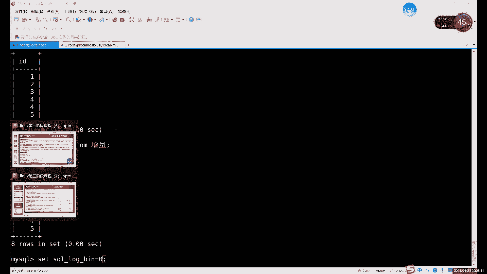

恢复增量备份的核心命令是 `mysqlbinlog`。它可以读取二进制日志文件，并允许我们指定恢复的时间范围或日志位置。

### 指定恢复范围

`mysqlbinlog` 命令可以通过 `--start-datetime` 和 `--stop-datetime` 参数来指定一个时间范围，恢复该时间段内执行的所有SQL命令。

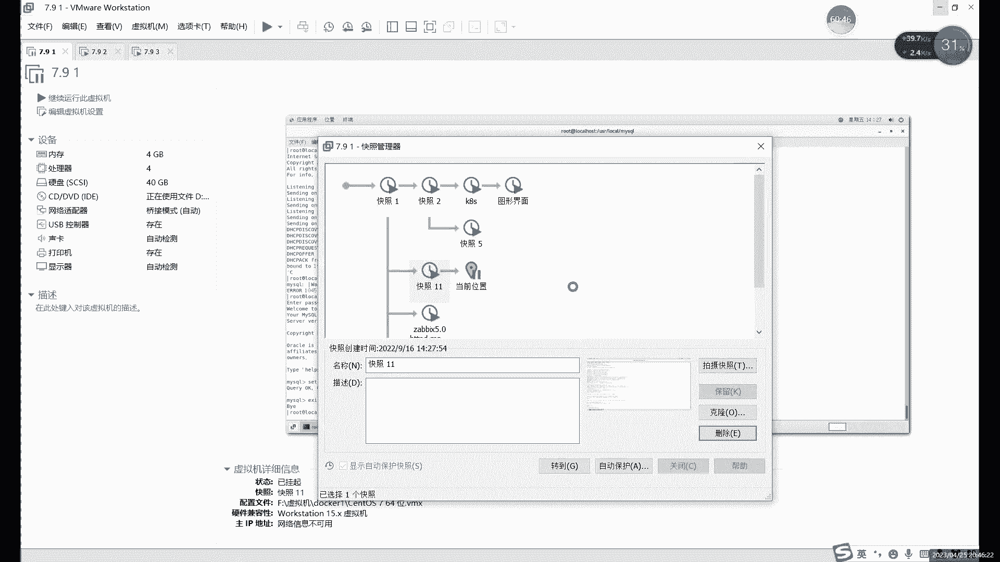

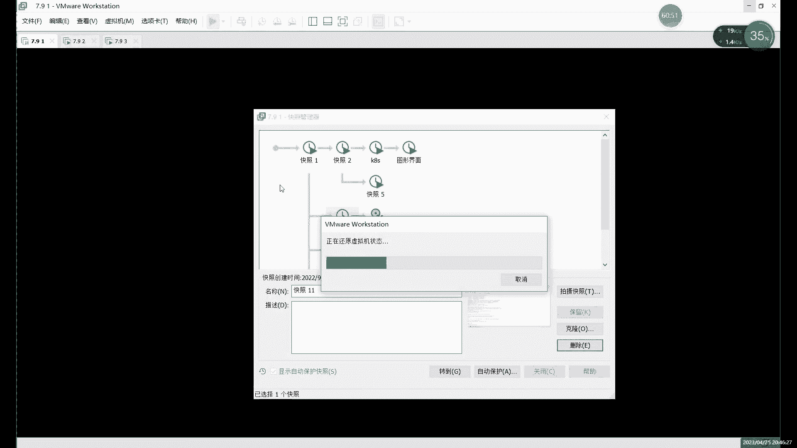

**代码示例：恢复指定时间段的命令**
```bash
mysqlbinlog --start-datetime="2023-10-27 10:18:00" --stop-datetime="2023-10-27 10:27:00" mysql-bin.000002 | mysql -uroot -p
```
这个时间段内执行的所有命令都会被恢复。

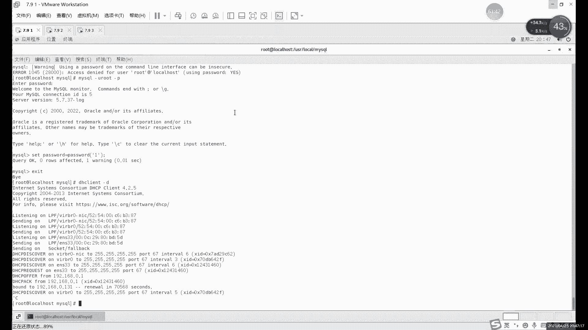

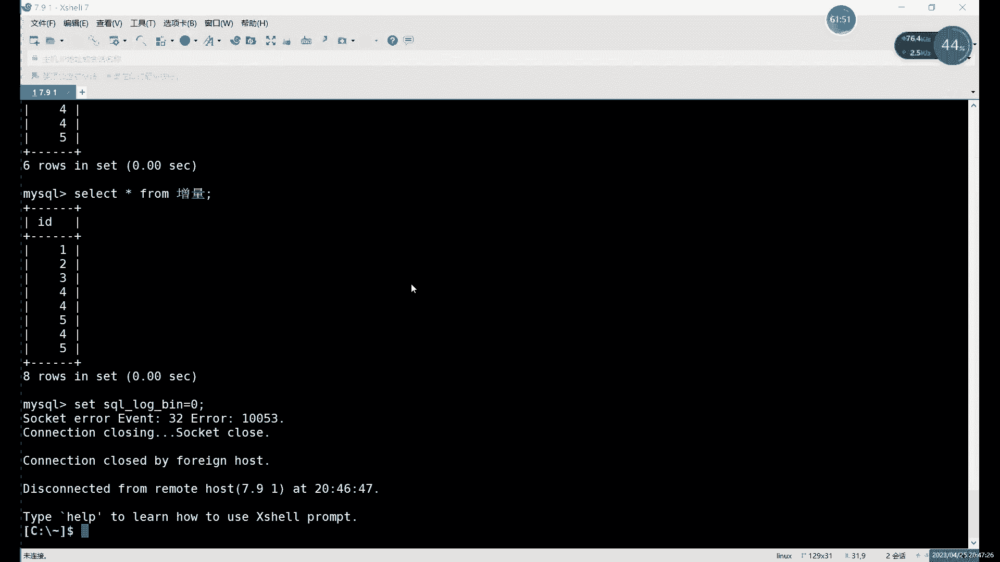

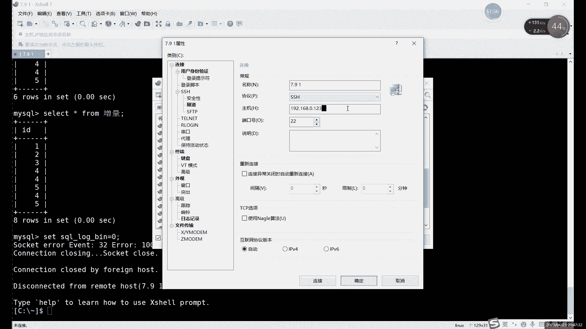

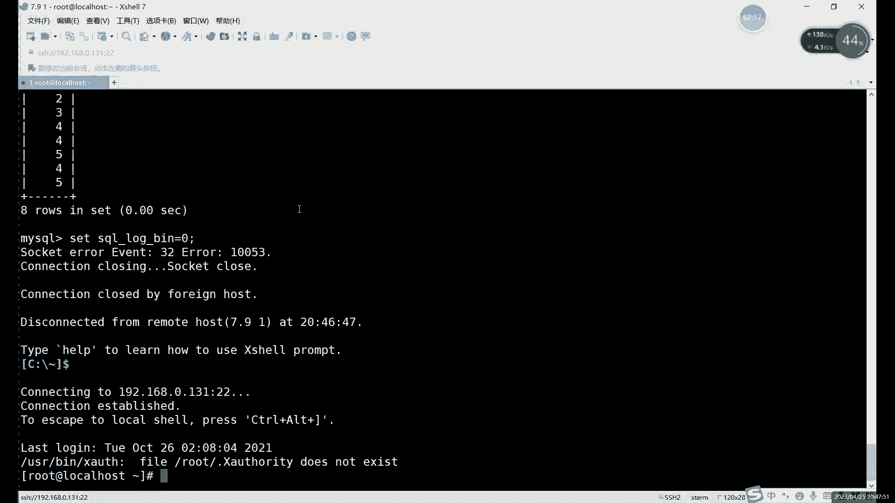

除了时间点，更精确的方法是使用日志位置（Position）。通过 `--start-position` 和 `--stop-position` 参数，可以精确定位到某一条命令。

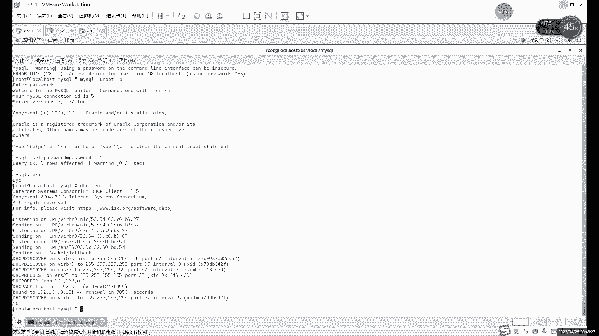

**关于位置参数的说明：**
*   可以同时指定开始和结束位置，以恢复中间的一小段数据。
*   如果只指定开始位置 (`--start-position`)，则会从该位置一直恢复到日志文件结束。
*   如果只指定结束位置 (`--stop-position`)，则会从日志开头恢复到该位置。

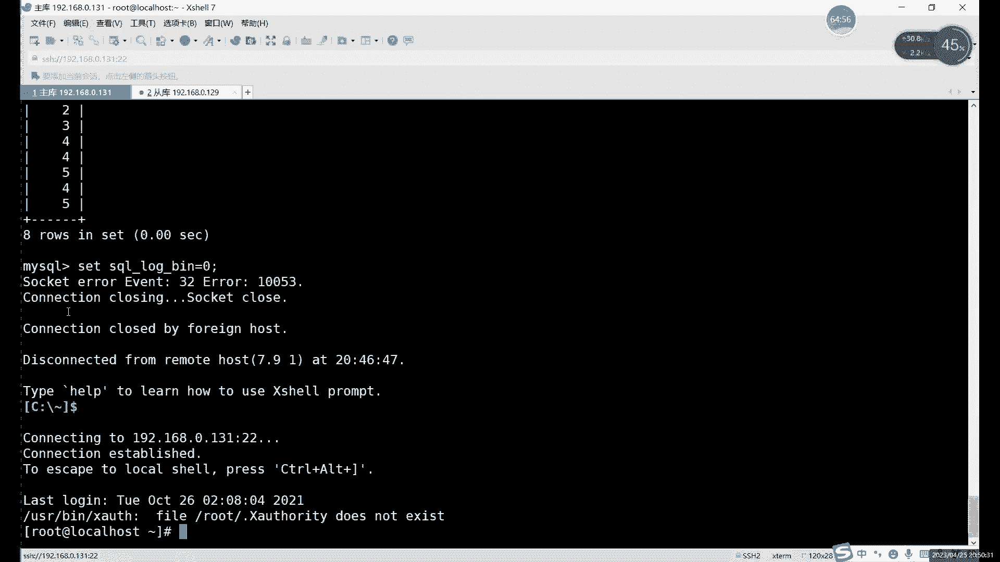

### 恢复操作的注意事项

以下是执行恢复时需要牢记的几个关键点：

1.  **顺序至关重要**：如果需要恢复多个增量备份文件（即多个二进制日志文件），必须严格按照备份生成的顺序来执行恢复。顺序错误可能导致数据逻辑错误，例如先执行了删除操作，后执行插入操作，相当于数据未被真正恢复。
2.  **时间 vs 位置**：在业务高峰期，数据库可能在同一秒内执行大量命令。使用时间点恢复无法精确到某一条命令，因此**强烈建议使用位置（Position）进行恢复**，它能实现精确定位。
3.  **恢复后的操作**：数据恢复完成后，**务必记得重新开启二进制日志记录功能**。如果忘记开启，后续的数据变更将无法被记录，影响后续的备份。
4.  **恢复场景**：
    *   **服务器故障**：需要先恢复最近的全量备份，然后按顺序恢复之后的所有增量备份。
    *   **误操作恢复**：通常只需恢复一部分数据。除了使用 `mysqlbinlog`，也可以直接从日志中复制出误操作前的正确SQL语句，手动执行。
5.  **备份周期**：不建议长期只做增量备份。通常的实践是每周或每两周做一次全量备份，然后每天做增量备份。这样即使需要恢复，也只需要处理少量增量文件，降低复杂度和出错风险。
6.  **自动化**：增量备份和恢复可以通过Shell脚本结合计划任务（如crontab）来自动化执行。

---

## 主从复制原理与配置 🏗️

掌握了备份恢复后，我们来看看如何实现数据库的自动同步——主从复制。它同样是基于二进制日志实现的。

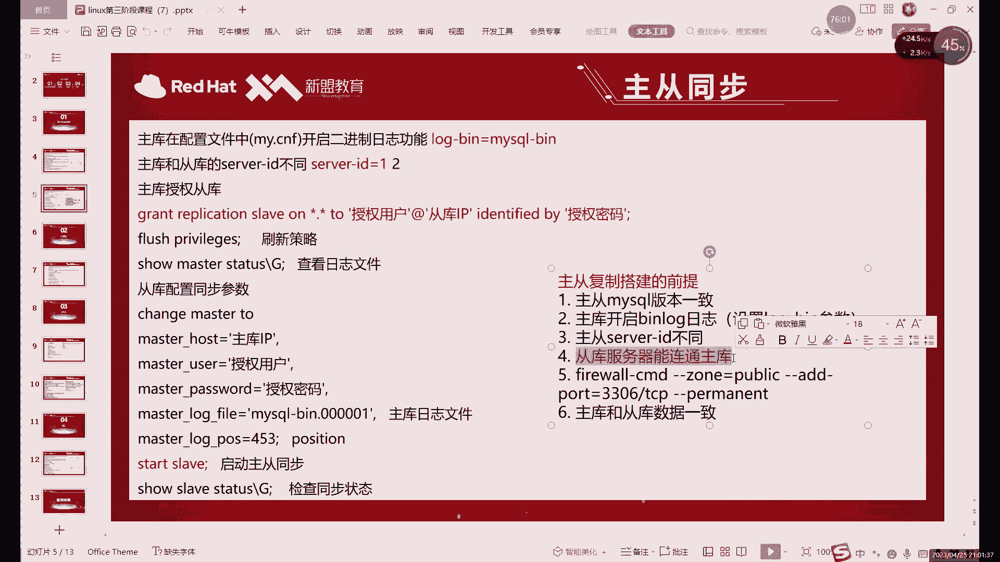

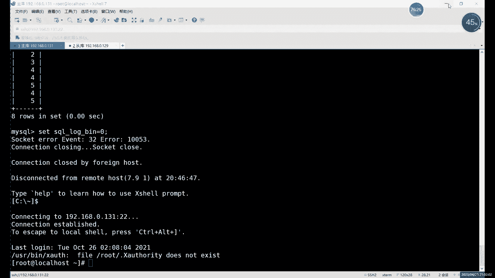

### 主从复制原理

一句话概括主从复制的原理：**基于二进制日志（Binary Log）**。

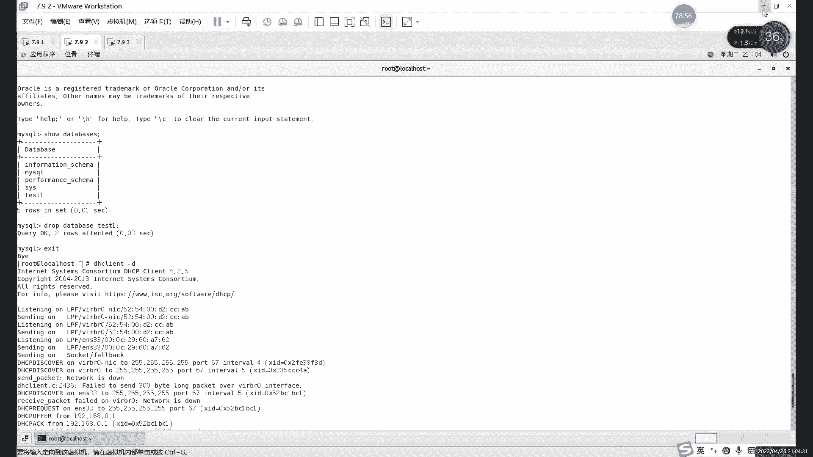

详细过程可分为三步：
1.  **主库（Master）** 将数据的所有变更（增、删、改）操作记录到自己的二进制日志中。
2.  **从库（Slave）** 的I/O线程会读取主库的二进制日志，并将其写入到从库本地的中继日志（Relay Log）中。
3.  **从库** 的SQL线程会读取中继日志中的事件，并在从库上重新执行这些SQL命令，从而使从库的数据与主库保持一致。

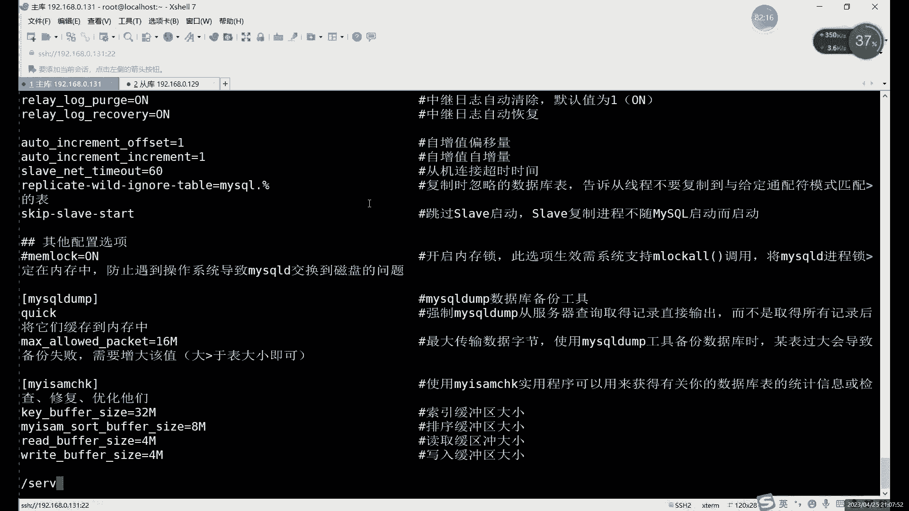

这个过程用到的核心机制是 **Replication**。

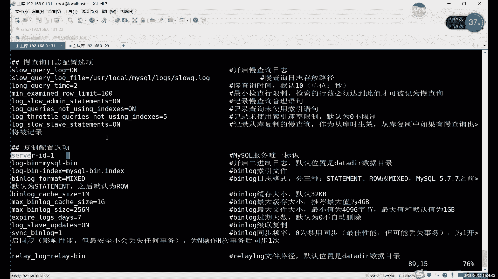

### 配置主从复制的前提条件

在开始配置前，必须确保满足以下所有条件，这是成功的关键：

1.  **版本一致**：主库和从库的MySQL大版本号必须一致。
2.  **数据一致**：开始配置主从同步前，主从库的数据（除了系统库`mysql`中的用户权限表）应保持一致。可通过备份恢复或恢复虚拟机快照实现。
3.  **开启二进制日志**：**主库必须开启**二进制日志功能，从库可以不开启。
4.  **唯一Server ID**：主从库的 `server-id` 配置项必须不同，且在同一集群内唯一。
5.  **网络连通与授权**：从库需要能通过网络连接访问主库。主库需要创建一个专门用于复制的用户，并授予 `REPLICATION SLAVE` 权限。
6.  **防火墙设置**：确保主库的3306端口对从库开放，或者直接关闭防火墙（仅建议在实验环境）。

### 主从复制配置步骤

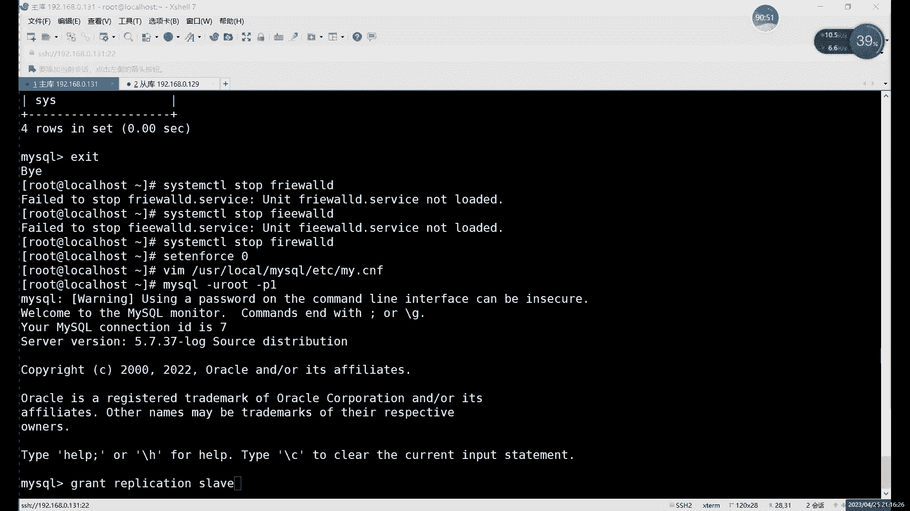

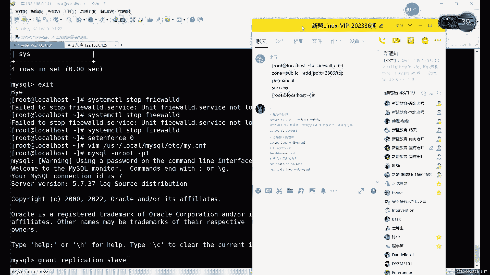

假设我们已有两台数据一致的MySQL服务器：主库（192.168.0.131）和从库（192.168.0.129）。

**第一步：在主库上创建复制用户并授权**
在主库执行以下命令，创建一个允许从库（129）来连接并复制数据的用户。
```sql
GRANT REPLICATION SLAVE ON *.* TO 'repl'@'192.168.0.129' IDENTIFIED BY '123456';
FLUSH PRIVILEGES;
```
> 提示：权限 `ALL PRIVILEGES` 包含 `REPLICATION SLAVE`，但为了安全，建议只授予必要权限。

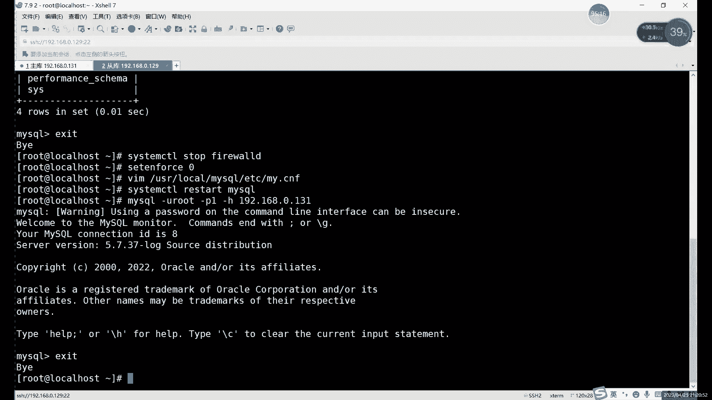

**第二步：查看并记录主库状态**
在主库执行以下命令，记录下 `File` 和 `Position` 的值，配置从库时会用到。
```sql
SHOW MASTER STATUS;
```
输出示例：
```
+------------------+----------+--------------+------------------+
| File             | Position | Binlog_Do_DB | Binlog_Ignore_DB |
+------------------+----------+--------------+------------------+
| mysql-bin.000002 |      693 |              |                  |
+------------------+----------+--------------+------------------+
```

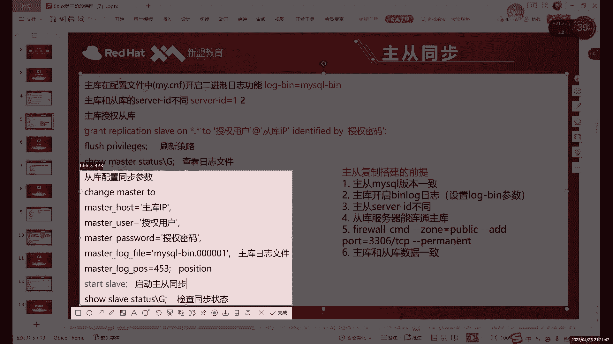

**第三步：在从库上配置并启动复制**
1.  连接到从库的MySQL。
2.  执行 `CHANGE MASTER TO` 命令，指向主库。
    ```sql
    CHANGE MASTER TO
    MASTER_HOST='192.168.0.131',
    MASTER_USER='repl',
    MASTER_PASSWORD='123456',
    MASTER_LOG_FILE='mysql-bin.000002',
    MASTER_LOG_POS=693;
    ```
    > **重要**：`MASTER_LOG_POS` 后的位置数字 **不能加引号**。
3.  启动从库的复制进程。
    ```sql
    START SLAVE;
    ```

**第四步：检查复制状态**
在从库执行以下命令，查看复制是否正常运行。
```sql
SHOW SLAVE STATUS\G
```
关键字段检查：
*   `Slave_IO_Running`: 应为 `Yes`
*   `Slave_SQL_Running`: 应为 `Yes`
*   `Last_IO_Error` 和 `Last_SQL_Error`: 应为空

如果两个状态都是 `Yes`，且没有错误信息，则主从复制基本配置成功。最可靠的验证方法是在主库上创建一个新数据库或表，观察从库是否自动同步。

### 关于一主多从

配置一主多从非常简单，只需在**主库**上为多个从库IP授权（或用 `%` 通配符），然后在每个从库上分别执行上述第三步的配置即可。确保每个从库的 `server-id` 都不同。

### 主从重启注意事项

*   **主库重启**：一般不影响，从库会尝试重连。
*   **从库重启**：MySQL服务重启后，复制进程 (`SLAVE`) 不会自动启动。需要重新连接到从库，执行 `START SLAVE;` 命令来启动复制。

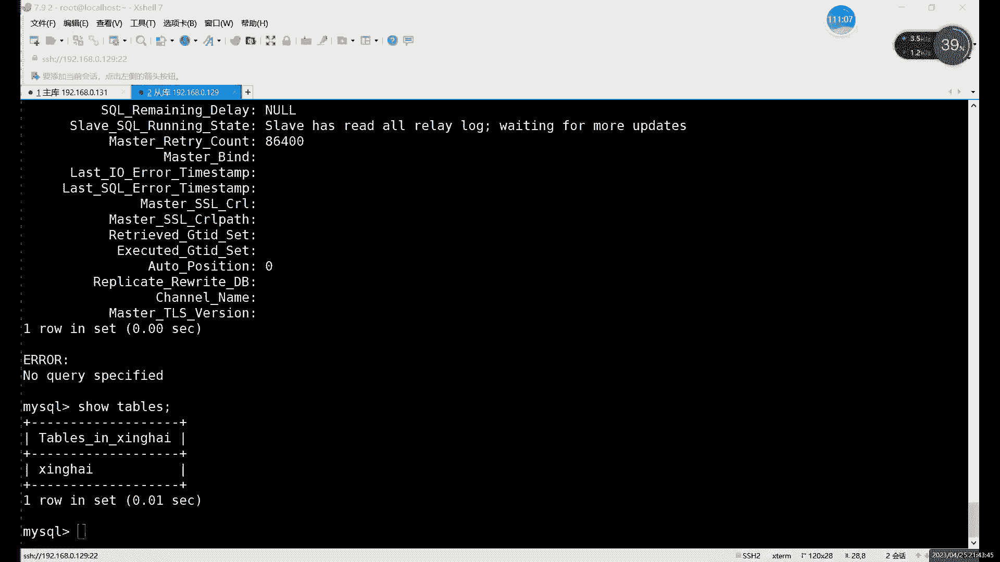

---

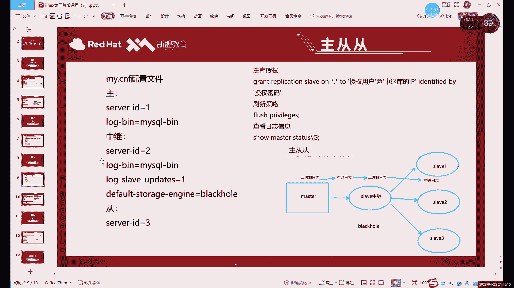

本节课中我们一起学习了MySQL增量备份的恢复方法，以及主从复制（Master-Slave Replication）的完整原理和配置流程。重点在于理解二进制日志的核心作用，掌握 `mysqlbinlog` 工具进行精确恢复，并严格按照步骤和前提条件来搭建主从环境，这是构建数据库高可用架构的基石。