# MySQL数据库管理：第27章：视图详解

在本节课中，我们将要学习MySQL中一个非常实用的功能——视图。视图可以看作是一个虚拟表，它基于SQL查询语句的结果集。我们将从视图的创建、使用、特点以及与普通表的区别等方面进行详细讲解，帮助你理解并掌握视图的应用。

## 视图的创建与基本使用

上一节我们介绍了数据库的基本操作，本节中我们来看看如何创建和使用视图。

首先，我们从一个简单的查询语句开始。例如，我们有一个`students`表，现在想筛选出性别为‘F’的学生，并按成绩排序。

```sql
SELECT * FROM students WHERE gender = 'F' ORDER BY score;
```

这个查询语句会返回一个结果集。如果我们希望将这个查询结果“保存”下来，以便后续频繁使用，就可以创建一个视图。

创建视图的语法如下：
```sql
CREATE VIEW view_name AS select_statement;
```

基于上面的查询，我们可以创建一个名为`student_view`的视图：
```sql
CREATE VIEW student_view AS SELECT * FROM students WHERE gender = 'F' ORDER BY score;
```

视图创建成功后，它并不在数据库中实际存储数据，而是存储了这条`SELECT`语句。之后，我们就可以像查询普通表一样查询这个视图：

```sql
SELECT * FROM student_view;
```

这样做的好处是，无论原始的`SELECT`语句有多长、多复杂，我们只需要记住视图的名字即可快速获取结果，极大地简化了操作。

## 视图与表的区别

上一节我们学会了如何创建和使用视图，本节中我们来深入探讨视图与普通数据库表的本质区别。

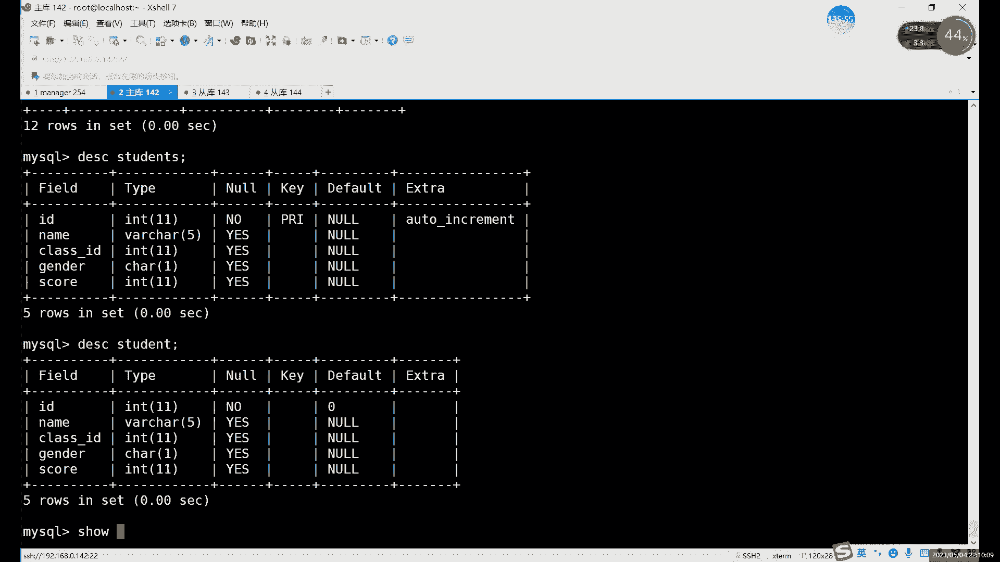

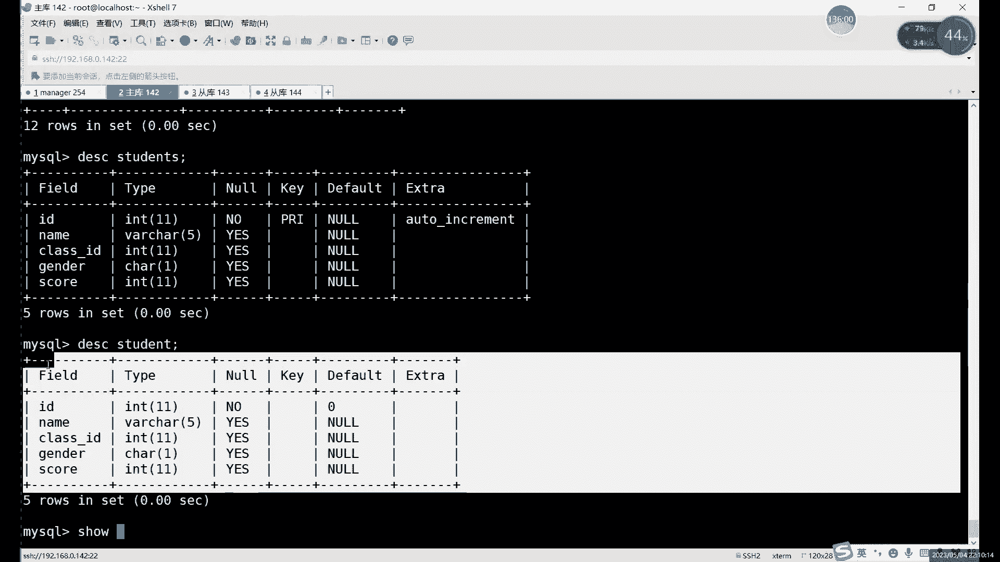

视图是一个虚拟表，它不直接存储数据，只存储定义它的SQL查询语句。而普通表（基本表）是真正存储数据的实体。以下是它们的主要区别：

以下是视图与表的核心区别列表：
1.  **数据存储**：视图不存储数据，只存储查询语句；基本表存储实际数据。
2.  **数据来源**：视图的数据动态来源于基本表，是基本表数据的子集或组合。
3.  **结构复杂性**：视图可以将多张表的数据组合在一起，形成一个逻辑上的新表；基本表则是一个独立的实体。
4.  **约束与索引**：视图通常不包含原表的约束（如主键、外键）和索引，它只是一个查询结果的映射。
5.  **数据同步**：对基本表数据的增删改会实时反映到相关视图中；反之，对符合规则的视图进行增删改，也会作用到基本表上。

我们可以通过`SHOW TABLE STATUS`命令来区分视图和表。视图在结果中`Comment`字段会显示为`VIEW`，且没有存储引擎等信息。

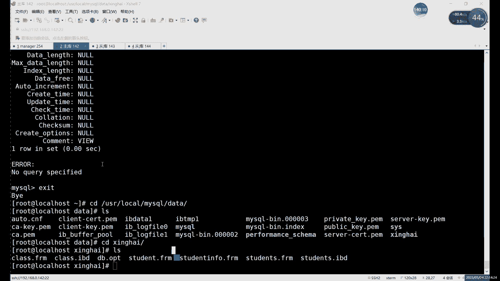

## 视图的数据操作特性

理解了视图与表的区别后，本节中我们来看看对视图进行数据操作时会发生什么。

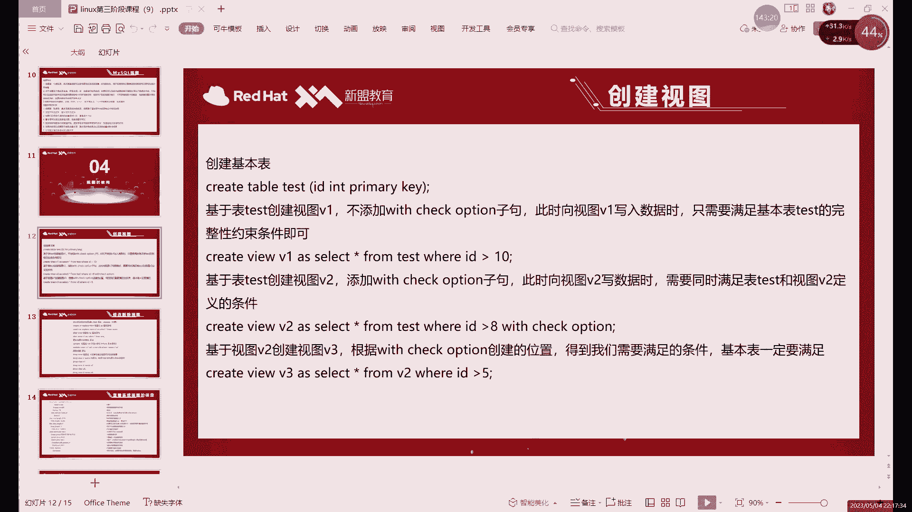

由于视图本身没有数据，所有对视图的增删改查操作，最终都会映射到其依赖的基本表上。这是一个需要理解的核心概念。

**示例：向视图插入数据**
```sql
-- 假设 student_view 是基于 students 表创建的视图
INSERT INTO student_view (id, name, gender, score) VALUES (15, ‘小王‘, ‘F‘, 95);
```
这条插入语句看似操作的是`student_view`，但实际上数据被添加到了原始的`students`表中。查询`students`表，你会发现新增了一条记录。

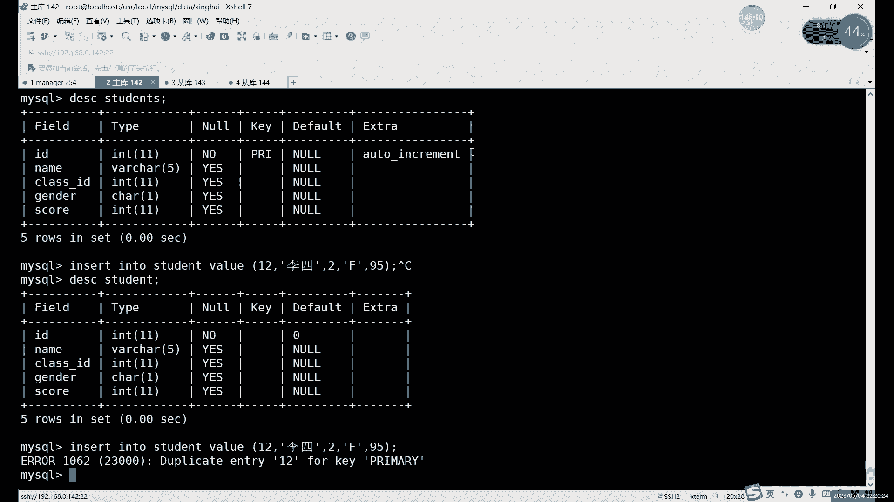

**重要原则**：对视图进行数据操作时，必须遵守其底层基本表的所有约束（如主键唯一性、非空约束等）。如果操作违反了这些约束，将会执行失败。


## 使用 WITH CHECK OPTION 限制视图操作

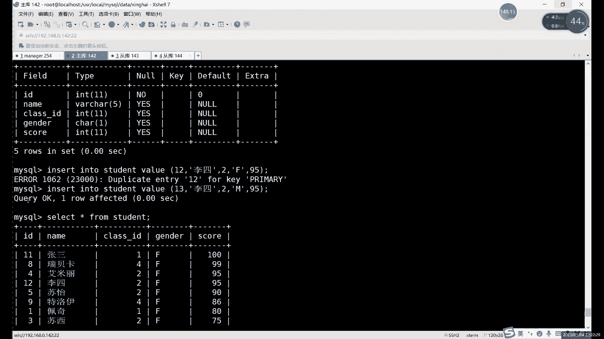

上一节提到对视图的操作会作用到基本表，本节中我们学习如何使用`WITH CHECK OPTION`子句来为视图的操作增加额外的限制。

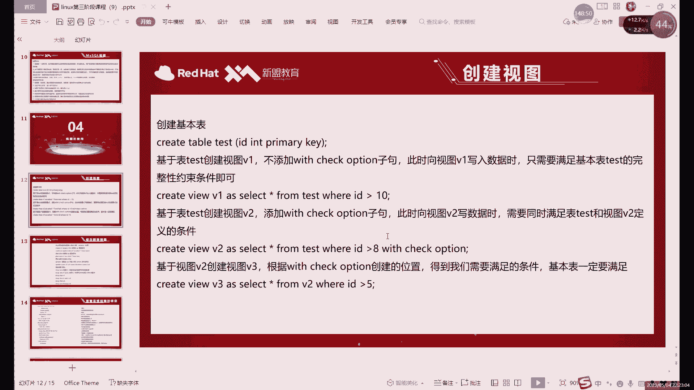

在创建视图时，我们可以添加`WITH CHECK OPTION`。它的作用是：通过视图进行数据修改（INSERT, UPDATE）时，必须保证修改后的数据行仍然满足视图定义中的WHERE条件。

**创建带检查选项的视图**：
```sql
CREATE VIEW student_view_checked AS
SELECT * FROM students WHERE gender = ‘F‘
WITH CHECK OPTION;
```

现在，如果我们尝试通过这个视图插入或更新一条`gender`不为‘F’的记录，操作将会失败。

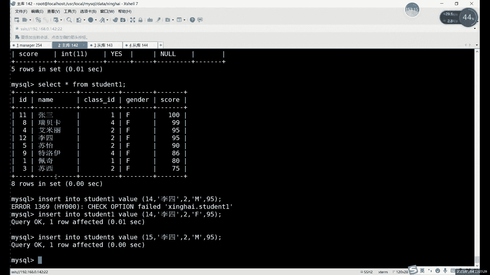

```sql
-- 此操作会失败，因为 ‘M‘ 不满足视图的 WHERE gender=‘F‘ 条件
INSERT INTO student_view_checked (id, name, gender, score) VALUES (16, ‘小李‘, ‘M‘, 88);
```

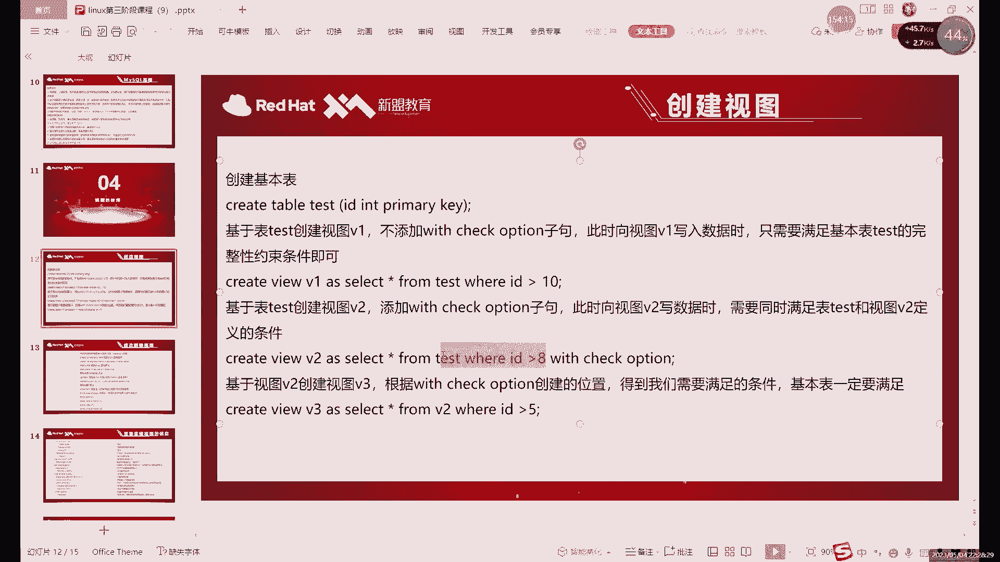

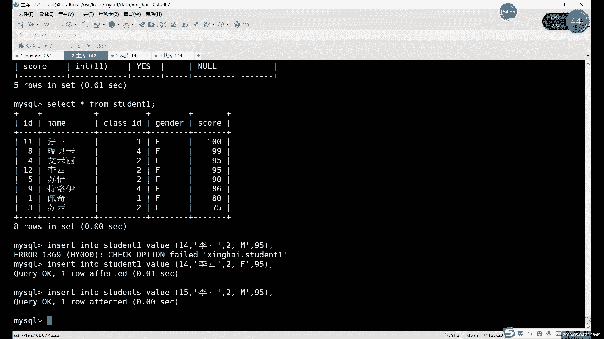

`WITH CHECK OPTION`确保了通过视图操作的数据，始终在视图定义的“可见”范围内，提供了更强的数据一致性保障。

## 总结

本节课中我们一起学习了MySQL视图的核心知识。

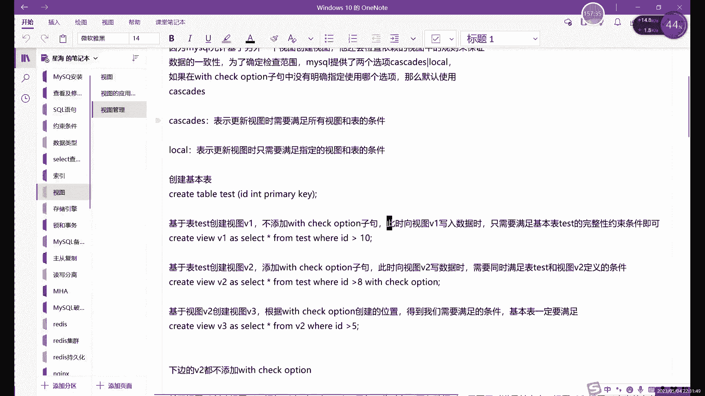

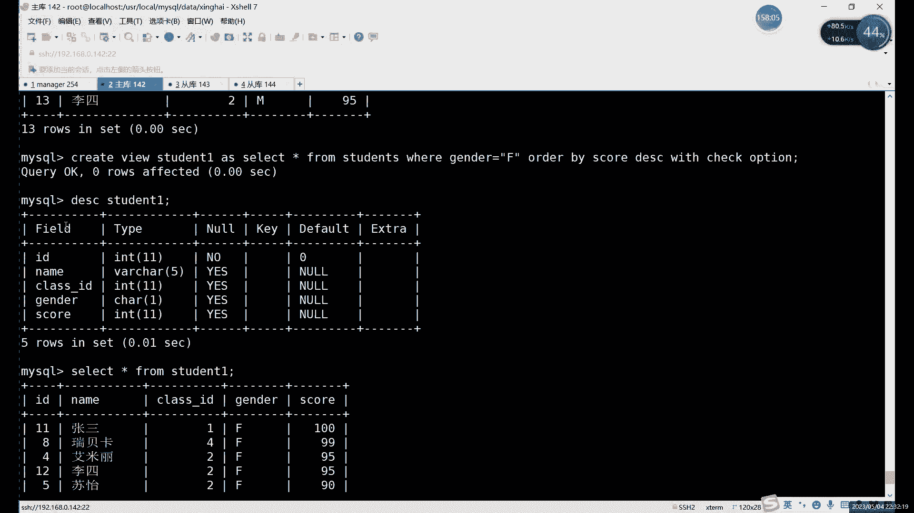

我们首先了解了**视图是什么**——它是一个基于SQL查询的虚拟表，不存储数据，只存储查询定义。然后学习了**如何创建和使用视图**来简化复杂查询。我们重点辨析了**视图与普通表的区别**，关键在于数据存储和约束方面。接着，我们探讨了**对视图进行数据操作的本质**，即操作会传递到底层基本表，并需遵守其约束。最后，我们掌握了**`WITH CHECK OPTION`子句**的用法，它可以强制要求通过视图修改的数据必须符合视图的筛选条件。

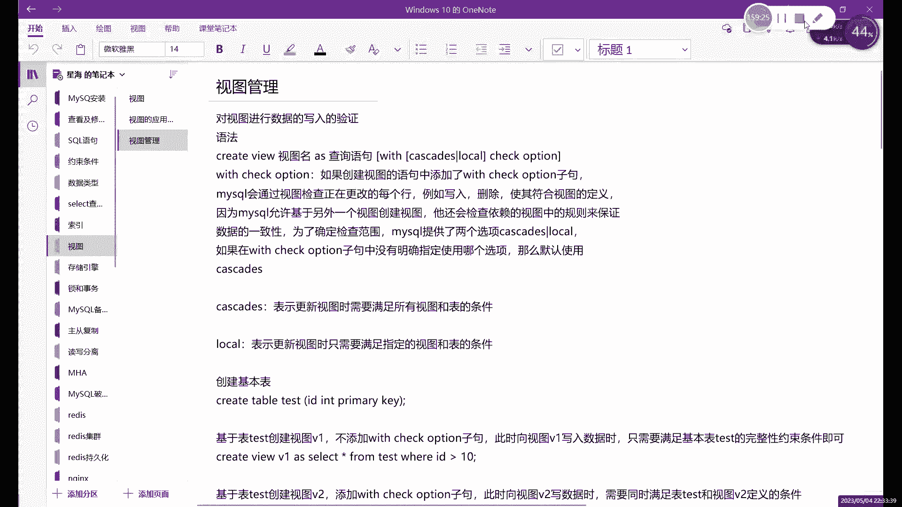

总而言之，视图是一个强大的工具，它能够简化查询、逻辑上组合数据、并提供一定程度的数据安全隔离。正确使用视图可以显著提高数据库应用的开发效率和可维护性。