# Zabbix监控教程：P90：Zabbix添加被控主机、创建模板、创建监控项、解决中文乱码

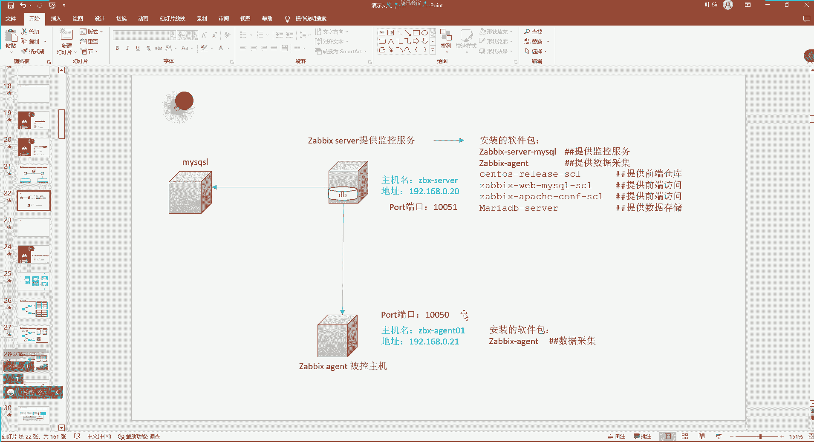

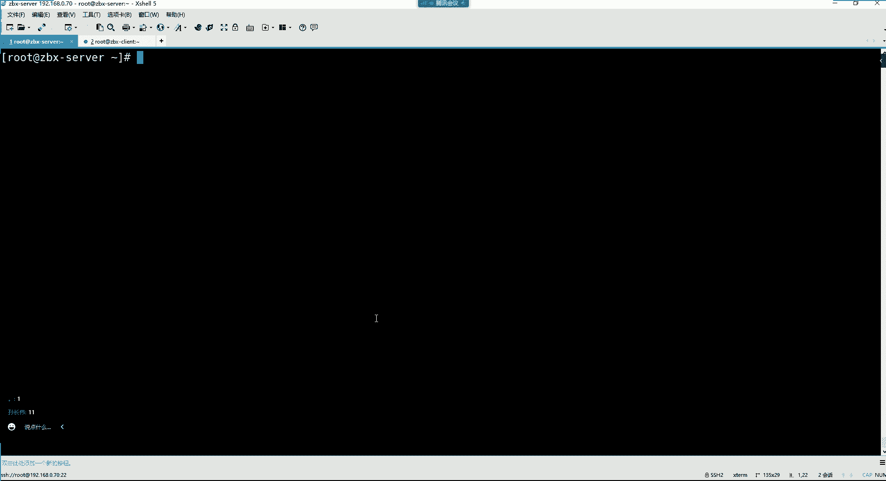

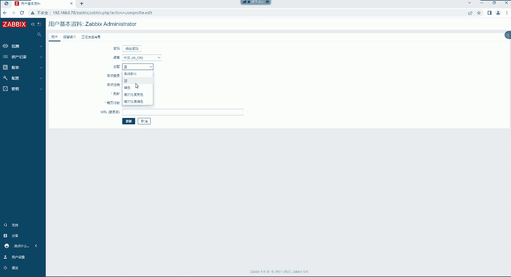

## 概述
在本节课中，我们将学习Zabbix监控系统的核心配置操作，包括如何添加被监控主机、创建自定义监控模板、配置监控项，以及解决Web界面中可能遇到的中文乱码问题。这些是构建有效监控体系的基础步骤。

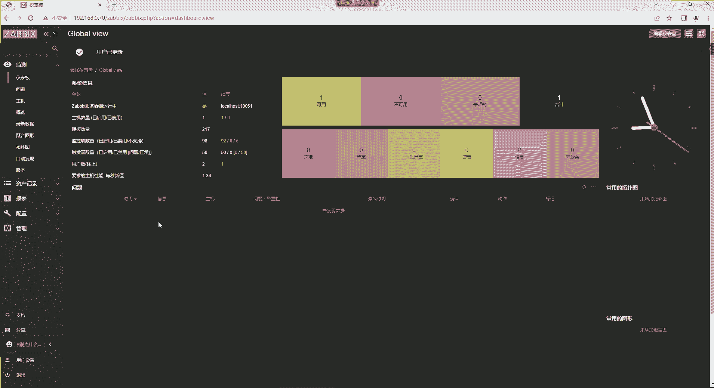

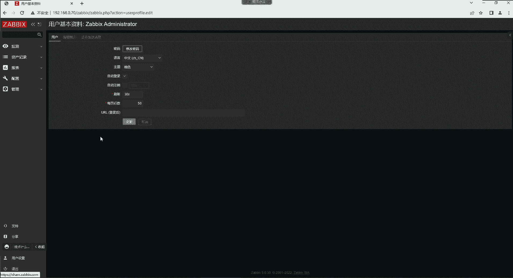

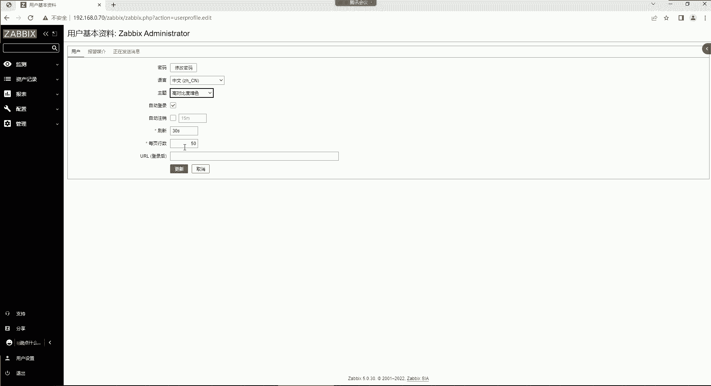

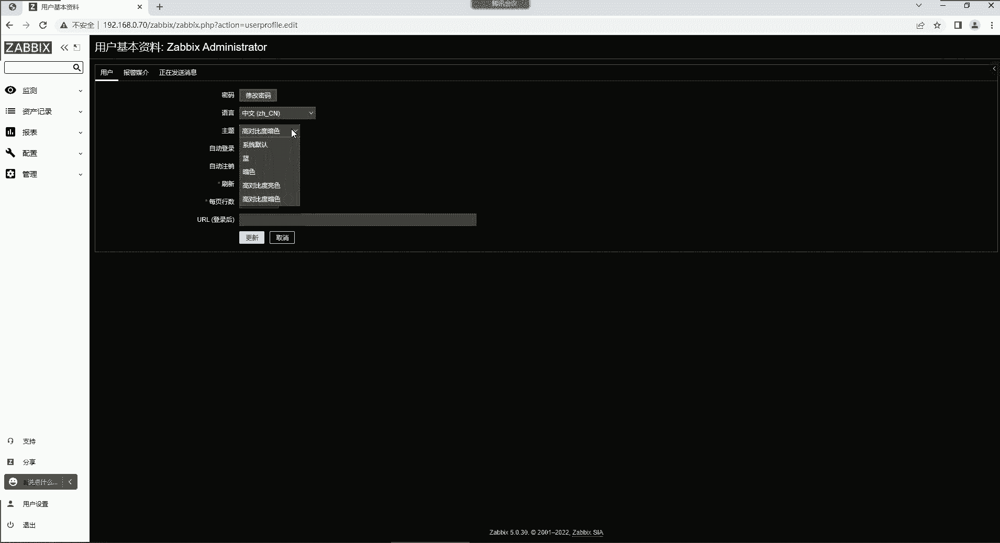

## Web界面个性化设置与用户管理

上一节我们完成了Zabbix Server的安装与基础配置，本节中我们来看看如何通过Web界面进行个性化设置和管理用户。

Zabbix的Web界面左侧有一个侧边栏，点击后可以缩回，以节省屏幕空间。点击汉堡图标可以再次展开。这是一种偏好设置。

在用户设置中，可以更改Web界面的主题。系统提供了多种主题，例如默认的蓝色主题、暗色主题以及高对比度主题。根据个人喜好选择即可。

---

### 修改管理员密码
默认的`admin`用户密码是`zabbix`，为了安全，需要修改此密码。

操作步骤如下：
1.  点击右上角用户图标，进入“用户设置”。
2.  点击“修改密码”。
3.  输入新密码并确认。
4.  点击“更新”。

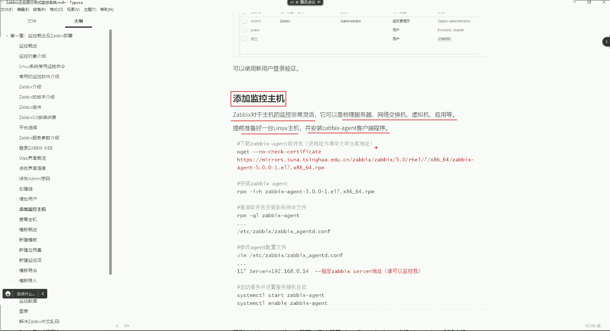

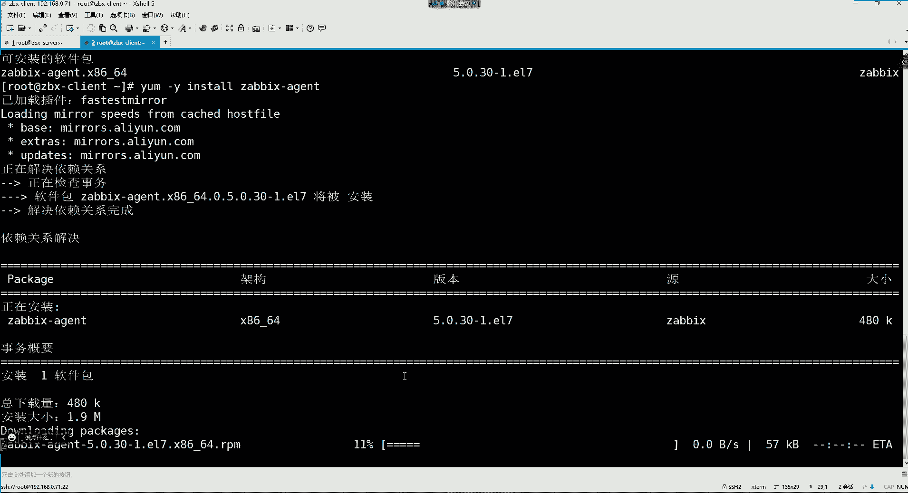

修改后，再次登录需要使用新密码。

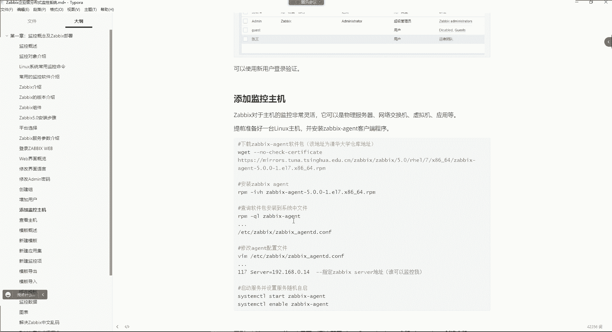

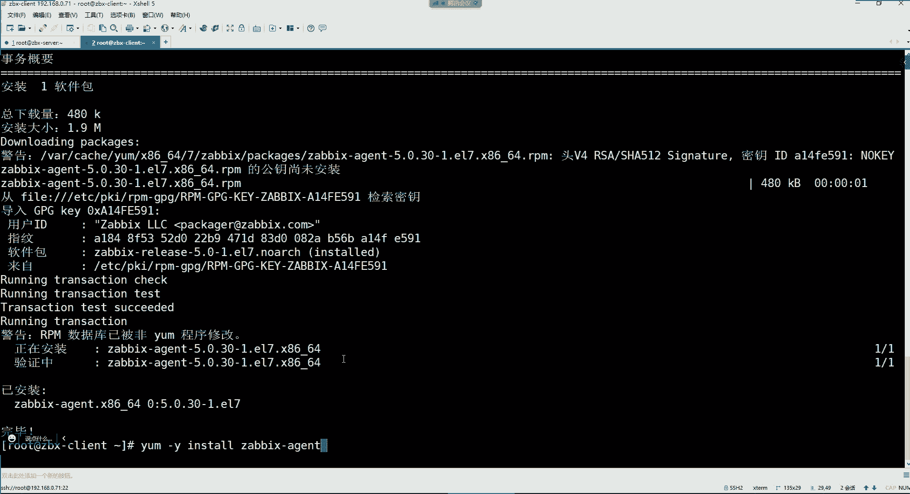

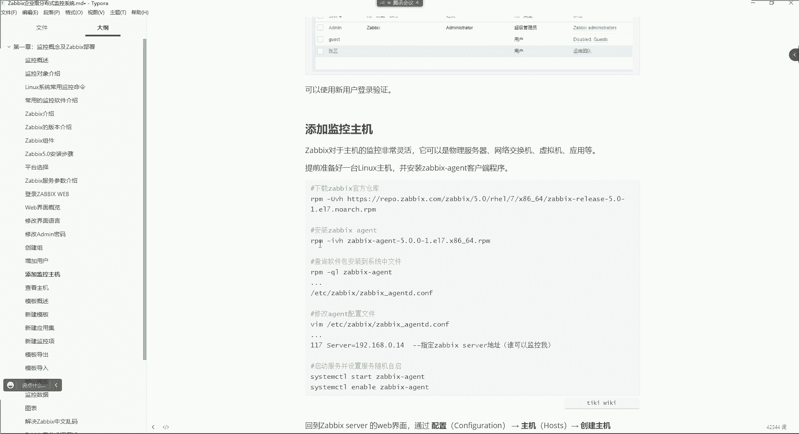

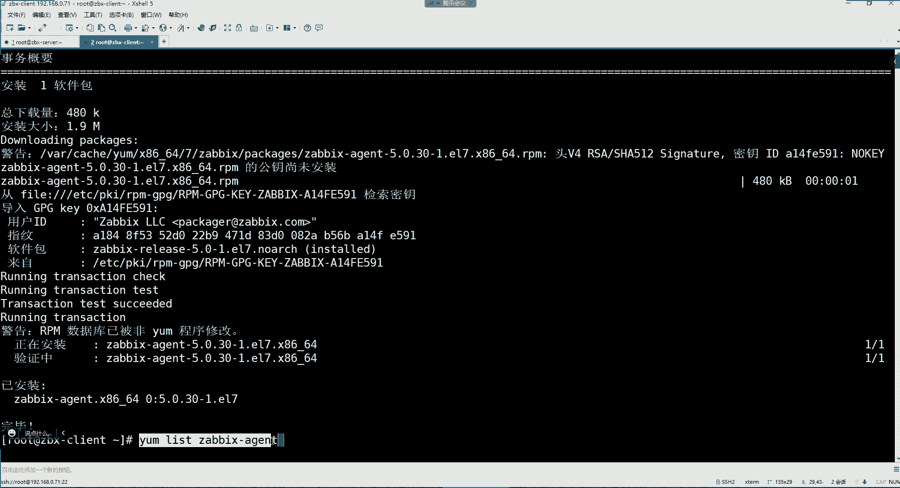

---

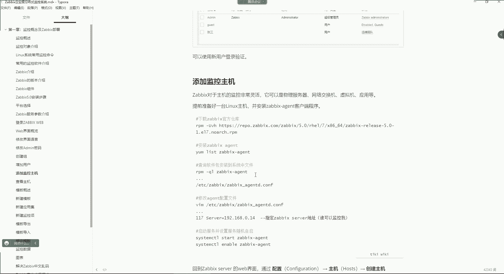

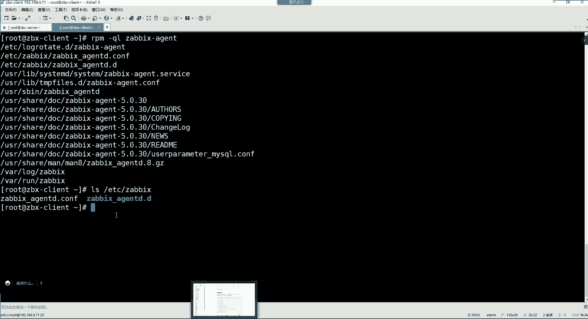

### 创建普通用户与用户组
除了超级管理员，还可以创建普通用户供团队其他成员使用。Zabbix的权限主要通过用户组进行分配。

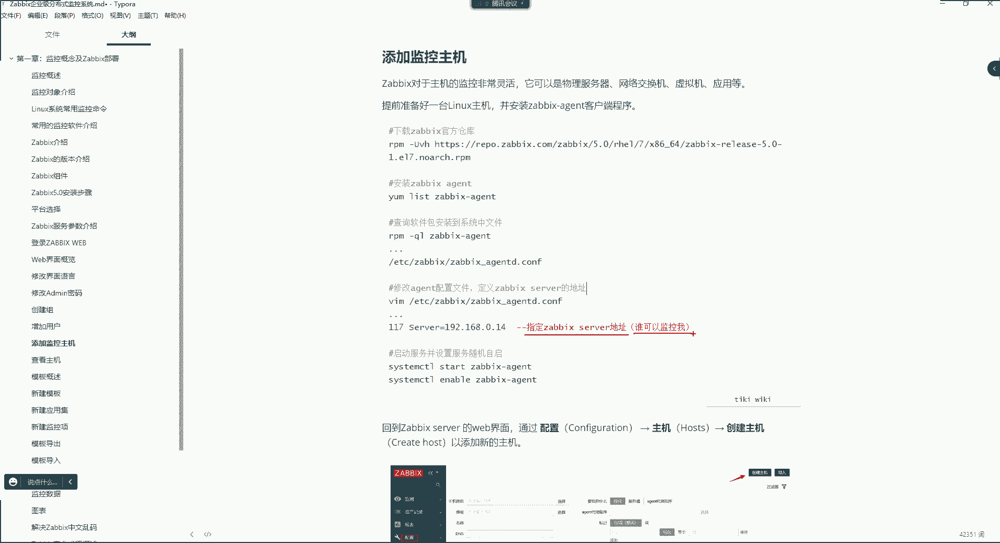

以下是创建用户组和用户的步骤：

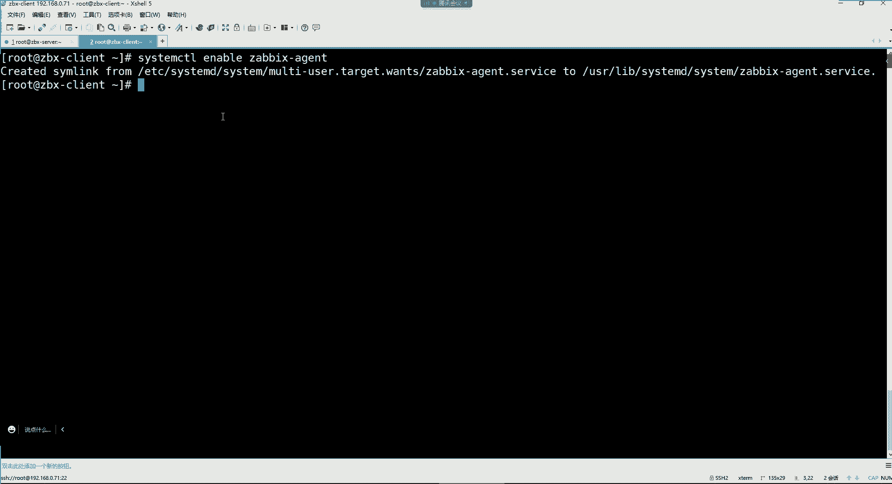

首先，创建一个用户组。
1.  导航至“管理” -> “用户群组”。
2.  点击右上角的“创建用户群组”。
3.  输入组名，例如“运维组”。
4.  在“权限”标签页，为该组分配主机组的访问权限。例如，选择“Linux servers”主机组，并赋予“读”权限。
5.  点击“添加”按钮保存组。

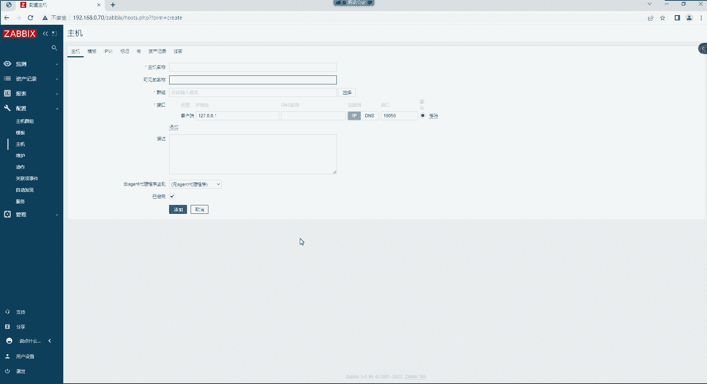

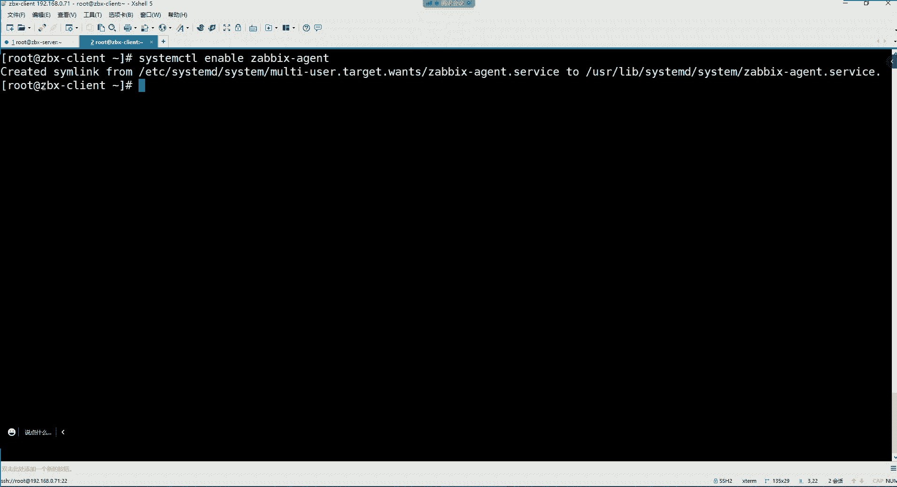

接下来，在该组内创建用户。
1.  导航至“管理” -> “用户”。
2.  点击右上角的“创建用户”。
3.  设置用户名（如`zhangsan`）和密码。
4.  在“群组”标签页，将用户添加到刚创建的“运维组”中。
5.  在“语言”选项中，可设置为“中文（zh_CN）”。
6.  点击“添加”完成创建。

新创建的用户登录后，只能看到其所属组被授权访问的主机和功能，例如“监测”和“报表”，而无法看到“配置”和“管理”等管理功能。

## 添加被监控主机

上一节我们介绍了用户管理，本节中我们来看看如何将一台Linux服务器添加到Zabbix的监控列表中。

### 在被控主机安装Zabbix Agent
在被监控的Linux主机上，需要安装Zabbix Agent客户端程序。

如果主机已配置Zabbix官方仓库，可以直接使用yum安装：
```bash
yum install -y zabbix-agent
```

如果未配置仓库，可以从清华大学开源镜像站等源下载对应版本的RPM包进行安装。

### 配置Zabbix Agent
安装完成后，需要修改Agent的配置文件，指定Zabbix Server的地址。

主配置文件路径为：`/etc/zabbix/zabbix_agentd.conf`
使用文本编辑器打开该文件，找到`Server`参数（约第117行）：
```
Server=127.0.0.1
```
将其修改为Zabbix Server的IP地址：
```
Server=192.168.0.70
```
此配置定义了允许哪个Zabbix Server监控本主机。保存并退出。

### 启动Zabbix Agent服务
修改配置后，启动Zabbix Agent服务并设置开机自启：
```bash
systemctl start zabbix-agent
systemctl enable zabbix-agent
systemctl status zabbix-agent
```
使用`netstat -ntlp`命令可以查看10050端口是否已监听，确认服务正常运行。

### 在Zabbix Web界面添加主机
Agent配置完成后，即可在Zabbix Web界面添加该主机。

操作步骤如下：
1.  导航至“配置” -> “主机”。
2.  点击右上角的“创建主机”。
3.  在“主机”标签页：
    *   **主机名称**：填写一个唯一标识，不支持中文，例如`192.168.0.71`。
    *   **可见名称**：可选项，支持中文，便于识别，例如`门户网站`。
    *   **群组**：选择主机所属的组，例如“Linux servers”。每个主机必须属于至少一个组。
4.  在“接口”区域，点击“添加”，类型选择“Agent”，填写主机的IP地址（如`192.168.0.71`）和端口（默认10050）。
5.  点击页面底部的“添加”按钮。

添加成功后，主机将出现在主机列表中。之前创建的“运维组”用户（如张三）因为对该主机所在的“Linux servers”组有读权限，也能在“监测” -> “主机”中看到此主机。

## 理解与应用监控模板

上一节我们成功添加了主机，但主机尚未开始收集监控数据。本节中我们来看看如何通过模板为主机配置监控项。

### 模板的作用
模板是Zabbix中一组预配置的监控实体（如监控项、触发器、图形）的集合。将模板链接到主机，主机会自动继承模板中的所有配置，无需为每个主机单独设置。

Zabbix提供了大量开箱即用的模板，涵盖操作系统、网络设备、应用程序等。但很多时候，默认模板包含的监控项过多或不符合实际需求。

### 链接默认模板
我们可以先尝试为刚添加的主机链接一个系统模板。

操作步骤如下：
1.  在“配置” -> “主机”列表中，点击刚添加的主机名称。
2.  在主机配置页面，切换到“模板”标签页。
3.  点击“选择”按钮，在模板列表中找到并选择“Template OS Linux by Zabbix agent”。
4.  点击“选择” -> “更新”。

等待约一分钟后，在“监测” -> “主机”中查看该主机的“可用性”应变为绿色。点击“最新数据”，可以看到该主机已开始收集CPU、内存、磁盘、网络等多项指标。

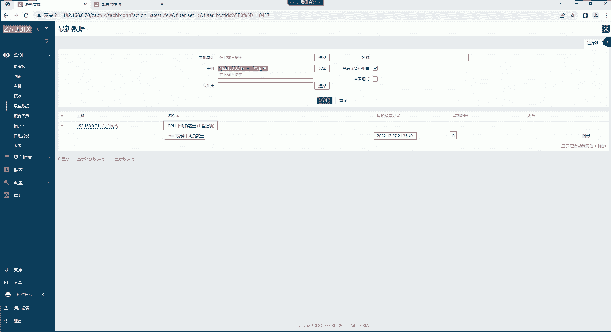

### 创建自定义模板
由于默认模板可能不适用，我们可以创建自定义模板。

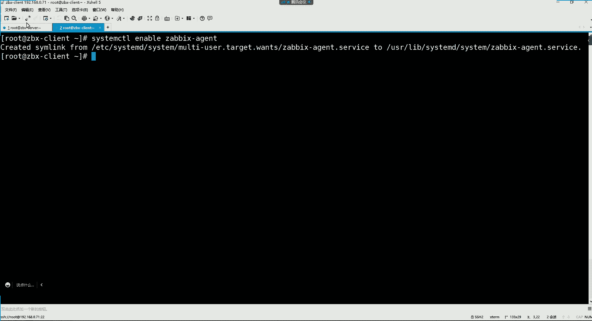

以下是创建自定义模板的步骤：
1.  导航至“配置” -> “模板”。
2.  点击右上角的“创建模板”。
3.  输入模板名称，例如`Linux OS Monitor`。
4.  选择模板所属的群组，例如“Templates/Operating systems”。
5.  点击“添加”。

模板创建后是空的，需要为其添加“应用集”和“监控项”。

**应用集**是对监控项的逻辑分组。例如，将所有CPU相关的监控项放入一个名为“CPU”的应用集。
1.  在模板页面，点击“应用集”标签页。
2.  点击“创建应用集”。
3.  输入名称，如`CPU`，点击“添加”。

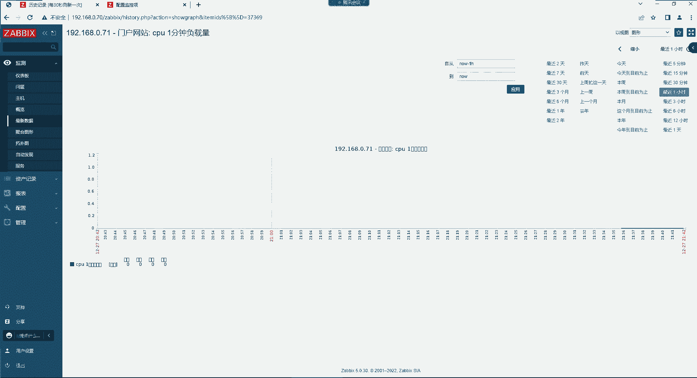

**监控项**是Zabbix中用于采集数据的最小单位。每个监控项通过一个唯一的“键值（Key）”来标识要采集的数据。
1.  在模板页面，点击“监控项”标签页。
2.  点击右上角的“创建监控项”。
3.  配置监控项：
    *   **名称**：监控项描述，如`CPU 1分钟平均负载`。
    *   **键值**：采集数据使用的键。对于系统负载，可参考Zabbix Server自带的监控项，例如`system.cpu.load[percpu,avg1]`。
    *   **信息类型**：根据采集的数据类型选择，如负载值为小数，选择“数字（浮点）”。
    *   **更新间隔**：数据采集频率，如`1m`（1分钟）。
    *   **历史数据保留时长**：原始数据保留时间，例如`7d`。
    *   **趋势存储周期**：聚合数据（每小时最大值、最小值、平均值等）保留时间，例如`365d`。
    *   **应用集**：选择该监控项所属的应用集，如刚创建的`CPU`。
4.  点击“添加”。

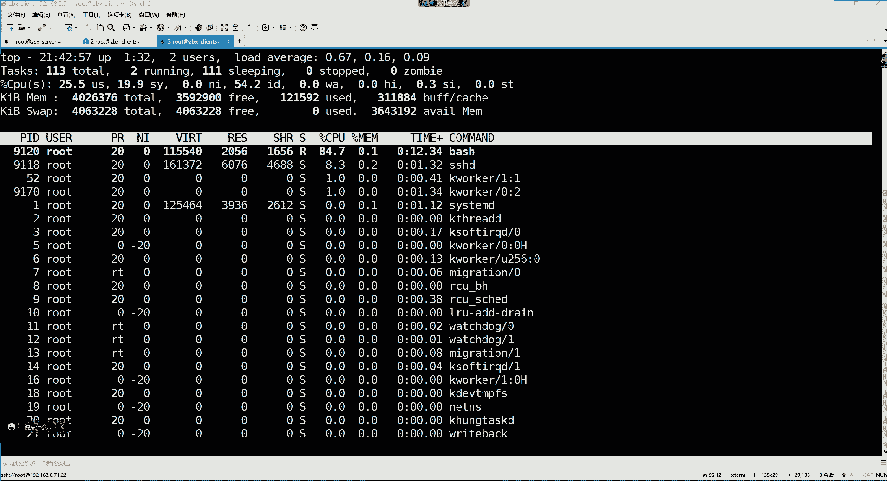

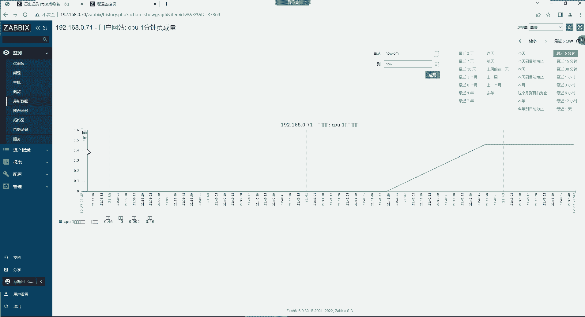

按照此方法，可以继续添加“5分钟负载”、“15分钟负载”、“CPU核心数”、“总内存”、“可用内存”等监控项。

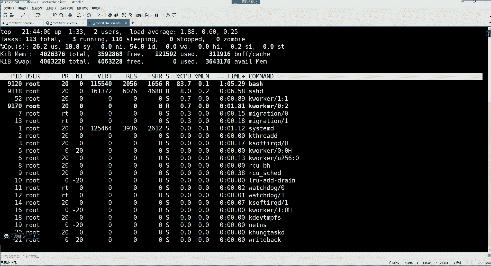

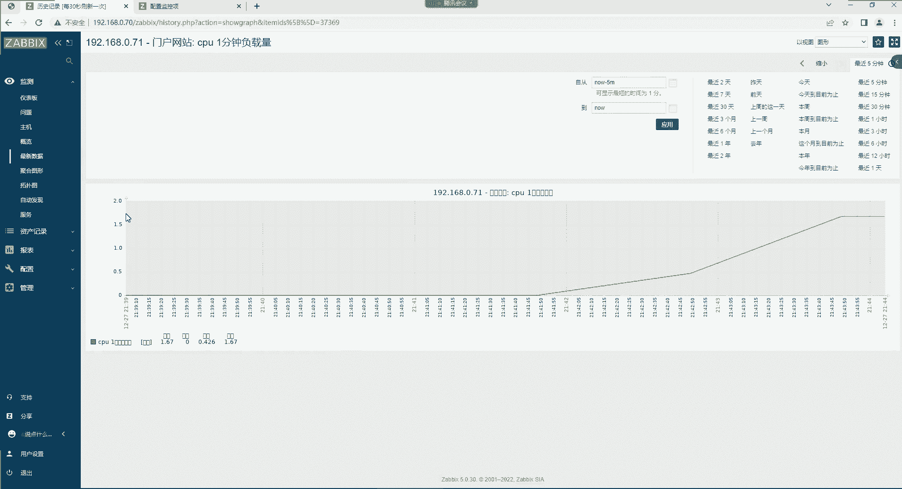

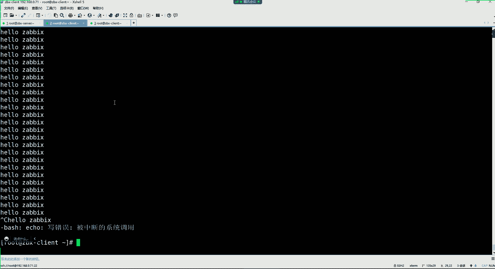

### 模板的导出与导入
自定义模板配置完成后，可以导出为XML文件，方便在其他Zabbix实例中复用。

导出模板：
1.  在“配置” -> “模板”列表中找到目标模板。
2.  点击模板名称后的“导出”链接，即可下载XML文件。

导入模板：
1.  在“配置” -> “模板”页面，点击右上角的“导入”按钮。
2.  选择本地的模板XML文件。
3.  点击“导入”按钮。

导入成功后，新模板会出现在模板列表中，可以将其链接到任何主机。

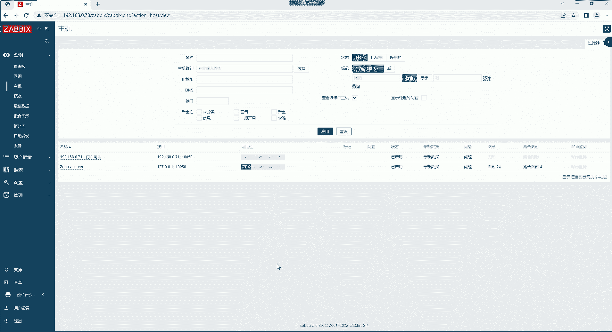

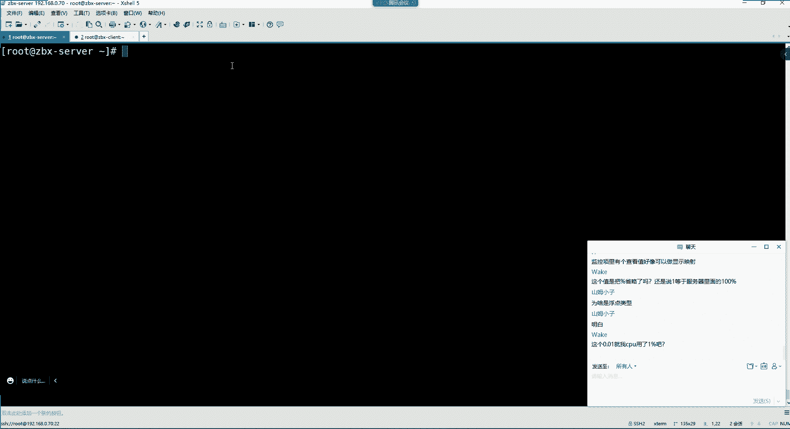

## 解决Web界面图形中文乱码

上一节我们创建了监控项并看到了数据，本节中我们来看看如何解决监控图形中可能出现的文字显示为方框的问题。

Zabbix Web界面生成图形（如图表标题、图例）时，默认使用的字体对中文支持不完整，会导致中文显示为乱码（方框）。

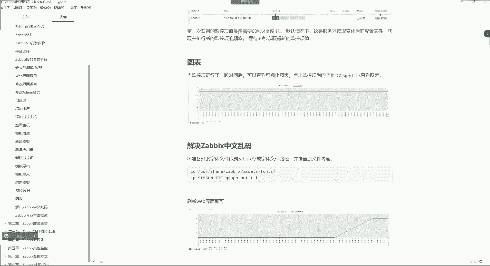

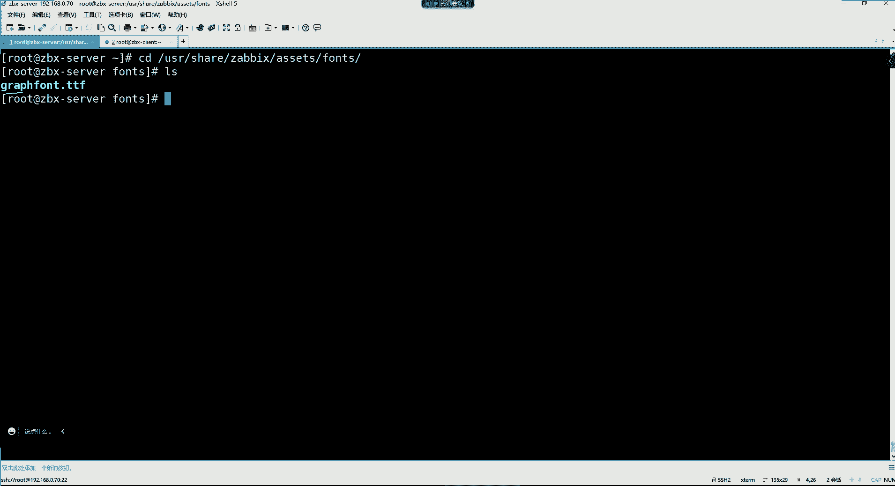

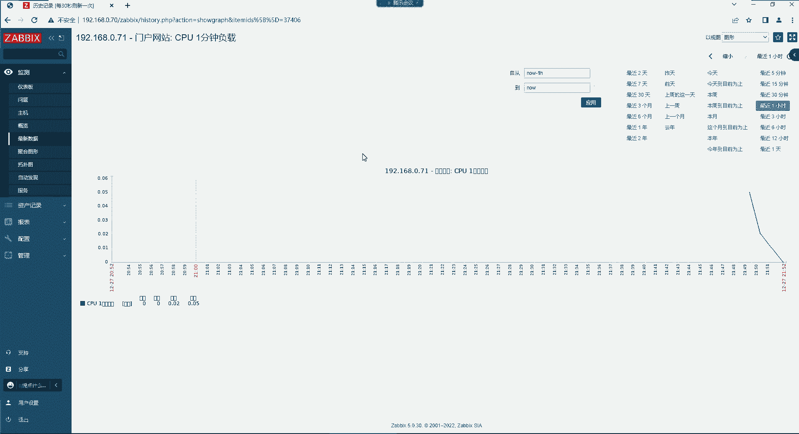

解决方法是将Zabbix Server上的默认字体文件替换为支持中文的字体。

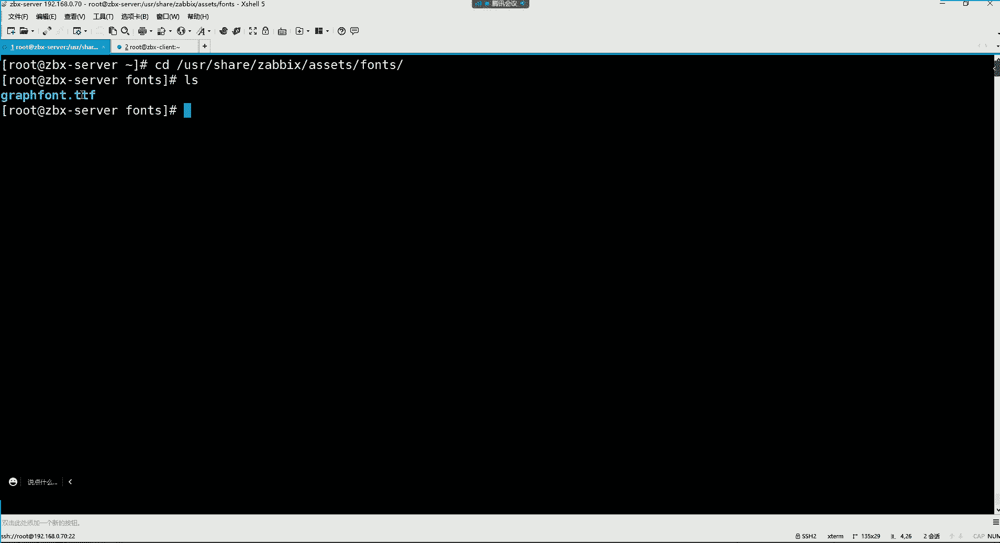

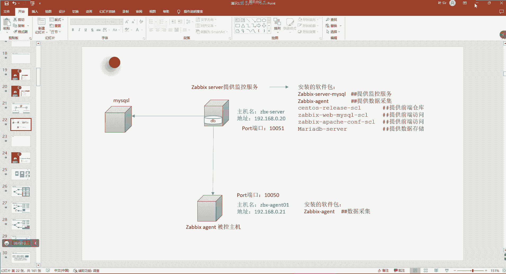

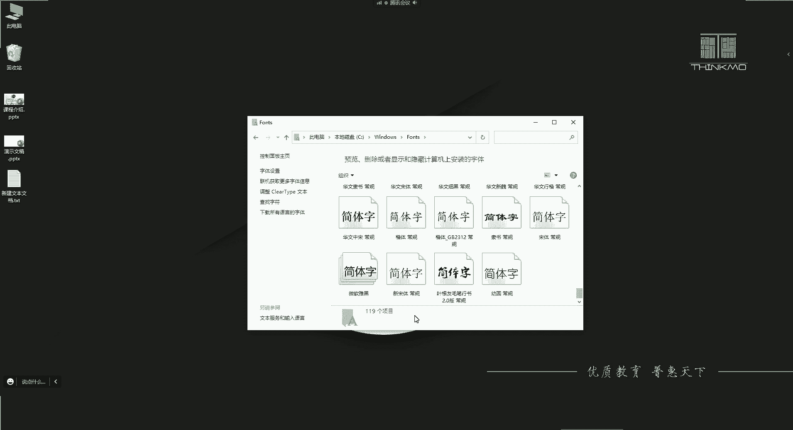

操作步骤如下：
1.  在Zabbix Server服务器上，找到字体文件路径：`/usr/share/zabbix/assets/fonts/graphfont.ttf`
2.  从一台Windows电脑上，复制一个中文字体文件（如`C:\Windows\Fonts\`目录下的`simsun.ttc` 或 `msyh.ttf`）到Zabbix Server上。
3.  使用`cp`命令，用中文字体文件覆盖默认的`graphfont.ttf`文件。**注意：是覆盖文件内容，而不是重命名文件。**
    ```bash
    cp /path/to/your/chinese-font.ttf /usr/share/zabbix/assets/fonts/graphfont.ttf
    ```
4.  覆盖时系统会提示是否覆盖，输入`y`确认。

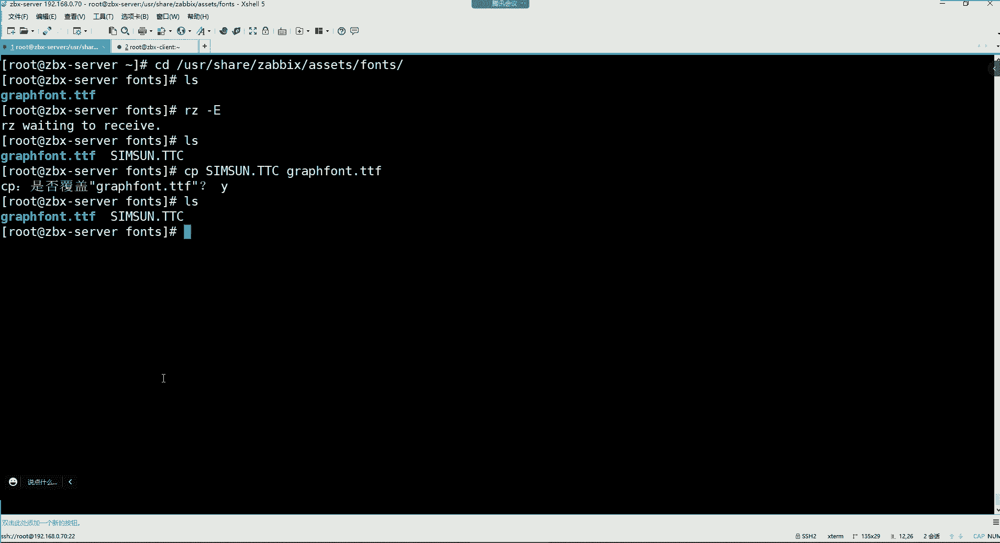

操作完成后，刷新Zabbix Web界面中的图形页面，中文应能正常显示。

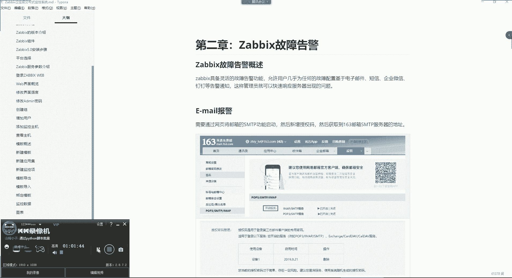

## 总结
本节课中我们一起学习了Zabbix监控配置的核心流程。我们首先了解了Web界面的基本设置和用户权限管理，然后完成了从安装Zabbix Agent到在Web界面添加被监控主机的全过程。接着，我们深入探讨了监控模板的作用，学习了如何创建自定义模板、应用集和监控项，以满足个性化的监控需求。最后，我们解决了监控图形中常见的中文乱码问题。掌握这些内容，您已经能够为Linux服务器搭建起基础的监控体系。