# 零基础入门Linux，红帽认证全套教程！Linux运维工程师的升职加薪宝典！RHCSA+RHCE+中级运维+云计算课程大合集！ - P101：Docker-4.docker容器数据卷 - 广厦千万- - BV1ns4y1r7A2

好。那我们就开始啊。开始。

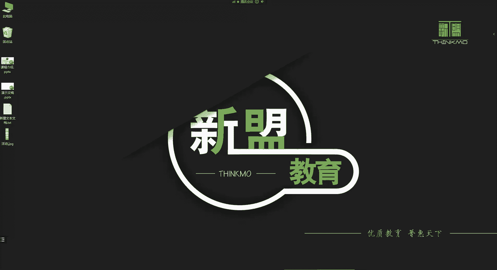

我是。讲到了这个拷贝是吧？然后我们把这个包啊，我得先解压一下，因为你到容器里面，可能说连个解压的命令都没有。已经解压完了，解压完之后，我现在就要把这目录。

这目录里边的内容啊哈要把这些文件给它拷贝到容器里边。😊，这个我们先来看，那我现在所要实现的是不是要把我这个。速主机上边的这个一些文件往容器里面拷贝啊。所以我们这个用的命令格式是这个。

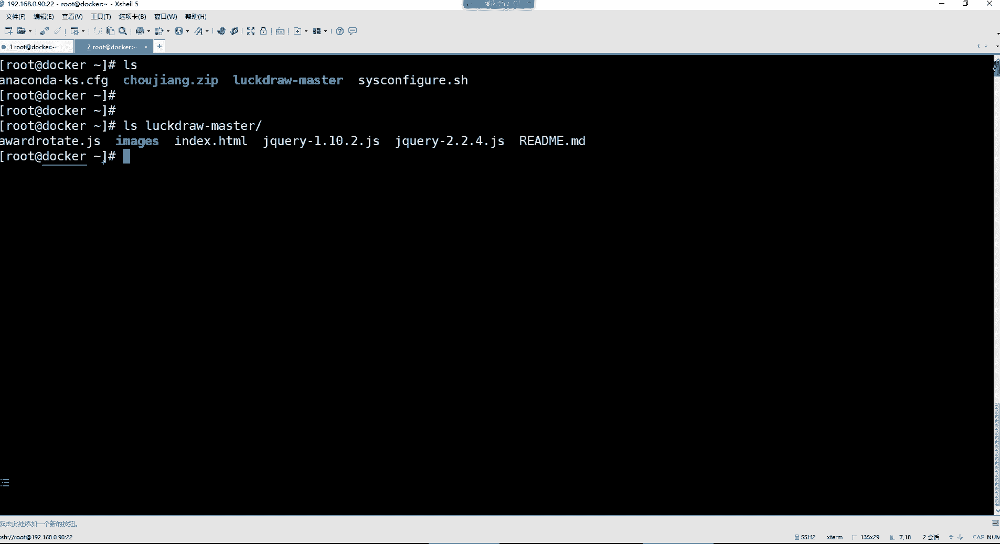

就是这个用dockerCP，然后指定我本机的目录。然后再指定要往哪个容器里边拷贝。然后呢，英文的冒号分隔之后呢，再指定一下，我要把这个文件拷贝到容器的哪个路径下边。好，那这时候来看啊。

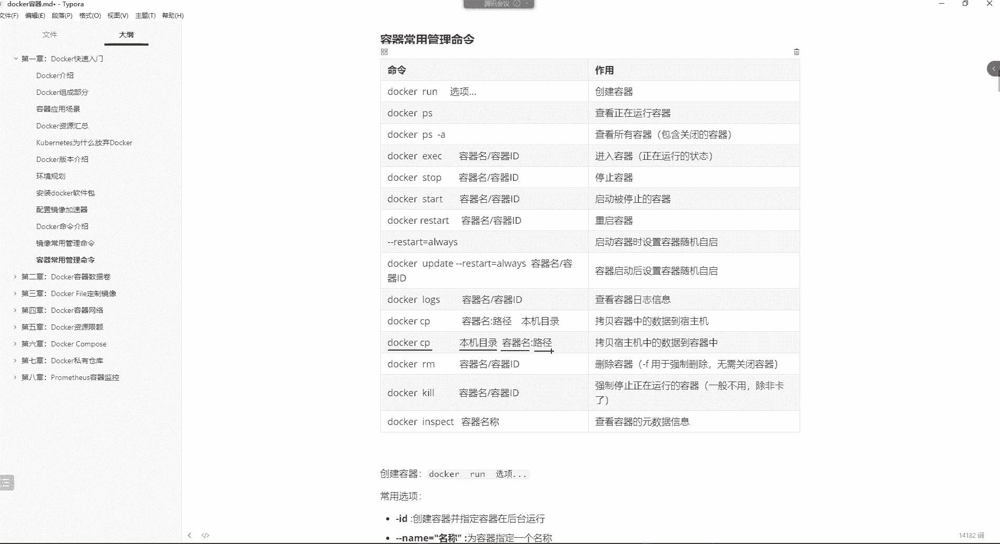

呃，dockerCP指定我要把本地的root下的这个目录。下的所有内容。给它拷贝到哪个容器呢？是N这01这个容器，然后英文 number号分割一下，分割用来指定我要拷贝到容器的哪个路径。Useer。

share n这个HtL里边走你。哎呀，他里边。呃，应该是不让用这个星啊。看到吗？你用信号，它不支持。那我们就在这个容器里面，我们去看一下啊，dokerEXEC杠IT跟上N这01指定解释器。

然后我们CD到优色share index里边。啊，再进到HTL里边。我们是把这个目录一整个的拷贝进来了是吧？嗯，那要说像我们这种方法拷贝的话，怎么说呢？😊，是。也只能是实现的这么一个效果吧。

把这个目录下的就是把整个目录给它拷贝到容器里边。然后呢，那进到容器之后，你自己给它搞一搞也可以。你这样把这里的那些什么index，还有那个。😊，50的报错页面文件都给它删掉，然后再把这个目录里的内容。

把目录里的所有内容。给它移动到当前目录。是不是也可以啊？好，然后那这时候我们在访问的时候是访问这个N这01。那这比如说它那个页面嘛，是吧？

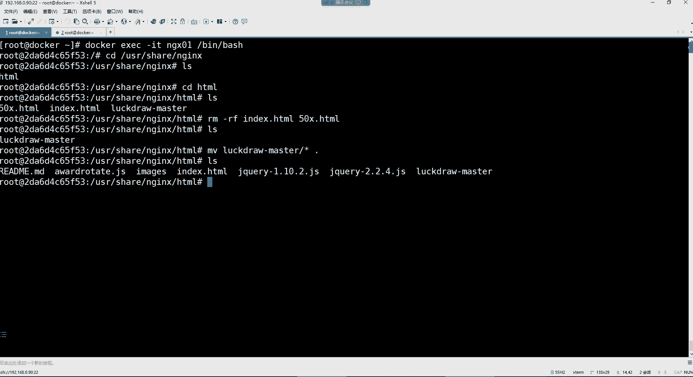

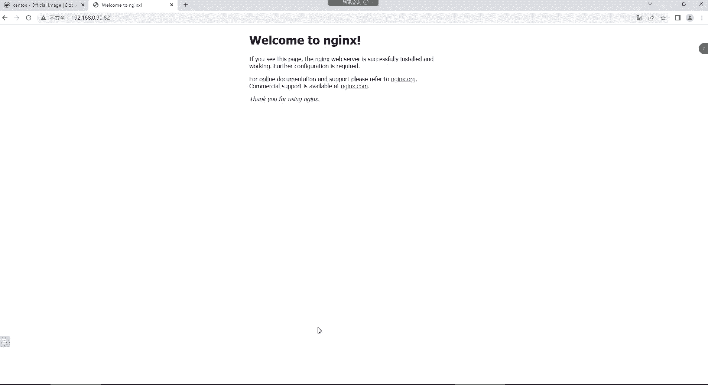

也可以。反正就是这个你自己再手动的去什么呢？去参与一下。

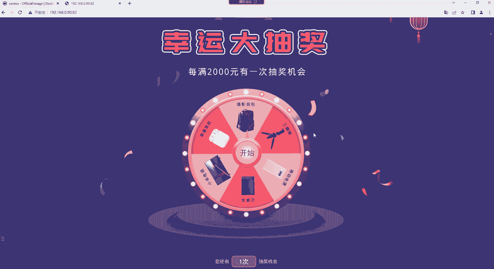

这就是拷贝，那这种拷贝是不是就直接把我的这个速主机上面的一些数据往容器里面拷贝呀？那还有另外一种就是把容器里的数据拷贝到我的素主机上面来。你比如说对于容器，我要拷贝它的什么呢？

我要拷贝它这个ETC线的N这的那个ND点com这个文件。我要把它的主配文件给它拷贝过来。😡，好，那这边这样拷贝dokerCP指定容器名N这01，然后再指定我要拷贝这个容器的哪个路径下的哪个。文件。

这是我要拷贝的这个文件的路径，然后拷贝到我的宿主机上边，放在OPT下边。然后看一下OPT。是不是就把这个配置文件给它拷贝出来了呀，所以这种事属于叫做相互的拷贝，比较简单吧。

好，这是dockerCP这个命令的一个用法。然后那前面这命令几乎已经都给大家演示过了是吧？然后下边删除容器，我们前面也演示过了，这里面就不重复去演示了。然后还有一个dorkq，这是什么呢？

这是强制停止正在运行的容器。我们停止容器可以用这个stop是吧？但是有的时候比如说容器出现异常的时候，你stop停不掉咋办呢？你可以用Q，我们就拿哪个容器来说呢？我们先退出这个容器啊。😊。

其实你不退出，你把容器停掉，你也就自动退出来了。我们现在就要把那个NG02那个容器。我要给他。强制的给他Q掉。那就这样do刻。Q跟上N，这个是02。然后看一下dockerPS。

是不是ND402你看不到了呀，但是呢你杠A的时候呢。诶，他。属于关闭状态了，就是并不是删掉啊，你不要觉得这个Q像我们平时杀进程一样，是把这个容器给它杀掉，不是是把容器给它关掉。

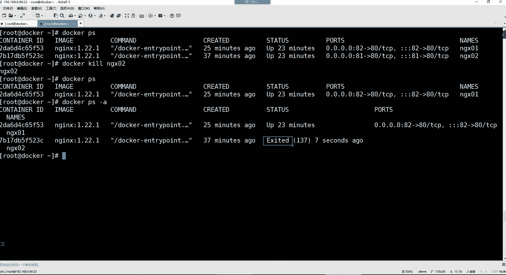

这是Q，然后还有一个是docker expectpect，这个命令的话呢是查看容器的语原数据信息。那我们来看一下dcker。

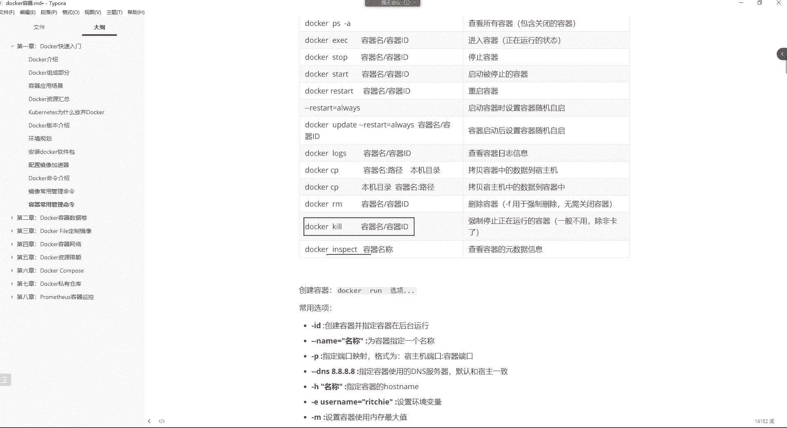

pect然后跟上这个N这01看看它的原言数据。那这个语言数据就非常多了。你看啊一直从哪儿啊，一直从这儿。

哎呦这内容非常多是吧？从这往下，这里边你可以看到容器的ID号。😊。

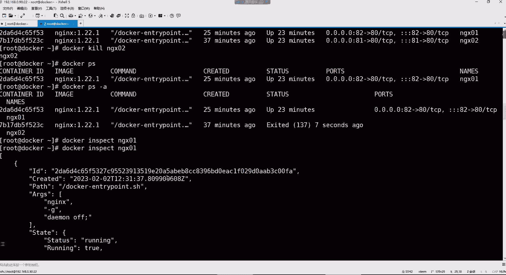

以及我们这个容器的create创建时间。这是docker默认的一个什么一个这个解释器的一个文件。啊，但这默认是这个文件，我们一般不用，我们是不是进到容器的时候，自己指定用并线的bach啊好。😊。

然后这是这个还有哪些呢？这是容器的状态啊，是running的。然后。还有比如这个镜像看到吗？这是镜像的1个ID号。然后。嗯。剩下就是这个容器，它在我们的这个宿主机里边的一些这个什么呢一些路径了。呃。

但是这里边的话呢，你看这个都是被什么，都是被这个哈西过哈，这路径非常长。这一般对我们来讲用不上。容器名字。这个。呃，这个也没有什么太多可关注的。然后下面还有什么呀？还有这个容器的网络模式。

默认是default的网络模式。这个呢我们后续在讲网络的时候，我们再说啊，以及这个容器自己本身的端口，以及它这个端口映射的时候啊，是使用的这个映射的端口是哪一个？然后。还有那个。

容器的retapoli啊，这个就是容容器的重启策略。重启策略呢就是always我们前面试的时候，是不是就是随机自起啊？然后。这是这个容器的一些数据卷的信息了。但是我们现在还没有讲数据卷。

所么这个先不用管。嗯，还有什么呢？还有这个容器的一些这个资源限额啊，比如说内存限额和CPU限额，但是这里边也现在我们都什么都没配呢。然后下边嗯。行还有什么？但这内容是不是有些多呀？

容器的镜像这些我们都是能看得懂的。然后这个。例えで。再往下的话。这是容器的。网络啊，这个这个brarnd是这个调节网络，但是现在还没有讲网络，所以我们先不用去管它哈。😊。

然后然后调节网络所对外暴露的端口。好，然后在这儿这儿有个networknetwork里面是容器的在这儿哈，在从这开始吧，你看这有个get way，get way是容器的网关。

就是我们这个容器它是有自己的网络的，你怎么看容器里面的这个IP地址呢？😊，你就可以通过这个expect，你可以看容器所使用的网关地址是哪个地址，以及容器自己的IPaddress地址是哪个地址。

你看我们这个容器的地址是172。17。0。3这个地址看到了吗？啊，所以这个地址为什么不能直接被我们的外部用户访问呢，因为外部用户跟这个地址压根就不能通信，所以你是访问不了的？其他也没什么了。

这是麦克地址，容器网卡内部的麦克地址。这是一些语数据信息，这原数据信息还是非常多的，是吧？我记得这个原数据它的含义，我曾经给你们解释过吗？😡，就是什么叫原数据给你们解释过吗？😡，呃。

这个或者说知道原数据是什么意思的，先给我刷个一，不知道的先刷2。😡，我们总说原数据。不知道什么叫原数据是吧？😡，行。那其他人呢？也都不知道什么叫原语也不知道原数据是什么含义。😡，好。

那我给你讲讲哈原数据。呃，你比如说我们如果通俗点去理解的话，我们就拿一本书来说吧。呃，这个。金瓶梅是吧？当然什么书都行啊，不一定非得是金瓶梅。😊，我们拿一本书来说。这个书它的原数据。

或者说这个书里的原数据都包含哪些东西呢？😡，其实比如说书的作者。这是不是属于输的语言数据啊，就是原有的数据嘛。😡，还有这个书的目录。以及这个目录里边，比如说我每一章节讲的内容。

这些我们都可以称之为叫做语言数据信息。能理解了吧。哎，所以那我们对于一个容器来讲，那容器的原数据就是这个容器本身。

它自己的内部信息都是属于原数据信息了，就只要是跟这个容器相关的数据，就都称之为叫语原数据。你可以这样理解。😡。

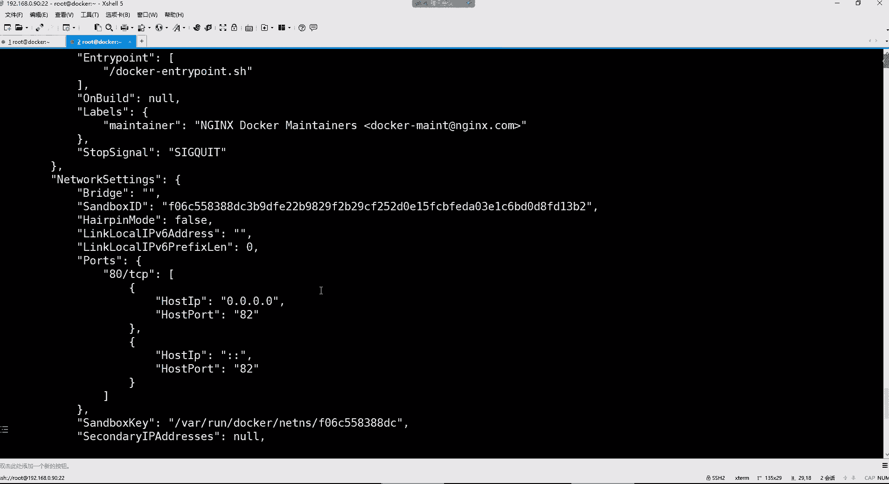

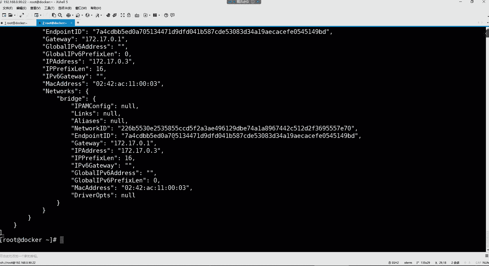

哎，那我这么给你们解释，现在能听懂吗？能听懂的先刷个6。听不懂的继续刷。能听懂是吧？啊。一说金瓶梅就明白了是吧？这就可以哈。对，这就叫语言数据。只要跟我这个东西相关的数据哈。😊，生动形象。好。

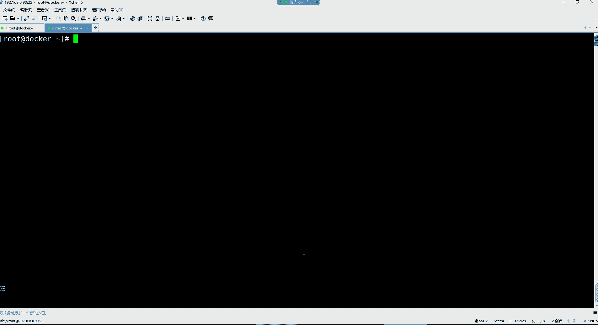

那这些命令呢我们基本上也都差不多了，是不是啊？😊，然后这个接下来呢咱们这个给大家讲讲这个docker的这个数据卷。

呃，docker的数据卷呢就是为什么会有这个东西。那我们先来这个说说容器所存在的问题。第一个问题就是容器与外部主机之间可以。交换文件嘛。第一个问题，什么意思呢？就是我现在在我的外部主机里面有一个文件。

我想直接往容器里面去传。这个我能直接给他传进去吗？啊，各位可以吗？可以的刷一不可以的刷2。😊，能不能。嗯。你们觉得可以吗？😡，可以的刷一，不可以的刷2哈。😊，可以是吧。其实我们可以通过拷贝，是不是？😡。

那拷贝是一种方法。拷贝是种方法，但是我告诉你。呃，拷贝呢。并不理想。而我们这种相互交文件，其实呃用拷贝的方法不理想。所以呢其实默认情况下呢，他们交换文件是不可以交换的。啊。

容器与外部主之间无法直接交换文件。那第二个问题，容器与容器之间可以相互交换文件嘛？就是我现在啊两个容器之间都在同一个主机里边。他们之间比如像说想相互交换一些文件，这可不可以啊？啊。

可以的刷一不可以的刷2。两个容器交换文件。不可以是吧。好。这个你们猜对了。这个你们确实猜对了哈，就是容器与容器之间其实是无法交换文件的。哎，对，相互隔离哈。第三个问题，容器删除了，容器里的数据还在吗？

比如我这容器出现故障了，但是我这容器里面是不是原有是有数据的呀？😡，好，但是呢。出现故障了，我给他删了。那数据还在吗？啊，不带了是吧？没错，就是说你容器删了以后，容器里的数据。也就没了。

这就等于说因为容器本身就是一个啥呀。😡，精华版的系统，你系统你都给删了，那数据还能在吗？那肯定就没了呀。所以。就是以上这三个问题呢，才有了这个数据卷。😡，好，那数据卷呢它的功能是什么呢？首先数据卷。

它可以是速主机中的一个目录或文件。然后我们通过将这个目录或文件给它挂载到容器里边，可以解决容器中的数据与数据之间直接立刻同步。注意哈，我们不是拷贝了。我是要让它实现立刻，而且是实时的同步。

那么数据卷怎么玩呢？首先。哈哈。😊，这是什么呢？就是我想让我的外部主机跟容器之间能够。这个在交换文件的时候，非常的方便，且我速入机里的数据需要跟容器同步的时候怎么办？我就在我的速入机里面随便找个目录。

😊，你就比如说我们这里边随便makeDR再跟一下建一个。Doker。的，这么一个目录。这个目录叫什么都行哈。😊，就让那叫docker吧，docker下划线upload建这么一个目录。好。

然后接来这个目录干嘛呢？这个目录我就直接跟容器。挂载一下。相互挂载哈。好，挂载之后它的优势是啥呢？优势就是。😊，数据卷它可以间接的将外部主机的文件传到速主机的数据卷目录。比如说我现在。

我这个外部主机想往容器里面传文件，不是不能直接传吗？是不是我可以给它先扔在它的速主机上边呢？😡，放在这个数据卷目录里边呢，没错吧，就等于说我直接把我这个电脑里的某一个文件给它扔在哪啊，扔在这个目录里边。

扔在这个目录呢，那这个目录是不是跟容器是挂载的呀？他们相互之间是挂载的那这时候它这个数据卷目录一旦产生数据的话，这个数据会自动同步到容器里边。

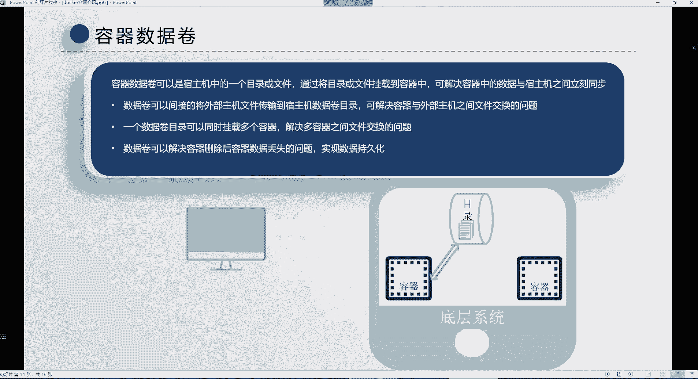

那也是说你数据卷目录里边有的东西容器会自动同步，所以它可以解决的问题就是什么呢？当我们外部主机之间需要跟容器交换，或者说我的容器的速主机需要跟容器。之间进行数据同步的时候，都可以用这个数据卷。

这是第一个解决问题。第二个就是本身你说我们一个容器想跟另外一个容器之间相互同步的话。是不是也不行啊？😡，好，那你就比如说我这个容器提供相同业务的，我两两两个容器都是提供这种页面的。

那么呢我这容器之间有些数据需要共享咋办呢？在我这个容器里面产生一个数据，我希望那个容器里面也要有。

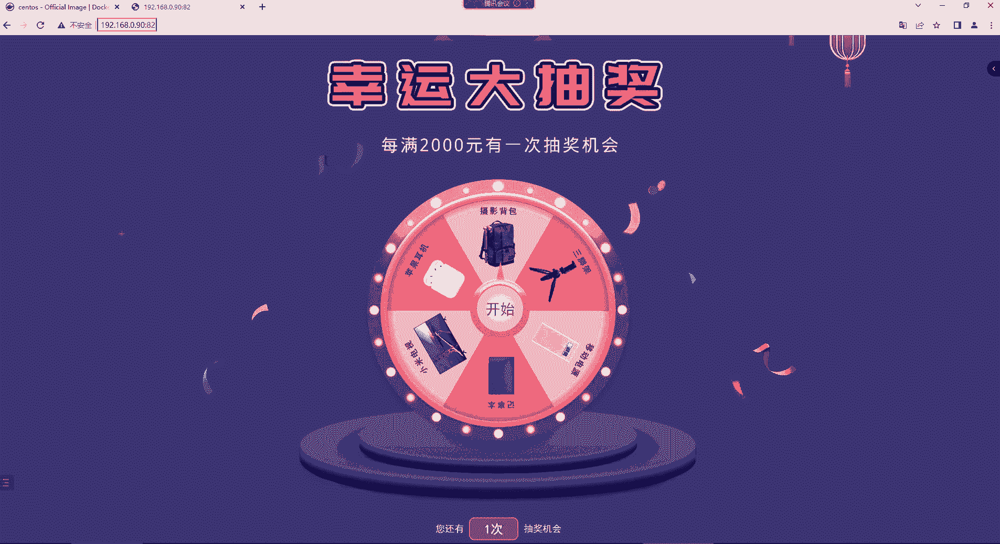

哎，我们那个容器呢？咱把这容器给它起来哈。😊，Docker start N这。02。啊，比如说。在N601容器里面产生的文件，我希望它也要同步到N602里边。那这个默认情况下不是不同步吗？是吧？好。

那有了数据卷的话呢，注意这一个数据卷目录是可以同时挂载多个容器的。就我这一个目录不是说只能给一个容器去什么呢？去使用。

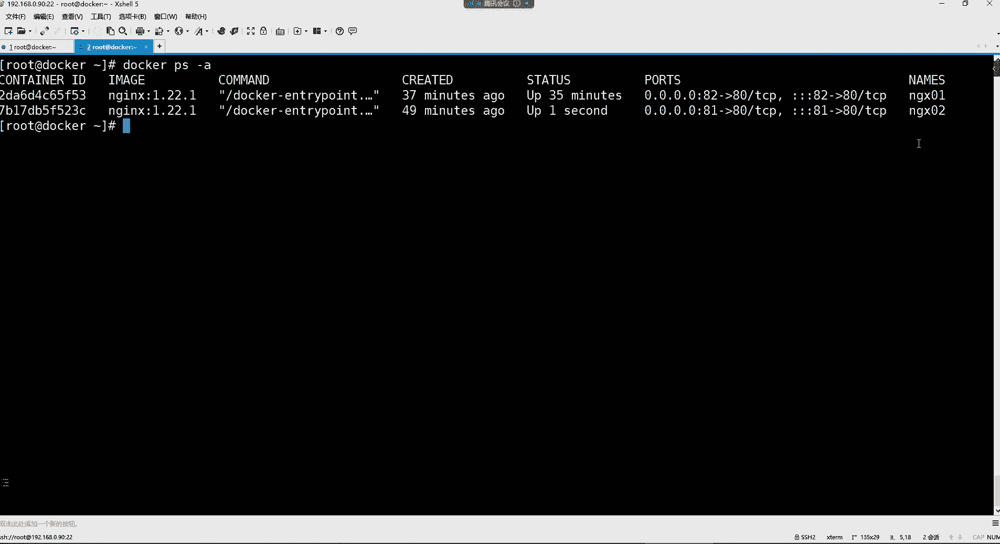

他也可以在挂在另外一个容器上边。一个目录挂载多个容器。好，那它挂载多个容器，它的特点是什么呢？可以解决多个容器之间文件交换的问题。就比如说我左边这个容器。😊，产生了一个文件。那这个文件首先会干嘛呢？

会先同步到数据卷目录去，因为它们之间是相互同步的哈啊，那当我的数据卷目录一旦多了一个文件，右边这个容器是不是也要把这文件同步过来呀？😊，所以这样就间接性的解决了。容器与容器之间的数据交换问题。

这是第二个他可以解决问题啊。第3个。数据键还可以解决容器删除后，容器数据丢失的问题，实现数据持久化。好，那这个更好理解了。我容器出现问题了，我们把容器给删了是吧？那容器里的数据肯定没了呀。😡，但是。

数据卷这个目录是不是还有一份数据的呀？所以你后续容器删了，这个数据不丢失。可以实现这个数据的持久化保存，这就是数据源的功能。所以这个东西。是不是就非常的不错呀？好，那么有了数据卷容器就会变得非常的好用。

包括我们前面说我想改容器里的一些配置文件，我连个VIM的命令都没有。其实我跟你讲都不需要。😊，大大的好。都不需要哈。为什么呢？我是不是想改，你比如说我想改N点c复的文件。😡，这个文件我都不需要干嘛呢？

不需要在容器里面改，我把这个配置文件给它放在我的数据卷目录。😡，知道吧？我的数据目录里边有一个叫N6点com的文件。好，那后续呢我想对这个容器的配置做修改，我直接在我的数据卷目录去改这文件。

那这个配置是不是直接同步到容器里面了呀？你后续都不需要进到容器了。😊，哎你改这文件，它就会自动同步到容器。配置就生效了。是非常好。那接下来咱们来说数据卷我们怎么用啊。

配置数据卷的话配置数据卷的话非常简单。呃，我们在创建容器时使用杠V这个参数就可以了。然后呢，它的命令格式是这样的，docker run跟上你。😊，创建容器的一些参数。然后呢。

后边的话通过杠V指定你速主机的一些目录或文件。然后呢，再用英文的冒号分隔一下，指定把我的这个速主页上的一些目录或者文件给它挂载到容器的哪个目录或文件。然后首先呢这个目录呢，你得必须得指定绝对路径哈。😊。

甭管是素主义的。这个要挂载的一些目录还是容器，要你要挂载的容器的哪个目录都要指定绝对路径。那如果说我们指定的这个路径不存在，没关系，它会自动帮你创建。就是你指定的这个目录可以是一个不存在的。

它会自动帮你创建。好，那接下来咱们现在通过一些例子来演示一下这个数据卷。那这个例子呢首先就是。这个我们通过docker部署myscle，那部署myl得需要镜像啊，是吧？把这个my circlecle5。

7的镜像先给它铺下来吧。

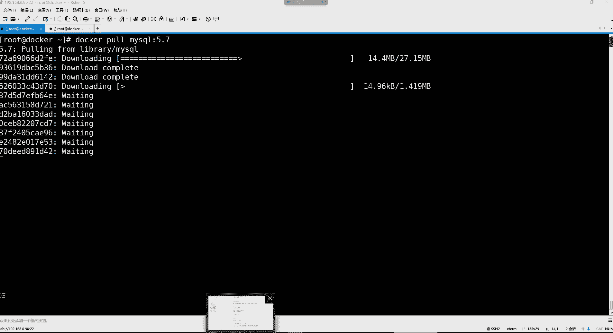

我们需要去这个通过dcker部署my circle n这个t cat，所以我们这边还得去铺t cat的镜像去。t cat镜像有些大。

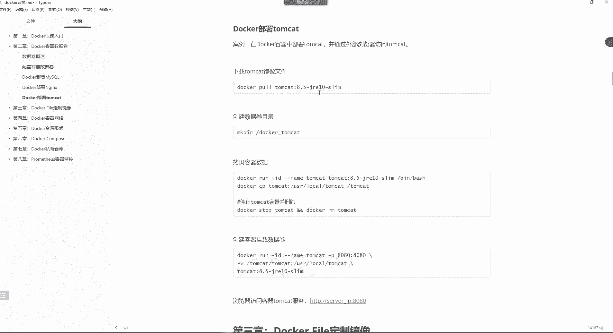

my circlel下载完了以后呢，下载他不看。那这两个N这个4就不用了。因为这ND最终其实。虽然说有灯口映射，但是最终不符合我们的需求。所以我们一会儿要通过数据卷去部署这个N04。

所以把这两个给它删掉就行了。dos呃直接。我们还是优雅一点吧，是吧？先关掉N这个是01。呃，再dockerRMN这01。啊，在doers top n这个是02。啊，再dockerRMN这02。

都给它删掉dockerPS杠A没了。好，镜像现在都已经。吐下来了。哎哎哎。个。来看啊。Doker。Image。

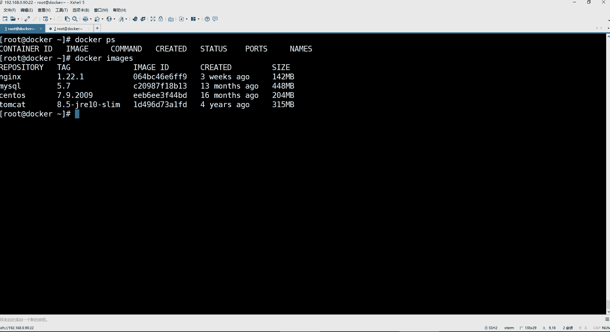

能能看到吗？能能看到我的这个。哦，直播掉了。你好尴尬呀。

现在好了吗？看看啊。现在是不是有画面了呀？😊，没有没有没有，我刚才摁错了哈。现现在能不能看了？现在可以了吗？哦。

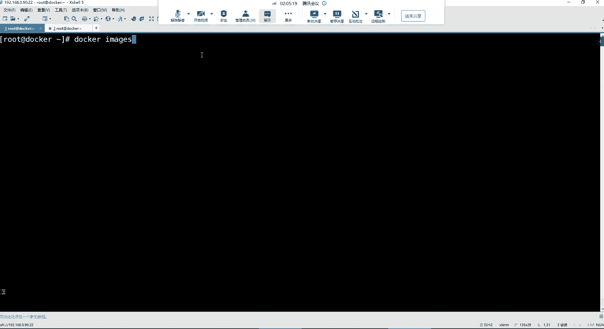

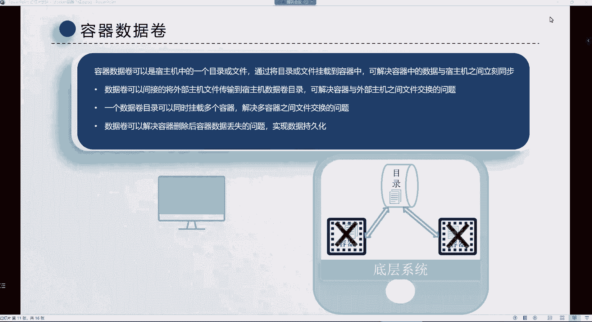

行啊。这这这这。这这这个等会儿啊。重新进一下哈。重新进念课堂。这个什么情况？😔，可以了是吧。Yeah。😊，就说了个就说了个这个。金瓶梅是吧？就就不行了。好，那。

现在都OK了哈，我们继续啊。😊，放这儿啊。来看这镜像啊，该有的都有了。😊，呃，N这 my timeca，咱们现在要用数据卷去部署这些服务的话，那么我们来先部署这个mycle。

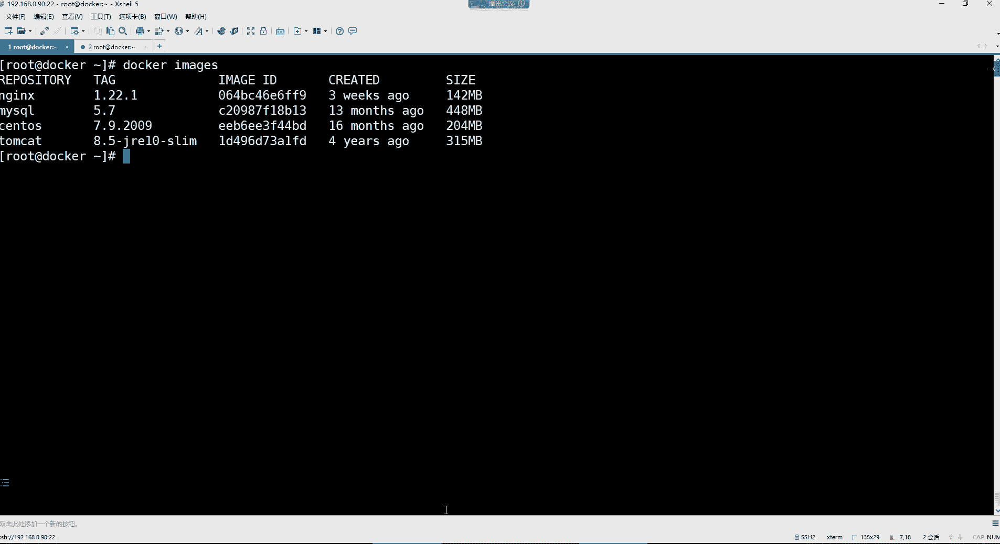

非常简单哈。呃，那你既然是用数据卷部署，是不是得先去准备一个目录去啊？是不是各位。好，所以呢我们先去创建一个my circle的目录啊，用于干嘛呢？用来这个给数据库去做一些数据持久化。

所以我们在这个跟下边。

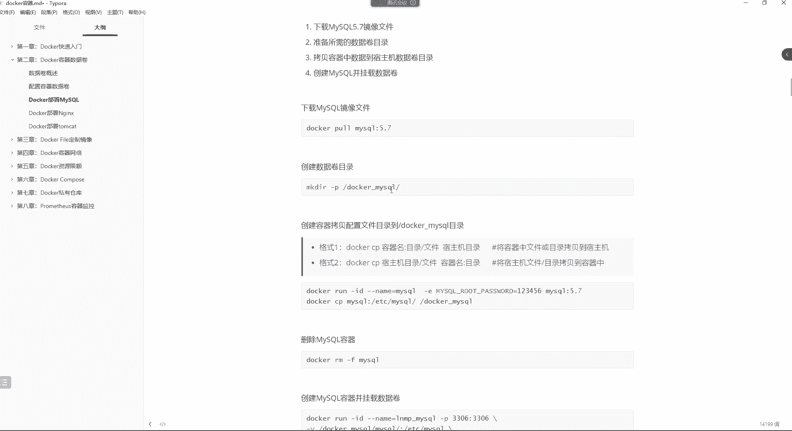

去建一个。Docker。下划线my circlecle的这么一个目录，这个名字也比较见明之义了，是吧？然后接下来呢我们就可以去。

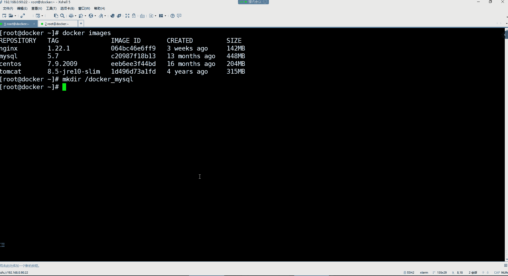

创建mysql的这个容器。但是我们首次创建容器。就是我们先说一下，如果是对一个my circlecle的话，我们现在。

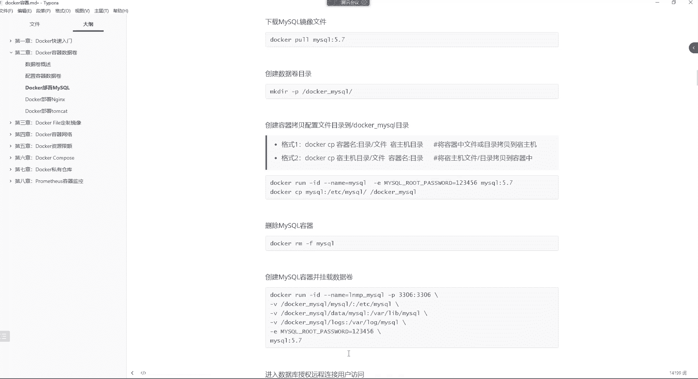

需要去对它的哪些数据做一些持久化呢？首先肯定是它的数据库目录。是不是就是va下的lab下的那个my circlecle这个目录。因为这里面是所有的数据库的数据的存储的位置。还有什么呢？

还有就是它的配置文件ETC下边。它的那个my circlecle下边它的所有的配置文件。是不是也需要给它持久化的保存下来呀？😊，因为毕竟这是数据库的所有配置嘛。好。所以这是我们需要去干嘛呢？

去持久化的两个路径。那还有吗？也有。比如他的日志。W写的log，写的 my。是不是？他的日志我也需要给他持久化的保存下来。所以。我们如果说借如果是想要去持久化这些东西的话。

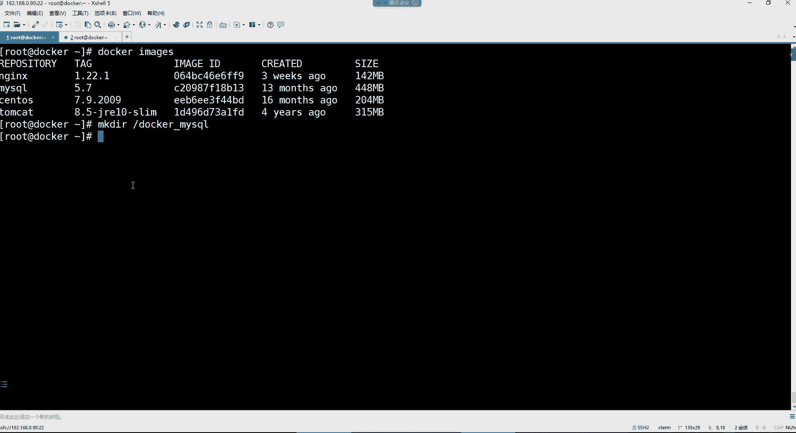

那哪怕就比如说这个。

我们可以这样用哈这样。docker run，然后杠ID。杠杠name等于my circlecle。然后这个麦sco也需要做端口映射呀，那杠P端口映射是3306。映射到3306上面可以吧。好。

然后镜像是my circle。冒号。5。7。那接下来我们就可以去挂载了，挂载它的数据卷。好，那挂载数据卷呢，我们这样。我们先这样，咱们先起一个，咱们先随便起个容器，然后我们看看它的数据都在哪儿是吧？

万一路径不太一样呢？我们先这样docker EXEC。然后杠IT进到这个my circlecle这个容器里边指定便音捷的。哦，错了。你们知道为什么我现在进不到这个myscle容器里边吗？

对麦s狗容器有个问题哈。就是你看他的状态看不到吧。杠A呢是一个退出的状态。就是myoc这个容器。你如果想要用的话，得需要提前给他设置root密码才可以。所以这个。dokerRM把它删掉吧，用不上了。啊。

所以你在创业的时候。要通过。杠E。这个选项指定。它的环节变量。它里面有个环节变量叫做my circle下划线，root下划线。pass word这是用来指定my circle的 rootot密码的。

密码呢，你比如说123456。这样可以。我们再看它的状态。哎，也没有运行。也是退出是吧？

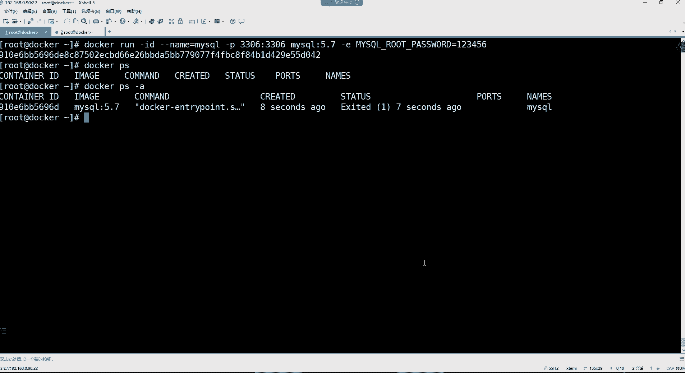

2M。my circle是我指错了吗？my circle root password啊，顺序错了，顺序颠倒了哈。

看到吗？这玩意儿你得把镜像。镜像得放最后。my circlecle5。7。哎A错了哈。😊，5。6去了，他要去拉取5。6的镜像，看到了吗？😊，5。7哈。dokerPS是不是运行了呀？好，运行之后。

我们dcker EXEC杠ITmy circle。啊变一些的bit扯。进来看看我们需要。持久化的数据都在哪儿，不然你不能上就挂载，你连路径都搞不清，是不是啊？所以你看我要。😡。

对他挂的内容有ETC下边的。my circle这个目录里边的它的配置文件。你想卖点CF，这是不是它的主配文件呢？还有什么康复点地下边，这都是它相关的配置文件了。

还有什么docker点CNFm点CF等等等等。但是这个是它的配置文件。😊，可以看一下。在ETCmy circle下边。没有LL命令啊，那就LS杠L。呃，这是这个。卖点CF它的主片软件。

其实我们最终不就是想。对它的这个配置文件做一个就是要给它同步到我的s主机上面。没错吧。但是我们能不能直接把它的整个目录都给它，就把这个ETCmy整个目录里的所有数据都给它搞出来呀。

就都给它做一个持句化呀，是不是也可以呀？😊，可以啊可以，这是第一个。😊，这是第一个我们要去对数据库要给它呃这个什么呢？持久化的一个路径。好，那么第二个就是它的什么呢？数据库的路径在va下的lab下边。

然后有一个my circlecle，它比较传统。的那种二进制形式部署mese的时候，不就是。都是这些路径嘛，啊这里面是存储的my circlecle的所有的库和表嘛。好，这是第二个路径，没错吧。

还有就是它的日志哇的log下边。😊，my circle，这里面是不是有它的错日制啊？那这是不是就是我们所需要持久化保存的一些内容啊？那我现在都知道他的路径了。😊，那么。我们刚刚建那容器没什么用是吧？啊。

但没什么用，你先放这，为什么呢？因为这些数据啊，就是我们在做数据卷的时候，它有个问题，你比如说。😡。

假设啊假设我们在首次同步的时候。比如说容器的那个路径有数据。那么你在首次挂掉的时候。那么他会优先以这个数据卷目录为准，然后干嘛呢？然后把自己本地的目录里的这个数据先给它清空。数据就没了。这个能听懂吧？

也就是说我们得把那些。就是我们需要挂载的东西，提前给他准备好，然后再给它同步回去，这样才行，否则你直接上来就挂。你比如说我要什么呢？我要把这个ETCmys这个目录。

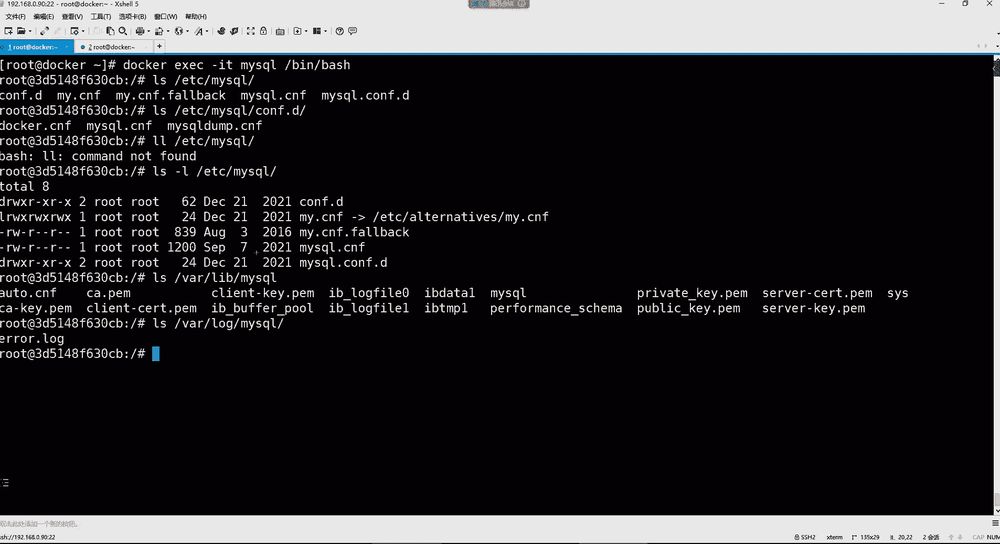

跟我们物理机里面的跟它的宿主仪上面的某个目录去什么呢？做一个相互的挂载。那么如果你的这个宿主仪是一个目录是空的。那么它首次同步的时候，它会直接。因为你这个速主机的数据卷目录是什么都没有。

那么首次同步它会以这个速主机的数据卷目录为准。然后呢，因为你这个这个所主机数据目录什么都没有是吧，那么就直接把本地的这个容器里的这个目录里的所有数据都什么呢？都清空。如果你这个数据员目录有一个文件。

比如说A点TIT，那么它也是只把这个A点TT文件给你同步到这个目录里边，余要的数据也没有。所以它首次同步会覆盖掉我们这个容器里的这个数据，所以得提前给它拷贝出来才行，能理解吗？好，那我们这边就得什么呢？

通过dockerCP命令。把那个。My circle。这个容器的ETC的mycle整个目录给它拷贝到我们的根下的docker的my目录。好。拷贝过来，然后看一下。

然后那这个目录里面是我们刚刚拷贝出来的呀，这里面不就是有它的配置文件吗？卖点CNF这是它的主配置文件。这个字体怎么变啊？这啊因为它原先是个软链接，你们知道吗？这个文件原来是个软链接。

但是它现在链接应该是失效了。卖点CF。是不是？这文件失效了啊，那么它的链接是在这儿。这是它的原文件，所以咱们还得把这个原文件给它干嘛呢？给他拷贝出来。嗯，所以就直接这样吧。

所以这里边你发现是不是就细节了呀？就比较细节了哈。拷贝到mesco里边。然，再看一下。然后呢，把这个给它删掉。把这个里边的卖点CNF给它删掉，因为链接失效了也没有用了。然，这时候你再看的话。

这个文件改个名儿。MV。把这个路径下的这个卖点CF这个文件改名为。还是放在这个路径下边。名字呢叫卖点CNF。这样才可以哈，dckermy circle下边的my circle目录。好。

那么这样是不是就满足我们的需求了呀？这是它的主屏软件。好，然后呢还有什么呢？😊，还有就是。数据库目录va写的levelmysq整个目录是不是得给搞出来呀？但是这个你就这个你就为什么这个不用拷贝呀。

为什么？因为这个你在创建容器的时候，这些数据会自动生成。😡。

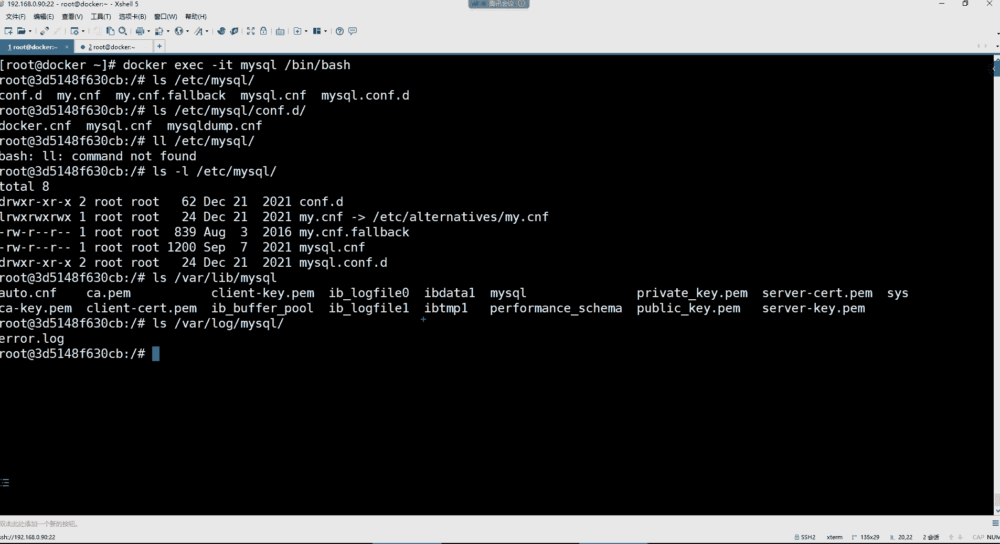

知道吧，所以这个就不需要考。