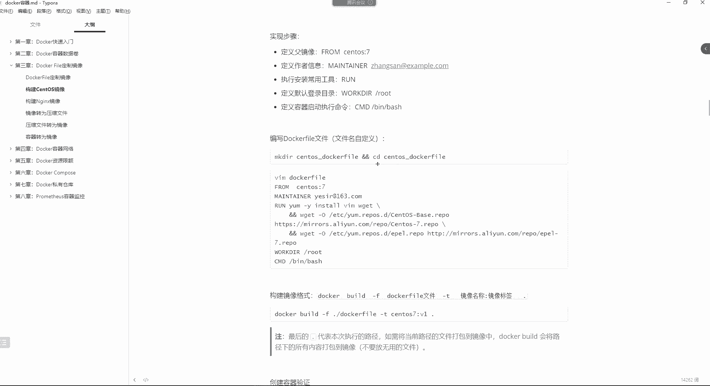
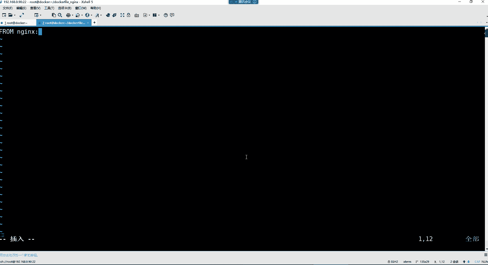

# 零基础入门Linux，红帽认证全套教程！Linux运维工程师的升职加薪宝典！RHCSA+RHCE+中级运维+云计算课程大合集！ - P103：Docker-6.dockerfile定制镜像 - 广厦千万- - BV1ns4y1r7A2

好。哎。这个镜像的定制。来看哈。镜像的定制这个是不是非常好理解呀？先来读一遍。😊，我们呢每次下载镜像的时候，从哪下呀？从docker的镜像仓库中去下载镜像是吧？

但是有的时候你下载的镜像可能说不满足我们自己所需要的这种需求的时候，我们怎么办？我们可以自己去。😊，通过两种方式对镜像进行更改。第一种的话呢就是通过docker file去重新构建一个新的镜像。然后呢。

第二种就是将已经创建的容器转为这个镜像。呃，这个的话呢其实是有一个。哎，在这哈。如果讲镜像的话，这里面会涉及到一些镜像的原理。镜像原理呢就是。首先是这样的，这个我们最后再讲这个镜像的这个原理吧，行吧。

咱们先去制作一下这个镜像。制作经象非常简单。你比如说。

我觉得呀我的那个N这个词。那个镜像。我希望我在用的时候里边就提前给我封装好那个页面，行不行？就里面自带那个页面。因为我们每次都是自己把这个页面同步到那个N6这边。是不是？但是我希望的是什么呢？

就是我用这个NJ4镜像的时候，这里面就带有那个页面。😡，所以我就可以干嘛呢？基于ND镜像，我自己往里面先把这个页面给它构建进去。然后我在创建的时候呢，直接这里面就有那个页面了，是不是可以？

或者说我希望我的这个N6。😊，干嘛呢？就是它的底层系统，我用sintoS。来做它的底层系统。然后到时候在四里面直接提前安装好那个ND那个相关的包。然后我再把这N呃然后我再把这渗透S呢重新给它封装一下。

是不是都可以啊？

哎，所以这个就是我们为什么要去构建这个镜像。那第一种呢，通过这个der feel构建镜像的话，什么叫daer feel呢？大cker file其实就是一个文本文件。

然后我们在文本文件里面呢去写好一条一条构建镜像的那些指令。然后每一条指令呢会帮助我们去构建一层镜像出来。构建。最终呢你的镜像就构建完成了。呃，这指令这里面包含什么呢？说几个常用的哈。

因为指令还是非常多的。但是如果你想了解这个东西，就是官方一般构建镜像的时候，你可以去倒个号吧。😊，我们就拿这个NS来说，你想看看NGS它。官方是怎么构建的？你找随便找个版本哈，比如就这镜像。

但是我现在好像防不过去呢。😊，你看直接跳转到哪儿了呀？是不是叫docker file啊这个页面了。😡，是不是到时候废我。但是不知道能不能访问啊这页面。有点费劲。哎，这个。😔，哎，可以了是吧，你看他哈。

😊，你看其实这就是所谓的docker feel的文件。看到吗？是单ckerfi文件哈，然后它怎么构建呢什么from语句，label语句环境变量。然后呢，到时候呢我这个容器里面运行哪些命令。

容器一启动呢会自动去执行这个ro里面的命令。😊，然后下边这个内容还是非常多的吧，因为毕竟官方官方构建的镜像嘛。然后以及容器启动以后执行的这个命令。那这些语句我们现在看不懂是吧？

所以这里边你比如说这from是干嘛的呢？from是用来指定一个负镜像的。你比如说。😊，这个我想构建一个镜像，但最起码你得有一个底层镜像才行啊。所以你得先通过from指定一个。基础形象。

因为镜像的这个东西呢，它是属于分层。一层一层构建出来，就像我们前面给大家举那个例子，我说他们看的这个镜像。😊，你在下载的时候，你以为真的是只有一个他不开的吗？😡，可不是啊。它底层还有什么JDK环境呢？

底层还有什么？比如说呃如果它是基于什么de半构建的，乌班图构建的，底层还有这个。乌班图的系统环境呢？能理解吧？所以最终呢它是一层一层去进行构建的。所以你的底层环境你得指定到底。

用哪个作为我的底层的基础镜像？然后呢。什么moner，这是用来标明这个docker file是谁写的，这种东西可有可无啊，无所谓了。作者信息嘛，你可以不用标注label标签。

标签就是用来给我的docker file。😊，就是给我这个。

镜像打一个标签，这个标签的话呢在哪儿呢？就最终是在这儿。在这儿。啊，所以这东西你打啊，你这个自己想怎么打就怎么打。

他这里边是我看他是怎么打的呀。Label。那这个无所谓了是吧？无所谓，反正我们到时候这东西想指就指，然后。run呢就是执行命令的一个指令。容器创建过程中会执行很多命令。你像在这里面。

你看这个容器在创建的时候，你看它ron下面要执行非常多的指令，看到了吧？这些命令哈都会去挨个去执行。😊，那我们到时候呢，就是如果你有需要去执行命令的时候，你要在run里边。比如说我要去安装什么软件包啊。

创建一些文件目录啊，都可以放在ro里边。CMDCMD的话呢是容器的启动命令，就是我这个容器在首次启动的时候，你也可以指定先去执行哪些命令。你比如说我重启启动的时候，你先给我执行一个什么呢？😡。

并下到SH。让我容器有一个办事的环境。可不可以也可以。好。嗯。然后还有什么co背， copy背就是复制文件的了。就是你构建镜像的时候，这个你可以把文件复制到你的镜像里边。ADD也一样。

也都是这个往这个文件里面添加一些文件的，一个是复制文件，一个是添加文件。但是ADD的话呢，有的时候你们知道吗？曾经就是有一个学生他在面试的时候，他遇到一个面试题。😊，这命试题呢是怎么问他的呢？

他说我们在通过doerfi构建经营的时候，这个cobe。这个参数和这个ADD这个参数它的区别在哪里呢？你看都是属于往镜像里边添加文件，但是区别在于说co贝这个指令只能。

这个从执行do build所在的主机去读取文件，把文件放在镜像里边。就是说你copy的文件一定是在你的主机里面存在才行。但是ADD不一样ADD这个指令在往镜像里面添加文件的时候。

它可以指定1个URL的远程服务器地址。从远程地址把文件给它添加到你的镜像里面。这是copy跟AD的一个差异啊。哼这就是。😊，所以你发现有的时候面试的时候问的这些问题哈。😊，你觉得这东西没啥是吧？

但是往往体现在就是这细节方面。好，ENV给容器啊给你的这个镜像定一些环境变量。你看比如说N呃N这个死。他是不是自己给自己的这个镜像定了一些环境变量啊？😊，让我的版本。是不是啊？啊。

但这个想怎么定义就怎么定义哈。😊，嗯。剩下还有什么呀？剩下就是。剩下这些都不是这个什么的，都不是常用的了。但是我这表格给你们写的还是算是蛮全面的。然后我们可以来构建一个深陶斯镜像来玩一玩呗，是吧？

我现在构建一个。😊，我现在通过docker feel自定一个四台镜像。但是我们送到这里边默认情况下没有VM命令的，我们来可以先试一下。😊。

Doker。Rrong杠。IT咱们就直接进到容器里面吧，然后杠杠name等于cententOS。然，镜像的话呢是渗头S7。9。好。哎呦错了。他要去拉取镜像去是吧，斯德斯7。9。2009。对。进来了是吧。

进来之后，你看这里面有VM吗？hello点TIT没有是不是啊？😊，好，那没有的话，还有就是说我们在这个森特斯里边的时候，你发现这里边是啥呢？就是。😊，这是我们现在是在根目录里边的。看到了吗？

在根目录里边，我希望。我们首次进到容器的时候。进到的是我自己的加目录。可不可以？并且自带一些常用的工具。你包括什么if confi，你反这都没有。

好。那我就希望什么呢？希望我的这个自定义镜像里面给我自带这些东西。那么这个步骤就是首先。你构建一个镜像，你得指定你用哪个负镜像。所以呢from指定你的副定项，然后作者信息想指就指，不想指就拉倒。

然后到时候呢，我这个。容器。在运行的时候，它首先要帮我执行的命令都有哪些？然后再通过workerDR，这workerDR在这呢。workDR的话呢是指定我们的工作目录的，指定容器内部的工作目录。

这个目录就作为用户首次登录容器时所停留的那个路径。啊，如果你没有创建，则呃，如果没有创建则自动创建。如果指定根的话。啊，反正后边的话呢我们就不用管了，就后边你希望用哪个路径，你就指定路径就可以了。

比如我希望我的首次进入容器的时候，是跟一下的root，就指定root就可以了。然后CMD的话呢，用来指定。比如说我这个容器。运行的时候，首次执行一个败事命令。就具备这种办事的环境。

那这个语法就是我们先去。什么呢？写一个docker feel文件。

反正你建个目录也行。我们先这样，先在我们的物理机里面建一个。make点建一个在跟一下啊，就在我们当前目录吧，建一个docker file目录。然后呢，我们进到这个docker file里边。

然后我们去写一个dcker file的文件。

这文件名非得叫dofi吗？😡，必须得交当时费用哈。😊，然后接下来的话呢。建个目录，然后再CD到这个目录里边，目录名字叫什么无所谓是吧？然后来看一下语法，就是首先指定我的副定项。然后的话呢。

作者信息呢写不写无所谓哈，然后运行哪天命令，给我运行一个ym杠外insVM。😊，这不就安装VM再给我安装一个Wge。😡。

啊，并且的话呢这里边有没有仓库啊，我们来看一下哈，我们这个森屠里面有没有E仓库。😊，应该是有的应该是有4S斯的官方仓库的。但是我不想要深us斯的官方仓库，我想要的是谁呢？阿里的仓库。可不可以。

或者说我企业内蒙的仓库。

那如果你想添加阿里仓库，你是不是就通过Wge把阿里云的。是不是就是miors阿里云的那个那两个，一个是渗托S仓库，一个是epo仓库都给他W get下来不就完事了吗？然后再定一下我的工作目录。

然后再指定我容器首次启动时执行一个bach的命令。是不比较简单。

这是。他是森台斯官方仓库看了吗？ETCER点reD下面，这些都是官方的户，那我们不要。

所以我们自己写一个doou fail，然后这里边。

是不是比较简单？其实这个镜像正常显在公司里边。一般开发自己去构建，我们只是作为了解就行。开发自己的项目，他自己封装到镜，开发自己的项目，自己封装到镜像里边，他自己构建，一般不用我们构建。

那我们这个基础印象是4S47。9点。2009。009。然后保存退出。然后用刀cker。B的这个命令。指定。docker fail一个文件，然后这个。

啊，杠F指定当前路径下的来看一下啊。

命令语法。呃。do build杠F指定我的文件名。然后文件名叫doocfi是吧？就当前路径嘛，当前路径的这个文件，基于这个文件去构建镜像，然后杠T指定你镜像构建出来以后叫啥名，让它叫stoOS冒号。7。

9。可不可以可以。然后后边不要忘了有个点儿。

这个点儿。是。代表本次执行的。路径。那如果你说你我我有些文件也要往这个镜像里边去进行一个打包的话，那这里边。这个录音下有哪些文件，它会自动把这个文件给你放在这个。当然这前面这里边你得有语法才行哈。

你得有那个ADD或者说靠py的语法才行。到时候呢他会把你当前录音下的所有那些文件指定上的那些文件都给你。😊。

拷贝到这个镜像里边，但是我们这里面是不是。没有其他的多余文件的。啊，所以就代表本次执行任务的路径。是当前路径。固件。这个操作。对我们来讲。就是。知道一下。他现在正在安装软件包是吧？好。

然后你看最后如果出现什么success play。就已经构建成功了。那构建成功以后，你docker image看一下有没有一个sinto7。9镜像有。是吧那有这印象，我们现在是不是可以去。😊。

创建一下容器，看能不能用啊。我们把这个前面创建的给它删掉哈。😊，Docker RM。杠F我们前面见啊，退出了，它已经关闭了是吧？doerPS杠A。dockerRM杠就直接删。C透斯这个容器。

然后我们再基于我们前面自己构建的那个镜像，我们自己去创建容器去。呃docker run杠ID杠杠name等于sental7。9。然后嗯。镜像是s透斯冒号7。9。就。创建。创建好了之后。

是不是正在运行着呢？然后进到里边看看。Doker EXEC杠IT。Sals。7。9指定。边一些的事进来之后。有VM吗？hello是不是有？好。我们。验证一下就行哈，然后退出。

有VM有if config吗？啊，没有我们没有按这个包是吧？啊，没有没有安就算了。其实这里边你也可以自己安。因为我们有阿里的仓库了，你看y么。是不明是阿里云的仓库了呀？那你后续可以压么。

ins store安装一个ner杠 toolsth。你自己安不就完事儿了。安装完以后，你就有if confi命令了。

好了吧。哎，所以。这就是。dooucker fail怎么构建运象？那我们我们了解docker file，就是简单了解一下这些东西。到底是干嘛的嘛？是吧真正用不用，其实还是另外一码事儿呢。

到时候我们得知道有这个功能。😡，知道吧？好。然后如果我们想构建NGS镜像呢。你想构建NS镜象，其实也非常简单。你比如说我们再来。😊。

在这儿。

哎，构建安家资金项目，我看看啊，但是我们今天讲不完了，兄弟们。

嗯，其实也快，你看哈我们如果想构建N全的镜像。😊，你看啊这样我们这个。退出退出这个目录哈，我们自己再建个目录。make点建一个docker file。那你S。然后进到这个目录里边。

然后进到这里面自己编写一个dcker file文件。那这里边from指定我的基础金销是谁呀？😡，加S冒号1。22。1。

然后呢。嗯。我要给NS去添加一些页面文件是吧？那页面文件。你得把你的页面文件先放在你的当前路径才行。然后到时候它自动把这个文件添加到你指定的这个位置就行了。

所以我们这边就。ADD点啊，当前路径所有文件放在这个镜像的优色sha NGS的HTM里边。没事儿。简单吗？那咱们是不是得把那个root下的路径下的这些所有的内容。😊，拿到我的当前目录啊。就可以了啊。

就会把这些就会把这路径下的这些文件给它。添加到这个容器里边。所以这时候你在docker。build的时候杠F指定。当前路径下的docker file文件杠T指定NS冒号。V一可以吧，版本当前路径走你。

完事儿。这个过建好了，然后docker。你 image。就有1个NGSV一的这么一个镜像。那这个镜像你在用的时候，doker run杠I。D杠杠name。这name不一定非得用等号，空格也行，指名字。

比如N这杠test，然后杠P端口映射，咱们来个81映射到这个80里边，然后这是镜像是N这冒号V1的版本。可以吧。我们也不做什么数据卷了，就直接验证一下。😊，Doker， P。

ex test里面有没有页面，直接访问就知道了。192点168点0。90的哪个端口，81端口？

看到了吧？

是不是页面直接进来了呀？那这个镜像后续。你拿到什么地方去用，是不是里边就已经有一个现成的页面了呀？没错吧。那如果是time姆ca的镜像呢，人家直接把腕包给你扔在他们ca里面，是不是你把他姆ca拿过去？

😡，就自带他们开的项目了呀。😡，是不是啊？哎。

好。这是。我们这个怎么构建容心性？大写的比须大写哈。😊，我这里边表格里边都是大写的。

那就是大写的，没有小写的这里边。

官方的这些纸令都是大写的，看到吗？呃。然后呢，那对于这个镜像，我们运行以后，比如说你比如说对于N键对于这个ss这个镜那个那个镜像来说哈。😊。

我们现在希望什么呢？第二。圣斗士。变一下的干上。哎，我们那个生团子镜像呢？啊，圣纳是7。9是吧？就是这个这个四代镜箱，我现在觉得有这些工具也不行，我希望这里面给我自带1个NDS，可不可以？😊，や么。

因为我这个容器是不是也可以安装软件包啊，insta按S。杠外。把你私先给我安装一下。

好，有了颜色之后。那接下来我希望直接这个里面有一些页面行不行？因为NS安装完以后，是不是它的页面在。😡，Useer。LoalHTL里边呢。哎。Use a share。你S的。HtM里边。

是不是这里面是它的页面是吧？好，那接下来我希望这个页面，我先把这路径给它清空一下。😊，我直接把我的项目直接拷贝到这个路径，然后把这个容器重新打包一下，可不可以？可以。那我就载我的物理机。这样。

我直接Cp呃docker。CP。我把这个路径下的所有的内容，就先先把这目录给它拷贝到。S透式。7。9这个容器的。哪个路径呢？优色share NGS的唉呃就放在这目录吧，让它拷不进去。Useer。

什么意思？啊，4在是79。拷贝进去，然后看看有没有。好，然后接下来。哎。啥情况？好。MV。把这个路径下的这个目录里的所有内容。给他移动到。这个路径下的HTM里边。Use。什么意思？

CD到 user share。不能有星是吧？I。不能有戏，那只能CP呗，是吧？CP杠R。把。这个mo里的所有。拷贝到HTM里边，这也不能有星啊。这样呢。这不行啊，这这没用啊，这是把目录拷贝过去了。MV。

所有移动到当前。He。😊，真难搞了呀啊，兄弟们。是不是啊？哎，你说这。哼那我们咋。😊，那我们咋办呢？这样吧。把HTL删掉吧。把它改个名行不？改成HTmail。这样是不可以呀？Yes。哎，那里面的东西呢？

哎，里面的东西呢。再拷贝一下哈。哎，我这物理机的页面怎么没了呢？是被我给移动过，是不是啊？CP把。doker fell n里边的。那我就得那我就得换个路径卡位了。

是不是因为我因为我们的页面放在这个目录了。因为刚刚被我移过去了嘛？是不是我我当时在构建镜像的时候，把那个页面，把这些东西都给它移动到这个路径里面了呀？😊，是吧这里面才有页面嘛？然后呢。

在MV把这个路径下的所有移动到HtM里边。我怎么移动都不让移呢，就很怪异嘛。然后再把这个docker file删掉，再进到Ht mail里边。这里面把那docker file文件给它删掉。

2M杠2Fdocker file。是不是就剩下就页面了呀？好，那接下来这个里面就有页面了。😊，有页面之后，我们这边把NS服务起来。😊，Td。起不起伏呢？起不写都无所谓。是不是啊？呃，起来吧。I。

这好像好像有点不太现实哈。这样玩好像不太行。好像不太行哈。这容器毕竟跟我们的这个完整系统还不太一样。我们这样封装其实。不合理。还是还是别这样搞了，这样搞不合理哈。

不合理。你想想是不是啊？因为毕竟它是一个经典版的，你在里边额外安装一个包，你这种二次构建。确实不合理。所以还是别那样搞了哈。像我们前面这种。像我们前面这种构建的这种方法，大家了解一下。

就是是可以这样用就可以了。好了，然后这个还有就是这个镜像转为压缩文件啊，压缩文件转为镜像啊这些。😊，可以把速主机的环境做成镜像吗？那构建起来是非常之麻烦的哈。😊，所以这个的话呢，一般运维在这方面其实。

操作不多。我们操作这个镜像这方面不多。因为这镜像一般都是这种镜像都是开发，他自己弄好了，你直接把镜像拿过来用就可以了。所以在公司里面也不需要你做镜像。

所以我们说这个构建经像这步分呢呃对于我们来讲不是什么非常重要的内容哈。😊，哎。好了，那我们今天就讲到这儿吧，再再讲的话太晚了哈，时间太晚不行。😊，把录屏停掉了。

