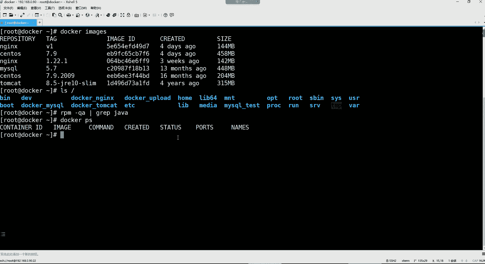
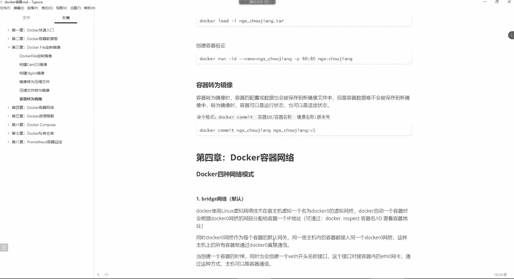

# 零基础入门Linux，红帽认证全套教程！Linux运维工程师的升职加薪宝典！RHCSA+RHCE+中级运维+云计算课程大合集！ - P104：Docker-7.镜像原理、镜像转为压缩文件、压缩文件转为镜像、容器转为镜像 - 广厦千万- - BV1ns4y1r7A2

都OK是吧？好，那咱们就开始吧。

我们上节课是。好，我们这个机器哈，我们上节课讲到了哪里来着？讲到这个构建镜像是不是啊？😊。

啊，然后构建镜像我们构建了几个镜像，我们看一眼啊，der image。好，我们是构建了1个NES的镜像，然后又构建了一个stoOS的一个镜像。这是我们自己构建的是吧？呃，其实像这种底层的系统镜象。

其实我们一般不需要去构建它，因为没有那种需求啊。如果是构建的话，其实也就是针对于什么呢？针对于一些服务去什么呢？去按照我们的需求去自己构建一下。啊，然后我们这个构建镜像的时候呢。

这里面还会有一些理论知识。我们呢没给大家讲到啊，是上节课没有讲到的内容。呃，这里面就会涉及到一些镜像的原理。呃，镜像的原理的话呢，这里边。

首先你看啊，我们现在拿哪个镜像来说呢？就拿这个嗯time们 cut这个镜像来说吧。你看他们 cut这个镜像，我们在看的时候，我们看一下它的大小哈，你看是多少啊，是315兆，你发现这个镜像怎么这么大呀？

😊，是不是？好，那我们平时比如说我们在虚拟机里边，我们在用这个t cat的时候，我们有没有印象啊？就是这个t cat这个包总共才多大呀？你看我们原先在讲这个CID的时候。

你看一下我们是不是用到了这个汤ca的这个包啊。没错吧好，那这个包的大小你看一下它是多大的呀。他才哎这不是哈。To cat。好，您看一下这一个t cat的软件包，它的大小才。说白了还十几兆。是不是啊？

但是为什么我们在使用这个t cat以容器的方式去下载它镜像的时候，它的镜像怎么差这么多呀？是不是啊那一个软件一一个这种软件包。十多兆，但是呢一个镜像文件好几百兆。

那你说这个镜像里面怎么会有这么多的东西啊？

所以这就我们会涉及到一些镜像的原理。呃，那这个镜像的原理呢，首先我们先说一下哈，就是。😊，连就这个系统它本身是有。boot FS和这个root FS这两部分组成。那这个boot FS是什么呢？

就是我们所说的这个系统里的内核啊，以及我们系统里边的那个开机启动时候的一些系统引导程序啊，包括什么gra这些引导程序，这种呢都是属于boot FS。那另外呢还有这个root FS。

你像这个root FS，它就是我们在这个系统内核之上。所用到的那些不同的发行版系统了。你比如说像stoOS的呀，乌斑图的呀，deban的sus的等等等等。那这些发行版系统它的大体结构几乎都一样。

你比如说你后期比如啊你比如说你用一个乌斑图的操作系统。你用无斑图操作系统，你发现你在看它的根目录的时候，它的根目录呢也会什么呢？也会有这些。一级目录就是默认情况下啊，你像什么OPT呀，root呀。

还有这个ETC呀，ss目录等等等等。包括什么B目录不同目录这些一级结构啊，或者说这个系统的一个大体的结构。在不同的发行版里边几乎是一样的。

好，所以这个呢就是我们这个系统的组成的两部分，呃，是由这个内核以及引导程序，还有这个在内核之上的各个发行版系统。那么这些系统是不是都是用的同一个内核啊？好，那你看啊那我们如果说再说这个镜像原理的时候。

首先我们要搞清楚docker镜像，我们称之为叫做精华版的虚拟机。那这个精华版的讯机到底精华在哪里了呢？啊，所以这个刀刻经验它的本质其实是一个叠加的文件系统。它说怎么叠加的呢？

就是它的最外层是宿主机的那个boot FS，就是我们的系统内核以及一些引导程序。这个呢我们称之为叫做负镜像。也就是说在这个镜像里面，其实是包在这个镜像里边哈。

它这个因为这个机呃因为这个容器呢本身是共用我们这个底层同一个系统内核的。所以在这个镜像里边，其实呢它压根呢是不会有这个botFS的。因为这个botFS是共用的同一个物理机的。

但是呢在这个boot FS之上有什么呢？就它的第二层其实就是我们的这个镜像了啊，这个镜像里边比如说我们要去这个下载一个t cat的镜像。那首先你在下载这个tca镜像的时候，你要知道这个镜像内部。

其实它是包含了这个root FS的。也就是说，不同版本的发行系统。已经在这个镜像里边已经包含了。你像什么stoOS啊无班图等等等等。这是在镜像里面存在的，而这个的话呢是属于我们镜像的负镜像。

就是我们的底层系统内核。它呢并没有在镜像里边存在。好，那再往上是什么呢？再往上就是叠加的其他的镜像文件。你比如说我要下载一个t cat好，那你下载t cut，你要知道。

这个他们开的镜像里面也给你包含了JDK的环境了。然后呢，在JK之上呢，就是这个t们 cat的镜像了。而这就其实就是他们开的程序了。好，那你想想，那我们在下载一个他们开的镜像的时候。在我们的这个系统里边。

我们有安装过那个GDK环境吗？没有吧。你看你有那个这个java的。open这DK吗？有吗？没有，我们说并没有安装过呀，那你如我们并没有安装，为什么他们ca它能够在我的系统里面运行起来呢？😡，啊。

因为这个time们 cat。在它的这个镜像里边有JDK的环境。而这个他们看的程序在运行的时候。它只需要去干嘛呢？只需要自己容器内部的环境就可以了。它不依赖于我这个外部系统里面的这个环境。能理解吧？

所以就是说也不难理解，com们 cat它本身运行在1个GDK的环境下面。但是呢我们从始至终都没有在我们的docker中，在就在我们的这个速主机当中安装过GDK的环境，那么它也能够运行，是不是？啊。

就是因为它里面已经包含了，所以你发现你看啊你比如说。我们在看他们开到一个二进制包的时候，可能说也就是十几兆。但是呢。而这镜像里面除了有t们ca的程序以外，还有什么呀？还有它的JDK，还有呢它底层的。

那个叫做rootFS。所以这些叠加到一块儿。😡，才能够变成一个完整的镜像。所以你看这个镜像的本质，是不是就是一个叠加的文件系统啊？啊，加在一块多，可能就得有就得有个300多兆了。

你比如说我这个底层的rootFS。可能说就得占用个200多兆的一个空间。那JDK的话呢，再占用个几十兆。然后他们看到呢再占用个几十兆，加到一块堆儿啊，就300多兆，是不是啊啊，所以这个镜像的一些原理呢。

我们要给它搞清楚啊，但是这个镜像呢它本身是只读的，就是我们这镜像，你看你下载下来以后，你能够去。修改这个镜像吗？不能是不是啊你拿过来只能是什么呢？去直接用它，你改变不了里边的那些配置了。

但你说我如果就想改变里面的配置怎么办呢？我们是不是就可以自己去构建这个镜像啊，你比如像前面的NGS1样。😊，我可以去构建它。不FS有多大，我们的系统内核，我们系统内核也就是。😊，200多兆。啊。

甚至都不到200多兆哈，一个系统内核。那么你看我们对于这个NDS这个镜像，我们是不是就可以自己构建呢？啊，但是你只能是在现有的基础上去干嘛呀，去再去构建一个新的镜像。但是你不能对这个原有的镜像去修改。

没错吧，所以这个镜像呢它本身是只读的，你是改变不了的。那么我就想改变它，那我们是不是可以去干嘛呢？去。这个前面自己构建的，但是还有一种方法，什么方法呢？就是。容器它本身是可洗的容器。

就是你基于镜像创建了容器之后，我们是不是就可以往容器里边，比如说去发布一些项目啊，或者说对容器里的配置做一些修改呀。所以容器是可写的。好，那容器可写的，我最终还可以干嘛呢？

还可以把这个可写的容器再给它导成一个新的镜像出来。就是我对容器。做了修改。好，然后呢再把修改后的容器给它变成一个新的镜像。好，那这个新的景象我最终。就可以拿过来用了，或者说我这新的镜像我可以打个包。

然后呢干嘛呢？再给他。😊，导出为另外一个镜像。这就是我们所说的这个镜像。以及镜像的一些基本原理。所以这里面呢大家一定要记住的是什么？就是一镜像，它的本质就是一个叠加的文件系统。

最底层就是我们的这个系统内核。然后再往上呢就是镜像内部所包含的这些，包括入台牌啊，以及我这个在这个镜像里边的程序运行的时候所需要的一些基础环境。😊，啊，但是这些呢都是只读的。变成容器以后呢，你可以去。

对这个容器啊做一些修改，然后再导出一个新的镜像来。然，再给它保存下来。好。那接下来呢咱们就前面我们是通过do时 fail，已经是构建了一些基础镜像了，是不是啊？

那接下来呢咱们再来给大家说说我们这个镜像构建出来之后，我怎么才能给它。变成一个压缩包。变成压缩包以后的话呢，那这个东西后续不是就可以给它保留下来了呀，就传给别人了吗？好。

所以接下来呢你看我们前面自己构建了1个N9S镜像。那我现在就想把这个NGS这镜像，我想给它保留下来。因为这个NS里面有什么呀？😊。

我们dockerPS看一下哈，我们没有容器运行是吧？好，那我们就拿这个NS这个镜像来说吧。

啊。等会儿啊。嗯。

我们一会儿再说这个容器怎么转为镜像啊，我们先把这个镜像呢给它转成压缩包。

现在这个镜像我要转压缩包用的命令格式是这样的，就是用doker save杠O，这个非常简单，跟上压缩文件的名称。然后后面呢再指定。你的那个。

镜像名以及你那个镜像的版本。所以你看哈这里边。😊，我现在想把NSVE这个镜像给它打成一个包的话，那我本地是好，就在这个目录吧，然后docker。C5杠O指定打爆以后叫什么呢？叫NS点他。

这个名字叫什么都行哈。😊，然后呢，这个后边再指定我要对NGSV一这个镜像。去打包。有些慢。但这个不应该这么卖。好，来看一下啊。你看他现在是不是我这个系统里面就有一个叫做NGS点pa的这么一个压缩包了呀？

好，那这个压缩包有了以后，我是不是可以给它保留下来呀？啊，或者说我们就直接把我们系统里边的这个N加SV1这个镜像，我们给它删掉，然后咱们再把它给它导入到我的系统里边。😊，好，那这时候。

dockerRMI我们还是第一次删镜像是吧，用RMI然后跟上NS冒号V1，把这项给它删掉。呃，他说什么？你要是。NSV1这个有容器是吧？就是说我们前面是基于这个镜像创建过容器，看一下哈。😊，嗯。

哪个是基于那个镜像创建的呀？这个是不是得给它删掉。就是你这个镜像，你在删之前，如果有些容器是基于那个镜像构建的，你看他就不让你删。所以呢我们得先把这个容器给它。先给它干掉doker RM。

N这个是杠test。啊，上来以后呢，我们再把那个镜像再给它删掉，这就没了。删了之后呢，我们再去。看一眼。是不是那个镜像就没了呀？好，没了之后，我们接来。我是不是有压缩包啊，我就可以把这个压缩包再导进来。

我就有镜像了啊啊droer怎么往系统里面导呢？load杠I。用这个选项。然后呢，指定压缩包的名字回车。好，那他就帮我们把这个压缩包里的镜像导到了我们的系统里面了。

然后你dockerPSdocker image。看一下。是不是这个镜像现在又回来了呀？😊，那你是不是就可以用它了呀？那能不能正常使用呢？现在你可以dcker run一下。呃，我们在run之前。

我们前面有好多的这个容器是吧？端口别搞冲突了哈。😊，啊，端口不能冲突，名字的话呢别搞冲突了。有一个叫NGS的，那们就docker run。杠ID杠杠name等于N这个是。杠抽奖。

这里面是不是有个抽奖页面呢？好，然后呢指定。端口映射我们用哪个端口呢？88映射到这个容器的80里边。然后镜像是N加S冒号版本V1。好，创建好之后呢，我们来看一下。88端口映射，然后呢，运行起来以后呢。

咱们去访问一下，看看。

是否就是我们前面自己构建的那个形象。192的168。0。90端口是。88。

这里面有页面是吧？有这个抽奖页面。哎，是不是可以正常去使用啊？

你就说呃当我们如果有这种需求的话，我们就可以干嘛呢？就是把想想把这个镜像给它保留下来的话，你就可以通过这种方法，do save就把这个呃镜像给它先。导成一个压缩包。好。

然后呢再把这个压缩包呢再给它转为镜像。其实说白了就是给它导入到我的系统里边。就是用dper load。杠I跟上你的压缩文件的名称就可以了。啊，然后你再去验证一下能不能正常使用就可以了。行，这是那个。呃。

容器镜像怎么去转为压缩文件是吧？那如果我这个容器，我想转成镜像呢，你看我现在这个容器比如运行了，然后呢，我们这样我们dockerEXEC杠IT进到这个里边，S杠。

抽奖指定电缘线的拜事。好，进来之后，你比如说我们对这个按全色这个配置做了一些修改。啊，虽然说这里面没有什么VI工具是吧？那没关系哈，我们就这样，我们CD到它的user share NS的HtL里边。

咱们在里边随便艾一个页面。😊，我们就做一个测试。比如说嗯。hello，点点点儿。点点点儿。然后给他写入到一个叫做。hello点HTM文件里边。然后看一下，那你看我现在对于我们的这个容器，它的网页目录。

我是不是给它增加了一个页面文件呢？好，那我现在呢。退出这个容器。推出容器的话呢，我现在这个容器就是被我做呃被我修改了。修改之后呢，我想基于现有的修改，把这个容器给它保留下来。

那这个时候就是容器转镜像。容器转向转线的话，呢看容器，如果我们是容器转成镜像的话，那容器的。配置。或数据也会保存到新的镜像里边。也是说因为我们容器是可写的嘛。然后呢，但是如果你的容器里面有数据卷的话。

注意数据卷是不会保存到你的镜像里面的。比如时候数据卷的配置就失效了。所以我们在像我们前面学完这个数据卷的时候，可能有的同学说哎那我这个容器如果我做完数据卷了，我到时候给他。保留下来。

后续是不是就直接部署起来非常省事了呀，就不用再自己指定数据点的配置了呀。这个不行。啊，所以这个数据卷哈配置将丢失。然后呢，我们再把这个容器转为镜像的时候，你的容器可以是运行状态，也可以是退出状态。

这个无所谓。所以这个命令格式用dcker commit。然后指定我们的这个容器ID或者容器名称都可以。然后最后再指定你要导成的这个镜像叫什么，以及版本是多少。那我们就看一下啊，我们的这个容器。

是叫做NGS杠抽奖，那就doker。Pmit。然后那我们这个。N这个杠。抽奖然后导出叫什么呢？我们也让它叫做，比如说这个N下划线抽奖版本多少呢？版本V2。可以吧，回车。

那这时候我们在dcker image看一下，你发现现在是不是就有一个叫做N抽奖，然后版本是V2的这么一个镜像了呀。而，这是我们约这是我们现在正在用的这个镜像。好，那我们现在干嘛呢？再把这个刚刚。

从容器保存出来的这镜像，我们给它创建一下，咱们看看里面的配置还在不在。好吧，这dockerron杠ID杠杆name等于。嗯。就让他叫抽奖吧，然后。做个端口右射。指定89映射到80里边。然后镜像的名字是。

N这个4。抽奖版本V2。创建一下，创建完了以后，我们这时候是不要么是直接进去，要么是访问都行。看下他的状态。啊，是抽奖的这个容器，现在也是运行了。然后我们进到里面看看那个页面还在不在EXEC杠IT。然。

是。抽奖。变携的代质。好，进来了进来我们现在验证什么呢？是不是就验证user share NSHT mail里边有没有我们前面写入的那个文件不就完事了吗？是不是有啊？好，那你访问其实也能访得到的。

只不过端口是不是就得换成89了呀？😊。

好，89，但是你后边如果再访问的时候，是不是得跟上那个页面名字啊，叫做。

hello，点儿。H T mail。是不是不是就是我们刚刚自己建的那个页面呢？所以这种方法呢就是像我刚刚给大家所说的，就是我如果需要把什么呢？

我如果需要把我的容器。给他导成一个新的镜像。那你就这样干就可以了。好，导上一个新的新的酱之后，那我这个镜像我想保留下来。😊，那咋办呢？我们退出啊。啊他现在已经是变成一个新的镜像了。好。

那我现在就是想把这个镜像给它保留下来，那你是不是就可以当er？😊，sve杠O。然后指定。我这个呃压缩包呢就它叫N。抽奖点儿他。然后要保留的这个镜像。或者要打包的镜像，就是这个N就抽奖V2。好。完事了吧。

然后看下效果是不是？我现在又把这个新的镜像给它打上了一个压缩包了呀。那这个压缩包我是不是后续也可以保留下来了呀？

好，这个就是我们所说的。我们针对这个镜像的一些。相关的内容。从构建镜像以及呢呃对镜像做一些这个一系列的。这个导入导出。好，我们把这段给它停一下哈。

