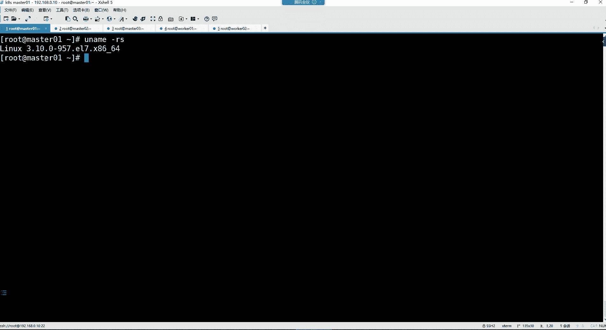
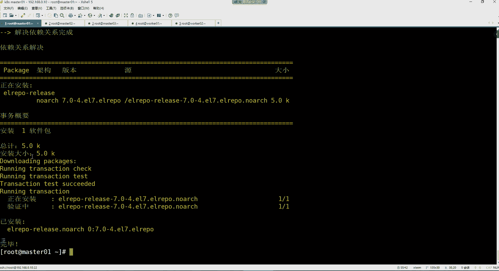

# 零基础入门Linux，红帽认证全套教程！Linux运维工程师的升职加薪宝典！RHCSA+RHCE+中级运维+云计算课程大合集！ - P105：K8S-1.k8s概念、k8s集群环境准备 - 广厦千万- - BV1ns4y1r7A2

好， hello hello，大家晚上好啊，能听到我这边的声音吗？听到声音的兄弟刷个一，开始咱们今天晚上的课程。😊，好，没有问题是吧？这个建服啊建服，你这是得多久没学习了呀，这是得多久没听课了。

我们这课都讲都讲到K了，他还停留在那个ja那个阶段呢，是不是啊？😊。

这个。啊，今天情人节是吧，都过节去了是吧？啊，我说这个确实人相对来讲有些少是吧？啊，原来是这么回事啊，今天是情人节哎呀。😊，哎呀，那我们这帮大老爷们儿在这儿学习的这些人，这是啥情况啊？

是因为我们爱学习呀，还是因为我们这个是不是都是一帮单身狗啊，但我觉得应该。😊，这个第二种情况。应该会比较多一些是吧？抱团取暖来了啊，所以我所以我就平时我就就经常我就跟你们说，我说这个你看一到这个节日。

你发现我们就就感觉特别的空虚，是不是啊？😊，所以你们也一样哈，人这一辈子就那么年轻，就那么几十年。所以。😊，诶该。谈女朋友就谈女朋友是吧，别等你老了的时候，你那时候你找女朋友，那哪有女朋友啊。

是不是啊那都不顶棘手的了啊，所以人这一辈子不要等不要等什么有时间，等下次等有条件的，等有机会的，或者说等我有钱的，我跟你讲哈，哎，最终你会发现你呀等来的都是一堆遗憾，就找对象，他就像上公共厕所。

你打开一个门，你嫌弃这里边有屎，你就打开另外一个门啊，你就嫌你就嫌这里边没纸然后你打开第三个门，你发现这里边是既有屎又没纸。那这时候呢啊你就回头去打开前两个门的时候，你就发现哎这里边有人了，是吧？

所以就不要等喜欢就去表白是吧？你约他见面，见面了呢，你就亲他是吧？就该亲就亲，该抱就抱是吧？他要喜欢你他也不会拒绝你的。如果他不喜欢你就算拒绝了，你亲也亲了，抱也抱了，是不是你。😊，那也没啥遗憾了。

那大不了就是说连朋友也做不成呗啊，关键你这做朋友也没用啊，是吧？你又不缺这个朋友。😊，所以我们说这个男人和女人谈恋爱，我们就是为了什么呀？好色是吧？你就是想跟人家。😊，是吧在一起是不是？嗯。

所以你说你不想跟人在一起，你谈什么恋爱呀？😊，所以我们都是躁动的年纪是吧？就得我们说这个。😊，不能。😀呵。😊，不能羡慕别人是，自己也得动起来呀。😡，如果如果我今天要是有女朋友的话。

我才不在这跟你们讲课呢。我宁愿请假，我得陪女朋友去啥过节。能能动嘴。对，就别耍一些花招式，没有意义是吧？哎呀，所以你们呢。不行，你们这不行啊啊，这大过节的这怎么这一个个的还来听课学习，是不是？那学吧。

😊。

反正。这个在短时间内可能也没有办法改变啊，那我们就只能学习呀是吧？假装我们很爱学习，给自己找一个单身的理由吧，是不是啊？😊，对。哎，然后这个。咱们开始吧，好吧，咱们就话不多说，我们直接开讲讲这个K8S。

😊，嗯。已经不叫女朋友了是吧，😊，对这不情人节嘛？这情人节谁让你去跟女朋友去过节，情人节情人节，你知道吗？😡。

那女朋友叫情人吗？是吧，那媳妇儿也不叫情人呢。所以这你得明白，这情人节是给情人之间在一起过的一个节日。如果那你要是没有的话，我们就学习是吧？😊，听课能忘记痛苦啊，我觉得也是挺好啊。哎。

然后咱们来讲这个K8S。😊，这个课程呢可以说是大家在这个运维这个行业里边哈算是非常非常重要的一个技础了。因为现在如果我们去往这个运维这个领域去找工作的时候。

那这个K8S相关的问题几乎是家家必问的一个相关的非常重要的一个基础部分。所以你看我们这个KPSS这部分大家就得好好学啊，好好听。😊，多去理解，多去思考，多去实践啊，就是这个一听二学三十三十践啊。

这样才可以哈，把这个东西搞明白，那你找工作就会很轻松。😊，KPS是什么呢？我们来这个前面已经学过了docker了是吧？那讲docker这个docker跟K8之间他们有什么关系呢？

首先你要知道我们在企业里边，如果是真的是用容器的话，这个容器如果一旦涉及到集群怎么办呢？我现在是有一套容器的集群。比如我比如我们公司有200台服务器。然后这200台服务器里面呢。

我们所有的业务都是以容器的方式在运行的话，那么这200台机器里的。比如说有几百个甚至上千个容器，我们应该怎么去管理它呢？😊，是不是？那这个。就会用到K8S了。所以K8S它是什么呢？

它是一个容器的编排工具。好，那对于K84首先。

是2015年，由google公司基于购语言编写的一个开源的容器集群的编排系统。然后它的全名叫做科bernet，我们简称叫做K8S。呃，为什么非得简称叫K8S呢？其实官方给的解释非常的简单。

就是K和S之间有8个字母，我们就叫它K8S啊，因为它这个全称呢感觉不太好读似的，叫科bernet。不方便大家记忆。然后kerbonnet呢，这个容器编排工具，它解决的问题就是我们在企业当中。

我们面对大量的容器的时候，我们想去统一管理，那么它就可以帮我们实现。所以你看它这名字叫做容器集群，看了吗？这里面哈就这四个字是关键字，是一个容器的集群的一个编排系统。什么叫编排。其实就是管理的意思。好。

那么KPS呢它是本身呢是基于google公司内部的一个博格系统二次开发的一个版本。这个博格系统大家可能没有听过，因为博格系统呢它本身并不是一个开源的一个技术。

但是这个技术呢是在公呃是在这个google公司内部是一套非常成熟的，就专门针对于容器集群进行能够统一管理的这么一个系统。然后名字叫博格。而KPS呢就是基于这个博格系统二开的。

所以呢KPS呢它集成了博格系统的大部分优势。这个博格系统啊在google公司成立的比较早。你看容器技术，我们前面给大家讲docker的时候，其实docker是。

docker技术在这个行业里边是从这个2014年的时候才开始被行业所认可啊，也就是2014年才算是被大家广泛应用。呃，然后刀客这个技术出来以后呢，很多公司就开始使用这个容器去什么呢？部署我们的应用了。

但是呢大家都觉得容器虽好，但是容器的管理啊是个问题，怎么是个问题呢？就是当我的容器数量一旦变多的时候，我们怎么样才能够统一管理这些东西呢？所以docker所以docker他们家。

你们还记不记得我前面跟你们讲过，我说这个docker里面有一个叫做docker swam的那个其实是docker公司自己家的一个容器编排系统，就是可以实现对容器进行一个统一管理的。

但是呢这个doer sm至今为止没有流行起来，没有大家认啊被没有被大家广泛认可的原因就是。呃，由于这个K8S的诞生吧，可以说是导致了doker sm。他现在已经算是一个怎么说，就是呃还没有流行起来。

就已经胎死腹中的这么一个技术了。因为这个。K8S它的诞生是基于自己家一个非常成熟的一个项目。这个项目呢可以说是在2004年的时候啊，就已经被google公司投入到生产环境了。

你要知道我们对于容器的认识是在2014年以后有了docker之后，我们才知道有容器这个东西的。但是google公司呢是在2004年的时候，人家。公司里边就已经广泛的去使用这个容器技术了。

也就是说人家的技术比我们。早了10年。能列了吧。所以这个。包格系统呢在这个2004年的时候，就已经算是一个非常成熟的项目。而这个系统的话呢。

据说哈在google公司内部能够在一周的时间内创建与销毁数十亿个容器。非常牛逼吧，而且都是自动化管理的，它不需要你去手动参与哈自动化管理。所以这就是K8S。😊，啊，它的一个基本的介绍。

然后它的官方地址呢是这个叫科bernet点IO。我们可以访问一下。其实对于KPS的介绍，你现在如果去网上一搜啊，几乎不下于几篇几呃，就是好几千篇文章去介绍这个KPS。科宝net点IO。

然后他的官方地址给我们提供了中文的文档了，我们可以来点它的这个documentation。然后这里面呢你再给它选择成中文。就可以了。好，然后它这里面是有针对于自己KPS的一个介绍。

这个介绍的话呢呃在入门里边还是在概念里边哈，我们可以看一下，这是概述，看到了吧？啊概述的话呢，我们可以先去看什么呢？先看看它的这个组件。😊，嗯，看组件不行。在入门里边我看看啊。

他原先是针对自己的这东西有一个详细的介绍的这是组件介绍啊。我们是想了解是就是为什么会有这个技术。容器工作负载。主页科bernet支持的版本。嗯，API科bernet对象。

这个我怎么觉得他这个官方文档好像发生变化了呢？找一找啊。科板net的架构。哎呀，这个我看看在它的概念里边哈，点这个概述吧。😊，我们可以看一下呃，官方是怎么介绍这个东西的。呃，官方是这样介绍。

他说kerbonnet是一个可移植可扩展的一个开源平台，然后用于管理容器化的工作负载和服务，可促进什么声明式配置和自动化，然后扒拉扒拉一大堆。他说kerbonnet拥有一个庞大且快速增长的生态。

其服务支持和工具的使用范围相当广泛。呃，这玩意儿读不懂是不是啊？没关系哈。😊，然后他这时候告诉你了，说科bonnet这个名称是源于希腊语，意为剁手的意思。你看它这个名字哈。

你看doker docker的那个logo是什么呢？docker的logo是一个就是鲸鱼上面载满了集装箱是吧？然后科bernet呢它的话它的logo长什么样子呢？长这个样子，就是一个舵盘一个舵手。

其实就是说在这个容器编排领域，我才是掌舵人啊，或者说在整个容器领域，我就是掌舵人。😊，源于啊就是它的这个名字哈，然后翻译过来叫做舵手或飞行员。然后K8S这个缩写是因为K和S之间有8个字母的关系。

我们就简称叫K8S。然后他说是呃google在2014年开源的一个项目啊，也是跟docker诞生在同一年，然后科bernet建立在google大规模生产工作负在几十年的这个基础上，这个基础是谁呀？

就是他的那个博格系统。然后呢，结合了这个博格系统里边的很多的优势在里边。所以你我们可以这样理解，KPS它不就是一个怎么说呢？背景非常强大。人家背景为什么强大呀？

因为人家背后首先呢google公司就是全球一个非常牛逼的一个科技公司。而且呢人家这个项目呢在公司里边确实是能够解决自己的这个大规模的一个集权管理的一个问题。所以我们可以这样理解，这KPS它就是。

含着金钥匙。诞生的这么一个技术。所以这个技术一诞生就已经碾压了行业里边的非常多的那些容器的编排系统。其实这行业里面不是说只有这个doker官方，他们家有那什么swam那个容器编排系统。

还有很多呢什么阿帕奇公司也也开发了一些容器的编排系统。然后这个亚马逊的AWS他们家也开发了自己的一些容器编排系统，但是最终都没有干过这个KPS。好，然后对于这个一些历史性的东西呢。

我们就没有必要太多的去讲解它，没有必要是吧？我们这个东西呢只要是学这东西到底怎么用，怎么去管理集群，这才是重点。你讲它巴拉巴拉一大堆历史，最终你又不是靠历史挣钱是吧？你又不是干导游先。

你给人讲它的历史就没有必要。然后他这里边也是在针对于这个K8S为什么诞生以及能够解决什么问题，给我们这个从这个什么呢？软件部署时代给我们介绍的。这个软件部署时代，我原先在跟你们讲的时候。

你们应该有印象吧。我说我给你们讲过软件部署，从这个传统的。那种部署，还有到这个虚拟化的部署，还有到这个容器时代的部署，是不是都跟你们讲过呀？那还是而且还是通过一个动态的PPT给你们讲的，应该都记得吧。

是不是？嗯，然后那下面的话呢，他也是在这里面给我们做了一些介绍。然后介绍完之后呢，他说为什么要需要这个科bernet，他能做什么？然后这时候他告诉你，他说容器是打包和运行应用程序的一个比较好的方式。

这个我们深有感触，是吧？我们的程序在容器里边运行，是不是方便管理，而且也清量了呀啊，但是在生产环境中呢？我们需要什么呢？需要管理。😊，运行着应用程序的这个容器，并确保服务不会下线。例如。

如果一个容器发生故障，那则你需要启动另一个容器。那如果此行为交给一个系统去处理，是不是会更加容易一些呢？就是你不是去通过手工的方式去处理的话，让系统自动帮你管理，是不是更加容易一些呢？啊。

所以他告诉你了，他说这就是科bernet要来做的事情。他说我能够给你提供一个可弹性运行分布式系统的一个框架，就是它是一个框架。然后这框架呢会满足你的各种什么扩展需求故障转移。等等等等这些。

那你看这不就是一个专门针对于容器进行管理的一个系统吗？google退出了中国市场是吧，确实然还是世界第一。没错哈。😊，呃，然后对于这个。kerbernet呢它的一些功能或者说特点呢。

你看它也是给我们介绍了。比如说像什么服务发现和负载均衡以及存储编排，自动部署和回滚，自动装箱计算，自我修复密钥与配置管理等这些功能啊，这是它的一个特点，或者说能够给我们提供的功能。啊，对于这个功能呢。

我们不可能通过这个位置给大家讲。因为这个位置讲的话，根本就大家就无法理解了。所以呢我这里边是有一个什么呢？有一个针对于KPS的一个课件的来给你们介绍一下哈。那KPS它本身呢就是一个集群的统一管理系统。

然后它可以在集群的每个节点上对容器进行管理。看到了吗？是集群的一个统一管理系统啊，专门去帮你管理你节点上的容器的。那么那1个K84集群，首先它的组成是由两部分组成的。第一部分呢叫做控制节点mus。

然后另外一部分呢叫做工作节点n这两部分组成。然后每个节点上面需要安装不同的组件。那这个组件呢我们在讲完以后给大家介绍特点哈。😊，这个组件在官方这也是有所介绍的，看着了吗？

copo nineties的组件。这个组件的话呢，他也说了，他说当你部署完科bernet，你便拥有了一个完整的集群。然后下边的话呢，这儿呢是针对它的组件的介绍。

比如说这里边有这个叫做科ber a server，还有ETCD，还有科 scheduleched。还有这个叫做科ber干 controllertroll manager，这些都是集群的组件。好。

那么下面还有什么cloud controller manager，这是针对于云上的，看到吗？是嵌入了特定的一个云平台的一个组件了啊，但这个呢我们用不上。好，那这个这些组件是在哪个节点呢？

官方管它叫做控制平面。那这个控制平面就是我这里面所说的控制节点mat。好，那我们想部署1个K8集群。首先你的集群里边就要有这个控制节点和工作节点n这两部分组成。然后呢，你每个节点按装不同的组件。

那么ma节点，它主要的工作是什么呢？master的工作就是集群的一个管理者。负责整个集群的管理的这叫mas。😡，那ma节点，我们需要安装的组件，刚刚官方是不是也看了呀，有几个呀，123。还有4个是吧。

那这是这个是针对于特定的云平台管理的组件，那我们是不是用不上啊？所以我们如果是这个不在云上的话，那么就这些组件，你就是在云上也是这些组件。因为他说这是特定云看了吗？具体哪个云他好像并没有介绍。

应该也就是自己的什么呃自己家的云平台，或者说像什么亚马逊的AWS云平台。然后单独给你准备的一个组件。而这些组件是我们必须要部署的，总共是4个。那这四个组件的话呢，你看啊首先官方是怎么介绍的呀？看第一个。

他说这个科ber尔杠APIserv，这是首先呢这是控制平面的一个组件。就是说我这个管理节点的一个组件。然后该组件负责公开了科ber nineties APII这是一个。接口这个接口是干嘛的呢？

这个接口是负责处理接受请求的一个接口。好，那你看这就是AP server。但是呢我们不太好理解是吧？所以我告诉你，这个API server入啊，我们就管它叫做集群的管理入口。

然后呢接收用户的指令可以报门。因为它既然是一个入口，那在这入口里边，我们想去对集群操作，那是不是他会给你提供一些比如相关的认证授权呢？没错吧，就是你有没有权限操作我这个集群。😡。

那这个是不是他得去对你进行一个各种认证啊啊，所以这个很正常哈。所以APIserv就是一个集群的一个管理入口。就这么简单去记它就可以啊，因为官方太抽象了，你们肯定是不好记的。然后第二个组件呢。

schedule了schedule官方是怎么介绍的呢？在这儿。叫科ber杠4该对了，这也是控制平面的一个组件，叫负责监视新创建的未指定运行节点的一个po。然后并选择节点来让po在上面运行。

有这个不太理解是吧？我告诉你啊，这个schedule了其实就是什么呢？负责集群的资源调度计算的这么一个组件，它可以干嘛呢？它可以按照预定的自己的内部的调度策略，将po分配到我集群的某一个工作节点上面。

或者说叫做node节点上面。所以说它就是。对集群做资源计算的。我想创建一个应用，那我这个应用，你想想，比如说我现在我有二，我这个集群里面有20台机器，那我这20台机器，你比如说我现在想创建一个应用。

是一个容器的应用哈。那我这个容器的应用最终它到底运行在哪个节点上面呢？😊，那他根根据什么去分配我这个应用到底会分配到哪个节点上面呢？谁去计算呢？比如说哪个节点资源比较充足。

哪个节点资源现在已经是不充足了。所以他就是做资源计算的。好，然后下面这个组件叫conttrol manager  controltl manager这个组件的话呢，在这儿呢。看到吗？

叫curber gun controltroll manager，这也是控制平面的一个组件，叫负责运行控制器进程的。有，那这个。也就是说呃它的功能比较强大一些，为什么呢？

你看因为他告诉你是运行控制器进程的那么控制器都有哪些呀？那K84里边各种控制器非常多，节点控制器任务控制器，什么端点分片控制器，服务账号控制器。

那这么多控制器最终都通通是由一个叫conttrol manager这个组件去负责管理的。所以这个conttrol manager。他是干嘛的呢？我们称之为叫做负责集群程序的部署安排。

以及故障检测、自动扩展滚动更新的这么一个组件。好，然后下边ETCDETCD这个组件是干嘛的呢？😊，ETCD。这个组件呢就是一个，首先它是一个数据库啊，你看我们集群里面最终的数据存在哪儿呢？注意。

它就是我们所有集群数据的一个后台数据库。就是存储我这个集群里的所有数据的那这个数据所有注意哈，所有。好，那这是我们在管理节点。的这这几个1234这么四个组点是吧？那工作节点呢工作节点。node。

那它上面有几个组件啊，它上面比较少，一个、2个、3个。好，那这三个组件分别第一个cropote。啊，这是他说这个clet会在集群中的每一个node上面运行，然后它保障容器都运行在pod当中由。

不太理解是吧？我们来看一下。😊，通俗点去理解kite。首先我们先说一下这个node节点它的作用哈。n节点其实说白了就是真正干活的节点。😊，我们管理节点下发一个任务。😡，那这个任务最终由谁去给我执行啊？

所以就是这个n节点，就是干嘛呢？去接收ma分配的工作，然后呢，负责运行容器的。我们的所有容器最终呢都会分配到node节点上面。然后node节点里面的kit这个组件是干嘛的呢？接收master的指令。

接收管理节点的指令。然后呢，通过控制docker对容器进行管理的。也是说，最终的容器是由他去管理的。那么他管理容器，他有能力管理容器吗？他好像没那个能力。它是通过谁去管理容器啊。

它是控制docker去管理容器。所以docker的话呢才是真正在集群节点上对容器做各种管理。比如创建容器、更新容器删除容器等相关的操作的。所以你看在这个官方介绍这个node节点组件的时候。

他并没有给你介绍docker，而是介绍什么呢？他给你介绍的叫做容器运行时。容器运行时是啥？就是容器运行环境。这个容器运行时我们全名叫做cont run time。就说白了就是负责运行容器的软件。

那哪个软件可以去运行这个容器啊？好，docker就是其中之一，但是你注意。刀ker只是其中之一，而这个容器运行时的软件，官方这可是有所介绍啊。我们可以点到这个里面。呃。这个容器运行时呃。这里边的话。

我们一会儿再说吧，这他给我跳转到get hub了，你知道吗？😡，好，我们一会儿再说啊，一会儿在别的地方它是有介绍的。在这容器里边哈，有这个你看容器运行时的类都有哪些？我可以看一下啊。嗯。来看一下啊。

你比如说对于容器运营时来讲，容器运营时呢。有叫做coner d的，它的功能跟docker是一样的，都是可以帮我们去管理容器的。然后还有像什么CRIO这个呢也是跟docker的功能是一样的。

都是可以去帮助KS去管理容器的。但是为什么官方他好像没有介绍这个docker啊，是吧？他有介绍什么contDCRAO其实这个如果大家。有想去考红帽的那个RHCE那个认证的话。在RCE认证里面。

现在呢红帽官方也增加了一个容器的。运行时的软件叫做。嗯。跑的慢。叫portman哈。portman的话呢是红帽他们家自己研发的一个。😊，专门去管理容器的。其实这些呢跟docker的功能最终都是一样的。

docker可以管理容器，port慢也可以管理容器。还有呢就是这个conD也可以管理容器CRIO也可以管理容器。这些都叫容器运营时软件。他们吵架了吗。

我们一会儿再说他的一些这个容器运行时的一些这个问题哈，一会儿再说。然后接下来呢，我们来说说那个。这几个组件还有一个是叫做coverberpro。cur pro它是负责在node节点对外接收用户请求的啊。

那你看这不就是一个代理嘛，这个名字翻译过来不就代理的意思吗？所以你看这以上对于这个。mas的节点和这个no节点是不是就是由这些组件去组成的呀，组成了一个集群。然后每个节点呢你安装不同的组件就行了。

但是这每个组件如果我们真的是这样讲的话，你们能理解吗？你们根本都不理解他们之间到底是怎么工作的，是吧？所以最终的话呢呃我们干嘛呢？😡，来给大家讲一讲这几个组件是如何工作的哈。看我这个图啊。

我这个图可以说是在行业里面都是非常牛逼的一个图了。能够以这种方式能够给你们去讲解每一个组件，他们之间是怎么工作的这是。我当时画的话，画这个图就用了好长一段时间哈，得画了小半天吧。首先我们看一下这张图。

这张图的话呢就是1个K84集群。然后这个集群的话呢，首先。有几个节点呢？有3个，你看这是一个ma的节点，然后这是note1note2，就是两个工作节点。好，mas节点不就是一个集群的管理者嘛？

管理我的整个集群的啊，包括这两个工作节点都由他去管理。然后呢，每个节点都是有。不同的组件mas的节点有几个呀，是不是AP server啊？😡，我们前面在官方看的时候，是不是？

APPS server是在ma节点的组件ETCD也是ma节点的组件。然后schedule了也是ma节点的组件，还有这个controlll manager这四个组件啊。

那你看啊我们在ma节点是不是有这四个组件，第一个组件AP server简称。集群管理入口。schedular呢简称是对我集群的各种资源进行调度计算的。

然后contrl manager呢是负责程序部署安排的ETCD是存储我整个集群数据的这四个组件。好，那我们先说一下，就比如说我现在想我的集群里面部署一个容器的应用，部署一个网站，要以容器的方式去部署。

好，那我这个网站最终它得运行在哪个节点呢？注意它不是运行在master节点，它是运行在你的这两个工作节点上面。好，那这两个工作节点最终到底由哪个节点去负责运行这个网站呢？好，那看哈第一步。

我们想要去往集群里边部署一个网站的话，那首先我们是不是得向集群里面发送命令啊，得通过KPSS的管理命令告诉我这个集群，我要去部署一个网站了。这么一个程序。好，那这时候我们的指令就由API思路去接收。

你的指令哈是由AP server去接收的，因为它是集群的入口嘛，它接收到你的指令之后，那么它接下来干嘛呢？AP server就会帮助我们去调用sched的这个组件。sky这个组件呢是对资源进行调度计算。

什么叫资源？我告诉你，你想部署一个网站，这个网站在我们的KPS里面就叫一个资源。好，那就说我现在。要对这个网站这个程序去做一个计算，计算什么呢？计算它到底运行在我的哪个工作节点上面。

要他去帮你去计算去哈，那他计算归计算，他这个计算得需要数据啊。你比如这个节点它的一个资源利用率。😊，是当前是什么状态？那这个节点当前的资源利用率是什么状态？

那你想想他是不是得能够知道我的每个节点的一个什么呢？一个信息呀。所以呢这个schedule它就会去跑到ETCD这个数据库里边去干嘛呢？去查询我们当前整个集群的这个每个节点的一个资源情况。然后呢。

经过自己的内部算法去对我们这个网站这个程序。去进行一个分配。好，那比如说他现在经过计算以后啊。😡，呃，他准备要把这个网站这个程序呢要给他分配到node一这个节点上面去。那这个时候注意他只负责计算。

就像公司里的会计一样，他只负责计算。他计算完以后呢，他会把结果再告诉谁呢？再告诉这个AP server。然后当AP server入它得到了这个schedule的反馈之后，那AP server入呢再去。

调用contrl manager这个组件，这个组件的话呢就是程序部署安排的嘛，他干嘛呢？是他去负责把这个网站这个程序给他分配到这个node一这个节点去，知道吧？好，也就说他是负责程序部署安排的。好。

那他把这个程序给它部署到这个呃或者说给它分配到node一之后，那我这个note一节点这几个组件。Cpoite。是不是接收ma斯的指令了呀？你mas的节点下发过来一个指令，要在我的节点里面去什么呢？

去运行一个网站这么一个程序。那这个时候crolet。他应该干嘛呢？他就去。调用docker。doker不是在我这个节点里面管理容器的吗？好，他去调用这个docker。

然后呢让docker帮助我们把这个程序以容器的方式给你抛起来。好，那最终我的这个网站就运行在我的这个node一这个节点。啊，这里面是这里面有个po这个概念是吧？那我们先不管它啊。😊，所以你看最终的话呢。

我们如果说对于这么几个组件，总共几个，其实就7个组件。这7个组件。如果我们这样讲解他们之间是如何工作的。哎，现在能看懂吗？看懂的刷个6，看不懂的。刷个7。他们之间怎么工作的这个流程能理顺吗？

能理顺是不是啊？好，那你看最终我这个程序就运行起来了。但是程序运行起来之后，别人想访问你这个网站怎么访问呢？😊，是吧你程序在集群里边，我想访问他。😡，啊，所以呢。

其实在note一节点的这个coverpro，它就是接收用户请求的。最终用户的请求是经由coberpro。就可以访问到我们的这个网站了。因为它是一个代理嘛，用户访问这个代理这个组件。

然后代理呢把用户的请求代理到我的集群内部的某一个真正的程序上面就可以了。所以这就是呃这几个组件，他们分别是。能够实现什么功能，以及每个组组件是如何工作的。这时候就算明白了，是不是啊？好。

那你明白这些之后呢，那KPS它有很多的啥呀？就像官方给我们介绍的。呃，他的什么呢？他的这个在哪来着？もちら。在组件，然后还有一个是。是，不是API吧，不是这个。是在哪个位置了？是在。我们后退一下哈。

再后退一下。这儿好了吗？这儿的话呢。他是有一个介绍的，他说科bernet能够给你提供哪些功能？你比如说像他所说的什么服务发现和负载均衡，以及什么存储编排，什么自动部署和回滚之类的这些巴拉巴拉的。

那么我们对于这些我们应该怎么理解呢？就你现在有一个集群了，你得知道这个集群能够给你提供哪些功能啊，是吧？啊，那这时候你比如说我们说哪个呢？说这个。自我修复吧。😡，咱们先说自我修复哈，官方是这么介绍的。

他说kerbernet将重新启动失败的容器，或者替换容器，杀死不响用用户定义的什么运行状况检查的容器。并且在准备好服务之前，不将其通告给客户端。哎呦，我读着都绕嘴，你们听起来绕不绕嘴啊。

我估计你们都听不懂是吧啊，那咱们说什么叫自我修复，自我修复，我们通俗点来理解，不就是自愈的功能吗？你比如说我现在这个网站出现问题了，出现故障了。好，那什么叫自愈？😡，自于就是你这个容器出现故障了。

我再给你起一个新的出来。😡，然后呢让新的这个网站继续去接收用户请求。是不是这不就自愈吗？😡，没错吧。好。所以这种比较好理解哈，自我修复。然后还有什么呢？就是。😊，这种服发现和负载均衡了。

我们先说这个负载均衡吧，好吧，负载均衡比较好理解一些。你比如说负载均衡，我现在假设我当前啊这个用户访问量突然间暴增了。😊，那我这一个网站比如说能够接收1万个用户请求，但是现在用户量达到了5万了。

那我这一个网站是不是根本就承受不下来呀？😡，那如果承受不下来的话，怎么办呢？没关系。这个的话呢。呃。这个负载均衡，首先它是还有一个功能，什么呢？就是还有一个叫做。扩收容的功能，它本身有扩收容的功能哈。

扩松容是啥意思呢？就是。你比如我当前这个集群的访量突然间暴增，那我这一个程序不够用的话，那么。他会再自动帮你去。按照当前的一个负载压力啊，其实它这个负载压力主要是按照比如按照CPU去进行一个计算的。

就我当前比如说我这个网站，它的CPU利用率已经达到了多少多少了，那就证明这个网站它当前的负载太高了。那我可以根据这个网站的负载量再去扩容新的程序出来。然后呢。

再把这个用户的流量呢再平均的负载到每一个新增加的这个。网站这个程序上边这样就可以实现一个什么呢？叫做负载均衡。当然，这负载均衡的前提是不是它还有一个功能叫做弹性伸缩呀？是不是啊啊。

所以其实它本身也有这种弹性申诉的功能。以及这个负载均衡功能，有了负载均衡，你比如说现在5万个用户。如果说仿我的集群，那我一个网站这个程序可以接收1万个。

那我5万个用户是不是就被分别的由这5个网站这个程序给他接收下来了呀？平均每个程序1万个请求。这就是呃负载均衡功能。然后还有一个就是这个他本身说有一个叫做服务发现是吧？这服务发现是啥意思呢？呃。

服务发现你可以这样理解啊，就是服务与服务之间能够找到自己的所对应的一些。有关联的程序。你比如说我现在这个网站。需要往数据库里面去存储数据的时候，那每个网站的话呢。

它可以基于这种服务发现的方式找到它所定应的程序是哪一个。这种叫做服务发现。然后。还有什么呀？还有一个事叫做。嗯。存储编排这个存储编排给大家说一下啊，存储编排的话呢，它有很多的。

就是它支持的存储方式非常多。你看例如本地存储，还有公有云上的一些存储，你都可以去挂载它。所以说这个存储编排，后续我们在针对于KPS的某些应用，比如需要存储空间的时候，比如说我这个数据库，我这数据库。

比如说我后端挂载了一个存储，这存储可以是本地存储。你像什么NFS啊。或者说sip啊，或者说一些云上的存储都可以。然后后续呢我们在针对于这个数据库再给它分配存储空间的时候，它是可以。自动去申请。

比如说我需要多少存储空间，然后我这个K84集群呢就会自动给它分配存储空间。这种叫做存储编排。好，然后其他也没什么了，不就是这么些吗？还有什么密钥与配置管理。这些的话呢，我们现在就不适合讲了。

因为KPS它有很多的概念是我们在前边的课程里面没有设计过的。所以有很多的概念是非常的抽象哈。就比如说在这个机器里面有一个叫做po的东西。这个东西就非常抽象。😊，我们现在没有办法解释什么叫po。

但是你发现我所有的程序最终都是或者说我所有的容器最终都运行在哪儿啊，都运行在这个pod当中。看到了吗？所以以上呢就是KPS的一些基本概念。那么这些基本概念。通俗点去理解的话。比如像什么自我修复。

一旦某一个容器崩溃了，那么它能够在一秒钟左右迅速再给你起一个新的容器，不就自愈吗？弹性伸缩可以根据需要自动对集群里边的运行的容器数量进行一个调整，以及服务发现啊。

可以通过一些自动发现的形式找到它所依赖的其他的服务，还有负载均衡啊。如果一个服务启动了多个容器，那么能够实现请求的。负载均衡，还有版本回退呢，这个版本回退。比如说如果我们发现这个新的版本，如果有问题呢。

我们可以手动的回退到原来的版本。好，然后存储编排存储编排就是它允许你挂在你选择的。比如说到底是本地存储啊，还是云存储啊，这里面都可以。所以以上就是它的一个特点，六大特点，是官方解释到的也都差不多啊。

只不过官方有的时候非常抽象，你们不能理解。呃，但是呢我我就算给你们解释的很通俗，但是我们现在如果没有实际应用的话，其实意义也不大啊。所以接下来咱们来说说我们想部署集群的话，这个集群的类型都有哪些？

集群类型呢分为一组多层的集群。一组多层集群很简单，就是一个ma跟多台工作节点组成的一个一组多层的集群。那这个工作节点有多少个呢？无所谓，看你的需求呗。那这种集群它有个弊端，什么弊端呢？

就是如果你的mas的。一旦出现问题的话，那么你的整个集群就没有办法正常的运转了。因为mas的。挂掉了。所以像这种情况下的话呢，是mas的节点存在这种单点故障的风险的。你学习环境没有啥问题。

测试环境也没有啥问题。但生产环境呢通常都是啥呢？都是这个高频集群。好，那对于高可控集群的话呢，就是。这种多种多重的多种多重的机群，很显然就是我有。多台master节点，比如说三台，那工作节点呢。

你有多少台都行，看你的需求，你有一台也行，两台也行，多台也行。然后呢，这种集群你比如说我其中有一个mas的出现问题了那没关系，你的集群仍然可以正常运转，为什么呢？因为你还有其他的管理节点呢。

你其他的管理节点仍然可以帮助你去管理你的集群。😡，所以一般生产环境一般都是使用这种多种多重的集群的。能列了吧。好。所以我们今天讲的话呢，讲那种啊。我们学习的话。也得要学习这种多种多层的技群。啊。

但是其实从操作的角度来讲。你到底是一组多重还是多组多重，操作的命令都一样。😡，好，那么咱们如果是部署的话。呃，我们呢就来说一下我们的一个环境哈，我们这个理论讲太多呢，没有太大的必要。

然后首先呢我们说说我们这个讲KS。我们讲哪个版本哈。😊，呃，1。23。0吧，因为这1。23。0呢，这个版本呢也是我一直在用的一个版本。但是K现在官方最新的版本应该是1。26点几了。你可以去哪儿呢？

你可以去他的这个。你如果想了解它的版本，我们在这儿啊。等等。下载kernet。那当前最新的版本是1。26。0的一个版本。但是没有太大的必要。对于这种东西的话呢，我觉得。版本之间的差异呢并不大啊。

但是我一会儿会给你们介绍这个1。24这个版本，它有一些特性。变化还是非常大的。这个就是跟docker之间有一些爱恨情仇在里边了。好，那这个咱们咱们先不管它，对吧？那我们这个1。23版本的话呢，这里边。

呃。对于131。23版本的变化，这个我们没有什么必要去现在去研究它，而且每个版本其实变化也并不会特别大。但是KPS的版本它是更新的是相对来讲是比较频繁的。它现在。几乎是。每几个月呢。

每三个月就会更新一个版本。所以说它一年下来就会有4个版本。一年12个月，3个月一个版本，一年下来4个版本。所以我们不可能说永远去追求它的最新版本的。为什么呢？因为没有那个必要。

企业也不可能说我一年堆我这个版本升级4次吧。有些企业这个架构一旦成型了，说白了。😡，可能说只要是这个架构能够正常运行，我这个版本它都不带升级的。啊，所以我们也不可能永远去追求这个最新版本。嗯。

然后对于这个版本的话呢，我们这个有一些变化，这个后续do是可可以在哪看呢？都是可以在这个get hub去看。你去到get hub之后呢，你去搜它的一个仓库，因为它也是一个开源的项目嘛。

怎么还卡住了呢？

来到这之后啊，你去搜一下。Cbernet。别搜KYS啊，KS没有搜conet，然后点到这个里边，这就是它的一个官方仓库。然后你在里面也可以看到它的稳定版啊，稳定版是1。24。10的。啊，不是。

这是拉拉 test。就官方仓库的版本啊。这是他的这个原码仓库的版本，你看是最新的是1。24。10的，但是。这都已经是1。27了，这是阿尔法版本是吧？这个这种版本的话，我们说一下啊，其实版本的话呢。

有很多种，比如像像像什么阿尔法版本，这种版本就属于叫做内部测试版本。而像这种。贝ta版本呢这种属于公开测试版本，而此table版本呢，这种是属于稳定版本。RC版本属于候选版本。

所以当我们在选择一个版本的时候，这里面你看这种都是属什么？都是属于它的一个叫做内部测试版本，那肯定。生产环境不会选择这种版本吧。所以一般我们找就找他的这个。是table的版本。但是没有关系哈。

我们的那个1。23的那版本，就是它的stable的版本。这里面可以看到它的版本。其他也没啥了。这是他的官方仓库。好。那我们对于它的这个安装，我们的环境呢，首先说一下哈，我们如果是做这种高频用集群的话。

那我们至少得要有三台ms的节点。然后worker节点呢，你准备一个也行，准备两个都行，这就无所谓了。但是有些人可能会开始纳闷说，那我为什么非得搞三个ma，我搞两个ma的不可以吗？😡，我告诉你。

两个ma不能组机群，为什么呢？因为他们之间是有一种选举的机制在里边的，选举机制怎么选？你想想三台机器肯定会有一台机器作为我的什么呢？主ma。而两台机器呢作为我的什么呢？备用的ma。没错吧。好。

那你三台机器你才能选举。你比如说如果说。你两台机器，你在选的时候，我给我自己一票，我要当主master。然后另外一个呢，我也要给我自己选一票，我也要当主master。那他俩最终到底谁才能变成主ma呀？

😡，没办法，脑裂了。是吧集群脑裂了，也不知道到底谁是我的主国类级点了。😡，但如果你是三台妈自的呢，没关系是吧？你比如说我给我投一票好，你也给你自己投一票，但是我给他投一票。😡，那你就是。主的管理节点。

知道吧。三台不可能都投自己。你不要你你不要觉得他特别傻瓜哈。😡，H。所以这里边呢他自己内部有这种选举机制哈。至少得有三台马自达才可以哈，两台不行。然后对他自己会选举。然后接下来这个IP地址的话呢。

我这里面用的是这个哈。😊，192。168。0。10一直到14。因为我们还要准备两个呃工作节点。作为我们的一个。就是真正提供服务的节点。啊，系统和硬件的话呢。

咱这里面都是两核心CPU4G内存50个G的磁盘就够用了。由于我们这里面后呃这三天的我们需要去部署一个什么的，通过cap alive的。通过cable live给它实现一个高可用。所以这里面的话呢。

后续还需要1个VIP。所以这VIP呢我们。可以选择用192。168。0。100。对于他的VIP一会儿部署到的时候，咱们再说。好吧。呃。

然后呢你看我们后续准备在这个ma01和ma02上面去部署Hprocy和和这个c live。cable live是提供高可用的。然后呢，Hpro的话呢，可以给我们提供负载均衡啊。

这个我们到时候步到部署的时候再说，行吧。嗯，部署的话呢，首先主机名我们就按照这个环境去改就可以了。

这个我已经改完了，这是5台机器哈。你看从m01m402。

ma03，然后work01对work02。

然后下面还有什么呢？还有就是我们这5台机器啊。就是。尽量呢能够让他们实现一个。密钥认证的方式去进行相互访问。但这不是必须的不是必须的啊。只不过后续呢可能我们有需要。

比如说他们之间相互去传输一些文件之类的呀啊，然后这种会更加方便一些。所以我们这也是这个只需要在呃mas的01节点上面生成这个密钥，然后呢把这个密钥呢给它拷虑到其他机器。

就是让我的这个ma的01能够跟其他节点。那够其实这步我看看哈ma01跟其他节点。😊，呃，勉密的话。这步我们先不做了行吧，这步可有可无哈。😊，考虑到其他节点。我们先把这个主机名与IP地址解析给它配一下吧。

就是。每个机器都要做啊，注意以下的环境配置需要在所有主机都去执行，就是每个主机呢让他们可以基于名称去访问对方。

好，那我们就。去载这5台机器。那这5台机器的话，我们这样吧。一个一个改，是不是有些费劲呢？是不是啊？我们是不是可以去。怎么着啊，搞一个anible啊。😡，啊，是不是通过安塞ible会更加方便一些呀？

所以我们就在ma01上边，我们去。安个anwer吧。然后咱们这个机器啊都是。初始环境就是我们前面不是有一脚本吗？这个脚本哈给每个机器呢都已经初始化环境了。那我们最好的方法。

我们去我看我这里面有没有安的包。我记得曾经。我下载过。嗯，软件包。这里面有安滋ible，我把这包给他拖进来哈。😊，用安ible批量去部署，不就比较省事一些了吗？给它解压一下。XF。

Ansible点他点GZ。有这里面有个root目录。C啲到。root里面。啊，这在打包的时候，把这个root。给它打包了，然后进到安四部里边。好，我们yinstall。把当前路径下的星点RPM。

都给它安装一下。是吧。

你用安四不部署，不比你一台一台配要强多了呀。😡，别说这种操作自己。操作不了哈，这都是非常简单的操作。😊，啊，我们把这个再给它删掉哈。好。安伯安装完了以后呢，我们去编辑它的ETC安伯下的清单文件啊。

当会我们先去配合域名解析ETC下的host字。这里边是。🎼192。168。0。10，这个机器的名字是master01。192。168点0。11。master02。192。168点0。12。

master03。1。2。168点0。14。worker01，然后192。168点0点。这是13哈，这是。然后这是14。worker02。How。这是12345010203，这是好，没错哈。

完事完事之后的话呢，我们去定义清单文件去，但是定义清单是不是还得配个免密啊？😊，刚好赶上是吧？可以，所以我们这为了方便管理，还得去SSH杠。K阵生成一个妙盾，然后把这个公钥呢给它下发到每个机器上边。

SSH杠我们通过for循环foIP in。master01。Mster。02。master03。波尔克01。worker02。度SSH杠co贝杠ID。拷贝给这个刀了IP。down。

输入yes输入对方密码。Yes。对方密码。

yes对方密码。Yes。

yes，这块密码好，完事儿了。完事儿之后的话。呃呃。接下来就定义主机清单去了。也行，通过IP的话也可以。然后ETCible下的。Host。这里的东西都给它删掉。然后。定一个分组。就是。K8S。啊。

机器呢是。master01。musster02。master03。worker01。worker02。然后。Anible杠杠list杠ho。组名没纸是吧，K8S。5台机器了吧。好，那这5台机器。😊。

我们这个接下来开始去干嘛呢？

开始去。把它的ETC的ho词给它配一下。那这种配置的话就非常简单，干嘛呢？咱们把本机文件给它下发给每个机器不就可以了嘛？是不是？所以我们现在就这样。😊。

Ansible。我要指定。通过。杠M指定。拷贝模块，然后杠A指定。SRC指定原文件是ETC下的host子文件。然后拷贝到KPS这个组内的。通过。ds的指定拷贝它到他们的ETC的这个目录。

这不就完事儿了吗？默认就覆盖了是吧？把我本机的这个文件。拷贝给这个组内的所有主机放在这个组的ETC目录，默认不就把他们的东西给它覆盖了吗？呃，但是这里面是不是也包含我们自己本机了呀，那无所谓吧。😡。

是吧走你。成了吧。成了之后。就是把自己给跳过了是吧？因为自己这个文件是一样的，mar403。

work02。8402。work01检查一下不就完事了吗，是吧？

这边。把这个命令给他。换掉。换成shall模块杠A。这边就是ca ETC下的host字。对不对呀？M402是不是？这些现在都已经配好了呀，然后mar401呢，这个就不用说了。然后下面这是谁呀？

这是work01。是不是都有这些内容了呀？然后这是worker02。好，然后这是mas的03相互解析了。

好，相互解析之后呢。😊，那接下来升级操作系统内核，其实这步做不做都行。做不做都行，但是我们做一下吧。因为我们这个内核版本相对较低啊，我们都知道我们的内核是。

什么版本3。10的是吧？但是这个官方确实是有要求说我们这个版本需要升级。

那接下来呢我们升级的话，这边就首先得需要把这个内核的那个仓库给它干下来。但是先把它的内核的仓库文件先给它下载下来。

嗯，我们其实我们的3。10没有问题。30元来没有问题，我我曾经也验证过啊，但是官方他建议让我们升级，官方建议啊。所以我们就生吧，是不是啊这种东西没关系啊。我们叫安ible指定K8S。

这个组杠M我们通过shall模块，然后这里边把这个命令执行一下。

好，完事儿了。完事之后的话呢，接下来我们去安装内核的压麻仓库，这是这个仓库的。一个什么呢？给你提供仓库的1个RPM包。

那还是把这里命令呢给他换一下。通过亚么呢。去这个地址，把内核的。仓库给他。下载一下。嗯。work02。M402。行，我就不看了，肯定是都没有问题的。然后接下来的话呢，我们就去下载我们的内核。

这个内核的话呢，我们下载。因为内核呢它是分为两种类型。第一种呢是属于这种ML版本。ML呢是长期稳定版本，还有一个是LT的，这种是长期维护版本。所以我们下载这个ML的版本。

那具体这个内核现在的最高版本是多少，我们也不知道我们就直接默认最新就完事儿了。😊。

所以把这里的命令。吉他。换一下。呃，看看啊。下载。前期的环境部署内容还是非常多的。但是我们这种已经算是很。也算是比较简简洁的一种部署方式了。我们一会儿再说哈，因为它有这种二进制的部署。

如果你是二进制部署的话。没有个4个小时你都部署不出来。而且就算是4个小时部署出来，你可能。还会遇到很多的问题。

已经很简化了是吧？没错哈，已经很简化了。因为部署的话呢，在这个现在的这个K学习部分不是什么重点内容了。😊，你去网上一搜，可能说啊当然你别你你网上的文章呢参考性参考价值不大。

因为你部署部署可能会出现各种各样的问题。

但是对比我之前的话，他已经算是真的是已经简化了好多了。

这是下载内核。下载内核之后的话呢，我们后续要去让我们的新内核去优先启动哈。所以让我们的设置我们的g引导。引导的话呢，让我们的那个新版本的内核优先启动。😊。

我觉得这个位置会比较慢，你知道为啥吗？因为它首次。得加载我这个仓库。所以这个。我们稍微休息一下吧，一个小时是吧，然后把这个部署完以后，我们回来再继续吧，行吧。

休息一下。