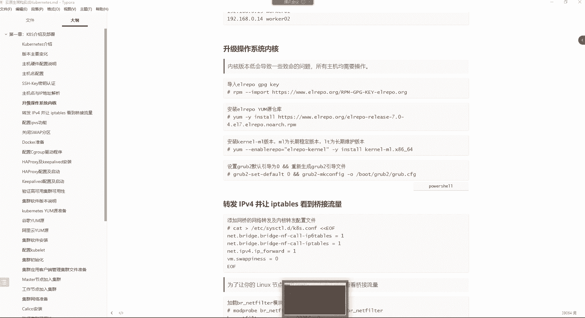
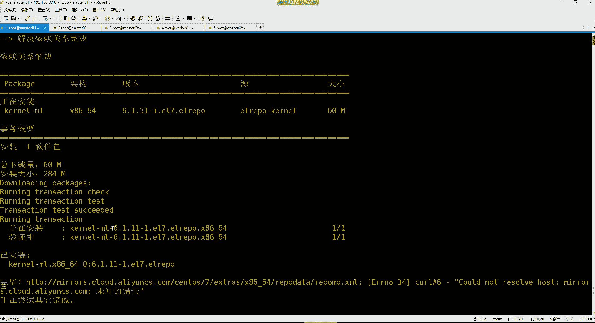
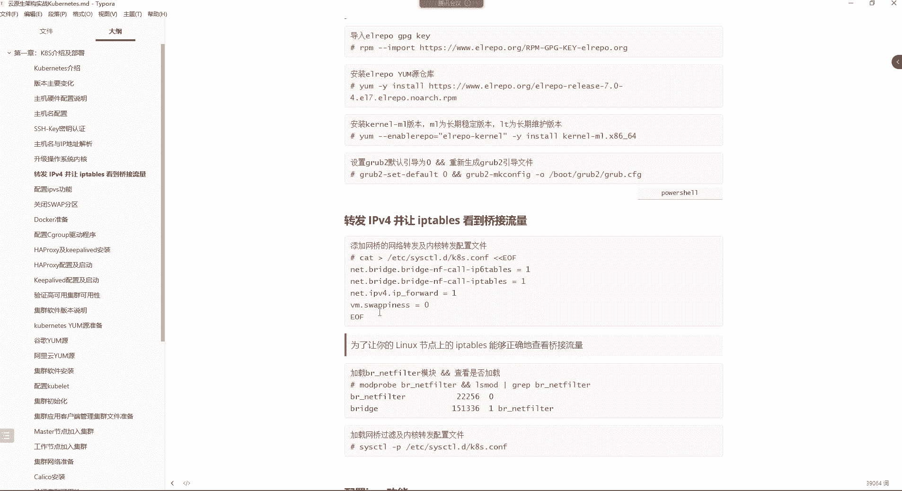
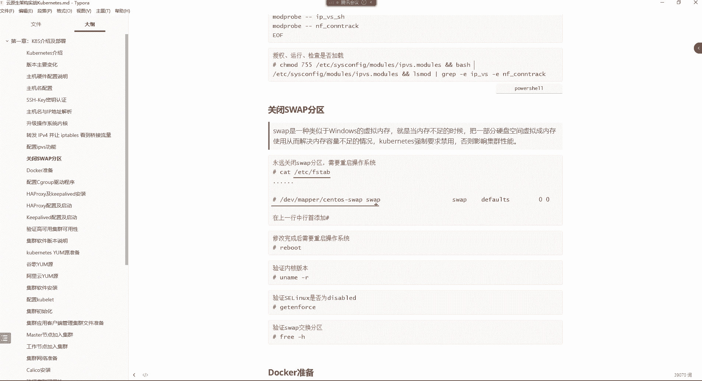
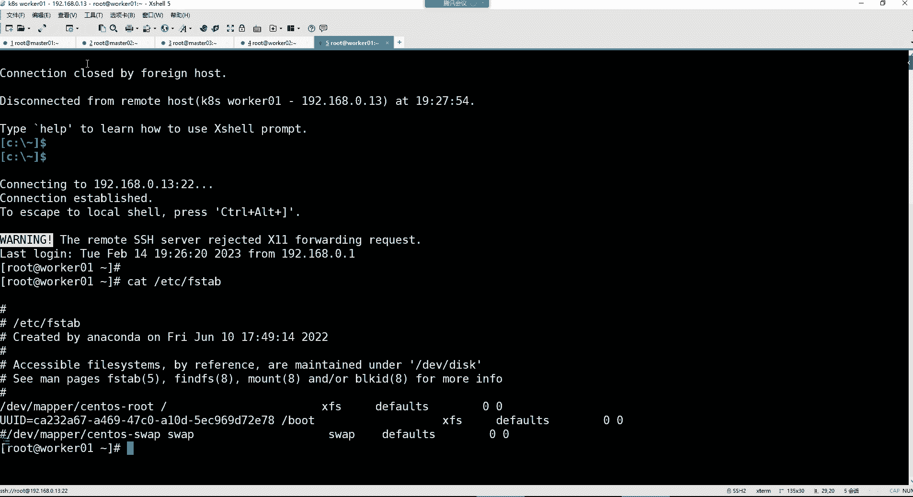

# 零基础入门Linux，红帽认证全套教程！Linux运维工程师的升职加薪宝典！RHCSA+RHCE+中级运维+云计算课程大合集！ - P106：K8S-2.k8s集群环境部署 - 广厦千万- - BV1ns4y1r7A2

趁着休息，唠唠KS的过往是吧？哎呀，KS的过往的话没有什么。也没啥，就是怎么说呢？这个我们说这个江山带有人才出，各岭风呃，各岭风骚个35年。你像K8字，现在在整个容器编排领域，几乎就是老大哥。然后呢。

其实在这个刀客诞生的时候，你知道吗？除了。google公司有KPS容器编排工具以以外，你像什么阿帕奇公司，还有很多的公司都研发了自己的这个容器编排工具，为什么呢？因为大家都已经意识到了。

容器在未来的这个技术领域绝对是一个什么呢？一个。主流的一种方式吧。所以大家呢就都想去研发一套能够在这个呃容器领域能够。作为一个领导者的这么一个工具，所以好多公司就开始研究。但是呢研究来研究去呢啊最终呢。

呃，人家KPS本身呢背景强大。就像什么呢？就像这个人家出生。就出生在了，人家就是坐着法拉利出生的，就像那个王思聪一样。你想想我们说这个王思聪为什么人家。这个那么多女朋友是吧，人家一过情人节，为什么人家？

不是这个左边一个，右边一个，前面一个，后边一个呀。是不是为什么呢？你不能说王思聪长得帅，你也不能说王思聪情商高啊吧，最终呢还是因为人家背景强大是吧？人家有个牛逼的爹，所以KPS他也一样。

你看KPS人家背后有一个非常牛逼的一个科技公司。那就是这个。说白了就是老子比较强大一些。那除了老子强大也不是。还有一个就是说什么呢？就是人家的那个博格系统，人家真的是对于故宫公司来讲，算是一个非常非常。

😊，这个庞大的且稳定的一个成熟的项目。所以人家基于这么一个成熟的项目，人家一诞生就已经碾压了行业里边的那些愣头青了。就其他公司在容器这个编排领域几乎都是愣头青。你想大家是从2014年开始。

这个往融信方向发展的，人家谷gle公司2004年人家就已经全面应用在生产环境了。你跟人家怎么比，人家技术超越你十年是不是？所以你看包括刀货公司自己的swam。

最终也没有能够在这个大浪淘沙里边能够存活下来。是不是啊？所以不都是这么回事吗？😊，背景强大。技术团队牛逼，是不是？😊，比较比较扎心，是不是啊越聊越扎心，所以我都所以我不太喜欢聊他的历史，为啥呢？

也深深的扎痛了我的心了。像我那天跟你们说的这个。😊，嗯，不是钱买不到快乐，而是我们兜里的那两个钱儿，你买不到快乐啊吧？😊，不开奔驰呢。😡，遇不到爱情，开上奔驰呢，遇不到真正的爱情，但是你不开奔驰。

你可能连假的爱情你都遇不到，是不是？这不就是现实嘛？非常残酷哈。😡，所以我们还是学习吧是吧，老老实实的知道的越少，烦恼越少，知道越多，烦恼越多。😊。

啊，我们这个都已经升级完了吗？呃，升级升级完了，你现在也看不了，为啥呢？因为得需要重启才行。所以我们先去让我们的这个内核呢。😊，呃，把它的这个启动顺序给它设置一下。

就通过这条命令可以让我们的这个新版本内核呢优先启动。这条命令对我们的这个所有机器执行一下。

m401m03worker02work克01m402。好，这步事儿完了之后，你看我们那核版本比较高是吧？你看6点6点几的一个版本了，可以哈，没关系。😊。

然后接下来的话呢，我们就去把这部配一下，就是转发IPV4的流量。让IP tables可以帮我们去对IPPS的流量做一个过滤。啊，这一步的话呢也是在官方里边必须要做的。在。呃，我看在哪哈。容器运行时。

这应该是。呃。这儿呢看到吧？就是你要转发IPV4，并让IPT能够看到球节流量。这一步主要的原因就是最终其实它这里面的流量转发是基于底层的IP table来帮我们实现的流量转发。所以这一步的话呢。

我们也能够让IP tips能够过滤到我们这个。😊，通过IPV4。发送到集群内部的这些流量。然后他才能够去帮你去转发IPface的流量。然后这部配置的话呢，大家看我的笔记哈，就是执行这么几条命令。

但是这种命令我们怎么执行啊？这种命令的话是直接把内容写到文件里面的那我们可以这样。😊。

就是把这个命令呢在我们的这个。8401上面先去单独执行一下。

执行一下，执行完了之后呢。😊，我们再把这个文件给它分发到我们的其他的机器不就完事儿了吗，是吧？所以anible组名杠M调用拷贝模块。

然后指定SRRC我的原文件是ETC下边的。six cTL点D下边的这个文件。然后分发给。远程主机的哪个路径呢？还是这个路径。然后呃走你。行，mar401没有发生任何变化，但其他机器呢都已经下发完成了。

下发完成之后我们再去把。

这个命令执行一下，因为这个里面都是什么呀？都是模块看到吗？这个模块我们到时候后边会用得到的。但是现在呢先不用去管它。前期环境部署有很多东西呢，我们没有必要去了解它。因为有些东西都是跟后边的环境挂钩的啊。

😊，然后把这步的话呢，把这命令执行一下。把那几个。这也是什么？这也是加载一个叫做BR杠nettter filter的模块，这是一个桥接，这是一个什么呢？BR就是那个brar。

然后nettter filter呢就是一个我们的这个网络过滤器。所以我们要跟我们系统里面再加载这么一个模块。😊，这官方也是在这儿有所介绍哈，看了吗？😊，呃，让你去执行哪条命令了？执行这命令哈。

如果没有的话，你就加载一下。所以我们先加载模块，然后再去过滤模块。第一步你去加载这个模块，然后加载完以后呢再去过滤。如果能够看到这个模块就可以了。

找你。有。啥意思啊，模模块不对是吧？不应该用这模块啊。有摄影模块。好，是不是也都是过滤到了这个BRnet filter这个模块了呀。好，过滤完过滤到了之后，我们接下来呢。😊。

就去再把那个文件给它加载一下。因为那个文件里面还有非常多的模块哈，我们得去。😊。

执行一下这个文件，让这个文件生效。

总问你。行，这个文件执行完了以后的话呢，我们。接下来再去配个这个功能，叫做IPVS功能。呃，IPV呢是后续我们在学习KPS当中的一个代理的时候。也是一个叫做service这个四层代理的时候。

我们会用到这个IPPS的功能啊，基于IPPS去进行流量转发。然后呢，这个我们后面再说啊，现在先做一个了解。因为这个IPPS后续它在进行流量转发的时候，首先呢它的这个负载均衡的算法非常多。

而且呢还带有这种这个健康检查的功能。但是我们如果想要使用这个IPPS模式的话，我们得需要手动去载入IPPS相关的模块才行，以及它的各种算法的支持的这些模块。

所以把这个包呢，在我们的各个节点先安装一下。今天情人节不陪女朋友。女人女人最终只会成为我们。成功路上的绊脚石。是不是？哎。呃。

这个包安装完以后呢，我们还得去搞一个文件去。

把这个文件呢我们先去。给它生成。好，生成之后呢，咱们再把这个文件给它分发到我们的不同主机上边。还用安四ible。🎼K8S组杠M调用拷背模块。杠A。SRC指定原文件。然后。目标路径是这个路径。走你。

是不是非常方便呢？用ansible确实哈你发现你会非常的省事。不然你这机器还比较少呢，你如果现在有20台机器怎么办呢？你二0代机器，你难道一个一个去配置？😊，是不是啊？啊。

虽然说这个有一个功能是可以让你去同时对多个终端操作的但是这种。肯定也不方便，你少机器数量少，一就，你机器数量多呢，你这种功能是不是也没有意义呀？😡，这种功能是不是可以，你比如说什么瓷砖排列，这样的话呢。

你可以针对于多个终端去同时操作。但是这也不行啊。😡，这太low了吧。

嗯。把文件下发，然后呢。去执行这个文件，然后让这个文件里的模块生效。那我们这条命令相对较长一些是吧？这就是先给文件加一个什么呢？75的权限，然后再通过拜师命令呢去执行这个路径下这个文件，然后再去过滤。

我们这个前边写入到文件里的那些模块，看看模块有没有被系统所加载。

把这里面的命令再给它删掉。然后我们换成摄影模块。走你。行。都执行完了，是不是也能够看到这些模块了呀？😊，最后你只要能看到每个机器里面，他给你加载出了这些模块的话就可以了。

那前面前期的环境部署还有一步就是关闭swa分区，这个关闭swap分区也是K8强制要求的。呃，因为我们对于spa呢我们都知道它就是一个拿磁盘空间模拟内存使用的一个功能来缓解内存不足的一个情况。

但是KPS强制要求禁用它，否则影响集算性能。所以我们最终还是要干嘛呢？还是要去对于这个ETCFStable文件，把这个给它注释一下。

但这个注释大家可别拷贝文件了，为啥呢？你要注意一下啊，你比如说你打开1个ETC的FStable文件，你不能把我你之后能不能把mar401这文件。这样我给它一注释，然后给它拷贝过去。不行，为啥呢？

你拷贝的话，你要知道每个机器它在挂载它的bo分区的时候，你看系统默认是通过UUID。😡，去过来的。但是你把这个文件拷贝到其他机器，那其他机器UID一样吗？不一样，所以这一步可不能这样搞哈。😊。

那不能这样搞。那怎么搞啊？其实你可以通过C的。但C的呢。我们在用的时候，它容易跟安的这个引号发生一些冲突。你比如说你这样。你用的时候Cd不是有一个功能吗？我们可以先验证一下哈，怎么验证呢？

我们拿这几验证，你看你可以用Cd，然后呢杠N。😊，然后我们先去这样。可以用这种S替换的方法，怎么替换呢？就是把那些。呃。开头儿。没空的。不是。是属于我看看啊。开一下ETC的FS table。

不就DV这行吗？是吧？给他加一个。注释。那给他加注射的话，就是。这玩意就比较麻烦，因为你这个引号最终放在安里面，它容易跟安那引号发生冲突。就。就是最终你这命令执行不了，因为我曾经试过。

你可以比如说先去过滤一下，这里面不是支持过滤吗？比如说。这个里边。包含swap的，然后呢，你再去。哎，这格式格式怎么怎么用来着？

我有点忘了哈，比如说嗯。😊，通过C的。添加透视。有点忘了哈。这儿呢那C的，然后呢指定多少行。然后以空开头的加个注释。这是指定行号的100多行。那我们如果是。

默认每个文件咱们没有改过的话，是不可以啊？你还以为你就你忘了呢，是吧？我们这是多少行啊，在文件里边看一下。😊，第十一行他也是十一行吗？ETC下的FStable也是11行。那应该都是十一行，是不是啊？

那你就这样11，然后S替换一。井号开头的给他加一个啊，不是以空开头的加个井号。然后再指定文件是ETC下的FStable。我们再打印一下哈，不不打印，你看不出效果。

是不是这意思是不是就给这一行加了个注释啊？😡，好，然后最终呢你再去这样。把这个。N换成I，把这个P给它去掉，这样就等于说直接去改这个原文件去。然后你再去看这个文件的时候。是不是他就加了个注释啊？没错吧。

但是你这条命令如果你放在。我们的这个unible命令里边。怎么说呢？我看看啊。就怕这个引号会。不生效，我们试试哈。对这个组内所有主机，然后。嗯。看能不能执行吧。你看格式报错。是不是？😊，所以这种就不行。

这就是。怎么说呢？会有这种问题。我用双眼的。有。双眼可以。看到了吧？哎，所以这步可以给它换成双引号。呃，换成双引的话呢，那但是这个里边有一些是我们改过的，是不是啊？所以改过的咱们就手动删一下吧。😊。

那没办法是吧？我们是为了做实验嘛。😊，为了验证那个效果。首先8401，我们自己得。搞一下。有，这里面是。马4林没变，马402呢。啊，马402也没变，那为什么它显示两个井号啊？你看马森林显示两个井号。

302显示两个记号。那就是你发现文件里面。没变。啊，两个井也没事儿，无所谓。无所谓哈。哎，但是他怎么没变呢？他没变吧。我加杠A了，这个命令里面加。啊，C的杠N呢。杠A。是吧各位。总你。

然后最后我们再看一下，那肯定是俩井号。😊，两角上也无所谓，不影响。是吧反正也是注事了。这个呢。是不是也一样啊？是不是也出事了呀？也一样。好，可以。

行。那这步我们就完成了。

😀Ha哈。😊，所以这部安什命令。😊，是不是得。值得借鉴一下呀啊，是不是啊牛逼plus是吧？值得借鉴一下吧，永远关闭它。😊。

哎，用N sub的形式，这是哈。😊，然后下面的话呢，我们就可以重启我们的系统了。因为我们因为我们前面的内核升级的话呢，我们内核现在版本是没有变的。😊。

现在还是原先的那版本啊。😊，K8S杠M用设模块，你看一眼。U name杠2S。你看他们版本是不是还是3。10啊，所以得需要对他们做重启。reboot他一下。全部重启。为什么这个机器没重启啊？😊。

啊你看刚刚这个机器它没有重启成功是吧？😊，这很很奇怪是吧？不应该全部重启吗？为啥呀？因为第一台重启了，后面就不行了。没错，因为一旦mas的01先被关机了。😊，那其他机器是不是他就来不及下发指令了呀？😡。

没错吧，你像他自己都关机了，他怎么还去对其他机器去执行命令啊，没办法了嘛。😊，重连一下啊。好。呃，连连完之后，我们这样啊anible K8S杠A。就不用设用模块了。

因为默认不是 commandman的模块吗？😡，是不是啊？所以你不加comman的模块也行，就直接杠A用默模块看一下you name杠2S。内核版本是不是就全部都变成6点几的了呀？

好，是不是都可以了？好，完事完事之后呢，我们再看看swape分区有没有被关闭。然后SC04我们肯定是关肯肯定是关了swa分区检测一下。

死b爸分区是不是这一行都是零啊？那零就等于说已经把它给关掉了。每个机器列位置都得是0哈。好，那么前期的环境到此为止就OK了。环境准备完了之后。😊，那接下来呢我们这就。

来说一下。doker啊，我们要去准备这个docker环境了。但是在准备docker之前呢，我们还是在这儿有一个东西然后给大家说一下。有一个叫做。容器运行时的东西，我们可以来说一下这个容器运行时哈。呃。

首先容器运行时呢其实就是容器呃帮我们运行容器的那个软件。而K8呢，你看K8官方呢，它明确指明说呃我支持的容器运行时都有哪些呢？有content d和这个CRIO啊，他们之间都是去帮助我们去管理容器的。

但是为什么官方就没有写？😡，有刀客呢。为什么没写docker呢？因为告诉你，因为K8S在它的这个1。24版本当中就已经。把docker给它移除掉了。就是说KS1。24版本以后的话。

你可能用不了docker了，而我们是1。23版本可以用，但是又不是那么回事儿，为啥呢？我给你们看一个图片，说到这儿啊。就得讲讲一些历史性的东西。大家看这个图。这个图我不知道你们能不能看懂。

我得给你们解释一下啊。首先你看一下谁是K8S呢？let。😊，就是K8的一个。就是专门去干嘛呢？帮助KPS去调用。比如像调用docker。或者说调用contl D调用CIAO去管理容器的这么一个组件。好。

那你可以把这个clate就给它列解成KS就可以了。😊，好，那首先K8S它想通过docker。去管理。我底层的容器的时候，首先它要经过一个什么东西呢？首先要经过。自己的CI的接口。

以及再通过CI接口去再经过一个叫做drksha的这么一个适配器。然后再通过这个适配器呢，才可以去。这个什么呢？适配docker，通过docker去管理底层容器。啊，而这个适配器。其实翻译过来叫垫片。

主要的功能是啥呢？主要的功能就是把K的请求转给docker，然后让docker去帮助他去管理容器的这么一个东西。所以这东西你可以把它列成就是一个适配器就行了。

但是你注意为什么要只有docker才需要这个适配器呢？而你看像什么conD啊CRIO这些，他们就不需要这个适配器呢？因为KPS它本身已经提供了一个跟容器。进行就是跟这些容器管理工具进行交涉的一个接口。

这个接口就叫做CRI。只不过docker它没有支持这个CRA这个接口。而且他也没打算要支持这个CR这个接口。那这样我们就能够猜出说KPSS为什么要抛弃docker了，为什么呢？因为啊这个docker。

他头先人在行里面可以真的是火的一塌糊涂啊。太火了，而K8它诞生的时候呢，它真的是没有docker火。😡，但是呢KPSS呢它为了能够让自己在行业里面能够立足，所以怎么办呢？所以就。😊，Docker。

当初火的时候，那么大家都喜欢用刀cker。那怎么办呢？那我就干嘛呢？哎，我就可以通过docker去帮助你们管理容器，这样大家不就能够适应我这个容器变排系统了吗？

是不是就我这个容器变别系统默认使用docker去帮你管理容器，而且大家都喜欢用docker，这样的话，是不是我就能够在这个行业里面能够立足了呀？所以当年的话呢，KPS就是为了妥协这个docker。

就是你不支持我的CR接口没关系，是吧？你当年你是大哥，我呢就自己在我的官方代码里边，我们增加一个适配器。哎，我专门去适配你去。知道吧？啊，就是我单我单独去支持你。😊，但是呢今天它不一样了。

今天的话我们说这30年河东，30年河西呀啊今天K8S它可以说是在容器编排领域的一个执行标准了。就说白了就是在这个领域，我说的算，我是掌舵人了。而今天的话，你docker仍然还是不支持我的CR接口。

而且呢。我还得去单独去维护这个drksha这个适配器的代码。而且你如果一旦做一些更新的话，我还得对我的这个代码做一些更新。那么我这个维护的团队说白了也是需要成本的那咋办？好，那兄弟。是吧当年。

你不给我面子也就算了，但是现在你还不给我面子，那不好意思，我呢也就不再需要你了。那我就把我的这个dokersha的这个代码，从我的1。24版本以后都给它移除掉。

我只要把这个dkersha代码从我的代码里面移除掉，那后续。大家想用我K8S就用不了docker，你想用docker就不能用我K8S。除非你docker干嘛呢？能够妥协我来支持我的CR这个接口。😡。

所以呢就是在1。24版本的时候，确实是K84官方移除了这个do这个垫片了。所以当当时刀客官方就慌了呀。慌了，为什么慌了呢？因为确实是这个。呃，开始什么呢？

好多的企业开始拥护这个contentD和CRL了。因为毕竟说白了。我能够实现同样的功能。但是呢K里边人家呢。😡，就是对于这个con地和CIO，我们在用的时候肯定比你docker效率要高。为什么？

因为你这儿还有一个中转呢，是不是中转不需要时间吗？不耗资源吗？也耗也耗，是不是？但是如如果我用con地去管理容器呢，我是不是就少了一个中转站呢？这样效率是不是又有所提升了呀？😊，啊，所以这个。

doker当时就慌了。那慌了怎么办呢？慌了没关系是吧？你把你的。doker shame代码移除掉了，没关系，我自己干嘛呢？我自己再去。干嘛呢？去开发一个叫CRIdockerD的这么一个适配器。

你可以把它理成是一个适配器。只不过现在这个适配器是由谁去维护呢？是由docker官方去负责维护。然后呢，在1。24版本以后呢，如果大家仍然想使用我这个docker去帮助在你的K84里面帮助你过内容器。

那大家可以在1。24版本的时候，去把这个CRAdoD给它安装上，用于替换这个doker shape。所以其实在1。24版本以后的话呢，我们仍然可以使用这个docker。

只不过呢你就是要手动的自己去安装这个CRIdockerD。就可以了。啊，现在仍然也可以使用docker。所以你现在知道为什么在KPS官方里边，它并没有提及到这个docker这个东西了吧。对。

do意思就是说哎。😊，我自己来。对，所以就是你们这个理解的那个意思哈。今天你对我爱答不理是吧？明天我让你高攀不起。就是这样哈，风水轮流转。😊。

所以你看是不是人QPS官方压根儿就没有把你的刀号放在我的官方文档里边呢？没有。😡，就是说白了现在你对我来讲可有可无。😡，但是我们1。23版本仍然是使用docker哈。没关系。

你就是后续你说我想使用docker也是可以的。😡，它有1个CRIdoD的那么一个东西。这里面我不知道有没有介绍哈。😊，你看是这儿呢，你发现是不是他在这儿有啊，是不是他告诉你，他说那以下操作。

假设你使用的是CRdoD这个适配器。😡，来将docker与科bernet集成的话，那么你应该怎么配置啊它也有。他也给你准备文档了哈。那干嘛不直接支持K8S的CR标准呢？呃，怎么说呢？

这里面会有一些这个版权在里边。这里面会有一些版权。因为这个在docker，他们家是有很多的专利的，而有些专利的话呢，他不想公布出来。所以呢这里边会我们呢具体我们是根本就没办法去怎么说呢？

揣摩人家的一些想法，肯定是有它的原因的。如果说没有任何的这种这个商业之间的一种利益冲突的话，我觉得。你docker支持个CR这个接口，我觉得很正常。

是不是也有利于你docker在今后容器领域的一个地位呀，是吧？但是呢它为什么不支持呢？这里面还是有些事情在里面的，我们肯定是不得而知。当然我们知道一下就可以了，是吧？历史性的东西呢。

我们啊或者说我们说什么神仙打架。我们看看就完事儿了。😡，是吧。他们爱怎么着怎么着。然后咱们还是用docker是吧？所有主机呢都得安装。那么接下来安装docker的话。我们这个怎么安呢？我记得。我原先。

如果我们是通过这个仓库去安的话，用阿里仓库安就行就可以了。但是我原先对这个docker呢，我是有提前准备好的包。在我在给大家讲dolo的时候，我是不是下载过他的离线的包啊？没有吗？那个。

在这儿呢在这个ja门思路里边，这儿有哈docker2。10的这个包。这个包的话呢，我们是。可以直接给他拿到我们的系统里边，直接就给它手动安装，这种速度比较快一些。在K84里面，我记着。

你看我曾经还下载过这个CRI倒数D的话呢。下载过这东西哈。啊，daker的那个包，这里面没有是吧，我们给他拿过来。把这个包我们给它传到我们的每个机器上面。

给他直接拖进来吧。这次还是1。23版本，没错。版本之间的差异不大。你现在就算是用1。24版本，其实我们的底层你还得用docker，为啥呢？因为docker在行业里面的占有率，肯定现在仍然是最高的。

你别看K8S现在已经升级到1。26点几的版本了，但是呢。我们仍然喜欢用docker去。集成K8S。

这个包我回去发给你们。然后来去部署一下安。然后。K以把S组。杠M摄影模块杠A。我们来次看一下。就这个包我们给它解压一下。这样。踏杠叉F。root下的那个。这个压缩包。给他解压。好，剪完之后呢。

我们看一下它会多出来一个目录。这里面会有一个docker目录看到了吗？然后这里面就是有我们想要的包了。然后这个包的话呢，我们就怎么安呢？那我们就得这样了。去。这样你看用sha的时候。

用一个叫做称至DR的这么一个参数指定我先切换到root下的docker目录里面。趁着DR是可以在你执行命令之前切换到目录里边，然后我再去执行一个叫亚么ins。然后当前路径下的星点PM。然后杠外。走问你。

安装完了吧。是吧。然后看一下版本就知道了是吧？你要你要那样检查的话。那你可老费劲了。RPM杠Qdocker。有。得QA哈，因为你这样查询的话，必须得精准。所以我们得RPM杠QA管道。管道给。

He grab up。是不是就安装完了呀？

安装完了之后呢。那接下来我们就去。它这个叫做sig group的东西。sig group是啥呢？sig group官方也有所介绍，你看了吗？他说配置什么sstemDs group驱动。

这个Cgroup不驱动呢，它上面是。有一个介绍在这儿呢，看到吗？嗯。看是在哪呢？给什么runC驱动在不是在上面哈，这儿呢它这儿有所接受哈。他说你看首先。呃。

当某个linux系统发行版使用这个CMD作为初始化。

