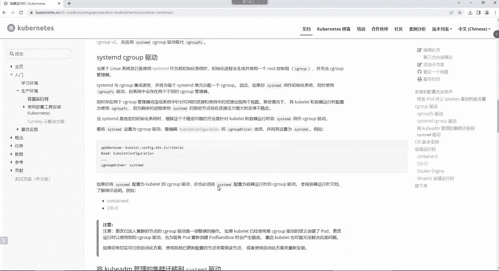
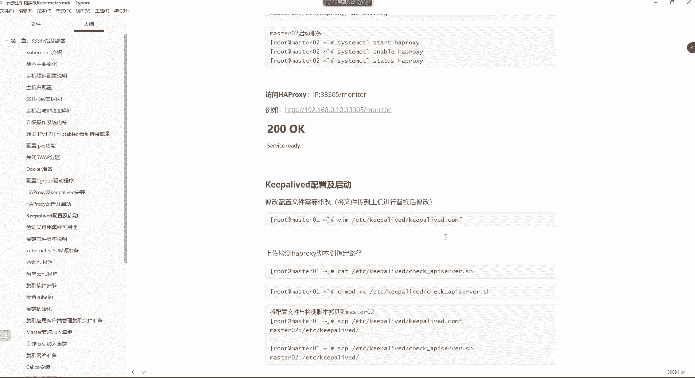

# 零基础入门Linux，红帽认证全套教程！Linux运维工程师的升职加薪宝典！RHCSA+RHCE+中级运维+云计算课程大合集！ - P107：K8S-3.k8s集群环境部署 - 广厦千万- - BV1ns4y1r7A2

一动时，那么初始化进程会生成一个什么root控制组等等等，扒拉一大堆的是吧？你看哪儿呢？你就看。看这就行了，他说。😡，这个。缓解这个不稳定的问题。其实就是说让我们把这个。

我们当前系统所使用的驱动程序给它改成sstem D。然后这样的话呢，可以什么呢？呃可以缓解什么不稳定了吗？他说缓解什么资源压力增大，导致你的系统不稳定的一个情况，看到吗？那当CD是选定的初始化系统时。

那么缓解这个不稳定问题的方法是针对什么可和容器巴拉巴拉一大堆。😊，就说白了它默认的驱动是什么呢？默认我们的系统的这个驱动叫做。叫做sig group FS。但是呢这个东西呢就是因为会有这些问题。

但是呢你把这东西改成CMD就可以了。这种东西对于我们来讲。😊，你就改就行，怎么改。😡，首先呢我们去。给docker。去创建一个文件，叫做demer点jason这么一个文件。

然后把我们的这个dork的那个启动时的那个驱动改成stemD就行了。其实不是系统，是我们这个docker程序哈。然后再启动docker就可以了。这样的话呢就是docker运行起来会更加的稳定一些。

在你的系统里边。所以我们把这个命令拿过来执行一下。

真一下哦。有。呃，什么。没有那个文件和目录啊，ETCdocker点jason。是不是没有docker这个目录啊？

SETC有刀cker吗？啊，没有。没有的话，我是不是得建个到cker目录啊？是吧。这样先去。MakeDR。Makeake。对，还没启动doer是吧？makeDR在ETC下面建一个docker目录。

手动建一个。

呃。makeDR在ETC建一个docker目录。有，那我们是所有机都得接。还得用anible啊。是吧makeDR。在ETC下边建一个dock的目录。接完之后的话呢，我们这时候再看一下BTC。

有这这太多了是吧？letsETC有没有一个到号目录啊，有啊。😊，可以啊，不影响你的加速器哈。😊，不影响。那接下来咱们就把这文件去生成一下。生日之后看一下这个文件ETCdoker写的demer点dson。

是不是啊？那后期你说我想配加速器呢？😡，在这加个逗号，把的加速器写在下一行就可以了。

加速器不就是一个串儿吗？😡，是不是？

然后那接下来这个文件我们得下发呀。安ibleK8S杠M。copy模块。杠A指定。S RRC。把ETCdocker下的。Deimmer点jason。拷贝到远端的。ETCdocker目录。好，本金没有变化。

所以它直接跳过了，其他机器呢看一下不就完事了吗？是不是有这个文件了呀，然后看看文件里的内容对不对呀。没毛病吧。好，改完了，改完之后把刀刻起来。😊。

啊，但是我还得去把这个。呃。

行，启动刀口。Start doer。然后并且让它变成随机自起。完事儿。看下状态。我们这操作得谨慎一点啊。running了没毛病。好，然后接下来呢。

呃。接了我就可以去。让我们的集群。去实现这个。这个高频的功能这个高频功能呢，我们要借助Hproy和K live。这两个服务来实现这两个服务实现的最终原理就是什么？就是。你看我们不是有三个ma嘛，是吧。

和两个worker节点嘛。那么最终其实我们想实现的这个高可用是谁的高可用呢？是ma节点的高可用。我们三台ma节点，最终就是怕什么呢？怕某一个机器。宕机了，然后你的集群瘫痪嘛。

所以我想让我的mas能够实现一个故障的切换吗？是吧所以你想让你的mas的时间故障切换到，我们最好的方法是什么呢？就是。😊，给你的mas上面部署cap live就可以了。c live。

然后部署上c left呢，我们是给哪个机器呢？其实正常来讲。😊，你只需要给两个机器部署就可以。或者说你单独准备两个设备，单独准备两个机器哈那单独准备两个机器之后呢，部署上c live，但是你这个不行。

呃，你这个ki loud一定要部署在你的master上边。😊，部署在mas上面，因为你的mas一旦出现故障的话，是不是他就会帮你切换它的这个VIP啊？没错吧。好，那切换这个VIP的话。

最终你比如说我的这个mas出现问题的时候，我这VIP切换到这个mas链上边。😊，而我们在访问的时候呢，仍然访问这1个VIP是不是也可以？😡，或者说你不访问VIP。

我就单独访问这个他的自己的本机IP是不是也可以，最终你的集群也不会瘫痪。😡，所以这里边呢我们要选择其中的两个mas的。让他们两个。来实现一个最终得能够实现一个故障切换。

因为Q live没有办法实现三台机器的高可用。啊，对，这就是那个VVRP技术。所以最终呢我们在其中两台mar上边。部署让keable alive。然后呢，Hprocy的话呢。

是实现一个负载均衡的一个功能。就是最终但是我们这个其实我们用不上这个Hprocy，但是必须得有。必得有这东西啊。它实现的是一个负载均衡。因为最终我们在访问的时候，你是不是访问VIP呀？😡。

你返VIP的时候，你比如说VIP最终是。在192。168点0点，这个机是10。我这VIP啊现在是在我的这个mar401上边的，然后mar401出现问题了，那最终说VIP就会切换到这个上面呢。

这上面就会有192。168点0。10。VIP现在在马量上面呢？当你最终访问的时候，你还是访问VIP啊，是不是啊？😡，那你的请求不就到达M302了吗？但是这Hpro其实压根我们用不太上，但是得有。得有哈。

因为后续的话呢，我们在。通过ma去管理我们这些worker节点的时候，会用到这个东西。所以我们现在其实最主要用的就是什么呢？这个co love。来让我的两台m实现一个高可用，这样才可以。呃。

那我们现在就把这两个服务给他安装一下。所以我们只需要在选两台mar4的安装就可以了呀。对对对对对对，这就像那个确实哈像那个。类似于ZK那个原理。好，所以我们就在M401和M402上面安装。

那mar401和M402安装的话，是不是就不需要安了吧？因为总共两台机器嘛。

所以我们就直接。呃，亚么。Install H A。Proy。加上。K宝 loud。H A proy。我来有了。

这两个包都比较小。安安起来也非常快。按以后呢，我们配置这个Hpro。HBC的话呢，最终它得能够代理到我们的3台ma。而这配文件的话呢，我们就。不在线去编写了。

你们知道这个配置文件哪一部分是能够决定我们的这个后端的主机的那个部分就可以了。这文件呢我给你们传上来哈。

这里面有1个Hpro的配置文件。这儿的。这两台机器都会用到这个文件。这文件呢我们来看一下啊，打开一下HAprocy。这个文件首先就是。首先，Hpro自己监听的端口是这个端口。

但是我们一般用不上它这个端口以及。ATpro的协议我们一般也用不上。我们主要是看哪儿呢？呃，看这一部分，就后端的服务器组。这个服务器组，你看我的这个前端定义的一个集群名字叫KPSma是吧？

那接下来干嘛呢？接下来我就得针对我的这个集群去进行一个代理。也就是说我现在就定义我最终接收到请求以后，我要把的请求代理给谁。

那就带理给我的这个那serv这里面定义的三个master他们的主机名以及IP地址以及他们的定应的端口号就完事了。😊，其他的都默认。K8S的默认端口是6443。在这里边。嗯。所以这就是非常简单是吧？好。

然后这边呢也都一样，因为他们两个文件是一样的哈，所以。😊，这里边也是这样的配置。就首先最主要的就是。我前端的名字就是跟说白了，这就是给我的集群取个名。然后呢，接下来呢，那当我接收到请求以后，我的请求。

😡，代理给谁，就带来一个我的。这些主机就可以了。啊，但是这些的话其实我们用不太上。真用不带上，对于Hpro，但是这东西必得有。而我们真正访问的时候呢，其实很少会这个访问他那个VIP。

我们一般访问就是访问每个机器的具体的本机IP就可以了。所以这东西基本上用不太上。然后这文件你得放哪儿呢，你得放到ETCHpro。这个目录这里面它有个主配文件是吗？你要把这个主配文件给它覆盖一下。

所以CP把HApro拷贝到ETCHApro下边，把它原有的那个文件给它覆盖掉。这个也一样，CP把Hpro。覆盖掉ETCHAprocy下面的那个文件，这就可以了。

所以最终呢需要你们改的地方就是根据自己的集群的三个maIP去修改就可以了。你看我这里面是不是都是30啊，不一样吧。

然后接下来呢把这个ATpro给它起来。这两台机器。让他变成随机自己的状态。这个也一样。工作中。对呀。一样哈。唯一需要你指的就是你的ATpro后端的集群IP。端口也不用改，端口都是默认的。嗯。

你工作中部署集群也是这样部署吧。😡。

所以没什么差别哈。然后这HSHApro那个健康状态的端口可以访问你访问最终它会出现1个200，但是你不用访问它。这种东西，然后接下来呢我们配置c live cable live的话呢。

我们也要去改它的配文件。但这个文件的话呢。

哎下啊。我也是给你们准备好了。K宝 live这儿呢。它是主备嘛，一煮一辈。好，然后你看这个文件最终。它的因为key的默认配置文件是在ETC cable live下边，这是它的主配置文件给它覆盖掉。

把我们当前上传上来的这个文件，覆盖掉ETC cable live下边的那个默认的配置文件。这个也一样。CP。把ki live文件覆盖掉ETC的ki live下边的那个文件。然后接下来我们要打开。

ETC cable live下面的klo点com文件。这个文件的话呢，首先因为c live它首先是做这种。这个。故障转移的嘛，所以它故障转移的话呢，这里面会需要用到一个检测故障的脚本。

所以这个脚本的话呢，是在这个位置定义了一个故障检测的脚本。最终最主要的就是脚本的路径在哪儿在这儿检测谁呢？检测我。集群节点的一个状态。这脚本我们还没有上传哈，先知道一下。

然后下边这个位置呢就是给我的这个当前的实例。😊，指定一些信息，比如我当前的这节点身份，因为它是主备关系嘛。你比如说我现在希望我这个ma01当我当前的一个主节点。好，那么VIP就会。

优先在mar斯01上边。然后你如果通过VIP访问，你肯定你的请求就到达了8401了。😡，而这个备用的这个节点呢，你打开它的配置文件。因为他俩的文件现在是一样的。那这个主机你看啊前面的故障检测脚本不用动。

但是它的身份。在。state这个位置是不是它就不能是master了呀？他得是谁，他得是back up。😡，是不是？背吗？好。然后一嘱一背哈。然后只有当8401出现问题的时候。

那么我的IP就切换到这个上面。然后那接下来没关系，你切换到这儿，你访问，那你说我访问8403可以吗？可以，就你的集群不会瘫痪。😡，知道吧？然后接下来呢这个。我们还是看这个看这个mar401哈。首先。

你几点身份指定完之后呢，然后这个interface就是你这个当前你的集群。这个节点所使用的网卡是哪个名字？因为最终他的VIP。得绑定到一个真正的网卡上边，所以我们的网卡名是叫ES32的这两个机器都一样。

所以这网卡名字哈。😊，按照自己的情况改修改为正在使用的这个网卡。最终呢VIP会绑定到这个网卡上边。然后那ma就我当前主机的IP地址，这个呢就是你自己本机的IP我当前的机器IP是不是就不是30啊？

多少10。是不是又改成10，而这个机器呢，那它的地址。本身是11。这就改成11。啊，是维本妈字主席对应的IP地址啊，然后我这个当前节点的一个root IDD默认都是51。注意这个ID号一定要是在同一个。

集群环境。要保持一致，就你这两个机器组成的一个主备，他们两个的ID号就得一致。然后优先级优先级的话呢，这里边注意这个需要改的地方，我都已经给你们用注释。标记上了优先级的话需要修改。

因为你当前如果你的身份是ma，你的优先级就一定要高于我们的这个。back up，所以要么你就是改master，要么你就改back up。我们可以把这个back up它的优先级给它改低一点。

比如说给它改成多少100。就可以了。妈斯的是101。好，然后下边的话呢就没什么了。剩下就是我的集群的。VIP了IP的话呢，我们用192。168。0。100。然后这个下边这步呢是这个。

干把它执行上面的检查到那个脚本去。这个脚本我们定义的路径之后，这个脚本在下边让他呢去帮我去执行上面的这个脚本。这个在三阶段的cap alive的那个位置，是不是这些东西应该都讲过呀。我觉得这种东西。

现在只是拿过来用一用而已。好。呃。然后这边的话呢，我看还有没有什么需要改的，没了VIP要保持一致哈。集训VPVIP地址保持一致，其他的就没什么了。所以你看我们最终需要改的就是。😊，首先他们的关系。

是不是得改？剩下呢网卡IP根据你自己的环境。名字呢要指对，然后本机的IP是不是要改？好，优先级是不是要改？其他的就没了。就改几个地方，1234就四个地方。然后保存退货。保存退出之后的话呢。

我们把这个caplo给它起来，但是不行，还没有脚本脚本放在哪了呢？你看这里面脚本我是给它放在ETC cablelo下边了。这个脚本就是检测我们这个主机状态的。在这儿呢。

嗯，check A server这脚本哈。

看一下这脚本。这脚本其实。就是呃在k log里边，它主要是干嘛呢？检测Hprocy。过滤ATpro进程。如果ATpro进程。过滤不到的话，记住呢在这个位置就把cap live这个服务给它停掉。

c live一停。那我们的这个IP就切换了。所以他们两个，你说Hpro在这里面，其实主要就是。让我们的c lab去能够检测。他的一个健康状态。那只要它运行你的集群肯定是正常的，但只要这进程过滤不到。好。

那你的集群就肯定是。有问题了。所以这个脚本。最终呢给他。MV。移动到。那装个其他服务是不是一个效果？

不其他服务没有办法代理后端呢，你其他服务你怎么去代理你的后端集群呢？其实这东西你后续有可能能用得上。😡，有可能能用得上啊。只不过我们现在。😊，或者说整体来讲，其实我们。对于它的话呢。

它的这个作用其实并不大。并不大，但是还不能没有这东西。呃。

然后接下来呢，我们这边就是把这个。脚本移动到ETC的c live下面。这边也一样。MV把这个。cheick A思入脚本移动到ETC的 cable level前面。ETC cable live。完事。

然后把Q8扶起来。因为我曾经试过，就是你如果是不去部署这个cap live，你这集群。

起不来。所以这东西还不能没有，但有的话呢，我们其实用它的时候还非常少。好，然后这时候我们看VIP有没有被分配哈呃。😊，看一下。我们VIP最终会绑定在这块网卡上边。现在还没有被绑定呢。是吧。没出来呀。

被告呢？没有。这有点慢呢，给你等。这种东西就是。咩。这边。还没出来是吧？这个。这么慢呢，怎么？看状态是吧，看状态。没问题是吧，没问题的话，就是慢，那没办法。就什么？他这也太慢了，我我看看是不是那个。😊。

人家哪里不对哈？VIP啊，这也没毛病。其他的话呢。Mster。ma网卡名ES32192。168。0。10。然后。脚本ETC cablelo。这个脚本。没问题哈没问题，就是慢。重启一下。啊。

不是master2的优优先级没有它高。它是100嘛，那个是101。我重启一下吧。不应该这么慢的。对也太慢了。服务永康没有任何问题吧。这个IP地址在我这环境里面也没有被其他机器用。他不应该有这种情况。

没协没协商。😊，我试试啊。把它停掉行吗，然后把它也先停掉。然后再先一个一个起是吧，先起它。没问题。Yes。这地址没出来呀。等会儿啊，我。啊，192。168。0点。10。10百不行，咱换一个行吗？101。

啊，或者说。他这优先级的话。我们。这个优先级的话。You。再给他调小点吧。调成99。行吧。

我看看啊。呃。

看Hpro哈。It process端我起来了。然后。很诡异啊。背的优先级比煮的低是，没错，就是它就是比主的低哈，背的就是要低，煮的就是要高。网卡名也没毛病啊，ES32。是吧。

interface ES32地址192。168。0。10。你看优先级。101页。密码。ABC123。E432。192。18。0。11。优先机99。密码ABC123VIP。这边应该要。啊。100往上的低。

不是我以前就这么配的呀。😡，100行吧？啊啊对对对对对对对。对对对对对对这个。是不是搞错了呀？啊。😮，我怎么记得这值是越大越优先呢？给他改成100，我试试。是不是？我记得是值越大越优先啊。😡。

是我记错了吗？哈哈。😊，是我这文件里面写的那个back club写错了呀。BA。

Okay。没错呀。嗯，back up网卡名在maVP你看back up优先级低嘛。检测脚本。

呃。啊，脚本没有加执行权限，我等等会儿哈。😊，等会儿等等等会。搅拌面。没有加钉行权限是吧？可能是这个问题哈。😊，可能他不能执行那个脚本。呃，给ETC keep alive check。价格执行权限。

帽子。来，咱重启一下啊。Hpro正常哈。😊。

真的很诡异啊。

不是啊我这内网里的入胎低只有一个呀。啊，有嗯有可能重复了有可能重复了。我那个真的我我那个root IDD有可能重复了。这个如台ID啊，我换1个52。50。2。2。各种方法试吧。最终也。

但是为什么他起不来呢？不就是1个VIP嘛？这。H些pro都没有问题。你看这地址就出不来。很诡异啊。都没有问题。啊，都没问题。哎，这个给我整的有点不会了哈。😊。

10这些都没有问题。哎。Yao。101112。换个VIP吧，实在不行，换个VIP吧。啊，是吗？我现在都重启一下哈。😊，和他没关系啊。这看不出来问题了呀。不是不是。这个。换个VIP哈换VIP。110。

110。服务能起，就是IP地址绑不上去。你说这啥毛病吧。是吧。这没他没有地址是对的。但是他没有地址就不对呀。兄弟们。也不能说也不也不应该说我这里面就有1个KPS的环境。有1个KS快照环境就。搞得我这个。

这个环境用不了吧，也没准啊。你们知道为啥吗？因为我这个集群里边有一套快照环境。这里面有套快照啊，而KPS它有记忆功能。就比较恶心。就怕这个问题。哎呀，这是啥情况呢？这种情况。

那不能说让我再去另外搞几台机器去部署吧。把哪个注示掉啊？Spe克。不行，那个不行。呃，VIRP。把什么注理掉，哪这里面哪有你说的内行啊。😡，没有吧。我觉得这个问题就是其实。剪子。检测脚本是吗？

不是他跟这个。检测脚板没啥关系，你等会儿Pick wrap。这里边有Hpro进程。和那没关系。P股rap。他能检测到进程，服务是正常的。这个VIP一直绑不上去，这有点儿。匪夷所思啊。

我看我前面是不是拉了什么步骤啊。安装任两服务。指定后端服务器组。Oh后。没毛病啊，这位置。你看ATpro正常访问。然后。loved上传脚本。加权限。

然后接下来呢。拷贝文件。马401没改，马402就是。ma斯的本机IP优先级改了改修改身份。启动。Fu。

直接看AP就出来了。你想我们不能卡在这儿吧。

不可集群，不能一节课补不完吧。算了。步布完就有点过分了呀。录屏先停到了。

