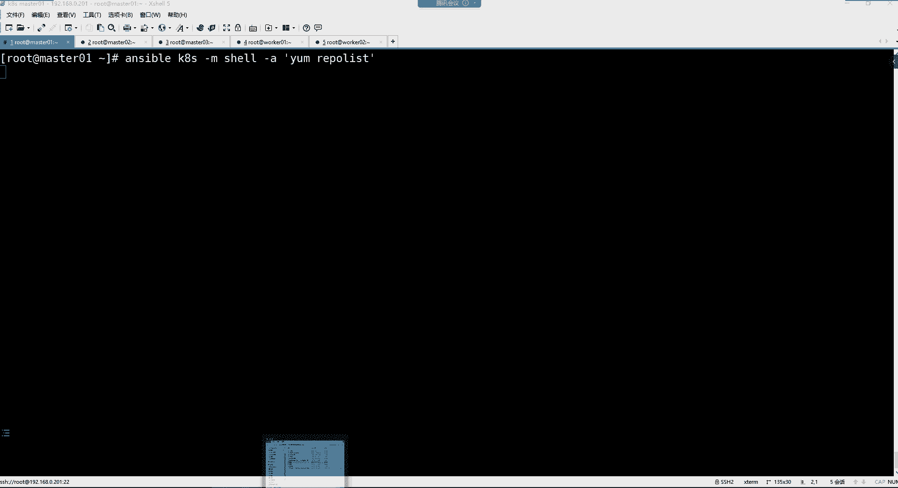
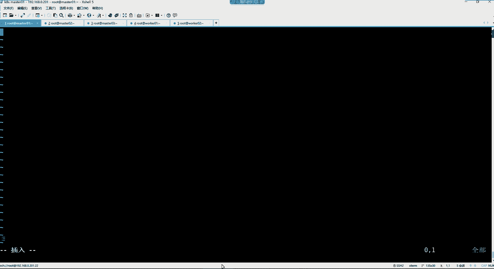

# 零基础入门Linux，红帽认证全套教程！Linux运维工程师的升职加薪宝典！RHCSA+RHCE+中级运维+云计算课程大合集！ - P108：K8S-4.k8s集群初始化、集群测试 - 广厦千万- - BV1ns4y1r7A2

hello hello，大家晚上好啊，能听到我这边的声音吗？听到声音的兄弟，讨论区刷个一，开始咱们今天的课程好，没有问题是吧？我们上节课是部署到了哪里来着？出现问题了是吧？

部署到这个Hproy啊和k live的这个位置出现问题了，是吧？😊。

然后我又把这个问题呢，我是经过一系列的排查，我发现其实就是没有问题。这个问题出现在哪里了呢？就是最终啊我们这个因为我又换了几台机器，你们看一下我这个机器的IP地址。😊。

你看我这地址哈，我这个地址呢是换成了192。168。0。201。然后这个机器呢。😊，它的地址是192。168。0。202啊，以此类推，这是203，这是204。

这是205跟我们前面的这个部署的步骤都是一模一样的。但是为什么说我们到这为止，我就看不到这个VIP了呢？我发现其实就是这个伊芙康菲哥这条命令，它真的是。给我们害惨了，为什么呢？你通过这条命令。

你是真看不到，你只能看到这个网卡上面的第1个IP地址。😡，但是我们的那个VIP你看哈。😊，我这个VIP我是配了多少呢？给你们看一下我那个k live的配置文件。😊，我这里边指定的VIP地址是这个192。

168。0。201，用的是这个VIP，然后其他的配置都一样，包括它的优先级呃，我们的这个第一个主ma，它的这个优先级呢是101，然后这个呢是100。99哈它的优级是99。

也就是说这个mar401的优先级呢，它是高于这个mar402的这都是没有任何问题是吧？但是这个VIP。😊，我发现你用IPS你能看得到。看了吗？就是你用衣服抗fi个，它就是看不到。但是你说他配置成功了吗？

他配成功了。😡，Yeah。😊，这真的是非常非常让让我们觉得这个。😊，傻瓜的一种情况是吧？对你那条命令他就是看不到，我们还以为是我们配置的问题呢，其实最终不是我们的笔记里面所的步骤是吧，怎么配都没毛病。

😡。

所以最后的话呢，我这里边标注了一下，就是我们的那个VIP最终怎么看哈，就是得。😊，在这儿。啊，查看VIP的时候，你用衣服confi命令，你看不到那个VIP，你得用IPAS这条命令才可以。

这就比较狗的一个地方，是不是啊？😊，然后我要把前面的那个Hpro和 cable level的这个。图呢我又给大家更新了一下啊，这样呢大家能够便于理解。嗯，因为我前面我跟你说。

我说这个Hpro和这个c loud，我们在做这个ma高频用的时候，他们之间的这个。😊，呃，就是他们的那个。存在的意义是什么呢？首先你要知道。

就是你看我这个图里面是不是有这个cap alive和这个Hpro呀，两台设备是吧？然后两台设备里面呢分别部署了这个相应的服务了。那最终的话呢是k alive，它为Hpro提供一个VIP。

也就说最终我们的VIP可以用这个。😊，这是我们的VIP那这个。😊，key log给Hpro提供VIP之后，然后是不是我们这个Hproy，它就有了一个高可用的这么一个功能了呀。

就是你其中某1个Hpro如果出现问题了，那最终我的VIP是不是就漂移到另外1个Hpro上面去了呀？啊，那这个VIP最终它的意义在哪里呢？就是最终啊我们这个ATpro。

它是给我们集群的API那个集群的一个管理入口。干嘛呢？去接收我们的管理请求的。就是最终你看我们想管理集群，那我管理集群的话，我得通过比如说像这个可以通过哪些方式呢？你比如说我可以通过这个它的面板。

通过大sboard去这个在它的面板上面去操控集群。我也可以通过。科ber。CTL这个命令去操控这个集群。好，那我们的这个命令最终你看啊我现在只有三个master。

那我的命令最终到底是由哪个master去接收呢？😊，是不是啊？好，那我们的所有的命令最终呢是先到达VIP。然后VIP呢，它是不是是给Hproy？所使用的呀啊，然后Hprocy呢。

它接收到了我们的这个请求之后，然后Hprocy再把我们的请求给它干嘛呢？给它转发到我们后端的mas的节点上面。那就说最终你哪个Hpro出现问题了都没关系啊，你的请求呢最终是由VIP去接收，然后呢在。😊。

转发到我们的这个后端的ma字上面。以及我们这个集群里的工作节点，像什么work节点。他们在跟我们的这个master的节点在进行相互的通信的时候，其实也是借助这个VIP。能列了吧。

因为Hpro是将所有的管理请求轮循的转发到我们的每一个ma上面。这样master就知道我们想干嘛了。能理解了吧。好，这个图的话呢可能更利于大家去理解一些，是吧？这时候我们应该知道这个它的作用是什么了。

然后我们这个部署继续啊，只不过我这个环境呢跟我们上节课的环境。就是换了1个IP地址嘛，然后其他的话呢都一样，一直部署到哪了呢？一直部署到这儿，查看这个VIP能够看得到是吧？好，然后这VIP的话呢。

最终你想验证。😊。

等一下，我看那个脚本我有没有放过去哈呃。😊，脚拌也在这儿。好，脚本能在这儿。然后我们想验证一下这个VIP它能不能正常的切换，那我们怎么办呢？我们这个脚本里面是检测谁的状态呀？😊。

我们这个脚本里面是不是去检测Hpro的一个健康状态呀？好，那也就是说最终在我们的这个图里边，如果其中你的Hprocy。

比如说现在我们的ATpro是属于ma01是吧？因为这VIP是在马斯林上面嘛，所以如果我们的这个马斯林上面的Hpro如果出现问题的话，那我们想验证一下这个VIP会不会漂移到马斯的02上面。

好，那我们就得去干嘛呢？我们关闭谁呀？我们是。😊，可以把这个Hpro的关掉啊，把这个ma林上面的那个Hpro它停掉。Sop H A。Proy。我们我们把它关掉之后呢，我们再看它的IP地址。

当然这个需要时间哈，它不是说没了。没了吧，是不是那个。这是我们的这个201是吧，这是我们自己的那个IP。然后你看看m402上面呢是不是有个210啊，所以他的VIP是不是就切过来了呀？😊，好。

所以后期的话呢，你看这VIP它只要能够。

正常的去切换的话，那么对于我们的这个集群的高可用。是不是就不会受到影响？因为最终我们的请求永远都能到达我们的这个ma节点上面就可以了。好，然后我们再把这个Hpro给它起来。

起来之后的话呢，我们一会儿再看他的IP会不会回来。看DS32。看那个210。这么慢的哈。有。特别慢是吧？那我们一会儿再看吧，反正他爱在哪个节点就在哪个节点吧。😊，一会儿应该就能切回来了。

现在应该还没动静呢。还在这个m饲料上面呢。切换时间比较长一些。有。哟还没回来是吧？😊。

那先不管他了吧，一会儿我们再看吧，行吧。😊，只不过他也需要时间。然后接下来呢，我们继续往下走。我们接下来开始部署这个谁呢？开始。这个部署我们的这个机群。我们集群里边需要部署的组件。呃，首先呢。

这里面我们用的是这个科ber尔的min。科ber尔的min的话呢，它主要就是能够帮我们去快速搭建一套K8集群的这么一个工具。所以这个的话呢我们是要在所有主义上面都要去安装这个cover amin。

然后那ct呢c这个组件，它主要的工作就是在我们的集群节点上面去接收AP server路的指令，然后去管理我节点里面的这个po，也是你的集群所有主机也都要安装。

然后还有一个是科伯CTL科伯CTL呢它是一个集群的一个命令行的一个管理工具。我们后续呢可以通过这个命令去管理我们的这个集群。好，这是我们这三个组件。我们呢要在我们的所有节点上面呢都去安装它。

然后那这三个组件我们如果想下载的话，我们得需要用到哪个源呢？用到这个你可以用google的官方的源，你也可以用谁呢？你可以用阿里的那个源都可以。但是google的这个源呢，我们是没有办法访问的。

所以这个你们就不用去尝试了。然后这个用阿里云的话呢，我们就直接在我们的所有机器上编。

我们用这个ansible。

我们先把我们自己的这个麻斯林音线配一下，然后把这个文件呢给它下发过去。

我这里面也是用安伯部署的。你看这是那个叫K8S点repo的这么一个仓库文件。那这个。我们就给他拷贝一下不就完事儿了吗？把这个K8的reple拷贝到每个机器。安ibleK8S。然后杠杠list杠host。

好，那这是我们的舞台机器，让我们用ensible指定K8S杠M调用co贝模块杠A然后指定SRC。ETC的y点repo点D下边的那个K8。S点reple文件，我它下发到。远程主机的。ETC的y点儿。

repose点D下边。怎问你。都OK了是吧？OK之后的话，我们得验证一下呀。😊，那就这样。ibleK8S，然后杠M我们用设模块。然后来执行一个yre的。那么这仓库加载起来还是。比较慢的。好。

我们就稍微等一下啊。IP切了吗？有IP还没回去是吧？那么回去我们把这个机器的Hpro给它关掉。这个服我们没看是吗？起来了哈。啊，我知道为啥了，因为c live都没有起哈。

因为我们的脚本是直接把c live给停掉了。😊，所以你就是看k宝 live的。它是一个关掉的状态，所以你把c left起来。把c loud起来，这个IP就回来了。我说他怎么不回来呢？你看是不是又回来了？

😊，这就可以了。这个脚本里边它有一条命令不是。要帮助我们去stop掉c alive吗？所以c live1停VIP才是真正的切换的那你VIP切换的话是切过去了，让你c live停了。到时候你想想。

那我们这边你不起的话，它IP也回不也回不来。呀这可够慢的呀。

那就等一下吧。

这别加载5分钟。

这可够慢的呀，是不是兄弟们。Ppoli。哎呦，我的天哪，这加载的。嗯ん。那我们捋捋吧，是吧，一会儿我们看看我们接下来要做什么事情哈。😊。

我们如果有了这个。阿里云的这个KPS仓库，你们知道这些仓仓库如果说自己找，应该从哪找吗？😡，你看啊，首先你去阿里云。你去到阿里云的这个。软件仓库。来到软件仓库呢，它这里边有什么呢？有容器的。

专门给容器准备的仓库，你点进去点进来之后的话，你看这里面就有科bernet和do的仓库了。然后你点到这个科bernet里边，然后这时候你看他就会告诉你，如果我们是在这个reo和斐多尔。

或者说森图S上面去配仓库的话，那这个命令啊，以及它的仓库地址知了吗？就是这样的。😊，啊，以及他告诉你安装的包看到吗？你应该安装哪些包，然后你应该去给哪个服务，给它设置服务启动。就就是从这找哈。

然后我们一会儿安的话呢，我们按照这个版本是1。23。0的这个版本就指定就安装这个版本。如果你不指定的话，是不是默认就是他仓库里面的一个最新版本了呀？

有这么慢吗？我看一下啊。Pig grape。然后。有没有个y的进程啊，还真有你看这y的进程确实是。在占用着呢。是吧亚么得进城。是通过user并写的python执行的user并写的ym。

然后命令的是ymre的。没毛病啊，只不过就加载比较慢一些。这可有点考验我们的耐心了，是吧？Pig rap。一样么？你看他也一样，他也在执行着呢。这个 rap。是吧。Mm。

那就等着吧。然后我们一会儿要是。安装完这个包的话，因为如果我们现在不加载，一会儿，那仓库加载的时候，它也特别慢。所以你这种加载一会儿安包的时候就快了。然后我们这个包安装完以后呢，我要配置可t。好。

配配 correct的话就是呃因为docker呢，我们是不是改了它的那个。😊，就是那个程序驱动的类型了呀，改成什么呢？改成那个C怎么D了。😊，我们前面是不是改过呀，在docker位置。

是不是啊修改了它的这个什么呢？驱动类型为s systemD。所以官方建议你，你的容器运行时用这个syD，然后呢，那么cro也要给它改成sD，这样才可以哈。我这其实这不是配置问题，是网络问题。

这跟配置没啥太大关系哈。😊。

就我这网现在加载的比较慢一些。你说我这配我这配我这配置低吗？配置不低。是吧配置挺高的，但是就网太慢了。我们这机构。带宽总共才多大呀，好像才。200刀吧。200兆，其实你想。那只是。

200兆只是你在运营商买的200兆，但是你200兆，你如果在这个真正实际使用的带宽呢，其实没多少。然后再加上我们这边。这200兆不是说我一个人用啊。😡，还有其他老师呢，他们也讲课。然后还有。

一些不讲课的人，他们比如说搞一些什么视频呢，上传下载什么的。也特别的消耗这个贷款，所以我这就比较慢一些。那升级带宽是吧？能对付用就对付用吧。毕竟你想想。咱们说的不算，是不是？我们就是一个底层的打工者。

是不是？结终的话呢。咱们就是人家提供什么条件，我们就。没有办法。等着吧。哎呀。To the。这咋搞啊，兄弟们。抽根烟去吧。啊。这不是着急的事儿啊，是不是啊？😊，H。😊，我去抽根烟去啊，😊，哎呀，这个。

没办法。我靠，还没完事儿呢。😡，这有点过分了。那我们这样吧。我们把这个东西给它。你说他加载一半的话，我们也不能给它取消掉啊，是吧？哎呀。我们哎。我们这样哈，我们这个趁着这会儿功夫，咱们也不能浪费。

咱们讲讲K8S的一个应用场景吧，好吧。😊。

哎。让他先加载着呃，K8S的应用场景，它现在主要应在哪个领域呢？呃，其实就是我们经常听别人说到的那个叫做。

微服务的架构领域。你好我们。我这个内核没升。

我现在用的这套系统内核没有升级哈，给你们看一下。😊，还是3。10的。

但是你们如果内核升级，必须得重启哈。😊，我们来说这个。K8S的一个。应用的领域哈。呃，KPS应用领域现在主要就是在哪儿呢？在这个微服务的。架构领域。但是对于我们很多小白来讲。那什么叫做微服架构是吧？好。

那。一会儿再说K8认证哈。😊，的认证，我们先说这个它的应用领域，这个我们得搞清楚啊，我们先说什么叫做微服务架构领域吧呃。在说这个微服务架构之前，我们得先说什么叫做微服务。

是吧然后再来说什么叫做微服务的架构。以及再说这个微服务架构的一个。应用的场景。然后我们去更好的理解这东西。现在为什么在企业里面那么火。嗯，首先呢什么叫微服务呢？我们拆解的话，什么叫V。其实微言外之意。

不就是小的意思吗，是吧？那什么又叫做服务呢？其实服务它言外之意，指的就是功能的意思。所以这个微服务它其实指的就是一个是一个很小的功能。而我这个功能呢，说白了。我只给你提供一个服务。所以这就叫做微服。

或者我只给你提供一个功能。😡，这叫做微服。那微服架构是什么意思呢？一说到微服架构啊，呃你们去防1个3W点京东点儿com。我讲这个地址就是一个微服的架构。

我们去访问一下啊。呃，3W点儿京东。点儿com。我们先说这个什么叫做一个很小的功能，或者是一个很小的服务吧。你看我们现在来到京东以后，你可以这样理解，这京东是不是有非常多的功能啊。

什么京东超市优惠券秒杀生鲜之类的，这些是不是都是一个功能啊，或者说一个服务啊，所以你就可以把它理解成是一个什么呢？是一个。😊，很小的功能或者就是一个微服务架构。就可以了。好，那你看什么京东超市优惠券。

京东生鲜、京东家电。拍卖等等等等等。这些的话呢，其实就是我刚刚跟你们所说的。那个微服务了。就说白了。我这就是一个什么呢？一个小的服。然后呢，我这个服务只给你干嘛呢？只给你提供这一个功能，什么功能啊？

京东超市。能领了吧。好，那是不是这些都是一个。😊，微服务啊。好，那么这些微服务在公司里边是由开发去开发的。开发人员去开发这一个一个的功能。好，那它这个功能，你知道在早期的架构里边。

京东在早期它不是微服务架构。它早期是什么呢？是一个那种传统的架构。传统架构是啥意思呢？就是大家在访问京东的时候，你看这京东域名。是吧。这是3W点京东点com。然后呢，那当你访问京东以后。

其实呢它所有所有的功能都在这一个域名下边。你比如说。在早期这个京东超市。那就在这个京东的域名下边，就是比如说3W点儿京东点儿com。然后后面呢有一个比如说优惠。卷儿的这么一个功能。然后秒杀的话呢也一样。

在这个3W点京东点儿com下边也有一个。秒杀的这么一个功能。然后我们在访问的时候呢，我们是通过京东这一个域名访问进来。然后呢，您在这一个域名下面呢去使用它所有功能。所以这个我们统称是什么呢？是一套架构。

注意哈，以上这种它是属于一套架构，一套架构它的特点是什么呢？呃，就是。我这个。一个域名。然后呢。在呃对应的就是搜索功能，就是集成了。所有的。功能。然后大家呢都是在我这一个域面下面去操作。

那这种架构的特点是什么呢？庞大。😊，是不是啊？你想想，就说白了你可以把它理解成是一个什么呢？就是因为你像京东他们家这种大型网站，他们的底层都是呃一般都是java开发的。😊，一个架构。

那么他java开发的那他在发布项目的时候，那通常呢你得把这些项目给他干嘛，给它打成一个腕包。那也是说我这一个域名集成了所有功能，我所有功能都在一个外包里边。好。

那如果说我每次比如说我需要对我的一些什么秒杀做一些更新啊，然后呢我的优惠券也要做一些更新的话，那是不是？😊，也就是说我这整个的一个架构可能说都得需要重新去干嘛呢？再生成新的袜包。然后呢。

再把新的外包呢发布到我们的这个。呃，整体的一个项目里面来。那你要知道，那你这个打包时间。你想想。他这一套架构的代码是非常大的。你再包括去构建去打包，去构建，再到发布，可能说就得需要2到3个小时。

那也是说每次我想对我的这个呃架构里面的功能做一些更新的话，或者说做一些修改的话，我的代码就每次都得重新打包，打包时间就非常的耗时，然后再去重新发布。没错吧，因为它是一套架构啊，一个项目嘛。好。😡。

那这种呢其实只是浪费了一些打包的时间，可能说我们觉得也没什么。但是你要知道呃，如果它所有的功能都都在这一个一套架构里边。那你如果公司里边来了一个新人的话，你让他去熟悉这套架构里边的那些代码啊。

就来一个新的开发，你让他去从头去捋一捋我们这个架构里边的那些代码的话，你觉得他能捋下来吗？那他可能说花个半年时间都捋不明白。干半年发现不行，跑吧。跑路了。好，那他跑了没关系。但是你说我这一套架构。

那我这个如果说我们这个架构里面的核心人员，核心的开发，如果说人家给你撂条子不干了怎么办？或者说人家就在这个架构里边，在某一个核心的。😊，位置给你留一个小bug。然后人家走了。

那后续你这一套架构都有可能引发什么项应呢？叫做蝴蝶效应。蝴蝶项就是一个小功能可以直接导致你整个架构瘫痪。是不是？这就是非常危险的呀。好，那咋办？那咱们就别把所有的功能都放在这一套架构里边了。

放到一套架构，确实是有很多的弊端。那咋办呢？好，那咱们就拆分，把我们的整个一个庞大的架构，或者这个传统的架构，咱们给它拆分成一个一个的小架构。那这个小架构你可以看一下，当你点到这个京东超市的时候。

你看这个域名。是什么域名，还是京东的那个域名吗？不是了吧。是不是它变成这个样子了，然后当你点到这个比如说优惠券的时候，你看优惠券的域名。😊，还是京东的那个域名吗？不是了。那这个时候你看你可以这样理解了。

你应该怎么理解呢？就是。我现在把我的整体架构给它拆分了。我现在这一套架构仍然对应一个域名，只不过我现在这一个域名里边。只给你提供什么功能啊，只给你提供一个功能。那这样的话你想想，那对于一个。

整体架构来讲，你比如说我其中京东超市。那么我们是不是可以专门找几个开发去负责专门维护京东超市的这个里边的一些代码啊？好，那你想你想想，这样的话，对于我这个。京东超市的维护是不是相对来讲就变成简单了呀？

然后呢，秒杀呢，我是不是也可以专门找几个开发，你就专门去给我干嘛呢？给我维护秒杀的这个代码。😊，是不是从维护的角度来讲，就大家都变得比较轻松了呀。你别再轻松部署，而且后续那你说。😡。

如果说我其中比如说这个开发人员给我的京东超市里边给我留了一些什么bug，那没关系啊，会影响到我的其他的这些微服务吗？也不会是不是？就包括你说我这个京东超市的核心人员核心开发走了。

那会影响到我的整套架构吗？也不会。😡，是不是？你总共这一个京东超市的代码也没有多少。😡，而且我后续比如我每次对我的京东超做什么更新呢？😊，那么你从这个发布项目来讲。的一个打包时间是不是也变得？

非常的短暂了呀。是不是这样效率就高了呀？没错吧。而我们可以这样理解，就是你比如京东超市。这就是一个微服架构。那么微服架构里边我们应该怎么去部署啊？我的这个京东超市跑在。哪里呀？

就是跑在KPSS的集群里边。所以你可以这样理解，就是它的每一个微服务都跑在K8S的一个小机群里面。就现在。这就是一套小架构了。一个域名。最终啊京东超市是一套架构，对应一个域名。然后呢，这个秒杀呢。

也是一套架构，我也对应一个域名。😡，然后分别让不同的人员去负责维护就可以了。微服务具体指的是什么？这就是微服务啊。你比如京东超市就是一个微服务啊。因为微服它只是一种非常抽象的一种表示。

但其实当你看到京东超市的时，就是这就是一个微服务。在整个架构里边，我这个京东超市就给你提供京东超市的功能。但这功能在我的这庞大的架构里面是不是比较小啊，就是一个小功能嘛。

所以微服务指的就是一个非常小的一个服务。我就给你提供这一个功能。然后呢，我呢也占用一个域名。但后续对于这种维护的成本来讲，是不是就变得非常小了呀？所以你看微服务架构的应用场景。可以说是在各个的。

那些这个。大平台上边。是非常实用的，因为它就等于是一个把整体的架构给你拆分了。变成一个独立的架构。哎，能听懂吗？好，能听到吗？听懂的刷一，听不懂的刷2。这个应该没有那么难理解吧。😡，能理解吗？可以是吧。

好，没关系啊，能理解就理解，不理解就说二哈。😊，微服务是安装在小相机上的吗？他可以在它可以不是这个微服务是跑在K8S里边。因为微幅你就可以把它列成是一个什么，是一个腕包。😡。

你可以把它列成一个java的帽包。那这88不就是一个小项目吗？那这小项目最终你想对外提供服务，你不是得需要一个运行环境吗？那这个运行环境我就直接干嘛呢？我就直接部署一套KPS集群。

假设我这个集群里面就几台服务器，5台吧台的。然后呢，我这个5台8台服务器里边就专门跑什么呢？跑我的这个比如说优惠券的这个服务。😊，可不可以？他不一定非得跑在小心机上面，它跟小心机不发生什么关系啊。

它只是一个服而已哈。😊，好，就是你可以把它列成这个功能的拆分。对，微服务就是一个功能的拆分。在我整个架构里边，我把每个功能都给它拆分开，然后运行在一个独立的环境里面。这就是我们所说的微服务架构。Hao。

这应该没有那么难理解吧啊。😡，我现在给你点到这个京东的网站，这么跟你讲，你们还不能理解。那如果你要是去听那些网上的那些什么非常抽象的告诉你呃，什么叫微服务架构。那你可能就更不能理解了，是不是？

这就是一个微服务。这也是一个微服务。这也是一个微服务。每个VV服务的话呢，都运行在一套K8集群里边。

啊，然后或者说淘宝也一样，你去淘宝看看。淘宝也是这种微服务架构。所以现在知道什么叫微服了吧，以及什么叫微服架构了吧，以及为什么大家现在非常喜欢用微服架构了吧，是不是啊优势太多？😊。

还没完事儿呢，我这我的天哪，这样吧哈，兄弟们，我这有点等不起了哈。😊，呃，是否继续？他现在加载到哪里了呀？这边EMre police list。是否继续？继续加载。好，完事儿了。いやも。啊。

前面是不是他得需要我们输入个Y，它卡住了呀。😡，是吧。re police，你看它是需要验证个Y。但是我们reple list它不需要我们输入Y呀，这什么鬼呀？😡，是不是啊？

你看为什么每次还让我们验证个Y呀？😡，这是科宝net官方仓库看到吗？得需要你输入个Y。那早知道我们提前给他输入Y不就完事了吗？是吧还等这么长时间，我还以为他是我的网问题呢。😡，好，然后接下来咱们安包啊。

安包的话呢安装这么几个包。😊。

版本是1。23。0的。

明令拿过来。雅么inst杠外。1234好，宣布完事走你。

看到吗？集群所有节点都要把这三个包给它安装上。但是这时候可能你们会。有一些疑问，你说对于可来讲，它不就是接受A片 server的指令的吗？这个不是应该在我们的哪个吗？

在我们的这个工作节点上面才需要有的一个组件吗？😡，是吧那个叫呃那个叫c的其实。确实哈，但是有的时候。如果我们这个mas的节点也需要去部署容器呢？那你妈自己脸就也得需要那个科。

但是mas一点确实还得需要运行一些容器。你比如像一些网络插件啊。等等等等。我们都是让它运行到mas的节点的。

嗯。这应该没有啥问题。正在安这三个包。完事了吧。好，完事儿了。然后呃每个机器都安装那包，我们查询一下哈，在这边。😊，去。用RPM查一下。RPM杠Q。8401。这三个包m02这三个包。

然后worker02这三个包。work01这三个包m03这三包好，完事，这个包安装完了之后呢，我们接下来呢。

就去把这个clet的那个驱动程序给它改成ssD就可以了。这个的话呢要去改这个文件去。然后这个文件的话呢。

我们先改一个，然后再下发就可以了。在。

ETC confi格下面。

ETC肯菲格下边有一个cro light，这个文件是。自动生成的哈，然后我们打开这个文件。😊，打开这个文件之后呢，把这里东西给它删掉。😊，删了之后呢。

接下我们把。这个给他放进去。就主要是加了一个它的sick group。driver等于sism。

复制一下。好，然后呢保存退出。然后接下来这个文件我们再下发过去ansibleK8S杠M用coy模块杠A。指定SRC等于ETC下的。这个文件。然后。下发到远程主机的也是ETCs confi格下边。没说吧。

好，怎么你。行，然后呢我们去看一下哈，看一下每个机器这个文件内容。k ETCs configurefi下边的。C不t的文件。好，内容也都变成。

一样的了。呃，接下来的话呢，我们就可以把ki呢给它设成开机自启动就行了。注意啊呃。现在不用去让他，我们现在不用启动它。因为现在还没有生成它的相关的配置文件呢，所以呢它什么时候起呢？集群初始化的时候。

它自己会起来的。所以我们只需要让它变成随机字己就可以了。

Syst CL enable。Cite。好，完事儿。

然后接来。进行初始化了，这一步的话就比较关键了哈。注意这一步我们。😊，只在某一个节点上面执行，而且呢也是在mas的。所以我们就可以在mass link上面去执行这个集群初始化的操作。然后集群初始化呢。

我们得需要一个初始化的文件。这个文件的话呢，我已经是准备好了。😊。

在有一个叫做kiber amin。这呢kiber amin杠 configurefi点压这个文件。这个文件呢就是集群初始化的一个文件。我们可以。把这个文件打开。car飞个点E木。这个里边的话呢，首先。

看哈。呃，由于我们是在我们的mar斯林一上面去初始化是吧？那你要把这个地址改成你自己本机IP，所以这就根据自己环境修改。那我的IP现在是多少呢？我的IP现在是。😊，201，所以我就给他改成。

201就可以了，自己本机IP然后以及我们这个集群的监听的端口6443。这是AP输入的端口。然后默认就行了。然后当前呢我这一个节点名字叫mar401。好，那这这个也不用动，这是你当前本机的名称哈。😊。

然后下边的话呢。我们要干嘛呢？要指定一下我们负载均衡的VIP那我的VIP因为后期我们加入集群，也是加入这个VIP这个地址。所以这个地址我用的是210。作为我集群的1个VIP。

然后你后续所有的请求都通过VIP去接收，然后再附载到你的每一个mas上面。然后那剩下的就是我们这个四层负载了，因为既有7层又有4层，所以这个都是。210。那这个16443其实一个备用的端口。

然后下边的话呢。镜像的仓库地址。这个仓库地址的话呢。就是我们一会集群初始化的时候，他会下载大量的镜像，然后这是从哪从哪个仓库下载这个地址的话呢，是杭州阿里云的那个K8仓库去下载它的那些音它的那些镜像去。

然后我们现我然后我们的镜像版本是1。23。0的。

就是我们在部署集群的时候，你注意哈，我们前面安装的包是1。23。0的吧。那你下载你集群的一些镜像的时候。😊，也得指定我镜像的版本也是1。23。0的那它下载哪些镜像啊？😊。

就是我们前面给大家介绍KPS的那些组件的时候。😊。

你看啊。我们前面对于KPS的部署，我们安装了它那些组件了吗？😡，并没有。哪些组件？比如说AP server，我们有安装过吗？没有schedular有安装过吗？没有contl manager有吗？

没有ETCD有吗？没有copro有吗？也没有。是不是啊？所以那这些东西都是以这种容器的方式去部署的。所以呢他得去下载这些组件的镜像去。所以这个镜像地址呢就从阿里云去下载。

然后下面的话呢。这是我们这个集群里的这个po网络以及44网络。但是现在这两个网络。我们也不知道是什么意思是吧，那你先不用管。😡，就默认就可以了，这是他们的默认的一个网络地址。😊，好。

其他的就没有什么需要改的了。所以你看这里面需要改的是啥，是不是就自己的本机IP地址啊？😊，没错吧。其他就没有什么需要你改了，包括你的主机名。如果你的主机名的话，你说我当前的主机就不叫妈401。😡，那。

你就把这改成你自己的本机名就可以了。😡，然后这文件。我们保存退出。啊，对，这个网络是service创建的时候，都用这个地址段的。然后呢，我们这个文件有了之后。

好，也改完了，那怎么去执行这个文件呢？😊，呃，用这条命令。这个啊。科 in，然后杠杠confi指定我们当前的那个文件就可以了，然后upload。c这个首先呢就是我们要去。

