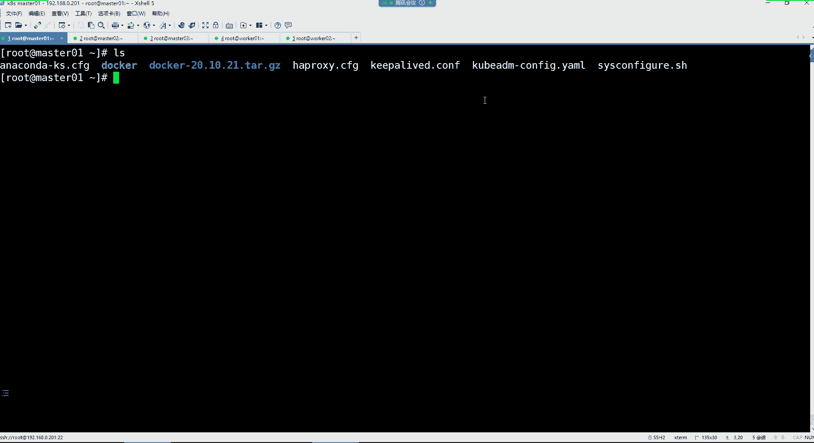
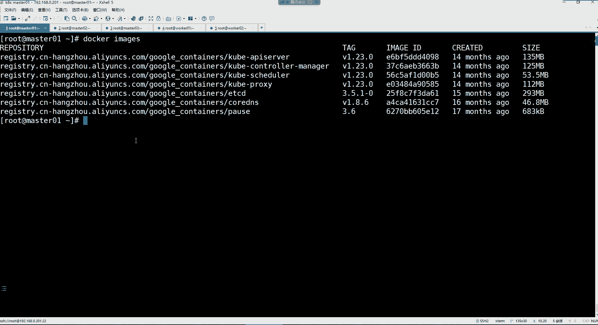
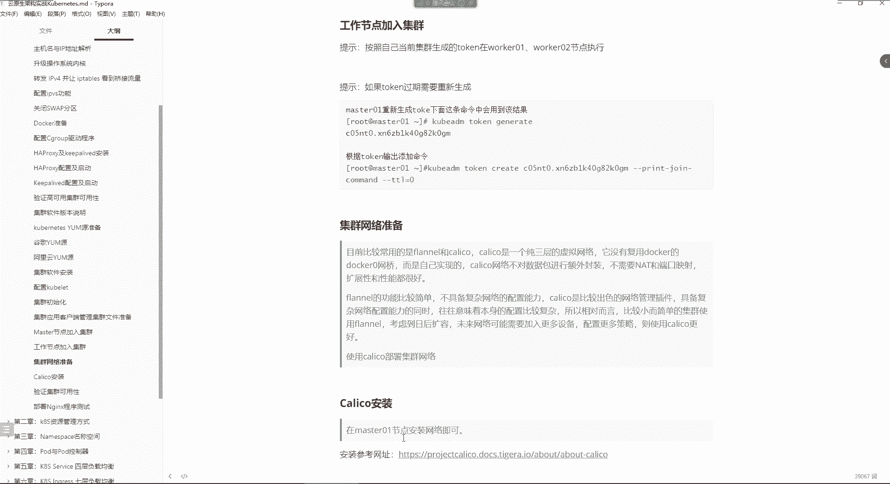
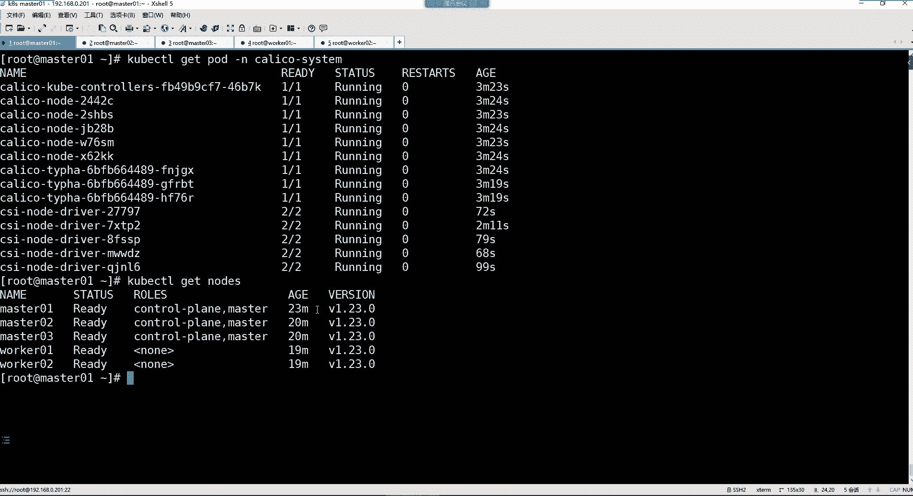

# 零基础入门Linux，红帽认证全套教程！Linux运维工程师的升职加薪宝典！RHCSA+RHCE+中级运维+云计算课程大合集！ - P109：K8S-5.k8s集群初始化、集群测试 - 广厦千万- - BV1ns4y1r7A2

通过这个文件去初始化的集群，然后呢，我的集群的tlkken给我重新更新啊，这属于集群的自己的一个什么呢？一个密钥。啊，这个我们现在也涉及不到哈，我们后续有专门讲这个集群的这个妙的一个地方。好吧。

那我们就把这个命令拿过来。

其实对于科贝尔的命呢。看看这个工具有非常多的命令。而如果我们是部署单节点的ma集群的话，那你可以通过一个优个的选项在命令行里面去什么呢？去。初始化你的集群。但是的话呢。你步如单节点的话。

在公司里边说白了也没有用。是吧。所以一般部署这种高坑集群都得生成这种配置文件。这配置文件也是通过咱们命令生成的。它有一个它有一个命令，它有一个选项能够帮我们去生成它的这个配置文件。

有一个叫做confi的这个。选项通过我的命命令就可以帮你生成集群的配置文件了。到是候我们是不是不需要去自己生成了呀？因为这个我已经给你们改好了嘛，根据我们前面的环境改好的。然后你们后续按照自己的环境。

把那个VIP地址改成自己的就可以了。

好，然后把这个命令拿过来。但是这个命令他需要下载镜像，这镜像如果在线下载是比较慢的。所以这镜像呢其实我也有。😊，在点儿呢在这儿。这是我们K8S1。23。0的这个镜像啊，这是阿里云的镜像。

这是这个镜像是阿里云下载的镜像。然后这个镜像是从哪下载，这是从google。官方仓库下载的。这个名字改一下哈。这是从google的官方仓库下载的镜像。那我们用用哪个呀？我们用阿里云的。啊。

所以到时候我把这镜像再发给你们哈，我们直接把这镜像导到我们的这个每个机器里边。😊。

从这儿传。直接用刀cker命令给它导进去，这样是不是就非常的方便了呀？😊，うん。因为都是我部署完以后，我自己手动打包的。😡，通过那个do save命令。自己给他。导出来的，然后又打的包。在。在这儿。

阿里云的。像这种镜像自己怎么打包，我们前面在讲dark的时候是候我们都说过呀。你有了镜像之后，你是不是可以自己把这镜像给它打个包，然后保存下来，后续需要用的时候，然后直接再给它导入一下不就完事了吗？好。

这是第一个机器。然后。再连谁呀？192。168点0点。202。用户名root。密码一。

联盟去是吧？

那就这样连吧。到时候部署完金之后，后续有新的节点加入怎么搞？呃，那就。嗯，那也比较简单。但是它不是我们现在讨论的一个问题是吧？节点加入集群，你要在你的mas上面重新给它生成一个。

我这里边有。看看啊，你看这里面不是有工作节点加入集群吗？我一会儿跟你说，后续再重新生成一个加入集群的命令。

哎呀，这资料太多了呀。我有一天都我生怕有一天我这电脑。突然间瘫痪了，不工作了，我这资料啊。我这饭碗可能就没了呀。😀呵哈。😊，这些音像每个机器它都需要哈，所以每每个机器都得导。😊。

整个群徽群徽是啥呀？有。那么把我插叉给关了啊。

啊，存储啊。没关系。我这个在阿里云上面也有备份，只不过就是导的时候比较麻烦一些。你像我这么多东西，我能不提前弄好备份吗？是吧。东西太多。

管事儿。啊，咱看一下啊。嗯。anibleK8S。杠M shell模块。然后拉牙4。镜像呢。叫这个名字，那就导入一下呗。把这个命令换成。Doker。load杠I。走你。

你们你们还记得我在前面第二阶段给你们讲这个安的时候。我就跟你们说过，我说我们去安测不。😊，其实对于我们平时的运维来讲，能用的模块其实就那么几个。没错吧。没骗你们吧，所以你看我们是不是。😡。

在这个面对大量服务器需要我们去批量管理的时候，是不是无非也就是设有模块和co贝模块用的最多呀？就是就这两个模块就足以满足我的大部分的一个工作需求了。还有那个squi那模块，就是帮我们执行脚本那模块哈。

那个用的也比较多。😊，这导镜像也比较慢，那就得等一会儿吧。这儿卡看到了吗？不是卡。现在是work02work01。

说说K牌的认证啊。趁这有高手。呃，KPS他们家呢，我记着我前面跟你们讲过这个认证吧。KPS他们家现在如果我们运维的话呢，考考哪个证考哪个证书啊，CK这是一个叫做管理员认证。😊，这个认证的话呢。比较简单。

总共就17道题。然后。这十这十几道题呢都是实操题哈，没有什么理论，也没有什么选择，都是实操上级实操的。然后这个除了这个以外的话呢，他们家还有像什么CKAD。这个叫做。

我去看一看啊。在这儿有培训。你可以选择中文的考试环境，你可以自由选择。你比如说我就喜欢用中文的环境考，那你就中文。然后你看到吗？他这里面告诉你了。😊，这个CKAD是啥呢？CKAD。

考试证明用户可以为科net设计构建配置和发布。云原声应用。然后这个证书。那这个叫做。安全专家。好吧。CKS还有一个。CKS这个叫做。安全专家的认证。那这个呢这个叫做开发者。真正。三个证书。

然后他这三个证书里边呢，其实只有CKA。是什么呢？是。我们这个运维能够用得到的。如果是开发的话呢，他们可以考这个CKAD。然后如果是想搞KPS的安全呢，就考这个CKS。啊。

其实运维的话也可以考1个CKS这种。面向KPS集群安全的一些。这个什么呢？一些。这个哎呀怎么突然间短路了呢。就是安全方面的哈。😊，然后然后每个证书的话呢，价格呢都不贵。

你比如我想看CK这个证书CK的话呢，他告诉你看这个的话，你能够包括基础的安装和配置，管理产品级，这不就是一个基础的一个使用嘛，是不是啊？CKS是不是要会编程呃，安全专家这个。CKA证明有足够的看看啊。

确保持有容易胜任各种最佳实战，构建部署和运势，基于容器应用和科本安全不不不不哈，它里面跟你的它它里面不需要你会编程，就是主要还是以它的安全为主哈。上街的时候可以。开一个浏览器页面。

他允许他允许你开一个浏览器的页面。然后呢，你可以干嘛呢去官方搜索它的相关的题。所以可以看资料哈，但是这资料一定得从他的官方去找，你不能说我去百度一下吧，那不行哈。然后考试的话呢，它这里边有中文网站。😊。

中文网站的话，这里边就你比如说你想获取CKA，那你就点获取证书。然后价格在这儿看了，证书有效期3年。然，下边呢告诉你线上考试，就是到时候呢它主要是什么呢？主要是。呃，会有一个。

摄像头用摄像头监然是你的一个什么呢？你那个考试的环境。然后的话呢，你就线上考试就可以了。然后允许你开一个浏览器的页面。然，考试时间2小时，证书要期3年，版本1。24。然后如果你第一次考挂怎么办呢？

还可以重考一次，总共就17道题。说白了基本上一次就过了。这是CKA，然后CKS呢。也是价格都一样，看到吗？那无非都是有一些什么KPS的网络存储安全维护的一些以及日志记录啊、监控啊、故障排查呀相关的题哈。

这是CKS的证书。你看然后详细内容就包含了哪些题看到了吗？比如说什么基于角色的防控制。安装基本安装基本集群。详细内容。以及还有这个工作服的哎下面。他提型已经告诉你了，包括什么存储卷呢。😡。

故障排除故故障排查呀这些东西哈。这就是他的大体的考试内容。但是最终你还得去看他的。最终还得去要有一套靠谱的题库才行。你你得去刷题库，你不能自己报名。

所以后续的话呢，我会给你们讲解CKA的题库。你们后续想考的话呢。都可以自己去考。我待会候会给你们讲哈。😊，咱们看看这几个镜像。这镜像啊你看一下哈。😊，有什么呢？有AP server。

有controller manager，有schedule，有cober proy，还有ETCD，还有我们给我们集群提供DS的功能的一个镜像，以及对我们的这个容器做健康检查的。12345677个镜像。

这里边是不是也是7个呀？都是7个。都7个。好，但其实我告诉你。在里边你比如像什么API server啊。还有这个什么conttrorolll manager啊，sched呀。其实这三个镜像。

包括ET呃包括ETCD其实我们是不需要干嘛呢，不需要在我们的工作节点。去导入的，因为它不需要。你像这些只会在ma斯的节点上面去什么的去创建。但是没关系，我们都给它导进来吧。毕竟都在一个压缩包里面嘛。

好，然后接下来我们就可以去通过这个命令去创建我们的集群了。只在mar401初始化。

那么们的文件是不是也在我们的root目录啊，然后我们这条命令是不就针对root下的这个文件去执行的呀？好，总你。

这一步如果报错，我们前面呢。

就肯定是环境部署的不对。你看我们这个集群初始化快不快，非常快，为啥呢？因为我们是有一个本地镜像，所以他从本地去。

这个什么呢？基于经销创建容器速度就很快。但如果如果要是在线下载经销文件啊，你在哪儿？你在这个位置。就在这位置的话呢，它会非常的慢。因为他会干嘛呢？他会下载镜像去。

那么这集群初始化成功了吗？我们。翻一下。看不懂是看不懂翻一下啊，你看这个很显然就是告诉你什么success play了，是不是啊？其实这就是他说你的科 net集群现在已经。😊。

初始化成功了。

看一下啊。但是你的科net控制平面已经初始化成功了，看到了吗？然后接下来你应该干嘛呢？他现在让你去这样，你要开始使用集群，你要以以下普通用户的身份运行这个命令。比如说你现在要执行这三条命令。

这三的命令比较简单吧。第一条命令是啥呀？第一条命呢是在我们的当前的加目录创建了一个隐藏的科ber目录。然后呢再去拷贝了一个文件，把ETCcurbernetmin点康复文件拷贝到了我们当前的加目录了。

并且改个名叫config。好，然后呢又把这个文件的归属关系改成你当前用户。是不是ID杠UID杠G就是你当前的所有者所有组。那其实就是root。那这三条命令我们是不是执行完了呀？执行完之后，下边看到吗？

他让你再去干嘛呢？😊，你可以使用用户去直行下面的面，其实就声明一个环境变量。声明这个环节变量，这是kerbernet的管理员的配置文件。😊，那你就把这环境变量声明一下就行了。好。

这是我们要执行的命令是吧？然后接下来他告诉你了，他说。😊，现在应该将po网络布置到集群里边，我们先不管什么po网络，我们先看下面这句话。这句话是啥？他说现在你可以以什么跟用户的身份在每个控制平面注意啊。

这里面是叫控制平面，就是你的ma节点上面运行下边那个命令。啥意思呢？就是让你的master加入到你的集群里面来。所以这个命令比较长，下边是一个什么呢？是是一串talkken。😊。

他基于这个taken去认证。如果说你想加入我的集群，你的taken是我能够认证的taken，我才能让你加入到我的集群。但最终你看集群加入到哪个IP地址上面来，加入到我们的那个VIP上面了。

那你这条命令最终载你的这两个ma上面去执行一下吧。m02。8403。好，那这是我的mas的加入集群是吧？那我的这两个worker呢，worker怎么办呢？你看下边他这儿又告诉你了。😊，什么呢？他说。呃。

然后你可以以什么跟用户的身份在每个工作节点运行以下命令，从而加入任意数量的工作节点。就是你想让你的工作节点加入集群，就把这个命令在你的。工作节点上去执行。我们总共是两个worker是吧？

你看就是ma节点加入集群，有ma节点的命令。work节点加入集群呢有work节点的命令。好，那你看我们这个mar402是不是也成了呀？啥意思？你就看这儿吧，看这儿就可以了。😡。

师不是他说你现在可以执行这个命令，查看该节点是否已加入集群了呀。哪个命令啊叫。Cbal C T L get node。Get node。有。看不到是吧，没关系，因为你没有权限使用它的命令怎么办呢？好。

把这个命令执行一下，执行完之后，你再去执行刚刚的那个命令。哪个呀？CCTLge nodes。好，那你看现在我们当前的这个集群里面有多少台多少个节点呢？

mus01ma402worker01work05台机器。是吧版本1。23。0的。然后那我这个mar403是不是它也得需要去像执行这条命令啊？这是管理命令吗？get node你发现也执行不了，为啥呢？

因为你没有管理员的配置文件。你有了管理员的配置文件，你就可以执行这命令了，他就可以这样。Cerer CTO get node。看到吗？但是worker节点。😡，他可不是管理节点。

所以他不需要执行那条命令哈。但是他有没有加入集群呢？好，该结点已加入集群。但是如果你想让他执行这个命令，他本身没有那个配文件。所以如果你想让他执行这个命令的话，你得到时候拷贝你得怎你得怎么拷贝呢？

就在我们的加目录下边。😡，呃。L点儿，你得把整个科本目录拷贝到你的工作节点，然后它才可以执行管理员的命令。但是我们不需要工作节点，不需要去执行那条命令哈。好，那我们那个。Stime master。

是不是就完事儿了呀？好。呃，那接下来的话呢，我们最终。这个集群就算是初始化完成了，我们后续的操作就在mar斯林上面操作就可以了。get notes。

所以最终的话你看我们这个。呃。你集群初始化成功以后，最终的话呢，如果后续你的集群初始化的时候出现问题怎么办呢？不一定非得像我这么顺利呢那你可以使用co a reset。在你的集群的节点上面。

注意你哪个集群初始化失败了，就你哪个节点初始化失败了，你就把这个命令在你的节点上面去重新执行一下。什么意思？就重置我当前的节点。😡，然后再重新初始化。但是你有问题的话，你得先去排错，排完错。

你再去重新初始化你的集群。😡，知道吧？就你不用说，那我这个集群初始化失败了，我再去。恢复个快照啊，重新部署吗？啊也行。但是可能没有太大的必要，所以你可以先把你的节点给它重置一下。啊，再重新初始化。

就是因为它初始化会生成很多的配置，就把那些配置呢都给他什么呢？都给他。😡，删掉。然后你再去排错去就可以了。好，然后呢接下来呢就是你的集群应用的客户端的管理集群的文件。这里面就是通过下面这位件去什么呢？

去生成的。那接下来的ma斯节点加入集群，ma斯节点加入集是不是按照自己当前集群生成的token在你的ma斯02和ma斯的节点和啊这个在你的这两个ma节点去执行啊。啊，然后你工作节点呢是不是也一样啊。

按照自己当前生成的token在你的worker01和worker02去执行啊。😊，好，那如果说你们在比如说我的工作节点呢加入集群，但是呢它如果说提示说我的taken过期怎么办？加入不进去。好。

你可以在你的m上面再重新生成一个taken。生成一个taken之后的话呢，你再用这条命令啊，这是你的kerboardmintaken create，然后再把生成的这个taken放在这个位置。

然后再后边加上这个选项。就可以去。什么呢？让你的几点。用这个新的taken去加入集群了。来了吧。最终哈就只要把这一串taken给它替换一下就可以了，别的地方不用动。

好，那么到现在为止，我们这个集群也算是部署完成了。部署完成之后，我们来看它的这个状态这个位置。状态这个位置你发现。

这个加入了之后是。是node节点。note几点哈。那如果你的master套ken过期呢？麻色方国体也一样。但是这种情况非常少见。为啥呀？

你说你初始化集群了，人家掏看给你准备好了，然后你的节点你不加入集群。😡，你在这等着你在等他的头疼过期。是不是啊？所以这种场景是不是几乎。😡。

就有点儿。不会有这种场景，是不是啊？😡，No。然后接下来呢我们来说说这个集群网络。集群网络的话呢，在这里面主要是我你看我们当前的集群的状态哈。😊。

你看它的state里边是什么？叫note note ready，啥意思啊？就是。ready不就是准备好的意思吗？但是我的这几个节点是什么呢？是note ready，就是没有准备好的意思。😡。

就你现在集群没有办法工作。然后那我的集群的角色分别你可以看得到这角色呢。首先，mussterma master。那他们两个呢没有ma的的就是工作节点了。好。然后这是我集群的一个年龄。

这个年龄从创建开始哈。😊，它会一直累加的。好，然后那我们集训现在为什么是属于note noteote ready的一个。😊，状态呀就是没有准备好啊，是因为我们前面在这儿哈。

在这儿他已经其实他已经提示你了，这块有一句话啥呢？😊，他说现在应该将po网络部入到集群里边，就是我们现在集群没有网络。啊，那对于网络的话，我们前面在讲docker的时候，doker有各。呃。

docker有很多种网络模式，是不是啊？在跨主机通讯的时注注意集群。你在给集群部入网络的时候，它一定是能够跨主机通讯的网络才可以。单你不能用单机点的那种集群啊，的那种网络。在K8里面用。

因为它是一个集群环境。每个节点。po之间都有可能需要相互访问，所以他也需要跨主机的网络。那么我们这个KPS里边。

他已经给你准备了非常非常多的网络插件。这里边就跟我们前面讲的docker根本就没任何关系。呃，这个地址的话呢，我们给它换成中文。你可以看一下哈。这里面是。KPS的网络策略。网络策略呢非常多啊。

什么ACL啊，还有calical啊等等等等。这些这些都是我们可以用到的一些网络插件。😊，那么这些插件呢，其实在这个行业里边。呃，用的比较多的，其实也就是几种呢，也就两种。第一个呢就是这个开ctic口。

然后第二个呢就是这个feno。你看这是一个可以用于curbernet的overland的网络提供者。overland我前面在讲在讲dork的时候，我们是不是也是涉及过这个overland呢？它是可以让。

Docker。里边的容器跨主义通信的一个网络。没错吧。好，然后colical的话呢也一样，都是支持跨主义通信的。但是呢这个开ical对比于这个flanno这两个网络插件的话呢，呃fno的功能会更加的。

呃，更加的简单一些吧。我这里面其实写了它两个的一个对比。就是常见的网络插件，现在就就是这两个。然后开le头呢是一个纯三层的虚拟网络，没有复用docker的那个docker零作为它的网桥。

而f呢其实就是一个二层网络，它是复用了刀克零的那个。网卡作为它的一个网桥。然后那个只不过的话呢，f兰no它不具备复杂网络的一个管理能力。而col而开的话呢呃它从各个方面来讲，比这个feno。都要出色。

特别是在一些复杂的网络管理的环境下边。那么它就是能够体现出它的优势。所以这两个网络插件我们如果说是想要去考虑到底用哪个的话，如果你的集群节点数量比较小比较少的话，用flaneno就可以。

如果你的集群后续你比如说我还要考虑扩容，那么可能说网络后续的配置也比较复杂。那么你考虑到之后扩容的话，你后续可能加入加入到更多的节点。要配置更多的网络策略，那你使用开口就会。更加的方便一些。

所以呢我们就。直接用这个开力口吧。行吧，呃，开le后的部署呢，这里边有一个专门的地址。我看看这个地址哈。这是开ic口网络插件的一个地址。然后这里边有一个安装开口看到吗？安装开口里边展开它。Hey。

在网络里面吗？怎么点不动呢？哎。什么情况？为什么点不动啊？是不是啊？可以了是吧。浏览器的问题。然后。我们我们要给谁去安装colical，你看它它它那边你可以在open stack里边。可以在KPS里边。

好好，那我们点。K8S是吧，我我要在K8里面去安装它。然后点第一个安装开ical。然后安装的话呢，它这里边是。有命令哈，看他告诉你第一步，你安装开力口，你应该干嘛，让你去执行这条命令去。啊，安装什么呢？

它的什么targe开口操作服务和自定义的资源定义。这里面是。等会儿啊。看看他这个。这是下载的这是下载它的一个压墨。镜像是从刀哥号板上拉取吗嗯。不不不他他是有自己的仓库的哈，你等会儿哈。

你看他这个位置是什么呢？是直接去从这个地址去。😊，创建这个文件里的资源，就是这个文件里面是有它所需要的一些什么一些资源。然后呢，这个命令执行完以后呢，第二步呢。

你再去执行这个叫做什么叫做自定义的一个它的压er文件啊，resources这文件。第一步命令注意第一条命令我们可以直接来复制。😊。

复制完之后的话呢，来到我们的这个注意这个网络插件只需要在ma上面执行就行了。😊。

其实具体的面令你们如果。不访问的话，你直接可以复制我笔记里的这个。看了吗？第一步就是去这个地址去。执行这个文件里的一些就是说白了就执行这个文件去。

我们就按照笔例走吧，好吧。执行一下。air roll了。报错了。404。找不到这个页面了是吧？😡，404了，那也就是说我们还得。按照官方那地址走，我那地址可能失效了。

这个可以吗？这可以是吧，那咱们得替换一下呀。但是这种东西其实。是不是什么时候用去官方复制一下这条命令不就完事了吗？安装开裂口的这个命令是吧？😡。

然后就是给你创建了一些他所需要的一些资源。然后他他所需的资源现在有了之后，第二条命令是啥呀？😊。

第二第二条命定就是什么呢？去。😡，再去创建这个文件里的资源，但是这个不要直接创建，为啥呢？把这个命令。复制一下，放到我们的笔记里边，Wge注意哈。把这个文件给它下载下来，这文件里面有些东西需要改。😊。

把这个命令。因为他们家的那个地址。

好像是HTDS证书好像也过期了。我看看哈。Wge能不能下载下来？哦，可以是吧。行。卸载下来之后的话呢，你就有了这么一个文件了。叫customer resources的加文文件。

这个文件就是我们可以自定义我的这个什么呢？网络什么网络po的网络，所以我们打开这个文件。打开之后，这里面是。别的东西。你都不用改，就改这个。这里面有1个IP地址，看到吗？这个地址你给它改成什么呢？

我们前面的po网络。😡，你还记得吗？我们先把这个文件先退出啊。😊，就是说我们这个在初始化集群的时候，我们是通过这个文件初始化的是吧？叫cboardmin。😊，这个文件。

这里边呢我们是定义了一个pod网络，这是pod网络的地址。那这个地址最终的话呢，我们要干嘛呀？要让他跟我们的那个colical。配置文件里面的这地址要让它保持一致。

因为最终你的网络是由开le口帮你去负责管理的。所以呢到时候你在创建网络的时候，开le口也知道。😊，他帮你创建哪个网段的？这样就可以了。

就改这一行，这里边我应该标注了，看到吗？就改这个。

指定pod网络地址。别的地方都不用动。

好，然后保存退出。那保存丢之后呢，我们就可以去执行这文件，自己去执行这文件哈。😊，我用这个。用这个create。

杠F。创建这个文件。创建。

这就穿建好了。H。😊，那创建好了之后，你说难道我的集芯就有网络了吗？😡。

Cport control。Get node。这得慢慢等，我们可以先执行哪条命令呢呃。

看一下啊，这命令你们先不用管哈，课本 controltrlge N。在这里面我们会看到有一个叫做什么叫calical杠sst的一个，这叫名称空间。所么先把这命令先去执行一下。

查看。

这个名称空间加的po，你只要看到它的pod能够运行，那你的网络才能起来。所以get po杠N命令先不用管吧。你看这个泡它这里的泡的数量是不是？running了，然后这是镜像下载。

嗯，可能说有些会下载失败呀。也不一定是也不一定是也不一定是现载失败。😡，啊，你到时这个开头以后启动不了，镜像拉取失败，那就得翻个墙。如果你镜向拉取失败就得翻墙了。然后我们这儿你看有一个。

开ic后的 cold。是属于运行状态running的，是不是啊？但其他的呢有的是什么喷顶挂起的状态，然后这是拉取镜像。这应该是镜像没有拉取过来。嗯，那我们先不管这些，我们先干嘛呢？

就是对于我们这个开ical网络官方。

他需要我们去执行这两条命令，就是你前面的网络布署完之后哈。😊，他不是告诉你执行这条命令吗？执条命令以后呢，它里面其实是有所介绍的。😊，啊，他说呃什么。在这儿哈这儿第四步第四步呢。

他让你清除什么主仓上的污迹，这样你就可以在主仓上安装什么吊仓之类的，是吧？就实就是让你执行这两条命令。这两个面令主要是什么呢？就是。会涉及到一个污点的东西，我们把这两条命令。拿过来执行一下。

因为我们这个colical。这个网络插件是以容器的方式运行。但是呢我们前面在使用这个cormin搭建集群的时候，默认呢我们的集群呢。mo斯的节点上面呢会有一个污点。有这个污点的话呢。

那么我们的容器就没有办法被调度到这个mas的节点上面。那也就是说我们最终这个colical这个网络。他没有办法被调度到mas上边，所以就运行不起来。所以咋办呢？他让我们去执行哪个命令呢？

执行这两条命令是吧？那这查看污点的话呢，我们现在其实看也没有什么事。我们现在可能说看也看不太明白。

所以你就直接把这两个命令在我们这个mars那边，只要在mars01执行就行了。两条命令。好，执行完了之后，我们再去干嘛呢？run你了吧，快不快？是不是全部都装进了呀？😡，主要的原因是啥呢？就是。

mas的节点刚刚不让caical。😡，调度到你的这个ma丝上边。所以你要把这个mas上面那个污点给它干掉，干掉之后的话呢，它就可以调度了。一旦调度。好，那我的网络插件就全部都运行了。😊，他是这样的。

还有污点。学到了吧。好，那这一步我们做完之后，我们再看我们集群状态的时候。Get。n是。是不是全部都变成ready状态了呀？啊，变成readd状态，你的机群现在就可以用了。😊。

那用的话我们怎么验证啊？好，那这时候的话呢。呃，我们先看一下我们这个集群的什么呢？有一个叫做kiber杠 systemst的名称空间，看看他们那里边的那些po是否是正常运行的。先这样看就检查一下嘛。

get。

old杠N一个叫做。呃，那个民众空间。叫做kiber杠system。get to杠N跟上。这个名字如果我们的这个名称空间里的po都运行的话，你的集群就一切OK了。为什么非得看这个名称空间呢？

因为我们集群的那些核心的组件都在这个空间下边的，包括我们集群的ETCD数据库看了吗？分别在mar40mar402mar403这个节点，以及我们集那个什么AP server。😊。

集群的管理入口是不是也分别运行在这个三个节点上面呢？以及我们集群的那些核心的组件看到了吗？😊，而你看我们集群的什么Cpro，是不是就分别运行在有5个呀？😡，每个节点都有。

所以你看最终其实我们如果说前期在导镜像的时候。你的这个work节点只需要导哪个镜像啊，只需要导这个就行了。coverber pro。其他的其实他都用不上。因为其他的在这个我们的这个工作节点上面。

它需要什么？它需要dockerdocker我们是已经给他部署过了，还需要一个什么？还需要一个kerletclet，我们也给它部署过，是不是？😊，QA管道给grape，它需要docker。

还需要compte。是不是都给他部署过呀？还有剩下什么呢？剩下就那科berpro了，就像我们前面在这个图里面说的工作节点，其实这个我们提前给它安装了，docker我们也提前安装了。

剩下其实最终导镜像只要把Cberprocy镜像给它导进去就可以了。😊。

但是这个你们知道一下哈知道一下。😊，卸载KPS集群吗。😡，我们这好不容易安装上的，你非得让我卸载啊。😡。

。😊，你要想卸载，你要是想卸载的话，无非就是把它那几个软件给它卸掉不就完事了吗？😡，Yeah。😊，Yeah。没有没有卸载过哈。如如果你们想演示一下这些东西，要卸载的话，你们去网上搜一搜吧哈。

我觉得应该是非常简单的哈。但是我确实没卸过哈，我部署这么一套集群啊，老费劲了。😊。

行，那接下来呢我们这集群不就完事了吗？完事之后，我们最终验证一下怎么验证啊，咱们搞一个程序跑起来，然后去访问一下不就完事了吗？是吧？那接下来呢咱们就部署1个NGS。

然后我们去访问一下这命令呢大家不用管了哈，命令我们现在没有讲，我们现在就是直接。😊，去。嗯。我去找一个镜像啊。我这里面是有一个镜像的。

呃，我先提前上传一个镜像进来。

呃，这个镜像的话。怎么说呢？我看看啊。这个镜像。最终我也不太确定它会运运行在哪个节点，那没关系吧，我们就直接这样搞吧。嗯ん。反正这样。

那我就怎么着呢？咱们找个镜像哈，这个我有1个NGS镜像。然后这镜像呢是。我们今天自己打包的那个景象。这个抽奖的1个NGS的一个镜像啊，咱们把这件给它搞进去。放在我们的worker0和worker02吧。

因为最终这两个节点呢是优先会运行我们的这个容器的节点。今天讲的挺快是吧？主要。😊，主要是。咱们今天没遇到这种诡异的事情啊，是吧？非常顺利嘛。😊，do load杠I。是。抽奖。好，完事。然后我们就。

来把这命令执行一下吧。这命令呢我们镜像哈换一下就行了。😊。

听一下名字。看一下。是抽奖NS版本V一。版本V一。创建一下。看成功了吧。Get厚的。running了吧。好，running之后。

那接下来我们是不是直接在我们的集群里边跑了1个NGS啊，是不是啊？然后是我们自己等的镜像吧，那无所谓哈，我们就为了验证一下。😊，那这个镜像的名字。不装加4，然后呢，我们这里加一个。提前。将。镜像导入到。

worker01和这个。worker02。节点。

然后这个镜像名儿。

是叫这个名字。把这个换一下啊。因为咱们这个镜像里面是不是有页面呢？好，然后接下来咱们给它报了一个端口，开放一个端口就可以了。

这些命令先不用管哈，我现在就是完全是为了测试哈啊报了个端口，就等于说给我们这个NGS做一个端口映射。😊。

做了端口映射的话，我么想访问的话呢。😊，那么。在这里边。把这波都给他删掉。查看一个叫sice的一个东西。C呢是可以看到我们当前NGS所对应的端口是多少的。

Get SVC。这是31452端口，注意，这是我们的1个NES。哎你颜色这个容器的。对外部暴露的一个端口。然后我们现在就访问这个端口。就可以访到NGS这服务了。那这个端口我们访问哪个节点的IP啊。

哪个节点都行。😊。

你现在访问你集群任何一个节点IP都可以了哈。比如192。168点0点，比如我访问202兰几，203203是哪个机器呢？😊。

这是204是吧，203是8403。

好，然后跟上这个端口。回车好了吗？是我们NS跑在K84里边，我说。

都可以访问的，然后你换谁呀，换我们的那个210。

我们集群的VIP是不是也一样啊，是不是也能够访问呢？😊，换成任何一个节点IP都行了，比如202。也没有问题。啊。不是访问哪个都行。它是一个集群的，现在。

集群就是你访问任任何一个集群里的主机都能够看到这个页面。比如访问204。是不是也一样啊？播放205。

是不是也一样啊？是吧。他现在已经变成一个集群了哈。😊，那现在我们这个集群才算是。真正的部署完成了。然后服务呢部署到里面之后，是不是也可以正常访问呢？那你说我们非得通过这个端口去访问吗？没错，为啥呀？

我们前面在讲docker的时候，docker在我们的这个系统里面运行的时候，docker需不需要做一个端口映射，才能让外部访问呢？😊，不然我们没有办法直接访问到这个容器，是不是？必须通过端口映射。

所以这就类似于一个docker的端口映射。在我们的速主上面给它暴露个端口，这就不能说在宿主仪是在我的集群上边。😡，他现在是在整个集群上面都给你暴露这个端口。

然后你只要访问集群任何一个节点的这个端口就都可以。知道吧？容器默认存放在哪个磁盘，生产环境，如何规划存放容器与镜像的存储空间。我们后边再讲存储的时候。再说容器的话呢。本身。呃。我们前面在讲do的时候。

是不是最终容器会在va下的lab下面有个docker目录啊。😊，是在。Rs。尺腕下的lab下边有一个docker目录啊。没错吧。

最终其实容器不还是运行在我们这个docker这个目录下面一个container里边吗？但是他被你他但是他给你哈稀了，你看不出来哈，看不出来。😡，呃，不懂他怎么把请求引到抽奖项目所在怎么办？

你现在不用去理解这些东西，我们现在只是为了测试而已。

我们现在还没有讲他的什么。任何的一个记录点呢。我们现在是说白了只是部署集群，现在别的什么东西都没讲呢，包括什么管理集群呢、集群网络呀。😡，是不是？😊，我现在啥都没讲呢，你理解啥呀？😡。

