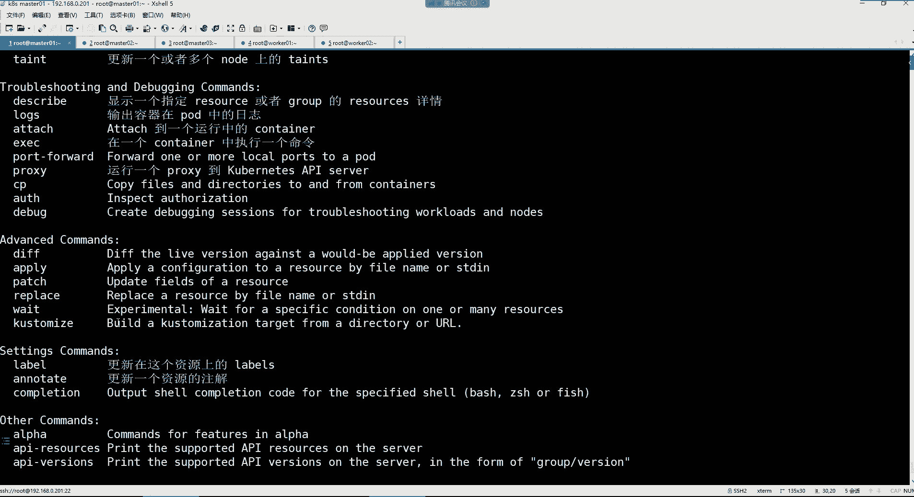
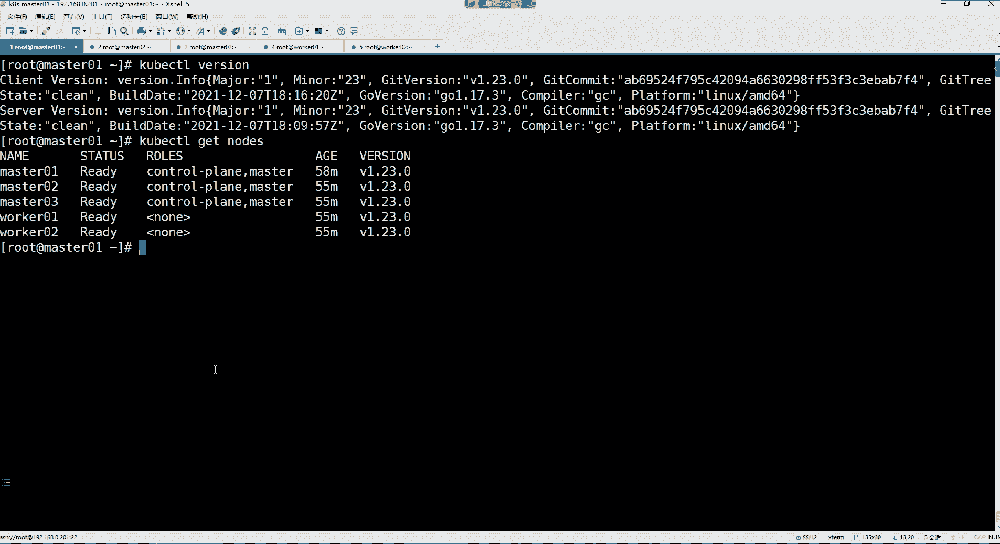

# 零基础入门Linux，红帽认证全套教程！Linux运维工程师的升职加薪宝典！RHCSA+RHCE+中级运维+云计算课程大合集！ - P110：K8S-6.k8s集群管理命令kubectl使用 - 广厦千万- - BV1ns4y1r7A2

好，兄弟们，我们这个。接下来就开始KS的应用吧，呃，学学这个到底怎么去管理它是吧？

呃，首先呢。我们先说一下啊，这个KPS它的本质就是一个容器的集群的统一管理系统。然后用户呢可以在集群中部署各种服务。那所谓的服务是什么呢？所谓的服务就是一个一个的容器嘛。然后呢，并。

指定程序跑在容器里面不就完事了吗？所以这个概念比较好理解吧，就到现在为止，我们得知道KPS它到底是干嘛的，就是管理容器集群的一个。统一管理系统。好，那么接下来呢我们这个在KPS当中，我们在学习的时候。

那它里面有很多抽象的概念，这也是KPS至今为止为什么这么难学的一个主要因素。为什么呢？呃，因为这个很多的抽象概念是我们前边在学习那些技术点的时候，我们压根就没有设计过的。比如说在K8里边。

他对所有的内容都被抽象为叫资源对象。那我们学习KPS其实就是学习如何管理那些资源对象。但是现在问题来了，哪些东西算是资源对象啊？注意你比如说容器容器在KPS里边。我们就可以称之为是一个资源。

所以他所有的东所有的东西都叫做资源对象。那如果我想了解KPS总共有多少个资源对象，你可以执行这条命令，用科 cTL，然后有个叫API杠resources这个命令的话呢。

你可以通过帮助去获取的科 cTL杠杠。

然后它里面就有一个叫API杠resources这么一个选项。然后我们再这样科CTL，然后跟上那个选项回车看到了吗？这些都是他的资源对象。那这么多的资源对象里边呃，左边是它的资源名称。

中间这部分呢是它的一个资源的一个缩写。然后这一部分的话呢，是一个资源的当前的版本。好，那对于这么多的资源，我们应该怎么学呀？太多了，太庞大了是吧？

所以我们学的话呢，我们就学那些我们能够用得到的资源。所以这里面呢我也给大家列举了这些资源了。你比如说呃这里面你可以看到有一个叫做资源名字叫ndes的。ns呢是我们集群的一个组成部分。😊。

组成部分是哪些东西啊？你看啊我们通过科CTLget nodes的时候。

它可以列出什么呀？列出我们集群的节点。总共有多少个，所以这就叫做集群的组成部分。能理解了吧啊，所以。这个node或者说我们的集群的节点在K8里面也叫做一种资源。叫做节点资源，或者说n资源都行。

这就是资源。

所以叫一切皆资源。那么这个ndes呢，我们可以给它缩写成NO也可以。

你比如说我们在用这个命令的时候，你可以NODNOD可以吗？不行。NODE呢node呢node可以，或者说NO也行。看到了吗？最终呢它都可以帮我们列出我这个集群的节点数量。

所以这就是一个资源啊，那还有哪些资源呢？比如说什么名称空间，name space。这个的话呢是隔离pod的。它叫做名称空间。主要的功能就是隔离pod的那什么叫pod，我们好像也不太知道是不是啊？

那pod是什么呢？pod。最终的话呢其实就是。叫做装载容器的一个资源，或者说叫容器组都可以。

君我们的容器其实是最终运行在哪里呢？运行在这个po当中。当然我们现在还没到详细讲po的时候，就像我们前面给大家画这个图的时候。

这个图里边我们所有的容器最终你看啊，比如说我的这个网站，我的数据库最终运行在哪里啊？运行在这个pod里边。所以po呢其实就是一个容器组。这里面就是装载容器的一个资源。

然后还有比如说什么叫做replicationation control，这些都叫做。pod的控制器了，包括什么呃replay case，还有什么developmentdeer set。罩吧。

可on罩吧什么呃等等等等的这些。都是属于叫做po的控制器。而这些破度控制器呢，它通通都由谁去管理呢？我们前面给大家讲过，在K8里面有一个组成，就是叫做conttrol manager。

它不是对我们的这个程序去。这个部署安排的嘛，那么他怎么部署安排我们的程序呢？最终就是由他去负责管理我们这个集群里边的这些控制器。好，但是控制器非常多，也是我们重点学习的一个资源。

以及KPS里边的什么这个sice，这些的话呢是集群的网络。或者叫统一的po对外接口。但是呢其实就是一个集群的。四层。负载。好，然后还有什么E格瑞斯，E格瑞斯的话呢，这是一个集群的七层负载。七层。

负载均衡的资源。负债均衡。好，还有包括什么这个。存储资源。PV以及PVC之类的，还有什么confim配置资源secret。密钥啊是配置密钥。嗯。叫做么。配置资源密钥资源。好。

还有什么这个servcount服务账户，这些都是我们在接下来要这我们的这个KPS的这个学习里面要讲的这个资源。那么我们是不是得一个一个讲啊，因为这么多的嘛。

所以我们先来带领大家了解一下KPS集群的管理方式都有哪些。我们想要使用KPS集群的话呢，那么我们前面一直用的一条命令，就是这个科berCTL这个命令，它呢就是一个集群的管理命令。我们在用这条命令的时候。

你看哈呃首先的话呢。😊，你可以干嘛呢？你可以直接在命令行里边。去通过这样的方式。去，比如说我要给我的集群创建1个NGS。的这么一个po的。好，又或者说呢你不在明诊行里面创建资源，你可以干嘛？

可以把你的资源写到一个文件里面。但是它的文件呢是ymo格式的文件。然后呢，你再通过这个科 city命令，然后通过create或者说paash的方式去针对文件去执行。而这文件里面是什么呢？也都是。😊。

比如说帮助我去可以创建NS这个容器的一些命令了。所以你看我们在使用这个。科CTL的时候，那么。是不是两种方式啊？第一种就是直接在命令行里面去创建，要么就是把你的相关的配置写到文件里边。

然后呢你去通过文件去。管理或创建你的资源。但是对于科 C还有这个命令的话呢。我们想要去学习的话呢，这里边你可以通过杠杠help去获取他的命令帮助。我们前面已经获取了是吧？

科berCTL杠杠help那它的命令又非常多。就是跟刀客差不多吧，这里边你包括有什么cate命令。以及什么explandelete这些命令。好，那你说这么多命令，我们应该从何学习啊？

也非常多是吧？好，那这里边的话呢。😊，常用的命令呢，我也是给大家列举了有这么多。那这么多命令里边，其实我们真正常用的我已经给大家标记了蓝色字体的哈，比如create可以帮我们去创建资源的。😊，一个命令。

啊，包括什么idit是可以帮我们去编辑一个资源的。啊，ge。可以去获取资源，然后呢delete删除资源。ex plan可以帮我们去获取资源的文档。然后下面的话什么describer。

这可以显示资源的内部信息。logs输出容器在pod中的日志以及app play，这是可以创建资源，即可以更新资源的命令。那这些命令。包括我想看我的集群版本呃。

用versionion可以显示你当前的集群的版本。你比如说我现在就想看我的集群版本。

Cber CTTL。Wtion。那我当前的你看class version集群的版本是什么版本的呀，是不是1。23。0的一个版本呢？好，所以这是。

这些命令哈，那么这些命令的话呢，我们在使用的时候，它有一个格式，这格式是这样的。科CDL我们在用的时候，后边的话就接上我们那些命令了。那这命令就是我们前面在这个位置给大家介绍这些命令。

你后边呢就是接上这些命令。😊，然后呢，你还要指定你要操作的资源类型是什么。那么这个类型就是我们前边在这个表格里边给大家介绍的这些呢都是属于资源类型。然后你可以通过缩写去操作他们。

你比如我想创建一个什么呢？我想创建一个po。😡，那你的资源类型就是old啊，然后呢。呃，如果你想创建一个什么其他的资源，这里边呢都要指定上它的类型。然后name name的话呢。

你可以指定具体的资源名字。那这个名字的话呢，他也是严格区跟大家写的。啊，fls这个的话是可以指定一些额外的可选参数，例如什么杠OY的之类的那这些我们得实际用一下才行，是不是啊？好。

你看那么我们把这些命令格式。😊，来放到下面这几条命令里面的话，我们看一下。比如我现在想查看我的po，我得通过科CTL。这是我的命令本身是吧？然后后面你要接上你的命令了。那你想查看的话。

get它是可以帮你获取资源的，就是查看的意思。好，那这就是你的命令。😊，我的命令是get。好，那接来你要看什么资源呢？你就得通过类型来指定。比如我想看我的节点。

那你就得这样了啊，科berCTLge nodes。是不是？我集群的管理命令，然后呢，最终呢我要干什么指定你的操作。然后呢，针对于哪个资源。这不就是列个命令的几部分了。

前三部分没错吧。好，那如果说我想看具体的某一个资源呢。

你可以指定他的名字，比如说我们可以这样科berCTLget换一个资源，我不看我的node了，看我的NSN是什么呢？

NS是什么资源呢？NS在这里面叫做名称空间，就隔离po的。然后它的全名叫name space，但是呢缩写成NS就可以了。好，那这时候你看我们在这个里边。

Get I。好，但是我现在我的名称空间非常多，我想看某一个名称空间怎么办？比如我就想看这个叫科ber杠C system的名称空间，那你就得这样了，指定空间名字。Cerber gun。Sytも。回车。

你看那他现在就只给你显示这一个命中空间。

看到了吧？好，那这时候你看我们现在对于这个命令已经应用了它的几部分了，一直到这儿了，没错吧。😊，是不是啊？你看这是我的命令，然后这是我的科CL命令。然后呢，我最终我要通过get去看谁呀，看我的名称空间。

但是呢我的空间非常多，我又指定了一个名字是吧？科ber杠sstem。😊，是不是啊？那你看这前四部分我们就应该知道这个命令应该怎么用了吧。那后面flags这是什么呢？这可以列出一些额外的科选参数。

你看我们现在我换什么呢？我换看po。😊。

看什么pod呢？我们前面创建了一个pod，你可以直接用kiCTLge。😊，厚的。然后回车是不是NGS这个po是我们前面创建的那呀。好，那我现在想看它的详细信息怎么看？😊，杠O。来这里边啊po，然后。

户外的。啊，那你看这个信息是不是会更加详细一些呢？杠O这个选项可以让我们指定一些额外的参数。😊，外的不就额外嘛，那额外的参数里边你看啊前面这部分是不是跟前面是一样，一直到这儿是不是都一样的呀。

但是后面是不是你直接这样看你就看不到呀？你比如说我这个安键S。😊，他的1个IP地址。你能看到吗？你看不到，这就叫po的IP。那这个po的IP地址我们是为什么会变成这样的一个地址呢？最终是因为我们前面在。

😊，科本有的min这个文件里边。我们在。这个文件里面指定了我的po的网络了，就是我们创建的所有的po网络，都是基于这个10。244。点0这个网段的地址。

所以你创建的所有portd都会被分配为这个网段的地址。那你说这个地址我可以改吗？可以可以根据你的需求改。你想给他改成哪个网段的，就给他改成哪个网段的。你改上哪个网段呢，他就给你创建哪个网段的。😡。

这就是我们的这个NDS这个po的IP地址。然后以及我们NES，你看我们现在集群中总共有5个节点。那我这NGS在我的哪个节点运行啊？他告诉你了，在worker01节点运行着呢，在这个节点。

看到了吧？所以你看最终我们这个命令是不是？他的命令格式现在能看懂吗？啊，一般当我们看po的相应信息的时候，一般杠OY的是最常用的。就是一些额外的参数也会帮你显示。好。

那对于这个命令格式应该都没有啥问题吧，相对来讲是比较简单的。😊，是吧。好，然后我们在除了可以使用外的时候，你还可以这样。嗯。或者。啊，这个你可以使用Y的。也可以使用。

比如说呃以这种这次的形式给我显示他的相应信息，又或者说可以使用这种。

压没o。的形式给我显示我的资源的详细信息。你比如说我们现在。看这个po的时候，你把这外的换成什么呢？换成jason格式，那它就以jason格式给你显示了。看了吗？但是这信息是不是非常多呀？😊。

这信息太多了吧。以及那你说这信息大子怎么看呢？😡，这里面你可以简单看一下，比如我当前这个po在哪个主机上面运行，以及我这个主机的IP地址，这不就是work03的地址嘛，以及我当前的这个运行的状态。

然后以及以及我自己本身的poIP。😊，看到吗？这就是以jason的格式去显示我的信息了，以及我这个镜像。好了吗，我在基于哪个镜像去创建的，以及我这个镜像的ID号，以及我容器的ID号。好。

然后以及我这个容器的名称，这里面都能看得到。啊，其他还有什么呢？其他好像就没有什么太多需要。现在介绍的了。啊，这以J层的形式显示，然后还可以以这种压墨的形式显示。😊。

压模形显示呢就是比jason会更加的简洁一些。这里边你可以看到当前我这个po在哪个主机上面运行，以及我当前的状态IP之类的好。

都能看到。这就是一些额外的可选参数。所以你看我们现在用这个c C和命令的时候，它的这几部分组成。是不是我们经过应用以后，我们就不会觉得它有多么的难了呀。好。然后那接下来呢我们。来说说这个科CL命令。

我们在用的时候呢是可以呃补齐的，但其实没有太大必要哈。如果你们想补齐，你自己安装一个这个。😊，这个batch completion，这不就是个超级补齐的一个工具嘛。然后后续你在用它命令的时候。

它就可以帮你自动补齐它的一些，比如什么这些。命令参数。命令个选项。他能够把你自动补齐，但是其实总共。我们的这个KPS的命令呢也没有特别的复杂。所以这一步呢你可以用，也可以不用哈。你要用的话，每次。

你比如说你把这些命令操作完以后呢，你每次都得干嘛呢？你换一个终端，你就得去ss一下他的这个。😡，文件去让那文件生效才行。这就比较麻烦一些。那我们这步就不做了吧，好吧。😡，因为我觉得这命运都比较简单一些。

然后后续如果说我的node节点，我也想使用这个科 city条命令的话，怎么办呢？因为我们的这个worker节点，它现在是。

没有这个科命令的。你比如说get node。你看他有这命令吗？他没有。

那如果你也希望要在这个节点去执行的话。你就直接把我们的这个加目录下面的那个点科ber的隐藏目录拷贝给对应的节点，放在它的root加目录就可以了。然后后续的话呢，那个工作节点也可以执行科berC条命令了。

但是呢没那个必要。好，我们知道就行哈。行，这就是我们的这个集群管理的一个命令的一些基本用法。嗯，那了解了基本用法之后呢，我们接下来来给大家讲KS的第一个资源，就是这个name space，叫做名称空间。

我们把录屏停一下。