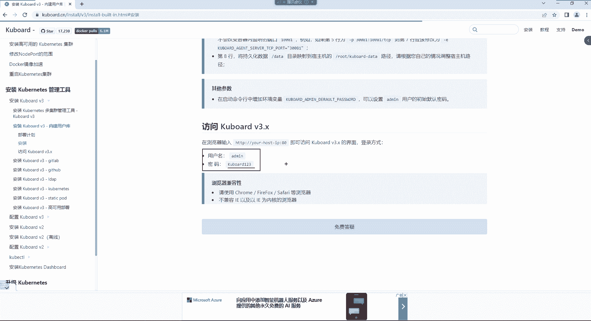
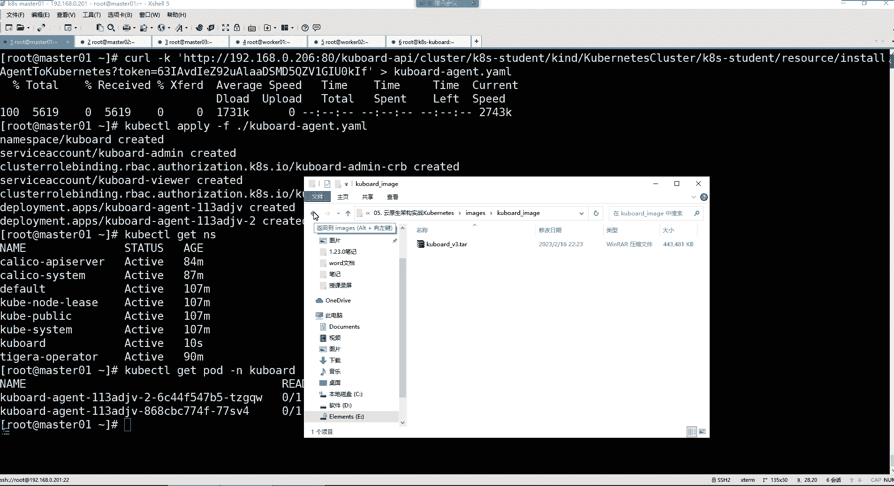

# 零基础入门Linux，红帽认证全套教程！Linux运维工程师的升职加薪宝典！RHCSA+RHCE+中级运维+云计算课程大合集！ - P111：K8S-7.Kuboard平台部署、Namespace名称空间资源管理 - 广厦千万- - BV1ns4y1r7A2

然后接下来呢我们来说说KPS的第一个资源。就是名称空间。名称空间是什么呢？名称空间首先在KPS里面也是一个非常重要的资源之一，它主要的作用就是来实现资源的隔离。这个资源隔离呢。

你可以把它想象成我们生活中的那个房间就行了。你看我们生活中一个大房子，你这个房子如果想合理的去使用它的话，你是不是去合理的去划分每一个空间呢？比如说这是我的卧室，这是我的厨房，这是我的什么这个书房。啊。

这是我的卫生间之类的。合理的划分。是不是啊？好。那其实这个。那么ス呢。它主要的功能就是可以将不同的pod划分到不同的名称空间里边，然后呢把这个po给它进行一个隔离。然后形成一个逻辑上的组。

因为在这1个QPS里边，你比如说我们运行着不同的应用。

那么我这些应用我最终的话有些应用呢，他们之间呢没有任何的逻辑关系，也不需要去相互的访问的话，我怎么办呢？那我这一套集群里边，最终呢你可以去给它。

都给干嘛，都给它创建成不同的名称空间。您比如说我创建一个名人空间，我这个空间里面干嘛呢？去专门运行我的一些。呃。比如说一些那个。什么。APP的业务。程序。APP业务程序。然后另外一个空间里面呢。

比如说我还可以运行一些其他的类型的程序。比如APP1的业务程序，然后其他的空间呢就APP2的业务程序。好，就是不同的业务可以放在不同的名称空间里面去运行，这样呢就可以形成一个隔离空间隔离了。

所以这就叫名城空间。你比如说我们这个集群，我想看一下我的这个名城空间怎么看呢？

那在这里边，首先它的资源名字啊全名叫做namespace。然后我们可以用缩写NS。来表示。那这时候我们想看一下我这个集群总共有多少个名众空间。

科CTLge，这不是获取资源吗？我要获取哪个资源呢？NS然后回车。那我们现在的集群有多少个名人空间呢？有以下这么多个啊，你可以看到是不是其实我们在创建集群的时候，这个KPS已经把。😊。

一些资源给你进行了隔离了。比如说呃我们这个网络插件开口，你看它自己就有什么呢？就有两个名称空间，然后每一个空间里面呢运行着不同的。Poold的。然后呢，其他的民众空间里面呢。

比如说像我们这个co杠c这个名众空间里边，这里边运行的就是我们KPS集群的核心的组成部分。😊。

那这时候你看啊我们看到的这些空间里边。

到底每个空间是干嘛的？我这里边是有所介绍的。你比如说前面这两个以colical开头的这个就是colicical的网络插件的名众空间了。然后像这个default这个名人空间里面存的是什么呢？

这是一个默认的名人空间。😊，就是所有未指定的po都会被分配在这个空间里边。我们前面是不是创建了一个po呀？我们是不是可以通过curberCTLget。😊，透的看呢。NS这po。

那么NGS这个po最终它在我的集群的这个每哪一个空间里面运行啊，我也不太知道。但是我们在创建的时候，注意我们可没有给他指定。一个具体的民众空间。就是没有指定，没有指定的话。

那么它就会被分配到这个叫default的这个空间里面了。就是你未指定的po的都在这个空间里面运行着。好，然后还有哪个呢？还有这个什么科ber杠 nodeode。

这是集群节点之间的一个芯跳维护的一个命众空间。但这里面什么都没有空的。你最终你想看某一个空间里面运行了哪些资源。你比如我想看这个空间里面有没有破的，你怎么看呢？Herber C， O get。

然后指定我的资源类型是po的，但是杠N。杠N这个选项呢，它是用来指定。

具体的名称空间的好了吗？然后呢，你比如说我想看哪个空间，你就指定空间的名字。

我想看哪个空间呢？我想看，比如就叫这个空间的吧，把名字拿过来回车。你发现他说这里边no resources是吧？没有找到。你的资源什么都没有，没有你的polo资源。看到了吧？

但如果你要看default呢，你比如我把这个给它换成default。那你看在de的下面，是不是就是我们看的那个NS那个po呀？就在这个deford空间里面运行。

只不过我们前面看的时候是不是并没有指定这个空间名称啊，但是你不指定，其实默认就是这个空间了。😊，好，然后还有这个科ber gunpublic 科ber gunpublic呢这是很显然。

public就公共的嘛，所以你这时候你看的时候，你指定一下这个科ber尔杠public这个空间，这里面是不是也没有找到po的资源呢？就这个空间里面没有运行的pod。那你说这个public是干嘛的呢？

注意该名称空间下的资源可以被所有人访问，包括未认证的用户，什么意思呢？因为后期我们这个集群呢，你是可以赋予。比如说一些普通用户的授权普通用户。那如果说你没有授权呢，你比如说有一些这个访客啊。

他们想访问你集群的某些资源的时候，那么他们只能看到public这个空间下的资源。但是这个空间我们一般不放一些我们的这个实际的，比如说什么po呀，不往这里面放。但你知道一下，就这个空间呢不需要任何认证。

都可以访问。🤧好，然后。这个还有一个是。科普 downs。呃，科ber杠system，那这是。我们KS集群的核心组件的那些资源都在这个空间里边运行了呢。那这时候你要看的话。Cber CTTLge N。

就是这个叫Cber杠 systemst的。那我们可以去。ge他的什么呢？ge这个po，就我现在要看pod，但是这个po我要看哪个空间下的pod，你得杠N来指定N是什么呢？就是。那个namespace。

的一个缩写指定名称空间的这个空间就是科ber杠sstem。好，那这时候你看他现在就帮我把这个空间下边的这些po都给我们列出来了。那这里边就是我们机群的核心的组件都在这个空间下边运行着呢。好。然后。

还有一个嗯这个的话呢是这是我们前面是不是在创建caic的时候。

我们执行了那么一条命令啊，就是开立的一些。在哪个位置来着？在这一步的时候，我记得是这个。这是开了的一个资源。这是资源清单文件。是是执行了这条命定啊，那这条命信呢，它也是有一个空间。所以你知道一下。嗯。

然后那接下来的话呢，唉我这里边有一个没有给大家讲是吧？这是通过serrus能够快速部署一个高可能K大机群。呃，这个的话呢。嗯，不知道现在还能不能用了哈。😊，我以前用过Cus的话呢，它本身就是。专门。

给我们提供快速部署集群的这么一个工具。你用它部署的话呢，这里边只需要简单的两步就可以了。第一步执行这条命令。第二步呢，执行下面这条命令，两条命令就可以帮你快速部署一套集群。

但是它部署的机群最终底层用的那个容器运行时是。Contain的地。并不是docker哈。而我们又不太了解con地的一个。应用。所以这套集群你部署进了，部部署出来之后。

后续可能说你得先去学学cont地的命令，然后你才能去使用它底层的容器管理命令。包括下载镜像什么的呀，查看容器之类的呀。所以这个的话呢，大家先不用去管这些哈。好。

然后接下来的话呢呃对我们这个KPS它有一个。kerboard的一个图形管理平台。这个图形管理平台我们是会用得到的。这个的话呢呢，它能够让我们在管理集群的时候变得非常的简单。啊。

那么这时候我们如果想要使用这个管理平台的话，还还我们还得准备一个机器呢。

呃，这个机器的话呢。就是我们找一个机器就可以找一个机之后，因为我这里面已经有一个了，有一个机器。

然后这个机器呢。那。我们这个快照里边这样哈。这是恢复到一个。系统的初始环境吧。好，然后恢复到初始环境之后呢，我们再开机。

你看这机的配置是不是跟我们前面的这个都一样的呀？开机。这地址是192。168。0。26。哎呀，但是这个平台的话怎么说呢？我我不太想用这个，为啥呢？

因为最终这个我后续。

有其他的用处。我们再创建一个机器吧，对吧？再创建一台虚拟机。这是我的什么呢？呃，K8S杠。壳报的，然后地址的话呢。192。168。0点。我们是205，我们210啊210不行嗯，是。20。6吧。好吧。

1点等168。0。206。放在这里边。是K8S杠。可报的。杠192。168。0。206。好，放在这儿。啊，50个G的磁盘。内存的话呢4个G。然后CPU2核心。这些都给它移掉。

网络模式ATT好，关闭。And照。

这机器是不是我们新就是我们新创建的呀？😡，这机安装非常快哈。😊，复习一下虚拟安装。没错。因为这个虚拟安装确实是。嗯。已经好久没有用过这个。好久好像好久没有创建新的虚拟机了，是吧？😊。

应该不至于我们每次用到这么多机器的时候。你们应该都得去频繁去创建新的机器。是吗。好久没有安了是吧？然后其他都不用管了是吧？选择好我们的这个系统盘，然后把这个。科d功能给它取消掉。

不然他不是占用我们160兆内存嘛，给它学掉网络。配置。给IPV4。手动加个IP地址。是192。168。0。206。然后1。2。168点0。254。DS223点5。5。5。保存。网卡打开。然后完成。

开始安装。非常简单吧。

让他安着吧。然后科霸的话呢，在这里边。你的虚拟网络都是ES33。没关系啊，它可能说由于你的这个work citizen的版本不一样。就是最终其实不同的版本。

你比如说我们是我的是work station16pro。但是如果你们用的是work station，比如说17的呢，那可能说你们通过。😡，这个不同的版本创建出来的虚拟的网卡名字也有所区别。所以那。

不是什么重要的部分，无所谓的。😡。

然后这个srus呢，这里边有一个官方地址，我给你们找一下哈，在这儿这儿srus。😊，哎呦这好像翻不过去啊。啊，不是srus是吧，我们要这srus干嘛呀？我们又不用srus。我们要科包的。

然后你们如果感兴趣，可以了解一下这个工具哈，这是它的一个官方地址。😊，不能说官方把这他的仓库地址，然后怎么用呢？非常简单，它下边有命令。😡，就两条命令哈，就两条命令就能够帮你安装一套K8S集群。😊。

然后这个集群的话，最终你看第一条命令就是下载什么呢？下载它的一些相关的srus程序。然后把这把它的srus下载下来之后呢，你就可以去干嘛呢？通过srus去创建你的集群了，并且指定你的集群版本。😊。

然后再指定你的master的IP地址3台。按照你自己的环境指，然后再指定你的node的IP地址。就完事了。然后这位置是呢？这位置是什么呢？是你的集群的每个节点的root密码。😊，因为他得需要连。

因为他得需要最终得能够登录到你的每个机器上面。所以这位置是指定你的root密码的。最终用用的话呢，就像我这样。在这儿你就指定你的每个机器的入程密码就可以了。在指定你的集群的。IP地址就完事儿了。

非常简单，两条命令感兴趣可以了解一下。然后安装壳爆的话呢。最终的话呢，这个东西才是我们真正才能能用得上的东西。这是他的一个。一个代码仓库，你看他这有有介绍哈。

他说kerboard是一个基于什么conet的微服务管理界面，同时提供kerboardnet免费的中文教程，入门教程，最新版本的科net的安装手册。啊。然后这个东西用起来的话呢。你可以看一下。

他这边是不是都是有所介绍的呀？专门为科bonnet设计的免费管理界面，然后呢每周发布一个什么beta版本等等等等的。然下边的话呢呃这里边有在线演示，就是你怎么用啊，它的特点是什么？这东西非常的好用。

然后。那。这是他的官方地址，我们去看一下哈。用户名哎，这是一个。用户名是保得min。密码的话呢，默认密码叫做。壳爆的。123是不是这个试试啊，又不是。哎呦不是A密码吗？我记得是这个密码啊。啊。

叫demo是吧？啊，用户名demo。人家写了，你说我都没看是吧？😊，demo123。啊，这是看到吗？然后在这里边的话呢，你可以他说可以访问是吧？deford空间，你可以点进来。点来之后呢。

你可以看这里面有一个web NS查看一下。然后外搬价是。这里边是啥呀？已经超过已经运行了一年了是吧？你看到吗？2021年9月2号运行的这里面是1个NNS的容器。嗯。

最终我们就可以通过这样的一个界面去操作我们的自己的集群了。反正就是这么一种形式吧。还可以不？都是中文的，能看得懂不？是吧。好，那咱们如果想用它的话呢，我们这边就。

虚拟机我们看看我们的虚拟机安装好了吗哈，重启一下。😊。

安装壳包也非常简单，就这么几条命令。😊，我们创建科包的，他已经给你提供提供了。通过docker一键去部署的一个命令了。然后我们最终的那个地址是多少呢？是206，然后kerb默认。对外暴露的端口是。

这个80。嗯，我记得他这有一个安装文档是吧？他这个安装文档里边。你看当前它兼容的KPS版本都有哪些呢？现在最高是1。25的版本。然后下边呢，我如果我们想要部署的话。安装提示。

支持科ber configurefi。而cboardA站的两种方式导入集群。这个东西。将壳包的安装在K84集分中。安装在K8集群里面吗？别了。安装方式。哎，他的那个命令。放在哪儿了呢？

好久没有登录这个网站了。Yes。看一看啊。这个。Yeah。他给我们提的那个命令在哪儿来着？是这吗？不是。不是这个啊。就是怎么安集群，他也告诉你，然后我们这个安装。哎呦。安装科board的。兼容性。重启。

嘿。是我怎么给忘了呢？

登录一下啊。没关系。我们就其实也用不太上。K8S杠。Cboard。地址192。168。0。206。

，先把它的环境我们先初始化一下。

把这脚本拿过来。

然后先初始化一下啊。这是吗？那就是这个命令了。好了吗？那就是这儿了，安装科board的V3内建用户库。做好一个简单的部署设计。然后。看外网啊就是直接访问它的IP加80端口，然后通过科po呢。

就它是基于什么自己的这个10081端口去跟你的这个cronet集群去进行通信的。然后他说安装之前看到吗？有一个linux服务器，然后呢。你呢要保证你已经安装docker了，并且版本不能低于这个版本。

然后已经拥有了自己的集群了，并且版本不能低于这个版本。然后接下来你就可以去安装它了。安装的话呢，在这里边就是命令已经给你准备好了，看到吗？你就通过这条命令。😊，指定你的内网I就可以了。其他的不用管。

这磕包到自己本身的端口。是不是比较简单的？其实这命令呢就在这儿。就在这儿哈。Docker run，刚 ID。是吧那docker wrong杠D下边这一堆命令。通过容易方式部署一键就可以了。

我后告诉你用户名是我tamin，密码呢是kerboard123。

我们先放这吧，咱们这个环境初始化完以后我们去。安装一下。

到时我们前呃前期还得把刀号什么给他安装一下。刀看的话，我们原先不是有个离线包吗。在。在软件包里边，我们一会儿直接把刀的包给它导进去就可以了。是不是20。10就满足自的要求了呀？所以这是它的安装地址。

点这个就可以了。好久不访问了，主要是。

嗯。19以上就可以了。然后我们用那个20的。啊，点击此处什么在线演示之类的就算了吧。因为他已经把命令给你准备好了。

嗯。

咱们是介绍完了这个名称空间了，然后呢，咱们把科board的给它安装完，我们今天就差不多了。然后从下一课开始呢，咱们就给大家讲鸭么语法，以及怎么通过鸭么的方式去。这个搞那个K8S的资源去。

sus安装机型能演示一下吗？呃，一会儿拍个快照演示一下也行，也可以。但是。不知道现在还能不能用哈，主要是。😊，怎么说呢？原先有人验证过说这C4现在好像用不了了。😊。

一会儿给你们演示一波吧。好，然后咱这机器拍个快照。

这是。第一。初始化。系统环境。

在开机。你上次就没安装成功是吗？好，然后我们再登一下啊。红性连。连了之后呢，咱改个名。那么叫K8S杠。壳包的。行，就这名字吧。好，然后把do那个包给他。倒进去。你没安装成功的话，有可能是。网络的问题。

我看看我有没有ker爆那镜像啊，科bo的。dosbo的镜象。Harbor。然后。开裂口的景像我也有。哎，我有磕爆的经验，看到吗？兄弟们。这个科包的它需要的镜像，我这有，所以我就直接导这个镜像就行。

但这镜像的版本可能说不是现在它的这个新的版本了。因为现在是V3的版本。

所以我们还是下载这新的版本吧，是吧？有新的我们就不喜欢用旧的了。然后把这个刀会给它起来。

好。啊，直接就把他的命令拿过来吧。

嗯。有新的我也不愿用旧的。我看我原先是哪个版本哈啊，我原先也是V3版本，这没啥区别呀。是不是啊？你看。科board的V3。但是我那个科报的是。确实是V3哈确实是V3，那就没啥太大区别了。无所谓了。

所以就用我那个命令吧。嗯。那这个命令其实也一样，但是这命令看起来更加规整一些呀。😊，是不是啊？啊，这里面需要指定的内网IP，我们自己的本机IP就是192。168点0。206。其他没什么了。这镜像的话。

让他在线下吧，其实这。镜像也没多大。206。走你。

如果你们镜像下载不下来，我到时候我把这镜像发给你们。

好，完事儿。他应该已经运行了。是不是已经运行了呀？你看容器名叫croboard的端口呢是80，然后这镜像我看一眼哈。就一个。有。那。Doker。C5杠O。Cboard的。然后。版本是V3的。点儿他。

版本是。V3的。呃，行。其实就下载了这一个镜像。科爆的V3，然后给它搞出来。

是吧。哎，放在这儿。嗯。Iage。荷包的 image。原先的我就不要了。原先这个刻包的agent这个不要了。

好，完事儿。然后看一下，行，就这镜像哈。

然后接下来呢，它已经运行了，而且它也是一个随机自起的哈，你后续都不用管它。😊。

那这样我就可以访问了呀。访问的时候，他让你这样访问，看到吗？😊，跟上你的主机的IP80端口，那我们就默认不就80吗？那这边就192点168点0点。206回头。哎，这就是我们自己的这个。

科bernet多集群管理界面，用户名是多少啊？用户名。他里面是不是告诉你了，我的命。

那我们这边就。有有有。

密码科包的。但是他那个K是大写的，注意一下啊。看到吗？K是大写的，科报的123。你想重置密码就点这儿，但是就这密码就可以了。登录。好，上来了，上来之后，我们这里面没有集群。

所以咱们再把我们把我们的集群给它加进去，怎么加呢？点这个添加集群。😊，然后你可以通过什么科 configurefi。然后也可以通过什么Aent，这这种的话比较方便一些。点Aent。

然后接量的名称给你的集群取个名字，我的集群叫K8S。杠。classlastster对吧。K84。行啊，尽量叫KS4。或者说买K8S吧这个。叫啥都行，就K8S杠。class吧后者student吧。嗯。

student对吧，学习。然后描述。这玩意儿不用写了，然后接来的话呢是。看看啊。访问界面。我们是不是得添加集群呢？截个图哈，兄弟们。不截图不太行啊，是吧？嗯，吉群名，然后呢。Cer agent。

ker内节点可以访问c的，就是我们需要在我们的KPS机位里面给它部署一个叫什么呢？他的agent的一个容器，然后呢，到时候呢，他就跟自己的agent去通信，帮你管理你的机群。

然后接下来A站的部署名称无所谓，然后他需要帮你下载的是他的这个镜像，那你就让他去这去下就可以了。然后。😊，也没有代理。你描述不写了吧。好像不写不太行啊。我的第1个K8S集群。然后。确定。

然后这一步的话呢。我们干嘛呢？我们开始。😊，要在你看他说现在要将什么呢？要在你的集群里边执行这条命令去。😊，两条命令啊第一条命令在我们的集群里面啊去下载它的这个agent的压er文件。😊，呃。

请在将要被导入的集群执行如下命令，以便安装它的agent。

那这个我们就在我们的mar401上面去执行这条命令。

执行完了之后呢，第二条命令，然后去创建这个文件去。

这文件下载下来了哈，就在你的当前目录，然后创建它。😊，它的A着呢也是以容器的方式运行的。创新完之后，我们怎么看呢？科berCTL，然后get。NS。

看这里面是不是瞬间多了一个叫kerboard的名称空间呢？然后那这个名称空间最终我们。get cold杠N看看这里面有什么东西。两个镜像现在还没有下载下来呢。他现在正在下载镜像哈。😊，呃。他的A哎呦。

我刚刚把他的A站的键像给删了，是不？兄弟们。

m。这还得给他找回来呀。这个kerboard agent。还原一下。这个哈。它总共是两个镜像，这个镜像是放在我们的KSma上边的。这个呢是我们在部署科爆的时候那个镜像。这再加个名字吧。

科board杠K8S杠A着他吧。

再看一眼。running了吧。好，running之后。有它就识别了。看到了吗？它识别什么呢？就是我们这个集群现在。已经导入了，看到吗？早入状态也就去了，然后接来它也识别到我们集群的版本了。看到吗？好了。

接下来我们干嘛呢？你然后接下来他说请选择访问集群时所使用的身份。那使用的身份呢，我们这里边要让他以这个什么呢？kerboard杠我的面的身份去访问集群，这是集群管理员的身份。点击一个。好。

然后这时候你再点集群概要。

那么接下来我们在这个界面后续再com集群的时候。就可以让我们少敲很多命令了。你可以看一下啊，在这儿。首先呢它会帮我们显示我们当前的集群的节点数量有几台M401。M402m403。

work01work02以及每个节点的IP以及节点的一个状态。是不是都能看清啊？好，然后还能看清什么呢？我们集群的名称空间，我当前这个集群总共有多少个名称空间，这里面是不是看的很清楚啊，开ical。😊。

Default。Cer public。然后包括什么co system，然后你想看每个空间里的po的时候，你点进去就行。你比如点到这个里边。好，然后这里面你可以看到。有几个pod呢？有两个po。

然后你这时候你点到任何一个里边，你比如说点这个coDSpo里边，因为它是一个容器组，注意啊，po叫容器组。也是说这个pod里边呢有两个容器，看到吗？一个2个，然后还有哪个呢？比如说我们再退回去。

退到我们的这个。等会儿啊。集群概要，我们再回到我们的这个科系统里面，我们再点这个查看。你看这里边有几个。容器。有5个容器。是不是都能看得到啊？😊，啊，在首页里边的话呢，这是可以看到我们这个集群。

当然你如果还有其他集群，你还可以往里面添加，它可以帮你管理多个集群的。你要看哪个集群点进去集群概要。然后。这个接下来的话呢，我们点到这个里面之后，你发现这里面怎么感觉少了很多呀。

我们通过命令看能够看到好多，是不是啊？比如我们这样。😊。

geold杠 N科ber。G。

C字母这里面有非常多东西，但是为什么我们看只能看到那么少呢？注意啊，你比如说你点到这个里面之后呢，它这里面有什么呢？有这个应用程序，它这里面分为什么呢？分为容器组。😡，看到吗？

我们现在看到你点容器组的时候，你可以看到。整个。有多少个容器组，其实这是总共的pod的数量。但是我刚刚看到那两个。我们看看啊是什么呢？呃，工作负载应该是。😊，你看一个是扣DS，是它功能负载。然还有是。

应为路由自动申缩，没有那个是copper proy。哎呀，反正你不用那样看，你就如果想看的话，就从这看就可以了，看到吗？这就是它的这个容器组，容器组其实就是泡的。然后这个它这个数量最终怎么看呢？你看啊。

后边的话呢。是。我当前总共的里边的容器数量，就是我这个pod里边总共有多少个容器，这里面会总共显示它的总数量，而前边这个位置是总共运行的总数量有多少个？这应该能理解吧。

你比如说如果说我这个po里边总共有多少有5个容器，那它后边就会显示5。但是如果我这5个容器里面只运行了两个呢，那它这就显示2。然后以及每个po在你的集群的每个节点上面运行，它这里边都在这儿。

然后你每个节点的IP地址在这儿，然后它的状态running runningning。看到吧，然后有没有被重启过然后创建的时间。这样看起来就会更加的。清洗一些。好。嗯。

然后这里面的功能我们后续在用的时候慢慢再去。给大家讲吧啊，这种东西呢其实就是一个辅助的一个工具而已哈。然后你再点概要的时候，这里边又回到这个界面了。然后你点节点呢，它只显示你的集群的这5个节点。😊。

每个节点的一个状态。以及节点的IP。以及你集群的版本，你集群年纪。你的操作系统，然后你的镜像啊，但然其实这就是你的什么呢？你的容器运行时是docker。然后。存储的话呢，我们这里边现在用不上网络。

我们现在也用不上自定义资源呢，现在也用不上。后续你想看的话呢，你可以在这个名称空间选择里边，可以看到我们当前集训的所有名称空间。所以最终你发现我们用第一呢就是可以在节点里面看我们的所有节点。

然后在名称空间里面呢，你想进到哪个空间里面。比如我想进到这个co system里边。😊，然后你来到这个空间之后，我们要干嘛呢？要在做的应用程序里边，直接再点这个容器组，这样就可以看到所有的。破的了。

这个空间下的所有po，如果你不点容器组的话，你发现其实它。显示的不全面，你看起来就不全面。他是这样子的。

好，那这个界面我们是不是后续随着不断的使用，然后咱们再去讲解这个东西。

是吧。自己部署的容器。你自己不容器，他不有名称空间吗？在。😡，等会儿哈，我们得回到我们的那哪呢集群概要里边。😊，你看你现在在那，你现在是在这个科 system空间里边，然后我们在集群管理里边点该要。

然后我们回到这个界面之后呢，我们再找名称空间。或者说你在概要里面，你直接点也行。我们的那个容器在default里边，你点到这里边，然后你这里面是不是可以看到这个NGS啊，然后你点查看。

那这就是我们这个NDS这个容器了。看了吗？详细信息在哪个节点运行，以及你那个节点的IP地址。然后我容器的poIP容器的状态。看到了吗？这里面是不是都能看得到啊？😊，然后后续的话呢，我们操作的时候再说。

因这里面的功能还是非常好用的。能够让我们在学习这个KPS的时候，能够让我们更加的怎么说呢？简洁一些吧。

就不需要通过这些命令去看这些黑哎压的这些。见面了，这样是不是就更加的清晰一些？

然后在这里边你也可以去创建空间之类的都可以。但是我们现在先不用管它啊。所以后续呢你的所有的容器都会在某一个空间里边。然后你想具体看的话，是不是在集群管理里边点概要，然后你找到你的具体的空间。

点进去不就能够看得到了吗？是吧？好。这是这个kerboard的安装，但是这个好像又忘记了是吧？那就算了吧。嗯。这个界面还是非常给力哈。😊，那这个命令其实就。换成下面的命令吧。行。

那我们这个今天的课程就到这儿了哈，我们今天这个。😊，还是那个非常的。内容还是蛮多的是吧？

