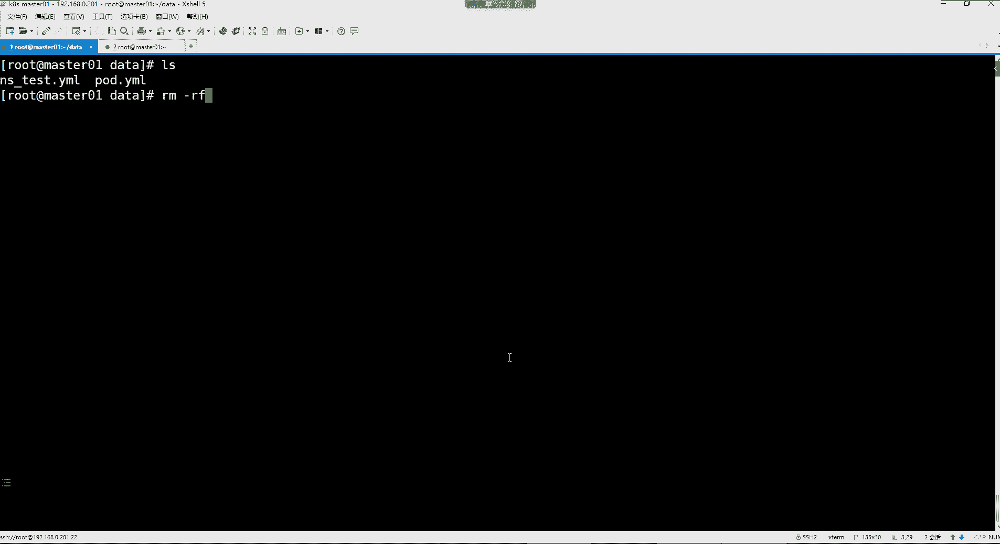

# 零基础入门Linux，红帽认证全套教程！Linux运维工程师的升职加薪宝典！RHCSA+RHCE+中级运维+云计算课程大合集！ - P112：K8S-8.YAML语法介绍、Pod概念、通过YAML文件创建一个Pod - 广厦千万- - BV1ns4y1r7A2

不为别的，就为听歌。这个伤感情歌啊，都符合我们这些伤感的男人。嗯，KS。要6个节点一起开吗？对呀，我们上次不就部署了。呃，这个一个一套高频集群嘛。啊，科报的是啥呀？这一看就上节课没听是吧？

是一个怎么说呢？KPS的一个web管理平台。我们这个机器都开了之后哈，得连上来看一看连谁呢？就是后续我们的所有管理操作，我们只要连这个mar01啊，或者说ma402，ma03都可以哈，你连哪个都行。

你电脑都跑不起来，那不行，你跑不起来的话，先检查一下我们几点啊。Cer CL get node。看到了吗？我们只要一开机。我们的这个节点就全都跑起来了。

对，讲到了。对，没错哈。

讲到了kerboard平台的部署。然后那我们这些节点都是属于read的状态。那我们这个kerboard呢，kerboard你就不用管了，它只要一开机，你可以去访问它了。因为它也是一个随机自启的一个服务。

我们就打开我们的一个web界面，192。168。0点。

呃，我那个地址是多少来着？是。206。点0。206。然后登录一下用户名是我的密密码的是。科报的123，但是那K是大写的，你们每次登录的时候注意一下哈，那K是大写的。好。啊，我们是只有一个集群。

然后点进去。点击全盖要。啊，这就看到我们这个集群了是吧？然后你想看某一个节点呢，或者说你想看所有节点呢，你就点这个节点啊，它就只显示这些节点啊。你想看你这个集群里面有多少个名称空间。

那你就点这个名称空间选择，那他就帮你把所有的名称空间都给你列出来了。我们在节点这个位置。还是点概药吧。这样的话呢可以看到这个整个的名众空间和我们的节点。

然后那这个我们就先放一放啊，我们接下来要学的内容是什么呢？就是集群的一个管理。就是对于KPS的管理啊，我们前面给大家讲过，你可以通过perCTL，然后呢再通过一些命令。去来操控这个集群。

但是呢我们通过这条命令在操控的时候，我们其实大多数都是要编写这个PPS的叫做资源清单文件。而它的资源清单文件呢，我们最终呃还得要了解这个压low的语法格式才行。

所以我们接下来要给大家讲的就是这个鸭木的语法格式。前面这些命令没有什么太多介绍的了吧，熟悉一下吧再是吧，都已经忘的差不多了。你看啊我们这个集群，我想看我集群的一些这个节点状态，是不是可以通过命令去看呢？

科ber cTLge note，我想看某一个名称空间呢啊，科berCTLgege永远都是获取资源嘛。然后NS。是namespace的一个缩写。然后你get I的时候。

是在命令行里面看我们的一个集群的名称空间。好，那我想看我某一个空间里边的一些资源。那这时候你就这样cover cTLge。那我们现在这个机器里面就是每一个民生空间里面，那它现在有不同的po在运行。

你可以把它理解成就是容器了，你可以getpo。然后呢，再跟上某一个名众空间，你杠N来指定。比如说我要看哪个空间呢？我要看这个科报的吧。看这个空间好，那他就给我列出这个空间下边的pod的一些信息了。

这里边呢那左边这部分是pod的名称，然后这部呢是pod的运行的状态啊，它的这个名称啊其实这个非常长。但是呢对于我们来讲无所谓哈，因为这些名字都是自动生成的。然后它这个ready状态，它后边有个数量。

这是总数量。注意啊，这一个pod里边有多少个容器，这是容器的总数量，也有多少个容器是属于一个ready的状态，就是准备好的状态。那前边呢就是真正的。ready状态的数量了。

然后这部分呢就是我的这个po是属于running状态。然后有没有经历过重启，重启次数，重启了多少次，然后以及我们这个po的一个年龄啊，这里面都在这显示呢。好了吧？好，然后接下来呢我们呃还想看其他空间。

是不是都是用这种方法去看的呀啊，我们前面又看了这个cover杠4S这个空间。那你只要把这个名称空间换一下就可以了。科ber杠ss。好，那科ber杠C这个空间里面运行的都是我们集群的那些核心的组件。

你比如像我们集群的这个数据库，看到吗？ETCD数据库，然后呢还有像我们集群的。那个唯一的管理入口叫AP server，还有这个controlller manager，这是针对我们集群程序做部署调度的。

还有集群的负载均衡组件coverpro以及schedular做资源计算的这些组件是不是都是属于running状态？好，然后那接下呢我们这个命令简单熟悉了之后哈，我们来讲讲这个资源管理里边的E。

呃，鸭墨呢这个东西呢在KPS里边还是非常关键的。因为我们在比如说创建资源管理资源的时候，都是通过压墨语法去编写那些资源文件。所以在QS当中，几乎所有的资源都要通过y某来创建。那y的话。

它本身就是一个类似于什么呢？类似于一个叉m或者说jason的一种叫做标记性语言啊，或者说语法吧。然后这种语法呢，我们在用的时候，它强调以数据为中心，并不是以这种什么标识语言为重点。那这个你们怎么理解呢？

我给你们随便写一个叉m的语法，你们就能够感受得到了。你们就看着就行，叉ML。我写个什么呢？比如我写一个这个人的一个基本信息吧。嗯，他这个基本信息首先呢是有标签的。他这个标签是。嗯嗯，好像是。

比如说嗯标签开头然后和这个标签结尾。也插妙于法。比如说这人的。Useer name。然后。us name这人哎他这个标签好像是分为开头和结尾，怎么写来着，忘了啊，好好久没有写这个，我看看。叉ML语法。

它这个标签开头和标签结尾这部分很关键。看了吗？你看啊像这种这是标签，然后你在写的时候呢，你在这儿你可以自己写。但是它这玩意儿会自动生成的。自动生成的话。可以了，看到了吗？就是你看它怎么自动给你生成了呢？

就是你前面一个尖角号，然后呢再补一个。尖角号。他给你什么呢？给你自动把后边的那一段标签就给你补上了。然后接下来呢。嗯，我们不说user内嘛，我说什么呢？我们换一个哈。比如这个人的。信息。就是个人信息吧。

用户吧，就user吧。让你自己加个大于号。用户啊，那用户信息里面都有什么信息呀？你比如说这里边这个人的名字是吧，name。你比如这个人叫张三。啊，还有什么呢？还有就是这个人的。啊，家庭地址或者说年纪吧。

 age这人的年纪，比如说今年35。然后。还有什么呢？还有就是。呃，家庭地址。把它拽死。将近一直不是天津。然后如果是这人再有一些联系方式的话，那你是不是也可以继续往里面写呀？比如说。啊。

就是他的连系电话啊，比如说写12345等等等等，开始写。这就是压墨语法的特点。你看压墨语法，它强调的是啥呢？就是它的这个标签有起始标签和闭合标签。而就说白了真正有用的数据，对于我们来讲，不就是这里边的。

比如这人叫什么，这个人的年纪，这个人的家庭地址以及这个人的联系方式嘛。是不是？但是你看对于ymail来讲，它就是这样子的啊，它就是什么呢？全部都是标签。所以压木语法呢用起来就不是特别好。它不是什么？

它不是以这种就是我们所说的，不是以数据为中心，哪些是属于数据啊，这些才是数据是吧？但它不是以数据为中心，它是以什么呢？它是以自己的这些结构为中心。而它的结构的话呢，占据了。呃，一半儿的。部分吧。

我可以这样理解是吧？那jason不也这样吗？jason就是各种花括号。所以这种的话呢，对于我们来讲啊，你要是用什么叉妙语法或者jason语法去编写KPS的资源文件的话。

那你就会发现啊这东西真的就不适合人类去学习了啊，所以压墨语法呢它本身呢用起来就比较简单，号称一种叫做人性化的数据格式语言。压于法，我们如果要是想去描述一个人信息，我们怎么描述？

YML这里边你比如说us色。你有的冒号。然后呢，他是以空格作为缩进。你比如说这个人的姓名、name这人叫张三。然后呢，这个人的年纪。是35。然后这个人呢，家庭地址。比如说天津，然后这个人的联系方式。

比如说。嗯。电话吧。就它就是这样子的，看到了吗？所以你发现如果说我们要是用压木语法去编写KPS的资源清单文件的话，是不是就会更加的简洁一些呀？所以你看压木语法，它就是什么呢？叫强调以数据为中心。

这些都是我要的数据，没错吧。啊，就没有那么多所谓的无用的标签了。因为你结构简单的话，你可能感觉不太出来。但是如果说你结构非常复杂的话，那标签太多了。你看起来就会感觉头大的所这就是压么语法。呃。

你比如现在那些做这个java开发的。就是这个。他们现在在这个编写自己这个程序的配置文件的时候，基本上都是用压模语法。啊，包括我们前面给大家讲的那个。有一个什么技术，不知道你们有没有印象哈。

就是这个perme优斯。这个朋优斯呢，我们前面改过它的配置文件，你们应该记得是吧？其实per牛斯那个配置文件里面，它的格式就是鸭墨的语法格式。比如让我们看起来非常简洁，然后改起来呢。

你只要是遵循它的那个呃它的这个语法的一些这个规范就可以了。但我估计你们可能都不太记得了。没关系是吧，我们在KPS这位置呢会频繁的使用压模语法。然后首先说一下它的特点，第一呢就是严格区分大小写。然后呢。

这个没我觉得没有什么太多可介绍的了哈，仅仅在这个文件里面也是哈大写跟小写是严格区分的，然后使用缩进表示层级关系。这个就是压模语法的特点了。就像我刚刚跟你们说的那个。使用缩进表的层经关系。

你看我现在想描述一个人的信息好，那么这一个人信息里边，你比如说这个人。叫什么年纪、家庭地址。那这些是不是属于一个人的信息啊？那这个我们就称之为叫一个对象。一个对象哈。好，那么你想描述这一个对象的时候。

你比如说那我怎么样才能够让这个语法识别说我这一段都是在描述一个对象呢？就是使用缩进。你可以把它理解成什么呢？就是这种结构，就是一种间直对的一种结构，就是那种KV6的结构，这就是你的。K的名字，然后呢。

下边这都是在我K里边的一些值，只不过这值的话呢，也都是一些子对象而已。对象名称，然后名称里面的值对象名称名称里的值，就像一个变量一样，你可以把这个对象的结构就理解成一种什么呢？一种数组。

就是我在一个数组名称里边，我可以干嘛呢？我可以存储多个值，是不是？比如存储12345。没错吧，像这种就属于类似于数组了哈。然后。我们在缩进的时候，你看啊就是说。我怎么样表示它的层级关系。

这里边是前面有空格做缩进的，一般缩进呢？就是它对于你空格的数量没有要求。一般我们不用t键，用t键的话呢，有人会出一些就是格式不支持的情况，一般的话呢都使用空格去缩进，然后层级关系呢，这里面就是用空格哈。

就是你看我这是一个对象吧，这是我的一个。什么这时的一个K叫K里面呢又有很多的值，但是这个值呢也都是一种对象形式。那么我怎么才能让这个语法识别说这些对象都是在我的这一个优色。这个K里边的值呢？啊。

那最终你就干嘛呢？就用空格做两个缩进就行了，一个不行啊，一般的话呢就是两个空格。表示一个层级关系。两个空格表示一个层级关系。你用两个空格缩集完之后，你再写的话，那你这个对象就是属于这个优色里边的值了。

知道吧？好，那如果说那我这个name属于优色里的值，那我这A呢，那你只要也是在这个优色下边。用空格做好缩进，然后呢。那这也是属于优色里边的值，那我的dress也一样，做好缩进啊。

都代表说呃这是都是属于我优色里边的这些内容。所以它就是以。空格作为缩进呃，但是缩进数量没有严格要求，一般都是这个两个起步。所标准上来讲呢，就是只要是不同的层级关系，你就用两个空格做缩进就行了就可以了。

然后相同层级呢一般左对齐。相同层级啊，怎么样才算是相同层级呢？你比如说像这种啊这些是不是都是在描述这个人的信息啊，那他们都属于平级关系。那如果你说呃我要是还有一种形式呢。就是比如说这个人的这个。

现在没有办法去给你们举这个例子，你就知道一下，就是相同层级的关系。在KPS里边左边一定要对齐啊，到时候我们会有办法告诉你们怎么去这个查询它到底是不是平级关系的。你先了解这个语法特点就行了。

所以主要就是什么呢？主要就是呃层级关系之间用空格去做缩进。然后两个空的，两个空格呢。那可以用来表示这个一个层级。那相同层级呢就走对齐就可以了。然后这左对齐呃，一般的话呢，你看你相同层级左对齐。

它一般没有严格要求。就是说你比如说我第一个内目，我用四个空格做缩形，可以吗？可以，那你下边呢如果他们是平级关系，就都让它是。四个空格做好缩进就可以了，这样也没有问题，代表他们都是平级关系。行。

这是属于压墨语法。然后井号呢在这里面表示注释，这个跟我们前面在用到的ab呢配置文件呢都差不多，井号表示注释。然后我们在书写Email的时候注意哈，你比如说它这个。对象之间这部分是用英文的冒号作为风格的。

这是一个英文冒号。然后呢，你在英文冒号后边，你一般呢注意哈，如果有值的话，一定要加一个空格。如果没有值，你比如说我优色。我的值都在下边定义了，我后边没有定义的话，你这边就不用加这个空格。

而你下边的每一个对象之间，英文冒号后边就要有一个空格，在这个位置。不然语法就报错了哈。你那边声音怎么感觉低的感觉有吗？其他兄弟正常吗？你们其他人听这个声音正不正常啊，正常的刷一哈，不正常的刷2。啊。

也一样吗？你们有嗡嗡的吗？嗡嗡的感觉。现在呢现在还嗡嗡的感觉吗？现在还有低的感觉吗？好多了啊，为啥呢？因为我刚刚忘把麦克风挪过来了，刚刚麦克风离得有点远哈，现在好了是吧？😊，行。哎呀幸好你们提醒我一下。

呃，然后。之前声音有点小就是是吧，现在是不是清楚了呀，现在都没有问题了吧。😡，然后我们再来看哈。接下来就是如果我需要将多段儿。email的配置放在同一个文件当中，那这个文件用三个横杠作为分隔就可以了。

什么意思呢？你比如说我这个一个压mail文件里边，我想干嘛呢？我想写不同的配置。什么意思呢？你比如说就是这一个压码文件里面，我现在比如说写了张三的信息了是吧？那我能不能再把李四的信息写进去啊？😊。

正常来讲是不行的，为什么呢？😡，因为李四，你跟张三，你没法写在一块堆儿，你不能说那我在后边我能不能在这个user里边再写什么name啊，那就那这就是都是属于同一个对象里边的东西了，就不属于什么呢？

不属于另外一个对象了。但是张三跟李四有关系吗？没关系，你就等于说你们公司。😡，你们公司在记录员工信息的时候。你比如说这基本上一条是一个人的基本信息吧，姓名、年纪、家庭地址、岗位是吧？

那你能把很多人的信息都放在这一条里面吗？比如张三放在这一条里边，李四也放在一条里面，可以吗？不可以是吧？一般说你还得再起另外。另外一条啊。所以因为他们之间啊根本就没有任何关系，但是没有任何关系呢。

在这个压某语法里边，你想给他写到一个文件里面也行，你就这样。三个横杠继续写就行了。这横杠上面有没有空格无所谓，你这儿就可以再继续再描述谁呢？描述另外一个人的信息。比如说。继续写user。

然后用两个空格做好缩进，比如这个人叫李四，然后这个人的年纪。比如这个40，然后这人的家庭地址，比如说是北京。等等等等。那这就是属于什么呢？这就属于。两段配置了，这两段配置是不是没有任何关系啊。

但是我都放在一个文件里边也可以。看到了吗？啊，这个三个横杠我们先了解一下，我们后边会用得到哈，你们先有一下这个印象，它允许你这一个文件里面存在不同的配置。就我这两段配置压根没有任何关系哈。😊，好。

然后接下来呢我们对于这种压墨的数据结构呢，其实最常用的有两种。第一种就属于对象。第二种就是属于数组了。我们前面是一直给大家讲压墨语法的特点哈，你了解你了解这个特点之后。

你比如说这个使用这个缩进来表示层级关系，然后缩进呢，我们一般就是使用空格去缩进就行了。然后呢，只要相同层级的。这些。属性啊，你只要给它左对齐就行。所以对于这个缩进的空格数量没有严格要求。

但是一般的话呢都是你比如说不同的层级之间两个空格就可以。然后下边的话呢，我们来说说了我们在书写email的时候，email支持的这种数据结构。其实最典型的就这种对象。这种结构了呃。

这种结构的话呢呃其实就是一个建职队的一个集合。就是那个KV6的一个集合。其实像我们这种哈就属于对象类型的。对象类型就是一组建制队的一个集合。然后呢，我们使用冒号。这个结构来表示，就是像这种的话呢。

其实就是一种建子度的集合。后边不用讲那句话，在这位置就这意思。你看这就是一个对象，看到吗？那这一个对象是不是就是这一个对象是不是就是一个兼职队的一个集合呀？建职队的。结合。这是对象的一种表示形式。

然后还有人这个因为这个不同的领域啊，他们对这种这个对象的叫叫法不一样，有的叫映射，有的叫哈希，还有还有的叫字典。但是我们知道它其实就是一种什么呢？就是一种间值度的结合就行了。好。

然后那这就是一个建职队的集合。然后这是第一种形式啊，第二种形式还可以怎么写呢？还可以这样写。你比如说我还是要描述一个人的信息。你可以这样，就是你不干嘛呢？不这样就分成多行去写，你也不用空格去做缩进。

他可以允许你这样好吧，你比如说这个这是我的一个什么呢？一个K的名字。然后我这个K里边不就是一个键制度的集合吗？那我的这些键制度可以怎么写呢？好，你看原先内部是不是你要换行啊，然后用两个空格做缩进的。

那如果你是这样写的话，就不用了，就直接优色英文冒号这留个空格，然后大括号把你这个us色里的所有值都给它扣起来。😊，扩解了之后呢，就在这里面写，比如name冒号，然后这儿空格。

那这个name呢就是我这个优色里的一个建制对。然后用逗号去再做一个分隔，然后你再继续写另外一个兼职对，比如age空格。然，再写这age里的值，然后它的降低地址把它dress。

空格再写搞的dress里的值。在这种形式。看起来就没有我们第一种形式要规范一些是吧？所以我们推荐大家使用第一种形式哈。因为你写成这种形式就类似于什么了呀？类似于jason形式了jason格式。

然后还有另外一种呢是属于数组类型的结构。数组类型的结构就是它的特点就是前面有一个小横杠。小红杠的话呢。这就是说我这一个。数组名称里边呢也是可以存储多个什么呢？多个键制对。所以数组形式这种的话呢。

一般我们跟前面这种对象形式结合起来用，你看哈怎么用，就是这种复合结构，对象与数组结合。以后的话我们就称之为叫复合结构了。你比如说我要描述一个人的信息，这个人呢？啊，有色。这是我的一个什么呢？

一个兼职队的名称。啊，一个建筑队集合的名称。然后下边的话呢，我这个集合里面都有什么呢？这个人叫什么？这人的年纪，这人的家庭地址，但是这人联系方式比较多，我怎么表示啊？好。在这个位置定义一个数组。

因为数组里面也是可以存储多个建筑对的。然后接下来呢，你就可以干嘛呢？就可以在你的这个数组里边再去写这个人的联系方式。比如这个人的电话，QQ微信邮箱。都可以了。所以这种复合结构用的比较多一些。

但是我现在这样给你们讲的话，你们可能也。不知道在QS里边，我们到底应该怎么去写，是不是啊啊，你先了解它的这个结构就行了啊，这种复合结构用的比较多。单独用数组结构特别少见。嗯，如果你单独用数组的话。

那你这个数组也是作为一个什么？作为一个兼职队的一个K的名字了。Yeah。但是比较少见一些。好，然后你了解了一个基本结构之后，我们来说说这个K8S的这个。资源我们怎么通过yer文件去进行创建啊，然后。

在KPS里边，我们如果想去创建一些资源的话，首先的话呢我们得了解一些资源的一及属性。其实它呃它有很多的规律哈。我们说过KPS有非常多的资源是吧？😊。

我们用科CTL，然后呢。有一个我们先获取个帮助哈，有一个杠AAPI杠resources这个选项。这个可以列出我们K的所有资源，这里边也包括哪些资源，比如说。这个po。啊，那po的这个资源。

我如果想通过压er文件创建的话。那这里面这个压文文件我应该怎么写？😡，好，那这时候你看那你得要遵循人家这个pod给你提供好的那些。属性名称。

才可以。那这个属性名称我跟你讲，在所有的资源里面，你甭说是po的几乎所有的资源，它的一级属性名称几乎都一样，主要分为以下五大部分。第一部分叫做API version。注意这里边你看有小写，有大写哈。

那个V是大写的。严格去问大家写哈，这个呢一般就是表示我资源的版本。😊，你比如我在创建一个po的时候，你看一下，首先我得去编写一个文件啊，或者说我们创建一个名称空间吧。我们先来一个简单的哈。

就是说我们在这个资源里面，是不是还有一个叫做namespace啊？😊。

这是名称空间。我现在想自己创建一个名称空间来去存储一些我自己的练习的，或者说测试的一些po的。那这时候你是不是得先把这个空间给它创建出来呀，我不用他给我提供的默认的那个。我要自己建。那你通过E文件。

如果要创建的话，首先你得了解你创建一个名称空间，这个名称空间支持的属性名称都有哪些，以及这个属性名称里面的值我应该怎么定义？那这个时候你在这儿你看啊这些一级属性几乎都一样。

你看比如说我要创建一个名称空间，通过压门文件创建哈名字呢，比如说我们让它叫test，我们先去写一个文件去，我们这样先建一个目录吧，嗯，建一个data的目录。然后我们练习呢都在这个data里边。😊。

然后接下来我们编写一个。叫做什么呢？叫做NS。test点ymo注意哈，我们在编写y某文件的时候，就是你前边文件叫什么名没有关系。但是后边的话呢。

结尾我们通常是以这种YML或者说YAML用来表示我这个文件是一个ymo格式的文件。能理了吧，所以几乎所有的压板文件后边都是要附带这种后缀名的。你YAML也行，YML都可以。

所以我们就能少一个字母就少一个字母。打开打开之后，你看我现在要去创建名城空间。

这里面有几个一级属性。第一个呢就是APIwa在KPS里面所有的资源都有它的版本的，你包括名生空间也一样，你要创建名生空间。那么这个时候名生空间的版本，你一定要在文件里面给您定义好。

但是呢这个属性名字是用APIor来表示的这是代表你资源的版本。那这个版本。点儿YL可以吗？不行。没那么干的哼。😊，好。然后接下来呢，你看啊这个版本是在KPS内部已经给你定义好了。

那你说我想知道一下这个版本到底是多少，我怎么查版本号，你可以通过这条命令，有个API杠version。

我们在。复制一个终端。啊。杠杠API杠。Vion。是没有这个前面杠杠哈。有。

是吗。科CTLAPI杠Wson我少了一个S是吧？

看了吗？那这些的话呢，就是我们当前集群支持的一些资源的版本了。但这些版本到底哪个是名城空间的版本，我们好像也不太知道。是吧。

好，没关系。你只要知道版本号，可以通过这命令能够查就可以。一会儿我告诉你们，不用通过这查哈。所以第一步的话呢，我们要干嘛呢？我们要去把这APR version，我们先给它写到这个文件里面。

但是你手写是不是太麻烦了呀？

你每次资源都一个一个手写，你容易错。因为它这里面严格区用大小写。😡，好，注意这里面就有一个什么呢？就有一个命令叫做ex plan。expl呢，它就是可以帮你查看这个资源的文档的。

你比如说我这个资源支持的版本。我要通过这个命令查，那我肯定是非常难是不是啊？好，那你就用ex plan。

在这边这样查去啊。科berCTL，然后。一个字plan跟上什么呢？你现在要看哪个资源，你就跟上哪个资源的名字。我现在要看名称空间，那名称空间缩写成NS。

你就这样科berCTLex planN我要看名称空间的。资源文档。好，他就给你列出来了，看到吧？那这里面他会告诉你，就是我的这个名称空间，它的属性都有哪些？然后你可以用这个属性。然后它这里边看有叫f斯。

看到吗？f这位置就是告诉你这里边我支持的属性都有哪些。但是这些哈都是它的一级属性，一级属性的特点是什么呢？就是一定要是顶头写在文件里面。所以在这边，你看是不是就有它的APRor呢？所以这个不用你手写。

你给它粘贴到这就可以了。但是亚么语法要求，后边有个英文冒号。😊。

那AP version。它是什么呢？它是用来。让我们去定义资源版本的。好，那这个版本我应该怎么查？注意这个APR我后边一定要给一个值。

那这个查的话呢，你也是在它的这个资源文档里边看到吗？这儿会告诉你我的version就是我的这个NS的版本是V一的，所以你这儿也不用去手写。空格粘到这就可以了。定好我的资源版本。好，然后接来呢。

那这是属于一级属性哈，就是你通过这条命令在看NS的时候，在第一页里面都是它的一级属性。

那这个一级属性呢就是一定要走对齐。然后接下来呢还要定义什么呢？还要定义这个东西叫做candercander就是资源类型了。那资源类型这也是由KPS内部定义的。我们前面可以通过这个命令。

就是科CTLAPI杠resources查的，但是资源太多了是吧？我现在就是要创建一个名称空间嘛，我已经知道我的资源了，所以我就可以用cander来指定我的类型，但是这个。

你可以手写，因为它比较简单。der冒号后边指定我的类型。这个类型是什么呢？就是。Namspace。但是你不手写也行，你不手写的话，因为在他的这个文档里面，他也有告诉你看到吗？这有个cander。看到吗？

看到不就说资源类型吗？然后这个呢就是它的属性名，注意，这不是它的属性名字啊，你别复制那大写的，它的属性名字都在fels里边，你把这个cander放在这儿，然后英文的冒号，然后再干嘛呢？

再看它的这个can的资源类型，啊，就是资源名字叫namespace。你看它里面就严格区分大小写了哈。所以这个名字你一般别手写。这里面的纸你手写很容易错。啊。哎。你有个问题。

像那种一个鸭某用杠杠杠分割之后写很多资源，是把很多资源用鸭M起来之后整合一个资源了吗？呃，它整不整合，不是，就是可能说它的那些配置都在干嘛呢？都在针对于一个资源去什么呢？去。使用的。你比如说。

你假如设我这一个样门文件里边。或者说我现在想去干嘛呢？我我现在想去创建一个容器，那这个容器。比如我后端还要给他配去配一些数据库的话等等等等。那这些东西呢我都写到一个文件里面。😊，后续呢我一看这文件。

我就知道我这个程序最终啊有哪些服务。或者给他配备了哪些服务。提供了哪些功能？一般的话就针对于这个服务，我们一般会写到一个文件里边，但是是不同的配置都可以哈。后边你们就会明白了，现在。

说也说不清。然后kind这就是资源类型，就是一个 ya么有资源，有po的。没错哈。好，这是我的资源类型。那我这个资源类型，你看啊，是我知道怎么查呀。好，然后下边那met data是什么呢？

met data叫做语言数据。这个原数据我们怎么理解？我前面是不是给你解释过什么叫原数据啊？我在我在讲dark的时候，我就跟你们讲过原数据这个东西是不是啊就是我资源本身的一些。😡，那些信息嘛。

所以这个语言数据信息里边我们可以指定哪些东西呢？比如说我资源叫什么，我这个资源在哪个名称空间，我资源要不要加些标签之类的。好，那这个。

mettter data我们在这个里边，你看啊你再查看这个。它的资源文档的时候，你看它支持的属性名称里面叫个met data，看到了吗？你把met data再给它。填写上去英文的冒号。

但是这个met data啊。😡，他下边。如果你想给它定义名字的话，这里边哈你得怎么写呢？这个时候你就得要干嘛呢？再查看查看met data下边支持的。😊，属性都有哪些了？

因为你刚开始你肯定不知道met data，你说我怎么给我的属性定一个名字，注意，因为可能说每个属性下面还有一些什么呢？还有一些属性，就是作为它的子属性。

你知道怎么查met data下面有没有什么子属性呢？啊，你把met data拿过来然后呢，在N后边加个点儿。再把这个放上去，这是啥意思呢？这意思就是说呃我现在想查看的。这个资源文档是谁的资源文档啊？

是NS下边的mettter data这个资源的文档了。好，这时候你再展开的，就它可以支持这样一级一级往查。所以你看在mettter data里边。😊。

你找他的further。发ther看到吗？你看在它的furs里面，是不是还有很多的资源名称啊？是不是这些都是你可以在met data下边定义的这些。😊，这个什么呢叫属性名称。好。

那我们现在要定义的是什么呢？这里面它有一个叫做name的。这个name就是可以给你的这个资源取一个名。好，那这个。你注意看在这就不太一样了。因为我们刚刚的这个name这个属性。是在哪个属性下边的呢？

是在mettter data那个属性名称里边查询的。没错吧，那它就属于。是什么呢？mettter data下边的子属性了，所以这个时候你就得换行。做两个缩进了。然后把内膜给它放上去。哎，我这样做。

你们能理解吗？就我这个位置为什么换行，为什么做两个缩进，现在能理解吗？能理解的刷一不理解的刷2。😡，能理解吗？啊，能理解是吧？好，能理解就行。这很很好理解。哎，你看建福他都理解了，建服理解。

我觉得其他人应该就没啥问题了。😊，对，这就是因为他们之间就不是平级关系了，知道吧？因为。😡，mettter data下边的子属性有一个叫name的，他们两个是平行关系吗？不是。

因为name是在met data下边查询出来的，所以他们之间就得要做缩进两个空格就可以。这样就可以表示它的层级关系了。好，然后接下来name里边我们可以写什么呀？是不是可以给我的这个资源取个名字。好。

那这个名字我让他叫什么呢？比如说test，这是我资源名字哈。😊，这名字你是不是自己叫什么都行啊啊，我就让他叫test。然后呢，我可以。😊。

这个取名，那我们就取就到这儿吧，就给他取个名吧。其他呢我们也不置了也不加什么标签之类的。😡。

好吧好，就到这儿就够了。😊，然后呢保存退出。保存出之后呢，我现在这个压码文件，这里边是不是已经定义好了一个资源了呀？而这个资源就是创建一个名称空间的资源。

而我在这个文件里面只已经指定好了这个资源的一些信息了。我这资源的版本，我这资源的类型，我资源的名字已经指定好了。好，那指定好了之后，我现在要创建的话。科CTL用哪个命令呢？Cate。create是创建。

然后你创建什么呢？这时候你杠F指定文件就可以了。我就创建这个文件里的资源。我这个文件里面定义什么，我就创建什么回车。😡，好，这时候你看他告诉你现在create。一个什么呢？一个。

namespace就是一个名称空间。然后你这名称空间叫什么呢？叫test。比如说现在我已经通过这个文件创建了一个名称空间了。那这时候我想看的话，我们就科tCTLgeNS看我们的所有的名称空间。

所以这时你发现是不是就多了一个叫test的名人空间了呀？

简单吗？啊。是不是非常简单呢？😊。

这没啥难度系数吧。😡，啊，那其实这呃如果我们要是单单的就创建这个民生空间，我们有点怎么说呢？有点脱裤子放屁，有点多此一举了哈。其实你要是创建民生空间，你就这样创建在命令行里面创建最最省事儿。😊。

还是用什么呢？科CLc，然后呢指定你的资源类型。NS资源名字，比如说叫DEV回车。创建好了。然后你科C条get on S。是不是一个叫DV的名称空间也创建出来了。那你说我为什么不？😡。

那你说为什么我们就不学这种方式，非得学写它的那个样缩文件呢？😡，这种方式你在命令行里面只适合创建一些简单的资源，就类似就像这种名人空间这种资源，你可以在命令行里面创建。但你一旦你的资源。非常复杂的话。

那你命令行就不合适了，知道吧？啊，但你知道就是其实在命令行里面也是可以的。😊，只不过就是看什么呢？看你到底要创建哪种资源了。简单的。都没啥问题。删除呢。😡。

好。那如果你不想要的话，我们前边在讲KPSS命令的时候。呃。在。资源类型和在管理方式这位置。如果后续我们想删除资源的话，你看create，我们前面刚用完是吧，是创建一个资源的。然后呢，删除的话呢。

这里面有个delete。你如果想删的话，你用deelete就可以删除这个资源，就这样删。

KbCTL。得累他。然后如果是在命令行里边哈，直接删的话，就指定你的资源类型是NS资源名字是DV。他现在就帮我把这个叫DV的名人空间给你删掉了。然后这时候你如果再看的话。就没了吧。

就没有那个叫DV的那个名众空间了。好，那如那我如果说我想删谁呢？我想删那个test呢？test的你也可以在命令行里面那样删，你也可以通过它的yer文件去删。如果我们想通过它的yer文件删。

就这样删hertCTL delete杠F指定文件名就行了。我要删除这个文件里的资源，你看你创建的时候是用cate是吧？那他就把你创建这个文件里的资源。那你删除的时候呢，你如果还指定这个文件。

那他就把这个文件里的资源给你删掉。😡，然后我们再看。是不是那个叫test的名生空间就没有了呀。好，那当然我们这种方式是在命令行是吧？那其实如果我们有ker报的话呢，我们是不是也可以在kerb上面。😊。

我想创建民众空间。你我们点到名众空间。它这就有创建可了吗？就你不用敲命令了，你点创建，你只要输入名称空间名字，比如说什么叫pas保存。然后如果他这位置说这个已通过校验。你点应用，那他就把你创建出来了。

然后你可以预览它的压码文件。你看到吗？是不是最终也是指定了资源版本。😊，资源类型。资源名字。没错吧。好，然后接下来我们点确定。那这个民众空间就建好了。好，建好之后，我们再点名称空间呃，再点这个。

再点这个名称空间啊，我们就别名称空间设置了哈。😊，该要。我们在这个我们现在切换到这个空间里边了，看到了吗？我们得在集群管理。😊，在。这个。这玩意儿不是特别人性化的，我怎么感觉的。功能有点少是吧？

在这看吧，我。你切换到基金管理该要的时候，你再点这个名人空间选择的时候也行啊。是不是也可以看到有一个叫做test的名称空间呢，这不就你的名称空间的列表吗？这不也能看到吧，然后创建时间一分钟。

那后引说这个空间，我不想往Y给它删掉，右边是不是有删除啊，你用鼠标一点。😡。

然后你输入名字。你想删他，你输入这个名字点确定点应用确定就帮就帮你把这删了，你看到吗？是不是删了？

删了哈，你再刷新就没了，点这刷新。是不是就没了？啊，厚的怎么停止，是不是只能？透old的。后怎么停止？po的可以关闭。关闭不就停止了吗？是不是？😊，好。然后那接下来呢我们就来这个。在这个位置哈。在这儿。

压文文件创建资源，是我就。简单能够感受到了我们怎么通过这种压模文件的方式去创建这个资源呢？那在这里边，其实我们最主要要搞懂的是什么呢？就是你想创建一个资源，最终这个资源支持的属性我们怎么查？

知道吧？命令ex plan，这个就变得非常关键了啊，然后呢，你跟上你的资源名字，你比如说后期我想创建po。😊，那你还是科CLex。让他跟上资源名字。我要看pod的资源文档回车。好。

那当你想创建po的时候，你发现这个文档里边啊，你看在它的f里边是不是也是有什么资源版本，你需要定义的哈资源类型，然后资源的一些原数据信息。😊，这些是不是？都在我们的这个文档的第一页啊。

所以在第一页的这些我们都称之为叫什么呢？叫做一级属性，就是这个资源的一级属性。而针对这一级属性，它的特点，你在书写的时候，就是在文件里面一定要左对齐，而且是顶头写。

这就是。我们怎么去通过压某文件去。针对于KPS的资源去做一些管理啊，然后下边我们来讲po。啊，在讲po的时候，那我们会频繁去写y本文件的。那这个时候呢我们来说一下po是什么呢？我们前面已经提及过了是吧？

我告诉你，就是我们在这个。

名众空间里面看到的那些。都是泡的。ge cold看谁呢？看。我们指定一个密容空间，科ber杠sst。呃，未找的命令。好，我们看科ber system这个名称空间里边，这些都是po。好，那什么叫po呀？

那泡呢在K84里面是一个比较抽象的一种形容哈，呃翻译过来叫做豌兜菜。就是。这个类似于那个毛豆吧。北方人啊，其实南南方也有毛豆，是不是啊？你们应该都知道，或者说花生米吧，都行啊，就类似于这么的一个形容吧。

就是一个壳，一个外壳里面包的都是一些什么呢？一些它的这个。颗粒。所以这个po呢，你看它的这个形容，就是它在科bernet里面是集群能够管理的一个最小单元。我们的程序首先要。在哪里边运行啊？

我们的程序是在容器里边运行的。好，但是这个容器的话呢，KPS没有办法直接去管理它。那怎么办呢？哎，这个他把容器就给它放在pod里边了。所以你可以这样去看，就是这个豌豆菜呢，它的这个外边这个皮儿。

你就可以把它列解成是pod，就在K84里那个pod。然后在这个pod里边的一个一个的颗粒呢是什么呢？就是我们在这个pod里边的一个一个的容器了。就他们之间就是这么个关系。是道吧？

所以你看哈它这个泡的其实就是一个容器组。一个po里边可以存在一个或多个容器。有时候你看就像这一个豆荚里边可以有多个什么呢？豆粒儿一样。然后那这些容器呢共享这个pod的资源，包括它的存储资源、网络资源。

然后对，因为我们在创建po的时候，你可以对pod做资源限额。好，然后那最终的话呢我们在看待pod的时候，容器运行在pod的时候，你可以把这个pod看作是一个物理服务器一样了。它并不是进程。

而是给容器提供一个运行环的环境的。就像一台物理服务器一样。你就这样理解就可以是吧？嗯，然后其中呢这个pod里面就包含一个或多个应用容器。那这些容器里面是啥呀？容器里面不就是程序，不就是程序了吗，是吧？

这样还算比较好理解一些是吧？所以这就是po。所以对po的话呢，如果你们实在是不理解，你就看看这张图吧，你就知道什么叫po了。好吧，或者说你去呃看看啥的那个花生，花生壳也行。花生壳儿。花生都知道吧。

花生不就是类似于这么个结构吗？你比如说你看这个图。是吧。这是啥花生壳，花生仁儿，你可以把花生壳理解成厚的花生仁呢理解成容器就行了。😀Ha。😊，这是不是更好理解一些啊，是不是啊？哎外边就是 po的。

里边就是容器。😊，嗯，泡的是花生壳，容器就是花生米。没错。再来瓶二锅头。😊，所以这就是他们真的关系啊。然后呢，那这个我们在KPS里边的话呢，我们还得这样看哈，就是最终的话呢你看这个po里边是什么呢？

pod里边是容器，就是container一个一个的容器。😊，容器是运行在pod当中的。然后K8S如果他想去管理这些po的话，那我们K8S的。这个什么呢？这个mas的节点，最终的话呢它只能。

管理pod不能管理到pod里的容器，但是它管理pod其实也就能够间接性的管理到pod里的容器了。你比如说我想把pod给它删掉，那容器不就没了吗？就是这个意思。😡，这就是他们之间一个关系哈。

容器运行在po里边。啊，然后一个po里面可以有多个容器。而后KPS呢，它管理的最小单元只能是po。没有办法管理到pod里的容器。行啊，那我们现在如果想创建pod怎么建呢？看哈啊创建po呢我们是。😊。

首先这个pod它有两种分类哈。po第一种叫做静态po。第二种呢是通过控制器管理的这种po。呃，你像这种静态 pose的，我们也管它称之为叫做无控制器管理的自主式 pose的。这个控制器我们现在还没有讲。

但是它也是在KPS里面非常重要的一部分啊，我们现在就先不管这个什么控不控制器。我们现在就是说我现在想创建一个pod。😊，而这种po的话，你在没有使用控制器创建的时候，它都属于叫做静态 pose的。

这种po是GIU由我们这个节点上面的一叫clet去进行管理的，不是由控制器去管理的。对于这种po有个特点，就是如果这种po，你给它删掉，它不会有重建的这种功能。这就是静态po的特点。

就是只要不由控制器管理的这种po。都属于叫做静态 pose的。但是不是说所有的这个有控制器管理的po，它都有重电功能，这个得看你的控制器最终是什么类型的。所以对于这种的话，我们就先不管那些。

咱们先创建一个静态po，先玩一玩，对吧？好，我们就参考一下这个东西，我们怎么去见它。

我告诉你这个东西，这都是我一点点写出来的。😡，但是怎么写的呢？😡。

啊，比如说我现在创建个po，我得告诉你们一步一步怎么查，放在这儿啊。😡，我们编写一个yer文件。呃，让它叫po。点儿。yo。好，那首先第一步我要创建po，我得查它的po的资源文档。

那它的资源文档打开之后，一级属性都一样。首先呢在furus里边，你要定义你的资源的版本。英文的冒号空格版本呢，你看它里面也是V一的，看到吗？所以你。把这个版本翻过来，然后还要定义我的资源的什么呢？

类型cander资源类型，你创建什么资源呢？他也不知道是吧？所以你在cander后面指定我的资源是什么呢？在这儿呢？po看了吗？这不就是cander对应的是我的资源的类型嘛？

version对应的是我这个资源的版本，哪个资源呢？你查哪个资源，那它就是哪个资源。😊，你列出的是哪个资源文档，那它绝对是哪个资源的类型和它的版本。是吧。然后版本。这是它的类型。拿过来。

然后还要指定他的什么呢？还要指定。它的这个met data原数据。原数据的话呢，那在这个里边呃，是不是它下面有子属性啊？那这个子属性我们可以用到哪些呢？第一就是name，我们前面已经用过了。

查出来的是吧？那你这时候你在查的时候注意。你再查你是不是是看port下的mate data呀？😡，没错吧，所以你别搞混了哈，就是你现在是要创建po的。😊，而在pod下边也有这个一级属性。这个一一属性。

它下边的紫属性跟那个我们前面查的那个名称空间，它可不是完全一样的哈。但是这里面也有一个什么呢？一个name的子属性，你查一下，我要看po下载met data。这个属性里的。支持的属性名字名字。

那这里边你发现是不是也有一个叫name的呀？😡，啊，所以你也可以干嘛？你也可以给你的pod取一个名字。你比如我让他叫什么呢？让它叫。呃，St。杠外吧啊或者叫杠po吧，一个静态的po。好。

这是给我这个资源取了一个名字啊，要不要给你的资源加个标签，想加就加不加无所谓了。这种标签的话呢。对于我们现在来讲，就是无所谓，这有叫labels。这个属性这个属性就是可以给我的资源定一个标签的。

但你注意我这labels。他跟谁是平级关系？是不是跟这个name幕是平级关系啊？没错吧，他俩是不是都是属于met data下的子属性啊，那他们就得对齐。知道吧，加个标签。比如说就是test测试。

这我的标签名就是测试。啊，但是这种标签它是。我看这样加行不行啊，一般。行，就这样。然后接下来呢。😊，我们有。一级属性基本上差不多了。mettter data我们就指这么多，就指两个哈。

一个是指定了我资源名字，一个是给它加个标签。然后下边呢我们再回到这个pod里边，再看这个po的这个资源文档。😊，这里边有一个叫什么叫spike。这个sack呢它也是一个一级属性。放在这儿这儿。

那你说这儿要不要加个空格啊，要加一个空行啊。加不加都行，也没关系。只不过是为了让你们看得更清楚一些。好，那在这个spike里边呢，我们可以定义哪些东西呢？😊。

好，smike下边的属性就非常多了。好了，你。呃，就是在我们的这个。在这儿。在整个的一个资源的文档里边，specike是可以说是最重要的一部分吧。

因为这里边它是有我们针对资源的各种样各样的配置的属性在里边的。那接下来呢我们来。看一下这个位置啊。

我们先看sike下边支持的子属性。都有哪些，这就非常多。你玩 fun吧。

非常多，看到吗？从这furs下边都是好，那这里边我们要用到的都有哪些呀？首先。你看这里面有一个叫什么呢？叫container。我说过。po里边是运行容器的是吧？好。

那我们到现在为止还没有定义我这个po里面到底运行。哪一个容器呢？所以接下来我怎么样才能指定我的容器的信息呢？哎，container就是让你指定你的容器信息的，所以它是属于spike下边的自属性。好。

那这个容器我到底可以指定哪些详细的信息？那在conttainer下边。他又有一些。子属性，所以你这还得干嘛呢？继续去查contain的这个子属性，再继续往下查。然后在这里边我们可以指定的信息也非常多。

因为它是用来指定具体的容器的配置的嘛，所以这里边你可以。它这里面有个name看了吗？是不是这有个name啊，这name的话呢是用来指定我这个容器叫啥名的。但是这个name。😡，在conter下边。是吧。

它得是一个数组类型。这个我经过很多遍测试哈，就是。你如果不给它定义成这种数组类型，我跟你讲这个参数就报错。😡，这个就很诡异哈。所以当我们在有就是我们这个记一下，就是我们一般在这个什么呢？

在spike里边的这些name，一般呢都得定义为数组类型。而像上边在met data里面的这个name就不是数组类型。就是说你得前面加个小横杠，在这位置，这样才可以哈。我经过很多遍测试。

我怕现你不加横杠，它就报错。😊，非常奇怪，然后给他取个名。比方说就让它叫t。好，然后接下来。呃，那全名字之后，我们还可以指定哪些信息呢？容器是不是得需要镜像啊？所以这里边你再找一找。

有没有可以让我们定义镜像的一个属性？这儿有个叫以妹置看到吗？哎，这以妹置就是让你定义镜像的那这以妹置跟谁是平级关系呢？它跟这个内幕是平级关系。因为他们都在同一个资源里边。好，然后接下来注意啊。

它可不是在内幕里边的属性啊，如果它在内幕里边，他就得做缩进了，知道吧？因为他们是平级关系，所以这儿啊对齐。然后接下来呢，我们用哪个镜像，这镜像呢我们随便拉一个就行。NGS冒号1。18。0。

这个镜像肯定是有的啊，或者说1。20吧。这都无所谓哈，只要他能够拉取得到就行。这镜像是从这个doker的官方去拉取的。好，然后这个镜像指定完之后，那我们容器的话呢，你可以给它定义端口，但是这端口。

不定义默认980。这不是在学网易开发，我是在教你们写鸭某语法，写压某语法哈。😊，这跟网页开发有啥关系吗？😡，玩意开发，那不是编程语言嘛，是吧？那那不那不就是去学PP去了吗？😡，然后在这位置哈。

其实端口的话呢，我们暂时现在可用可不用。在这位置端口这部分我们可以先给它忽略掉哈。好，然后就写到这就可以了。每次都要一层一层的查嘛。那不然呢，不然你怎么知道他有这些属性啊？😊。

是不是不然你你上哪知道他有这些属性息啊啊，我们就写到这哈，保存退出。😊，保存退出之后。

下面这些哈在。这好。这些的话我们一会儿用不上，删掉。因为容器它自己有默认灯口。而且像这种静态po的，我们就为了给大家演示一下。这些的话呢我们也用不上。删掉的。标签其实也用不上。

就这么多就可以了。然后接下来我们去创建一下。我们去科伯CPL啊，没有做过PP开发哈。😊，Create onF。是太我们那个叫。po点 yamo。创建一下有，他报错了。

我看看他说这个什么这个mettter matter data里的labels。类型。你看其实我们这个。怎么说呢？这个标签就给它删掉哈。这个标签如果定义它下面是这种KV6的形式，就是你用也行。你用的话呢。

它里面是要求。里边你在里边写，比如说标签名。然后呢。这是它1个KV6的形式，这种也行，这是我的标签名，这是我标签里面的值。好啊，这种形式就可以。创建。就创建好了。那创建好了之后。

我们现在看一下这个po的状态哈。😊，呃，它运行在哪个空间呢？我们并没有给他指定名称空间是吧？那它就在那个默认的空间里面，我们就get后。啊，这里面是不是看到有个叫satic杠old的？这么一个po的呀。

这是我们自己起给他取的名字，记得吧？😡，是吧这个名字是不是在我们前面的文件里边？在这儿啊通过name给他指定的一个名字啊。没错吧。好。然后那它的一个镜像NGS1。20。0的。

我们是不是在看他的信息的时候，你可以加一个杠O。外的啊，当然我们不是说非得看到镜像啊，就是看看它的详细信息。😊，那这里边比如说这个po它运行它的1个IP地址，它运行的一个节点在哪儿？是不都能看得到啊？

好。这就属于叫静态 pose的。就是是我们直接干嘛呢？直接去只描述了，或者说只配着这个pod的信息，并没有指定说通过什么控制器去创建它。而这种静态po有个特点，就是你一旦给它删掉的话，它就。彻底就没了。

就不会被这个控制器所管理。啊，所以这种po作为了解哈，你如果想删，你可以怎么删，你可以这样科CTL。😊，给了一套。然后呢，你如果是在命令行里面删的话，你就指定类型是删除是pod，我你你要delete谁。

我deletepo哪个po叫这个名字的pod。给他删掉。这不就是你得先指定你要操作的资源类型嘛，是po，然后这是我的pod的名字。然后就给他删了，删了之后，你再去看一眼的话。

科cTLgeold是不是就没了呀？就没了。被你给删了。所以这种po的话呢，由于呃这个就是不受控制器所管理。你一旦删掉的话。就没了。

这叫静态的。呃，然后。这种的话呢我们就是给大家感受一下，因为我们很少去用这种静态po的啊，知道一下就行。我们还是把这个文件给它压文件给它删掉吧，hold点压。

行。然后我们接下来再来说说那个po控制器。他所管理的po的特点是什么？但是这po的控制器啊太多了，我们一会儿回来再给大家讲吧，我们稍微休息一下哈，休息一下给大家讲。因为这个控制器。以及po资源清单文件。

这个还是蛮多的。歇会儿。

在这儿啊。