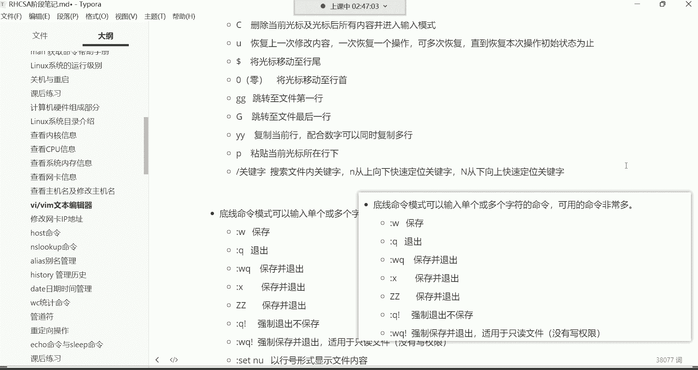

# 零基础入门Linux，红帽认证全套教程！Linux运维工程师的升职加薪宝典！RHCSA+RHCE+中级运维+云计算课程大合集！ - P12：红帽RHCSA-12.vim文本编辑器 - 广厦千万- - BV1ns4y1r7A2

把录屏打开。好，我看一下这个录屏O。喂喂喂，好，那接下来呢咱们讲讲这个VI还有VIM文本编辑器啊，我先给大家讲讲什么叫文本编辑器吧哈。这个对于很多小白来讲呢，可能说对于这些专业词汇呀。

可能是第一次接触不了解是吧？😊。

在windows里边，我想建一个文件。😊，啊，新建一个文本文档。好，这是一个普通的文本文档，是不是？然后呢，我想打开这个文档，我想往里边写点东西。😊。

比如说你你好，美女是吧，处对象吗？对对，写完以后呢，保存一下。

好。保存之后呢，那大家有没有想过，就这个文件是用什么时候是用什么创建出来的，或者说我打开这个文件，我往里面写东西的时候，又是通过哪种工具去打开的呢？😊，有没有想过呢？那，其实你右击属性的时候。

你都能看得到啊，这里边有一个叫什么呢？有个叫打开方式，看到了吧？这打开方式叫做记事本，是不是啊？也就是说这记事本啊，其实就是windows里的一个什么呢？叫做这个文本编辑器。😊，可以具备创建文件的功能。

是不是啊？然后呢我们可以通过这记事本呢对文件的内容进行一个增删改查，都没有任何问题。这不就叫做文本编辑器嘛啊，让我们去编辑文件的啊。但是在这个linux里面呢，它不是记事本哈，它叫什么呢？它叫做VI啊。

又或者是VIM。那为什么说这两个名字呢？因为啊这个VIM是从VI发展过来的一个文本编辑器。最早它叫VI没有后面那个M那区别呢？就不太一样了，像这个VIM啊，它具备有叫编程的能力。什么叫编程呢？

就后期我们学习一个叫做秀有脚本的东西。😊。

啊，叫设有结尾编程。那VIM呢，它可以主动的以字体的颜色帮我们去辨别我们的这个语法是否正确。就如果语法错误的话呢，它会有颜色提示。啊，就这么回事，这就是这一个区别。而VI的话呢，它本身没有颜色。

对于VI这个文本编辑器啊，本身是没有颜色的哈。所以说这是他们的一个具体的区别了。VI呢一般不适合去。😊，编程VIM适合编程啊，但如果说我们要修改一些配置文件的话啊，那就用VI都无所谓了。

到底是VIRVM这个关系都并不是很大了。好，那接下来呢咱们。😊，看哈来演示一下这东西怎么用哈，这东西呢非常简单。我们说这个命令格式。😊，这哈命令格式非常的简单，看哈VI后面跟上文件名就可以了。呃。

然后呢，它下面有两个特点哈，你看若文若文件不存在啊，这样吧，我们不加目标了哈，不加目标了。若文件不存在，则创建。😊，则新创建文件并对它进行编辑。那如果文件存在呢，那就直接打开文件，然后呢再去编辑它。

那这个也比较好理解。

你看哈。我们把这个拿过来来给他说清楚。

我现在干嘛呢？我现在想去改一下我的主机名。啊，我现在想改个主机名哈，那我的主机名的文件是不是在ETC host name这个文件呢？😊，是不是啊啊，这个文件放的是主机名的文件。那我现在想改主机名。

那你可以通过VI直接打开这个文件打开。😊，看到了吗？这里面放那这里面存在不就是我们当前的主机名吗？叫t。😡，那那你看这个文件。它是不是已经存在了呀，是不是啊压根儿就存在，压根儿存在呢，咱就直接打开。

就直接对它进行编辑，能理解吧？那如果不存在呢？😡，啊，我们退出啊，我们先退出啊，我们再编辑一个不存在的文件。那我们在VI比如说你看我现在呢在OPT目录，我们看OPT目录，我们CD到OPT。😊，好。

进了以后呢。😊，我用VI我编辑一个不存在的文件，比如叉叉叉叉点TIT。打开，那这个文件压根是不存在的那文件不存在的没关系，他会把这个文件先给你创建出来。然后呢，你再对这个文件进行一个编辑。就这意思啊。

就是也就是说它是具备创建文件的功能的。好。那把这个事情说清楚之后，我们就得给大家讲讲这种东西怎么用，这个非常复杂哈，它可不像我们在这个用什么呢？在用那个。😊。

记事本一样，你右击损你这个右击一点新建，这个文件就给你创建出来了，这可没有那么简单哈。你看啊这个东西呢刚开始学习的时候呢，还是蛮复杂的。因为你看它分为三种模式啊，不管是VM还是VM，都是三种模式。😊。

呃，第一种呢叫命令模式。第二种叫输入模式。第三种叫底线命令模式，也叫墨行模式。那这三种模式，什么叫命令模式呢？就是我们刚刚启动了VI我们便进入了命令模式。就现在这个模式就叫做命令模式。

就是我用它打开一个文件。看到了？我用它直接打开了一个文件。那我们现在就在命令模式下边呢。那那个所谓的命令模式，就是我们现在。所有的操作都会被他识别为什么呢？他的命令。这个命令都有哪些呢？啊，这个命令。

啊。在这哈。在命令模式下，大家可能已经一看这一大堆已经头皮发麻了。啊，这些都是他的指令。这一堆哈就是在命令模式下哈，我们可以使用的指令呢有这么多啊，看到了吗？啊，这些都是都是常用的哈。

没常用的我都没有给大家拿出来。因为针对于VIM有有专门的一本书。😊，啊，就写这个VM文本编辑器的哈，一本书就写这1个VM。所以你想想这一本书。😊，跟我给你呃，怎么说呢？准备的这些常用的这些操作。

这简直就是不值一提的，是不是？那只不过我们这些是就是经常会用到的哈，但是他也不少了也不少了。好，那下面呢咱们。😊。

一个一个说啊，就是在命令在命令模式下，我们可以按AIO都可以进入下一个模式，叫做输入模式。在这啊输入模式。好，那我们来看看啊AIO摁哪个都行。我们习惯用II哈。摁I的话。

你看insert insertsert就是插入的意思。😊，插入什么呀？那就是你想。😡，往这个文件里面写什么东西，你比如说写个hello。😊，啊，你好。美女啊，想写什么都行，想换行呢就拍个回车。然后这个。

写哈随便写哈ABCD之类的，想写什么就写什么，这都无所谓了哈。然后这个在里面呢光标可以左右移动。然后如果还想换行就拍回车，看到吧？就拍回车就换行。😊，看到了吗？哎，上下键呢就可以上下行去进行一个移动。

左右键就是什么呢？就是左右进行一一个移动。嗯，就这样看到了吗？这就是什么呢？这就叫做输入模式。也就是说也就是说啊你想往这个文件里面写东西。哎，你得先进入到这个输入模式才可以。😊，啊，你不在输入模式。

你在命令模式，你所有的动作，人家都会认为你是在使在使用我的命令，能理解吧？所以这个命令呢就给你提供了进入输入模式的这三个三种命令。😡，好。呃，那接下来呢咱们就继续来说一说我们这个。

这种东西你想写什么就没有人能拦得住你了哈。你就比如说发挥一下你的才华，在里边写首情书啥的，这都无所谓哈。😊，你比如说1234嗯5678。等等等等哈叉叉叉叉。啊，O叉叉插入。想想怎么写就怎么写哈O。😊。

这是命令模式跟输入模式。那接下来我写完以后，我想保存怎么办呢？嗯。井号代表朱示。啊，井号代表注释。然后我们说一下，就是我想保存啊我想保存。想保存的话呢，注意哈，你现在是在这个输入模式呢。

在输入模式现在是没有办法进行保存的。所以你得什么呢？得先退出你的输入模式，切换到刚刚的那个命令模式。那怎么退出输入模式呢？ESC。😊，按你键盘的ESC可以。退出输入模式，你看我一摁键盘的ESC。

你看下面这个inser就没了，是不是好，inser没了，就明就证明我们现在是载一个什么呢？载一个。😊，命令模式。载个命令模式。那载命令模式我们还得干嘛？还得去输入各种各样的命令。😊，没错吧。

那你看啊在命令模式下按英文的冒号，就可以进入那个最后那个叫底线的命令模式。底线命令模式。所以这时候呢你摁一下英文的冒号，那下边呢就出来一个英文的冒号，看到吧？那这个时候。😊，你说我想保存了，哎。

那这个你就得输入底线命令模式的命令了。

那在底线命令模式下可以使用的命令呢啊，这儿呢这些都是底线命令模式，上边是命令模式，你它不一样哈，它们是不一样的。所以你发现这里边这记的东西还是蛮多的，是吧？😊。

那想保存呢就。这些操作。

对操作哈。咱们先把先把保存给大家说清楚。

O。啊，然后英文的冒号输WW就保存，你呢拍一个回车就可以了，回车好。好，那我们这几行呢，总共是1234566行啊，就全都被你给保存了。但保存不行，我想退出去啊。

我想退出退回到我我的我我退出到我的这个命令行终端这个位置了呀。那怎么办呢？你得按Q哎，等Q哈，所以英文的冒号再按Q就退出了，先保存，然后再退出。能理解这意思吧啊，然后现在你就可以再继续去该干嘛干嘛去了。

在这个位置。啊，那我们现在再来熟写一遍VI啊指定这个文件。打开的。那首次打开是在命令模式。好，那在命令模式的话下呢，大多数他会给你显示这个文件的名字啊，告诉你这个文件叫什么名字。然后呢。

我现在想编辑的话，那这个时候。😊。

你看AIO我们前面讲过AIO到底差别在于哪里呢？也没有太大差别，大家记一个就行。

这3个AIO。

你看我们就先拿这个什呢？我们先拿这个I来说，它首先是可以帮我们切换到这个输入模式的。但是它切换的时候是在当前光标所在的字符前进行一个切入。啊，保存完要是再编辑，可以可以可以哈。你看我们现在这样。呃。

什么叫在当前光标所在字符前呢？比如我现在我现在我想在什么呢？我现在想在你好后边再写点东西。😊，那这时候呢我的光标放到了好的后边，是不是啊？那我再摁个I，注意哈，I，然后我现在是不是inst在插入模式呢？

那这时候我再怎么说，我都得写，比如说你好帅哥。😊，帅姑嗯。水果。OK那你看有没有注意刚刚我的我在我所有写的东西都在我的光标前面呢，是不是？😡，没错吧，哎，所以它叫什么呢？在光标前。进行一个插入。

A呢不太一样，我们再摁ESC注意哈，我们再按键盘的ESC先退回到命令模式。我们来验证这个A，它也是切换到输入模式，但是它是在当前光标所在字符后进行一个插入。什么意思呢？你看比如我现在我想在美后边。😊。

不是我现在每字后边。写个东西，那你按A的话，你看你的光标它会移动一个位置。A哎。啊，A你看光标移动到到哪儿去了呢？光标移动到美的后边去了。那你现在再写东西。😡，也是写在你的光标前面了，是不是？没错吧。

O。那O呢O不太一样，我们再NESC哈再退回到命令模式。那在NESC比如说我现在想干嘛呢？我现在想到5678。😊，这一行的下边另起一个新行，那我按键盘的下键可以往往下移啊。

把光标放到5678这一行放到哪儿都行。你按O。回车，你发现哎，我这个光标现在跑到这个5678这行的下边来了。那这时候我可以在下边。可以继续写啊。肤白貌美。OK。大长腿。W。是不是啊？

所以这O它的区别就是什么呢？是在当前光标所在的航下插入新航。所以这。AI跟A你用哪个都行，它的区别并不是很大，无非就是说白了你移动个光标的事儿，没错吧，你也比如说我就想在这个什么呢？在这个女的后边。😡。

写入数据的话，您按A，它会把你的光标直接移动到这个女的后边，让你按A。是吧光标跑后边去了，那我们再再按ESC是不是？那这时候你说我还是想在女女字后边再写数据，那就时候你摁I也无所谓呗。

那你发现你光标移过，自己光标移一下不就行了吗？是不是你把你光标往后面移移，是不是这不就摁个右键的事吗？😊，是不是不就这意思嘛？所以说对于这种东西呢，大家记哪个都行，你觉得哪个好记就记哪个没有太大的差别。

I跟A哈。😊，啊，这是总之都可以让我们进入什么呢？这个输入模式啊，或者说插入插入模式。但是就是这个O它不太一样啊，O会什么呢？帮你另起一个新行。好，那这是插入模式。然后接下呢我们再来说这个保存啊。

保存的话呢，比如说我们在里边又写了一点数据是吧？那写完以后呢，我想保存了。那这个时候呢。正常来讲，不是W保存Q退出吗？你可以连用，可以这样哈，直接WQ它就帮我们同时做保存并退出。

你看我们应我们先摁ESC退回到这个命令模式，然后英文的冒号来到底线的命令模式啊，在这个位置呢，在下边就输入命令了，它就底线命令模式嘛？在最底下输入命令。那这时候呢我们就WQ啊，回车。😊，效果也一样。

只不过呢就一气呵成了啊，先保存，然后再退出，就这意思。好，然后还有一些快捷操作，比如X也一样，也是保存并的时候，我们再打开这个文件。😊，然后呢，么再怎么说呢？我在这个副白往尾下边，我再写一个写个什么呢？

比如说那个腰细腿长好。😊，腰细腿长。写完以后呢，我们。再摁键盘的ESC键。然后这时候呢在英文的冒号。英文的冒号啊，然后这边我们再输入一个XX呢再拍个回车，哎，也是保存退出。看到了吧？

就你想保持最终有很多种方式，然后你说那还有一种方式ZZ啊，大写的ZZ这种呢，你比如说我在这里边，我又在腰膝腿上下面又增加了一个。😊，增加一行是吧，增加谁呢？嗯那个再写点是不是哎，叫。😊，就是波涛汹涌。

OK然我现在先把这句话也给它保存上。那接着呢ESC先回到命令模式，注意啊，这时候你看ZZ。😊，这时候你可以这样。大写的ZZ哈大写的ZZ就是你就ZZ。😊，啊，你看是不是大写的ZZ哈，然后回车。😊。

是不是就保存下了呢？保存退出了吧。啊，一一键默认是吧啊，大写对对哈OK。😊，可以。没有任何问题吧。所以你想保存退出，你看这些操作呢，就看你自己了。看你自己哈，然后我们再打开这文件啊，叉叉叉叉点TIT好。

那打开以后呢。😊，我想什么呢？我想那个比如说我改了一些东西啊，这几个保存图有啥区别，没啥区别没啥区别哈，功能都是一样的。😊，只不过呢呃这个比较方便一些，而这个呢是更加方便一些。知道吧？

这个是更加方便一些，能理吧，😊，然后嗯出书是吧？然后别的话呢也就没有什么了哈，别的就没有什么了。然后还有一个下面叫什么呢？叫强制退出不保存。那这什么意思呢？😊，强制退出不保存。就是比如说我在。

对这个文件进行了修改了啊，比如我写了非常多的东西哈啊比如说我们在另起一行，在那写，随便写哈。比如说这个一。😊，然后2。啊，3。4。哎，写完了，这写完之后呢，我就不想保存了，怎么办呢？😊，那你还不想删啊。

你不想一个一个回删感觉比较麻烦啊。那你可以这样哈，你可以这样呃，先回到命令模式，ESC先回来回来之后呢，你可以英文的冒号啊，再来到底线的命令模式。然后呢。😊，Q叹号。看Q叹号叫强制退出啊。

就是强制退出你所有的修改，它都不会帮你保存的。回车。😡，那这是你再看那个文件，你再打开。😡，你看是不是我刚刚写的什么123，并没有保存到这个文件里边。啊，所以这叫强制退出不保存，就是你改了以后呢。

你又不想你又不想保存了，所以就可以这样。那还有一个这种叫WQ叹号，叫强制保存并退出。那这种呢只适用于一些只读文件。比如你没有写权限。哪些文件呢？啊，我先给你退出哈，我们先退出这个文件呃，我们就假设。😊。

哪个文件会出现这种情况呢？我们看一下这个。拿那个。L杠LETC shadow这个文件来说吧哈，这个文件呢是任何人都没有任何的权限。然后呢，我现在用VI打开这个文件。😊，打开这文件之后呢。

你看啊比如说我想改这个文件里面的某一行改谁呢？比如说我想把这个。😊，太测这一行啊，我光标往后移哈，移到最右边，我我要改谁呢？我要把。这个啊冒号里边什么都没有是吧啊，我先插进去。啊，I啊inst插入。

然后呢，我这里边我给它补个零，注意啊，你看我给它补一个0O补了个零之后呢，这时候呢我再按ESC键。然后呢，我在英文的冒号。我再输入。WQ的时候，WQ不是保存并退出嘛？是不是这时候我在回车，你发现。

他就告诉你了，说read on啊吧，read online就只读文件。怎吧呢？你得需要嗯ADD添加叹号。才可以。啊，用叹号进行强制保存。好，那就是你就得只能用这种方法了，叫WQ它好强制保存并退出。

为什么呢？因为这个文件是。只读的，你没有写的权限，你没有写权限，你想保存，他不让你保存。😡，没有写的权限，你想改文件里的内容，他不允许的。所以但是对于root这个超级管理员来讲，没关系哈。

他就可以使用这种WQ叹号。也这个操作也只有root才可以使用。注意哈，只有root才可以使用一个叫强制的这种操作。😊，但强制退出不保存的这普通用户可以用。因为这种操作是对文件是进行叫做强制修改的。

而这种呢是不会造成任何的修改的哈。所以这个大家搞清楚。那这时候我们就只能这样看WQ叹号叫强制保存并退出废车。😊，哎，你看保存成功了。是吧啊，这没有任何问题。

所以以上呢我们想保存退出这或者说不保存退出这底线命令模式。就常用的就这些啊，最快捷的操作就这个ZZ，你按住shift键，按你键盘的shift键，摁两下Z就可以了，就直接保存退出了。😊。

好。然后呢，我们再来讲这个命令模式啊，因为命令模式下面操作还是蛮多的哈那前面IAO我们都已经说清楚了是吧？然后英文的冒号切换到底线命令模式啊，然后已在最底一行输入命令，这个也说清楚了是吧？

为啥搞这么多保存是吧？就是每个人的操作它不太一样，对，效果都一样，你挑一个G就行，你不需要全记哈，你挑一个G就行。你说哎呀我就觉得X挺方便的那你就记X。😊，能理吧，就记X，你说我觉得ZZ挺方便的。

你就记这个。你说我觉得WQ也不错是吧，你就记这个。😡，是不是啊？对，反正看自己的情况吧。好，那接下来呢我们再来说一说这个。😊，这个X啊这个X呢下面这几个呢我给大家来讲一讲哈。😊。

好。这个X是在命令模式下删除当前光标所在字符，我们打开。我们打开谁呢？打开这个文件叉叉叉叉点KIT啊。比如我现在想干嘛呢？我现在想删除谁呢？想删除这个帅哥啊，帅哥这俩字怎么删呢？把光标注意哈。😊。

把光标放到你想删的这个字的上边。啊，就是你摁X就可以了，摁一下键盘X哈。😊，好，你看帅字没了。那现在我的光标在锅这是吧，你再摁X好，锅也没了。😊，看了吗？锅也没了哈。嗯，所以这就是在命令注意。

他是在命令模式下，并没有进入到那个输入模式。没有，还是在命令模式下就直接删，你想删谁，把你的光标放到那个字符的上边，它是一次删一个字符，一次删一个字符啊，单个字符。OK啊，那如果说我想把一行都删掉。

我想把这个ABCD还有1234567给它删掉。那注意哈DD。😊，你滴D呢是删除一整行内容，然后这时候你摁DD看我的光标放到ABCD放到哪儿都行哈。因为它是论行去删了，这时候你删哪儿都行啊。

你的光标放哪儿都行。😊，按DD好，你看没了是吧？这ABCDD行呢就被我给删了。好，那如果说我连下边，比如说我连这个下面这两行我都想给它删掉怎么办呢？😊，那你可以滴滴滴滴。啊，同时按4个DD。

但是呢如果说你删的比较多，比如我这个文件哈内容我们再另起一行啊，在这我们先输入模式，再输入1啊2。😊，3。4。56好，比如我现在想删的内容比较多了，我想从从哪呢？从这儿开始。😡，下边全都删掉。注意哈。

然后先退回到。😊，命令模式ESC退回去。那这个时候呢，你看我们把光标放到你想删的这一行上边是吧？1234这一行。那这时候呢你往下数一数。你的光标立行以及。下边这些总共是多少行？

那到时候你数一数就可以了啊，多少行呢？我给你们数一下哈。😊，不下。123456789。十是吧啊，应该是十三行。十3行，那比如说我就样我不想全删啊，或者说我这样删第几行呢？😡，我想山这几行。

你我想删四行啊，从光标以及下面的三行总共4行啊，当前光标也算一行，然后再加上下面的三行总共四行。那这时候你就摁你键盘的4。这时候你是配合你的数字键哈。😡，啊，你按4，然后再按DD好，四行没了。看到了吗？

它是配合数字键，可以删除指定范围内的行。那如果现在我想把。把下面这几行哪几行呢，把这个这两行给它删掉。这行删掉，那你的光标定位到你想删的这一行。我总共想删两行是不是啊？好，那数字就是2，你摁2。

然后呢摁DD好，两行没了。啊，那如果如果想从这儿开始往下全删，你多输入点数字没关系，你说100100DD。😡，那其实就是。从影光标以及下边的99行全都被删了。但是没有那么多没关系，没有那么多。

就有多少上多少能理解吧。😡，所以有的时候我们是怎么回事呢？比如说啊我先这个进入输入模是吧，比如说这个文件内容非常的多。😊，非常多哈，然后呢，你想干嘛呢？你想把这个文件里边。

比如说从你光标往下所有东西都给它清掉。我们一般怎么玩的呢？😊，啊，你输你数字输大点没关系，你都不需要去挨个去数。你比如说你可以这样先回到这种命令模式，你1000DD你先输入个1000。

但是它不显示哈1000DD好，从光标往下9999行全都删了。但你说这文件没有那么多行啊啊，没那么多行，有多少删多少。但是总之啊我的光标往下全都删除，我也不数了。😡，总之有个几百行我也不要了。啊。

多输点舒入也没关系哈。😊，好，这是滴D哈，可以配合数字键啊去做一个删除。啊，然后再来给大家讲讲这个DD。😊，还没说完哈。😊，对于滴滴这个操作呢，其实呃它是删除的操作嘛？其实它不是删除的操作。

我再给你们来一个哈。😊，我们再往里边写嗯那个。那就。最近比较有名的老师啊，叫深田优美，是不是啊？那就。嗯。S。深甜有美。Sn。田ian。这是什么老师是吧？有美三、身甜优美是吧？这个不用说是吧？身甜优美。

下面后写哎那腰细腿长的。😊，腰细腿长的是吧，然后呢，波涛汹涌的。波涛汹涌的。K。啊，身天优美，后面补个老师是吧？身天优美老师。😊，OK。下面呃这样哈，我们这样三你看C语元老师是吧？对啊。

C语元老师教C语元的嗯。😊，然后呢。咱们那个比如说我现在从这往下都给它删掉，删三行，那咱就啊删两行吧，好吧。😊，啊，就删三行吧，那咱就三DD啊3，然后DD。😡，好，被杀了是吧？那这个时候我跟你讲。

他你说它是它是真删除吗？它不是不是啊，这时候你再摁键盘的P。😡，你再按P就可以了，你按一下P，你发现这个回来了，想上他的课是吧嗯。😊，呃，你发现他又回来了是吧？啊，他又回来的话，这怎么回事呢？啊。

所以你看这这有人就说了，说这DD啊，其实它它不叫做删除，它叫剪切。😊，啊，就剪切哈，所以什么叫剪切呢？剪切就是像在windows里边，比如说我们这样。😊。

那右击。我来一个剪7。是吧。剪切是吧，但是在windows里面，在windows里边，如果你剪切的话，你得。😡，把这个东西给它粘贴到一个位置，这个原文件才消失。能列解吧？如果你不粘贴。

你看它不消失能理解吧，它不消失哈，刷新一下。😡，你看他还在他不消失。但是在linux4里面呢，这个DD其实它是这个剪切功能，剪切的话就是。

啊，如果拿文件内容来说吧，拿文件内容的应该能看出效果来哈。😊，那不要这样。剪切注意右击。剪切没了，看到了吗？是不是没了没了吧。剪切没有，但你说我如果剪切的话。😡，我不粘贴。😡，只把它剪切了不粘贴。

然后呢，我直接保存。那我问你这内容是不是就没了呀，这跟删除没什么区别吧。😡。

啊，所以这些剪切它也具备删除的功能哈，所以这议你搞清楚。所以这个DD呢其实准确的它叫剪切，不是删除。😊。

能列解吧，那他可如果你不粘贴，这不就删了吗？其实就这个意思啊，但如果你不想删，你说将剪切到某个位置。你比如说我下边那我们再另起一行，比如12。😡，啊，3。比如我现在想干嘛呢？我现在想把这个这三行啊。

我们先退回到命令模式3。😊，BD这并不是山，我想给它粘贴，你把光标定位到你想粘贴的这个行。😡，就可以了，然后你再摁个P。你看它就给你粘贴到你当前光标下啊，粘贴当前光标所在的行下。然后你光标在这儿。

它给你粘到你这行的下边。是这意思啊，所以叫剪切哈OK然后那下面再来这个C，这C呢叫删除当前光标及光标后所有内容，并进入输入模式。比如我现在想这样，我我现在想把这个。每字后边全删掉啊。

这行哈你看我们这样按个A进入到输入模式。然后呢，我在在里面随便写哈，写什么都无所谓，非常长是吧？啊，随便写OK。😊，然，这时候呢我想干嘛呢？我想把这个每字后边的东西都给它删掉。😊，那怎么办呢？

我们先退合到命令模式，退合了之后呢，你把你的光标放到每字上边，然后你摁大写的C，大写的C看效果哈。😊，好，没了。看到吧？首先呢它是删除了我当前光标以及光标后所有的内容了吧。

是不是但是呢我们也进入到了这个输入模式。啊，这是大写的C哈OK然后你说然后然后我们再退回到命令模式，我想把它我我想把这个。😊，哎，比如说前面就留两个一，然后呢，从这开始往后都删掉大写的C好，没了。😊。

OK没了哈。😊，那二也一样，比如我想留4个2，那后边全都删掉，那就。大写的声音。三也一样，按之箱留一个3，后面全都删掉，退回到命令模式。然后呢，光标放到这儿，然后大小的C没了。啊，这是删除哈。

然后还有这个U啊，这个U呢给大家说一下U呢是恢复上一次修改内容，什么意思呢？😊，就是我前面啊说的操作。😡，我现在后悔了，注意啊，我后悔了。😊，我所有的修改呢，我用什么呢？我用这个。😊。

就是都不想去什么呢，做任何的改动了。我想恢复恢复什么呢？也不能说所有吧哈，就是我想把这个删除的这个二跟三给它恢复回来。😊，那这时候呢你回到你的命令模式。然后你按U。哎，你发现看哎，你刚刚删的这个。

回来了是吧，你赞一个U。啊，你删的这个二也回来了啊，你再一个U呢啊，你删到一也回来了。所以这一这个U呢叫做什么呢？恢复你上一次修改的内容，但是它一次恢复一个操作。😊，那最多可以恢复多少次啊。

就重新打开这个文件。😡，对，从你打开这个文件，对这个文件进行了所有的修改，都能帮你进行恢复。😡，如果呦呦呦呦呦，你看啊我在这儿。我呦呦呦呦呦呦呦呦呦。看了吗？一直可以帮我们再进行恢复。看了吗？

是不是一直在恢复啊？呃，它可以一直恢复到本次操作的初始状态。什么？什么叫本次操作的初始状态呢？就是。对呀，就是说。从你打开这个文件的时候，就是你的最初始的状态。你没有做任何修改的时候。

就是最初最初始的状态。能列害吧。最初手的状态。就是他可以帮你一直恢复。啊，是这么回事。但只要你别保存，注意哈，这位置一要注意一下。你说你想恢复，你比如说我们改了一套是吧？😡，改了一通的话呢。

你比如说我们把这个把前面这都给它删掉哈，DDDDDD啊，下面这两个一个它删DDDD。然后下面呢补一个，我在这儿另起一行补一个。😊，啊，那叫。波多老师。波多老师。波多老师啊。

然后这时候呢我再退回到命令模式。那这个时候你比如说我现在怎么说呢？保存退出，你看我们英英文的冒号，先来到底线命令模式，在这哈。😊，啊，英文冒号，然后我这样我保存退出X回车。哈哈。😊，保存最初哈。

那接下来呢，我后悔了。😡，我后悔了哈。😊，哎呦，这也后悔了以后怎么办呢？我能不能给他恢复一下，我就打开文件，然后我能不能按U啊，没用。😊，没用哈，你现在NU一点用没有。看到了吗？为什么呀？

因为你你现在就是你的初始状态。😡，知道吗？现在就是你的初始状态。对，所以你现在没有办法去恢复你曾经保存过的内容了。所以在没有保存之前，你想怎么恢复，这都没有任何问题啊，这是有误啊。😊。

然后还有这个美刀啊，美刀呢是叫将光标移动至行尾。😊，啊，移动制行伟，比如说我我的光标呢在这儿呢，是吧？我想干嘛呢？我想对于这行的最后我想继续去编写。那这时候呢你摁每刀就可以了，每刀。😊，啊。

你看光标就跑到什么呢？这个这一行的行尾了啊，行尾也属于快速跳转哈，然后想跳转的行首呢，零啊零就是将光标移动至行首，你按个零就可以了，又回来了每刀。😊，又过去了，零又回来了，看到了吗？

OK然后下边小写的GG叫跳转到文件的第一行。我们现在已经在第一行了是吧，你就不用跳。😊，大写的G跳转至文件最后一行，你一下大写的G，你看我的光标现在跑到文件最后一行了。你说老师这怎么是最后一行呢？😡。

我跟你讲，这个是空格，空格也算一行的哈。😊，控制也孙银行。好，OK。这是那个。跳转哈就是可以进行这个行之间的跳转。啊，就是行首跟行尾之间跳转，也可以进行什么呢？第一行跟最后一行之间的一个跳转回速跳转。

然后YY啊YY这个YY是纯粹的复制了哈，复制。😊，比如说我现在想干嘛呢？我现在想想把这个，比如说下面又写了一些啊，说这个我们先插入进去啊，插入进去。😊，12啊3。4。好，那这样。比如我现在这样哈。

我把这个前几行呢，比如说前两行前两行我要给它复制到哪呢？复制到这个。😊，这行的下边，那就候你就。注意哈，你摁1个YY。注意连着按摁两下YY，然后呢，你把你的光标放到你想复制的这个行的。

这个位置就可以了哈，然后输入个P哎P本粘贴嘛。所以YY呢它是复制复制当前行。但是你发现这我一次YY只能复制一行是不是啊？没错哈，它一次只能复制一行。那如果说如如果你说我想多复制几行呢。

那这时候你把你的光标放到你想复制的这个行的上边，好，你跟上数字就可以了，它也可以配合数字键哈，你比如说我想复制我当前光标以及下面的这一行，总共两行吧。那你就2YY。😊，然后想粘贴的时候，把你的光标。

你想粘贴到哪一行的下边，你就把你的光标放到哪一行。然后你输入个P好。这是复制粘贴看到吧？你比如说我现在想干嘛，我现在想把1234这四行同时复制，那你就4YY。😊，看到吧？然后呢，我想粘贴到这个三的下边。

那你就把你的光标放到三这行放到哪儿都行，然后输入个P好，你看。😊，看到了吗？这就是叫做复制跟粘贴啊，这是复制粘贴。然后前面这个滴D是剪切删除也可以OK哈，删除也可以。😊，好，然后还有一个叫关键字搜索。

那这个关键字搜索的话呢，我们不拿这个文件来说了哈，我们退出保存退出拿哪个文件呢？我们用VI打开ETCserv这个文件，打开之后呢，这个文件内容非常多，是不是啊？然后我们可以拿这个文件来练习哈。

你看这个文件我们这样哈，我们给它拷贝一份，我们先这样哈，我们先保存退出。我把这个ETC下的serv文件拷贝到我的当前。😊，回头。啊，Al莱看一下s斯这个点应该还记得吧，代表当前路径是吧？你当前在到哪儿。

这点就表示是哪个路径，所以呢我们就就直接把这个文件拷贝到哪儿啊？哎，我当前的OPT目录了那拷贝拷贝过来之后呢，咱们直接拿这个文件来练习哈s瑞这文件。😊，接来呢咱们。我想跑到文件的最后。

那是不是就大写的记忆啊？😡，啊，大写的G好，跳转到文件最后了。好了我想跳转到文件的第一行，那就小写的G记G又跳转上来了。第一行。然后接下来呢我们进行光标的移动的话呢，那在里边啊就是随便来回移哈啊。😊。

你比如说。我把我的光标放到哪儿呢？放到这个这行，我要把我的光标移动到这个行尾，那你就没刀是吧？移过去了，杭首那就零又回来了，是不是啊？啊，我想删除，我想把这行给它删掉，那就滴D是吧？

反正你不粘贴就删了啊。如果是我我想删除什么第几行的，我想把这两行删掉啊，这两行。😡，啊，又卡了一下是吧？没关系啊，都不影响啊不影响哈不影响。😊，看了一下。你比如说我我现在想把这两行给它删掉，是不是？

那就时候咱们光标放到你想删的这一行上面，然后2DD2DD好，那这两行就没了OK然后。😊，别的呢别的也没什么了。那然后YY复制粘贴是吧，这个呢我们就不多说了。然后我们主要给大家讲这个关键字搜索。😊。

比如说我想在这个文件里面搜索一些关键词儿。那这时候呢你在命令模式啊。😊，输入这个右斜线，其实就是跟目录的那个斜线看啊？那下边是不是就变成一个右斜线了呀？没错吧，那接下来你在这位置干嘛呀。

你就随便跟一个关键字，你想搜索什么？就是我想我我现在想搜索一个。😊，啊，搜索一个什么？搜索1个PORT啊，叫portt回车。有点慢哈。啊，等一下哈。搜索。PORT搜索。

看好。我一搜索，你发现我这个光标跑哪来了，跑跑这个port上来啊，跑跑到这，我要搜索这个关键字上面来了，是不是啊在这儿啊portPORT好，那这时候呢我们可以这样N从上向下快速定位。那N你键盘小写的N。

你看哎，当然这也是这个等一下，我怎么觉得它有点问题呢哈，PORT。😊，嗯，我定位一下看看啊PPPORTP啊。Q题。啊，确实没有错确实没有错哈。但是他这个呢。跟我们想象的有些不太一样，怎么不太一样呢？

就是它并没有给我们加一个背景颜色，正常来讲，它是有一个背景颜色的。哎呀，没有背景颜色，是因为VI这个工具有问题，是VI的问题哈，是这个VI。😊，这个工具的问题。如果我们用VNM呢。

它是完全不会出现这种情况的。来哈换个工具退出。退出啊，我们这样，咱们不是改了吗？一通改是不是啊这样我们Q叹号不保存退出，不保存退出。就是你前面搜的改我都不保存了是吧？退出。😡，退出啊，也是这个文件。

我们没有做任何的修改。😡，又为只能恢复上一次修改内容，那你不小心。嗯，按多了几下，不想修改，那怎么办Q叹号退出。啊，Q叹号退出。就是你搜有的修改，它都不会帮你保存。

那接下呢咱们这样用ym杠Yin这条命令呢，我们后边会写，你先这样，后面跟个VIM回车。搜索完按哪个你拍回车，你拍个回车，它就回到命令模式了，不用按。拍个回车。好，安装完了哈，安装完了之后呢。

我们这样换做VIMVIM后边跟上这个文件，跟上44这文件打开你发现有颜色了，看到了吗？😊，哎，你发现有颜色了，是不是VI没有颜色是不是啊，没错啊，有颜色了。然后这时候呢我们再演上这个搜索右斜线。

搜索搜PORT回车，你看。😊，效果不一样吧，怎么不一样呢？你发现。😡，他把你要搜索的这个关键词儿。都给你查出来之后呢，而且都给我们附带一个叫做背景颜色。那这样你就知道啊，我要搜索的关键词在这儿呢。😡。

没错吧，是不是？哎，你发现这个就是说为什么我们前面讲这VI跟VIM它们还是有所差别的呢？😊。

就是VI现在用的比较少一些，大多数人都比较喜欢用VM。但是VM的话，如果我们这个系统是最小化安装的话。😊，他没有VIM，你得自己去安。能列吧，是这么回事儿。好。啊，这是搜索关键词。

那基基本上你看我们在命令模式，我们该讲的也都讲了吧。是不是？然后咱们。到时候得多练哈，这种东西就得多练。😊，命令模式然后呢，底线命令模式呢，我们这个再来给大家讲讲底线命令模式还有哪些没有讲呢？行号。😊。

以及高亮显示。

嗯哼。你看比我对于这个文件来讲，这个文件内容非常多，是不是？😡，嗯，这个文件内容非常多。但是呢我想看看我当前修，比如我想看看我当前光标在这个文件的哪一行啊，这怎么办呢？注意啊。😊，在底线命令模式叫赛。

英文的冒号底线命令模式，然后set空格n回车。这时候呢他就帮你把这个文件的行号给你显示出来了。能列了吧，行号给你显示出来了哈。😊，啊。不是这个江城这问题怎么复制的那个。古清阳的问题吗？是吗？

你们两个问题怎么怎么是一模一样的，还是说你们两个有相同问题呀？😡，有相同问题是吧？U只能恢复上一次修改内容。嗯，那你不小心多摁了几下。啊，😊，啊，对，那你就那你就再什么呢？你就再重新再来一遍吧，是不是？

那没有办法。😊，好，那。在这位置呢看哈显示了这个行号看到了吗？呃，在每一行前面给你加了一个行号，这还是比较不错的，是不是啊？OK然后接下来呢我们再说啊再说什么呢？再说这个。😊，这个行号有了以后。

我想给他取消掉，怎么办？啊，我们先不说取消哈啊比如我想快速定位到哪一行。😊，快速定位哈。比如说我想快速定位到这个文件的1000行，这样英文 number号。😊，后边跟上一个什么呢？英文冒号哈。😊。

1000。回车。那你看我们当前就光标就在一这一0这一行了，看到了吗？就在这一行了哈OK。这是快速定位到某一行。你说我想快速定位到2000行，那就各十百千灰撤。2000。你一回车，我们现在就在命令模式了。

O。然后呢，下面还有一个这个叫替换啊，摆分号S叫替换文件内容。呃，这个替换文件内容的话呢，比如说我现在对于这个文文件来讲啊，我想把这个文件里面的什么呢？😊，我们先这样哈，我们先跑到文件的行首GG。😊。

跑到第一行跑第一行，我现在想把这个文件里的所有的port给它替换成。😊，比如说叉叉OO。可以吧。怎么替换呢？来看哈。英文代号，然后呢，百分号。S小S。然后这时候呢替换的内容，这里边注意啊要有替换符。

替换符呢你可以用斜线来表示。三个替换符注意啊三个替换符。然后呢，在前两个替换符中间先写。这个什么呢？先写你要替换的文件内容，你要替换谁呢？我要替换这个文件里的PORT，那叫port，这叫旧内容。注意啊。

这叫旧内容。😡，然后呢。这个后边呢再写新内容，写叉叉OO。嗯，再写叉叉OO哈。然后这个时候我们拍回车哈，回车。😊，这时候你看哈，他说这个一共是做了594次的替换，共替换了594行。啊，594行。

那也就说在这个文件里边哈，你看一下哈，就是我们前边的。Yes。把文件里面所有的。那个PUT都给它替换成叉叉O了。做了一个替换，晚上我们跑到这个文件的行首吧。你发现。哎，是没有port头了吗？

好像看不到了，是不是？😡，确实看不到了吧，我们再搜一下哈。😊，右斜线。泡会车。哎，好像也有port，然后再摁往下快速定位一下哈。哎，怎么还有port呢？你看还有hello吗，还有哈，还有你看哎。

好像并没有完全替换呢。😊，并并没有完全替换吧，他这个替换是这样子的哈，就是。😊，默认只替换每一行匹配到的第一个关键字，什么意思呢？只替换匹配到的第一个关键字。比如这一行里面有几个泡的，你看有三个吧。

建行里面有3个。那他替换怎么替换呢？只替换匹配到的第一个。后面两个就不算了。啊，后面两个就不算了哈。😊，也不能说好啊，对你他从左往右匹配，只要匹配到了。😡，是第一个就给你替换，后边再有就不管了。

所以这种东西呢，你要干嘛呀？😡，如果说我想实现所有的替换，你要加一个什么呢？加一个G即叫替换全文。所以默认只替换每一行匹配到的第一个。那如果这行里面你看有3个，那就没用。第一个给你替换了。

替换成叉叉O了，看到了吗？叉叉O。后边就。没有并没有给你替换掉。啊，而这个S呢是它的一个指定要替换的这个什么呢？一个。关键字关键字哈，所以这时候我们如果想全文替换，可以这样，这里边可以什么呢？往上翻哈。

你按右斜线的时候，你可以往上翻，看到吧？往上翻。😊，翻翻翻啊，翻不上去了。啊啊，不是啊，这个英文的冒号哈英这样哈。😊，英文的冒号往回翻看到吗？补个剂。补个气哈。补过计的话呢，这时候我们属于叫全文替换了。

所谓的全文替换就是这一行里边不管有几个。我想替换的这个关键词，你全都给我替换掉。所以这时候我们再回车好了。啊，87次替换，然后呢，共79行。这时候你再在这个文件里面，比如我在右斜线。

我在搜pose的时候，你发现你搜不到了。啊，找不到了，为什么？因为所有的po全都被我们给替换成。😡，叉叉O了。那如果你就是你再搜叉叉O回车，那就多了去了，是不是？所以这要替换。

然后你们刚刚说是什么ctrol R是吧？嗯，controrl R。😡，比如我们这个往回。往回这个复原是吧，以未于追究改变。然后你所说的contro就是我再回到我刚刚的那个前一次改变。是这意思吧，是吧？

再肯庄又回到刚刚的前词改变了，后悔了吗？是吧，就是退多了吗？是不是退多了，肯庄再往回反一思，是不是啊啊？😊，好。行，然后下边呢，还有一个叫。NOHL叫取消高亮显示啊，这个高亮显示呢是这个意思哈。

就是现在它不是有一个高亮吗？啊，背景颜色有高亮哈。你如果说你不希望看到这个高亮颜色了，你可以这样用我的冒号。😊，啊，这个高亮就被取消了。看到吧。对，取消高量显示啊。

那如果你说我这个行号我都不想显示怎么办呢？取消行号啊，就set。😊，英文的冒号set no。浪回车行号也没了。是。VM的一些。在底线命令模式哈这些操作。然后。

这些操作像什么取消高亮显示用的比较少一些。替换用的比较多一些，对文件的内容进行替换，快速跳转用的也比较多一些。然，取消高量显上用的比较少一些。😊，呃，行号呢用用的多。

然后像像这些呢WQ保存呢用的比较多一些。剩呃，剩下也没什么了。1234啊，这四个用的比较多一些，在底下命令模式。搜索用的也比较多一些哈。搜索搜索关键字。😊，这也是其实也是属于这这种底线命令模式的操作。

行了，那以上就是VM这条。😊，命令啊，文本编辑器。文本明细啊。嗯。然后今天就讲那么多吧，行吧。😊，今天讲这么多吧，然后你们下你们下去以后，主要是把这个VM要多多练习一下哈。

因为我们今天其实你发现前面学到所谓的查看这些信息的时候，那么查看内核信息这种东西平时用的非常少的。😊，查看CPU信息，这种东西你也改变不了，也很少去看它。因为对于CPU硬件这种信息呢，你也改不了。

没有也没事没人会去看它的信息。内存呢我们一般比较关注，但是关注我们一般其是用这个命令看啊，看总内存，剩余内存。别的什么看网卡信息的话呢，这些命令都比较好记。😊，看主机名没事，也没人会去看主机名。

一般的就修改的话呢，直接用这个命令去改就可以了。所以今天我们其实重点的操作就在这儿呢。这个是因为后期会怎么说呢？啊，因为今天因为今后都会频繁用这个VIM。啊，或者说VI。拿吧。好了，那录屏停掉吧。

然后看看有什么问题啊，有什么问题大家可以发到群里边。然后我们呢我们看到给大家答疑。😊。

