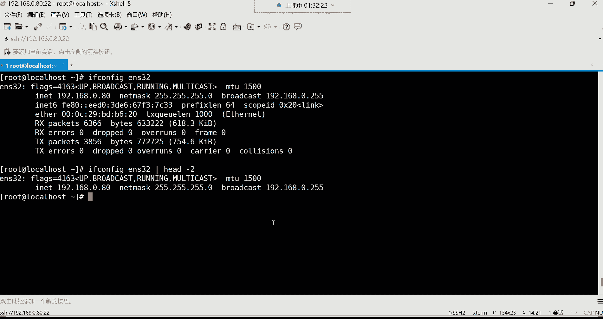

# 零基础入门Linux，红帽认证全套教程！Linux运维工程师的升职加薪宝典！RHCSA+RHCE+中级运维+云计算课程大合集！ - P14：红帽RHCSA-14.wc统计命令、管道符、重定向操作、echo与sleep命令 - 广厦千万- - BV1ns4y1r7A2

喂。好。都回来了吗？呃，设置NTP以后，clo时间也一起同步了吗？啊，对你设置NTP以后，你放心你的硬件时间跟你的系统时间全都是NTP的时间。所以这个你就不用自己手动去配了。好。

那下面给大家讲一个非常常用的一个命令WC统计命令哈。😊，那这条命令呢是我们今后非常非常常用的一条命令，而且它的功能也非常非常的好用。干什么用的呢？帮你统计文件呢？

比如说里面的字节束行数或者说这个关键词等等都能给你统计出来。啊，我们先说它这个演示一下怎么用哈WC然后呢。😊。

跟上一个文件，比如我不知道这个文件里面总共有多少行ETCpasWD回车。那这时候呢，他会帮你显示这些文件里边的什么呢？😊，行数单词数，还有字节数。看看这个行数应该比较好理解吧，是不是啊。

那这个单词是什么意思呢？这里面我给大家写了哈。😊。

行数单词儿字节，这个单词儿就是你比如说。这是一个单词，空格隔开啊，BCD。啊，BCD这也是一个单词，或者说这个叉叉O这也是一个单词，能列吧啊，单词嘛。但这个呢对于我们来讲，我们不是很关心哈。

其实我们最主要是关心什么呢？这个文件里面总共有多少行啊，这个WCA最常用的其实就是统一行数。所以你可以直接这样。😊，用杠L这个选项直接把行号啊，行数给它统计出来。就是我要就想看这文件里面总共多少行。

那就WC，然后直接杠L跟上ETC的pasWD是不是啊告诉你这文件总共有43行。😊。

做比较好用啊啊，非常非常的好用哈。然后。😊。

其他的功能也没什么了，主要就是统计行数的啊，用法的话也非常简单。WC杠L杠C的话统计字节束，这个字节束。啊，几乎很少用哈，那字节一个文件里边，你想想谁会闲的无聊去统计它的字节啊，是不是啊。

所以知道一下就行哈，主要还是杠L用的比较多。然后下边再来给大家讲讲这个管道符，管道符这个功能非常强大，强大到什么地步呢？你看它是就一根竖线哈，管道符这个是一根竖线。😊，所以你可以先找一找。

在你键盘上竖线。在哪个位置？找一找哈，然后或者说怎么怎么怎么把书线给它打出来，自己练一练功能是将命令的输出结果交给另一条命令作为参数去处理。哇，那这个功能就很强大。😊。

比如说。

嗯，给来看看这里面的例子哈。😊，我想看一个文件的内容啊，我想看这个passWD这个文件哈。

我们可以用这个hand看这个文件。hand然后我想看就杠十啊，直接看文件的前十行ETC的passWD。但是我现在想干嘛呢？我想看这个文件的前十行的为5行。这总共是文件的前十行吧。看哈总共前十行。

我想看为五行，那就是从第六行开始，678910。是不是啊？那就其实就是从哪开始呢？12345。12345，有时候我想看什么，看这个V5行。这是为5行啊，前边这五行我不想要。那怎么办呢？

那我怎么才能实现这个功能呢？😡，看他前十行的为5行。这功能很难实现。没错吧，因为前面这五行我不想要啊。😡，我不想让他给我显示。😡，对。老高你管道符。这样玩哈。这样吧。后面呢来一个管道。

管道服他可以帮你把前边命令的输出结果。你看我们前面命令的输出结果是不是这个文件的头十行，没错吧啊，是我的输出结果干嘛呢？我再交给管道后边的命令去处理一遍，后边的命令是什么命令都行。

管道它是可以连接不同的命令的，让两个毫无关系的命令发挥出什么呢？不一样的功能。那我现在就可以干嘛通过tll。然后呢。-5。他要杠5不是显示为五行吗？那显示谁的为5行啊啊。

是显示前边命令的输出结果的为5行。那个说他会帮你把前边命令的输出结果总共不是十行吗？哎，他会把十行的末尾的五行给你显示出来。那就说这尾五行会给你显示出来。回车。看效果哈，回头。如果这样看的话。

你看是不是就直接内为五行了呀？😡，前面那五行是不是就没有了啊，所以说这是管道符。那很多人说只能链接两个命令吗？不啊，我还如果你还需要管道的话，再管道给谁呢？比我再给管道给WC可以吗？WC杠L回车。😊。

统计一下是不是五行。1五行吗？そ真。15行哈啊15行。没什么问题吧，那你说还可以再管道吗？当然可以了呀，如果你有需求的话，你可以继续管道。😊，可以继续管刀哈，但是几乎现在没有什么需求了。

没有什么需求了啊。😊，啊，这个管道服呢它可以。让你无限管道下去，就只要你有这种需求。可以让你无线管道的。你比如cut杠N啊，看ETC的passWD这是总共把这个文件的内容都给它列出来了，是不是。

而且还给你附载一个行号。那现在我还需要干嘛呢？管道我要把这个文件的头。1行给他显出来悍der，那就杠1。你看。那这是不是就是。我已经链接了一个管道了呀。因为最主要前面它有个行号嘛。

是吧有个行号告诉你这是十行。好，那就是我现在要干嘛要取十行呢为5行，就是678910。那这时候我说继续管道啊，管道派有。-5。哎，那你看是不是就6七89十了呀？好，那我现在。

想统计个数管道给WC杠L回车。你发现这玩意儿。😊，功能是很功能是忒强大了，是不是它可以让你无限的管道下去？很好玩是吧？你比如说这个if。那个if服康菲哥这个命令。没是吧。咱们看ES32那块网卡。好。

我想看什么呢？我想看这个网卡的头几行，12头两行。管道给那个焊的。杠2。那这就是什么呢？网卡名是吧，还有网卡IP地址给他这两行给它显示出来了，其他东西呢就没有了。😊，因为其他东西我现在不想看。

是不可以啊？哎，可以。

很强大哈很强大。管道服后边我会频繁用到哈。所以现在呢大家先对它有一个概念啊，知知道这个东西怎么用啊，知道它的功能就可以了。然后下面再给大家讲讲这个重定项。这个重定向也是一个非常给力的一个操作。

什么叫重定向呢？就可以帮你将前边的命令的输出结果给它重定向到一个文件里面去啊，或者说写入到一个文件里面去，这就叫做。重定向。啊，这个重电项呢是通过一堆符号哈，一堆大于号小于号来帮我们实现这个功能的。😊。

啊，来看一下这个一个大于号，它代表叫重定向输出。输出就是把命令的结果给他输出到一个文件里面去。好。啊，两个大于号呢也叫做重定向输出，但是呢它具体的区别在后边啊，一个是叫覆盖重定向，一个叫追加重定向。

怎么用这个东西来看一下哈。

比如说我现在看if confi，我看这个网卡名是不是啊？然后呢过滤它的头两行，我现在想把这个结果给它保存起来。保存起来怎么办？你可以把这个输出结果给他通过这个大于号。给他重定向到一个文件里面去。

重电到哪个文件呢？比如说随便来一个文件，好，比如这个net。ENS32。给他重新到这个文件里面去回撤。那你发现我的这个命令的结果就没有被输出到屏幕。没错吧，跑哪去了呢？跑到文件里面去了。😊。

看那个文件里的内容哈。是不是我的这个结果是被我保存到这个netENS32这个文件里面去了。啊，这net一般就是我们形容是网络的意思哈，网络的意思。好。看到了吧。所以这就是重定向。

或者说你看我们前面那个操作，你们还记得我们前面只行过一个操作吗？就是那个k。呃，开杠N哈。开特杠N。啊，哪个操作来着，往上翻一翻翻一翻。这个号。是不是？我想把这个结果给它保存到一个文件里面去。

那这时候你也一样。重定向。啊，比如说叉叉点TT。回车你发现那这个结果你就可以从这个文件里面直接看看叉叉点TD。是不是啊给你保留下来了。然后这时候有人就纳纳闷了，说哎，这文件哪来的呀？这文件压根就有吗？

没有我告诉你这文件压根他是没有的。😡，所以说这个重定向这种符号。它也具备创建文件的功能，它是可以帮你把一个不存在的文件给你创建出来。然后再把这个前边的命令结果呀给你。写入到这个文件里面去。

那你说如果文件已经有的话呢，如果已经有的话。他就直接往里面写，知道吧？😡，啊，那这时候你我们说这个一个大于号，它是覆盖，是不是啊？这覆盖是什么意思呢？覆盖就是如果你再来一遍的话。

你看我们现在看叉叉点TATT这文件里面现在是有67890啊，这五行内容吧，我现在比如我fr瑞。😊，杠H这是看内存的，是不是啊？好，我想把我的内存的这个信息给它保留到这个叉叉点TIT文件里面去。

但是原先这个文件里面，它是不是有内容啊，有五行内容吧。好，那现在我如果再执行这么一个操作，把内存的。输出结果。给他再重定向到这个文件里面去，我们看看会有什么效果哈。k叉叉点TIT。

你发现这个文件里面原先的内容没了。原先的原先的内容没了吧，哪去了呢？被覆盖了。被覆盖了哈。但有的时候我不想覆盖这个文件里的原有的内容。那怎么办呢？那你就追加。

两个大于号，这两个大于号它叫追加重定项，它不会覆盖的。追加是什么意思呢？追加就是把内容给你追加到文件的。

现有的内容的行的下边。比如我现在这文我现在这文件里面总共有三行内容吧。那我现在在干嘛呢？在这样。😊，把这个命令翻过来看看这个命令我如果再执行一遍的话，如但是这边我得加一个再加一个代号，两个代号。

这就是追加。那追加的话，你再看这个文件，你看。这个文件里面原先的那些数据仍然还在，没错吧。然后下边呢，这个67890是不是我们刚刚执行的那个操作呀？是不是后追压进去的吧。哎。

所以这两个大于号叫追加充电项，它不会把原有的内容给它干嘛呢？给它覆盖掉。O。

啊，这种叫做重定向输出。然后还有这个叫重定向输入啊，重定输入的话，我们现在没有太好的例子给大家讲。嗯。从定向输入。啊，确实没有太好的例子哈啊，等后边呢我们有好的例子再给大家讲吧。😊。

然后我们再来给大家讲讲这个。一个大于号。这一个大号啊，其实。它是不是叫做重电输出啊，而且是覆盖重电项吧，倒告诉你啊。他在输出的时候，他不是把命令的结果给你写入到一个文件里面去吗？但是他写入的。

是正确的输出。什么叫正确的输出啊？

比如我现在。呃。协调命令哈。我看ETC下的叉叉O点TT。我的这条命令其实就是错的。就是错的哈。因为ETC下面压根没有这个文件。没有这文件哈。那现在。我如果后边跟上一个大于号的话，比如说ABC点TATT。

回车，你发现。这个命令的输出结果呀，它并没有给我写入到这个文件里面去。为什么？因为这个命令它执行失败了。所以你在看这个ABC点TATT的时候，你发现这文件里面是空的。所以呢这就叫什么呢？

这就叫做只收集正确的输出结果。

如果你的命令执行失败了，他不收集。

也就是说我们前面执行的这些这些命令都是执行成功的，所以他能够给你收集起来。

那如果说有你因为这个命令有的时候他不一定非得是百分百成功吧。有的命令他就是会执行失败呀。就比如说这个我看这个文件，这文件压根不存在的话，这命令不就执行失败的吗？是不是执行失败的话，我也想收集它的结果。

我想收集它失败的结果怎么办？😡，啊，这时候。2大月号。好，二大于号，这二大于号，你发现这个结果就没有给你输出到屏幕，放到哪了呢？给你放到这个文件里面去了。所以你就是看一他这个文件。

是不是这个内容就被我保存到这个文件里面去了。能理解这意思吧，就是二的大于号是可以帮我们收集错误的输出的。

反正都会帮你把这个命令的结果给它写入到一个文件里面。只不过。这一个大于号跟二大于号，他们俩个功能还不太一样。所以这个你要搞清搞清楚哈。好，那。下边呢我们。再来给他说这个这二大于号。

他虽然说是可以帮我们收集错误的输出结果。你说这应用场景在哪啊？

应用场景啊。就比如我们在后期在学习这个所有脚本的时候，比如我要测试我的整个集群的网段主机啊。

在企业当中，比如说我这个茄业子集群。集群环境哈。可能会有非常多的机器。好。那这些机器的话呢，可能说其中某一台机器出现故障了。出现问题了哈。宕机了。某一台，但是由于这个机器太多。

我也不知道哪我也不知道哪个机器宕机了。那怎么办？这时候我们得拼啊，这个拼测试啊，测试我们整个网段看看哪个机器到底是这个开机的状态，哪个机器到底是关机的状态。所以那个时候。😊。

你在拼一个主机的时候，它会有两个结果拼的通。比如我拼3W点百度点com的时候，这拼通了，那就我的命令是执行成功的，知道吧？如果拼一个地方它不存在的话。ABC叉叉O点儿COM。你看。那这个肯定会失败吧。

那失败这个结果是不是就错的？那也时候在企业当中，你后期我拼这个主意的时候，如果他拼到这个机器确实是关机状态，那这个结果就是错的。

那有的时候我们是不是就特别希望收集这种错误的输出啊？😡，因为这种错误输出是能够让我们清楚的定位哪个机器是关机的。啊，我希望把这个错误的输出给我写入到一个文件里面去。😡，啊，给我放到一个文件里面去。

那这个时候是不是到时候你在拼测的时候。一旦这台机器没拼通，他就会帮你把这个机器的信息给你写入到这个文件里面去啊。那以后你看那个文件不就行了吗？啊，你知道啊这个文件。里边记录的就是这个机器的IP地址。

它没拼通，它就是关机的状态，它有故障了啊，我说这意思你们能理解吗？啊，跟你们讲这个意思就是说你可能说不知道这种。收集错误的输出结果的应用场景在哪？所以我现在给你们描述，就是就这一个应用场景。哎。

是非常有用的哈，千万不要觉得它没它没有什么用。有的时候我们就是要收集错误的输出的，能列吧？好。😊，但这一个大呃这二后边跟一个大于号，它是也是属于覆盖。注意啊，你别看它是收集错误输出，但它也是覆盖。

就拿这个结果来说吧，这个结果是不是错误的输出，我再来一遍。😡，2大于号放到那个哪儿ABC点TT文件里边。你看这个ABC点TT文件里边原先是有内容的，哪个内容呢？是这个cap命令的错误输出，是不是啊？

就是我再回车。然后你再看这个ABC点TIT这文件的话，你发现原先这个文件里的内容没了，现在变成拼的错误输出了，是不是啊？那是不是也就等于把这个文件里的原有的数据给它覆盖掉了呀？😊，那我如我不想覆盖呢？

啊，俩大一号。再来一个大号。那这时候我们再换一个输出哈。莱斯叉叉叉叉叉。嗯，再看那个文件。那是不是这个LS的这个错误的输出也被我收集到这个机器里面去了？所以这个两个大于号前面加一个2，这种叫做什么呢？

叫追加充定项。

但他只收集错误输出，以追加的方式去收集。那如果说我正确的错误都想收结怎么办呢？😡，按的大于号。按照代号就不管你是正确的还是错误的。

我都给你收悉，比如我现在。这个命令。可能会有啊可能会有这个两个结果啊，比如我看文件吧，看看ETC下边，比如说看ho name这个文件，这条命肯定是对的，是不是啊？

那这个看命后面可以跟呃再来一个不存在的文件，比如ABC点TT。那你看这条命令肯定是第一个结果是对的，第二个肯定是错的那如果说我想把正确错误都收集走，那就按的大于号。放到哪儿了？

放到ABC点TATT的文件里面去回。那你看这一条命令是吧，有两个输出结果，一个是正确的，一个是错误的。但是呢我都给他收集走了。看这个文件。是不是啊都给它收集进去了。但这种方式它也是什么叫覆盖。

也是属于覆盖哈，你按的后面跟一个大于号，虽然说是正确错误都收集，但是都是覆盖。会把原先文件里的内容给它覆盖掉。如果说我想追加的话，那就还是后边两个大于号。

所以这时候你可以。比如说现在LS。ETC下的passWD这肯定是对的。我再来1个L拉4。呃，EETC下的ABC这肯定是错的，是不是啊？所以现在这一条命令ABC。passWD。然后呢，我一个。

两个大号哈按的两个大号放到AABC点TATT。那这时候你看这个文件它就不会覆盖了哈。原先ca这条命令的。输出结果就没有被覆盖，还在呢，是不是？就以追加的方式。不管是正确的结果还是错的结果呢。

我都给你追加到这个文件里面去。😡。

啊，所以它不是覆盖。那这种东西呢我们后边都会用得到哈。啊，都用到我给你们讲的这这个位置这很重要的。包括前面的管道服。WC统计管道服务重定项。还有e与sep，这个都非常重要哈。

接下来看看icle与sleep。嗯，icicle与sep这个命令。我告诉你呃，现在是没什么用的哈。我们先说icle用于输出指定的字符串和变量。其实Ione呢现在对于我们来讲。命令格式icical。

这个呢你后边不要跟什么选项，你只需要跟参数就行了。你给我挨过一个什么呢？hello。apple是输出。啊，对你挨过什么，他就给你输出什么。看到了吗？你爱过hello，他就在屏幕给你输出hello。

你说我icical叉叉。他就给你在屏幕输出插着哦。你挨口。中文你说你好。那就给你说出你好。那很多人说呢，这老师这块有什么用啊，你这是不是感觉倍儿无聊啊，你吃饱了撑的嘛？这不是。😊，呃。

现在这种确实是吃饱了撑的哈。道哥，你这个东西后期呢？😊，在。配合一些符号的时候，比如eical怎么呢？ele一个。Hello。然后再结合这个重定向的话，其实就比较好玩了。它可以干嘛呢？

你看eicle不是输出嘛，你ecle什么，它就你输出什么，但是这个大于号是吧？重定向输出嘛，它会帮你把前面的命令结果给你写入到一个文件里面去，是不是啊？那这时候你后面跟一个文件。

比如ABC点TATT回车。😊，KABC点TAT发现。他就帮我把这个hello给我输出到这个文件里面去了。所以以后当你需要改一个文件的时候，你比如说哎我希望改个主机名啊，那我们当前的主机名开。呃。

ETC host name。是local host的，是不是啊？那这时候你说我想改手机名，其实你都不需要用VIM打开这个文件。知道吧？不需要打开哈。😊，你就直接这样I口。主机名。比如说呃太子的。

然后呢放到哪儿了？通过一个大于号，在这哈通过一个大于号给它放到。主机名那个文件里面去。委托。你再看这个文件。你发现是不是？就是你挨过什么，他就把这个信息给你写入到这个文件里面去啊啊。

所以这种方式呢也可以也可以。啊，这一个大于号啊，这一个一个大于号还是覆盖呀。😡，啊，是清空的哈。如果你这样。如果你前面什么都没跟，那就空的嘛，是不是？😡，你看ABC的TIT。看ABC的TAT。没了。

为什么呀？因为这就等于说你是等于icle空格。你知道吧？你这不是有个空格吗？😡，然后大于号就等于说你是把这一个空格。给他输出到一个文件里面去了。嗯，就清空的意思哈。好，这是I口，现在没什么用啊。

还有一个没用的命令的叫sleep。

sleep也没什么用。sleep命令是可以用来将目目前的动作延迟一段时间，命令格式sleep后面跟时间就行了。它这个时间S代表是秒，M代表是分钟，H1小时，第二天。

你可以这样吧。sleep，比如说5回车。你看我们当前的终端就会。休眠5秒钟。你看看再来一遍sleep5回车。默认就是秒哈。你看我当前终端停留了5秒才出来，是不是啊干嘛呢？休眠了5秒钟。

如果你这样sleep。5M，那它会休眠5分钟。我这个终端得等5分钟以后才能出来哈，系统在休眠。😊，ctl C给它取消掉哈那如果你这样，你说我5H，那我我当前的终端会休眠5个小时。那如果你后边是5D。

那你我当前的终端会休休会休眠5天。终端才会弹出来。那很多人说老师，你这玩意啥啥用呢，是吧用在哪儿啊？你这玩意儿啊。😊。

我告你现在是现在是没啥用哈，那后期呢在写脚本的时候会用得到哈。我后后期会学习一个叫做适有脚本的东西。😊。

啊，那个时候我们会用到这个sleep啊，它可以让我们的CPU注意啊，sleep就是主要是让我们的CPU别太忙。因为CPU处理数据的时候特别特别的快，你知道吗？😡，所以CPU太快的时候呢，CPU会发热。

所以你让CPU就可以。呃，让他干嘛休眠一下。你比我这样sleep。0。1啊0点1就是休眠0。1秒。这0。1秒对于CPU来讲。呃，是可以说是会起很大的作用的哈，对我们来讲可能没什么用。

那后期对CPU来讲是。呃，非常有用。我给你们演示一下哈。😊，你看看，我现在是在屏幕用icle一直输出hello。但你看它是一直输出啊，你看速度非常快，看到吗？速度非常快，已经上去了，看到吗？

非常的快哈啊这时候呢我们可以干嘛呢？从这边。😊。

从图形化界面里边进去。

选择这个未列出登录一下哈，未列出。Root。密码。登录进去以后，我们可以看当前的CPU的一个什么呢？一个负载量。有些慢哈点慢。哇，这也太慢了。我了，不是吧。

这图形界面都加载不出来，你们看到了吗？CPU太忙了，现在。😡，哇，都卡成这样了，卡成C我先取消掉哈。

一会儿给你们演示一下，因为这CCPU太忙了，处理不过来。

然后按你键盘的win键，按win键啊。应用程序，然后这里面有工具，在工具里面有个叫系统监视器，点一下。这其实就是windows的资源管理器哈，然后看资源。😊，好，这是看资源是吧？我们现在呢。

在这边我再执行刚刚那个命令啊，一直输出hello啊。这边我如果说看资源的话。你看这CPU这个线儿哈，这是CPU看到了吗？CPU现在已经标到百分百了，你看到了吗？😊，已经飙到百分百了。是不是啊？

这线是不是在百分百这个位置应该应该能看清，是不是在这哈。那CPU你看这太忙了，现在特别特别忙，而sep可以帮我做什么事情呢？😊，这sleep可以让你的CPU啊，就是在特别忙的情况下休眠一下。啊。

在在这儿。Sleep。0。1。回托。这样不行。你看看这时候速度，你发现他它明显变慢了，是不是哎，你看速不明显变慢了。

哈哈明显变慢了哈。😊，为什么呢？就是因为。CP。它会休息0。1秒哎，每次处理这个数据的时候，他都会休息0。1秒。那这个0。1秒，你说对我们人来讲可能感觉没什么哈。大哥你对CPU来讲。😊。

一会儿这馅儿就下来了，你看。线下来了哈。看到了吗？嗯。是不是不明显能够感受得到啊？sleep，你发现。它能够让CPU啊这么神奇吗？当然这么神奇了，你看。下就下来了哈，😊，有点意思是吧？是不是啊？

你看线儿下来了。不忙了，就没有那么忙了，不能说不忙就没有那么忙了。😡，这就是。sleep这个命令你看这时候速度你明显都感觉它速度明显都变慢了嘛，是不是你看速度。😡。

是不是有点意思是吧？啊，确实有点意思啊。所以有的时候你发现这种没用的命令，它往往它能够起到一些很神奇的功能。😊，M。有这么妙吗？确实哈OK。😊，行啊，我们要不要休息一下多长时间了，这才30分钟了。

来继续讲哈。😊，呃，那我得什么呢？

把这个录屏听一下录屏听一下哈。