# 零基础入门Linux，红帽认证全套教程！Linux运维工程师的升职加薪宝典！RHCSA+RHCE+中级运维+云计算课程大合集！ - P15：红帽RHCSA-15.用户管理、用户信息文件详解 - 广厦千万- - BV1ns4y1r7A2

好喂喂喂，Ok，那下面呢我们来说说这个用户的管理啊，这个用户账号管理，我们先说这个用户账号吧，其实大家都不陌生，用户账号的作用呢，你们都知道可以用来登录系统的，是不是我们想要登录这个系统。

我们首先得在系统当中有一个账号，然后呢通过账号呢我们去登录系统，OK啊这是我们所说的这个叫做账号的作用，然后这个账号的话呢，我们前面就介绍了，在这个系统当中有两类的用户，第一类呢是超级管理员。

然后是root用户是吧，权限最大的我们叫老流氓，然后第二类用户呢就是系统里的普通用户啊，是管理员创建的那些用户，那在讲这个账号管理的话呢，我先给大家讲清楚，就是在企业当中一台服务器上面那个root账号。

这一台服务器啊，这服务器里面这个root这个账号的话，win酱在公司里面可并不是说，所有人都会拥有这个root账号的权限的，为什么呢，因为root这个账号你想想它的权限非常的大，他的一条命令是不是可以。

直接把整个系统都给你删掉啊，所以说这个就是因为权限太大，责任就越大，是不是，所以一般普通的员工呢，在企业里边是不会具备这个root超级管理员，这个账号的权限的哈，就是一般不会给他分配这个root账号。

一般就给他分配一些普通用户的账号去使用，然后它权限比较小，对系统呢也不会造成一些威胁对，所以这就是这个我们所说的，为什么会有这些普通用户的存在啊，然后root呢一般都是公司的核心人物。

比如你们公司的部门的领导，或者说你们公司一些核心骨干的运维人员，他们才会有拥有root的权限啊，因为人家你想想对于服务器来讲，已经是有非常丰富的经验了啊，所以说他们手握root权限呢，一般是怎怎么说呢。

是不会出现任何问题的，你一个呃如果说你比如说你经验也不多啊，技术水平的也不怎么也不怎么地，人家不可能给你root权限的，哼哼所以说呢我们要学习这个普通账号啊，普通账号的话呢就是我们先来讲第一个啊。

叫用户的模板目录，这个目录大家作为了解即可哈，这个目录呢下边有一些文件来看一下。

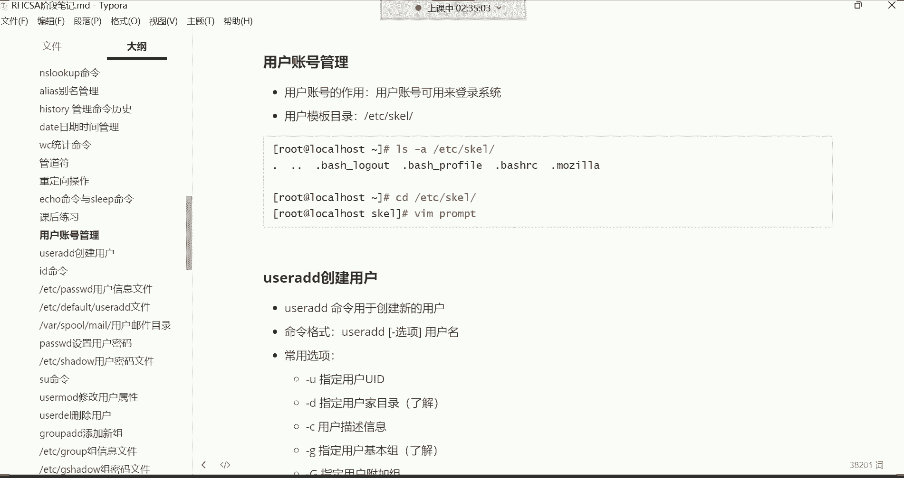

来看一下etc的SKEL这个目录，这个目录你这样打开，你发现什么都没有是吧，没关系啊，你这样加个杠A把隐藏的文件给他列出来，那这个呢一些隐藏文件是在哪儿呢，在这个etc s k e l这个目录。

然后至于这个为什么叫模板目录，就是它这个目录下边这几个文件呢，其实跟用户的家目录那些文件，其实看我们回到自己的家L点，有些文件非常类似，你看到了吗，什么点，这是灯，这是退出系统，注意啊。

退出系统我们会用到一个文件，这个文件里面放的什么东西呢，你看一下blog out啊，这这里面现在什么都没有是吧，登录，我记得这个文件以前会记录，我们什么时候退出的系统呃，如果没有在这个文件里面记录。

就是在那个哪儿呢，就是在那个有一个日志文件里面记着，然后看一下啊，确实没有记哈，那这文件现在应该没有什么用了哈，然后还有像这个黑丝腿啊，像这些历史命令是不是还有像什么呢。

像这个点batch profile，还有像这个BRC这些文件，其实这些文件都是从哪来的，都是从那个etc s k e l这个目录啊，我们加个杠A哈，那加个杠A，你看像这种这个BHRC这个文件。

还有这个点batch profile这个文件，像这些文件都是从etc s k e l目录，拷贝到每一个用户的家里面去的，包括这个blog out啊，都是拷贝到用户的家里面去的，然后这些文件干什么用呢。

你想这个就是给这些用户登录系统时提供一些，比如说用户敲个命令，到时候我给你存到哪个文件里边，给你存到这个历史文件里边，没错吧，好像这种BC我们前面讲过，这是存放命令别名的啊。

比如说这个用户他自己定义一些命令别名，那这时候啊，这个命令别名我给你记录到哪个文件里面，给你记录到这个BHRC这个文件里面去啊，其实就是用户的模板目录啊，就是把一些用户在系统当中啊。

所必备的文件给你拷贝到你的家里面去啊，其实就这意思，所以这个目录呢大家没有必要去深入去研究它，你即便说你不知道这个目录的存在，其实也不会影响你对这个系统的一个使用的啊。

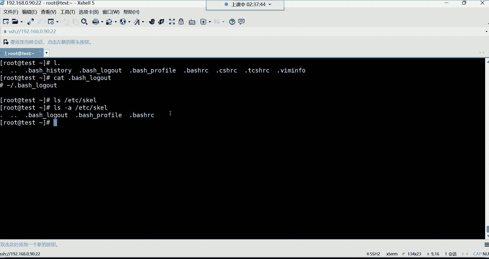

知道一下就行，然后下边呢咱们就讲怎么去创建用户啊，用的命令是UZI的这条命令，那UI的这条命令呢。

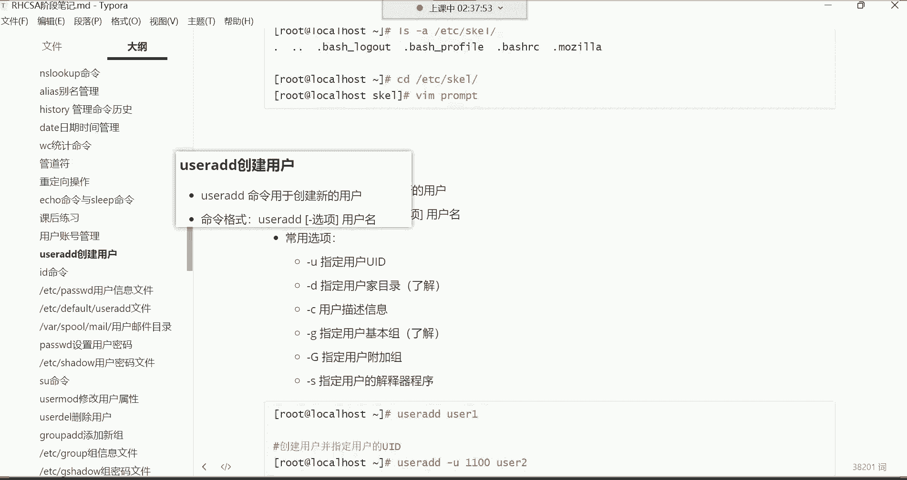

也只有root超级管理员才可以使用这条命令哈，因为普通用户是没有资格使用这条命令的，那命令呢也非常的简明之意啊，USI的，首先你说user呢这个单词代表是用户，ADD呢代表着添加。

所以这个mini就用于去添加新的用户的啊，那命格也非常简单，就UI的后面的跟用户名比，我创建一个U41这个用户用户名自定义哈，叫什么都行，但是别取中文，你说我取个我创一个用户，这个用户叫什么。

叫叫张三啊，或者叫叫小芳，你看无效的用户名不支持中文哈，所以呢就用英文来命名，比如创建一个什么呢，创建一个UC1用户一的意思哈，然后创建好之后呢，那这用户就存在于我这个系统里边了。

但是这用户创建好了之后，我怎么看用户的信息啊，你说这就感觉用户创建好了，但是就跟没创建一样是吧，这用户怎么用啊，接下来有了这个用户以后，我怎么用这个用户啊，是吧啊，那我们先了解他的信息。

然后我们再讲这个用户怎么用啊，这个用户后期得给设置密码，然后我们才可以使用这个账号去登录系统，但现在它没有密码，我们没有办法去登录。

那对于用户的信息呢，我们想看的话，你说这些用户创建以后，这用户在哪放的呀。

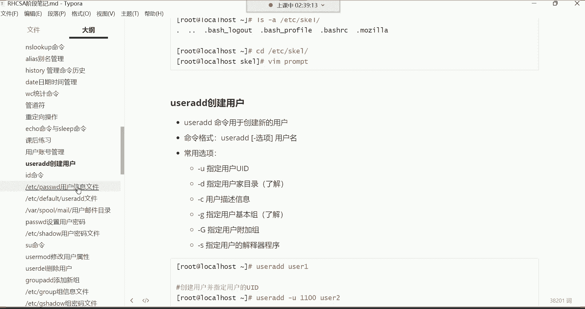

啊这个文件就这个文件哈。

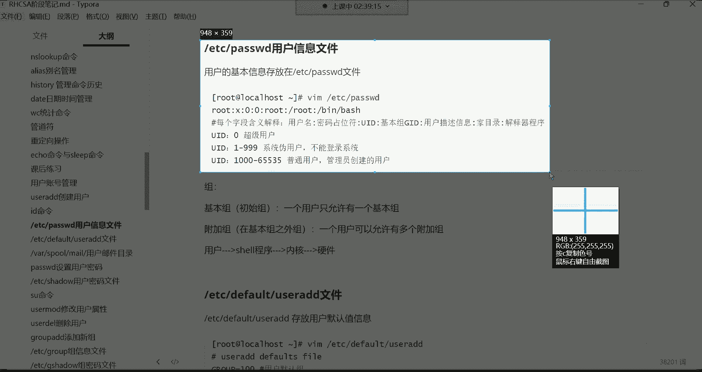

这个文件呢是这个叫用户信息文件，在etc下边的pass wd，也是我们前面经常讲的一个文件，那接下来呢咱们就得深入去来说一下，这个文件里的内容了，前面总拿这个文件去练习是吧。

那你看用户的基本信息就存放在这个文件当中，那接下来呢我们打开这个文件哈，etc下的pass w d回六，那接下来呢嗯看这个文件啊，我们这个内容比较少，总共多少行呢，咱们把行号打开吧是吧，英文代码号。

然后set none回车显示行号，对于这个文件来讲呢，大家看一下哈，就是总共是20行，其实这个，这个文件大家给我们的感觉，如果是你是第一次打开这个文件，你发现这文件给我们的感觉就是乱是吧。

虽然说有些什么颜色，感觉这个花里胡哨的，但是呢就是乱给我们的感觉就是错综的复杂，特别的乱，不知道怎么去看这个文件呃，我先给大家讲讲这个文件是每一行，注意哈，那总共20行是吧。

每一行都代表一个用户的基本信息，所以说你想知道你系统里面有多少个用户的话，或者说有多少个账号，你就看文件有多少行就行了，20行就20个账号，那你说那你说这每一行分别怎么去解读呢，怎么解读呢。

啊这个就非常的重要了哈，这个文件啊，你甭管是这一行有多长，你看现在第一行感觉比较短是吧，然后下面这行的感觉比较长，我告诉你哈，呃你甭管是比较短的行还是比较长的航，它是以这个英文的冒号作为分隔。

以这个英文的冒号最风格哈，然后总共每一行有多少个字段呢，多个字段呢，以冒号这风格，总共是有七个字段或者七列都行啊，我们以列来说吧，总共有七列好，遇到冒号就是一列，然后呢第二列，然后第三列啊，第四列。

第五列，第六列，第七列，看到了吧，这是以冒号作风格，每一行总共有七列，那下面比较长的也一样，你看这个比较长，这是第一列好，这是第二列，这是第三列，这是第四列啊，这是第五列啊，一轮到这儿啊，这是第六列。

然后这个是第七点，看到了吗，所以说这个文件呢是非常有规律的哈，每一行代表一个用户的信息，然后每一行以冒号作为分隔，总共是分为七列，那每一列代表什么意思啊，这个就非常的重要了，看第一列，我们先说第一列哈。

就每个字段的含义解释，就是每一列的含义解释，第一列叫用户名啊，就是这个最左侧的一列就是用户的名字了，那你看这个应该大家都认识，也就是说我们系统当中的这个root，超级管理员的信息。

他也在这个文件里面放着呢，所以这个文件的重要性呢不用我太多说，如果你把这个文件一删掉好，那root的信息在这个系统里面也被你给删除了，那以后你想使用root这个账号登录系统，你发现你登录不上来。

为什么呢，因为你在登录系统的时候，系统首先会跑到这个文件里面，看看你输入的用户名，在这个文件里面它有没有，如果你说的用户名，那系统在调取这个文件的时候，发现诶这个文件不存在了。

所以你这个用户也没有办法登录了，能列吧，所以这个文件是不是常的重要啊，好那也主要就是因为root，它的信息也在这个文件里面的，那第一列代表用户名，然后包括我们前面建的那个用户，像UC1看到了吗啊。

也是在这个文件里面的最后一行啊，用户名，那第二列呢，第二列呢叫做密码的占位符，这什么叫密码占位符合，其实它就类似于一个密码的标识一样，这个标识呢永远都是X，哪个用户的标识都是X来表示的哈。

而这个S呢现在没有太大的实际的意义了，其实就是一个标识符而已，呃一呃它不是用户的密码，因为用户有没有密码，他这位置都是X，或者说这个用户的密码有多么的复杂，多么的简单，他这个位置也永远都是X代表示啊。

就是这个X叫密码标识符，呃所以呢不是什么重要的字段，那第三列呢这个就非常重要了，第三列这个叫用户的UID，这个UID是干什么用的呢，UID叫用户的身份证号啊，你怎么去理解。

你看我们生活中的每个人的唯一标识，就是就是我们的身份的唯一标识啊，就是我们的身份证号，因为名字有很多都是重名的，就你的名字在我们这个全中国，可能说有很多人都叫同一个名字哈，可能你不知道而已。

那你说如果真的是遇到同名的了，我们怎么去区分这两个人的唯一性啊，名字都一模一样是吧，那我们就通过他的身份证号去区分，因为身份证号肯定是不可能重复的，所以这个在系统里面它的特点也一样，每个用户哎。

都有一个属于自己的一个唯一的编号，这个编号就叫做UID啊，叫用户的id号，U就是user i就是id用户的id号，但这个UID呢又有一些不同的含义，你看UID如果为零的呢，这个叫超级用户。

就是那个root，你看只有root的UID才是V0的吧，那别的用户你看它的第三列可都不是零啊，Mac地址可以这么理解，可以啊，可以这么理解呃，你看吧，你看像我们刚刚自己建的这个U色一。

它的这个UID是1001是吧，1001，那只要不是零的，都不是超级用户，所以在这里边呢我再给大家呃，就是纠正一个问题，这个问题呢，是我们第一天给大家讲解的一个问题，就说我说系统里的超级管理员叫root。

是不是，但是我跟你讲，并不是说叫root的就是超级管理员，而是只有这个UID为零的人，才是真正的超级管理员，如果后期你说我把UC1，它的UID给它改成零的话，你知道吗，UC1它也是超级管理员。

呵呵不是说只有root是超级管理员哈，因为只看UIDOK所以这个大家一定要搞清楚哈，好，那接下来呢，这个如果UID是从1~999范围内的呢，这叫系统的伪用户，这个伪用户一般就是这个尾，我们理也是假的。

意思是吧，伪伪装假的，其实我跟你讲它并不是假的哈，这个尾呢它是真实存在的，用户真实存在，但是呢就是不能登录系统，那所以说这个问题就来了，你说你像UID，你看像这种一的是吧。

been这个用户UID是1demo的用户，UID是二是吧，啊，我的mean的用户UID是三，LP这个用户的UID是四是吧，这个SYNC的UID是50万吗，UID是六，你发现这UID一直到999。

也就是说一直到哪儿，一直到哎呦，我们还没有那么多是吧，没有那么多，反正从1~999的，都是这些不能登录系统的用户，那现在问题就在这儿说，我们为什么会搞这些用户存在，但还是不能登录系统的。

那要它干嘛呀是吧，我们说这用户的账号不就是用来登录系统的吗，但是你说他们不能登录系统是吧，所以这个呢要给大家说清楚啊。

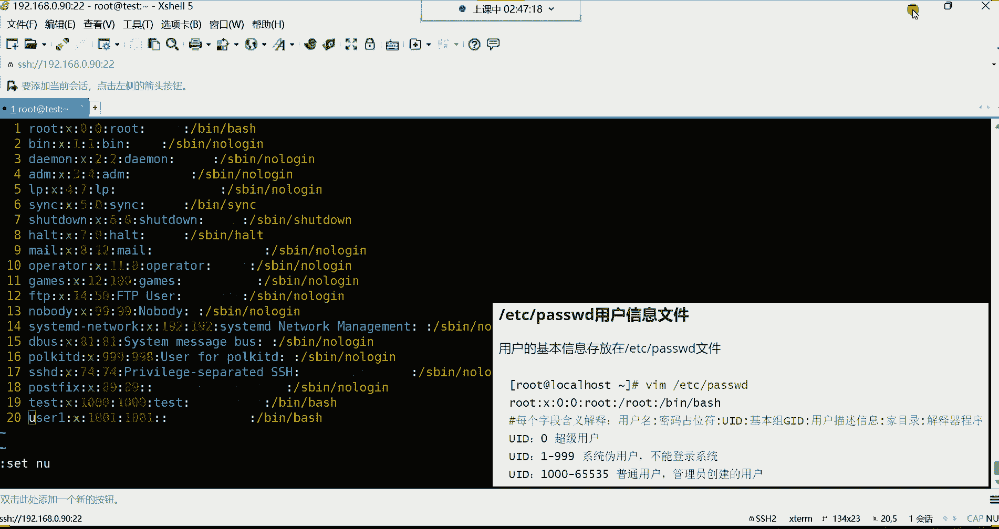

任何的系统的程序想要运行，它都得需要一个用户的身份，我们找到这个资源管理器，我们找到这个任务管理器哈。

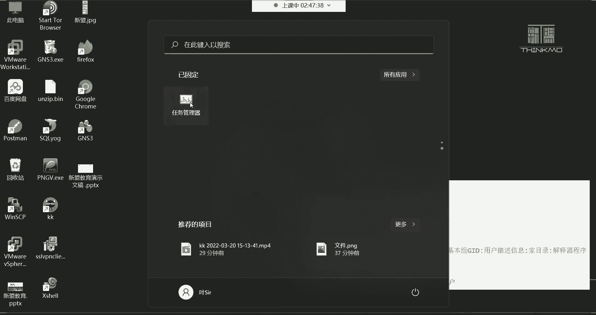

那在这个任务管理器里面呢，我给大家看一个信息，看哪个信息呢，看叫详细信息，在详细信息里面大家可以看到哪些呢，首先左边是进程的名字，就是你程序运行以后呢，它会生成诸多的进程，看到了吗。

包括我们在用的腾讯课堂啊，起了很多的进程，包括我们用的这个酷狗音乐听歌的是吧，也起了很多进程，包括我们的浏览器是吧嗯等等等，都有QQ非常多的进程，是不是啊，那这时候我再给大家说一下这个每个程序运行。

你就比如说像腾讯课堂这个程序，它运行的话，他起了这么多进程，那你知道这些进程，都要以一个用户的身份去运行，就是我想运行，我得必须得以你系统当中的某一个账号的身份，才能够运行成功，以谁呢啊。

这是我给他建的一个普通的账号，所以呢到时候他们运行的时候，就以这个账号的身份去运行，然后继承的权限，就是这个账号在系统当中的这个身份的权限，就这意思你包括你看这些，而且还有很多的账号能看到吗。

什么system这个用户，然后呢你看某些程序在运行的时候，就以这个system的身份在运行，local这个用户的身份在运行的时候，你看就这个程序在运行的时候，就以local的身份在运行。

看到了吗啊network这个这个用户的身份看到了吗，啊就是给什么呢，给某些程序运行准备的这些账号，那如果你说你这没有这么多账号，那程序在运行的时候，他没有这个用户身份。

它怎么运行无法运行啊，所以这时候大家应该能够清楚。

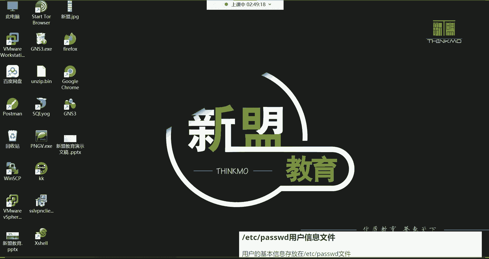

什么叫伪用户了吗，就是有的用户我根本就不需要它登录系统。

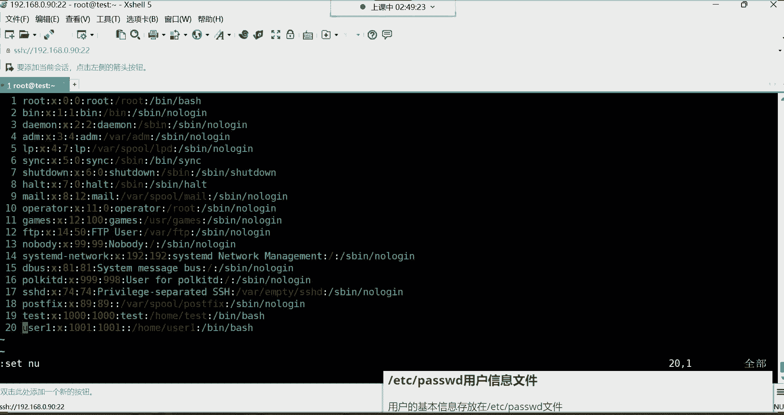

但是呢我要给他干嘛呀，我还得让它存在，它存在的价值，就是给某些程序运行而准备的一个账号啊，某个程序运行，它会自动调用这个用户的身份，以他们的身份运行就可以了，也不需要它登录系统啊。

其实就这个就是我们所说叫系统的伪用户啊，不需要它登录系统好，然后下面这个UID，如果是从1000~65535的，这个叫系统里面的普通用户，这普通用户就是我们管理员在系统当中创建的，这些用户了啊。

我们叫普通的用户，那你看我们前面在安装系统的时候，我们自己建了一个用户叫test是吧，你看他的UID是多少啊，他的UID就是1000是吧，然后你看这个U41这个用户，他的UID就是1001啊。

这些就是都是我们管理员哈手动创建的啊，这是UID啊，它就是不同的编号，还有不同的含义呢，好那是第三个字段叫用户的UID，那第四个字段呢啊，或者第四列，第四列叫基本组ID，我们看一下啊，第四列基本组id。

第四列在这呢换个颜色吧，好基本组的id啊，什么叫基本组，这个基本组呢，前面我们已经反复提过这个词了是吧。

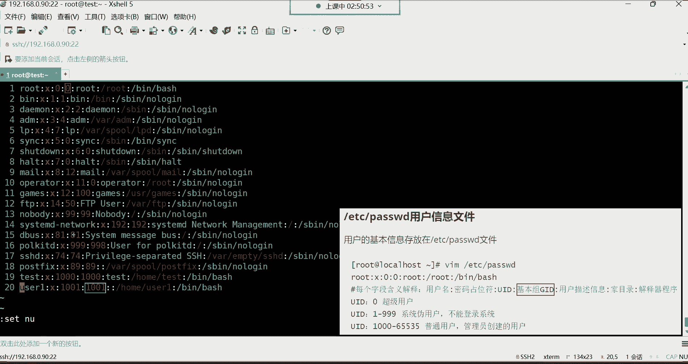

基本组基本组，所以说呢这个基本组呢，这时候再给大家说说这个基本组，其实我们也管它叫做用户的初始组，什么叫初始啊，就是与生俱来的，我们在系统里面，比如我每建一个用户。

用这个系统就会自动给这个用户分配一个组，比如我前面建了一个U41是吧，那系统呢也会给这个UC这个账号，这个组呢也叫UC1的组同名，跟用户名同名，然后这一个用户呢只允许有一个基本组，那只允许有一个基本组。

这没有，为什么只能有一个哈，然后还有一个组叫做附加组，这个附加组是在基本组之外额外附加的，比如UC1这个用户可能说啊它是什么呢，它有一个自己的基本组是吧，那UC1这个账号以后我给谁用呢。

我给运维部门的某一个员工使用啊，把这个账号发给那个员工，然后让那个员工呢使用这个账号登录系统，那这时候这个账号可能说我还需要他，对我们这个系统当中的某些文件具备一些权限，哪些文件呢，比如说有一堆文件啊。

现在是有非常多的文件，这些文件呢呃是属于哪个部门的工作文件呢，是属于运维部门的工作文件，那这时候我们会在系统里面再建一个组，这个组名叫做比如说就叫做运维组好，那这时候呢这些文件它的权限对于运维组来讲。

都可以进行增删改查，那以后你想让UC1对，这个文件也可以具备什么增删改查的操作，你就把UC1用户再加入到这个运维组里面，就可以了，所以这个运维组就是属于用户，在自己初始组以外额外附加的，我们叫附加组。

然后以后这个用户呢，就会继承这个运维组的权限，那继承什么权限呢，就是运维这个组对于文件的权限。

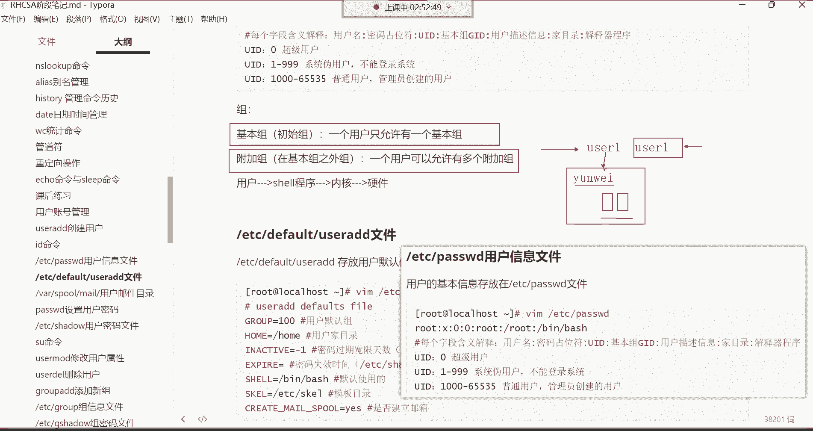

他可以继承，因为对于每个文件的详细属性，我前面就给大家讲过文件有哪些详细属性，有所有者所属组是吧，我们建个文件哈，我们touch一个hello，点TT，然后我们来看这个hello，这个文件。

你看这个文件，你看这所有者，然后呢这是所属组是吧，默认的这个文件的所属组就是用户的基本组，就这意思哈，那后期比如说我希望这个文件属于谁的组呢，属于比如我给他改个组，我给他改成运维组，给它改成运维组。

那接下来呢，我希望这个运维组对这个文字的权限，那是不是在这中间这三个字符是组权限啊，啊默认是只读，那我希望这个组对这个文件的权限是什么，权限呢，是这个比如说RWX能读能写，能执行。

那你就改这个权限就可以了，这权限我们后面再讲怎么改哈，那接下来你看这个组，一旦对这个文件具备一个读写执行权限了，那以后我再把这个UC1，这个用户加入到这个组里面，UC1用户往这个运维组里面一加。

那UC1呢就会继承这个组对这个文件的权限，那也说UC1对这个文件的权限，其实就是什么权限呢，就是这个读写执行的权限，所以这个组就是UUC用户，在自己的这个UC1初始组以外额外附加的组，唉其实就这玩意儿。

这就所谓的组的概念祖嘛是吧，那以后你们公司里面，比如说我运维部门，还有别人呢，还有那个什么张三，李四是吧，你把张三也加入到这个运维组里面，那张三就会继承这个运维组对这个文件的权限。

那你说我们公司还有李四，那你把李四也加到这个运维组里面，那李四以后就会继承这个运维组，对这个文件的权限读写执行，那没有在这个组里面的权限呢，没有在这个组里面的，那就是被归类到了其他人了啊。

他们就会继承这个权限制都啊其实就这个意思，所以说这个组啊，这组那组的话，那每个组都会有一个id号啊，然后我们现在看到看到这个叫组D，每个用户的基本组的id跟用户的UID是相同的，看到了吗。

叫基本组的ID叫GID，用户的UID是多少，它的GID就是多少啊，这种东西没有必要去改它啊，然后呢接下来呢用户的描述信息，这是第五个字段了啊，第五列描述信息哈，这个描述信息。

你看为什么UC1它没有描述信息啊，是个空的是吧，那是因为这个描述信息，这个它其实不是什么重要的信息，你说我们怎么去理解这个描述信息呢，你看这描述信息UC1就没有是吧，其实这个描述性。

大家可以把它理解成是一个用户的备注，这个备注大家应该都不陌生，比如说你加个好友，你加一个好友的话呢，比如加一个女孩子是吧，这个而且你还是频繁会加很多女孩子的好友啊，海王，然后你加这个女孩子呢。

可能说这个女这个太多了，是不是可能说这个女孩子的特点你一般呢是吧，你会加一个备注，比如这个女孩子特点就腰细腿长是吧，然后再加别的女孩子再给加个备注，比如这个女孩子前凸后翘的是吧，然后另外一个女孩子。

你说波涛汹涌的，然后他在是不是每个每个人都给他加个备注，这不就描述信息嘛是吧，描述一下这个人的特征，然后说这个他也只要你自己心里清楚，就可以了啊，以后你说我就想我今天是吧，我这个心情愉悦。

我喜欢腰细腿长的好，打开微信一搜索腰细腿长好，一看这全是腰细腿长的是吧啊，然后啊我这个明天的心情是吧，这也比较愉悦，我喜欢那些波涛汹涌的啊，想吃点荤的啊，一搜索波涛汹涌是吧，这波涛汹涌就出来了是吧啊。

其实就这意思啊，所以说这什么叫什么叫做用户的描述信息呢，这描述信息其实就是一个用户的备注信息，你知道吧，那你说放到我们这个系统里面，那个描述信息我们怎么去理解啊，就是呃每个用户你也可以给它加一个备注啊。

比如说这个用户是哪个部门的，比如说运维部门的还是开发部门的，就这个账号的使用者哈，我们说的是账号使用者是哪个部门的啊，你可以给他备注一下，或者说这个人的联系邮箱，就这个账号你发给谁，这个人的联系方式。

邮箱或者电话是吧，给他放到备注里面以后呢也好联系，是不是啊，嗯你像你们平时加好友，你们一般不也是比如这个人干什么工作的是吧，比如说呃这个这个人做什么职业的是吧，比如说送水的是吧，那个人呢充话费的是吧。

那个人那卖卡的等等等等是吧，你一般不得加个备注嘛是吧，以后方便去什么的去联系这个人啊，其实就这意思哈，所以说呢像这种描述信息呢，不是什么重要的字段哈，所以这个我们自己创建的这种就没有没有哈。

而前面都是我们系统自动给的，自动给的，知道一下就行啊，这是描述信息，然后第六个字段啊，68号，68号是吧啊，什么68号，10086是吧，备注一个10086，哈哈哈哈哈呵呵呵呃，呃把自己的情人是吧。

备注成10086，客服，这波操作还是可以的是吧啊哈哈一一接电话，哎呀客服打电话了，就给我推荐什么套餐，算了算了，咱不接了是吧，吃饭其实就这意思啊，10086背锅了哈，好OK呵呵呵，688是吧啊。

这是这个，然后我们再说第第六个字段，哈哈哈哈啊，这个套餐不便宜是吧啊，第六个字叫加布鲁啊，这个加木是什么意思呢，就是每个用户的加的位置哈，然后对于加目录呢，在这里面。

你一看就知道root超级管理员的家在哪儿，在跟下边啊，在根下有个目录叫root目录啊，这是他的家，然后呢这个user1呢他的家是在根下的home下边，然后有一个UC1的目录啊，这是UC1的加唉。

所以以后你想找每个用户的家目录，你就打开这个文件，就看第五第六个字段就可以了啊，就告诉你每个用户的加在哪，然后第七个字段叫用户的解释器程序啊，解释器程序这个呢给大家讲讲哈，在B下的BB是一个目录啊。

是我们根下的这个变目录，然后打开这个下的B目录，然后在屏幕下面呢有很多的这个，你看in下面有一个文件叫BT，这是一个程序文件，是不是啊，然后呢，这个就是说给这个用户解释命令的这个程序，是BH这个程序。

然后所在的路径在B这个目录里边，那这个by是是解释命令的。

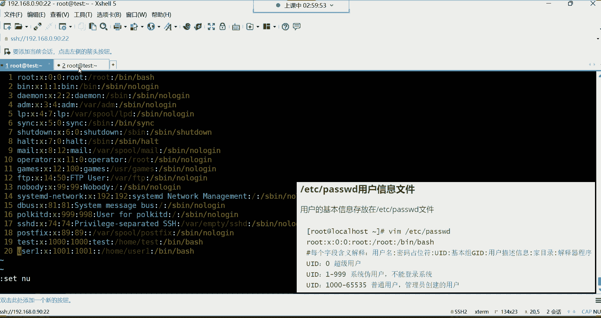

什么叫解释命令的呢，给大家讲讲哈，解释命令的东西，它叫解释器啊，叫解释器哈，在这儿，首先呢我们先说一说啊，对于这个计算机来讲，我们说计算机只认识这种二进制语言，也就是这个0101这些二进制是吧。

然后我们在跟计算机打交道的时候，我们敲的都是命令，你看我们敲的哪些命令啊，什么LS是吧，cat之类的，CD这些命令等等等，但是最终计算机他不认识我们敲的这些命令的，这就等于什么呢，这就等于说啊。

我们一个中国人在跟老外对话，你发现你们两个呀语言不通，是不是啊，哎就我们敲的这些命令，你们可以把它理解成是中文，而老外呢他不认识中文，他只认识英语，那怎么办，你还想跟他交流，我们一般会干嘛呀。

找个翻译是不是啊，唉翻译呢在这给你翻译一下，你说完以后呢，让你翻译翻译一遍，翻译给这个老外听，老外就懂了是吧，而计算机也一样，其实计算机压根也不认识，我们敲的所有的命令的，只要这些命令他都不认识。

那怎么样，那为什么我跳到命令计算机，他知道我要干什么呢，最终还得经过一个叫shell这么一个解释器的东西，注意啊，叫BH解释器，这个程序呢是一个解释器，程序是一个解释器，这个程序就是解释命令的一个程序。

然后呢，它可以把我们用户的命令给他，翻译成计算机认识的那个什么那个二进制啊，翻译给计算机的内核听，然后内核呢再去控制硬件，是这个意思，哈哈是这个意思啊，所以这个解释器呢我们默认用的解释器。

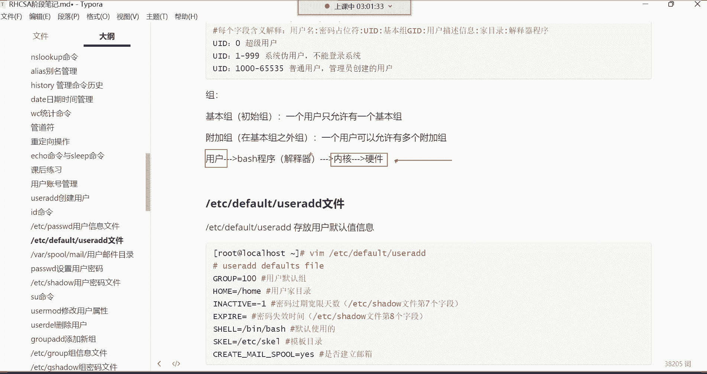

注意是系统自动分配的。

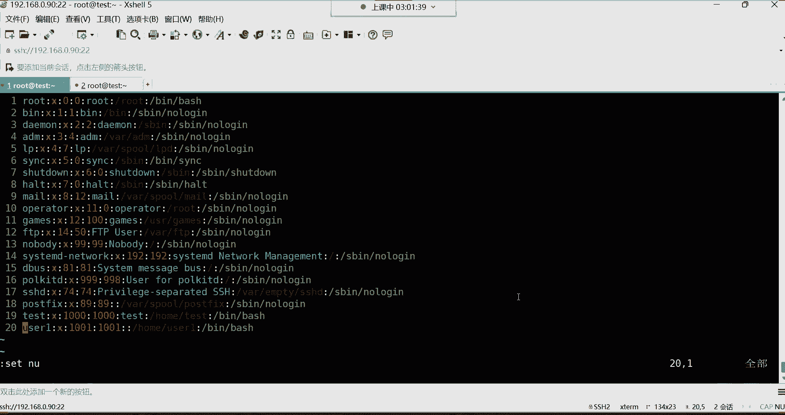

这个batch叫标准的解释器，什么叫标准的呢啊因为解释器有很多哈，在哪放着，在etc下面有个SHELES这个文件，这个文件大家不用记哈，知道就行了吗，在这个文件里面放着我们当前的系统的解释器。

程序都有哪些，有SH，而这个SH是最早期的一个解释器，非常非常古老的，现在在那个UNEX那个系统里面，仍然在使用这个S是作为这个UNEX的解释器，帮UNEX系统去解释命令的。

而现在呢我们用的是LINUX是吧，这个解释器解释的命令，而我们现在登录系统所看到的这个终端，注意哈，终端就是BH给我们提供的，那你说我想看SH解释器的风格，每个解释器风格不一样哈。

你可以这样直接并一下的SH回车，我们我们现在就切换到SH这个解释器了，注意啊，现在就是SH解释器的风格，你敲敲命令XX根，看到了吗，这就是SH的风格，你发现跟BH好像确实不太一样。

而且你看batch呢我们用多了，用习惯以后呢，可以看到我们当前登录系统的用户是吧，当前的主机名，当前的所在位置是不是，但这个SH呢一般呢你切换路径他也不告诉你，你看到了吗，不显示。

总之呢就是这么一个解释器的风格，非常的简约低调，看到了吧啊就这样哈，但是你敲命令呢没有啊，它可以正常帮你解释，因为你想它毕竟叫解释器，是不是毕竟叫解释器，只要是解释器，它就肯定具备解释命令的功能。

所以说呢但是它解释命令归解释命令，就是有的时候可能说我们觉得它不是很好用，这玩意你怎么去理解，你就理解成这样，可能说都叫车，但是呢这个长安跟宝马都叫车，是不是，但是可能说你开惯了宝马，你再去开长安。

你发现就感觉从各个方面来讲都不是很舒服，其实就这意思就这个意思哈，所以SH这个解释器呢，就是一个非常简陋的解释器，X的退出啊，退出这个解释器哈，又回到了我们这个半设解释器，好，我们用习惯这个了。

嗯呵呵换个标是吧，哎所以说其实这个解释器不同，解释器有不同的风格哈，然后下面这两个呢是它的一个什么呢，就是你看闭幕下面不都是快捷方式吗，不都是链接吗，而这是他真正指向的这个什么呢，真正的源文件哈。

真的源文件嗯，这就是我们所说的这个解释器啊，标准的就是这个batch解释器，当然解释器除了batch以外，还有很多的，你像cs HT c s h z s h k s h非常多。

嗯那这么多解释器呢怎么说呢，那像红帽子系统默认使用的就是这个batch，你可以把它理解成就是这个batch，是融汇了大部分解释器的优势于一身的，一个标准解释器，嗯而有的企而有的解释器像这种KSH。

像KSH，这都是需要花钱的解释器，而这个不需要花钱哈，嗯下面两个是路径嘛，对下面两个就是这他们都一样，这不在B目录下面，咱们说并不是一个链接文件吗，在bin目录下面，所有的东西都从哪链接过来的呀。

都是从这个user been链接过来的啊，都是从USB链接过来的，你看根目录下边，那等会你看根目录这个bin，这个bin目录本身就是一个链接文件嘛，是吧，哈喽哈喽张地看到详细信息。

你看它真正的原文件不都是对应的是user been，下面吗，是不是user been，所以说你看这个在B下的SH，其实对应的就是user并下的SH都是一个东西哈。

然后在并下的batch对应的就是user，并下的BT都是一个东西，好这是解释器程序给大家说清楚了是吧，所以说呢默认哈我们这个用户使用的解释器，B下的batch并论计数器好了。

但是呢还有一个比较特殊的解释器，我们看这个哈，在SB下面有一个叫NO log in的进器，你看你看这些用户怎么都是S并行的，NO log in呢，我告诉你这个解释器功能啊，还有什么什么SYNC是吧。

你看这个什么SYNC这些解释器，我跟你讲，这些解释器都是不允许用户登录系统的，就是他们是不具备解释命令的功能的，知道吧，就包括这些哈，什么shut down，他们是不具备解释命令的功能。

他们具备什么功能呢，他们具备就是叫禁止用户登录系统哎，但这个sat down具备解释命令功能，它解释哪个命令叫shutdown，这条命令就关机的命令，你在一敲这条命令的时候，注意哈。

他就帮你通过这个解释器去解释这条命令，帮你去关机了好吧，而这个NO log in呢是我们要给大家强调一下，这个叫禁止用户登录系统的一个解释器，就是它不具备解释命令的功能啊，不解释命令。

所以说呢你看像这些我们说叫伪用户啊，就是前面不能登录系统的用户，你看他们的解释都是这个NO log in存在，但是不能登录系统，是因为这个解释器的原因啊，而这个解释器是可以正常登录系统。

正常去帮你解释命令的。

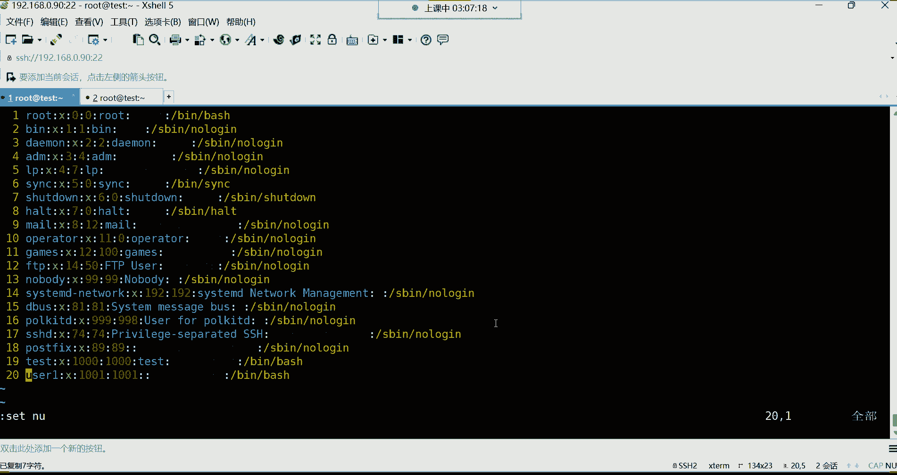

那这个文件介绍好了是吧，介绍清楚了，那介绍完了之后呢，嗯下边呢我们再来说一说，改成半式，改成改成半日就可以登录了，哈哈就可以了哈，然后接下来呢我们在干嘛呢，再来啊，给大家说说一个UI的这条命令。

说一说哈啊，UCI的这条命令，有些选项我们并没有给大家讲是不是，然后把选项给大家说一说哈，啊前面创建用户的时候就直接UI的，然后呢跟上的是用户名，那现在呢咱们说这个选项啊。

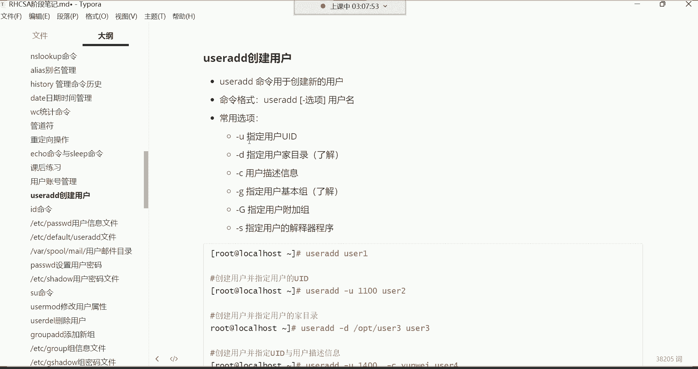

选项都有哪些呢，非常多非常多哈。

我们来看这一个一个的选项吧，第一个叫杠U这个选项就是杠U，这个选项是用来指定用户的UID的，就是我们前面创建一个用户，你发现我们这个用户啊，你看他的UID是系统自动分配的是吧。

像这些普通用户呢都是从1000往上，系统会自动分配，那我现在比如说我想创建一个用户，我想自己手动去指定他的UID，比如我想给他指定多少呢，6666可以吗，可以啊，因为这个UID最多可以存在多少呢。

叫6万5535个呢，我现在想创建一个用户，我想指定他的UID是6666，因为因为在这个文件里面没有，我可以随便指，只要没有，我就可以随便用哈，那这时候怎么办呢，哎我不想让系统给我自动分配了，那就这样。

UI的杠U指定6666，后面跟着用户名，比如叫U4级的U46回车车建好了，而这个选项没有烟高倍数要求，你比如再建一个用户USI的先指定用户名，比如叫U47，而我指定他的UID叫7777回车啊。

杠优杠U回车可不可以呢，可以然后咱们打开那个pass wd文件，你看一下哈，这个U46跟U47，你看他两个UID是不是都是变成了，我自己手动指定的了呀，6666，还有7777，没错吧啊这没有任何问题。

手动指定他的UID，而且这个选项呢也没有一个严格的位置要求，你放前面，放后面的都不影响都不影响哈，OK这是手动指定用户的UID了，但这种需求呢也比较少见，比较少见哈。

一般我们也很少会去指定用户的UID的，因为这种UID就是系统呢，它是以此类推是吧，你现在用户的UI，比如说最大的是1000，那以后呢再创建用户就是1001，然后再出现用户呢就1002，1002上。

然后再穿用户就是1003，我们一般也不会去随便去改变它的UID，而且这UID，我们现在最高给它改成7777了，那以后你再建用户注意哈，呃可以直接VM可以啊，可以没有任何问题，我们可以直接VM是吧。

在这个嗯他们打开这个文件，我们打开文件，我们可直接在这个文件里面改，比如把这个他的UID给它改成多少呢，我们直接给他改成，比如说1234，可不可以组id也给它改成1234。

然后下面这个给他给他改成多少呢，比如说这个1002，这个呢也是10021002，然后保存退出，WQ保存退出了就可以啊，也可以改，没有任何问题，是改完以后你说我怎么看呢，然后有一条命令叫id命令。

id用户名，比如优色六回车，看到了就直接变成1234了哈，1234。

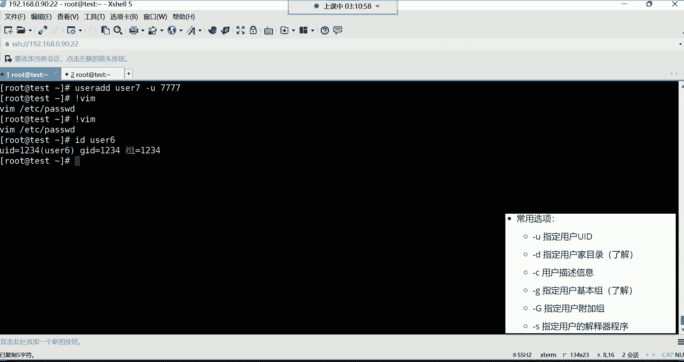

然后D命令给大家讲讲，D命令是看组信息的id，这个id命令用于查看系统，用户和用户所在的组的信息。

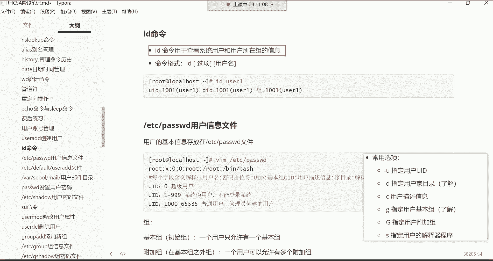

就是它主要是看组的信息的，所以这条命令呢它可以显示一个用户的，那首先呢有用户名字看到吗，然后以及这个用户对应的UID是多少，然后呢还有这个用户的组id啊，就这个g id叫组id哈。

然后呢这个用户总共属于多少个组，总共有多少个组啊，但是你发现这个阻碍地有些不太对劲哈，这个主题怎么直接变成1234，本作没有组名啊，没有组名是吧，其实这种就不是怎么说呢，直接通过VM改的话呢。

你得需要精力重启，得需要经历一个重启哈，因为这个阻碍的当初建的时候，它有一个文件存着呢，在哪个文件呢啊，etc有个group这个文件，这个文件里面去找那个UC几啊，你看UC6跟USG。

你发现这个文件并没有变，看到吗，这个文件里的信息你有没有看到U46，这是用户名啊，这是他们的组id啊，我们后面也会讲这个文件的哈，你看这个文件它并没有发生真正的改变，所以如果你还想让他真正改变的话。

你这文件也得改改，这个文件就有些麻烦了，多少呢，1234是吧，然后10021002保存退出，就是你的IDUS6啊，这时候就可以了，组名也出来了啊，这是它的组id，就比较麻烦一些哈，比较麻烦好。

然后这是用户总共属于多少个组，注意这后面是用户总共属于多少个组啊，因为这个第一个是自己的初始组，那后面呢比如我再给它加入到了什么这个组，那个组的什么运维组是吧，又给他加到开发组。

又加入到测试组等等等等哈，好这是ID命令，所以说呢我们一般改很少会通过VM，去在文件里面直接改哈，很少直接通过命令去改好，这是指定用户的UID，这个UID呢一般如果需要的话。

你可以直接通过杠U就可以指定了，然后杠D指定用户的加目录，这加目录的话呢，每个用户的家在哪放着呢，我们说用户的加，一般都是在这个根下的home下边是吧，你建一个用户呢，系统就会把这个用户的加给它。

放到这个home里边了，跟用户名同名，然后有的时候我想创建一个用户，我不希望它的加载home下面怎么办呢，啊那这时候你就可以手动去指定了UI，我通过杠D这个选项，当然选项没有前后的要求哈。

对root可以改行，别的用户改不了的哈，呃比如说我现在希望他的家在哪呢，在这个根下边让它叫US3啊，注意啊，这个U43目录不存在的哈，不存在不存在会自动创建的好，指定到U43这个目录。

然后用户名叫什么呢，用户名也让它叫U43吧，啊当然这个东西不一定非得都叫同一个名字哈，但是我们一般都不都是为了见名之意嘛是吧，都是给它取同一个名字，用户叫U43，它的家呢也叫US3。

然后回车就是你看一下你的根目录，就多出来了一个US3的目录，看到了吗，这就是以后就作为他的家了，他的家，但是呢我后面写了一个叫了解什么意思，就是我们很少去改变一个用户的家目录，为什么呀，因为你看系统。

它这个机制给你准备的，就是所有的用户的家都在home里边，那以后呢我在管理这个系统的时候，其实就可以实现一个所有普通用户的家，目录的统一管理啊，叫统一管理哈，所以一般很少去改变一个用户的家，能理解吧。

这是用户的家目录，然后呢知道一下就行哈，这种需求一般没有没有哈，然后杠C叫用户的描述信息，描述信息什么意思呢，就是那个备注哈，我们前面进了所有用户，你们看一下etc下的pass w d。

每个用户他有描述信息吗，并没有看到了吗，并没有，都是空的吧是吧，那我想建一个用户，我也想我也想给他加一个备注，可不可以好可以，这时候你就UZI的杠C指定描述信息。

比如这个人是哪个部门的运维部门的电话号码，比如说他的电话或联系方式，叉叉艾特163点com，这是他的优先哈，然后用户名叫U4几呢，就是在嗯叫US2吧，然后如果你还需要指定它的什么UID。

你就后面继续指啊，比如UID是多少呢，比如说等等等等啊，随便想指想怎么整就可以哈，都不影响这个选项可以同时使用的，ok test为啥有啊，test是我们安装系统的时候创建的一个用户，然US2。

这时候我们在干嘛，再打开这个文件再看一下，那你看他的这个什么呢啊，描述信息诶诶等等等等，杠CUUSI的杠C，U s2，啊这呢这呢在这哈看到了U2这个用户，你看他又多了一个描述信息，在这呢是吧。

所以说这个描述信息就不是什么重要的内容哈，不是什么重要内容，你可以写也可以不写，OK就像我们生活中是吧，加个好友给他添个备注一样，其实就这意思，Ok，然后还有一个小写的G叫指定用户的基本组啊。

这个一般我们不会去改变一个用户的基本组啊，所以这个选项呢大家也不用去练习了，几乎没有这种需求，没有需求，然后如果你想改也行，比如说嗯我想改变一个用户的基本组，你可以建一个用户，可以建一个组哈。

而这个命令我们我们后面也会讲的哈，但是现在先知道一下叫创建组的命令，我建一个组，这个组叫什么组呢，比如让它叫叫什么组呢，叫ABC吧，随便哈，A b c，而这会儿再建一个用户UZI的杠。

小写的G指定组名叫ABC用户名呢，比如叫US4回车，那就是我们DUS4的时候，你看UC4的组就不是跟用户名同名了，而是什么呢，而是叫ABC了，这指定了用户的基本组，但是我们一般不会去改变用户的基本组织。

因为基本组是与生俱来的，我们是不会去动它的哈，我们一般会让它会动它的附加组，附加组哈，就是我们这个服务器可能有很多的组，我们建几个哈，建一个运维组，再建一个开发组，拼音哈，用拼音来代表开发，然后测试嗯。

然后呢这三个组有了以后呢，我再建一个用户，USI的，我可以用大写的G指定，我要把这个用户即加入到运维组，逗号隔开，又加入到开发组，逗号隔开，又加入到测试组，用户名叫U45，回撤id优秀，看到了吗。

那这时候你看US5，他总共属于多少个组啊，除了自己的基本组以外，然后还属于什么呢，还属于运维组，开发组，测试组是不是唉这就是富家族了，这叫富家族哈，然后以后呢，这个用户会继承这三个组对文件的权限的。

但我会后我们后面讲再讲权限的时候啊，然后我们再讲归属关系的时候，怎么改一个文件的归属关系，那我们后面再去带，带领大家去详细去说这种东西怎么改啊，你先有个印象，一个用户可以同时加入到很多组里面。

所以这个组呢就叫做附加组，怎么加入呢，更大写的G，然后还有一个杠S指定用户的解释器解释器，比如我现在想建一个用户，我也不想让他登录系统了，那我就杠S指定指向为，指向为叫SB下的NO log in。

这个解释器用户名让他叫US6回车啊，已经存在了是吧，U色七回车也存在了，U48回车好，那我们再打开etc下的pass w d文件，那以后这个user8这个用户，它的解释器变成一个NO log in了。

那它无法登录系统了，以后就啊这就是所谓的长的选项，然后这里面有两个是大家不需要掌握的哈，这两个这两个不需要掌握哈，其实在这里面大多数的选项，不需要去背它，还是那句话，不需要去背它，为什么呢。

因为这个这些选项用的不多，这些选项用的特别少，所以什么时候用的记不住的，可以去搜一搜，查一查啊，这种基这种基本的东西记不住的时候看看笔记，网上百度一搜就出来了，多的是哈，所以也没有太大的必要。

去把时间浪费在这个方面，因为这种东西确实不是很常用好，那以上就是这个USI的这条命令的，常用选项好了，那你当我们经过一顿操作是吧，然后这所有的选项可以结合到一起哈。

比如说我指定用户的解释器是bin下的SH，然后再杠U指定它的UID是比如多少呢，这个2345，然后再指定他的描述信息，描述信息，比如说这个人是这个开发部门的联系方式。

a b c at163点com瞎写瞎写，然后呢还有什么呢，还有这个人的嗯，我想想哈行了，就只这些吧，再再给它加入到一个附加组里面，加入到运维组，加入到开发组，加入到测试组，用户名叫UC100，呵呵啊。

创建好了是吧，创建好之后呢，然后我们再看这个文件，你看UC100这个用户是吧，它的id号是2345，描述信息是吧，然后解释器这都没有任何问题啊，可以放到一起去使用的好嗯。

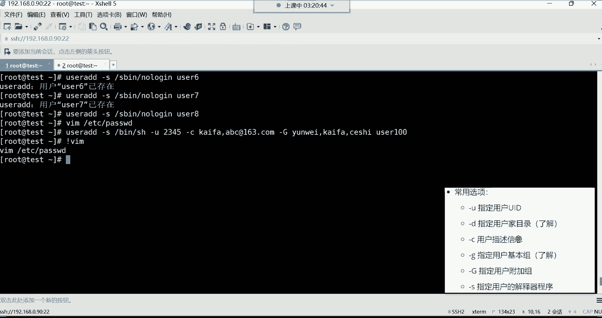

这是UCI的一条命令，然后那今天就讲这么多吧好吧，对于用户账号管理呢，给大家讲了UI的以及这条命的一些常用的选项，然后这里面呢大家就是敲敲两遍，熟悉熟悉就行了，没有必要去非得把这个选项给它背下来哈。

没有必要我们我我们今天讲的内容呢，大家需要我我看看，我给你们总结一下哈，我们今天讲的内容，对这个文件每每每一列的信息，大家也要记下来哈，因为这个文件怎么说呢，这个文件后期会频繁的用的，会频繁的用啊。

所以对这个文件每一列的信息呢大家得知道，因为总共就七列，每一列是什么，是不是你就说白了没事看一看，没事看一看，然后剩下的WC啊，WC命令呢也是后边会频繁用到的命令，管道符也会频繁频繁用到重定向。

那重定向的话，大家只需要记哪个重定向呢啊，输出重定向就可以了，然后呢还有这些只收集这个错误的输出的，还有这个收集证啊，反正这个除了输入以外吧，除了这个输入不常用的话，其实别的都比较常用，能理解吧。

就除了这个不太常用以外，其他都比较常用一些，然后管道服这三个都是比较常用的，而且echo sleep后边也比较常用，然后USI的命令呢只需要记住一个命令就行了，然后D命令啊，这熟悉一下就行。

看组的信息的，其他的话呢像history alex这些都不是很常用的命令哈，所以像这些的话呢，大家没有必要去深入去研究它了，这些呢我框起来的哈，用粉色框起来的，大家就熟悉熟悉就行哈。

然后红色框起来的这个就着重去多练一练，OK吧啊脑袋嗡嗡的是吧，可以理解可以理解哈，可以理解哈哈脑袋嗡嗡的慢慢练啊，这种东西慢慢练吧，我刚开始都是练过来的，我也一样，我刚开始脑瓜也嗡嗡的。

就是我刚开始的状态可能跟你们是一模一样的，就是我前脚刚学完，后脚你再去让我去回忆诶，刚刚老师讲什么了呀，你发现我的脑子里一片空白，回忆不起来，你们现在也是这个状态，那如果我现在注意注意啊。

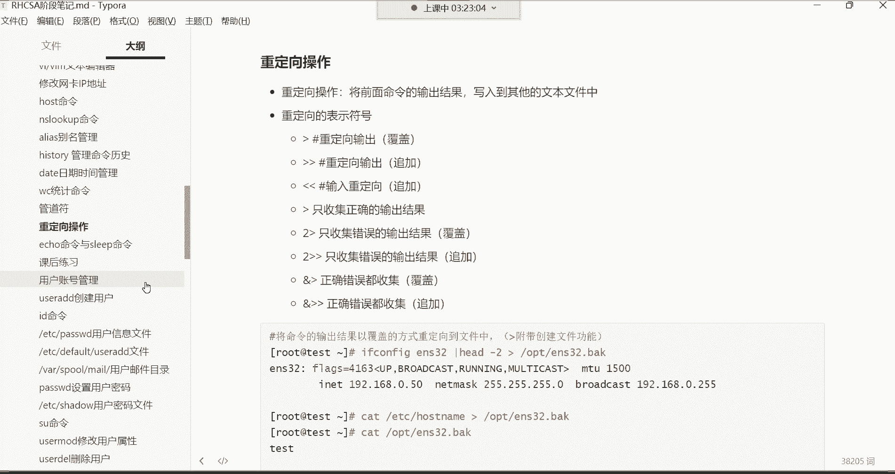

我现在就是把这个笔记关掉，然后我让你们回忆一下。

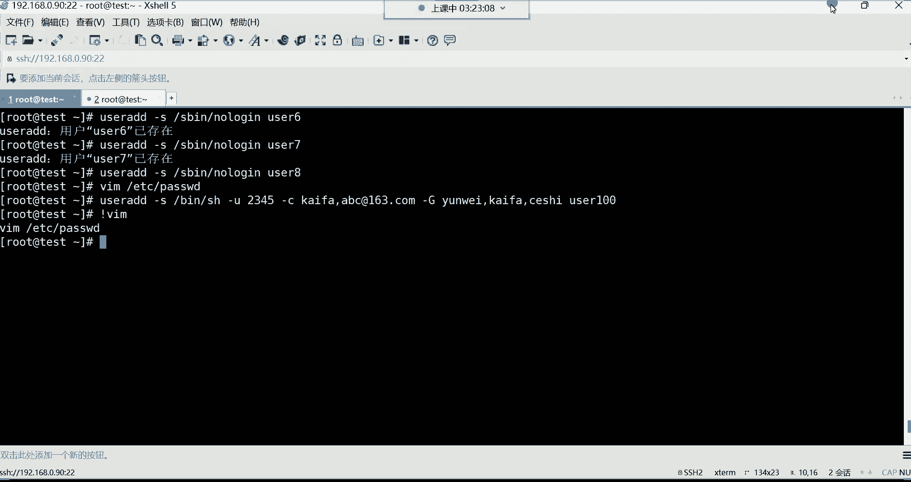

我说我说哎咱们今天这节课讲了哪些东西啊，你们你们可能再过一会儿抽根烟的时间，你自己脑子就一片空白了，你就想不起来了，这不是刚开始都这样哈，刚开始都这样，所以你走吧呢，多敲多练。

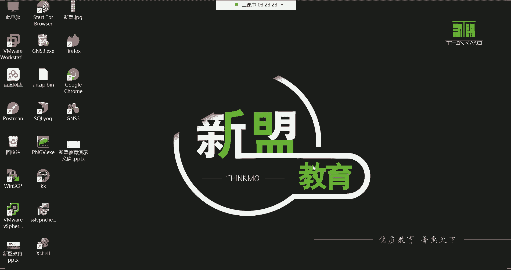

没事的看一看，把这东西给它导成一个PDF啊，我我不是给你们发了一个PDF格式的吗，是不是到时候把那个PDF放到手机里边，然后他没事扒拉出来看一看，看一看就可以了，好吧没事就扫一扫，注意哈。

我给你们看的时候，你们就扫一扫，扫一扫，看看这个目录就行了，大体了解这个命令具体的详细操作，说白了哎呀什么时候用，什么时候再去深入研究它们，百度一下不都是吗，就刚开始也是刚开始会的都不多。

我也不是天生就会这东西的，都得慢慢学，哈哈哈好了。

