# 零基础入门Linux，红帽认证全套教程！Linux运维工程师的升职加薪宝典！RHCSA+RHCE+中级运维+云计算课程大合集！ - P18：红帽RHCSA-18.chmod权限管理 - 广厦千万- - BV1ns4y1r7A2

诶，开始讲课了。嗯，我们这个休息的时间有些长了哈，就超过2分钟了。😊，咱们继续哈都回来了吗？回来的话，赶紧给我刷波一，我们得继续了啊。😊，H。对，平时这个注意点身体。咱们讲讲这个什么，接下该讲权限了。

讲完权限以后呢，大家就会对前面的这个我们讲的用户管理以及这个组的相关概念呢，就会有一个更加怎么说呢？更加深的一个体会啊，或者说更加理解我们前面讲的那些操作了。权限啊，为什么要为什么要讲这个权限呢？

因为我们学习权限，就是为了控制我们前面在系统里面创建的那些用户。😊，对我于我们系统里的那些文件可以做哪些操作？而这个权限呢，也就是严格把控着咱们系统里面的众多的文件的啊。

规定这个文件到底你能不能读能不能对这个文件进行一个增删改查。其实这就是权限啊，因为这个系统的特点就是一切件文件。所以说呢我们学习权限，就是学习这个怎么去控制用户对于文件的相关的管理。好。

那我们先来说一说这个。先给大家讲讲这个归属关系哈，归属关系前面我们已经简单介绍过。那这个时候呢我们再再去复习一下归属关系里面有三类，注意哈有三类呃所有者所有组跟其他人。😊，呃，这个优呢就是us。

就是用户的意思。代表是所有者记呢就是。Gro。组的意思O呢。就是other，其他的意思就是分别是用首字母UGO来表示所有者所有组跟其他人的。而这个所有者是代表什么呢？是代表一个文件。或目录的拥有者。

一般谁创建的？比如说我这个用root在系统里面建了一个文件，那这个文件就属于root的。

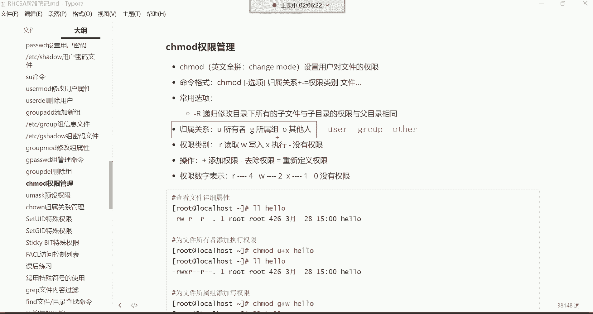

那么这样哈。

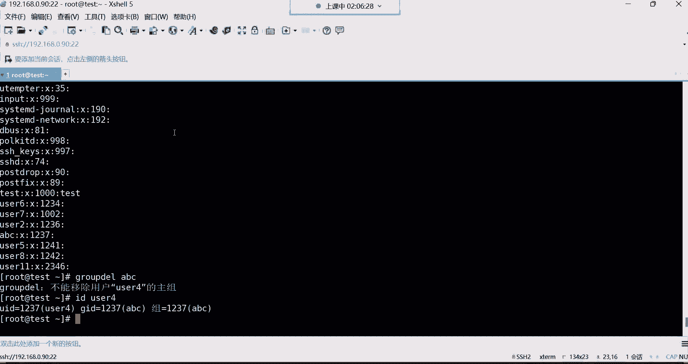

我们进到哪个目录呢？咱们进到这个。那么CD到OPT然后呢把这个目录给它清空一下。星清空所有清空当前目录所有哈。然后呢，我们建个文件touch，我们建一个hello。😊，第儿PAAT好，建好了。

建好之后呢，咱们。😊，来看一下这个文件。这个文件的属性大家来看一下哈。😊，呃，这一部分代表是权限哈。然后呢，最左侧代表是文件的类型。这个我们在第一天其实就给大家讲过，可能有的同学已经忘了文件的类型。😊。

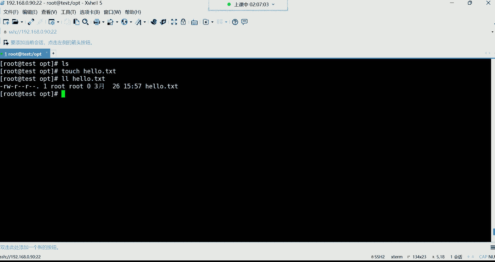

文件类型是不分为这个文件目录，还有链接文件等等等等啊。然后呢，小横杠开头的代表这个东西就是一个文件。所以我们现在来看这个文件的属性的时候，这个小横杠代表它的类型是文件类型的。因为文件有多种类型嘛。

有这个视频类型的，有音频类型的图片类型的动图类型的等等等等。而它就是一个普通的文本文件。😊。

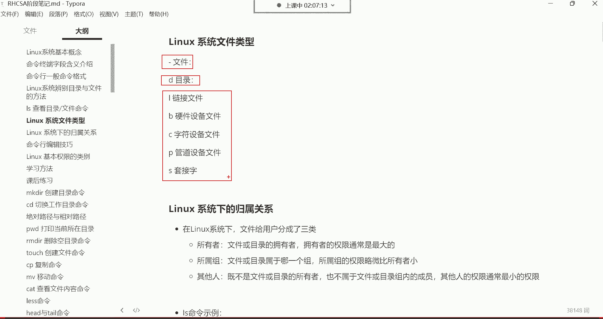

然后这一步呢是权限，然后呢。这个root代表是这个文件的所有者。所有者就root创建的一般就是属于root，然后搜索组就是属于root的基本组默认情况下哈。😊。

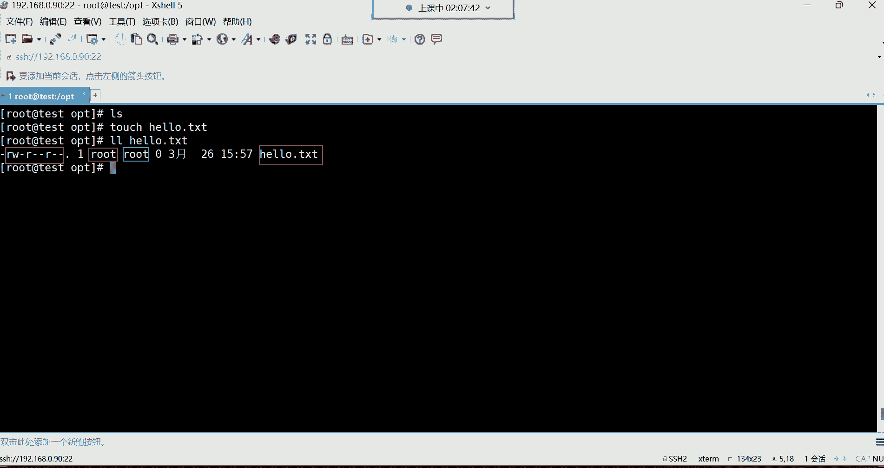

好，这是。我们对这个归属关系啊，这个所有者所有组呢给大家做了一个介绍。但是呢还有什么呢？还有什么呢？就是那个。😊，等一下哈，这个。

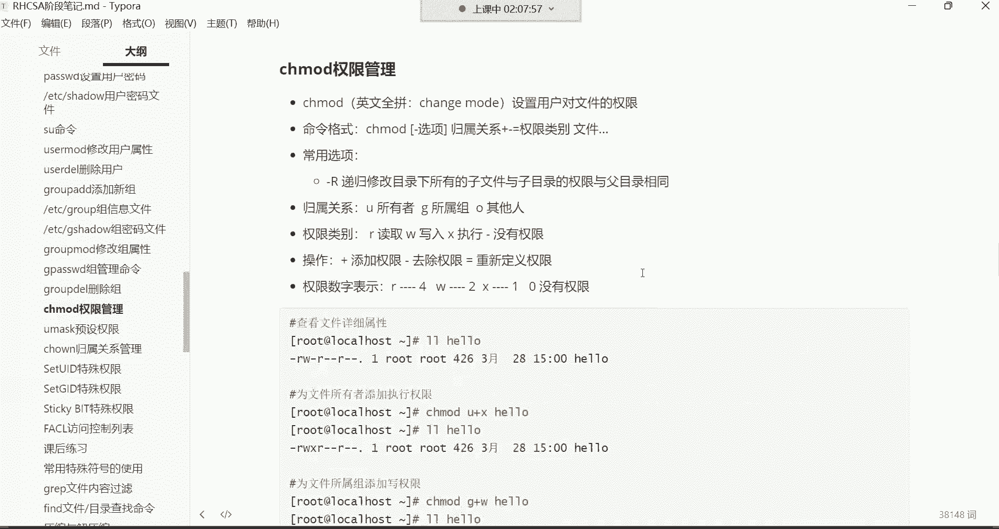

就是这个其他人。什么叫其他人呢？😡，我们系统里面是不是有很多用户啊？

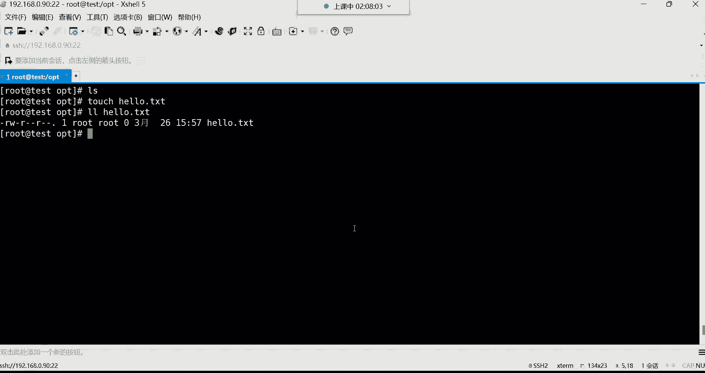

咱们看ETC下的passWT的文件，是不是有非常多的用户啊？那我告诉你。在这个文件里边的那么多的用户。咱们就拿这个优色6来说啊，什么优色6优色7这些用户来讲哈，这些用户这些用户就属于。😊。

对于这个文件的关系，就是其他人的关系。因为什么呢？因为这些用户他既不是文件的拥有者，因为文件的拥有者是root。😡，是文这是这个文件是root创建的。而这些用户呢，也并不是这个文件的。组内的成员。

因为对于root这个组，我们并没有往里面添加过成员，所以这里面也没有成员。😡，那什么叫其他人呢？other。😡，嗯。什么叫其他人呢？就是他既不是所有者，也不属于我这个文件的组内的成员。

这个就被归类到其他人了。😡，那这就是三类归属关系。然后呢，我们在学习权限的时候，其实就是控制这个文件的所有者，还有所属组，还有其他人这三类用户对这个文件件可以具备哪些权限？好。

那这个权限这个RW杠R杠杠什么代表什么意思呢？这个权限呢？😊。

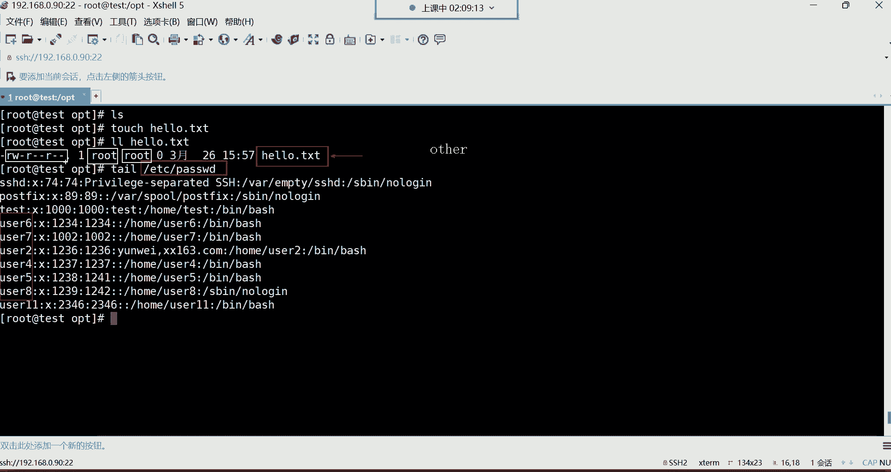

就是我现在要给大家讲解的叫做基本权限了啊，然后咱们把这个图呢给他呢截截个图过来。😊。

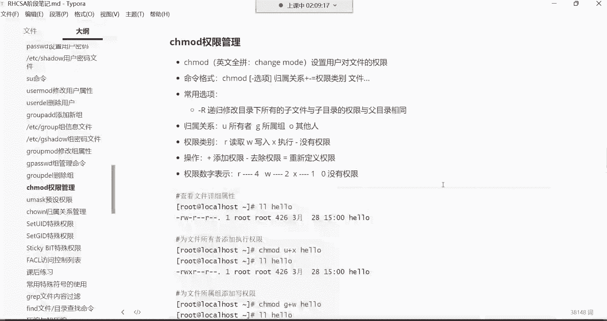

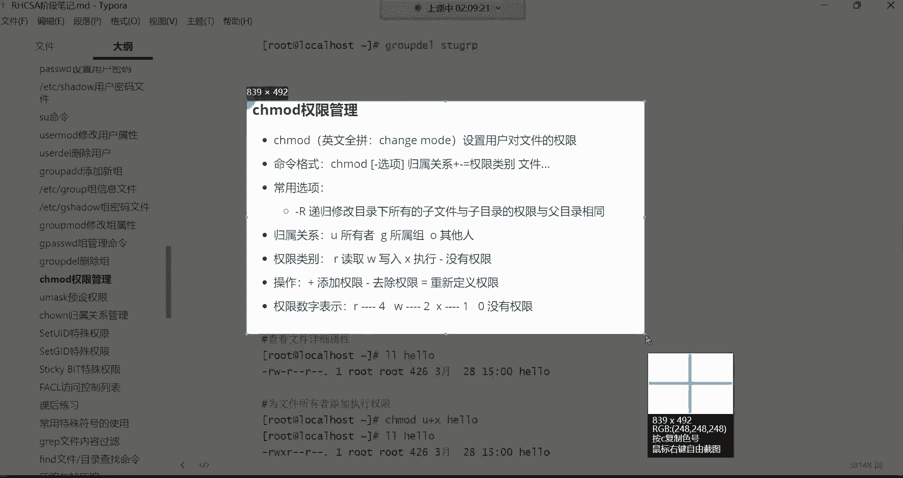

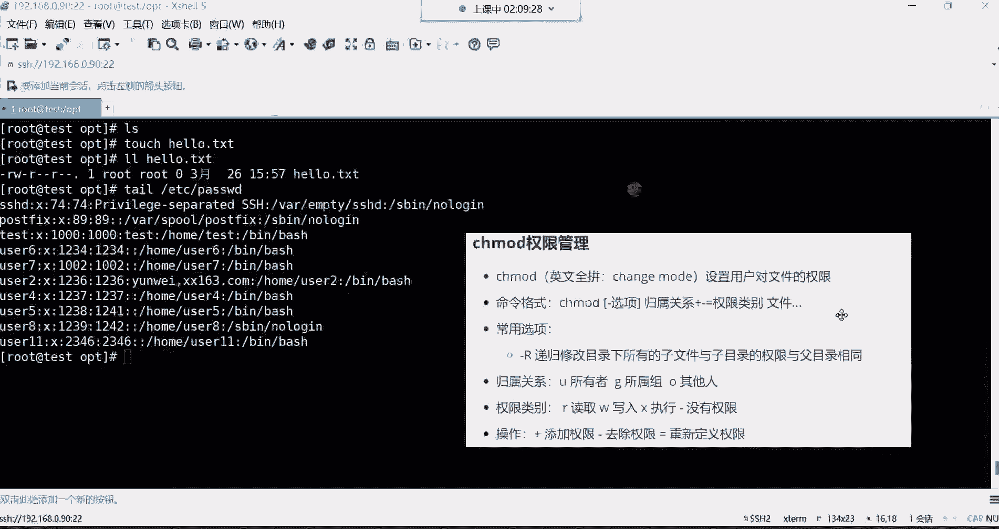

这叫基本权限。好。这个基本权限呢，我们得拿这个文件来说。基本权限呢分为什么呢？分为这个。😊，读写跟执行在这呢，我们叫权限的类别里边分为读写，还有执行横杠代表没有权限。那这个怎么看呢？注意哈。

任何的文件或者说是目录。它的权限位总共是分为9个字段，注意哈，这是9个字段。然后这9个字段是每三个字段为一组，来，我给大家划清画清一个界线，每三个字段为一组。😊，看到了吗？这三个字段，这三个字符哈。

每三个字符为一组。😊，然后呢，这。最左侧这三个字符，我先框起来，每三个字符为一组啊，这中间这三个字符好，框好了然后最右边。这三个字符。在这儿。好，OK来看哈，总共是9个字符，每三个字符为一组。

然后它最左侧的这个。😊，黄色的框里边的这三个字符代表是文件的。所有者。对于这个文件的权限都有哪些？中间这个绿色的框里边的那三个字符是代表这个文件的所属组。对于这个文件的权限都有哪些？

然后在这个橙色的框里边的。这个代表是谁呢？是我系统里面的众多的其他用户，什么优色一啊等等等等。优色2以此类推，这些其他用户对这个文件的权限是一个什么样的权限？好，这是总共9个字符是吧？

然后现在呢大家能够清楚的看出来，所有者的权限是在做最左侧这三个字符，然后所有组的权限是在中间这三个字符，其他人的权限是在最右侧这三个字符。那我们现在怎么解读呢？我先给大家讲讲这个权限哈，权限的顺序。😊。

权限的顺序呢，如果这个文件的所有者对于这个文件来讲，它具备的权限是什么权限呢？如果是一个读写执行的权限，那它的顺序应该是量子，叫RWX。如果所属组对这个文件的权限也是具备读写执行的话。

那它的权限应该是什么呢？也是RWX。RWX啊，这个往上一点啊。也是RWX。好，那如果是其他人呢，其他人他的权限呢其实也是一样啊，也是RWX。一个意思哈，RWS这叫权限的顺序。😊，那咱们现在就解读。

那所有者对这个文件的权限到底是什么权限。来看一下。首先给大家讲R在这哈，R代表是读取。😊，读取就是说。可以查看这个文件里的内容。好，那现在root。root哈作为这个文件的所有者。

他首先是具备一个R这个权限的，应该能看清是吧？像这R在这呢哈R权限就他可以查看这个文件里的内容。😊，那W呢在这儿代表是写这个写的话呢，它是具备什么操作呢？叫增删改的操作。啊，我们统称为写。

就是如果一旦具备这个W写权限，那root它是不是也具备啊？你看因为它这里面有个Wroot对于这个文件是可以进行什么操作呢？比如说我往文件里面增加内容，我往这个文件里面修改啊，我修改里边原有的内容。

或者说我删除文件里的内容都可以。啊，这种是具备一个增删改的操作。好，但是呢第三个字符你发现它是一个小横杠。这个小横杠代表是什么意思呢？这个小横杠代表的是没有权限。没有权限哈那现在问题来了。

他没有什么权限。😊，所以接下来呢我们就会涉及到叫权新的顺序。这个全新的顺序，它永远都是RWX。就如果说一个用户，比如说root，他对这个文件如果真的是具备读写执用权限，它顺序永远是R在最左侧。

W在中间X在最右侧。在这三个字符里面哈，这是它的一个顺序。😊，但是呢你看现在root它的这个什么呢？它的这个第三个权限位，第三个字符是小横杠表示的那我问一下大家，这第三个小横杠。😊，注意啊。

这第三个字符是小横杠，那代表小横代表没有哪个权限呢？😡，就代表没有这个权限。没有这个X权限。知道吧。如果有的话，就直接是X。如果没有的话，就是小横杠。就证明他没有这个执行权限，那他就无法运行这个文件。

好，这是所有者的权限的解读。然后所有组的权限，那我们再说这个所有组，那这时候应该就不难理解了。你看哈中间这三个字符R杠杠R呢就证明如果说这个root组里面有成员，我们后期是不是可以把用户加入到组里面呀？

😊，哪条命令呢？前面讲的那个叫GpassW杠A是不是杠A，然后呢，用户名，比如说us几usE给它加入到这个root组里边可以。那以后这个usCE是不是就属于root组了呀？

那以后这个root组里面是不是就有一个成员了呀？有个谁呢？有一个usCE，假设哈假设这里面就有了一个us色E了。好，有了us色E以后呢，那这个组对这个文件的权限是什么权限？UC一就会继承这个组的权限。

那这个组对这个文件什么权限呢？R杠杠R呢首先是具备读权限在这哈是具备读权限的，就是说在这个组里的成员是可以查看这个文件里的内容的，但是后边两个权限没有用杠表示的那就是没有什么呢？

没有读嘛没有这个写跟执行权限。😊，不是哈，那组不是超级组哈，这组没有办法代表超级用户的身份，能理解吧，他们没什么关系哈。😊，啊，然后这位置呢就是小横杠在哪个权限位，就证明它没有哪个权限。

OK那组里的成员没有写跟执行的权限了。然后下边这个。啊，最右侧这个其他人的权限，其他人也是R杠杠，就是其他人呢也是只读啊，没有写跟执行的权限。OK那这就是针对于这个。一个文件。他的三类用户啊。

所有者搜入组跟其他人。他们的一个具体的权限。的一个什么一个类别啊，就是RWS分别代表什么含义，以及我们怎么去辨别这三类用户的权限。这就是什么呢？这就是。叫U。G。O这三类用户的权限。

所有者所有组跟其他人的权限。好，OK好，那这个位置呢我们说完以后呢，接下来咱们得验证啊，我们得怎么验证呢？😊，咱们去单独创建一个目录嘛，别拿我们别拿这个OPT来演示了。我们看跟目录下面有没有。😊。

能我们自己建一个make DR，我们再跟一下创建一个test的测试目录，然后我们进到这个test里面去。进来之后呢，咱们在这里建个文件，touch一个hello好，这就是一个文件哈。helloO。😊。

这个文件建好以后呢，咱们接下来说说我要改它的权限怎么改。😊，啊，但是呢对于这个文件来讲，我们把这个组呢我们换一个组，让这个文件属于另外一个组。这样我们建一个运维组。group艾建一个运维啊。

运维正常来讲呢是叫。OPS啊OPS。O。然后呢，算了吧，我觉得还是拼音吧啊，不然你们无法理解，是不是啊，就运维吧，这样能看得懂是不是啊这样能看懂OPS啊这个OOPS可能不是很懂，是不是？😊，啊，运维嗯。

运维组。然后接下来呢，咱们不是有很多用户嘛，我我们见几个用户哈，我们。😊，U3的咱们。我们前面有很多用户，但是呢我觉得那用户们可以给他删掉了。删掉哈。Deele。呃。

operation啊operation就是这个云其实OPS是全名叫operation，然后我们简称叫。😊，这简简称叫运维哈第呃这个开发呢是DV啊，叫develop permitment啊。

简呃这代表是开发的意思。好的，咱咱们把这些都给它删掉，我们杠2什么优色11，还有优色4，还有优色5，还有优色6。啊，U色6不能删啊，优色7。啊，能删上啊，就组呢。组没删优色8都删掉了哈。

之后我们再看ho。😊，有是没有没有删掉吗？我看一下呃。并不属于UC6，所以不会删除并不属于UC6，所以不会删除哦，home下啊，不属于它是吧？那咱们直接这样上吧RM杠2F啊，把home下的。U色2删掉。

还有优色6删掉优色7删掉。因为用户已经不存在了。你看你IDU42哦U42也也存在。那就U42删掉删掉了哈。啊，再删掉优色6啊，优色6不存在了，优色7啊也不存在了OK。看一下根目录嗯，没有U32的加吧。

啊，没有OK删干净了哈，咱们建几个用户哈，我们然后拿这用户来给大家演示。😊，呃，我们us艾建一个什么呢？建一个汤姆吧啊，这个用户呢也会频繁会频繁出现在我们这个练习的。哼练习的环境当中，t姆用户。好。

那我们这个组的话呢，再建一个组。group艾啊，咱们有运维组了。那我现在GpassWD杠A，我现在要把这个tom用户加入到运维组里边。OK好，那现在这个组里边是不是有一个用户了呀？

我们看ETCgroup这个文件的时候。嗯，运维组里边多了一个汤姆这个成员。好，那接下来咱们干嘛呢？咱们对于这个hello这个文件来讲，我们改一下它的这个什么呢？所属组。这个组呢我不让它属于root组。

给它改成那个运维组。怎么改呢？

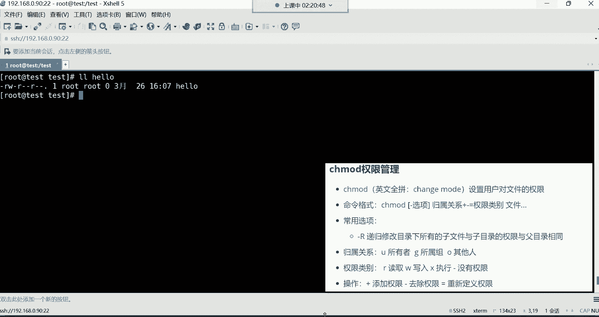

有一条命令，咱们提前给他讲了吧。叫做称至owner。

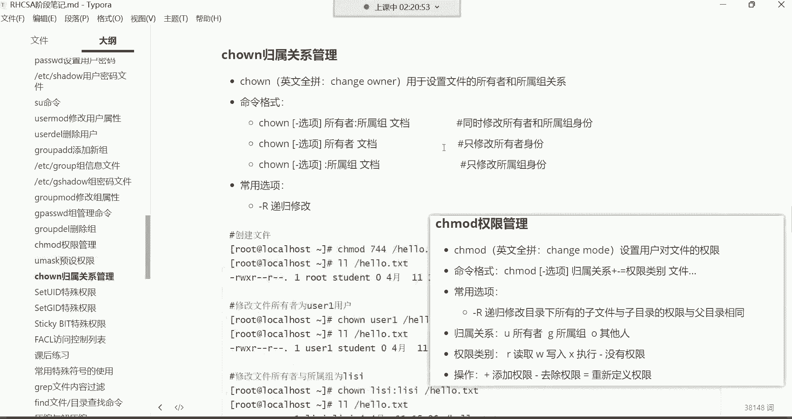

提前给他讲了吧哈。

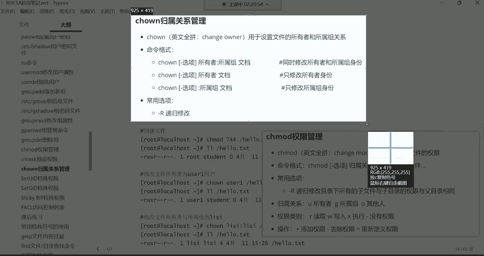

称着O呢这条命令呢是改归属关系的。就是我希望这个文件它的所有者是谁，所有组是谁，可以通过它去改啊。就是用于设置文件的所有者跟所有组的之间的关系。那命令格式呢有三种。第一种称之owner啊。

可以结合一个选项选项杠大R递归，我们一会儿再说，先不用去管这个选项，称之owner后边呢跟上所有者英文的冒号，所属组再跟文档，这叫同时修改文件的所属组啊，所有者跟所有组的身份。就拿这就拿这个文件来说。

我希望这个root这个文件啊，就这个hello这个文件不是root的嘛，是吧？我可以这样。😊，陈志欧呢，我希望他的所有者是汤姆英文 number号，所属组也属于汤姆的。初始组后面跟上hello。

就是你再看那个hello的文件，你发现他的所有者跟所有组球全都变成汤姆了，是不是啊？OK啊，这是改了归属关系。因为改完归属关系以后，权限就直接注意啊，这汤姆的权限就是所有者的权限了，能理解吧？

所有者权原先这个所有者是root。那root呢继承的权限是最左侧这三个权限位，嗯，称之owner。然后你第二种格式呢是这样的，我只改所有者，你看称之owner，我只改所有者哈。😊，那就这样，称之欧呢。

我希望所有者是root。啊，然后呢所有组我不想改了，那这时候就直接跟文件名回车。那这时候你再看那个hello这个文件，你发现哎啊所有者被我们改成root了，但所手组并没有变，是不是啊哎，没错啊。

就只改所有者的身份，他的风格就是指定所有者是谁就行了，后面跟文件名啊，不会像前面这样繁琐，还得英文的冒号，后面跟搜有组不用。但如果我只想改所有组呢。😊，那这时候呢就英文的冒号搜入组。

但是没有前面那个所有者。你比如说我现在这样。称着owner。啊，我现在要把这个文件的搜索组改成root的组。那这个时候呢或者说改成tt的组可不可以都可以哈啊然后这时候呢，我们后边跟上文件名回车。

这时候你再看这个文件的话。😊，你看这个文件就属于t的组了。能列吧？所以改所属组只改组的话，就英文的冒号，后边跟上组名。那咱们再给它改成汤姆，把这个组改成汤姆的组。这个哈汤姆跟上文件名回车。好。

这是我们再来看这个文件OK。😊，啊，那这时候就是什么呢？这时候就是。😊，怎么改变一个文件的所有者以及搜出组啊，三种命令格式。然杠大而叫递归。这个递归的话呢，如果你是针对一个目录的话，如果针对一个目录。

它会把这个目录下边所有的文件以及它的子目录。都什么呢？从头到尾给你改一变啊，这个就一般应应用的比较少一些啊，知道一下就行。好，那接下呢我们继续给大家讲这个权限。这个文件现在我们已经给它规划好了。

怎么规划好了呢？😊，文件的所有者是root。然后呢，所属组是汤姆，然后汤姆这个组里边有一个成员，这个成员。这成员呃啊不不，sorry哈，我改错了哈，我不应该改成汤姆，我应该改成什么呢？

我应该改成运维组哈。😊。

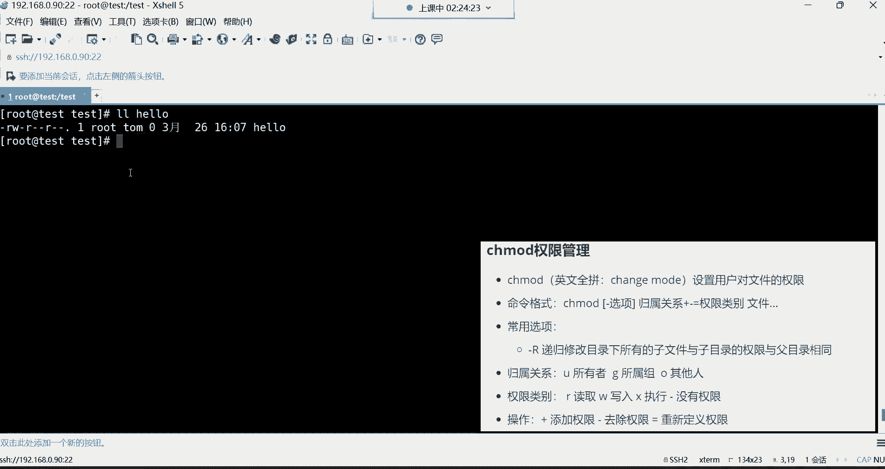

运维组。哎，这样就这样就对了哈，这样对了。那这个组呢属于运维组。然后这组里边有个成员，这个成员是谁呢？是汤姆，没错吧，哎，这时候就对了哈。OK好。

那接下来呢我们就可以来说一说我现在想对这个文件的所有者的权限，所有子的权限以及其他人的权限进行一个修改，怎么改。那这时候啊称着 mode这个命令可以改chan着 mode命令格式呢有些复杂了哈。

得先指定归属关系啊。比如说现在。😊，这个所有者呢没有那个X权限，没有那个执行权限。😡，那我现在想给他加一个执行，那就村支末的。你得指定归属关系哈，归属关系哪里呀，就这呢就这三类。

就是你指定一下到底要改谁的权限UGO。那我要改所有者的那就是优优，就是所有者。好，我要归属关系指定好了。那接下来呢那我要对这个所有者的权限进行怎么操作呀？所以接下来呢就操作加减等于号啊。

我们先说这个加减哈，加之添加权限，减是去除权限，这个比较好理解是吧？我要给这个所有者加一个什么权限呢？😊，我要给他加一个执行权限，因为它的因为它的执行权限位置是小横杠，它无法执行。

所以这时候你给他加一个X，那我就U加X，那这是什么呢？指定了归属关系。😊，是是谁呢？是这个U啊，所有者然后操作服呢我是用加号来指定的，我要给他添加一个权限。那什么权限呢？哎我要给他加一个X的执行权限。

最后指定文件名就可以了，叫U加S文件名。hello回撤，这时候我们再来看这个helo这个文件，你看是不是在所有者的这个权限位上面就变成RWX了呀。主要就是什么呢？主要就是这个横杠，它现在变成X了。

变成执行权限了。一旦变成执行权限。那这时候你可以怎么执行呢？点代表当前斜杠代表当前路径注意哈，点代表当前路径吧，斜杠代表当前路径下，我要执行这个文件回车，但是这这个文件里面什么都没有是吧？没关系。

咱们打开这个文件，打开文件以后呢，我们往里面写一句话。😊，icical一个hello。root。然后呢，保存退出。注意啊，我现在是把命令写到文件里面了。没关系，后边我们再讲设有脚本的时候。

我们再说这种操作。我是把ic这条命令，ic是不是输出啊，你ele什么都给你输出什么呀啊，那我就把icle放到文件里面了。然后呢，由于这个文件现在具备一个X的执行权限，那你就可以干嘛呀？点杠对吧当前路径。

我执行这个文件回车。😊，他就帮你去执行这个文件里的命令了。这边操作现在看不懂也没关系哈，我们就是为为了掩示这个执行权限，看到了吗？😊，有了直行权限，你就可以运行这个文件。好。

那这个时候我再把执行权限给它去除chan之 mode所有者减号代表去除去除什么权限呢？X去除执行权限，指定文件名回车。这时候你如果在点杠。😊，当前路径执行这个文件会车，你发现提示你权限不够了，你看了吗？

哎，这时候就告诉你权限不够了，为什么呢？因为你没有那个执行权限，我把那个执行权给他去掉了。😊，看到了吗？他这个执行权限为又变成一个小横杠。就是执行不了了。能理解吧？啊，这是我们所说的这个执行权限。

然后还有这个什么呢？还有这个W写权限，写权限就是决定说你能不能打开这文件往文件里面写内容。我我我们刚刚之所以能够把这句话写到这个文件里面，是因为我们具备这个W权限，能理解吗？具备W权限，所以。😊。

你现在如果把这个W权限给它去除的话，怎么称之 modeode。就U减W去除它的这个写入的权限的话，那这个时候。你看哈我们去除了是吧，然后我们再VIM打开这个文件，这时候我再往里面写一句话。😊，写句话啊。

你看我icical一个hellolinux，这时候我在保存退出，你看我快我用快捷的操作去保存退出的。这时候你看他提出我说什么read only，这是一个只读文件，你想保存退出。

就是你对这个文件的权限是只读的，你只有一个那个R权限。😡，能理解吧，只有一个R权限，所以你是不具备这个写权限的。😡，但由于你是root。😡，啊，其实也不能说你是root吧。就如果你真的是想保存的话。

你可以尝试一下，用叹号强制执行保存退出。所以这时候呢咱们就得WQ叹号强制保存退出，这样才可以。就是因为这个没有写权限了。😊，看了吗？没有写权限了，被你去除了。但是呢由于我们当前用的是这个root账号。

root账号呢对于这个权限来讲。😊，其实。也无所谓。你不让我写，我也能写，你不让我读，我也能读。😡，能理解吧，你即便说咱把root的读权限给它去掉，称着mod。😡，那U减R。看啊没有多权限了，这时候。

是吧三个权限位都变成小横杠了吧，是吧？你就证明三个权限现在都没有了。那这时候你看它能不能打开这文件。😊，仍然可以打开，仍然可以看是不是没有任何问题。😡，所以权限对root来讲呢。

它起不到任何的控制作用啊。所以拿root去对这个权限做实验，也其实没有太大的意义。😊，拿谁呢？哎，只要不是root拿谁都行。😡，咱们现在。换一个汤姆，我给汤姆设个密码，让他登录系统。呃，汤姆密码11。

好，然后汤姆呢登录系统。套姆密码一。汤姆呢是不是属于这个文件的组里的成员呢？没错吧，是不是啊属于这个运维组里的成员呢？好，那汤姆他会继承这个什么呢？这个组对这个文件的权限的，什么权限呢？

R杠杠中间这三个权限位只读。好，那汤姆他进到这个泰斯目录，他可以看这个文件里的内容。😊，看到吗？他可以正常查看这个文件里的内容。但是如果他想干嘛呢？比如说我想打开这个文件，我想往里边写点东西。

你看他可不可以哈？😊，我挨ical一个hello汤姆，然后呢，我WQ叹号保存退出。是不是系统直接提示说这是一个只读文件，你得加叹号啊，没错吧。😡，不行吧不行，那怎么办？那咱们也试试我WQ叹号的时候。

我看看它到底能不能让我保存退出呢？回车。😡，你看系统直接提示说什么说你根本无法打开并写入这个文件，为什么呀？因为你的权限就是一个R的只读权限。😡，只只能读取。对那你说root也只能读取。

为什么root它加了叹号以后，它能强制保存退出啊？😡，是吧为什么呢？因为root是老流氓。你给不了。权限对他来讲控制不了。能理解吧？但是你作为一个普通用户来讲呢，权限说白了就是给你准备的。

就是给你们这些普通用户准备的。啊，所以。权限呢嗯。所以他们是要严格遵守哈，这就是资本家的时候是，没错。呵呵呵字文家。😊，他们强制保存的时候是。是不管用的哈。我用。啊，知道一下哈。O。好了。那。

所以说呢大家在学习权限的时候呢，就尽量别拿root去验证了。因为你验证的时候，你发现哎，这怎么。😡，不好使是吧？所以这时候他怎么办？它只能Q叹号吧，Q叹号不保存退出是不是啊？哎，不保存。

那这就是内容没有写进去，看到了吗？仍然是原形的两行内容OK。😊，啊，这就是。😊，搜出组啊搜鼠组，你们现在知道这个组的应用场景了吗？我先问一下大家哈，就是我们前面为什么要要通过这个什么。😡。

group add去建一个组。比如说我建一个运维组是吧？然后我为什么要通过这个G。passWD杠A我要往这个组里面添加成员。为什么呢？其实就是干嘛呀？就是比如说我现在在公司里边。😡。

这公司里面有很多部门，很多部门的话呢，你比如说就是有这个运维，有开发，有测试对。😊，三个部门运维开发跟测试。这三个部门。那这三个部门的话呢，你比如说他们在这个服务器里边啊都有自己的一些资料啊。

或者说文件的话，那一般呢你比如说我开发部门的员工，那是不是我得让他针对我开发部门的一些相关的文件，可以具备一定的权限呢？没错吧，那怎么办呢？那我就把我自己部门的员工给他加入到什么呢？

加入到我这个开发组里边啊，简称开发组。😊，好，这个这就是一个组啊，加入到开发组。😊，加入到组里边以后呢，然后呢，比如说我希望我的组里的成员对哪个文件有具备权限。

我就直接把这个缩手组改成我的开发组不就行了吗？对意把比如说我希望我的这三个成员对于这个文件可以具备什么什么读写执行的权限。那这时候我是不是就直接把这个组。😡，给他改成我的开发组。

然后把这个权限改成什么呢？改成读写执行就可以了。所以现在你比如说我就希望我的这个汤姆汤姆这个用户对于这个文件可以具备读写执行，但是别人不行。😊，其他人是不行的那这时候我就这样陈之木讷。😡，指定呃。

G加什么呢？WX。然后指定文件名回车。就是你再看这个文件的话，你发现。这个所有组的权限就变成RWX了。那这个时候所有组的权限一旦变成RWX了啊，那这个时候主要是谁就具备W这个这个完全权限呢？汤姆。😡。

汤姆。汤姆这个用户现在对这个文件就具备一个读写执行的权限。而没有在我这个组里的成员。😡，就是你系统里边的其他的那些用户，那些账号，他们是都不会具备这个权限的。他们具的权限是在这儿呢，在这呢，其他人。啊。

所以很多同学在组这个位置不是很好理解说我们为什么要去创建这个组是吧？其实这个组就是把。😊，同类的用户。加入到这什么呢？加入到同一个组里边。你比如说我这个部门里面还有员工，我再建一个用户。😡，都是的。呃。

见一个张三。给他设置个密码。啊，张三呢也是我运维部门的，我也希望张三对这个文件用有一个什么样的权限呢？用有一个读写执行的权限。😊，那怎么办？嗯，现在应该怎么办呢？

我希望张三也可以对这个文件具备一个读写执行权限。但张三他现在的身份是其他人的身份。注意哈，张三现在既不是文件的拥有者，我也没有给他加入到我这个组里边，他的身份就是在这儿呢。😊，其他人的权限。其他人只读。

所以这你最好的方法就是什么呢？就是。把张三。给他加入到我这个运维组里面。那以后张三对这个文件。的权限。看。就是。你的那个组。就是他的所手组。那个文件的搜入组对这个文件的权限，它CD到这个太词目录。

看到了吗？张三以后他的权限就是这个权限RWX。完全权限。但是别人是不行的啊，现在只有汤姆跟张三对这个文件可以具备这样的权限，别人是不行的。也就是说。如果。这个文件是你们运维部门的相关的文件的话。

那这时候你就希望你自己部门的员工可以针对这个文件做一些读写执行的操作。别人不可以的话，那这时候你就干嘛呀？😡，在服务器里面建一个组。这个组就是你自己部门的。

然后你可以把你自己部门的成员都加入到这个组里边，然后呢，再干嘛呀，再把这个组的权限一设置。好，那你所有部门的成员。😡，注意啊，你所有部门的成员都会继承这个组的权限。嗯。没错，所以这就是为什么会有这个组。

😡，对，可都可些可执行了。现在就是。那这时候你看张三现在想看这个文件。可是我可以看想往文件里面写点东西。另起一行，我ic一个hello。张三保存退出，你看。没有任何提示吧。看了吧？

是吧是不是直接写进去了，想执行回车。😊，是不是哎，你看这又。张三现在可以做这些事情哈，但是别人可以吗？汤姆也可以哈，汤姆他俩都可以。😊，汤姆现在打开这个文件。挨购一个。hello，汤姆保存退出，嘿。

没有任何问题吧。你看是不是写进去了，最后一行汤姆，然后呢执行。😊，没有任何问题吧，是不是ic命令一执行就给你输出文件里的这四行内容了。然后接来呢，那你再建一个账号，比如说我现在建一个。😊，又3楼。

我见一个老王。见一个老王。给老王设个密码。好，老王登录系统，他是谁？他就是其他人。他跟那个文件没什么关系，你看老王登录系统。老王，他进到这个探测目录，他想对这个文件操作的话，比如说看可不可以呢？可以。

但是他想打开文件可不可以呢？可以，但是想写东西，那就不可以了。比如挨一个。😊，hello，老王。保存退出的时候，WQ，你看。说这是一个指读文件。为什么呀？啊你WQ叹号也不行啊，无法写入。

所以你只能Q叹号，不保存退出。😡，为什么呢？是因为老王的权限，他在那儿摆着呢，他的权限是这儿。其他人。知道吧？老王是其他人呢，因为老王他可不是文件的所有者，所有者是root吧。😡，是不是啊？

而且我没有把老王加入到这个运维这个组里边，所以他也不属于我这个组里的成员。哼所以他的权限就被归类到了其他人了。就在这呢。就只读别的权都没有了。得了吧？那如果我现在我想权限把控更加严格一些。

其他人我连看都不让看的话，那咱们就这样啊，直接在root这边设置权限。陈志木的就其他人就O什么呀？😊，O减R。其他人现在不是有有读权限吗？好，那我现在把这个其他人的权限。😡，其他人的权项。

而且是其他人那个读权限，我给他什么呢？我给他通过减号给它去除掉。那O减R指定文件名回撤。那之后你再来看这个文件的话呢。😊，你看其他人的权限现在就杠杠杠是吧？没有任何权限了。那这时候老王作为其他人。

再想看这个文件。😡，的内容的话，你发现看都看不了了，没错吧。哎，这就是怎么说呢？我自己部门的文件，我现在希望什么呢？我现在希望只有我自己部门的员工可以具备一定的权限，而别人连看都不让看。

那你就可以这样玩啊，当是所有者去除哈。😡，去除所有者哈。因为所有者。他想干嘛就干嘛。现在能够理解这个权限了是吧？啊，那后面呢。什么后面啊什么后面呢RWX什么后面呢？就是这个权限嘛。

现在无非就是你想给谁添加权限，给谁去除权限呢？😡，那你你现在你了解的权限都有哪些了？其实就这三种啊，读写执行。😡，不是有三组吗？是有三组啊，第一组所有者的。😡，在这儿。第一组所有者。第二组呢所有组是吧？

第三组，其他人。对你们是想你们是想问我这个其他人的权限怎么设置吗？是吗？😊，嗯。嗯。啊，其他人的权限怎么设置是吧？一样了。这个。其他人的权限设置就是跟前面这种没有太大区别了。

比如说我现在想给其他人加一个读权限，那就趁着 mode。😡，看就是O呗，那其他人不就是用O来表示的嘛，所以你换个O就可以了。比如说我我想给其他人加一个权限，给他加一个读权限，我让他可以读，那就O加R。

😊。

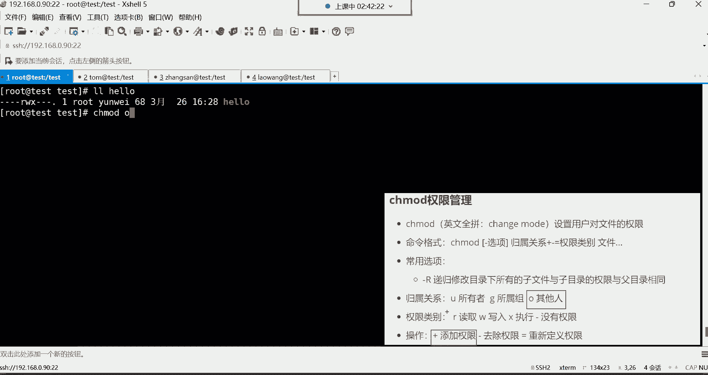

这这样就可以了嗯。啊，给他加一个R权限。这时候你再看这个文件的话。😊，他的权限是不是其他人这个位置就有一个什么的，就一个R权限了呀？啊，可以读了，但是没有写没有执行是吧？那我也希望他可以写，那你就。😡。

趁着mo那就O加W回车。再看。啊。再看。那他现在就多了一个W权限了。那多了W权限以后，那老王现在再打开这个文件的话。😊，他就可以写了。现在就可以写了哈。你看现在我们挨口一个hello老王保存退出，哎。

没有任何问题了。😊，看到了吗？写进去了吧，哎写进了，那他想执行点杠。😊，啊，点杠。你发现他执行不了，说权限不够是吧？为什么呢？因为压根儿我也没有给他执行权限呢。😡，我给他读写权限，但是我没有给他执行。

是不是？😡，没有给他执行权限，所以他无法执行。如果你也希望他可以执行，那就称之mo就O加X。就是你再看这个文件的话呢，你发现。他就具备这个读写执行的权限了啊，这样就可以了。那这时候老王就可以这样点杠。

执行这个文件了。看到了吗？这也没有任何问题了吧。OK以上就是怎么去给那个。所有者所有组跟其他人。去设置这个权限。所以你发现我们学完权限以后。😊。

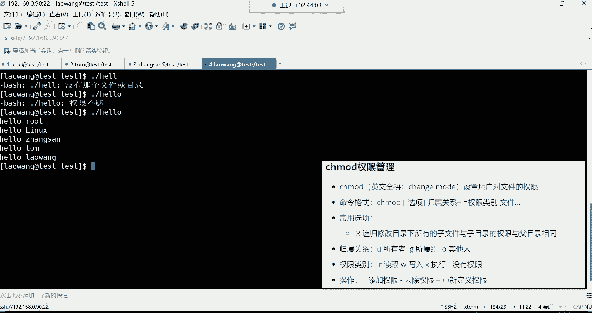

咱们前面讲的这个用户管理就能够什么呢？很好的结合起来去学习了，是不是啊？我们从这个创建用户，以及呢我们再去创建这个组，在这儿创建组。😊，然后呢，再往组里面去添加成员。然后再结合权限。

这时候呢应该这个思路就出来了。我们见用户呢是干嘛呢？啊，这时候仔细听哈，我们创建用户为了什么呢？是为了把这个账号发给你们公司的员工啊，让他们可以使用这个账号登录系统。😊，好，那我们创建组又是为了什么呢？

啊，是把相同类型的账号给它加入到相同的组里面。比如说。😡，这个账号是运维部门的账号是吧？那运维部门呢可能会有很多人，那我们就可以把这个所有运维部门的账号加入到同一个组里边，以后干嘛呀？

对于组的权限的一个把控啊。然后呢。就是不是通过这条命令把这个成员啊，或者把这个账号加到组里边呢？加入到组以后呢，那学习了权限以后，再学习了这个归属关系以后，我们就可以针对于某些文件啊。

我把它的归属关系给它改一改啊，主要是改的那个组哈，把它的那个文件的所属组给它改成什么呢？改成我们这个相关的。😊，那个组就可以了。啊，比如说我的部门的组，然后呢。

这时候呢再对我这个部门的组的权限进行一个相应的授权。那以后这些账号它就会继承这个组对这个文件的权限。这就是。其实这些东西都是相互关联的。你们有没有发现？就是对于用户管理、组管理、权限管理啊相互关联的。

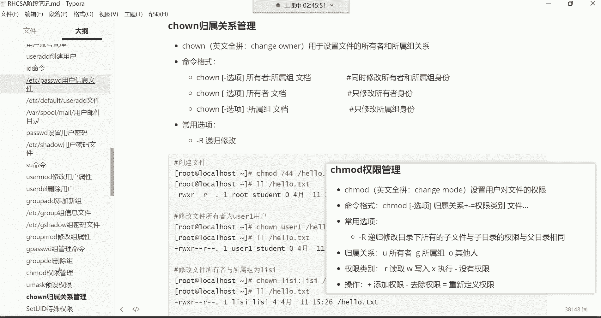

那，这时候呢你再去理解，你说我们为什么要学习前面的组管理啊，为什么要学习这个什么这个往组里面添加成员，建这个账号等等等等，干什么用是吧？其实这时候思路应该清晰了。

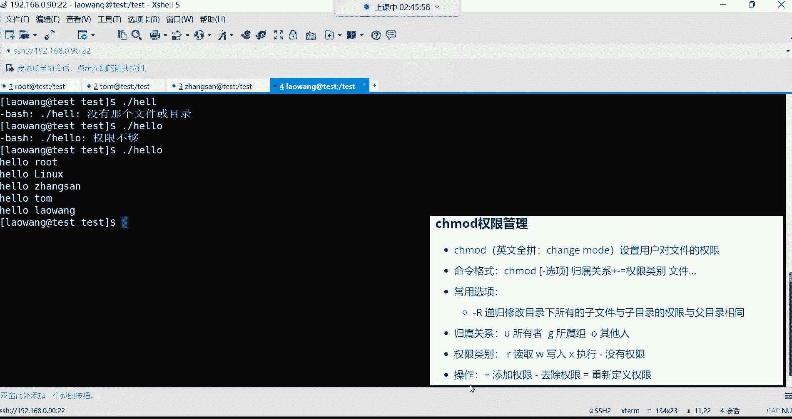

没错吧，这时候应该就不难理解了，主要是OK。好了，这是这个权限。然后下面还有一个等于号没有讲是吧？等于号要重新定义权限。😊，啊，重新定义权限呢，这个就是它用法呢比较粗暴一些，怎么粗暴呢？

你看我们就拿这个hello这个文件来说，他怎么粗暴哈。我现在就希望这个文件的所有者就是U所有者哈，它的权限是什么呢？啊，它的权限是读写执行。我希望所属组嗯。😊，他的权限是读写权限。

然后我期望其他人他的权限是什么呢？没有任何权限。😡，那这个权限。我想一条命令去设置，怎么设置呢？重啊这个重新定义哈，这就比较省事儿，怎么比较省事呢？就这样。陈志茂的。U等于RWS逗号隔开注意哈。

逗号隔开。再指定哈。G组的权限等于RW逗号再隔开O等于什么呢？杠杠杠。回车。你看哈。现在。呃，这个文件的权限就是我们所期望的了那个那那那个权限了哈啊就是所有者读写执行，所有组呢读写是吧？

其他人呢没有任何权限。😊，这里边呢我们又涉涉及到了一个什么呢？就是这个逗号，这个逗号的话呢。😊，可以同时给这三类用户去授权，用逗号隔开就可以了啊，逗号分隔啊，然后等号呢就是重新定义。

这个重新定义它的特点就是它不去关心。原先的权限是什么，他不关心原先的权限是什么，而且你也不需要去指定什么加号跟减号了。就是我就希望你是什么呢？读写执行的权限我就指定就可以了。所以这要重新定义了哈啊。

这个好用是吧？嗯，对，所以说你想怎么定义就怎么定义。😊，O。对。那把运维组的呃入它就没没有办法管理了吗呃。😡，就是你只要给他相的权限，他就能够继承那个权限，也不能说没有办法管理了就是。😡。

他权限就是具备读写执行，你不能说root不能管理。😡，因为你欺你因为你让别人改别人可以具备写权限，那人家就可以写。😡，但是如果后期你如我不希望他具备这个写权限了，那没关系。啊。

他们你再把权限给它去除就可以了。但是这种东西你即便给他加上什么读写执行权限。😡，你像汤姆哈，他咱们就再给大家演示一下，他不能改哈，他不能改自己权限。你比如汤姆可不可以使用这条命令？😊，去干嘛呀？

比如说改我自己的这个组的权限可不可以呢？比如说我这样啊，G等于RWX对，这个hello这文件这不行的哈。😊，啊这不允许择操作啊，因为这条命令它用不了，是道吧？😡，这条命令不是说他用不了，是这条命令。

只有所有者才可以用。😡，只有所有者，而所有者又是root。不是汤姆。但如果你说我套姆，我自己建个文件，我改自己的权限可不可以呢？可以。😡，但是这文件不是他建的。😡，他不是所有者。

所以这他使用不了那条称之末的这条命令哈啊，这个你要搞清楚。但是如果你希望别人具备这个写权限，你已经给人家了，那没办法，那人家就是对于文件的内容想改就改。😡，OK好了，然后下面还有一个这个数字的表示法。

这个权限数字表示法呢给大家讲一讲哈。😊。

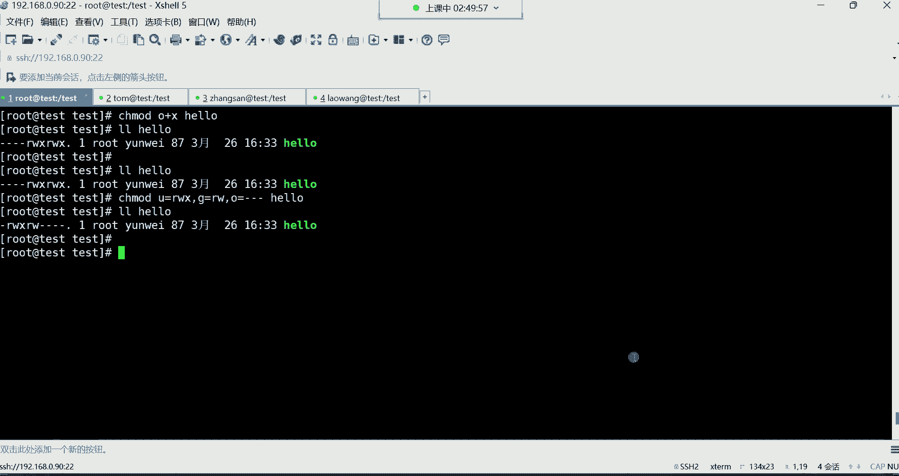

数字表示法。这个数字表示法呢也比较简单，就是我们可以通过一些数字去设干嘛去设置这个权限。

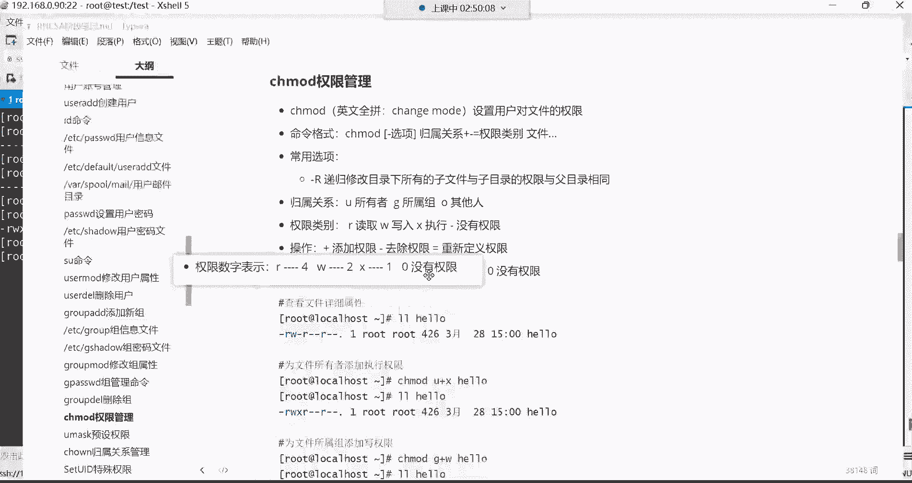

我们来看一下这个数字表示法里边呃，其中呢有这个。4。还有2。还有这个一。还有这个零啊，这四个数字。那首先呢这个读如果你想用数字设置的话，就是四写对应的是2X执行，对应的是一，没有权限，对应的是0。

那这时候我想干嘛呢？我想对于这个文件来讲，我想。把所有者的权限。这样设置哈，所有者我希望这个就是所有者优是一个读写。读写所有组呢是只读啊，或者说也是读写。其他人呢？是只读。其他人是只读权限。

那这时候我们如果换作数字，怎么设置呢？非常简单啊，就是十以内的加减法。住院十0以内的加减法。😡，嗯。对哈，他就是入座的小弟哈哈。😊，你看哈我现在希望所有者是读写，那你就干嘛呀？读读是四是吧，写是2。😡。

那就是4加2。就是4加2哈。所有者，你怎么设的呢？他的权限就是4加2就可以了。在这就4加2等于6啊，那所说组呢所有组我希望它是读写，那也是4加2。等于6。好，那其他人呢？我希望他只读，那就是4。

所以这个权限最终就是什么呢？就是叫做。😡，最终的权就是664。啊，第一个六是所有者的权限。第二个六是所有组的权限。第三个四是其他人的权限。所以我现在可以通过这三个数字去设置这三类用户的。😊。

这样的权限了。啊，就这样就称之后的是吧，664。664哈指定hello这个文件，你再看那个文件好。😊，所有者读写看到了吗？缩手组读写。OK。其他人只读。哎呦。这个好像有些复杂了啊，这个不好用了是吧？对。

这个不好用，这个复杂了，主要是得需要怎么说呢？得需要考验你这个十0以内的加减法，你的这个运算能力所以这个呢一般看情况哈，看情况。如果你觉得哎呦这个不是很好去。😊，记忆是吧，那就算了哈，那就算了。

我的小学数学我算的也不是特别好，那就不要去通过这种方法去设置了。你你就通过就记那个字母就行了。😊，能列解吧，其字母。O。好。这就是我们所说的这个。这个什么呢？就是这个权限哈，数字表示法，嗯。

一般不用数字是吧？啊，看情况，反正有数字啊有数字。然后大家在设置的时候，你一定要记住一下，你用数字设置的时候，你不能什么呢？不能少一位哈。你比如说我现在想给其他人的权限加一个W。

而这个所有者跟搜索组我都不想改变了。你比如说我就这样称之 modeode。😊，我就直接指定其他人的权限可以吗？你没法指。😡，你说我用我就用一个数字可以吗？比如说几页6。😡，他没有报错。

但是你看文件权限的时候，你发现确实其他人的权限变成读写了，变成读写了哈，就你加了一个W了。😊，但是你发现前面权限变成零了，是不是为什么呀？😡，因为前面权限如果你不指定。😡，默认注意啊。

默认给你补0两个0，知道吧？然后后边。这个六是属于第三个位置的。他前面给你补俩0，而零代表是没有权限，所以最终的效果就是所有者所有组权限变成零了。而其他人呢变成六了啊，是这样子的哈。

所以一般数字如果一旦用数字设置的话。😊，三个数字一个都不能少。即便说你我所有者的权限或者说所手组我都不想改变，那这个数字也一定要写上去才行。😡，啊。能理解吧。O。嗯。发到什么呀，我看一眼啊。

入职运维要掌握技术。嗯。哦。啊，入职因为要掌握技术是吧？啊，没错哈没错，你这话说你这确实是总结的非常到位哈。😊，啊，其他啊其他结构看到了。你当然你入职运维，你肯定要掌握技术啊，你不掌握技术。

你怎么去干呢，是吧？😡。

你想挣这份钱。

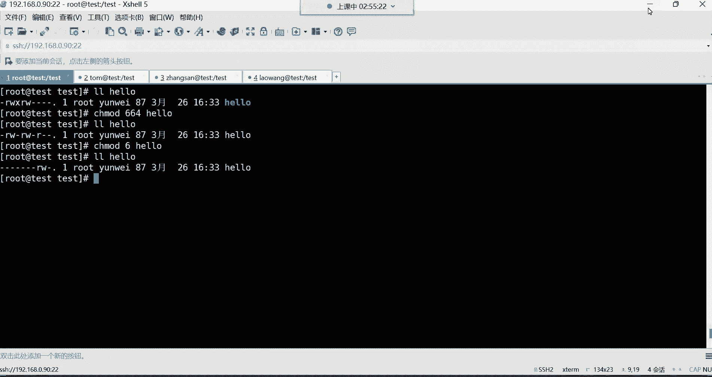

是吧。呃，哪些操作是属于执行权限？啊XX。啊，哪些操作就你想运行这个文件的话。当然哈就是这种东西呢，一般我们后期在学习税务脚本的时候，文件里面得是命令。这个文文件里面，你把命令写到文件里面。

给他一个执行权限，他就自动干嘛呀，帮你执行这个文件里的命令了啊，后期学习税务脚本的时候哈。😊，啊，你光能想到打开是执行，不是打开是这个RR是能让你打开这个文件的，你能够看啊W是能够改文件里的内容。

或者往往或者说往文件里面增加那种X是能不能运行它。啊，是这个含义。

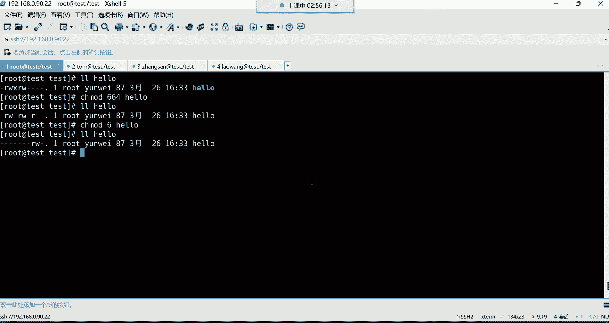

O。好了，那这个数字表把我们也也说清楚了，是不是？😊，OK那下边。给大家做个小总结啊，我这个笔记里面有总结哈，有总结。😊，这个总结大家一定要什么呢？一定要给他理解透了哈。😊，我我们今天这个。

争取把权限讲完，好吧，争取把权限讲完。这个总结呢？是一个什么总结呢？是文件的权限总结，注意哈。😊，我再给大家强调一遍。这个权限是文件的权限总结。并不是目录的权限。因为文件的权限跟目录的权限它不一样。

知道吧？所以你先看文件的权限总结。当用户对文件拥有RWX权限的时候。它是针对的是文件的内容，注意哈，这些权限都是针对于文件的内容的。😡，不是文件本身。你看一个用户对文件具备R，那他可以查看文件的什么呢？

叫内容。具为W，它可以对文件的内容拥有增删改的。这种权限并不能删除文件，你就假设我们现在。

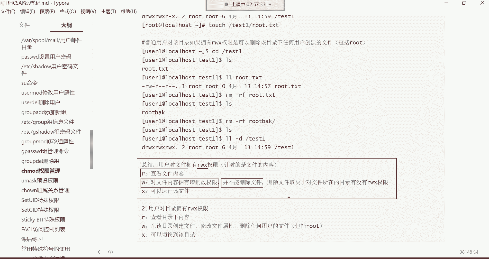

呃，这个我给其他人给他设置个权限，这样我们趁着mod的就O等于RWX。看这个文件，那现在其他人是不是具备读写执行了呀？那现在老王就是其他人。老王一看，我对这个文件的权限啊，已经是一个完全权限了。

能读能写能执行。😊，那他能删这个文件吗？RM杠RF。hello，能不能删呢？我告诉你。不能删。不能删。为什么不能删呢？😡，哼因因为很多人就纠结了，我不是具备这个，他不是具备这个W吗？W不是增删改吗？

但是你要记住它的增删改是针对文件里边的内容。😡，他可以增长改他打开他对文件的内容，你比如说往往文件里面写东西，可以ele一个。😊，hello，叉叉OO。ま。嗯。这可以。没有任何问题，我再删。

我把汤姆这个给他删掉。啊，保存退出，你看。哎，但对于文件的内容哈没有任何问题。😊，但如果你想让他上删这个文件，那你可甭想删不了。😡。

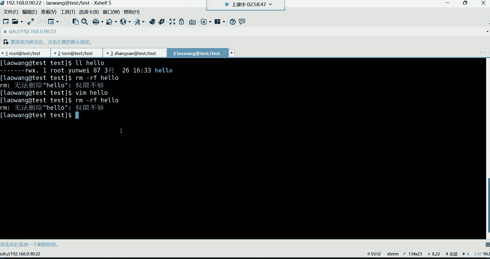

为什么呢？H。你要想删除文件，取决于说你得看这个文件的所在目录有没有相应的权限。

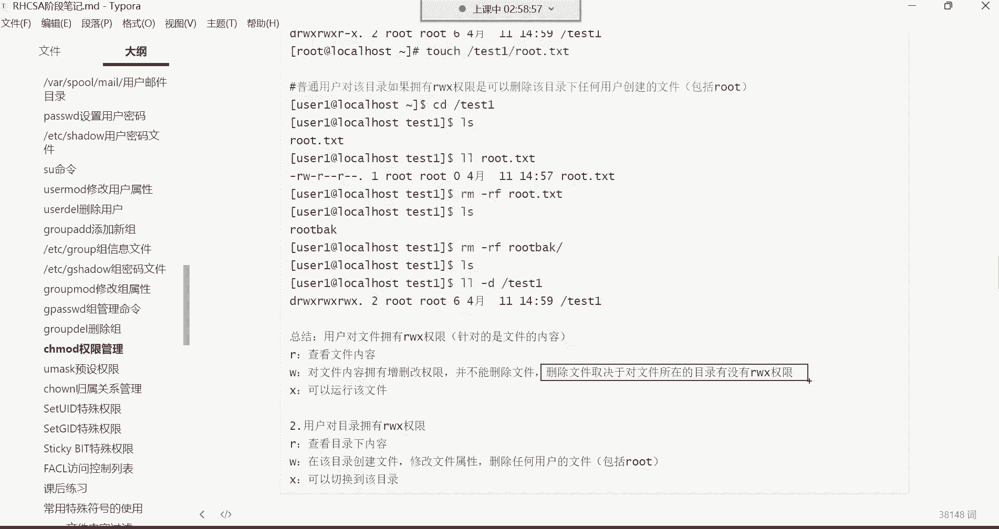

也就是说你想删这个文件。😡。

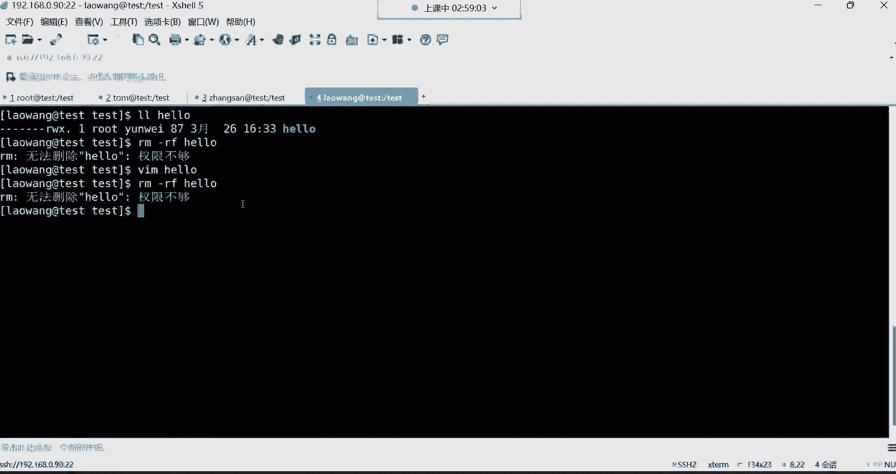

你得看看这个文件的目录的权限，这个文件在哪儿呢？这个文件是在跟下的t斯目录里边的，在这个目录。所以你得看它的目录的权限LL杠D直接跟上泰斯目录。😊，能列吧。他能不能删除这个文件，得看他对目录的权限。

他对目录的权限是什么权限呢？RX因为他也不是目录的所有者，所有者是root，他也不属于root的组里的成员。那他只能是被归类到了其他人了，而其他人的权限不就在这吗？目录也一样。😊，其他人的权限在这儿。

那他就只有一个什么呢？R跟X好，那对目录来讲，这个RX或者说RWX这权限跟文件的含义一样吗？它不一样。

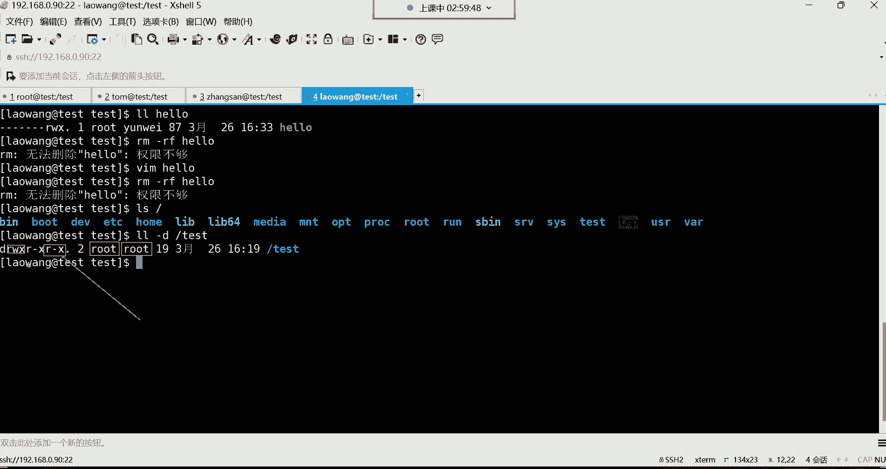

啊，针对于目录的权限，咱们给大家验证一下。把这两个总结啊，我们一一做对比。

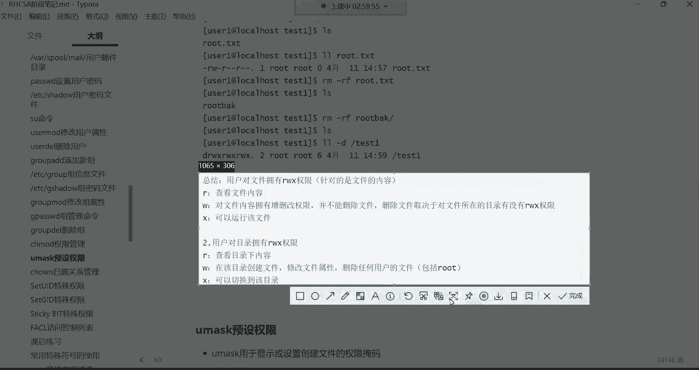

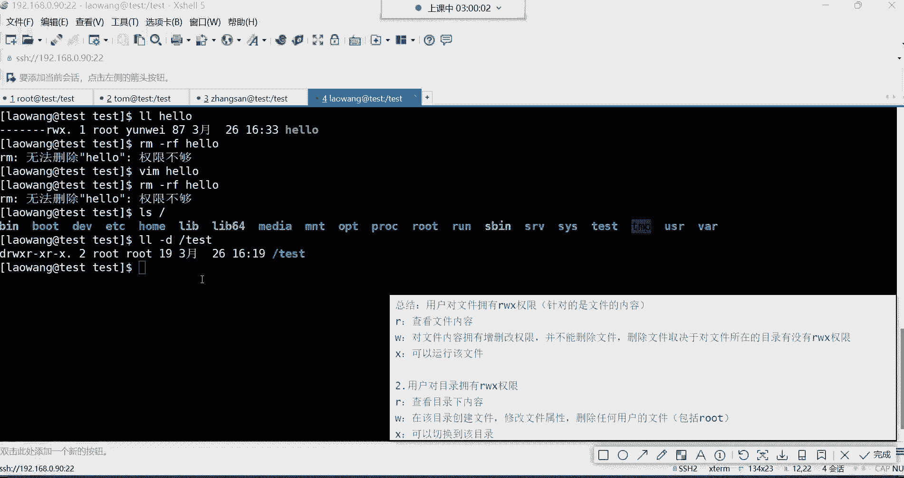

咱们就拿这个目录来说，现在呢比如说老王他想删除这个文件，他不能删，因为他对目录没有权限，是不是啊？好，那这时候。😡，我们再验证这个什么呢？这个R。对目录的注意用户对目录如果拥有RWS权限。

第一个R是可以查看目录下的内容的那如果现在看看老王退出这个目录，我把这个目录的权限给它改一改村之mo的。😊，干嘛呢？我O减R。对根下的太词的目录。这时候我们来看这个目录，看目录本身啊加杠D选项。注意啊。

杠D看目录本身。那这时候呢。你看我们看这个泰词目录的时候。你看哈老王的权限是不是没有什么了呢？没有那个R读权限了呀。😡，没有了吧。好，那这时候老王再想打开这个目录，LS更新的t，你发现哎呦。😊。

打不开了，你看到了吗？是不是打不开这个太测目录了，为什么呢？因为它没有这个R权限了。😊，没有R没有R，他就没有办法查看目录下的内容。还有这个XX是决定你能不能切换到这个目录里边的。而对于文件来讲呢。

是你能不能执行这个文件是吧？😊，他跟文件的权限不一样的。你看老王，他现在想切换到这个台字目录，这没有任何问题。他进来了看到了吗？是不是切换进来了呀？😊，为什么能切换呢？是因为他有这个X权限。😊。

X是能不能决决定你能不能切换到一个目录里面去的。但如果现在他退出这个目录啊，sorry哈。😊，啊，对CD。我们这样我们称之目的啊O。减X对太字目录，我把它的执行权限也给它去除。杠D哈。岗地。嗯。

等会儿啊。啊，这这里边有一个什么呢？啊，这个。什么情况？杠D跟一下的pa，大家看一下啊，现在老王是不是连X权限都没有了呀？那他现在如果再想切的话，CD到。😊，太子目录，你发现切也切不进去了。

切也切不进去了哈，为什么切不进去了呢？😊，为什么呀？嗯。为什么呀？是因为他没有X权限。啊，没有这个X权限。但如果你一旦给他一个S，他就能切进去。😡，来看一下啊，非常神奇啊，我们O加O加1个X。😊，对。

太字目录。那这时候呢，一旦有了这个。X权限了，看到了？是不是多了一个X啊，这时候老王就能够CD到这个泰测目录了，但是他看不了，为什么看不了呢？因为他没有那个读权限。哎，你发现这东西很奇怪。

我可以让你进来，但是呢你看不到里面的东西。😊，这有点意思，是不是？所以对目录来讲，权限是不是这样给就不合理呀。如果你希望他能够进去，你是不是就应该再给他一个R权限呢？可以查看目录线的内容啊。😡，是不是？

不然这跟带套。没啥区别。是吧。没有体验感。啊啊那这个我们就给他一个什么呢？给他一个，我说这个O加一个读选限是吧？嗯当然啊我说一个。😊，我没有其他意思啊没有其他意思啊，这个没有其他意思啊。

那这会我们再来什么呢？啊，再来看是吧，是不是就RX啊。😊，对不对？那这时候呢我们在什么呢？在这个这样哈。😊，咱这班里边应该没有女没有女学生是吧？我看有有有没有女孩子哈这个。😊，哎有有哎呦有女孩子是吧？

行好。😊，啊，完了是吧，没关系哈没关系。😊，那接下来呢我们再这样哈再再这样我们这个。😊，他在打开这个目录是吧，再打开这个泰斯目录啊，不用直接在里边了是吧？L那就可以看了是吧？啊，没关系啊。

现在这个女孩子呢也非常的奔放啊有。😊，有对呀，现在女孩子呢也也也很奔放啊。毕竟我们说这个都是什么社会的是吧？都是这个。😊，开放社会了。嗯哼嗯。😊，那你看现在这个你给他一个R权限，他是不是就可以读了呀？

😡，对，大家都是成年人了是吧？对，都是成年人，什么都懂对，什么都懂哈啊现在年轻人比你懂得多，所以呢。😊，你你也不要害羞哈不要害羞。😊，好。啊，这就是我们所说的这个什么呢？嗯，每次看录播都挺难受，是吧？

😊，怎么难受啊？😊，单身是吧？难受吗？起反应了是吧？😊，嗯，起反应了吧，这。😊，啊，要去厕所是吧？😊，好，这个。这就是我们的什么呢？叫。😊。

精神的粮食是不是啊啊能够让我们有这种学习的这种这个这个这这这这个动力是吧？能够提神啊，提神醒脑这种东西就是精神的良药啊嗯。😊，好，那下边呢我们这个是不是可以看了呀？

可以看就取决于说你给他了一个这个读权限了，看到了吗？然后下边这个。😊，哎这个W哈这个我们说说这个W这个W这个权限大家一定要注意哈，这个在目录上边是可以在目录里面去建文件的，以及对文件的属性进行修改。

甚至是删除任何用户的文件。😊，就是说。你在没有给这个目录。😡。

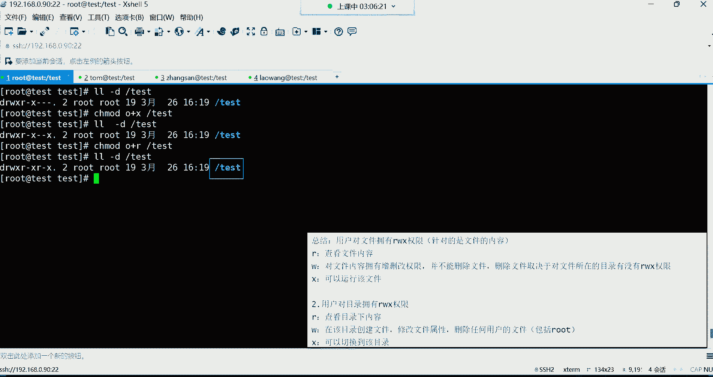

W权限的时候，那这个用户呢，他只能对这个目录下的文件进行哪些操作呢？啊，进行，比如说啊看文件。

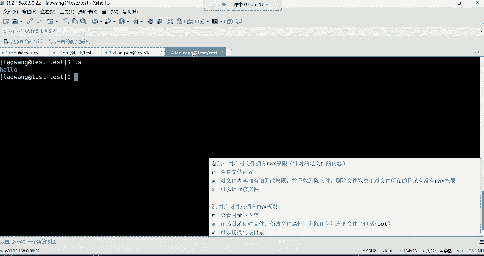

啊，就是对于文件哈，它本身的属性是不能造成任何修改的，什么意思啊？就是。😊，我想改给这个文件改个名儿。比如说我这个hello改成叉叉O可以吗？你发现改不了。😡，能连吧。他说改不了的哈，以及我想干嘛呢？

我想删除这个文件，他都删不了。😊，hello，删不了。删不了哈。但如果你说我一旦是给他加了一个W权限了，看哈陈之mo的。O加个W。对，根下的太字目录，这时候他是不是拥有一个W权限了呀？看这儿哈。

主要看这儿是不是多了一个W权限啊？好，那这个时候。😊，他就可以做这波操作了。你看哈这时候。😊，对于这个目录下的文件。他想删就删2M杠2F。helello。没了被删了哈，现在你甭说是谁建的文件。

它都能删了。你要root建个文件，它是一个啊，我们键名之一好像让它叫root点TATT这文件不就root建的吗？😊，你看是不是所有者是root呀，所有组也是root吧。😊，权限呢别人呢都是只读的。

是不是？我告诉你没用没有用。老王。😡，该删就删。2M杠2F。看到了吗？该删就删。汤姆，你说我汤姆，我建个文件，让他叫汤姆点TIT建好了。老王一看，这里面又多了一个文件，好，汤姆是吧，三看着不顺眼啊3。

看到了吗？为什么能删呢？😡，之所以能删的原因是他对这个目录注意哈。具备一个这个W这个权限了，而且他也能够在这个目录去建文件了，touch一个。老王点TIT。看到了吗？建好了哈。

所以说一旦对目录具备W权限，它就可以在这个目录下去创建文件，修改文件属性。这个文件属性主要是改个名什么的，都可以改了。😊，甚至是删除任何用户的文件，当然也包括root注意哈。

root在这建的文件也该删就删。所以这目录跟文件的权限，你发现它不太一样。所以大家在学习权限这位置呢，你就一定要搞清楚。文件。这三个权限它的具体的含义是什么？目录这三个权限。

它具体的含义或者说功能是什么？那权限这位置你就理解理解透了。因为你们在学习权的时候，有时候会经常犯一个毛病，什么毛病呢？就是你可能会觉得哈你看咱们把这个目录的W权给它去掉哈。😊，然后我建一个文件。

建一个比如说hello这么一个文件。然后呢，我这样趁着modode就是UGO都等于RWX这样也可以。这三类用户你看一下哈。😊，这三类用户呢，他的权限都是什么呢？都是这个读写执行了，完全权限了哈。

然后这时候你们可能就会犯一个毛病，什么毛病？就是我对这个文件的权限，我拥有一个W权限，但是我为什么不能删呢？😊，你不能删的原因跟文件的本身权限没什么关系。知道吧？跟本身没什么关系，它关系在你这个文件。

它的副目录。父目录能列吧。所以这时候就涉及到了一个什么问题呢？就是我们在系统的根下边，你发现大多数的目录。😡，都是谁的呢？你看一下哈，我们杠D跟目录。这样看根目录，你看哈咱们看根目录。😊。

根目录下边的这些子目录，什么bo目录DEVETChome这些目录。你看一下啊，就这些目录，其实大多数针对于那些普通用户来讲。😡，他的权限都是RX。能理吧，但链接文件的权限不准确，注意哈。

不要看链接文件的权限。链接文件权限。我第一天就给大家讲了，我说链接文件的权限要取决于它的原文件的，能理吧？而原文件你放心，它也都是针对于其他用户都是能读能执行的这么一个权限。😊。

所以系统里边这些普通用户，什么老王啊、张三呢、汤姆啊，他为什么无法说在系统的这些目录，比如说建文件呢删除这个文件呢，为什么呢？因为他对这个目录本身没有那个W权限。知道吧？没有W权限。所以这个你就会发现。

其实对于这个系统来讲，普通用户。他压根儿对于系统里边的这些就是。99%的目录都无法去做这种删除的操作。能裂吧。第二是什么权限？这个D是属性，这个D哈你们可能都忘了，这不是这个文件的类型吗？😡。

这不是目录的类型吗？类型是目录那R。刚讲完对而咱们刚讲完那不读吗？😡，读权限吗？不。OK这就是普通用户哈无法在系统的这些目录下面去做什么增删改的操作啊，见文件改文件删文件他都无法去做的，能理解吧。

所以对于文件的权限呢，大家去一定要把这两个总结给它记录就可以了。这文件这个权限你就能够。

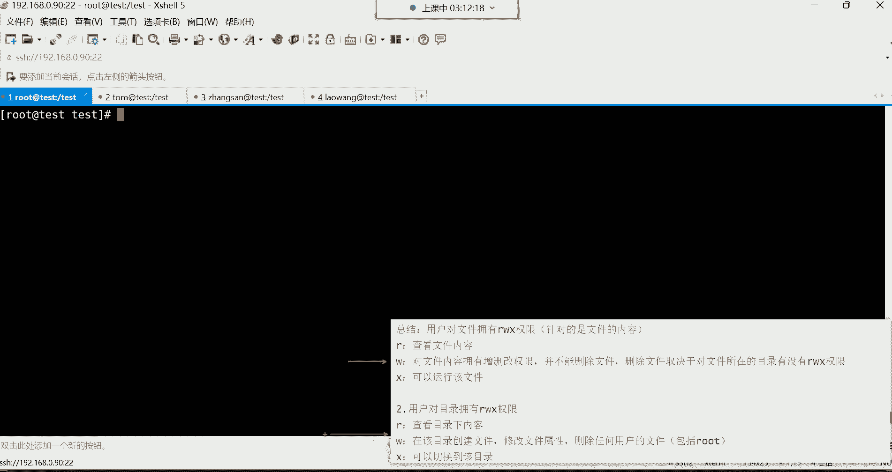

掌握的差不多了啊，然后在用的时候呢，没有太多什么呢？没有太多可。介绍的无非就是你只要只需要是掌握这些归属关系都有哪些权限类别都有哪些。然后怎么去通过这些操作服务。

或者说这些这个数字表示法去设置这个权限就可以了，其他就没什么。好。哦后，还有一个U mask。牛马死了，但是这还有一个递规哈。😊，我我们不能说常用的选项叫做不常用的选项。这有一个不常用选项。

要修改目录下所有的子文件与子目录的权限与副目录相同，什么意思呢？

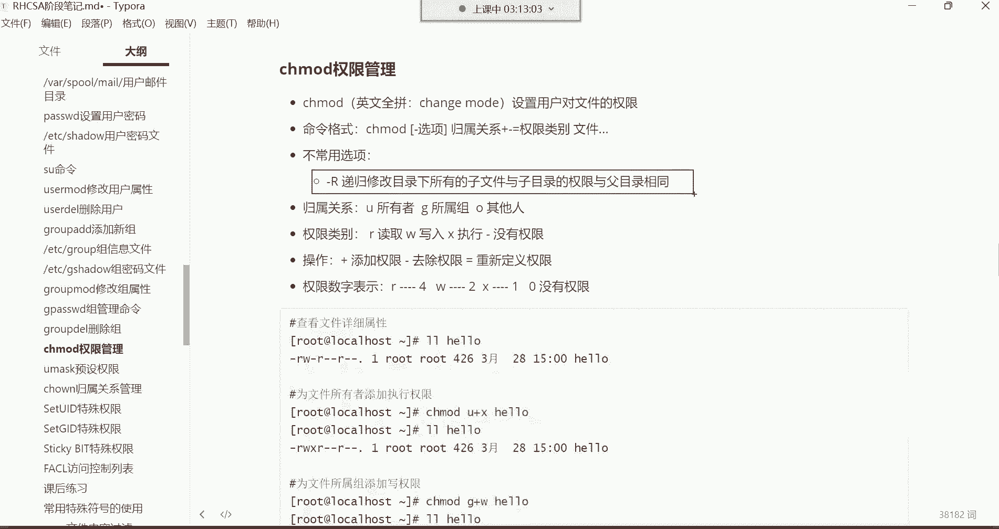

就是咱们假设哈这个E这个ts的目录这些文件大家看一下。😊。

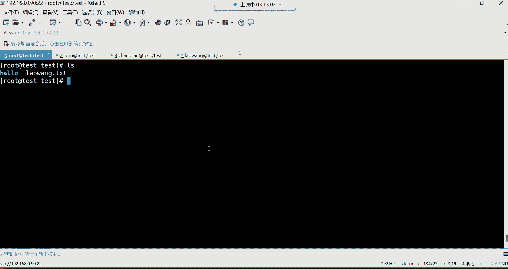

他们的权限的话呢都不太一样，你看到了吧？都不太一样。😡。

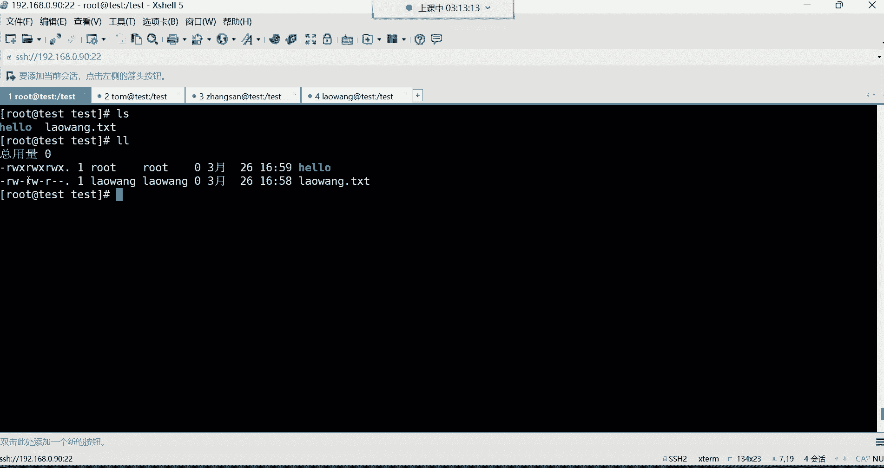

但是我想干嘛呢？我想把这个目录下的所有的文件。😡，它的权限都改成跟我这个。附目录一样的，可不可以呢？父母路。就当前目录太词目录看到了吗？😡，所有者能读能写能执行，所有组能读能执行。

然后其他人也能读能执行。但是这种需求一般不会去设置，为什么呢？因为我们一般不会去把一个文件的权限设置的跟目录是一样的权限的，能理解吧。因为有的普通文件。😊，像这种普通文件是不需要执行的。

里边就是普通的数据，不需要执行，不像命令，命令可以让你执行，普通的数据是不需要执行的，知道吧？所以一般这种需求没有没有，所以这个选项你也不用记，不用浪费时间去记这个选项。

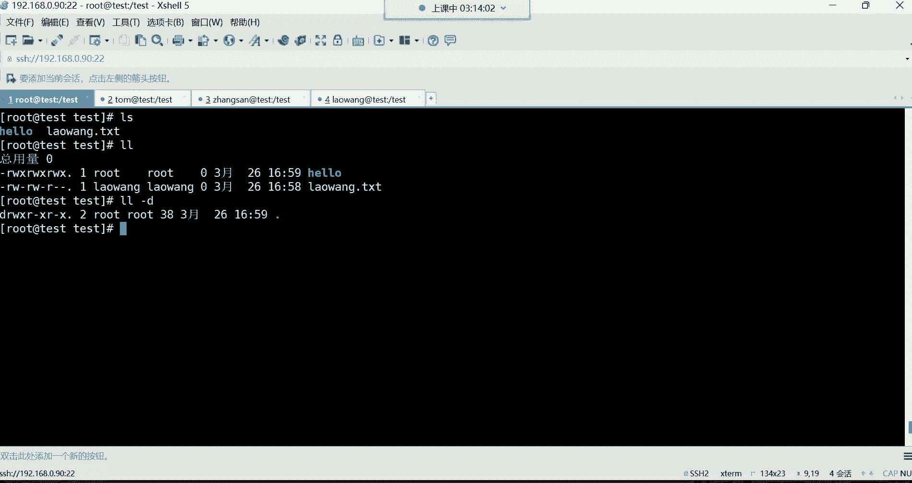

O。好，然后下面还有一个Um，这叫权限的掩码。呃，这个权限掩码呢是干什么用的呢？就是它是针对目录的权限掩码哈，就是我们建一个目录以后。😊。

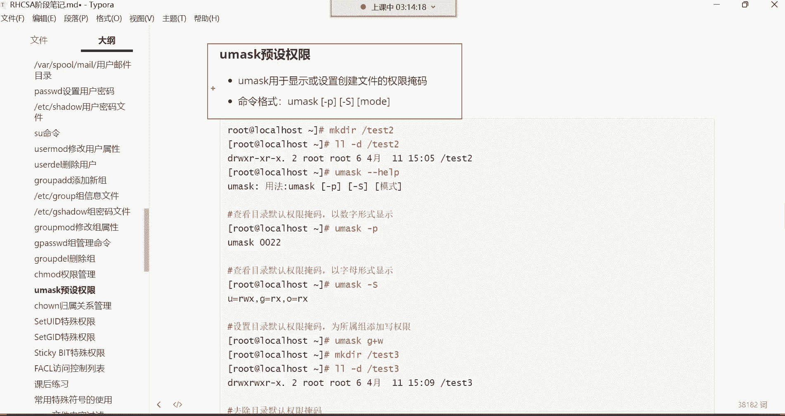

目录的默认权限是什么？来看一下我们mDR在跟下建一个，比如说泰斯一这么一个目录。然后你看一下泰斯一这个目录的权限。

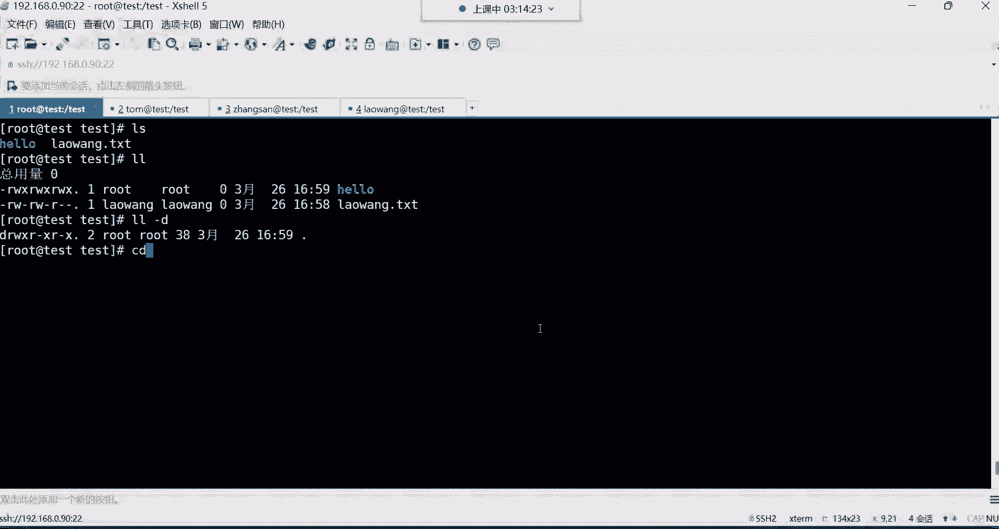

所有者是能读能写能执行是吧？所以说组呢是能读能执行，其他人也是能读能执行这么一个选项。啊，那现在咱们说一下，为什么说我建一个目录默认的权限就是这样子的呢？

我难道就不能说让所属组具备一个跟所有者一样的权限吗？😡，可以吗？可以。有马斯克。注意啊，这要权限的掩码，这个掩码就决定说你建一个目录以后，它的默认权限是什么？😡，但是呢你直接敲的话呢。

你发现这个是一个数字是吧？这个数字你好像看不太懂。😡，这个权限的掩码呢，它是一个权限的去除显示方式。什么叫做去除显示方式呢？就是。😡，首先是用数字来给你表示的，它这里面是有4个权限是吧？有4个权限位。

你看0。😊，Ling。22。这第一个零呢。😡，大家现在先不用去管了，这是一个特殊的权限啊，我们后面再讲。特殊权限哈，但是这零就代表说没有特殊权限。注意哈，这个零就代表这个目录是默认是没有特殊权限的。😊。

啊，那第二个零是什么呢？是所有者的权限。这个所有者也没有被去除任何的权限。😡，没有被去除特殊权限啊，sorry哈没有被去除任何的权限。那没有被去除任何的权限，代表什么意思？

就是所有者是一个什么样的权限呢？就是这个读写执行的权限。😡，读写执行。然后这个二呢是左手组的权限在这儿。在这儿哈，这是一个所手组的权限。好，那这个锁手组的权限。😊，为什么是二呢？注意啊，它叫权限去除法。

😡，你就说。这个所属组的权限被去除了什么呢？那个二那个二对应的是什么呀？W。😡，对应的数字就是2，而这个R呢对应的数字是4是吧？X对应的数字是一。

所以说你现在看的话就是这个所属组的权限是被去除了写写这个权限了。所以你看所属组压根就没有那个W啊，它是这个含义啊，去除了写权限，其他人也一样，其他人也是2，就证边其他人也去除了那个写权限了。

所以在建一个目录以后，你默认的权限就是。😡，所有者是一个完全的权限，没有被去除任何的权限，用零来告诉你了啊，没有被去除。所以说组呢去除了W对应的数字就是2。😡，啊，他告诉你了，我把他的二权项给去除了。

其他人也一样，把他的二的权项去除。你发现这样看不是很好理解。所以呢这条命令啊有个选项叫什么呢？叫杠S啊，大S。😊。

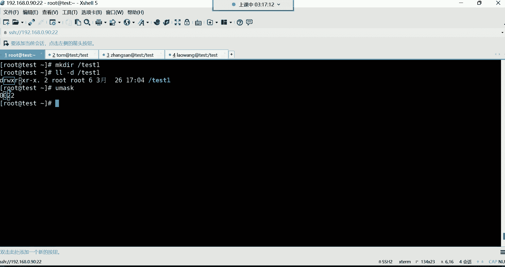

大S是查看它的默认权限掩码的时候，以字母的形式来显示，你就直接这样。

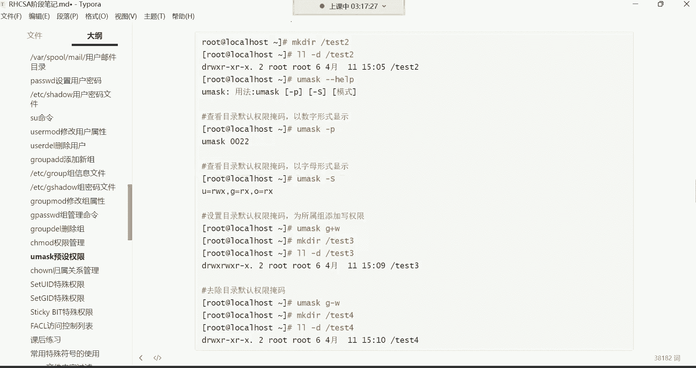

Uma杠大S回车，这样他就会告诉你了。你建一个目录以后，所有者的权限是RWX。所以说组呢就是RX，其他人也是RX。😊，比这样看起来会更加清晰一些是吧？但你说这个对于我们来讲有什么用吗？没什么用。

你不需要去改的。😡，目录目录哈这针对目录的。所以你就不需要去改它哈不需要改。😊，默认就这个权限就可以。😡，好。

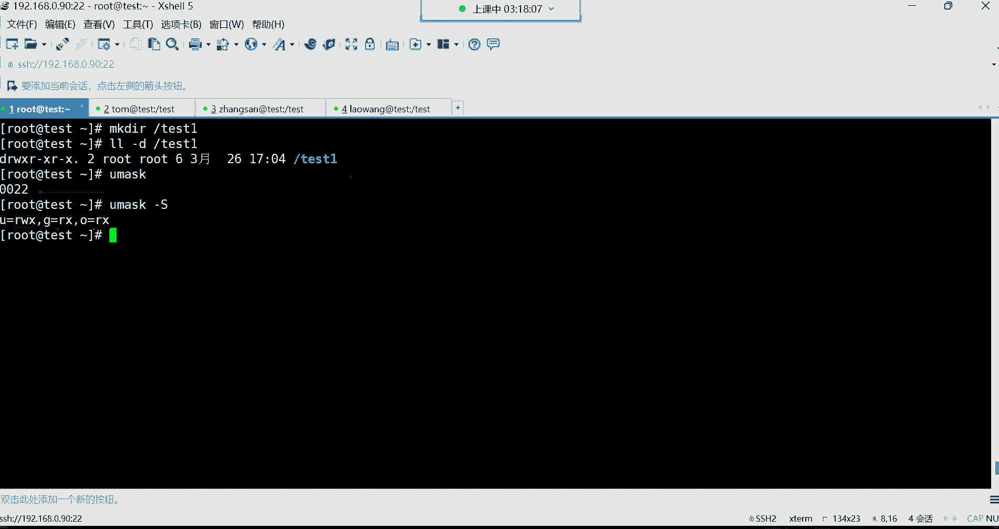

OK能理解吧。但如果你想改，你说我能不能改呀，可以啊。😡，你不是我希望这个什么呢？我希望这个。😡，目录一旦创建以后，我就希望所属组也给我。😡。

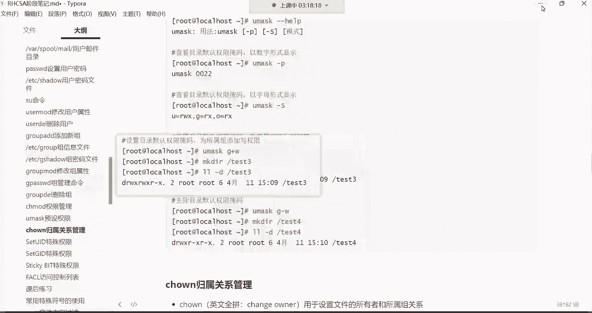

具备那个写权限，你可以这样Umuss克。G加W回车。那以后你再建任何目录的时候，给我建一个t2回车。你看这个t2的一个目录，你发现。他就直接。就是一个什么呢？读写执行的权限了。能列了吧。

但是一般没有这种需求，对吧？没有这种需求哈。😊，所以一般的给它去掉，这样哈就由m计减W。我默认的权限所属组不具备W。那你这后再创建目录呢，比如再跟一下创建一个tist3啊，你再看ts3回程。啊。

你再建任何目录呢，所有组都不会带那个带那个W权限。

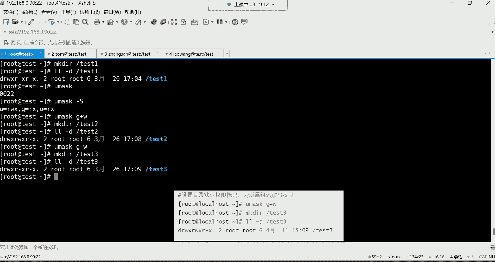

目录哈。啊，我写的是文件吗？啊，用于显示或创建啊，那改一下吧。嗯，目录目录的权限页码改一下哈。😊。

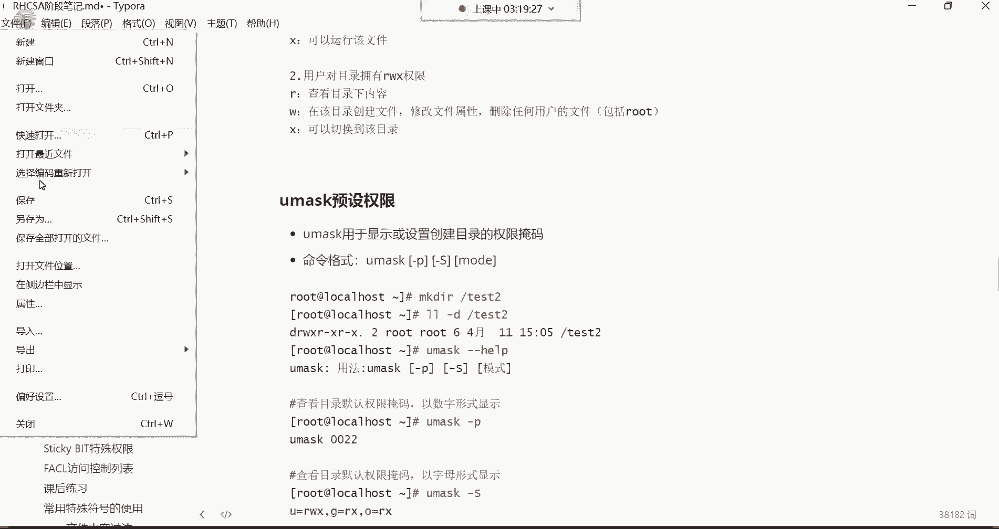

O。因为文件的话呢，它默认是没有这个X的哈。你建任何的文件，它可没有这个X。😊。

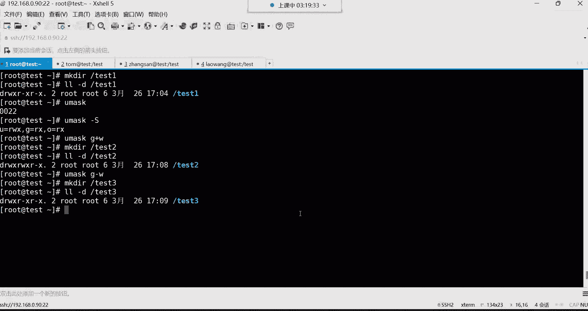

但是这种东西需要改吗？不需要改，你只要了解，只需要了解。

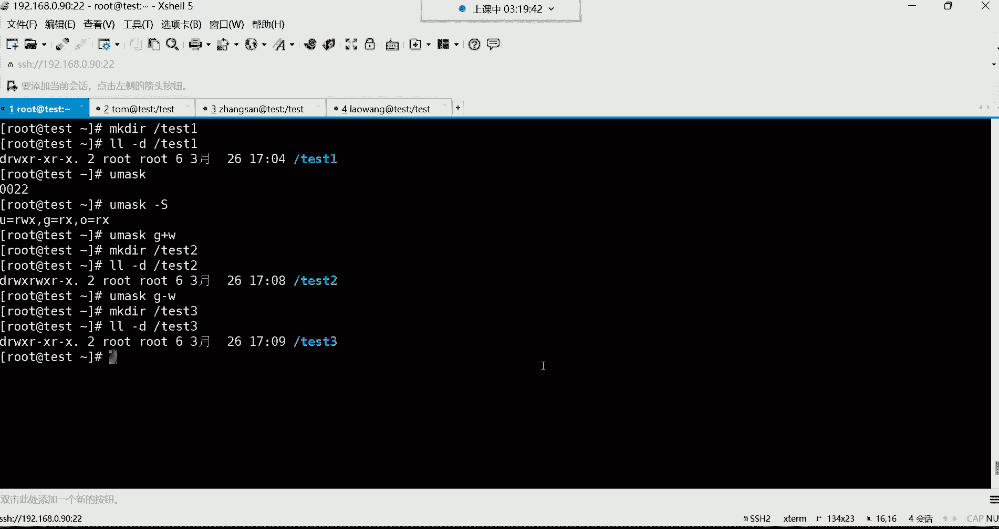

能明白吗？啊，所以不需要你做任何的改哈。OK然后这是趁着欧呢，我们已经讲过了是吧？然后下面还有一个特殊的权限。😊，嗯，针对于这个特殊权限的话呢。嗯。我们呢给大家说一说哈特殊权限。😊，有3个啊，咱们。

把这个特殊权限给他讲完哈，讲完三个特殊权限。我看看讲多久了，咱们。哎呦，1小时15分钟了呀。呃。

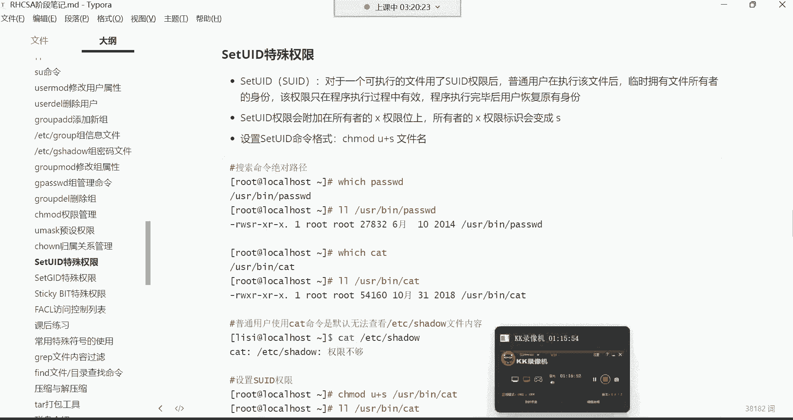

先把路微停一下哈。