# 零基础入门Linux，红帽认证全套教程！Linux运维工程师的升职加薪宝典！RHCSA+RHCE+中级运维+云计算课程大合集！ - P21：红帽RHCSA-21.find文件查找 - 广厦千万- - BV1ns4y1r7A2

好，OK。啊，犯的命令是吧，我们来。犯的。命令格式放这儿哈嗯放哪儿呢？放这儿吧，命令格式哈，哎，我觉得这位置非常的好哈，命令格式。😊，然后接下来呢咱们说说这个我想查什么呢？我想查一个文件啊。

我只记得这个文件名字。😡，啊啊当然我们先一个一个来吧，先看第一个查找条件，范的，你得先给他一个路径哈，把命令先敲上来。😊，敲上来fin的给他一个路径。比如说我要从这个va下的log下边去找。😡，啊。

让他去从这个路径去给我找，按什么去找呢？这条件非常多，常用的呢。我们先来看第一个叫按照类型，这个type呢代表是类型。那你这时候就直接杠。😊，type类型看到了吗？这就是你的第一呢是你的查找路径。

对应的就是这个你告诉他从哪去我找查找条件。哎，这条件什么条件呢？我要按照类型去找什么类型啊？哎，那类型有三种啊，当然啊也不止三种啊，有文件的，有目录的，有链接的，就是你想找的这个东西。

到底是文件还是目录还是链接文件等等等等。那其中F代表文件，我就想找。😡，文件啊，回车。那现在他帮你搜的都是什么呀？都是文件，注意哈。这前面是它的路径哈，前面是它的路径，后边呢他把全找到了啊。

这是一个文件。注意，这些都是文件。😊，那。你说。😡，怎么找出这么多呀？😡，是不是感觉很多呀，而且怎么感觉这路径也挺长的呀。我告诉你啊，它叫递规查找。😡，什么叫DV啊？就是你给他一个路径以后。😡。

你告诉他从va的log去给我找是吧，但是你看看在这个wa的log下边。😡，是不还有几个子目录啊，没错吧，还有几个子目录哈，他也会干嘛呀？他也会把这个子目录给你翻一遍。😊，翻完以后呢。

然后再给你显示出来啊，反正只要找只要是文件的，就都给你显示出来了。能理解吧。啊，这就是我们所说的什么呢？叫做这个递归啊，它的特点是递归哈，从头到尾给你找一遍啊，最后再给你列出来。

那你说我想看目录行不行呢？行啊，那你就把F换成D哎，那这几个是目录，看到了吗？也就是说在这个下的log目录里边只有4个目录。😊，啊，这是四个目录哈，只有这四个目录。O k。然后链接文件有没有呢？

换成链接。有没有呢？没有啊，在这个walo下面没有链接文件。没有。那别的目呃，如果你想找的话呢，你说我想看ETC有没有链接呀，那你就把这个路径换成ETC。😊，那ETC下边我们看有没有哈回车啊，非常多。

这些都是链接文件。你看这是不是链接，我们来阿拉喽直接。😊，拿过来是不是链接是吧，最终呢指向的是一个原文件，没错吧。随便调，这都是链接。看。是不是都是链接，所以查找的还是非常准确啊，这按类型去找。

到底是找文件还是目录还是链接？OK那有的时候问精确查找怎么办呢？精确的去找，那这种不是很精确。😡，太太宽泛了，是不是啊啊那精确查找可以按文件名去找啊，就是给他一个名字，让他去帮你去找。你比如这样。😊。

fin的这时候呢从哪找呢？咱们就从这个袜下的log过去找。找什么名字呢？啊，啊，不是怎么找呢？条件杠name，这我的查找条件号，我换了杠name。😡，name就是后边给一个名字。

这个名字呢就是给一个文件名哈。那这个名字比如说我要找一个，如果说你记不住，哎，那可以怎么玩啊这样。😊，星点log。注意哈。对，由于咱们是加上特殊符号了，所以我们一般用引号给它引起来。

这引号我们后面再详细讲啊，叫引用整体。就是我按照名字去找。😡，这个名字必须得是以这种点log结尾的。那你看是不是找出来了呀？没错吧。那你说那这这跟我用LS下的log，然后星点log，这有什么区别吗？

好像没什么区别，是不是有区别哈有区别。他叫地V。他叫DV哈。如果说。嗯。grape可不能做哈，grape是你们现在还没搞清楚。grape过滤什么呀？😊，过滤文件内容的。文件内容它从一个文件里边去找东西。

知道吧？是从一个文件里边去找东西。fin的呢不是fin的，我是找这个文件。😡，这个文件在我系统那，在我的系统的哪个录径存放着呢？知道吧。对，这个是过滤文件名，而这是过滤文件里的内容。这得搞清楚啊。

这个可能可能同学就确实容易搞混哈。嗯，所以你要把这个。😊，自己。在内心啊自己如果如果说记不住哈，自己去。这个默默的去自己去读三遍啊，graap是从文件里边去过滤内容的啊。

针对于文件内容的fo的是针对文件名的，它不一样啊。OK呃，f呢它跟LS的话呢，它不一样哈，就是它是递归LS可不是递归。如果你这样看，你这样写上ETC下的，比如说叫。😊，星点抗复。多少个呀？

没有多少没有多少啊。😡，但如果你用fin呢，你看我用fin。😡，给他一个路径。按照名字找杠内幕。然后呢，来一个星点抗复。会车。好，你看这多了去了，看到了吗？是不是非常多吧，你看是不是非常多。😊，呵呵。

😊，为啥呀？因为他递归了。啊，他把ETC整个目录都给你翻了一遍啊，只要是有文件名，是以点com结尾的话，都给你翻出来。😡，而这个LS呢它不一样，LS是只在ETC这一层目录去给你找。而ETC下边的子目录。

它不找，这是他们的区别哈。😊，OK按照名字去找，所以一般看情况。如果你说我就想在。ETC啊或者某一层目录，那你用什么呢？你用LS也一样。如果你说我想递归找用fin的啊，因为它查查的更加详细一些哈。

OK这是更按照名字去找。那这种时候就比较常用一些了呀。就是我想针对于某一个名字，但是记不住怎么办？哎，匹配一下，用星号匹配一下啊，这种是比较常用一些啊。然后它这个条件呢你也可以什么呢？

也可以加多个条件哈，这种东西没关系啊。你比如说我再结合一个杠t类型得是文件的回车啊，那这些就必须得是文件，是目录就不行了哈O。😊，结合多个条件了，这就属于然后下边呢还有一个I name啊。

查找的时候忽略大小写，这个用应用的比较少一些。你比如说我记不住文件名字里面有没有大写或者小写啊，没关系啊，就I name啊，就大写也行，小写也行，这种用的比较少一些，知道一下就行啊。I name啊。

这是这三个。😊。

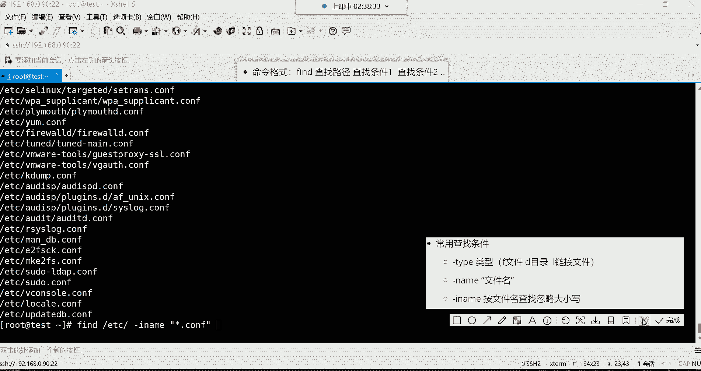

对，不难理解吧。😡，是不是？按照类型找然后按照名字找。然后名字里面可以支持通配符啊，就是星号可以帮你去做模糊匹配。这个呢I name是查找的时候忽略大小写。那下边。

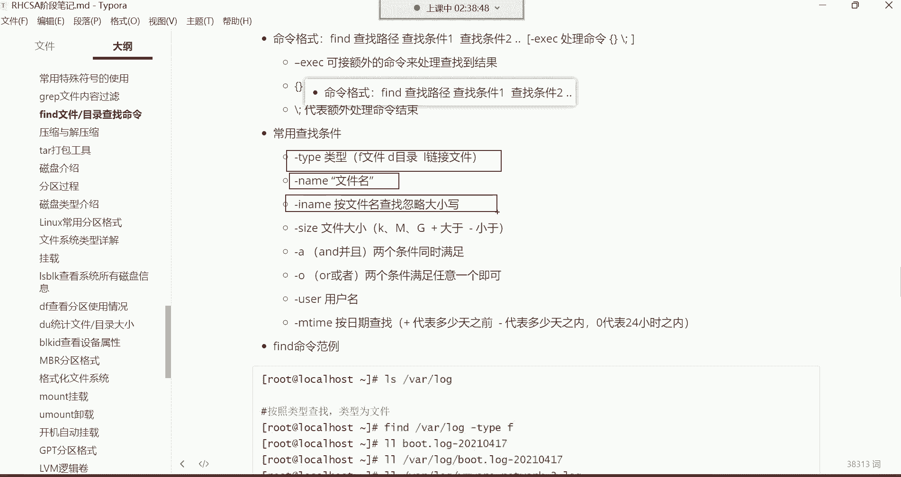

这三个。

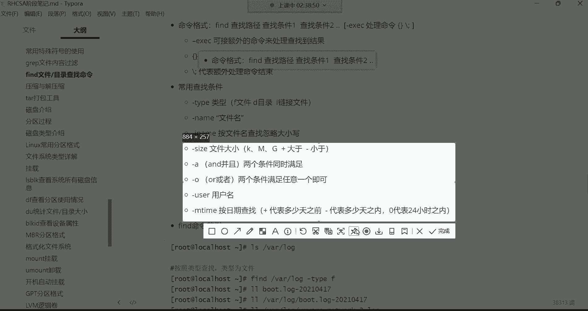

这是什么呢？这个条件呢就是可以按照文件大小去找了文件大小。你比如说我现在要找一个文件。😊，然后呢，我这个想怎么找呢？找一些日志文件哈。对于日志文件来讲呢，比如说太大呢。

我们一般会给这个日志文件做一些处理。😊，嗯。怎么处理呢？比如说后期做一些什么切割呀等等等等哈，但是总总之你得先找出来啊，这些文件我看看它别太大太大占我磁盘空间呢。所以一般呢我们可以这样。😊。

用杠 sizeize从哪找呢？啊，就别从ETC了。因为日志文件都在va下的log下边，大大部分哈哇下的log从那去找，然后按照大小去找。😊，这个大小找的话呢，可以这K招记。为单位去找。

然后加号代表大于减号代表小于你就可以这样了。加号。我要找什么呢？我要找这个文件啊，它的大小大于10。可以的。而且。类型必须是文件回撤。那这些呢看一下它的大小，然后有一条命令呢叫度啊。

度这条命令是统计文件大小的，度杠H加个选项跟上。可以告诉你这个文件大小是12K。看到吧？这个度我们后面会学哈。😊，嗯，F是文件呢，F是文件类型里面F是文件哈。然后这时候你看到了吗？

是不是满不满足我们的条件呢？😊，大于10K的呀。满足啊。12K嘛是不是大于10K了呀，是吧？而且必须得是文件类型的才可以OK然后你再随便找一个，像这种。😡，你看一下。

那么土度杠H统计下度命令我们后边也会讲啊28K是不是也大于10K啊，都满足条件啊，那那我大于10兆的，有没有啊，那你就换10M。是M哈大写的M回车没有哎有没有哈没有，那这里面没有ETC有没有呢？

我们换个路径，可能这里没有太大文件。ETC回车也没有没有哈那一兆的有没有啊，哎，有大于一兆的。😊，呃，这个有这个文件这么大吗？啊，度哈用度杠H统计。有7。6兆这文件这文件可确实很大呀。😡，呃。

这是一个程序文件啊，这是一个程序文件哈，你的点并结尾头了。然后。哎呦，这是内核相关的文件，都很大。都很大了哈，这叫回车哎有3。8兆是吧，都大于一兆了。嗯，这是那你说有没有大于一G的呀，这有没有了。

我们系统没有我们系统新系统没有那没有那么大的文件。😊，比如换成一个G。没有没有哈这肯定是没有的哈，没有那么大文件。😊，这是按大小去找。然后减号呢是小于啊，你比如我现在要要查找小于多少的那就用减号。

减号代表小于。比如小于多少话，小于10K，咱就意思就是10K以下的文件，从哪儿呢？从哇下的log去找，OK吧。好。那你看这些文件它的大小。😡，都是什么呀？都是小于10K的。4。0K是吧，哎，这个文件。

看一下多少呢？4。0K是不是哎都是小于多少的了哈，这是大于跟小于哈大于多少小于多少。😊，好，那这这个呢就是根据你自己的情况去找呗，是吧？你只要能够记住它的条件是杠size，然后它的单位啊K着G都可以。

剩下呢操作就是加号代表是大于减号代表小于剩下。就看你自己的情况了啊，总之呢他你要只要给他一个条件，他就帮你找。嗯，还有下边这种这个杠A啊，你在找的时候呢啊还可以加一些或者啊，并且跟或者的意思。😡，呃。

杠A就是and并且的意思O呢就是or啊叫或者or哈或者。然，这东西怎么怎么个意思？你比如说我想找一个文件，哎，这个条件呢我比较苛刻，怎么苛刻呢？你这文件大小必须得大于。😡，10K。并且那你就加个杠A。

并且你要小于多少呢？啊，叫杠。这子。小于。20K。2K类型得是文件的那你看我这条件就复杂了，怎么复杂呢？😡，我这里面加了一个杠A。哎，就是说这个文件大小必须得在多少呢？10K以上。😊，20K以下。啊。

那有时得必须得在10到20K之间的范围。才能满足我的条件。能列吧，你10K以下也不行，20K以上也不行，必须在10到20K之间。😡，这就是我的条件哈那这样你看满不满足，必须得必须得在这个范围内哈。

超出也不行，小于也不行。😊，回车哎，你看12K。满足吧这个。满不满足呢？哎，也12K是吧？都满足，你发现没有太小的吧，也没有太大的。总之呢都是在10到20K之间了，就哎20K是不是？

当然也包含哈也包含20。😊，这就是可以加这个并且啊，就是两个条件得同时满足。哎，那。这个杠O呢或者呢啊这个就。不是必须得两个条件同时满足了，你是两个条件满足一个就行。满足一个就行。

那这个一般啊我记我这里边有一个例子哈，这个杠O。😊。

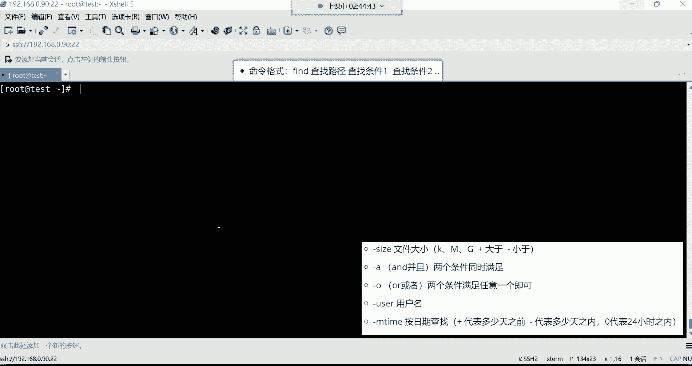

杠O。阿仔。杠欧嗯。杠。这哈看看杠O或者啊就是当有多个条件时满足任意其中一个就行。我们可以这样，哎，我就找名字是以点log作为结尾的。😊，或者看到吗？或者你这个文件的大小。小于10K的。

而且类型是文件的，就是这个呢我的条件就比较什么呢？比较宽松一些。就是你这个文件名是以点log个结尾也行。😡，又或者说哎你的大小小于10K都可以。啊，就是说以点loggo结尾也满足。

或者说小于十0可以也满足。

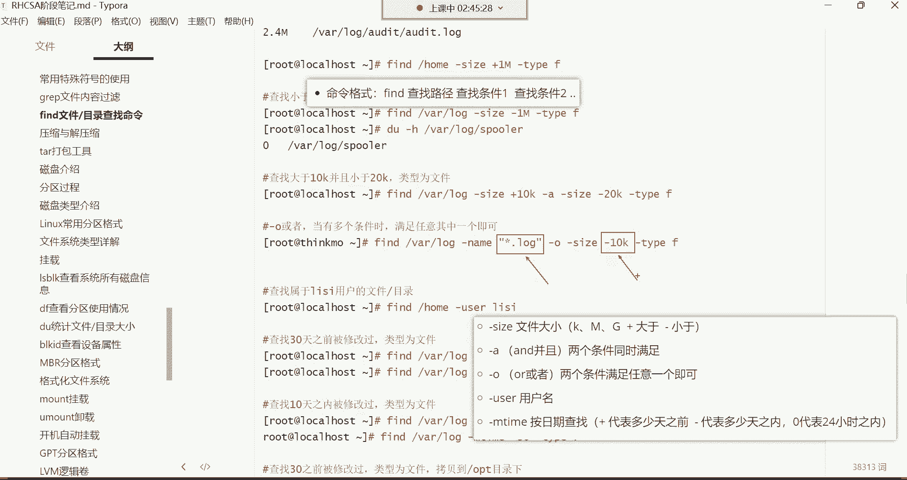

这个呢说白了我就常找要么文件名一点loggo结尾的，要么就是。😊，小于10K的都从什么呢？都从这个r的log去找。第一啊，咱就。杠name名字。星点log个结尾的。然后。这时候呢杠O了啊。

或者这个文件大小是多少呢？嗯。小于10K的。小于1K哈，然后。类型是文件的。可不可以呢？可以，那这时候就是只要你这个文件名以点log结尾也可以。然后你的大小呢嗯你不是以点log结尾的。

但是你的大小是小于10K的，都符合它条件。😊，哎，这个也不难理解是吧？OK两个条件啊，满足一个就行。然后下面还可以按照什么呢？按照用户名去找，按照用户名去找。你。

比如说我现在要找系统当中的汤姆这个用户的文件，那就这样fin的。😊，哎，这杠优色了，后边跟上用户名汤姆啊，或者说老王。我要看老王在这个系统当中的文件。回车。哎，没有是吧，没有没有给定一个路径是吧？

那从哪儿给呢？啊，我们就从系统跟目录开始搜是吧？我要看看在这个系统当中，老王。😡，在我系统里的哪个目录都有它的文件。看到了吧？就是大部分都是ho门目录，就是他的家看到了吗？都在他的家里面。

其实大部分文件哈剩下的还有什么呢？还有这个rshport mail，这里面有一个它的是什么呢？叫做。😊，那个邮件啊，这是它的邮件文件，还有一个test的目录，也有一个它的文件是吧？啊，运维这个目录。

还有一个它的文件哎。😊，那你看这是不是我想搜索这个用户在系统当中都有哪些文件，是不是就非常方便了呀，给个用户名就行了。😊，然后上面这个PROC这个呢，这个什么没有那个文件和目录啊。

这种东西你就不用去太纠结。哎，因为它主要是POC是内存里的数据。😊，这个内存里的数据呢一般就是时有时无啊，就是不稳定。可能说这个程序在运行的时候呢，这个文件就出来了。然后呢，你找完以后呢。

这文件又消失了，所以f的在显示的时候发现，哎，我明明在查找的时候，我在POC发现有老王的文件了。但是为什么最最后显示的时候显示不出来呢？哎，文件没了。哎，内存哈内存里的数据呢不稳定，时有时无的。

飘忽不定的。所以这个POC的报错不是什么报错。😊，好。啊，这是按用户名去找，这就也是比较简单的一个条件是吧？用户名，然后下边按照时间去查找这个呢也比较也比较简单。比如说我想找一个文件。😊，呃。

当然他这个时间是最后一次的修改时间哈。呃，你比如说我想找一个文件，这个文件在多少天之前。😊，啊，被改过啊，那或者说在多少天之后等等等等，你都可以去找。犯的。嗯，我们从va下到log去找哈。

一般呢主要是找这些日志文件。😊，然后杠Mtime。加号代表多少天之前的文件，我想查找什么呢？我想查找10天之前被修改过的文件，那就加1。好，然后再加个类型，杠type类型是文件的啊。

那这些文件的时间都是10天之前的时间。大家可以看一下是不是10天之前哈。好，这是3月6号。我们今儿3月27号吧。是不是我们今天是3月。这个27号，然后他那呢是3月6号，是不是10天之前的呀？哎。

你看他这个时间是10天之前被修改过的文件。O。我想看20天之前被修改过的文件，那就加20。嗯。啊，你想你想找2小时之前的是吧，也能啊也可以哈。fin的呢它有呃就是。😊。

确实是可以支持哈2小时2小时之前的哈。😊，呃，但这个选项呢，你得去百度搜一搜，因为范的这要命令啊它也非常的复杂。我们看一下，我慢一下哈，慢一下范的。😊，嗯，犯的这条命令。

当然也你发现这大多数完全看不懂是吧？嗯。算了，我觉得不要在这儿浪费时间了哈。😊，咱们先把这讲完，然后咱们再最后再说，OK吧。😊，这是20天之前被修改过的文件。

那你就可以看一下他这个日期肯定20天之前的了。😊，啊，这是这个啊3月6号也是20天之前的是吧？因为今天是3月27号嘛，O。😊，对，慢是不是看看这个命令的帮助吗？前面不都讲过吗？😡。

然后当然啊你不要浪费时间了，因为你大部分看不懂啊，看不懂。😡，然后。这是多少天之前，然后减号代表多少天之内，比如我想查找。😡，什么呢？这个10天之内没修改过的文件，那就减1。

解释这些文件的时间都是10天之内被修改过的。你看到的时间肯定是10天之内的。这是3月27号的今天的看到了吗？今天的哈。😊，这个呢时间呢我们看看是不是也是今天的，哎，也是今天啊，也是今天的，看到了吗？

这都是不是都10天之内呀啊，那你说哎呀呀，我想看24小时之内的0。😊，给他一个零就行了。回车这些文件都是24小时之内的啊，其实就是当天被修改过的。注意啊，他现在给你找出来这些文件都是当天。有过修改的。

看到了吗？都是今天啊，3月27号。几点呢啊三点的时候被修改过。但然这日志文件哈，就系统在运行的时候，他就会往自己往这个文件里面去写去写东西。所以你不用管，你说我也没有改过这文件呢，你可能会纳闷儿是吧？

这是日志文件，系统运行的时候，他自己写日记，不是你写的，知道吧？啊，所以他就会往这个文件里面去写东西。😊，O。好，这是多少天之前，多少天之内啊，还有这个24小时之内是吧？

那你说哎呦我想查找两个小时被改的文件。😊。

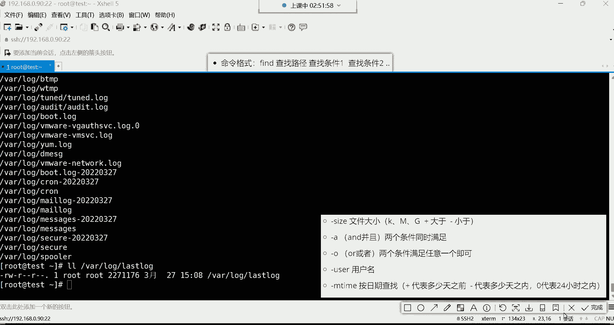

啊，那这个呢。你去百度搜一搜。嗯。嗯嗯。要犯的。命令。看看有没有哈，在里边随便找一找嗯。啊，你看还可以什么呢？什么过去几分钟看到了吗？啊，过去N分钟内被修改过的文件，那这个不就可以了吗？

那个120分钟可不可以？😊，2小时。来吧。

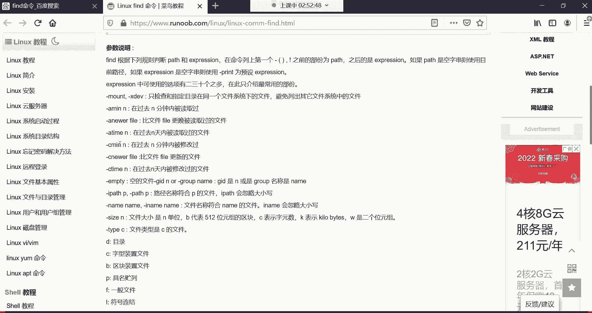

杠C。C米哈C米。哎哎哎哎，过分了哈。犯的。下了log杠C米啊，最小啊最小多少分钟了，多少分钟呢？比如120分钟。后杠。类型是文件的。总你没有嗯，好像没有。

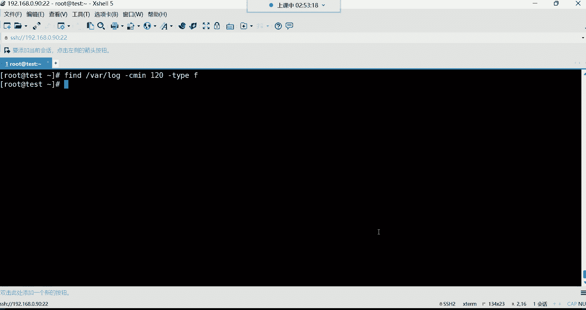

没有哈。

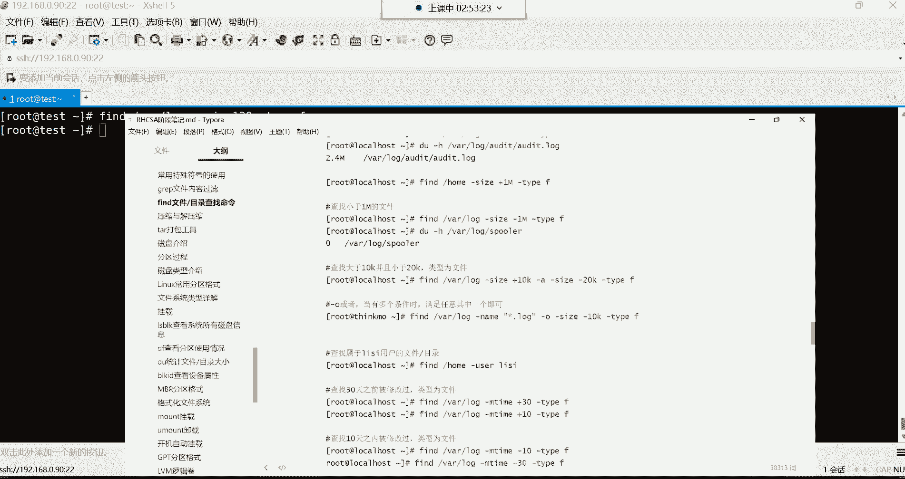

我们那个我看一下啊，我看一下是不是语法有问题。嗯，C没有问题啊，这个那我再换一下，我我换一下哈，我们换多少呢？换比如说。

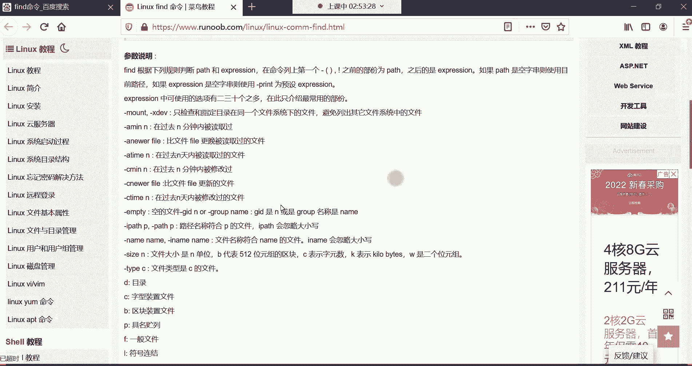

59。啊，没有59分钟，这确实是不怪我们哈。

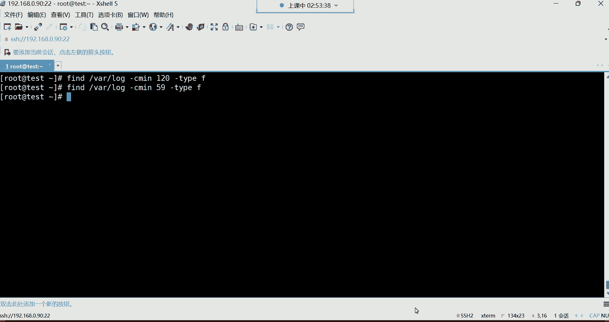

嗯。嗯。

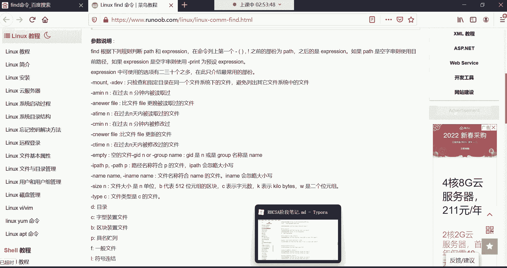

没有符号是吧啊，多少分钟之前多少分钟之内。嗯，那我们这样吧哈，我们再来个加号吧是吧？加号这这个多少分钟之前，120分钟之前，那100那减号吧，120分钟之内吧，是吧，减号。😊，哎呦哎，是这样玩的，没错。

是这样玩的哈。看看时间对不对哈。哎，没有问题啊，这确实是。呃，俩小时之内是吧。可以啊，这看到了吗？所以这里边呢，后期如果你有这种需求啊，可以去网上搜一搜这种东西都不是什么难的问题了。看到了吧？

因为你只要了解它大概的语法，你看一看是不是？如果你觉得这里边好，找不到我想要的这个帮助，你就看看别的帮助，是不是啊？😊。

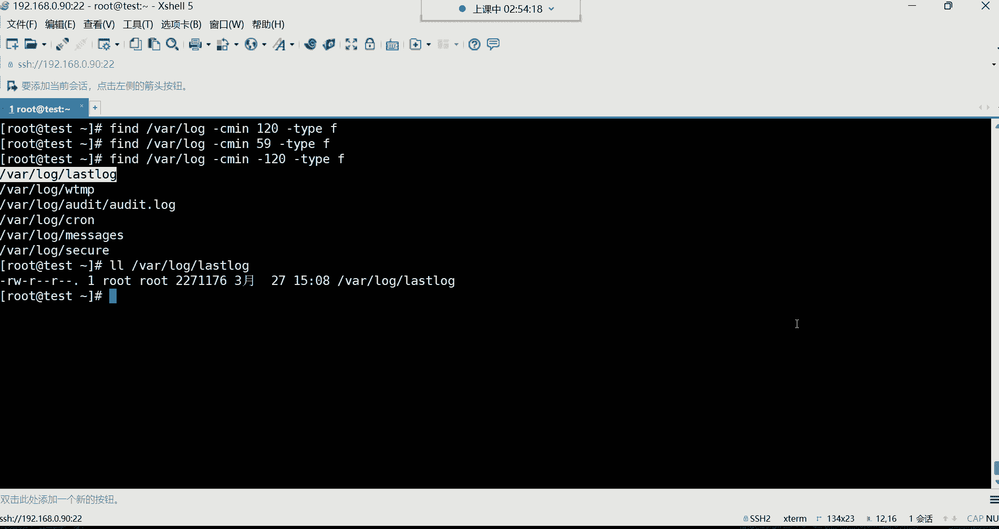

反正呢这里边你只要别看这种广告就行了，你别点着点着，你发现我操他妈的。😡，点进以后呢，就看别人广告去了是吧，预览了半天是吧，然后呢再报个名啥的，这就犯不上了哈啊，所以你得排除这些广告哈。

一般头几行都是广告。😊，OK看到吧？这些都行哈，这些都行。😊，好了，这是对范的。这个老鸟练词可以看吗？是吧？老鸟。

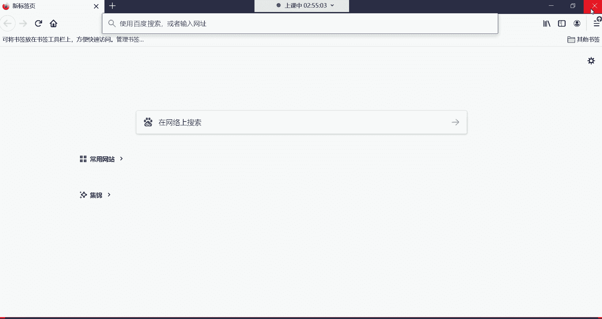

可以啊，都可以都可以看，可以作为一些额外的一个什么呢？一个扩展吧。

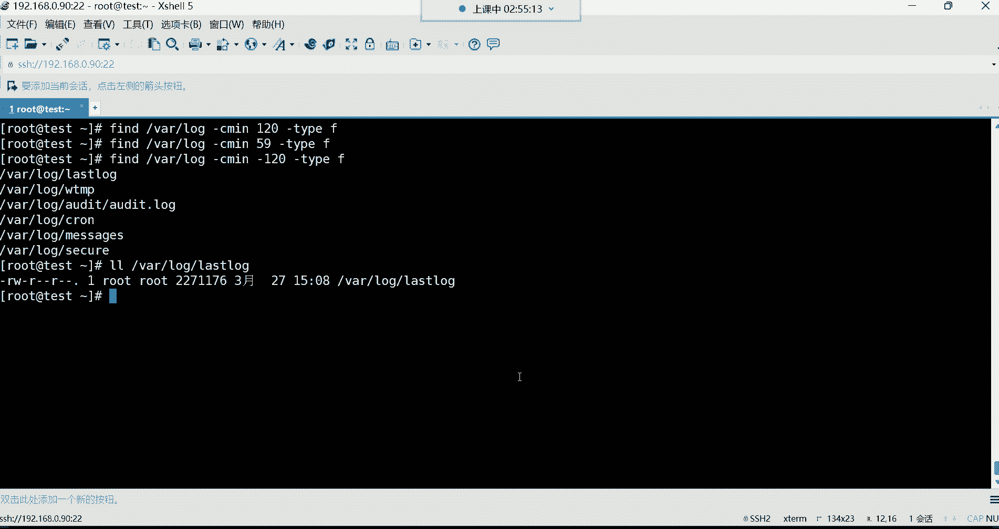

嗯。好。那。接下来呢我们。再来给大家讲讲它的一个完整命令格式哈。其实它的完整命令格式我们前面。😊。

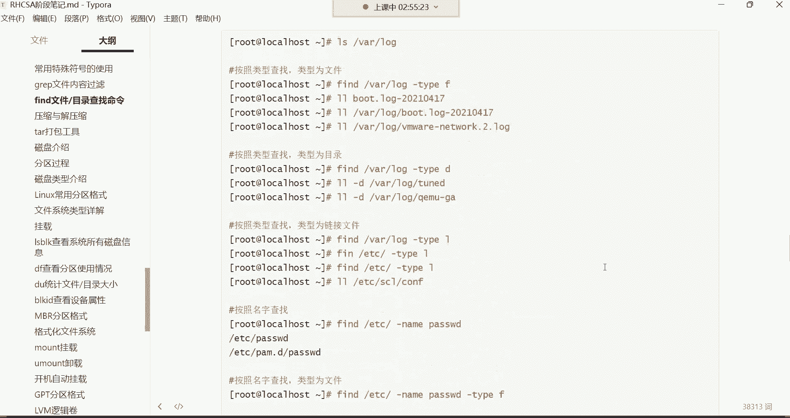

在这儿。

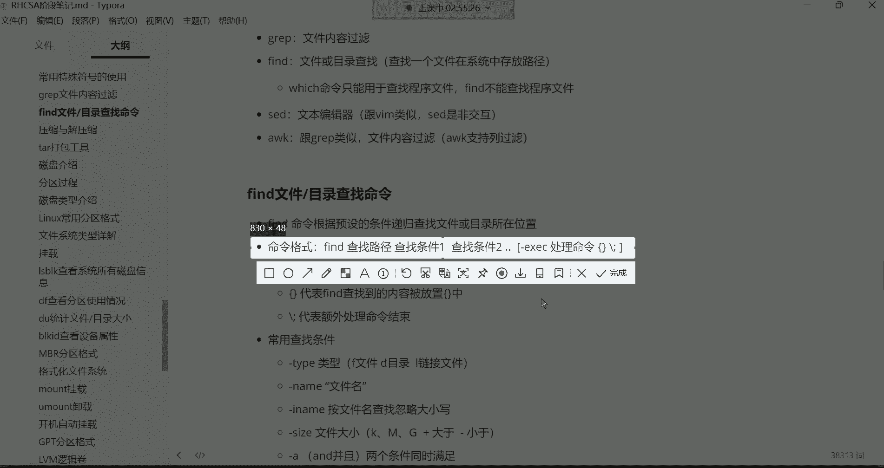

这是他的一个完整命令格式。这是完整的命令格式。

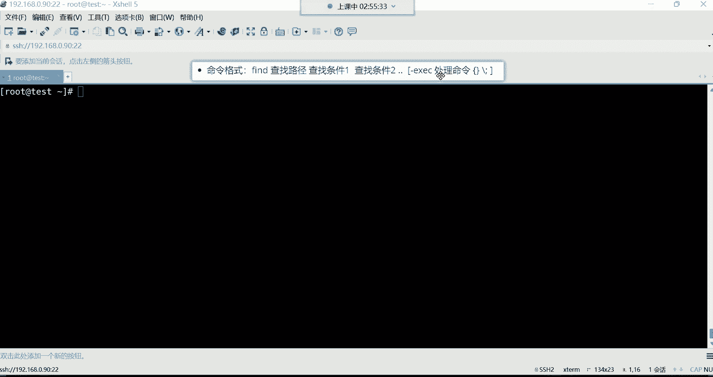

这个完整命令格式呢。他有一些操作。

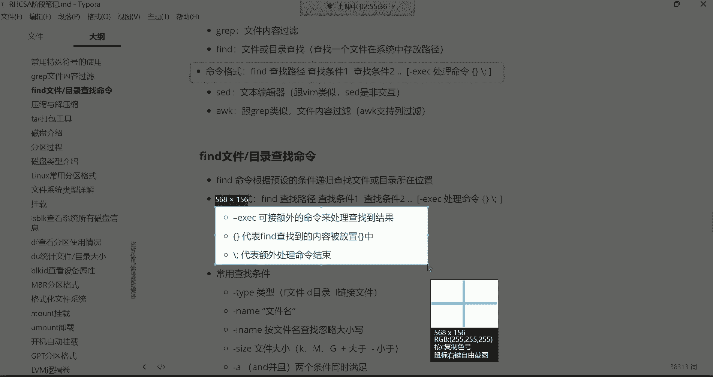

这几个操作。我们得给大家说一说。就这几个操作哈。呃，他的这几个操作呀，那前面呢我们一直在用是吧？就可以跟很多的查找条件嗯。嗯。那是必呃，不是啊，它就是一本书啊，它是一本书，一本电子书。

然后这个呢是什么呢？这个是额外处理。你就比如说我们现在。😡，我条件已经出来了，我这些文件都是两个小时被两个小时之内被改的。我想做个备份。😡，我想给它拷贝到一个目录里面，给他备份一下怎么办啊？

我们给它备份到哪里了吗？OPT我们清空一下吧，好吧，把OPT这个目录给它清空一下。然后呢，我现在就把前边查找出来的这些文件给它备份到OPT好，那这时候怎么备份？我可以接管道吗？CP。拷贝到OPT回车。

你发现不行。啊。尖9号是吧。OPT。你这是啥呀？你这是把文件名，对，你是把文件名给它保存到这个OPT目录吗？😡，啊。哼这哪有这哪有这么操作的呀，你说你这操作他。😡，你这操作你想干嘛？

你说你是想把文件名给它保存到这个OPT目录，还是想把文件保存到OPT目录啊？😡，这个尖角号这大于号，它这个功能是什么来着？这功能是将。输出的结果保存到一个文件里边，是不是？😡，哎，保存到一个文件里面。

那你说你这个尖角号，你直接什么叉叉OO。😡，这什么操作呢？这是把文件名。😡，以及路径保存到这个文件里面去了。但是我要的是那个吗？不是我要的是。😡，文件的内容。啊，我要内容，整个文件我做个备份。

我可不是说要文件名哈。😡，要文要文件名，你可以这样玩，但是。不是这样子的哈，不是这样子的，所以这边操作不行。哎呦，这怎么又来一波啊？好，找出来了，找出来以后MV吗？😡，好，那咱说管道给MV是吧。

移动到OPT目录。不行。诶。是不是？😊，那你不接合管道肯定不行，你后面不可能接MV的哈。😡，你发现这就不行了。是不是？哎呦，这怎么办呢？有这种需求的话，注意哈，他不犯的命令啊，对管道支持不友好。

对对管道的支持不友好，你可以这么去理解吧，可能是。开发犯的这条命令的人跟开发管道功能的这个人，这俩人可能说。有些不太合啊，可能这是汤姆是吧？这是老王开发的，没事，经常经常去他家修管道。所以说呢这两人呢。

就是这个可能说这确实是哈有有你就不能有我啊，反正不能共存啊，就这意思啊，反正范的跟管道他们两个。😊，啊，不是很友好哈啊，生死大敌。对。Yeah。😊，那怎么办呢？啊，所以这个f的命令啊。

人家开发者人家也直接给你研究出来这么一个功能了，叫EXEC哎，你用EXEC可以接额外的命令来处理他帮你找到的结果，你别用管道。😡，啊，我跟我跟管道服。不合啊，所以EXEC就可以了。然后呢。

这时候我们就可以后边接额外的命令了哈。那这个命令。😊，我也可以接CP。啊，给他拷贝拷贝哈拷贝到哪里呢？注意。😊，这个ESEC后边跟上一个处理命令以后呢，还要接个大括号。大括号大括号什么意思？

就代表犯的查找到的内容，先给你存放在这个大括号里边。啊，就找出来这些文件给你放到大括号里边。😡，然后呢，我CP命令干嘛呀？拷贝大括号里的查找到的内容，拷贝到哪里呢？拷贝到OPT目录。然后空格注意哈。

左斜线分号。代表额外处理的命令结束了。回车就是你再看OPT回车，哎，这文件拷贝过来了，看到了吧？所以你看它这个完整格式，如果你真的是需要后期处理的话，处理它查找到的结果就必须得是接这个中括号里的命令。

哎，ESEC后面就接你想干什么事了，然后呢。😊，大括号语法格式哈。还是管道好用是吧？其实用习惯也就一样了哈。刚开始接触的时候可能觉得不好记是吧？😊，没关系啊，用习惯就可以了。OK备份了是吧，哎，备份了。

😊，这就不难了。那后期你说我想把这个文件给它移移走移动怎么办？那是不是就换命令啊？MV。😡，是不是啊就移动了啊，你说我删除是不是就换RM啊？😡，没错吧，但你删除后面就不能接目录了吧。

是不是删除就是把大括号里边的查找结果都删掉，就不能接目录了吧。你接个目录，你说这命令它就蒙圈了，这到底什么意思啊？删除以后啊，给个OPT目录，这到底要干嘛，看不懂了啊，所以删除的时候就不要接目录哈。

你要拷贝移动，你后边给个路径啊，这样就可以了。😡，OK好，这是。它的一个完整的命令格式，这是fin的。

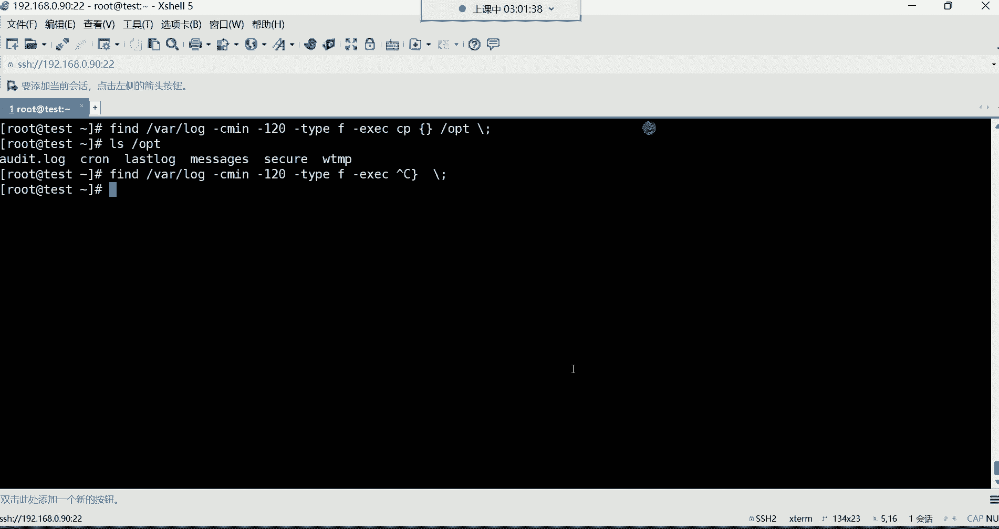

呃，然后呢呃对于这个这条命令来讲呢，我下边呢也是给大家留对于犯罪命令啊，我给大家留了一个题啊，这个题的话呢。啊，这个呢不用说了哈，前面给大家讲过了，如果你想查找ETC下面以点com复结尾的文件。

我只要你在ETC这一层去找LS就可以实现了。LS只在ETC这一层跟上星点com。😊，看呃。清空日记内容实现不了是吧？嗯。不行啊，他对那个大于号。呃，如果接Ile的话也不行。不允许哈。不允许。

不是说不允许就失效失效哈。如果你说哎我们就要清空一个日志内容，比如说咱们找到了。😡。

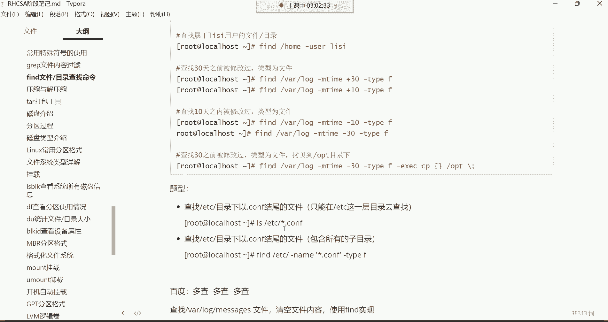

比如说我找一些日志文件哈，范的。😊，从rap下的log去找。找什么呢？找大小杠ss大小超过。10K的啊或者十0兆的吧文件。类型是文件的。哎，这个舌兆太大了是吧，咱们就。10K吧，那就10K吧，行吧。啊。

这些文件的内容咱们就假设哈啊就非常大，我要给它清空一下了，太占用磁盘空间了，也用不到日志文件嘛，删了也无所谓好，那这时候呢。😊，找出来以后呢，我想让你把这个内容给我清空一下。

那节约一下我的磁盘的空间怎么办？就是你说文件我是找出来了，但是我怎么把文件内容清空，这时候得额外处理了是吧？EXEC。😡，啊，就是很多人说了，那我直接来一个大于号是吧？我这样。😊，那代号就是什么呢？

就通过icical。挨过一个空。什么意思呢？就是我ele接大一号，就是我挨le一个空格，ele一个空格，就空行干嘛呀？😡，把文件里的内容给它覆盖掉。因为这个重定项嘛不是具备覆盖的功能嘛？

就是我往每个日志文件里面艾一个空行。😡，然后把这个文件里面原有东容给它覆盖掉。有时候这个文件就等于说被我给清空了。😡，就这意思。但你看这种操作。他没用。你现在再把这个文件拿过来，你看它大小的时候。哎。

是不是还是原先的大小啊，不行，那怎么办？哎，他可以让你这样玩。😡，啊，你这样不行，他可以让你这样CP。拷贝拷贝什么呀？把大括号里面查找结果拷贝到。这样啊。

我这样我把DV下的一个叫n的这么一个文件内容拷贝到我查找到的每一个文件。那边去。对啊呃这个DV这个目录这个n我们后面会讲啊，它叫一个什么叫黑洞设备。😊，这个这是一个什么呢？是一个设备文件。😡。

给大家来大家看一下啊，在DV下边。us打开DEV。啊，有一个n。这也是一个文件啊，但是一个黄颜色的设备文件。这个设备文件有个特点啊，是你可以把它理解成是lin呃这个linux系统的一个垃圾桶垃圾桶哈。

😊，啊，就是比如说我想把哪些数据啊给它扔掉。😡，你就可以扔到这个垃圾桶里边，一旦一旦扔到这里边，数据就没了啊，是一个无底洞哈，是一个无底洞啊，黑洞黑洞设备。😡。

你看这个你看这个太阳系里边有一个黑洞设备是吧？只要一到黑洞里边，这东西就没了，消失了。所以你可以把它理解成是一个这个系统的一个黑洞啊，只要。文件内容一扔到这里边就消失了，消失不见了哈。😊，好。

那我们说这个设备。它本身就是空的，这里边没什么东西哈，所以我现在可以这样玩。😊，啊，我CP我把这个文件的内容干嘛呀？😡，拷贝到这个什么呢？查找到的每一个文件内容里面去。这里面本身就是个空的。然后呢。

我拿这个空文件的内容覆盖掉。😡，这些文件的内容。这样可以。你这样的话呢，你再看哎，没了，0大小为0。看到了吗？你现在随便再挑一个文件。你看。啊，当然我们说度哈度统计它。你看大小都为零了是吧？哎。

这样可以。所以如果你想清空一个文件内容，可以调用这个叫黑洞设备。就可以了啊，当然这个我们后边也会详细介绍，因为现在还没有到那个阶段啊，在讲磁盘管理的时候，我们其实还就会给大家介绍这个文件啊。

除了这个文件以外，还有别的文件呢，也是类似于这个功能吧，文件。😊。

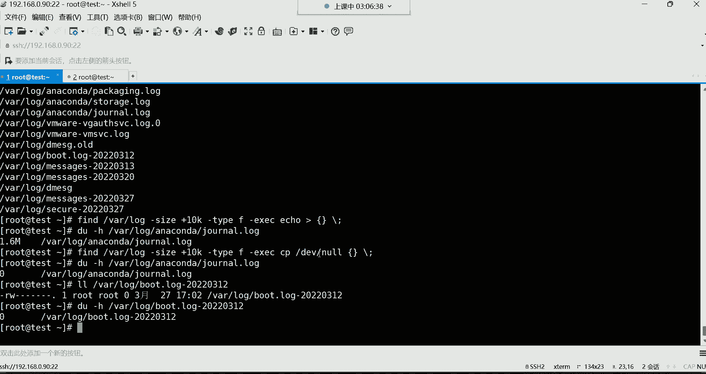

只要呃把什么东西扔到这个里边就消失不见了。啊，所以这个我呢也是给大家留了这个什么呢？这个这个题哈，就是查找啊查找这个文件，查找以后呢，然后清空文件内容看到没使用fin的实现啊。

查找以什么结尾的清空文件内容，用fin的实现就是。😊，用利用这个设备文件哈可以实现这个功。呃，这就是犯的已经蒙了是吧？蒙了很正常。嗯，晕计算嘛，不晕，怎么能叫晕计算呢，是吧？然后。行了。

那今天就讲那么多吧，我就估计再讲大家也吸收不了了，是吧？今天我们是其实我觉得整体没讲太多东西啊，讲了一些特殊权限，又讲了一些这个特殊符号啊，讲了一些gra跟 find的这两条命令啊。😊，呃。

这节这节课几着发录屏啊，一会儿下课就发下课就发。然后今天的内容呢，大家要掌握的都哪些呢？😊，这两个。😡，两个哈特殊符号里边呢这个星号跟大括号。😊，这个里边哈星号跟大括号呢。

大家要掌握gd命令要掌握犯的命令要掌握，这是常用的哈常用的。😊，然后是把。

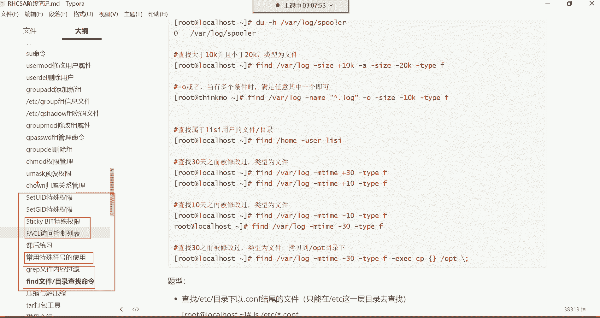

需要掌握的呢，我们大家下去以后呢，就要多多练习。

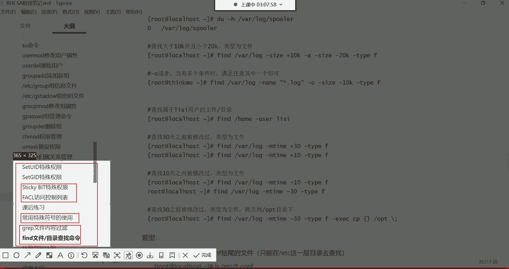

我没有框起来呢，你可以作为一个了解内容啊。可以。啊，可以保留一下哈这个。对。嗯。呵呵。呃，对哈，晚上敲一敲是吧，练一练，然后我也把这个图呢给大家。😊，发到这个什么呢？发到这个咱们这个各大的群里边。好。

过去了哈。行嗯。这种东西呢就多敲多练，没有什么。😡，太多好的方法。你敲他十遍八遍的，你手形成记忆了，你自然按就记住了。你看一遍听一遍，你发现哎呦，当时明白了，一会儿就忘。😊，好了，录屏停掉吧。

我们今天就给大家讲这么多，okK吧嗯。😊。

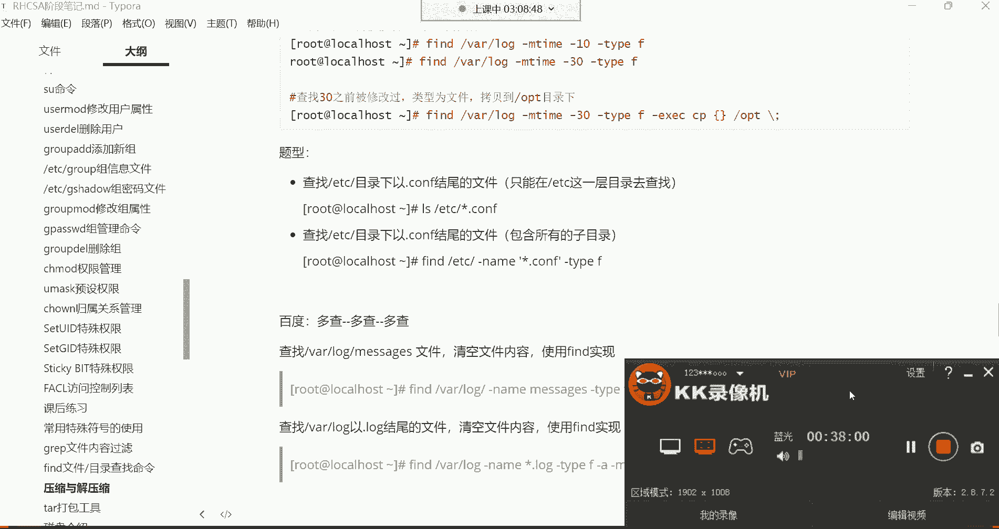