# 零基础入门Linux，红帽认证全套教程！Linux运维工程师的升职加薪宝典！RHCSA+RHCE+中级运维+云计算课程大合集！ - P25：红帽RHCSA-25.开机自动挂载、GPT分区、LVM逻辑卷 - 广厦千万- - BV1ns4y1r7A2

好，那我们就继续开始了哈，咱们。😊，今天该讲哪一部分的内容了呢？我们今天该讲这个。

还是继续讲磁盘。我们昨天这个磁盘讲到了这个挂载，然后卸载呢我们昨天也涉及了一点点是吧？那接下来我们在这儿来说一说这个我们昨天。

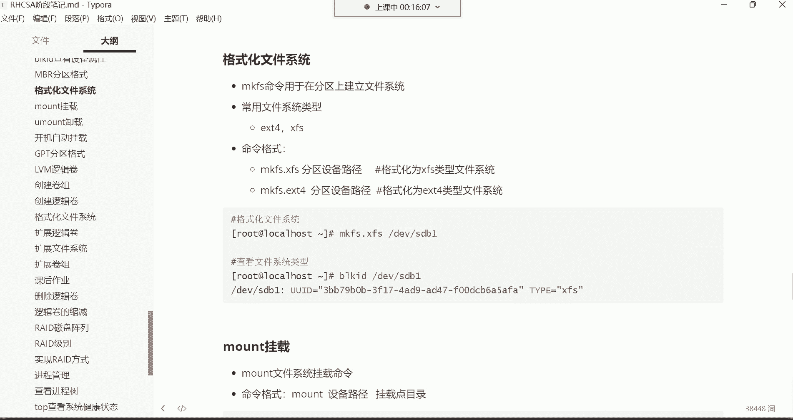

来看一下哈，我们昨天添加了那几块磁盘，用LSblock这条命令呢可以显示出所有的磁盘。哈你就拒绝了你的女朋友是吧？好样的，嗯，我们男人就应该这样子。😊，那接下来呢我们来看一看哈。

我们昨天挂载的那个目录呢，我们看一下哈，你看这是我们昨昨天分的那个区这几个分区是不是啊？但是你看那目录呢这个昨天我这个SDB我是不是挂载到一个目录上面了呀，但那目录呢？😊，呵呵。😊，我看下目录在不在哈。

😊，这目录在呢哈，你看跟下的DBY是不是在这呢呀啊在这呢？但是这个为什么这个他自己卸掉了呢？😊，我跟你讲哈，我们昨天这个挂载呀。

我现在再给你们挂一遍mount指定把DV下的SDBE挂载到那个根下的是DB back这个目录是吧？挂载以后呢，这个目录里面有文件，这是我们昨天建的文件。😊。

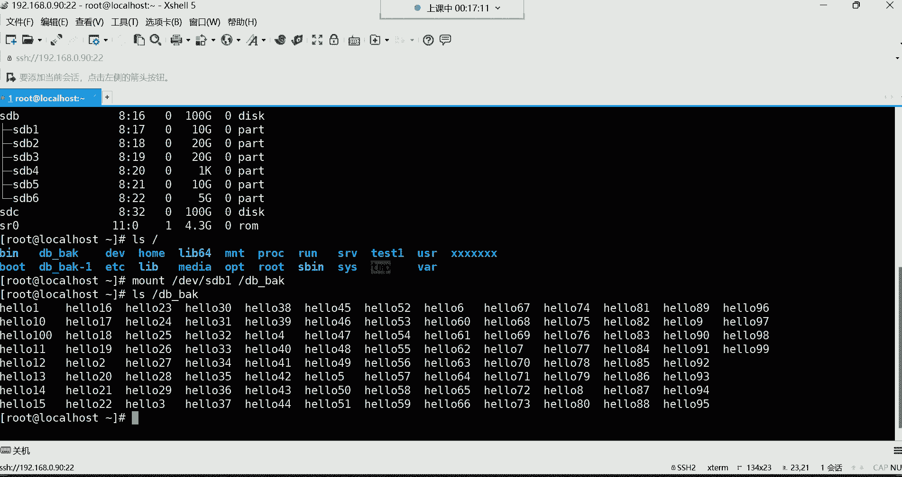

然后我给大家说说，我们昨天这种挂载叫什么挂载呢？叫临时挂载mountt这个命令啊是一个文件系统的挂载命令。而我们后期在学习这个软件包管理的时候，我们也会用到这条命令，然后嗯对，就是临时挂载哈。

没有永久挂载，那命令格式是非常简单的mount，然后设备路径挂载点目录，就是我要把这个词呃把这个分区挂载到我系统的哪个目录。哎，这个顺序还是蛮正常的是吧？😊，然后到此为止呢，我们来给大家做一个小总结。

好吧，这个总结呢就是我们。对硬盘分区再到最后的存储数据，我们经历了哪些个步骤呢？第一，咱们是添加了硬盘了。添加硬盘以后呢，我们怎么看呢？

用LSblock这条命令呢可以直接去看这块硬盘到底有没有被系统给识别到。然后接下来呢硬盘识别到以后呢，是不是开始分区啊，那划分分区用的命令是这个叫否跟上那个硬盘的路径就可以了啊，然后就对它做分区。

接下来呢就在里边一步一步的去划分分区啊分区有了以后呢，想要存储数据啊，是不是还需要格式化文件系统啊哎，这就是说得需要格式化文件系统，最后呢再做一个挂载的操作，这挂载你得先创建一个挂载点目录吧啊。

创建好目录以后呢，然我们再挂载用去挂载就可以了。最后呢查看分区的使用情况，是不是DF杠H啊这个T的话是也可以顺便把那个分区的文件系统呢一起给它显示出来。哎这个我们昨天并没有用到是吧啊。

就这样DF杠H加个大T就可以了。😊。

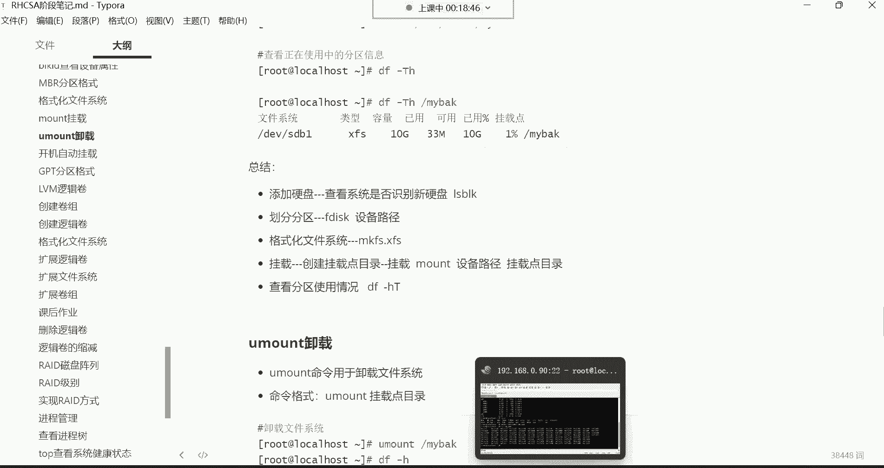

这样呢它是把所有当前系统正在使用的磁盘信息给我们列出来以后啊，这个这个位置还多了一个文件系统的类型，就是哪个分区用的文件系统是什么类型的，这时候呢，他们就都给你列出来了，你看这有的目录。

你发现这有的目录怎么文件系统不太一样啊？哎，它这个文件系统，我跟你们讲哈，就是分区是有自己的文件系统的。你比如说这个像我们自己挂载的这个分区，还有这个自己挂载的这个还有根目录。

像这种哈这种是正常的普通的分区，一般呢会用这种叉FS类型的文件系统。而有的这个属性它不一样。你比如说像DV这个目录DV这个目录放的是什么呀？比们说一般都是硬件设备是吧？

硬件设备呢它是有自己的文件系统类型的啊，像什么DVF，还有像这种这个有一些这个我看哈，你们找找。嗯，像啊布头都不算了。差不多吧，像这些文件系统类型呢，呃这个你不用去纠结，这是系统啊，它自己去分配的。

所以这个呢你简单了解一下就行。这个我们平时用不到的这些文件系统我们是用不到的哈，我们用的话就会用这个I叉FS。😊，这是我们在分区的时候啊，我们手动去格式化就可以了。好。

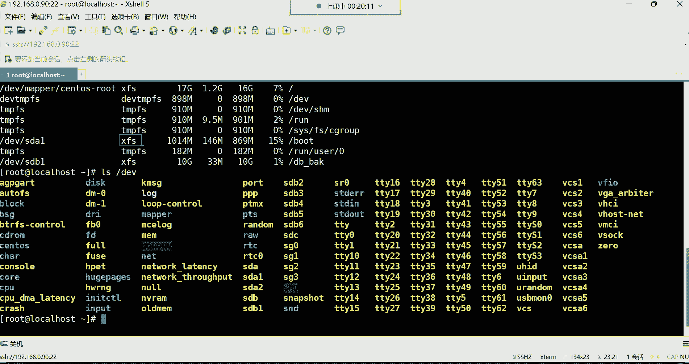

那下边呢我们。对于这个卸载的命令啊，我们前面说这个挂载，这挂载叫临时挂载是吧？临时挂载就是它的优点就马上就生效了。你这样看的时候。

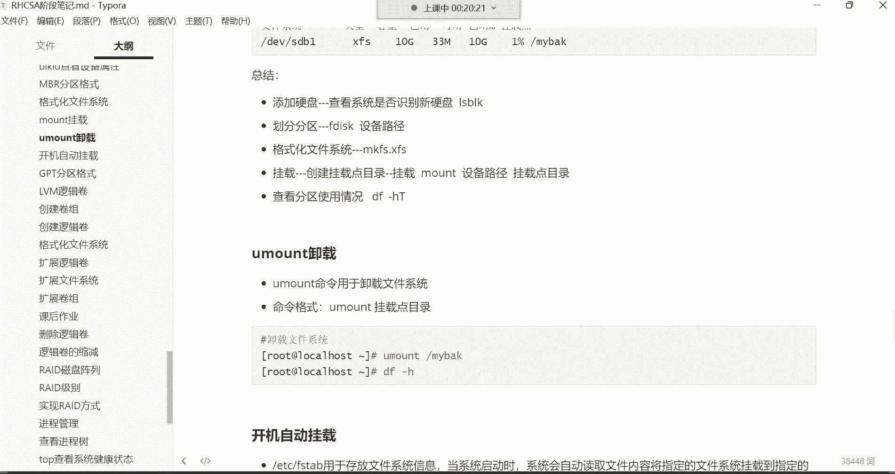

它马上就生效了，就直接就给你挂载上了。但是缺点是什么呢？就是我们这个机器啊一关机，哎，下次再重启啊，这分区就掉了，这分区就自自己就掉了哈。那掉了以后可不行啊。

那接下来我们要给大家设计的要设计一个叫做开机自动挂载。😊。

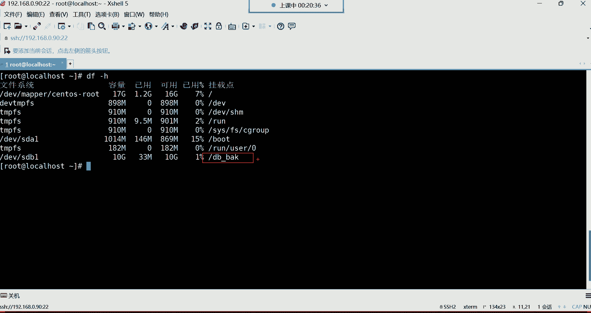

这个开机的自动挂载就是我们想实现这个服务器啊。开机以后，能不能够自动的帮我把我想挂载的那些分区给它挂载上啊，我不需要再去手动敲个mount命令了。哎，这样呢也是可以的。

这种呢我们就叫做就叫做开机自动挂载。那我们需要去修改它的配置文件。这个文件呢我们前面已经练习过很多次了。在ETC有个叫FStable这个文件，用于存放文件系统信息的。当系统启动的时候。

系统就会自动读取这个文件的内容，将指定的文件系统挂载到指定的目录去。说白了。

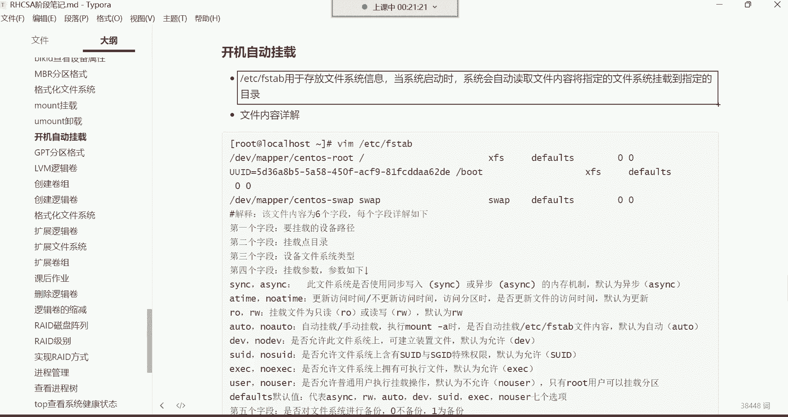

就是做开机自动挂载的，打开ETC的FStable这个文件。啊，我们没有V嗯没有VIM吗？啊，算了VI吧，那就ETC下的FStable。打开这个文件以后啊。他这个文件就是让我们做这个开机自动挂载的。

我看这里面他是个有没有详细的介绍哈啊。😊，叫可以访问的文件系统，根据参数维护在DV下的DK这个路径下边啊，这个呢可能确实是这个。读读的不是很读的有些，我们说叫稀里糊涂了是吧？我们就看内容吧。好吧。

因为他这个介绍的话，你看他这个介绍确实是。😊，什么你你们看到了吗？😊，嗯，水有水蟒在3月日创造是吧？这个咱就。😊，别理解这些东西了哈，咱就说这个下我们就说有用的配置哈。

有效的配置几行呢现默认情况下就三行。然后这三行的话呢，第一行是什么呀？第一行就是我们的根目录，我们的根目录哈，就那个挂载信息也在这个文件里面呢，第一行放着呢？它这个格式我们怎么去什么呢？

怎么去解读它这个配置文件的格式呢。😊。

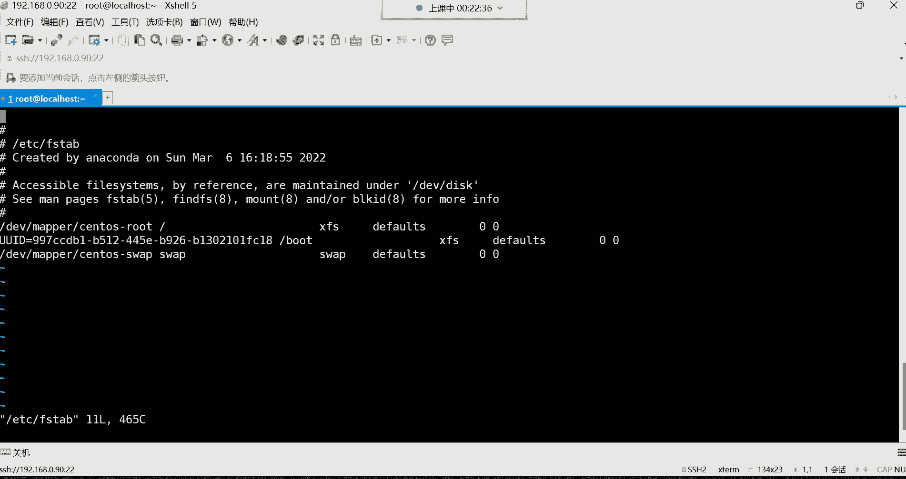

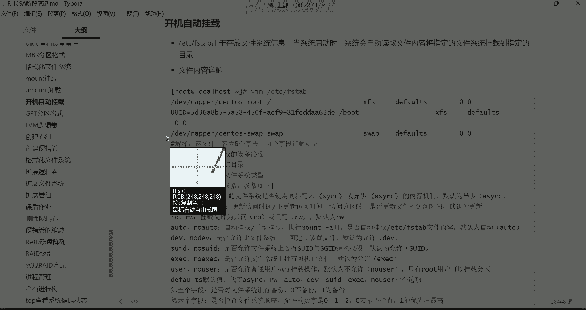

他这个每每个字段都不一样。我们拿过来。

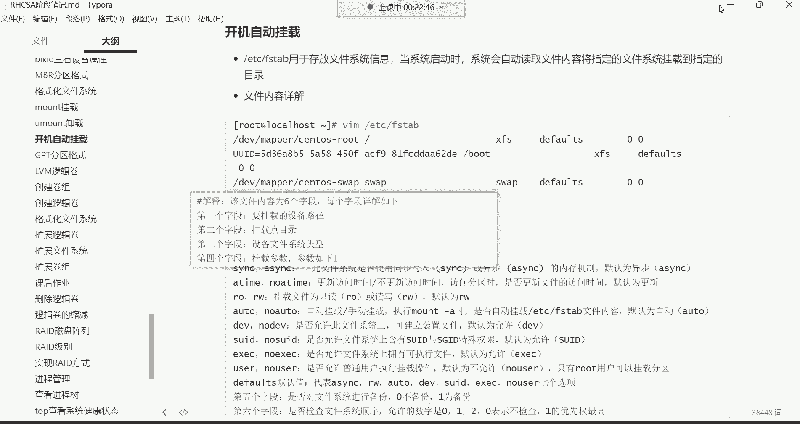

他这每一行呢就代表一个自动挂载的参数，我们放到这儿哈，放到这儿。咱们来看一下。每一行啊都是一个挂载的参数。然后呢，我们拿第一行来说，这个第一行啊，它是分字段的啊，当然也就是列的意思哈。

然后我们从左往右数，它就是用空格做了一个分隔符。那总共这有几部分呢？看看这算是。一部分啊，这呢又是一部分了。第三部分第四部分。然后第五部分。第六部分，那也就是说这个文件里面每一行总共是有。六列有六列哈。

那每一列是什么意思呢？我们先从第一页从第一列来给大家说。第一列就是我要挂载的这个设备路径。我要挂载的设备路径，就是说我想对哪个分区。挂载，那我们自己在下边往下写就可以了。我要对DEV下的谁呢？SDBE。

做挂载好，挂载到哪个目录呢？主这里边就不要敲mount命令了哈，这里边你不需要敲mountom命令，它会自动帮你找到这个你的你想挂载的设备，自动帮你挂载上的。

所以没有mount命令可那一说哈就指定设备路径，然后呢再指定。😊，第二列第二列就是我的挂载点目录，就是我想把这个分区挂载到哪个路径下面，挂载到跟下的DB bike这个目录。那这里面就不能配不见了哈。

你只能手写了。好，那第三列这个就得你指定这个你就得指定你这个分区的文件系统类型了。这就是你在格式化的时候，你格式化的那个文件系统是什么，你就写上去文件系统呢是叉FS类型的。好，这是我们格式化的时候。

叉FS类型的。好。接下来呢第四列呢这个default这default就是一些挂载的参数了，这个参数都有哪些呢？这个参数可非常多了。在这个里边哈，我们说一下。😊，这第四列。

你看它这个文件里面是用default来代表的是吧？那你知道这default它代表了多少个参数吗？我们一会儿再说，如果你不用default的话，这挂载参数啊从这儿开始。

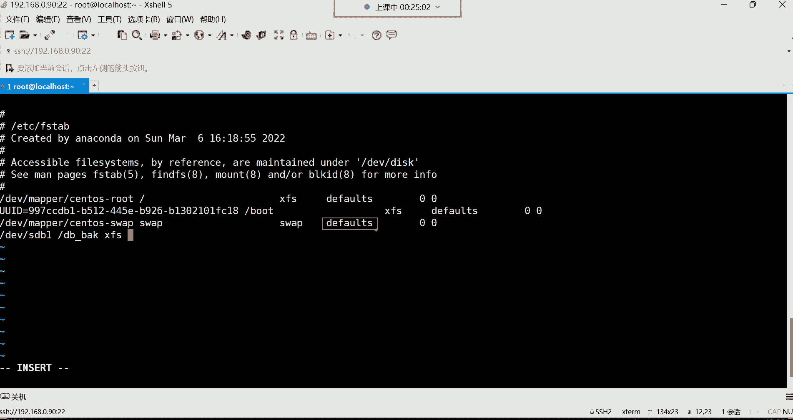

一直到这儿，都是候我们可以手动指定的挂载参数。这里边呢你看比如说像什么SYNC。这个就是用来表示，如果这个参数你指定的话，就是此文件系统是否同步写入或异步写入的这种机制，什么意思呢？

他这个东西就是作一个同步的机制。但是这个同步的话呢，我们一般呢肯定是就是选择默认的啊，就叫它默认是异叫做异步。他这个同步跟异部的关系呢？我怎么给大家解释呢？其实这个呃不应该放在这个位置解释。

因为这个位置解释有些乱啊，这个我们先不说哈，你就知道啊这个异步写入就可以了。😊，好，然后还有这个下面这些参数，比如说是否更新文件系统文件的访问时间默认为更新，就是别人。在你这个分区里边查看哪些文件的话。

你这个文件的时间要不要更新，要更新啊，还有像什么RO阿达这个RORW挂载文件系统的时候，你这个文件系统的权限是什么权限啊？RO呢就是读写权限。啊，sorry哈RO是只读权限。RW呢代表是读写权限。

然后一般呢我们都是默认的读写权限。如果说没有写权限的话，这个文件你也存没有办法存到这个分区里边。能理解吧。所以像这种的默认即可。还有像这种这个凹凸。啊，no two什么自动挂载，手动挂载这些东西。

你在执行这个mount杠一的时候，这个我们后面会讲这个命令啊，是否帮我们自动挂载这个文件里面的一些内容。默认呢是自动的意思。就你一执行这条命令，它就读这个ETCFStable这个文件。

然后帮你把没有挂载的设备呢给你挂载上。那这些你看是不是都有一些默认的参数啊？所以说像这些总共多少个呢？12345678总共是8个参数。这8个参数。如果说你想手动指定的话，比如说呃我希望我这分区。

不能往里边写入的话，那你可以手动指定这个RO这个参数啊，用逗号隔开就可以了。当是我们有我们能这样做吗？我们不能这样做吧，我们肯定是要干嘛呀？我们肯定是要让这个分区能够存储数据用啊。

所以这所有的默认参数都是标准参数。那这些标准参数我们怎么去写啊，难道手动的一个一个写上去吗？什么SYNC，还有像这些什么RW凹 two，然后中间每一部分用逗隔开吗？我们需要这样子吗？😊，不需要。

有一个默认值叫default，这个default就是代表所有的参数的一个默认值。就以上这些参数，它的默认的值是什么？我de就全都代表了。所以你看这个配置文件里面，这个deult。

你可以把它列解成是所有参数的一个标准参数的一个代表方式。所以我们在用的时候呢，也就是。

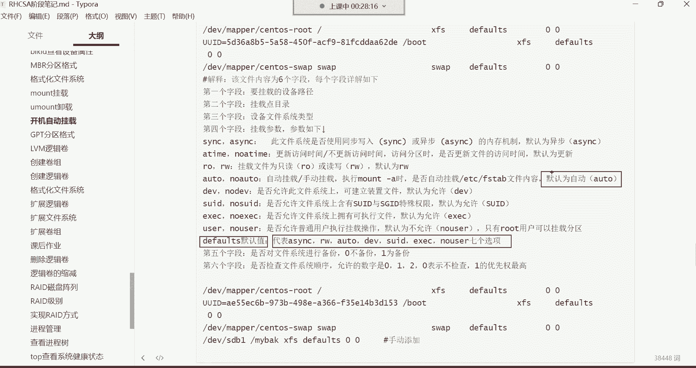

Default。啊，代表。用所有参数的默认值就可以了，能列吧？然后那这后边两个零是什么意思啊？你看它后边都有两个零是吧，这两个零呢。

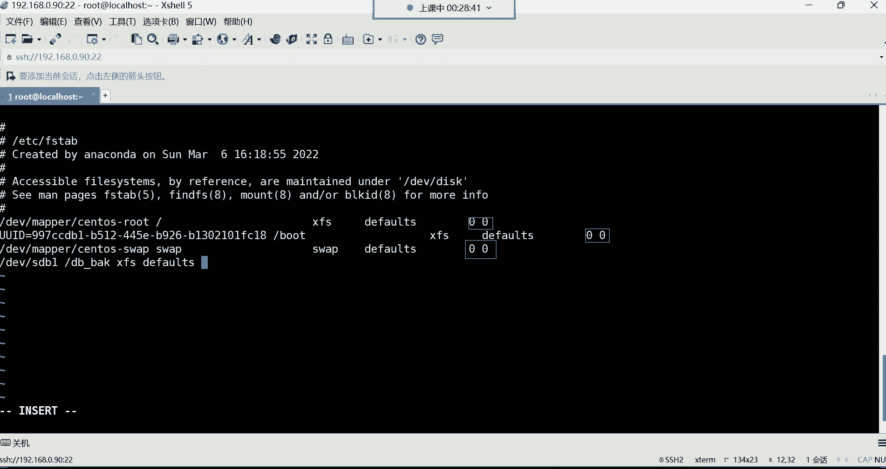

我们先说第一个0。也就是说第五个第五列。第一个理由叫是否对文件系统进行备份。这零是不备份，一是备份，什么意思呢？就是这个分区啊，这分区咱们不是用来存储数据的吗？那这个分区的数据存进去以后。

我要不要对这个数据做一个再做一个备份啊，但是这个备份你想做也行，但是我们一般不会在。

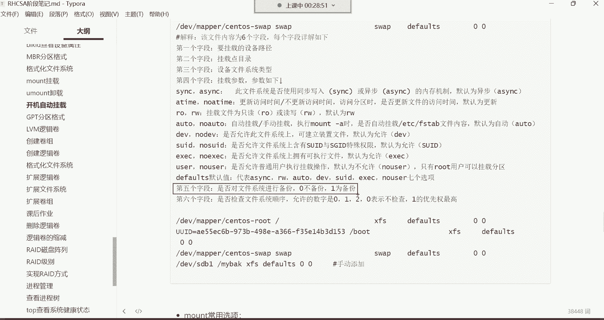

这个里面去做一些什么备份。因为在企业里面你想备份的话，我们一般会自己单独去。比如说我是在企业里边可能会有一个单独的服务器。这服务器呢是专门用来做数据的备份的。然后你可以把这个数据啊哎给他。到时候你给他。

传到专门的备份服务器里面去做一个备份，你这种备份他也没有必要啊，你怎么备份，他不都也是对这同一个分区来的数据做备份吗？啊，也没有那个必要。所以一般的这都是零，我就不备份我的文件系统了。然后下面那个。

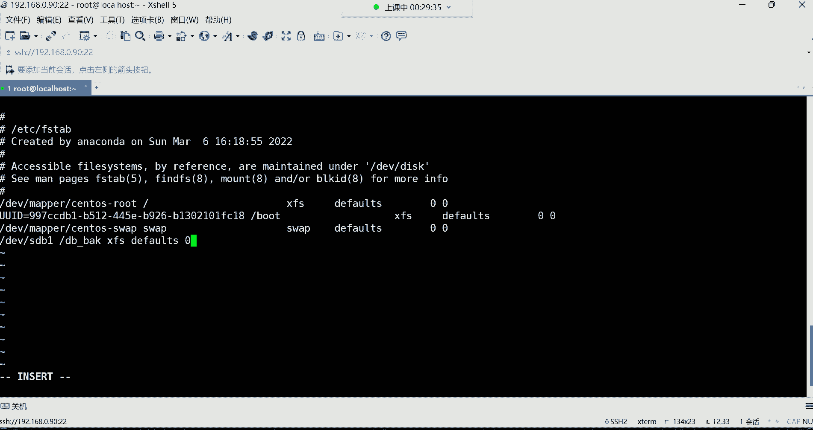

第六个第六列叫是否检查文件系统的顺序。它这里面啊什么顺序呢？他这个顺序就是。

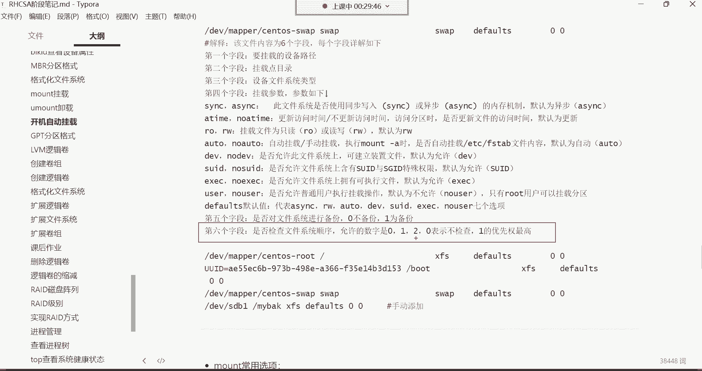

对谁先挂载。你看他这里面是不是1234啊，那我们自己手写的是吧，哎，1234，它里面有个顺序，它这顺序呢有个优先级，这优先级呢？😊。

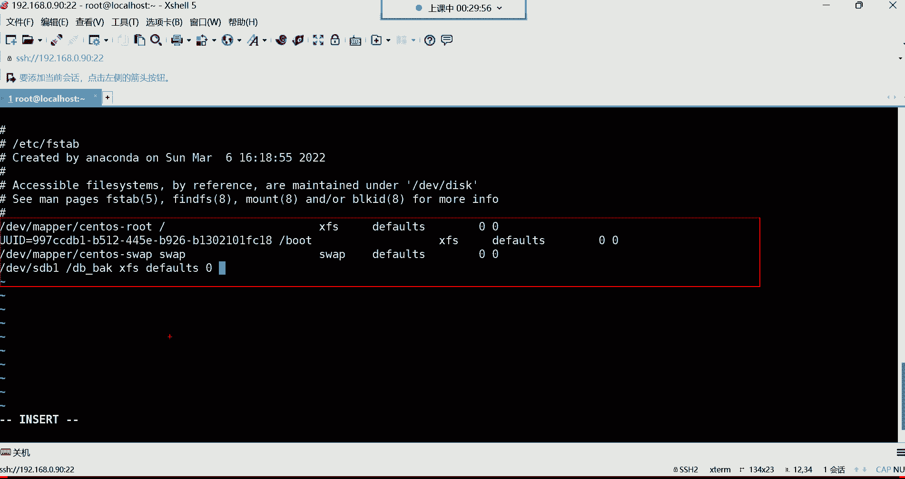

看哈允许的数字呢是从012开始，这零就代表不检查顺序。一呢就是一的U先级最高。它留元级啊我们一般不会去设置这个零就是说哎呀，我不检查我这个文件系统的挂载顺序怎么挂呢？就按照文件，你按照文件。

你看这不是第一行吗？它这里边哈，这是不是第一行啊？啊，接下来呢，这是第二行是吧？那没有顺序的话呢，它就是干嘛呢？哎，先帮我们挂载第一行，然后再挂载第二行，然后第三行，第四行。😊。

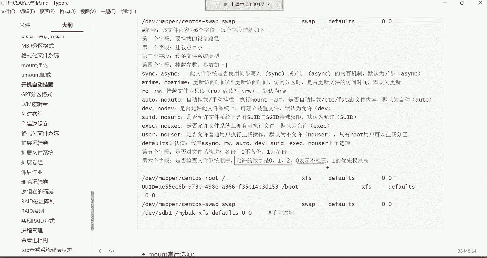

那这那这个顺序到底他填在哪里呀？就这个顺序。你永远都得是根分区，它的顺序是排在第一位的。因为你所有的数据都在根分区下边呢，所以肯定是不是肯定是要先挂在这个根分区的。你别的分区，你先挂载的话呢。

其实意义也没也并不是很大。因为你包括我们就这个目录，它是不是也在根分区下边呢？所以我们肯定要先挂在根分区哈。所以说这个顺序不检查的话，他就干嘛呀？他就优先帮你把根分区挂上，然后再挂在别的分区。

再挂在这个部分区，因为不的分区也是在根分区里边的呀。所以你看它永远得先挂在根分区，所以就不用检查这个顺序就可以了。从上到下这顺序，你别说老师我我把这我把我的这一行写到第一行可以吗？

你要把这个写写到第一行的话，那你就得要调整你的顺序了。这时候你就得调整什么顺序呢？这时候你就得调整。😊。

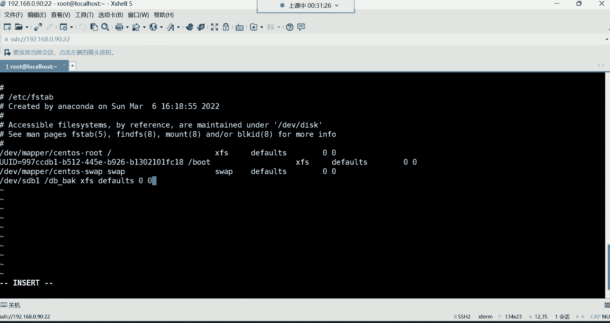

啊，一的优一的优先权最高，这时候你就得把这个。

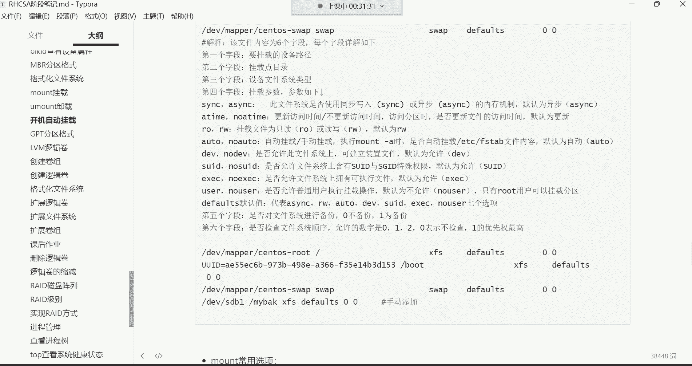

根分区的挂载，它的这个位置0，你要给它改成一，为什么呢？因为它一定要先挂在根分区啊，它这个优先级是这样子的。就以此类推了，012吗？以此类推，就是先挂载谁再挂载谁012嘛，因为11的月1是最高的嘛。😊。

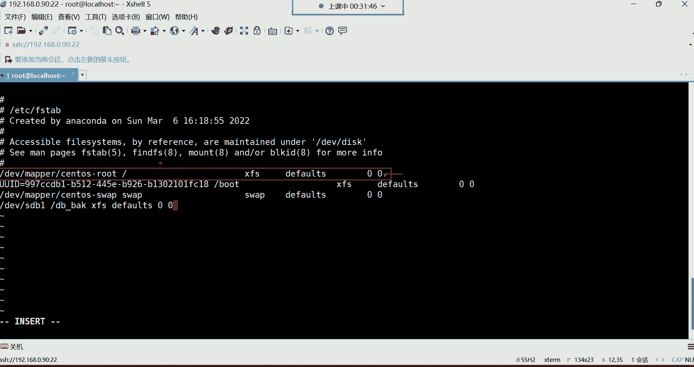

一是最高的0就不检查了012。所以说这种东西没有必要去。

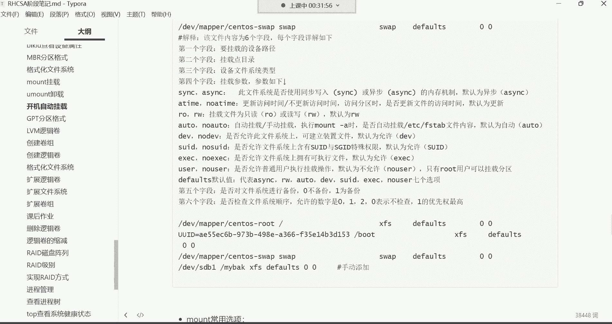

指定的哈我们不指定，所知道一下就行。那他这里面啊，你看。😊，他这里边只要你中间有一个空格就可以了。这个这个配置文件语法哈。但是如果你说老师，那我想按照别人的那个什么呢这个排版，我想让它对齐可不可以啊。

可以可以哈，这不就是空格嘛。比如文件系统跟文件系统对齐，然后这个挂载参数跟挂载参数对齐。😊，这两个零呢也让它对齐是不可以啊，也可以哈。如果说你这人，你说我就啊。😊，必须得这个让他看这样看着舒服一些。

也可以可以，但不对齐也无所谓哈。保存退出保存退出以后呢，这里边我们前面是不是涉及到什么一个执行mount杠一时是否自动挂载ETCFSP里文件呢？那接下来。😊。

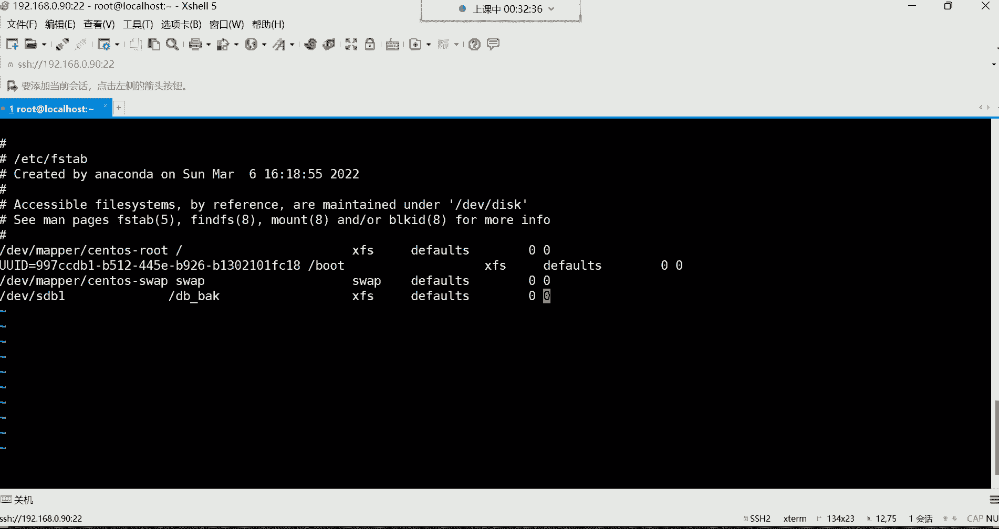

mount这条命令，它有一个常用的选项，就是这个杠一这个选项。杠A这个选项就是帮我们依照这个配置文件里的这个数据啊，将所有没挂载的那些磁盘都给你挂载上。所以这时候你可以用mount杠A。

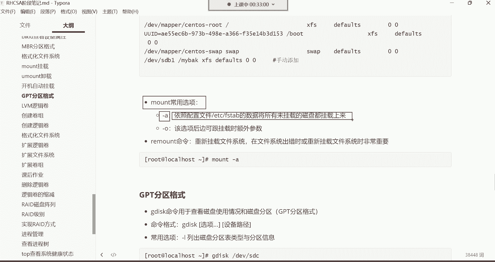

慢的干要，然后回车，这时候呢，他就帮我们去读这个文件里的配置了，一看哪些分区没有挂载，他自动帮你挂载。那你说老师我怎么能验证啊，我先给你们卸掉哈，我先邮。😊，mount咱们把DB back给它卸掉。

卸载了是吧？卸载以后呢，我再用mountt杠A注意看哈回车。DF杠H。那是不是挂在上了？是不是快到哪了，我再给你们卸一遍啊，看一下啊，you mount杠A啊。

sorry哈youmount BB back。😊，然后就是你在DF杠H是不是没有那个？是不是这个已经被我们这个挂在电已经被我们给卸掉了呀？现在看已经看不到那个目录的挂载了吧。好。

那这时候我再这样mount杠A。这时候你在我们在DF杠H看一下哎，是不是又自动挂载上了呀。就是这条命令会检测那个配置文件，一看哪些没有挂载，就帮你重新挂载上。

那一旦配置写到这个ETCFS table那个文件里面了。啊，对，一旦写到那个配置文件里面以后呢，那开机就是我这个机器关机了，下次又开机。没关系哈，它一开机，它就会读那个文件。

它就会自动帮你把那个分区给你自动挂载上。😊。

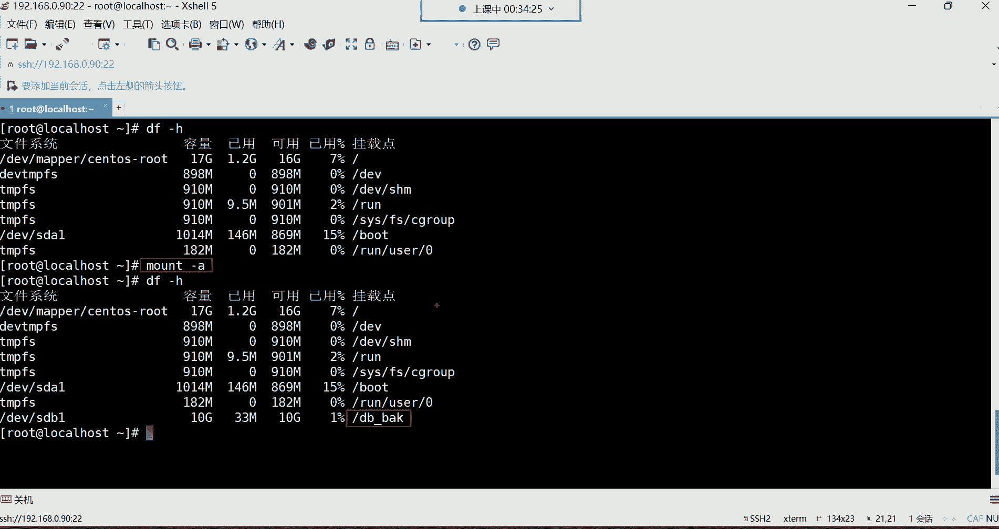

能列了吧啊，所以这叫开机自动挂载。这命令还有一个杠O，这个杠O这个选项后边可以跟一些挂载时的额外参数。那这个呢我们一般就是。在什么时候会去用这个杠O呢？就是我想修改一些参数的时候。

比如我这个咱们参数已经挂载上了，然后我想去修改的时候，mountt杠O后边可以跟一些你想修改的参数。那这个参数你就得从这里面去找。你比如说我想。

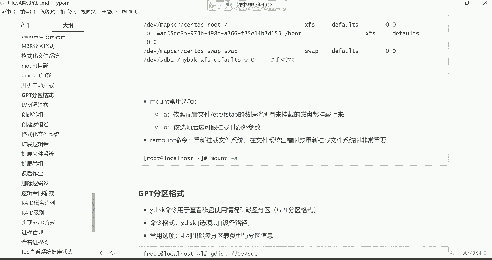

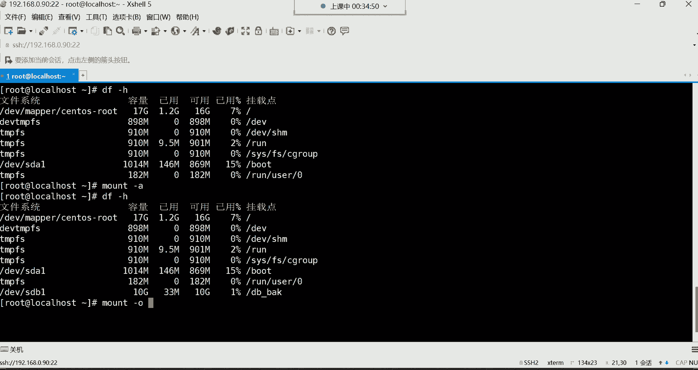

去修改哪些参数啊，这个到时候嗯。但是我我们现在用不上啊我们现在用不上。因为我们现在挂载的时候，我们都没有用过杠O。所以这杠O呢什么时候能用得上呢？这杠O一般在比如说。😊，你的这个机器。

如果有一天发现啊哎呦我的机器开机发现出现异常了。怎么异常了呢？就是。好像。嗯，是随机挂载空目录吗？不是啊，是你配置文件里面指定的哈，是你就是他这个是这样，他mon杠A啊，他他是帮你检测那个配置文件的。

帮你帮你检测这个ETCFStable。😊。

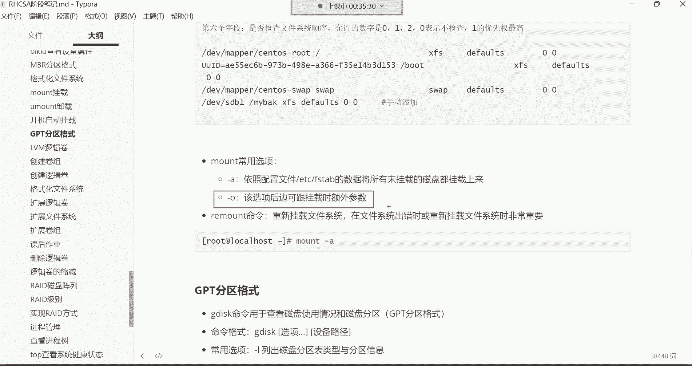

这个配置文件哈，所以他就就是检测这文件。他一看哈，比如说这个没有挂载，他就把你挂载上一看。😊，如果再有的话呢，他就继续帮你检测，继续帮你挂载。他是这么回事，他不是挂载空目录啊，你这目录即便有数据。

他也因为你写到配置文件里了，他也给你挂载。还这么回事。啊，把对对对哈，就把那个文件里的内容给你执行一遍。然么说一下这个杠O哈，杠O什么时候能用到呢？比如说有一天你发现你这个系统启动的时候。

好像出现异常了，无法正常进入系统了那可能是你系统里面的这个bo分区掉了。😊。

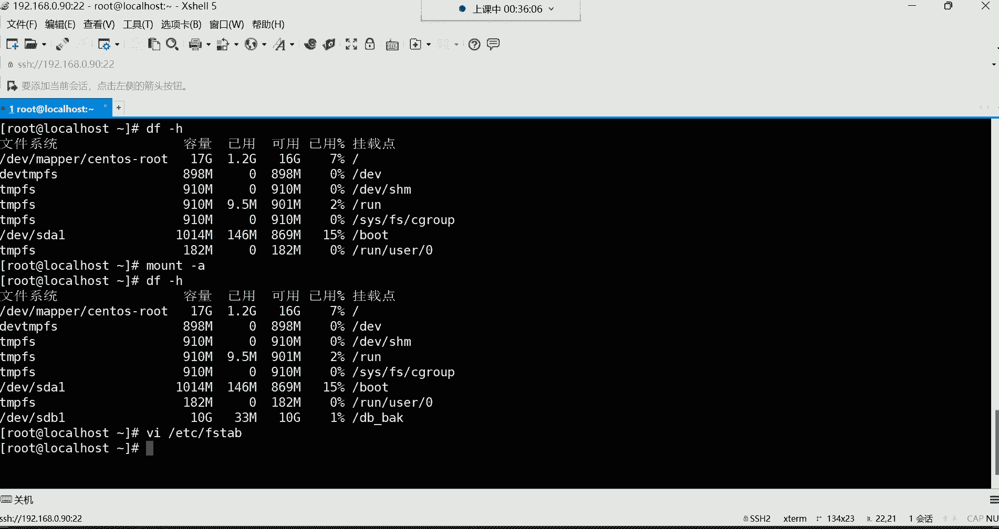

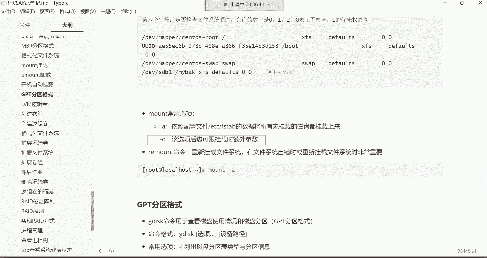

哪个部的分区呢？就是在这个文件里面的这个。不特分区它的挂载点可能是掉了。掉了哈，因为你的系统内核就在这个bot分区里边存着呢，这bo里边不就放一些内核的一些数据吗？跟一下的。不头看到吗？

这就是内核内核文件哈。所以说包括系统的启动程序，graph都在这个boot里边。因为我们咱们系统一启动，它首先要检测这个什么呢？g那个引导程序啊，他得这个先去检测，比如说这个硬件啊是否都正常。

然后他再去控制硬件，应该哪个硬件先启动，哪个硬件后启动哎，这启动顺序都得由gup控制。但如果有一天发现你这个机器开机，哎，无法正常进入系统了，那有可能是but分区的挂载点没挂上。不分区掉了。

哼bo分区掉了，所以就系统无法正常启动了。那这时候我们就得采用什么呢？叫做维护模式啊，就root用户的维护模式是吧，去进入系统，最后呢再把这个bo分区给它挂载上。

但这时候就得用到这个杠O重新修改一些挂载参数。因为默认。😊。

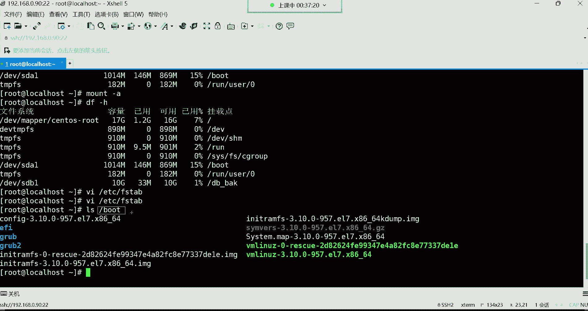

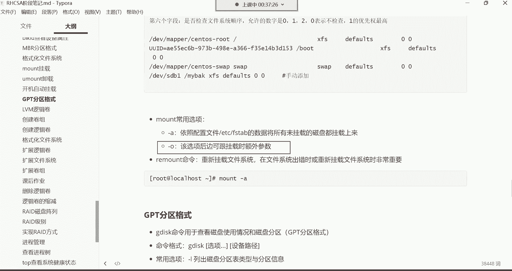

像这种参数的话呢，我们得去改改完以后才可以啊。但这个我们现在还用不到啊，我只简单给大家聊一聊啊，让你们知道这个杠O什么时候会用得到，正常挂载用不到的杠O这个。😊。

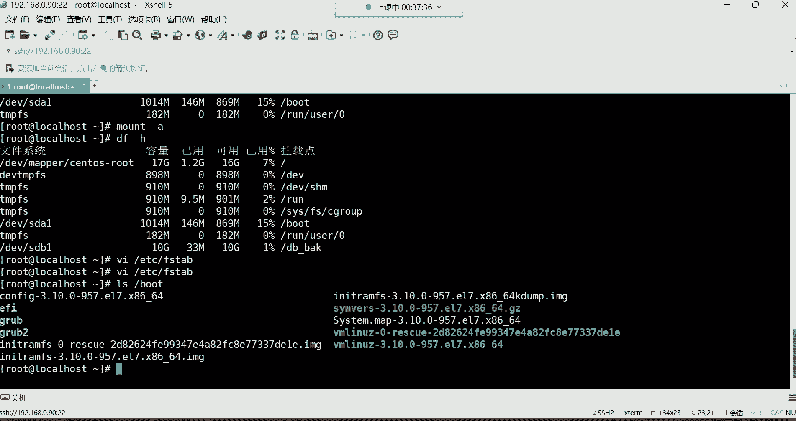

好，然后但是你用钢的时候。嗯。看一下啊啊，这还有一个remount是吧？remount叫重新挂载，这个我们也很少用啊，这一般就在文件系统出错的时候，或者说我需要重新挂载了啊，一般可以用的。

但一般用不到哈用不到。我如果用的话，你就直接给他卸掉就可以了。你看你卸掉以后重新挂载不就可以了吗？啊。就是我们所说的这个mount。所以对mount来讲呢。

大家常用的就是mount杠 Amount一定结合杠A这个选项，让它去。把这个文件里边的内容给我重新读一遍，然后给我挂在上。对，什么时候用mont杠一，就是你修改过ETCFStable文件了。

你修改过这个文件以后，你就得mont杠一一下。让他识别一下就可以了啊，别的选项嗯几乎是用不到的。好，那接下来呢我们再来给大家说说这个GPT分区。这个GPT分区。就是我们前面所说的。

可以最多允许分128个主分区，然后呢，支持的磁盘容量呢也是非常的庞大的那个啊，那接下来咱们我看看还有磁盘吗？

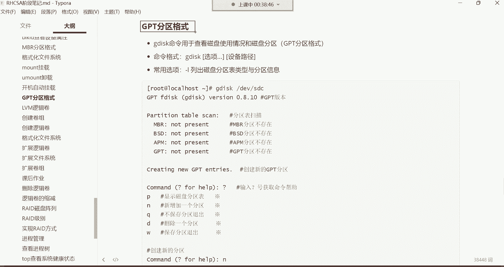

咱们还有1个SDC是吧？那SDC这块盘，我们现在就要对它做分区了。但是我现在要用GPT的分区格式去划分它。好，那这个时候GPT怎么划分呢？用的命称叫GDCK。😊。

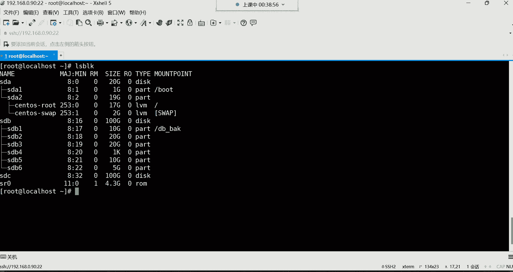

那前面那个。MBS的分区格式用哪个来着？叫否DCK是吧，FS。啊，FDISK。然后呢，这个GPT格式呢就是GD4KDISK那后边是一模一样的了哈，你指定我要对DEV下的DEV下的谁谁谁。

比如SDC进行分区，然后就在里面做操作就可以了。😊，命命令格式都一样，包括它里边的一些。我们在分区的时候，一些常用的一些命令也都是一模一样的。所以这个在学GBT啊，我们学完MBR分区格式。

再学GBT就非常的容易了。G。

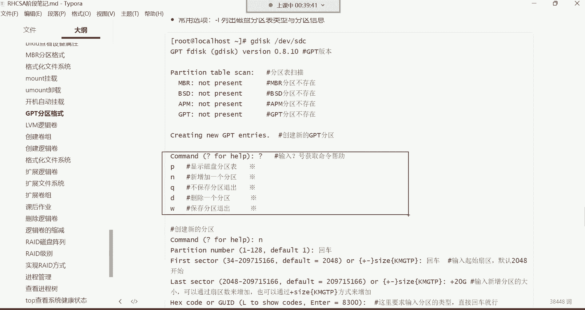

第4K指定我要对DE微笑的SDC进行分区回撤。啊，没有这条命令。那没有这条命令的话呢，我这样我搜一下啊。是不是pri后边跟上GD4K啊，这样。搜索这条命令是由哪个软件包提供的？好，由这个软件包提供的。

好，那我们是不是就直接用y杠Y。因此套把这个包给他安装上啊，即。第四K。好。安装好了吧。安装好了之后呢，我们就再对它进行分区GD4K把第一V线的SDC啊写上去分区。

在这个里边哈我们来说一说哈呃它这里边会有一些提示，但能不能看懂呢？创建新的GPT条目。😊，然后上边这些的话呢。来看一下哈，它首先呢会帮我们检测这个分区表。你看它这它是一个叫做分区表的扫描，这扫描什么呢？

就扫描在这个硬盘里边啊，有没有一些这个分区存在，有吗？没有你看什么MBR的什么都没有，是不是没有任何的分区存在，没有哈啊，那没有的话，那接下来我们是不是就可以叫创建GPT的分区了呀？

你看创建新的GPT分区那这个时候要command它在这个位置啊，它是干嘛呢？😊，叫命令命令的求助。他这个。啊，没声音了吗？啊，各位有有声音是吧啊，有声音啊，好的。啊，我们来看一下哈。😊，在这个位置哈。

我们说一下，你看命令求助他这个命令求助输入什么才能求助这个命令呢？得输入问号，你看到了吗？他这里边啊就是他跟那个。😊，MBR分格式不一样，MBR是M获取帮助是吧？这个是问号获取帮助。

所以这时候你输入一个问号回撤，这时候他就把这个帮助信息给我们列出来了。😊，然后他这里边你说这么多信息，其实跟我们前面那个MBR那个命令啊其实都一样。所以常用的呢也是那几个常用的就是那几个就少了一个M。

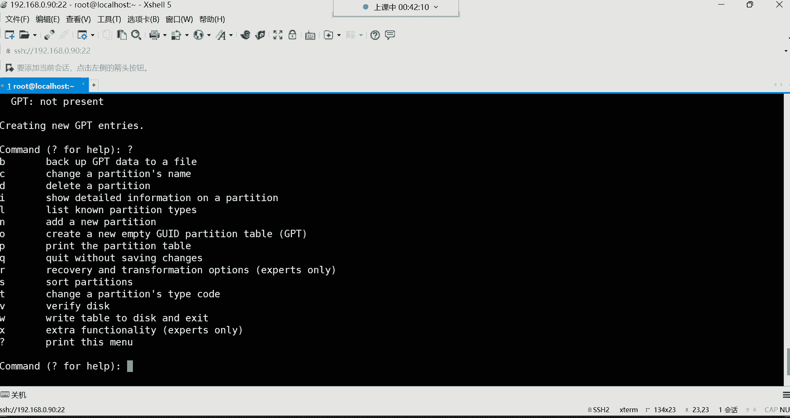

你就比如说在这里边这个PP正常来讲是显示磁盘分区表，那它这里边也一样。我们来看这个P哈。是不是叫输出分区信息呀啊，其实就是显示你这个磁盘有多少个分区。好，还有这个NN的话呢。

就是在这儿哈ADD看一下哈ADD就是添加一个分区的意思，在这个里边就是添加一个分区啊，还有什么呢？还有这个Q这Q的话来看一下。😊，Q叫做退出而不保存更改。这个就是你比如说我们在这个里边。

当然现在所有的操作是不是都在内存里边操作呀？然后如果说我们做了一顿操作，但是我又不想去什么呢？不想去保存了，Q就退出了，就不会对它造成任何的改变。😊，啊，还有像这个D这个D的话呢。

我们在这哈那dele这dele一看就明白什么意思叫删除分区删除哈，删除W就是保存了。在这儿。😊，保存并退出在这里边是看到了吗？将表写入磁盘，并且X的就退出。所以这常用的其实也就这几个。

然后这个问号就是打印帮助了，看到了吗？这打印菜单这里边。😊，呃，其他的话呢，大家下去以后如果感兴趣，可以自己去看一看啊。其实常用的就这几个都已经给大家列出来了。

所以咱们就按照这个常用的指令呢对它进行分区OK吧。然后第一呢，我们是不是要分区啊，那是不是就N呢？N我要添加一个分区，那就输N回车好，这时候我们来看一下它这个提示。😊，分区号从1到128，默认编号是一。

比如时候我们现在你们看到我咱们说这GPT的特点是什么呀？对GPT。😊，我说最多允许你划分128个主分区，没错吧，那现在。是不是128分区，你可以划分了呀。那编号一，那咱们就输一然后回撤好，那这个时候呢。

这个他也是一个什么呢？也是一个。我看一下哈，他他这其实也是扇区哈，也是扇区，只不过它这里边呢啊跟这个MBR还是有略微差别哈。但是他这扇区默认都是从2048开始，2048开始。

然后他问你要不要从2048开始默认是2048哈，所以呃为啥都从2048，你说2那2048前边的那个扇区位，就是在2048前面的扇区位是它用于干嘛呢？他这个啊你写34不行吗。

不是他前面会用到他前面会会用到哈，这时候你这种小疑问哈，其实2048个前面的扇区。😊。

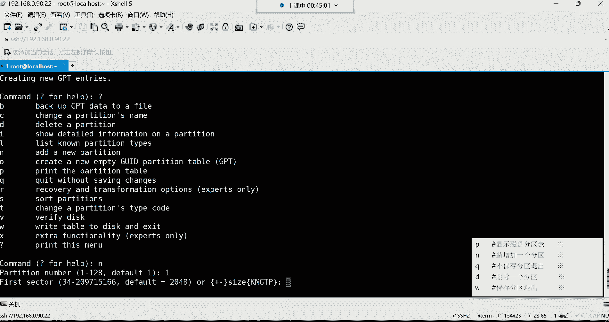

也存储不了多少收据。啊，我这种疑问是吧，为啥嗯？磁盘。善区。默认从。20487始。看了吧，这个哈。呃，他前面这个空间可能是会用存储一些叫做引导文件。他这里边是有一些引导文件的，所以也需要空间去存储。

所以这时候前边那个就将近一兆走的空间啊，就留给他了哈。那你写34就不行，你要写34，到时候他空它空间不足。所以你这个引导文件。😊，就不行。他这一兆空间是用一些是存放一些引导代码的。

所以这就别纠结那一兆的空间了。OK吧。你那个磁盘呢，咱说这磁盘那么大的空间，你在乎那一兆吗？是吧？所以就默认2048起始我们就回车就行了哈，回车。😊。

然后那这个位置呢，我们就开始选大小，但这个大小哈。😊。

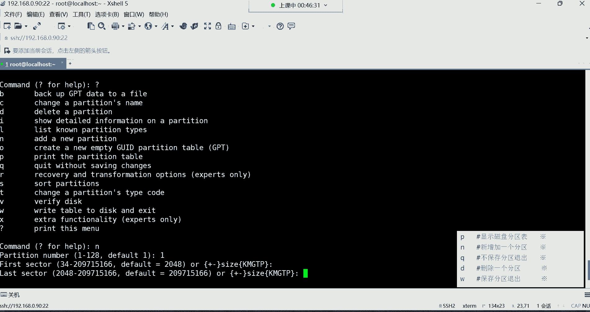

看它这里边。嗯。它这里边啊，它跟那个GBT呢跟那个MBR它不太一样。我们在这直接就可以输入这个新增分区的大小了。

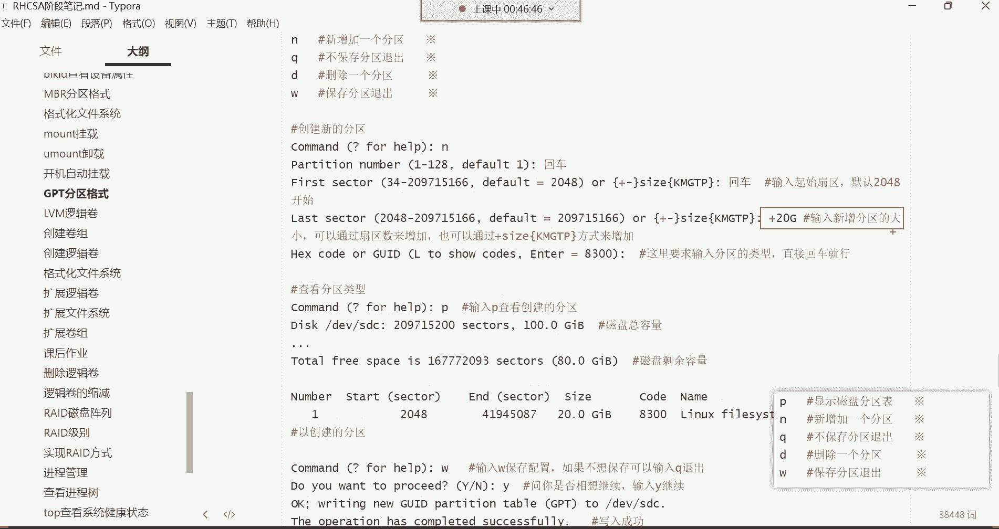

他好像少一个步骤，少了一个环节哈，在那个MBR那个位置呢，在这个位置我记得还要有一个环节呢，但是。是，但是这个少少一个步骤，没关系啊，你就加，比如说我加多少，加10个G。回撤啊。

然后这一步他就是问你什么呢？

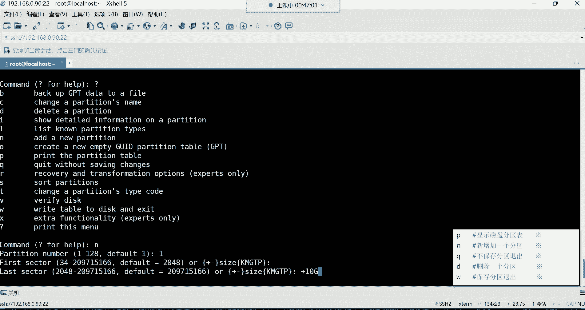

问你的分区类型在这里面最后一步要要求你输入分区类型。这分区类型啊，你只需要默认即可默认是什么类型的？其实默认的话就是linux类型的。

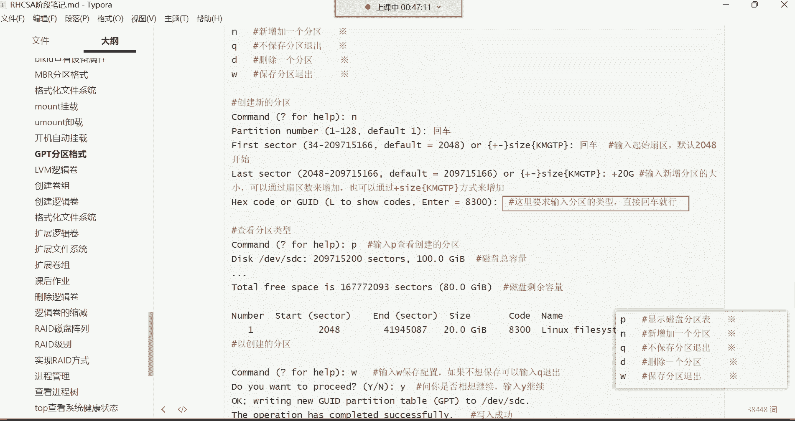

如果这边你不输入的话，默认就是linux类型回车。好，看到了吧？默认的类型是linux类型的。好，那现在第一个分区就出来了。出来以后呢，我们输入P，这个P呢还是正常显示这个磁盘的信息，然后回车。

这时候我们可以看到呃第一个分区就出来了，然后就是默认的起始扇区，然后结束扇区，就是它这里边差不多吧，就是你现在还可以画呃这个从这从这到时候开始，中间啊是有多少个扇区啊，其实看这儿就行了，不要看扇区啊。

我们看大小，谁会看扇区啊，所以就关注这个位置就可以哈，关注大小。这是这这就是我们要关注的，别的地方你没有必要去关注它，就关注大小就可以了。10个G第一个就是不是就出来了呀，然后再分的话呢就N。😡。

第二个编号看到吗？默认编号为2回车。啊，回车扇区不用管，这扇区不就是上一个扇区的结束，就是下一个扇区的开始吗？所以这边就不用管了，回车。接下来大小加10个G。好，回车。类型不用管回车。好。

P显示两个分区出来了。是吧，然后我再有化分N回车默认编号3，回车。扇区不用管会车大小加10个G。好，回托回托。其实你发现GPT这个分区格式。它也如此的简单，它比MBR还简单，简单到什么地步呢？

简单到你只需要。知道这个这里边的这个N是添加分区的，剩下只需要在这个位置。是你需要什么呢？是你需要出手的地方。类型类型，其实他这个不就是你的这个。fiil system这个分区的类型吗？

他呃准确来说叫文件系统类型，其实就是这个分区类型就跟那个什么呢？就跟那个我们前面MBR分区的那个叫C system。是一个意思哈，然后是下边是linux斯，就是你的分区类型是linux的类型的。啊。

他这里面就显示的略略微有些不太一样哈，就分区类型。这就是临时类型的，就正常。其实你把它列成就是一主分区，就正常存储数据的就行。这里边。那如果你想保存呢啊如果想保存，我们就W。保存分区并退出。好。

啊后在这一步啊，他还得跟你确认一遍。看到吗？就你想继续嘛？就这这位置你得输入一个Y才可以，然后回撤。O。本地磁盘是MBR然然新建硬盘是不是也是MBR的格式？嗯，本地磁盘是MBR然新建。不是这个MBR。

它跟它不是磁盘。MBR它本身就是一种分区格式，它不是磁盘，磁盘没有MBR的，知道吧？嗯，MBR分区新建应，不是你这个问题问的。有些我们说的你这问题问的有有些冲突啊，让人无法理解。本地磁盘是MBR的分区。

新建硬盘是不是也是MBR分区。你新建的硬盘跟你与跟你的本地的MBR分区，它这2块硬盘呢。😊，他不一样的哈嗯。对。我们来看一下哈这个al拉 block。😊，我们前面是不是这块硬盘，我们是用MBR分的呀。

这块硬盘是用GPD分的呀。哎，这会我们看一下哈。😊，在这可能说有的同学还是有些混乱是吧？咱们现在2块硬盘，我想看这个SDB这块硬盘，我们就。😊，否定4个。杠F啊杠F跟上DEV下的SDB。

那你一看他这个磁盘的标签是不是doss啊？好，然后我们再换。SDC。那你看他的标签是不是叫GPT了呀？就是你这个硬盘呢，你用什么类型的分区格式划分，这个呀无所谓无所谓哈，看你自己的需求，没有严格要求。

只不过我前面不跟你们讲过吗，说这MBR它的特点是什么呀？就是容量的限制比较小呗。MBR最多允许你是2。2T。2。2T以内的磁盘，你可以用MBR去划分。但如果你有块大磁盘呢，那你就GPT呗。

是吧这种是不是可以灵活去选择呀？嗯，对速率有影响吗？没有影响。这个速率完全是看什么呢？完全是看你硬盘的质量，看硬盘转速。你这你买硬盘的时候，你像你钱花到位了，你这硬盘转速它就快。

它跟你的分区这种没有什么关系哈哎，它不取于读写速度不取于分区格式。😊，哎，这个不用担心。那现在是不是这两个硬盘我们都给分区了呀，然后两种分居格式，那是不是都比较简单的？你发现这两种分区格式其实。

大多数都是你一路回车，然后剩下呢指定个大小就可以了。啊，非常非常的简单。那下边呢开始格化文件系统。我想用这个分区的话，正常呢还是MKFS点叉FS对第EV下的SDCE。

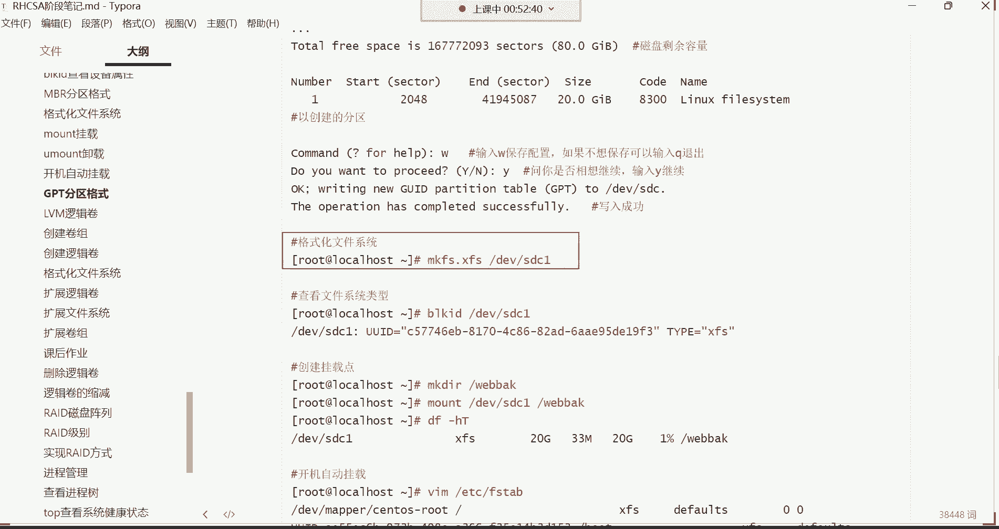

好，格式化。然后。否定此刻啊，不是哈。L block杠F看它的文件系统类型。好，差FS类型的看到了吧？OK那接下来呢就挂载呗，我们找个目录。用哪个目录呢？

我们建个目录make DR在跟下建一个web back这么一个目录。这个目录我准备后期存储一些我网站里的一些备份数据。那这时候我就mount啊，或者说你如果一直用的话，咱直接就VIETC下的FS。他保。

然后呢。在配置文件里面写不就可以了吗？最后一行。指定我要把低V下的SDCE挂载到。根下的web back这个目录，然后文件系统类型插FS的挂载参数。default，然后不备份文件系统。

也不检测文件系统的顺序保存退出mountt杠A让它重新给挂载一下DF杠H看一下有没有挂载成功。好，挂载成功了。是不是？那以后这个目录是不是就用的这个分区去存储数据了呀？

那以后我在这个web back目录里边建的所有文件，比如我再建100个文件呃，web。一点点儿。100。点儿TIT。啊，那这100个文件是不是就存储在这个哪个分区来着？嗯。

存储在这个SDC这个分区里边的呀啊，这就是后边就顺序都一样了，后边顺序就一样了哈。这个哈它这已用1%，就这个有33兆的空间，这里边会融合一些文件系统，文件系统也会占有一部分的空间啊。

所以它里边其实就是一个已用的百分比1%。😊，这不也是1%吗？因为毕竟前面这个33兆哈，在这里面可能说显示不是很精细啊，这无所谓哈，无所谓，文件系统也会占用一部分空间。😊。

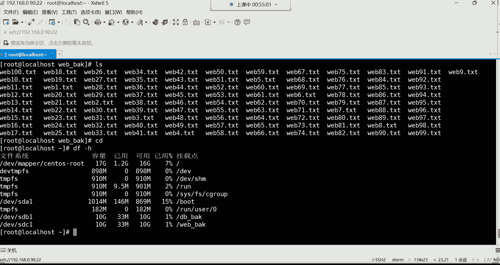

嗯，其他的话呢。就没什么了。😡，这磁盘分区MBR怎么分看看，我们说这MBR怎么分GPT怎么分，是不是？都比较容易啊啊，这都不难哈啊，你甭管怎么分剩下的步骤，你说我们怎么格式化文件系统，我怎么挂载。

我怎么让它实现开机自动挂载，这就都一样了哈，这不取决于说。😊，这个分区用是什么格式划分的啊，这顺序顺序就都一样。好，那接下来呢我们来再讲讲这个逻辑卷。这逻辑卷它对于这个磁盘管理这方面也是非常的重要。

逻辑卷啊它主要的功能。是什么呢？我们先给大家说清楚逻辑卷。逻辑卷我简称叫LVM，它的全名叫logg V姆man，叫逻辑卷的管理系统。主要的功能可以实现将底层的物理硬盘分区整合成一个大的虚拟硬盘。

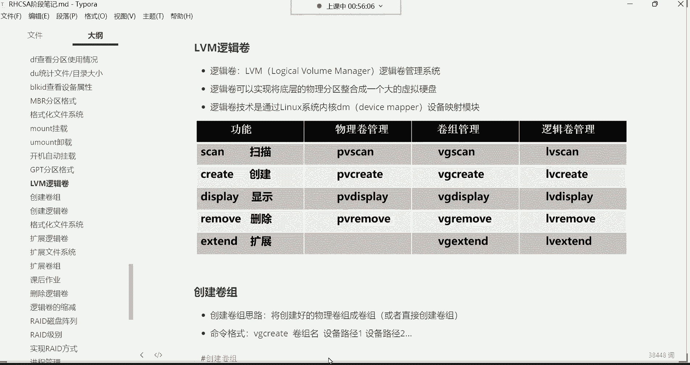

啊，画图吧。嗯。这是硬盘分区。啊，这是硬盘分区。然后呢，比如说啊我这。本网用什么格式划分的分区无所谓哈，分区。分区一，然后分区2。单据2。分区3。分区4。我现在有4个分区，这四个分区的空间呢。

假设每个分区的空间是100个G。每个分区都一样，100个G。那现在这四个分区啊，这叫物理分区，是我们直接在物理硬盘上面划分的这四个分区。那他们有有一个什么特点呢？就是我们现在正在使用的这些分区啊。

什么SDBESDCE哈，这些叫做物理分区，物理分区空间，咱们前面是不是给大家演示过，就是如果说空间一旦被你存满了。那这个数据是不是我们只能再去划分新的分区。😊，往新的分区里面去存储啊。

因为像这种分区的空间，比如说你当初给了10个G，这10个G的空间是固定的。没有办法扩容。所以你们昨天就问了我一个问题，你说老师那这个空间满了以后怎么办呢？然后我就跟你们说，我说那你没有办法。

这个空间满了，你只能再去划分新的分区，然后呢，再把那个目录呢重新挂载到新的分区上面，继续往里面存储。😊，是吧那这个逻辑卷可以帮我们解决什么问题呢？就是分区满了以后，我不想把数据分散存储。因为你想想。

比如说咱们最初的时候。咱们就拿一些备份数据来说吧，比如这个目录。还有这个分区一直存储的是我数据库的备份数据啊，一直用的是这同一个分区存的哈。那突然间有一天这分区存满了，我迫不得已，我再去划分新的分区。

我要往这个分区里面存储。那你说原先存储在这个分区里的数据跟存储在这个分区里的数据，它是不是就分分散存储了呀，分开了吧。😊，啊，那你说我在查询的时候，我怎么查呀？😡，这数据存储在两个分区里边。

我查的时候怎么查这个分区查点，这个分区查点，没错吧，因为你这一个分区不允许你重复挂重复挂载一个目录啊。😡，所以你到时候你查的时候，他也不方便。分区分分区名可以改吗？不可以改不可以改哈。😊。

所以这种东西呢，我们就是。我希望他能够帮我们。或者说我们希望有一种方法哈，如果能够对这个分区的空间能够增加的话。逻辑卷你就可以帮我们实现这种。需求逻辑卷呢。

你看它的这个功能就是实现将底层的一些物理分区整合成一个大的虚拟硬盘。比如说我就有这种需求。

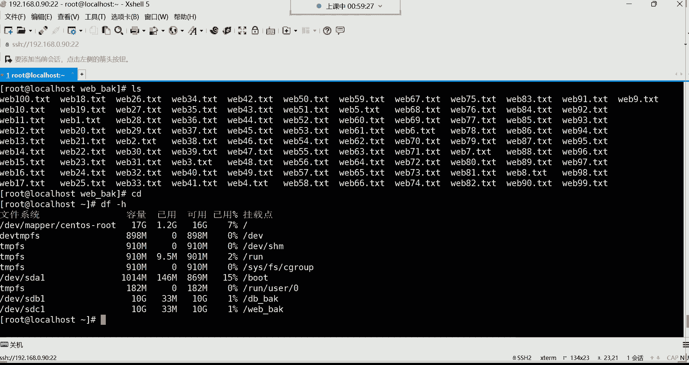

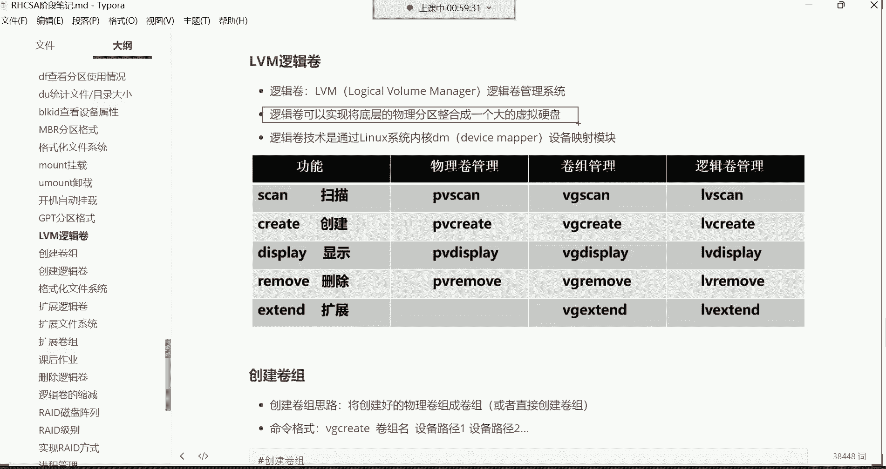

我这个底层呢有很多个分区，但是呢嗯我就是后期我需要什么空间扩容的话，我怎么办呢？我就直接给他们整合成一个大的虚拟的硬盘。这个大的虚拟硬盘的话，它是一个空间的整合。这空间整合以后。

你看这四个分区整合成一个大的虚拟的硬盘的话，哎，我们叫虚拟硬盘。假的吗？不是是由底层的物理分区啊一个空间的整合出来的那它的空间是不是就400个G啊？整合以后，你像它底层的空间过来的呀。

那空间就是400个G。这400个G空间就是怎么来的呢？就是从这底层的分区整合过来的这虚拟硬盘好，那我们整合以后，这虚拟硬盘怎么用呢？或者说我在管理的时候，我怎么去管理呢？😡。

管理的时候你不需要去理你不需要去管理底层的这些物理分区了。这些我们叫做物理分区加两个字哈。物理分区。这物理分区是我们直接在物理硬盘上面划分出来的，所以它就直接叫物理分区了。物理分区。好。

接下着呢整合整合成一个虚拟硬盘，空间变成400个G是吧？那后期我想存储数据，我们要在这个虚拟硬盘之上。这是一个虚拟的硬盘，我们要在这个虚拟的硬盘之上去再去划分一个叫做什么东西呢？叫做逻辑分区的东西。啊。

这是续型盘。下啊，我这样吧。放到这儿。整合成一个虚拟的硬盘了，400个G。那接下来呢我们想划分分区，这时候我就在我这个虚拟硬盘里边去划分一个叫什么的东西呢？叫逻辑卷的东西。这个东西叫做逻辑卷。嗯。

罗继俊。那空间怎么给空间给谁呢？空间给罗继俊。比如说我给他多少呢？我给他呃，给他100个G的空间。这是一个逻辑卷哈。那你说那这个数据怎么存，数据就往逻辑卷里面存。这个逻辑卷最终是要挂载到一个目录上面的。

这个罗意卷哈，最终你给他挂得的一个目录。啊，这是罗一卷。然后要给他挂载到一个目录上面。开始难起来了吧，是吧？😊，这一个目录。那数据我们最终是不是文件就往这个目录里面存呢？啊，我们这个文件存到目录以后。

那这个文件最终就存到了一个虚拟硬盘里的这个逻辑卷空间里面了。就是这样子的，所以这个过程。现在不知道大家能不能理解。这个文件最终就往这个目录里面存。啊，他是这样子的。好了哈。

所以说那你说老老师我们整合以后他有什么优势啊？😊，你看啊假设我们这个逻辑卷里的空间是100个G。它的空间是100个G，那我们想要存储数据的，我们这个随着数据不断的存储，比如这个文件啊一直往里面存。

一直往里面存存满了。啊，导致这个空间存满了。没它跟物理分区不太一样，它可以扩容。就这个逻辑键我当初分100G空间是吧？没关系，如果不够用，我再给你加多少呢？我再给你。比如说如果有需要的话。

我再给你加100个G，可不可以呢？可以啊，那它就变大了，它的空间变大了。它变成200个G了，你看是不是空间变大以后，我这个文件就不需要再去往别的分区里面存了呀。我说还可以继续往这个分区里面存呢，没错吧。

一直还往这一同一个分区里面存。😊，哎，这种机制好不好呢？这种机制是不是就可以解决我们前面那种。比如说哎呦我这个数据不想分散存储。我我想对这个空间进行扩容呃，而且我一直往这个分区里面存。

保证数据的一个完整性。

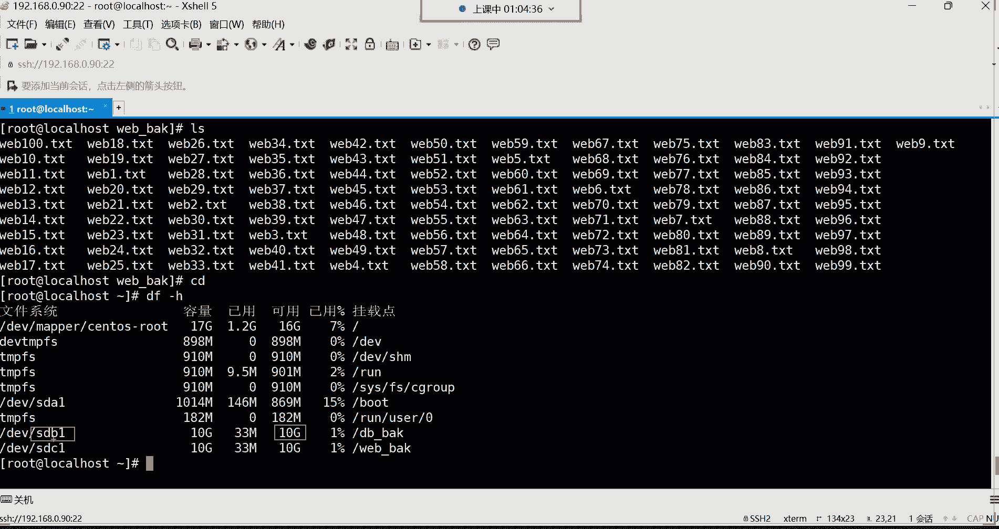

这就可以。所以逻辑卷现在就可以解决这种事情。解决这个。不它跟阵列不一样哈，我们稍后给大家讲阵列的时候，我们再说阵列。好吧，你先搞清楚这个逻辑卷，它其实主要的本质是什么呢？叫做空间扩容。

逻辑卷最重要的功能就是空间扩容。它可以让你这个分区不断的变大不断变大。如果有一天你说我这个分区又不够用了，我再给你加100个G。好，这300个G随着不断的存储又不够用了。好，我再给你加。

我再给你加100个G，可不可以呢？可以啊？400个G了，那你说再不够用啊，再不够，我再给你加100个G，那这时候还能加吗？😡，嗯。好，如果物理硬盘坏一块，雷胶会怎么样，那那数据会损坏，数据会丢失啊。

因为最终它只是一个什么？