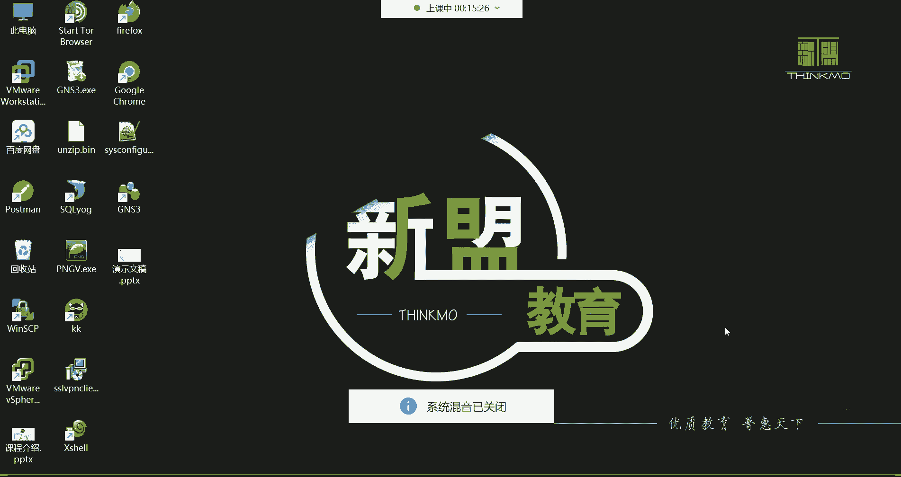
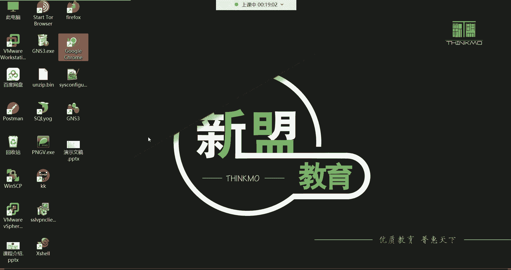
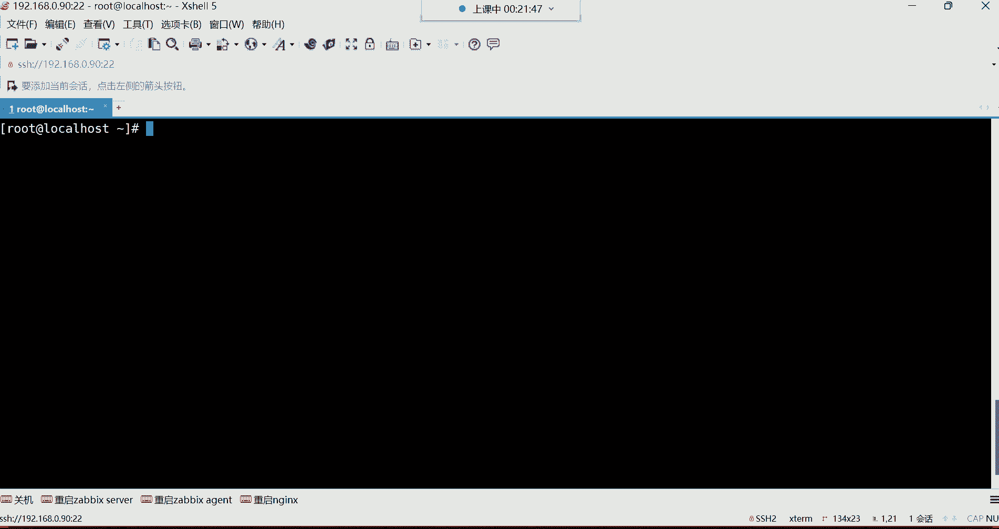
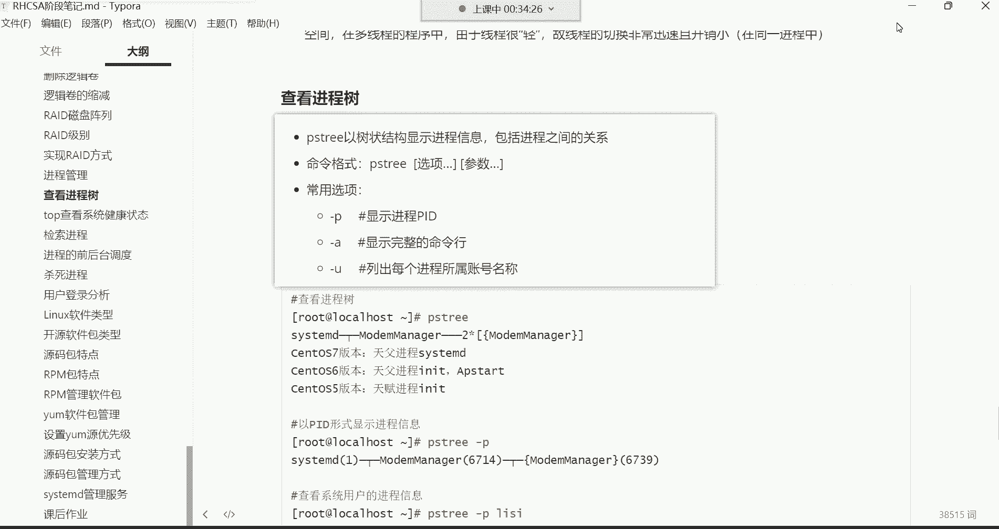
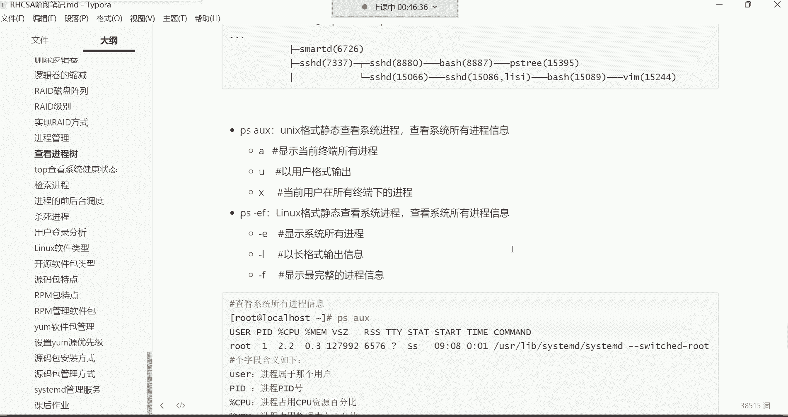
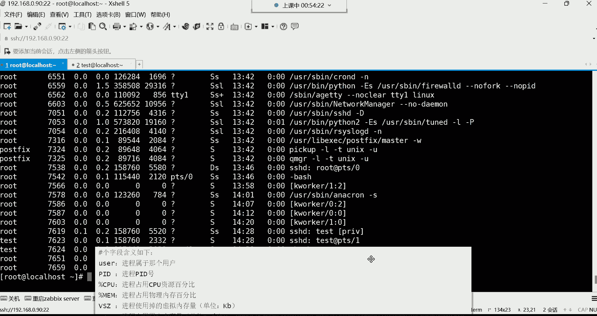
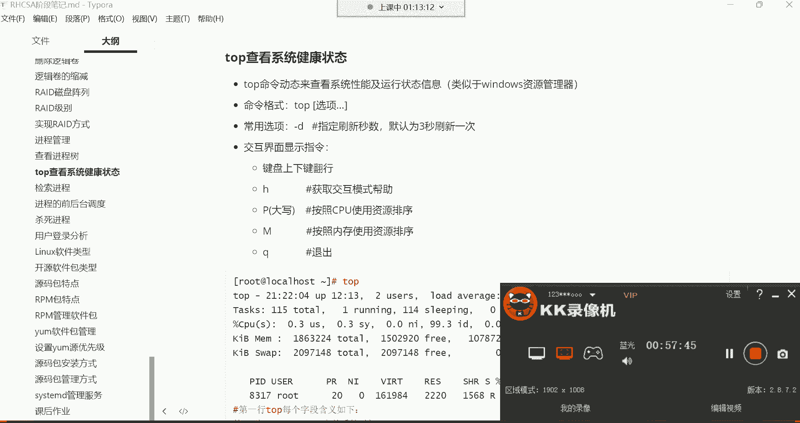

# 零基础入门Linux，红帽认证全套教程！Linux运维工程师的升职加薪宝典！RHCSA+RHCE+中级运维+云计算课程大合集！ - P29：红帽RHCSA-29.程序、进程、线程介绍、查看进程树 - 广厦千万- - BV1ns4y1r7A2

好，我们开始上课吧，能听到我这边的声音吗？大家听到我这边声音的同学，讨论区sber一开始我们本周的课程，我们又一周没有见了，是吧嗯。有些怀念大家呀嗯。我们上节课讲的内容不知道大家复习的如何了呀。

把应该掌握的技术，你最起码也得给它练熟练了哈。有些需要了解的呢，怎么说确实是由于这个个人的这个经历啊，或者说学习能力有限呃，这个只需要知道有那么个东西就可以。但是呢你一个经常用的命令啊。

这个大家一定要勤练哈，你这个东西啊学习这东西就得什么呢？就得一定要多实践。😊，你不能说这个光靠听啊，光靠光靠这个看你就觉得啊我已经会了。但是呢你发现你记不住，所以有句话叫什么呢？

有一句话呀叫做学过它不等于掌握。所以对于大家学习来讲呢。你千万不要觉得你在课上听一遍，你会了以后，你就觉得这东西已经是你的了哈，这个呃是最大的一种错误哈，所以要多敲哈。

那我们本周呢争取两天啊两天的课程把这些呢都给它结束掉。然后整个RHCCA的内容呢，我们就结束了，OK吧。然后我们先来给大家来一段了解的内容啊，不能说是。😊，从哪开始呢？可以说是从进城管理一直到。

一直到top这个位置的一直到top这个位置哈，我们都是一些理论性的东西啊，就是几乎没有什么实操，实操非常的少哈。我先来带领带领大家了解一下在计算机里边什么叫做应用程序。😊，还有什么叫做进程。

什么叫做现程？其实对于这些概念性的东西啊，我们来给大家说先说什么叫程序哈。那用计算机语言编写的命令序列的集合，用来实现特定的目标或解决特定的问题。那这句话什么意思呢？其实啊什么叫程序啊。

就是我们拿windows来讲哈，你从软件商店，你去下载优盘软件。比如说我要去下载一个聊天工具啊，对，其实就是那个APP。😊。

就那个软件说白了就是软件哈软件你在没有下载的时候，它就是软件。你把这个东西下载到你电脑以后啊，它就变成你电脑里的那个应用程序了。能理解吧？啊，所以什么叫应用程序啊？

比如说我要下载一个陌陌陌这种这个聊天工具啊。😊，好，那这时候呢我下载下载完了之后呢啊下载完了之后，我们就直接变成电脑里的程序了。那以后我就可以使用它了。😊。

对，我说这个。

这个说成大白话的话，就是。把软件下载到电脑里边，就是程序。但是这个程序它确实人家是计算机语言编写的啊，大部分的软件都是用C语言C加加这些语言编写出来的。然后可以帮我们完成什么呢？可以帮我们完成一些目标。

那没错，它确实帮你完成目标的。你比如说你想去聊天。那它确实可以帮你实现聊天的功能，你想去上网，它也能够帮你实现上网的功能，没错吧？啊，确实啊其实就是软件哈，帮我们来实现功能的那程序它占用的是磁盘空间。

程序是静态，并且是永久的。😊。

呃，它这个东西啊，你下载到你电脑里边，它占的是你的硬盘里的存储空间啊，但是呢数据的存储啊，它还有一种什么呢？叫做内存。没错吧，那什么时候才会占用内存空间呢？就是当它运行的时候。

我们在这个自己的任务管理器里边。

大家看一下哈，我现在在任务管理器里面可以看到我电脑里面有哪些进程，看到了吗？这是不是叫进程啊，有录像机的，有酷狗音乐的，有笔记软件的虚拟机的，看到了吗？哎，这些就叫做进程了。那进程它占用的是内存的空间。

看到了吗？啊，它占的是内存空间哈。😊，而程序呢在没有运行之前，就这些东西在没有运行之前，它是不会占用内存空间的。所以这就是呃为什么说这程序它是静态的。啊，它不动啊它不动，那什么时候它会动呢？啊。

就是它一运行它就会动了。😊，啊，占用内存的时候，它就运行起来，它就变成动态的了啊，就是不是固定的了一种状态。好，那。

这个进程的话呢是正在运行中的程序，我们就管它叫进程了。就软件一运行就变成进程。那它这样的是内存空间，进程就是动态的，因为它可不是固定的哈，它是一直在动那进程是有生命周期的那这个生命周期啊。

我先给大家说说进呃什么叫生命周期呢？我们就拿LS我们系统里面啊，你看我们说这个LSLS它本身是一条命令吧，我一回车。

在这一瞬间，他也会产生一个进程。能理解吗？就这一瞬间它也会产生一个进程，只不过我们看不到，为什么看不到呢？因为这一瞬间这个进程。😡，他结束以后呢，他就消失了。对，这种命令哈，从执行到结束速度非常快吧。

啊，所以这个进程你几乎是捕捉不到，但是它确实是会给你生成一个进程。😊，所以这个进程呢有的是有生命周期的，这个生命周期它会自己结束啊，它就是你执行的时候，它会生成进程。然后到时候呢，执行完毕以后呢。

他自己就把自己的生命周期啊就给结束掉了。😊，好，那你说那有的进程是这个生命周期得需要我们用户自己去手动结束。你比如说就像我电脑里边的这些进程，比如我的KK录像机，那它的进程。

它的生命周期就取决于说我什么时候给它关掉，那它就结束了，能列解吧。而有的进程呢，它自己就能够结束。所以我们说像前面给大家讲这个系统里面有有一些路径，哪个路径呢？就像什么PROC这个目录下边。😊。

啊，跟下的POC。这个目录下边的数据一般就是占用的是内存里的空间。那在这个里边，有些数据。你发现你根本就捕捉不到，是因为啊它在运行的时候，它会给你生成一个进程。但是结束以后呢，这它就消失了。

所以你是捕捉不到的哈。😊，所以进城这个东西飘忽不定，是呃这个时有时无的。

啊，然后。这就是进程。那每启动一个进程呢。首先啊进程是有自己独立的内存空间哈，进程有自己独立的内存空间，每启动一个进程系统就会为它分配这个内存空间，并且分配1个PID号。

这个在windows里面看的比较真切一些。在这里边啊，我们看详细信息。在详细信息里边呢，这里边有进程的名称，看到了吧？当然这就是名称。然后以此类推，这里边都有什么呢？还有一个叫做PID号。

这个PID号啊就像。呃，人的身份证号一样，就这个进程，他在系统里面一运行。那系统想识别它通过什么呢？得通过他的ID号去识别它这个ID号系统自动分配的。然后到时候呢，系统就会通过这个ID号去识别这个进程。

好，这是进城的一个身份的一个编号。那下边。每一个进程都会对应一个负进程。那父进程可以复制多个子进程，这个父子关系啊，其实在这里面也可以看得清楚哈，端口的IU号不是它不是端口的IU号，它是进程的ID号。

它不是端口号。😊，不是哈，端口号是端口号，ID号是ID号。😊，不是一个东西，我们来看一下，就是咱们说这个进程这个东西呢。😊，看哈。每个进程都会对应一个副进程，而副进程可以复制多个子进程。

在这里边我起一个火狐浏览器哈，在里边我起一个火狐浏览器，大家就能够。

看得出来差点睡过头是吧？来看哈，我现在起个火狐浏览器，我直接从任务管理器里面这这个位置。

好。你们看到了吗？现在火狐浏览器起了多少个进程啊，起了非常多的进程。没错吧。好，那这里边其中有一个啊，当是它这个进程呢。你只要是结束其中某一个，那可能说所有的进程全都跟着结束了。你比如说我结束任务。

结束进程。哎，再结束哈结束任务。再结束。几个了结束任务。你发现这怎么结束不了呢？你看结束一个又生成一个是吧啊，怎么办？结束进程数。😡，He。哼结束任务看了吗？😊，再结束哈结束任务。

我看看我们能不能给它结束掉，再来一个结束任务。😊，哎，结束任务。好，应该没了。还有一个是吧，解除任务。

啊，没了。好了吗？他这个就是什么呢？就是这个进程之间的关系就是。😊，如果我刚刚能够找到他的父禁城，我把他的父近程一结束，所有的子禁城其实就全都没了。但是我不知道哪个是他的父近城在这里边看不出来哈。

看不出来。因为我我不是很清楚这个火狐浏览器，它的一些啊具体的这个。😊。

这个相相关的内容。所以一般每个进程呢都会对应有一个父进程，你可以把它列成是他的父亲。然后这个父亲呢下边有很多个儿子，那每种进程都有两种方式存在，一个是前台，一个是后台，但是大多数的进程都在后台运行。

就像我们这个windows系统一样，大家也可以看得到，就是很多系统的进程。你看哈。😊，很多呢系统的进程，就下面这些它都是在哪运行，在后台运行，在后台哈看到了吗？大多数都在后台运行。😊。

那包括我们这个系统linux斯来讲，你发现这进程其实大多数都在后台。大多数都在后台在运行着，因为你在前台你根本就看不到它。

看看。好，那这是所谓的进程。你就记住哈啊后台都是服务嘛。呃呃也不能说都是服务。😊，嗯，因为这个他在后台运行的话呢。嗯。有的可能是反正都是可以帮我们提供功能的吧，你怎么去理解啊。

那下边呢我们再来给大家讲讲这现程这个进程啊，大家不要把它列的太复杂啊，这种东西没有没有那么复杂。你就知道程序一运行就变成进程了。进程是占用内存空间的。

然后每个进程是有自己独立的内存空间的那进程呢是有自己的生命周期的。有的进程自己会结束自己的生命周期。有的进程呢是需要我们自己手动去结束它的生命周期。然后这个每个进程都有一个自己的ID号。😊，好。

就可以了。O那下边我们再来给大家说说这个县城。其实县城啊。也被称为叫轻量级进程。在linux斯系统里面压根也没有这个，其实没有这现成这些说，在计算机里边也没有现成这些书啊，但是呢呃一般搞开发的时候。

这个会会有这个现成这个概念。其实他它准确来讲叫做轻量级的进程，它是被包含在进程里边的。在进城里，他是晋城里边的一个子籍。然后是进程中实际运作的单元，那一个进程可以并发多个县程。

这个我们怎么去理解这个东西呢？县城这个东西啊。

嗯。如果说我们把这个。我相信你们肯定在计算机里面听过一个词汇，什么词汇呢？就是这个比如说这个在买CPU的时候，这CPU啊它分几核几线程是吧？比如我这个CPU我是四核八线程的，8核16线程的。

应该都听过吧。我们就拿这个CPU来说，比如我这个CPU就是这个4核8线程。四核，然后呢八线程。四核八线程好，那你说我应该怎么理解这个四核八线程呢？好，那这一颗CPU。给你们画一图。这一颗CPU啊。

这个四个核你就理解成是有4颗计算的单元。四科哈四科计算的核心。就这个核心就是我们所说的这个计算单元有4个啊，然后那这个四和八线程什么意思呢？四合八线程。那这个县城呢，它首先啊是我们说是真正干活的啊。

我们就可以把这。这四个盒是吧，这一个盒。好，一个盒。一个盒总共是4个核心哈，四个核心。好，那咱每个核心里边它这个线程怎么分呢？啊，你可以把它理解成是每个核心里面有两个线程，2468，这样呢就平均分开了。

我让它变大一些哈变大一些。😊，这不行啊这不行啊。这太low了。那就这样吧。字字体调小点就行。呃。可以这么理解哈，一个。😊，一个核呃这个每个核心里边有两个计算单元啊。两个计算单元。计算单元。啊，四个核心。

每个核心里面呢有两个计算单元，那这个计算单元啊，其实就是我们所说的这个县程啊，这个两个计算单元，就是我们说的这个两个县程吧，我们把它列成二线程，好吧，二线城。😊，这样比较好理解一些。

这一核心是一个计算单元，那核心是计算单元哈嗯一。计算单元，然后两个现程。计算单元。好，那我怎么理解这个县程它到底是能够起到什么作用呢？我们可以把这个CPU比喻成一个大工厂。注意听哈，比喻成一个大工厂。

那我们可以干嘛呢？我可以把这个工厂里面的这个。我们可以把CPU的核心比喻成什么呢？比喻成这个每个生产车间。生产的车间。四个车间。啊，有4个车间。O。这是一个工厂哈。把CPU比如成一个大工厂。

然后在这个工厂里面呢，有4个生产车间。好，那每个生产车间里边。有几个真正干活的员工呢啊两个。两个哈每个车间里边都有两个真正干活的员工，你就这么去理解就可以了。😊，哎，这应该就不难理解什么叫现成了吧。

所以。😊，这个对于县城来讲呢。他也被称之为叫轻量级进程，被包含在进城里边是进城的一个子级。你就记住后后面那句话。这个。嗯。诶，跑哪去了？那句话。啊，这样啊就记这句话吧，是进程中实际运作的单位。

这话什么意思呢？是实际运作的单位，就说白了是真正干活的。真正干活的单位。想处理数据，最终谁去真正去处理这个数据，谁去计算这个数据呢？啊，是县程去计算。还有一些应用程序也一样。应用程序。

比如说像网站一些应用的话，他想要去接收请求。那谁去真正接受用户请求啊，是现成真正干活的。😡，能理解吧啊，是这么回事。所以对现城来讲呢，你就这个这么理解就可以。县城在计算机里面就是真正干活的。一个什么呢？

一个。实体啊。一个实体真正干活的。就可以了。好，下边呢这些太官方了哈太官方了，然后就没有必要去读它了哈，没有必要去读它。其实对于运维来讲呢，你对现成的了解不需要去了解太深，你又不要搞开发。😊，搞开发。

那你对于现成的知识嗯。对你如果说对于官方的知识，你就一定要呃不能说你要对于这这种什么进程啊，县程啊，你要得仔细研究它啊。但是对于我们运维来讲呢，只需要了解就行，你就知道。这个进程是真正干活的。

实际运作的就可以了。实际运作的。好，那下面我们。再来说说怎么在这个linux下面查看这个进程数。那查看进程数的话呢，有很多种方式啊。第一种啊不说人话，对哈，官方就不说人话。

撇子翠这是以树状的结构显示进程的信息，包括进程之间的一个关系。这命令格式呢也比较简单。看一下啊。所以说这人呢你一旦就是阅读这种官方文档，阅读多了以后呢，你发现其实你说话也倍也倍官方。

就别人听你说话感觉也有些不太好理解了，能理解吗？

那撇子脆。直接敲哈直接敲啊，没有这条命令，我们系统里面没有装是吧？😊，搜索一下哈。啊，没有搜得到啊。我的呃我的镜像好像掉了，我看一眼哈，ETCE点D。有一样。Please。等一下哈等一下这里边。嗯。

我们今天啊呃刚开始这节课的话，可能就是会有很多的这个理论。但是没有办法，这个理论得讲。这么慢呢。理论好啊。还还喜欢理论是吧？有了，我再搜索一下。嗯。搜索一下哈。你那儿没找到是吗？😡，不可能哈，应该有。

这个工具。主要我们现在还没有学习这个这。看了吗？这不出来了吗？你没找到，你看你的仓库是不没是不是这个软件包没有什么呢？没有这个。你的网络问题可能说他这个没有办法连到仓库帮你去搜，把这包安上就可以了。

看到了吗？就这包哈。😊，叫亚母岗外。ins套被包给它安装上。安装好之后呢，再敲这条命令PS tree。回车好，这个进程数就出来了，看到了吗？这就一个数啊，这一个树，那树的根在哪呢？树的根儿在这儿呢？

这就是大树的根，然后下面一个一个的小分叉。那看到吗？这每一个分叉就是一个进程，每一个分叉呢，它就是一个进程，看到了吧？然后这个呢它这个数状结构，可能说你看这ma这个进程下边还有什么呢？还有两个子进程。

这就是我们说叫父子关系，看到了吗？叫父子关系哈。😊，那这些进程都是什么进程啊，这都是系统在运行的时候，一些必要的进程。你比如说像这个SSH这个进程，这可能说大家还是比较熟悉的这个进程啊，为什么呢？

因为这个你想想我们之所以能够使用这种远程连接工具。我这样SSH连接到我们的这个系统的话，其实就是因为我们服务器里面起了这个进程了。啊，就是SSHD这个服务它在运行着。

这个进程可以让我们远程登录这个机器能列吧。那还有其他的。呃，像什么网络的进程，看到了吗？啊，像这种网络的network manager这种，这样我们可以去访问互联网。

让我们的机器呢去我们说拥有这个网络啊，还有这个像其他的呢就没有必要去认识的了哈，因为大部分都是系统的进程，还有包括防火墙看到了吗？这fa沃这是防火墙的进程。然后还有这个curon D。

这是计划任务的进程，还有哪些呢啊，还有像这些这个。这个哈什么system journal，这个这是日志的进程，这日志的进程。嗯，非常多看到吗？还有内核的进程看到吗？这是内核的进程。所以这些进程呢。😊。

我们如果想看的话，可以通过PS翠这条命令呢，把整个进程数啊给列出来啊，然后这个。数字你看这个六后面有个星是什么意思呢？这个六下面这个星就是代表县城。😡，啊，就是我们所说的叫轻量级的进程。

也就是说在这个进程下边有6个。轻量级的进程啊，就县城你就这么去理解就行。这个六星这个星就代表县城的意思啊，六就代表6个那二星就两个县城在这个进在这个进程下边有两个县城啊。那我们这个时候比较少啊。

数量你看这一个小树状结构，这才起了多少进程。那是因为我们在安装系统的时候啊，我们的系统是最小化安装的，所以它这个就。嗯。整体就是。没有多少进程没有多少哈。然后我想看每个进程的PID。

你就可以在后面加1个P杠P。😊，杠P是显示每个进程的ID号回车。好，那这时候大家可以看到，你看这下边是不是有6个那个线程啊，1234566个线程。如果你不用PAID号的话，它这个位置就是星。

你像我们前面那种这位置就是这个告诉你是六星，是不是啊？六星。那你如果说加杠P以后呢，他会把每个进程或者说县成的PID号都给你列出来了，看了吗？但是在这个里边。

你看我们在windows里面没有办法看他的树状结构吧。但是在lin里边，我们是不是可以以树状的结构，看哪个是他的父进城啊，因为进城这东西，他父子关系嘛？这是他的父亲，这是他的儿子，他6个儿子。

这6个儿子，如果说有一天我想给他结束掉怎么办？你把他的老子一结束。那这6个儿子就也就跟着老子一起走了。😡，啊，他是这么回事。这是看每个进程的ID号。

然后这里边呢我给大家说说这个C systemD这个进程。这个进程呢这个大家一定要认识的。他是所有进程的一个什么呢？叫做天赋进程。天赋进程。如果说我们把这个天赋进程给它结束掉，什么时候才会结束呢？

就是系统关机的时候，这个天赋进程就结束了。😡，因为你想想我们系统一开机，系统首先加载的就是这个天赋进程。然后再由这个天赋进程帮我们去，比如说去生成网络的进程，这个还有什么SSHD这些进程等等等等。

都是由他控制的。所以大家可以把它理解成什么呢？我们说叫做内核的一个管家啊，通过这个管家帮我们去控制整个系统的进程。啊，所以这一个ssemD叫天赋进程。然后他的ID号呢是一。ID号是一。

其他的ID号呢一般都是系统随机起的啊，但是这不能说系统随机起，是某些程序它自己有拥有自己的这个。😊，就大多数都是系统随意分配吧啊，这这不像端口，这进程号它不像端口哈，就对于这种东西都是系统随意分配。😡。

啊，不是固定的。好，这是。怎么查看进程的PID，然后下面杠A就显示完整的命令行。这时候呢我们再加一个A。这个A的话呢，这时候你发现它这个显示的好像不太一样了是吧？好像从这开始哈，什么叫完整的命令行呢？

😊，呃，在这里面可以看到，就是这个进程是。看一看哈，我看能不能找一个更好的例子。好，如果说我们这个你看比如说我在这个在这个位置，你看PS子脆，在这位置上，什么叫完整的命令行呢？

这个可能说在这看不是很清楚，我们结合杠用这个选项吧，叫列出每个进城所属的账号名称这样。😊，呃，再加个U。加个U哈嗯。这样这样看自己看的不是很清晰啊，再开一终端，或者我再用一个账号登录吧。用那个90。啊。

用用太词。这个账号登录一下。那比如说这个t。😡，咱说这个它显示完整的命令行，它可以显示其他用户的完整命令行。那这边怎么玩呢？你比如说这个test的用户都是同一个机器里的哈。比如我现在在自己的加目录。

我再编辑一个文件，编辑一个ts点TAP。😊，啊，VI泰测点TIT。编辑率文件哈。好，那编辑类文件这个时候我可以这样。😊，后边哈哦偏儿脆。后边呢跟谁呢？跟上那个用户名ts的。这叫完整的命令行。

看看杠P是显示进程的PAAD杠U的话呢，列出每个进程是属于哪一个账号的。然后这时候呢，我们就可以后边再结合一个用户的名字，然后再加上杠A这个选项，我就可以看ts的这个账号在我系统当中起了哪些进程。😊。

啊，其实这个U你你也不需要加。😡，有不需要加哈。因为如果说我们后边已经跟上一个用户名的话，那你还有必要去加这个U了吗？没有必要。因为我就是看ts用户，没错吧，那如果你系统里面用户比较多，哎。

你不跟用户名，哎，这时候你比如我U回车，那这样。😡，我们可以看什么呢？哎呀，我们就他会帮我们显示出来，就这个进程是属于哪一个用户的，看到了吗？就这个用户，他通过SSH这个进程得能够登录到系统。

然后登录上来以后呢，他开启一个bach这个解释器。因为他一登录系统就给他分配一个解释器。好，然后他干嘛他在这个解释器下边，通过VI这条命令再编辑1个t点TATT这个文件。看到了吧？所以这杠U干嘛？

叫列出每个进程。😊，是哪一个账号开启的？所以这时候你就可以看到ts的这个账号开启的一个这些进程啊。但如果说咱们我已经想看具体的这个某一个账号了，你是不是就不需要加U了，我直接ts不就可以了吗？

这样我就直接指定我就看ts的这个账号在我系统里面起了多少进程，这是不是就没有必要加U了呀啊，我只需要看他这个完整的命令行就行了。看完整命令行，就是我想看看他在系统里面做了哪些事情。😊。

他现在正在用VI编辑这个文件呢。は。😊，所以观观察的还是蛮清楚的呀。就是我想看我心统里面哪些用户现在啊正在做什么事情，我说起了哪些进程。😊，你就可以这样去看。好，然后。当然这个他得是一直这个什么呢？

他得是一直用VI再打开这文件哈。但是如果它执行LS，你发现如果执行LS这边能捕捉到吗？你发现它捕捉不到。😊，它捕捉不到啊，因为LS它进程有自己的生命周期。😡，那MS多快呀，执行完了以后。

那边可能说就已经结束了，太快了，是不是啊捕捉不到的哈，所以这边就不显示。😊，所以这就是PS tree这条命令，它可以干嘛呢？可以查看我当前系统的一个整体的一个进程的一个树状结构。

啊，包括进城与进城之间的关系，可以看他们的父子之间的关系，也可以看每个进城的ID号，然后也可以看某一个用户，他在我系统里面起了。哪些进程啊？杠U的话呢可以看你系统里面的进程的所属的用户是谁。啊。

这就是PStra这条命令，就是看一个进成数的啊。那下面还有一个PS这PS这条命令呢，当然这PS。那入册用户能不能给它关掉，当然可以了。😊，入得用户可以直接给他嗯，可以直接把它经常给他杀掉。哼哼。

我们后面会讲哈后面会讲。😊，然后我们来说说这个PS这条命令啊，PS这个当然啊这PS命令不是那个我们所说的那个PS哈。

不是那个photoshop哈，那photoshop那PS我们说跟他简直功能太强大了。photoshop。可以说是坑了多少榜一大哥呀，是吧，就这玩意儿。😊，我我还有呢，我还有呢，就他看到了吗？

photoshop嘛PS嘛，专业P图工具。你看现在很多人你发现这个。很多女孩子对于这种PS功能是这个非常喜欢的，照个小照片是吧，PS1下子，然后发个朋友圈这。很多。很多人一看这小姑娘长得倍儿漂亮啊是吧？

你直接就想撩人家了，这不就这么回事吗？是不是啊？所以这PS坑人哈，那我我们这PS呢，他是干嘛呢？他是查看进程的，榜一大个鹿山账号。对。😊，他可以帮我查看系统里的所有进程信息。

这样哈哎PS当然它这个AUX是3个选项。A的是显A是显示我们当前终端的所有进程优势与用户格式输出。就是这个进程属于哪个用户的X是当前用户在所有终端下的一个进程器儿。😊。

这条命令就可以帮你把系统里的所有进程给你列出来，但你得结合这三个选项，看会车这时候呢，你看你发现这就有些多了哈，你看哎呦这么多信息看到吧？因为它毕竟是把所有的进程都给你列出来了。😊，所有进程啊。

这所有进程当然这进程分为很多种状态，有的进程有的进程可能是处于那种叫做休眠的状态，有的进程处于正在运行的状态。所以这里边呢它是甭管是休眠的还是停止的还是运行的都给你列出来了。那这进程可就多了去了。

这就这就有些多了哈，就有些多了。如果统计的话呢，我看能不能统计一下，我们管道给这个WC杠L统计一下，178个看到了吗？当然这1178个进程，它的状态都不是可不都是在运行哈。有的进程是在后台没有运行着呢。

休眠，因为进程可以休眠的哈，休眠它也不会占用你系统的一个资源啊，所以可以。😊，好，那下边呢咱们来说一说PS这条命令。他是以静态的形式查看系统进程。那这时候对于这个PS命令，它显示出来的这信息。

我们怎么去理解呢？

对PS你的那么少吗？看一下哈。😊，呃。PPSAUX。

啊，你的系统怎么那么少呢？你的不应该呀，我们系统不应该都一样的吗？😡，PSAUX其他同学呢其他同学应该跟我差不多吧。因为你确实你那个确实不太一样啊，确实确实很少了哈，195个是吧，你看就他那特别少。

那具体是不是你那个系统的问题啊？😊，对系统跟咱们是不是不一样啊？很奇怪哈，不应该哈，不可能就这么两个进程。因为进程的话，他有的进程在后台休眠，他也会什么呢？也会给你列出来的。😊。

然后我们来说一说这个我们现在查看出来的这些含义是什么。在这里面呢。

看看。都Q完了是吗？😡。

我们一个一个来说哈。😊，哎，放在这儿。放在这儿哈。我们看PSUS这条命令呢列出来的这个。每一列的信息代表什么意思啊？因为它这一行下面有很多列，所以呢我们从左往右先看第一列，这是属于第一列哈。😊，第一列。

这第一列是代表什么意思呢？叫做进程属于哪一个用户的。这个比较好理解吧，就这个进程。是哪一个用户？是这个在。开启的啊，或者说在使用着。那每个进程呢都有它的PID号。那这个第二列就是代表这个进程的PID。

进程的ID号。然后第三列是CPU的百分比，就这个进程占用我的CPU的资源是多少？当是它是百分比哈。然后第四列这个百分号MEM就是内存的意思，就memory内存。占用物理内存的一个百分比memory。

然后那这个VSZ这个是进程使用掉的虚拟内存总量啊，就是这个虚拟内存嘛，一般这个。系统呢会用这种虚拟内存。他也会分配给这个进城用，这个你简单知道一下就行。然后下边这个。

但是他是指他是以字节为单位来帮你去计算的。这个字节如果你统计下来也没有多少没有多少哈。😊，而这个RSS这是进程占用固定的内存总量。看。然后你看一下他这种。啊。这种哈KB哈这种KB的方式。

那如果KB你换算的话呢，它换算以后是没有没有多大空间的。所以这个。你不用去太计较它啊，TTYTTY呢这是进程在哪个终端运行。这个终端呢。它有很多种形式，我们前面就在给大家看DV目录的时候。

DV下边你看到了吗？这TTY其实就代表终端的意思。然后这个终端呢有多少个呢？这个好像是63个，总共好像是这这个TDY叫远程终端看一下哈。😊，这里面我写了。好。嗯，如果是内核直接调用的呢，它就显示问号。

它没有终端。你看啊就我们现在看到的这些进程，它这位置是不是都显示是问号啊？内核直接调用的哈就问号来显示了。但是呢如果我们是我们用户自己的呢，你比如我们往下翻一翻。😊。

你看如果如果这个进程是用户在某一个终端起的呢，你看像这种bach，这bach，还有这个还有这个PSAX这条命令是不是我在当前我这个命令行刚刚敲过的呀？你看那这个就是什么呢？

就是这个我们所说的这个叫叫叫叫这个。在这啊拿过来。叫终端了啊，远程终端。或者说本机终端呃，如果是这个。TTY那就表示示本机终端登录用户的进程。比如说在这位置，我们来能不能看到TTY呢？

TtV。这呢。这有就1个TTY是吧？这什么叫本机登录的呢？就是我们从这儿。

直接从这个机器这个位置登录上去的。这种呢叫做本机的终端。

然后他会以这种。TTY的形式呢来给我们显示。那还有另外一种终端叫什么呢？叫PTS呢？这PTS在这里在第一位目录可就没有了哈。😊，没有是不是啊，那PTS我们就叫做远程终端。PTSPTS。

则表示远程终端登录用户的进程。那我们现在在这看呢，大家来看一眼。

往上点哈，这个PTS1什么PTS0，这些都是属于远程终端。那我们用这种远程的连接工具连接的系统，这种就属于远程终端啊，从远程连上来的。然后我敲了这个命令了，看到了吗？啊，就是当前这个命令是在哪个终端。

运行着的啊，或者说是哪个终端执行的这个进程。这条命令。这就是。这就是这个终端的一个含义哈。当然这个命令，你比如说我这条命令我这样执行的，其实他就会给我执行一个，他就就会给我起这么一个进程。能理解吧。

你比如说我我敲LS，那LS的进程名也叫LS。😡，所以你看后边说命令也可以，我们说进程也可以，你包括拜事也一样。你比如说我这个。系统给我分配一个bech解释器，那bech解释器的名字也叫bach。😡。

名字都一样，能列吧，哈哈。😊，所以这个我们说命令也行，说进程也行。在这个里边哈，就你看后边。好，然后我们再往上。翻上去还没说完呢哈。这个再继续说。这TTY都清楚了吧。然后这个TTY的话呢。

是如果是远程终端是可以从0到255。比如说我们总共这台机械可以。登录。255个远程终端。本地终端呢63个好像是啊，具体我没有数过哈，但总之一般没有这种需求，一台服务器怎么可能有那么多终端登录？然。

下边这个STAT这叫star叫进程的状态啊，讲这个位置确实就容易犯困啊，因为它确实没有什么实操，也没有什么这个所谓的我么说叫做技术的一个这个跳跃性，就非常非常的乏味啊，就确实是让人有种想睡觉的感觉。

但是这些东西呢是你了解一个系统的一个健康状态的一些参考数据。参考数据哈呃其实这条命令呢后期可以帮我们去过滤一些进程啊，过滤一些进程哈。然后下面我们再来说，这个是看进程的状态的。😊。

这个进程状态它分为很多种啊。有你看啊有运行的状态，还有休眠的状态，还有停止的状态，还有僵尸进程，还有后台运行的。建成是不是很多种状态。那这么多种状态的话，我们来想一想。就是。你们看到了吗？

是不是有很多这种S类型的呀？这种S就代表这个进程是sleep休眠的状态。那S后边如果还有个小S呢，哎这小S就代表这个进程里边，它就这个进程啊，这个进程里面是包含子进程的。啊，包含子建程，然后下边。

还有一些啊，我看看能不能。啊，还有这种哈还有这种R的状态，这个R呢就代表运行的进程。

看到吗？R就是running的意思，就这个进程正在运行。那T呢就stop代表停止的进程。我们现在没有停止的进程，没有哈没有。然后在这边大家需要关注的是什么呢？就这个Z。😊。

这个Z啊，它叫僵尸进程。啊，你现在就是僵尸状态是吧？这个Z就属于僵尸僵尸进城。什么叫僵尸进城呢？啊，但后面还有个加号，这加号就后台进程哈。😊，给大家说说啊。这个R后面是不是有加号。

这你看这些都是在后台在运行着的进程哈。然后你看这个D这个啊不是D哈这个。哎，没有D是吧？没有地。

啊，这是SSHD的那个进程，看到吗？然后我们来说一说啊这个。大家需要关注的在里面就是这个Z。如果你发现有Z啊，它这个进程的类型就是叫做僵尸。

进程，那你知道什么叫僵尸进城吗？这僵尸。就是你像你看你看电视的时候，你还不知道什么叫僵尸吗？就是他已经死了。就是他已明明已经死了哈，但是他还能动。它还能动啊。对，也就是说这东西它已经死了。

但是它还会占用你系统的资源。一般什么时候会出现这种僵尸进程呢？就是。你比如说我们在看这个进程数的时候，我给你们来举个例子啊。飘头脆。我们现在看的是这个进程数是吧？什么时候会出现僵尸进程？就是那个当。

负进程啊，我们可以把它列解成这个负进程，这就是负进程。当这个子禁程在结束的时候，而副禁程并没有真正的回收他的资源。嗯。不是说程序还没有结束，是这个因为这个僵尸进程一般都是像这种子进程。

容易出现这种僵尸的状态。这个子禁程啊，你就比如说我们拿这个bit啊，我们就就假设啊假设拿他来说，比如说就这个进程，就他如果说我们手动给它结束掉了，手动给他Q掉了，给他杀掉了。

但是可能说由于这个种种原因吧，我们没有彻底的给它杀干净。那他就有可能变成僵尸进争。那这个僵尸进程就是这个进程在结束的时候，它的负进程没有成功的把它的资源给他回收。这时候他就变成僵尸进城了。对。

所以一般僵尸进程怎么产生的呢？其实归根结底就是它的负进程有问题的。他的附禁城有问题，才导致他没有办法回收紫禁城的资源。不是说子建程本身有问题，是副建程没有正常的把他的资源给他回收，就证明他有问题了。

是他的脑子有问题了。那他的脑子有问题怎么办呢？那僵尸进城，你说我手动杀雕行吗？你想想那僵尸你能杀死吗？😡，你看你看电视的时候，你看那林正英杀僵尸的时候，那多费劲呢，正常杀能杀死吗？正常杀杀不死。😡。

干嘛呀？你得杀他老子，你得把他老子给他杀掉，杀掉以后呢。😡，那你说把他老子杀了，那这进城就没了吗？没错，这进城怎么没了呢？这个进城他老子就被这个我们这叫天赋进城给回收了，能列吧，最终得通过他。😡。

把这个。资源给他回收到系统里边，这样就可以了。哈哈是这么回事哈。😊，怎么回事？其实他们之间的关系啊是这样子的。你比如说这个进程在正常结束的时候，然后由于他的这个附进程呢出现问题了。

没有正常把他的资源给他回收。那没有回收以后呢，我们唯一的办法就是把这个负件程给它杀掉，就把它给干掉。把它一干掉的时候，那C死他么D它会干嘛呢？这时候它。就会发现哦，这个进程变成什么进程了呢？

变成孤儿进程了。注意啊，这时候他就会发现它变成孤儿进程了。那它一变成孤儿进程，C斯tD就自然而然的把它的资源给回收了，能列解吧，是这么回事嗯。呵他们之间这个关系还是蛮复杂的，是吧？😊。

这个大家知道一下就行啊。我咱们这没有Z哈，咱们这没有Z哈，没有Z。😊，要。对，多个字母都是代表它的一些状态，都一些状态。但是大体的状态不都跟你们说了吗？大体的状态那进程无非就这几种状态，要么就运行。

要么就睡眠，要么就停止，无非就这几种状态呗。再不就是僵尸进程，其他的没有太多需要你去研究它的。😡，如果傅建城也没有被天父建城杀死呢。那如果附建城还没有被天赋精神杀死，你就重启一下系统吧。

那就证明你的天赋进程也出现问题了。Yeah。好。这确实是啊，如果真的是你说天富近城都没有把他的这个富近城资源给回收，那就只能是说什么呢？只能是说你的系统有问题了。😡，能列解吧？你的系统就确实出现故障了。

好，然后接下来呢我们再来这个给大家说说这个。这个位置哈。这位置代表进程的启动时间s什么时间这个进程几点启动的，看到吗？就是呃是我刚开机的时候吧，就是应该是我开机的时候它就启动了。

然后这个time这个time代表是占用CPU的运算时间，就这个进程CPU为了计算它花了多久啊，001啊，这是前面是秒，右边是毫秒哈，01毫秒。一毫秒吧，可以说一毫秒。

然后是哪条命令产生的这个进程是user lab system地下的这个命令。然后后边呢还有一些选项，看到吗？后边还有一些选项哈，然后启的这个进程。OK那这就是然后他的ID号，你看这不就天赋进程吗？

这不就是天赋进。我们所说那个CMD那天赋进程嘛，就是。😡，这就是系统运行以后起的第一个进程。后台进程啥意思？就是在后台运行的，但是他也不一定在后台运行，他有他有可能在后台是一个休眠状态或者停止状态哼。

能列解吧。在后台就是他没有在前台没有在前台。什么叫什么叫前台？什么叫后台呀？😡，你比如我我敲个VIM，我敲个VI来一个t那TT。这就属于叫前台了，占用我们前台终端的。一旦占用你前台终端的。

你都可以把它理解成叫前台进程。VNM你打开它也会起进程啊。那VM它就是一个前台的这么一个。应用程序再用你前台终端，这叫前台。能理解吗？这就叫做前台哈。而有些软件你发现它在后边默默运行着呢。

那在你就比如说拿windows来说，windows，你比如说我我现在干嘛呢？嗯，我现在这个。😡。

对，系统里面有很多软件都在后台运行着呢，只不过你是看不到而已。你得通过资源管理器去看内容就属于后台运后台进程，不占用前台，你前台该干嘛干嘛？好，然后这就是。

PSAOX这条命令显示出来的每一个字段的一个含义解释。在这里面呢，大家没有必要去太关注一些那些不重要的一些信息。你所需要关注的。

就是我们后期会通过PSAUS这个命令去频繁结合grab去过滤一些进程。比如说SSHD。看到了吗？这时候他会把所有关于SSHD这个进程的信息给我们列出来。比如说SSHD这个进程，它的一个这个。

一个就是状态，还有起了多少个进程？哦，那还有就是哪些用户看到吗？哪些用户在哪个终端在使用这个进程，这都可以看得到哈。啊，这PTSE是谁？PTSE不就ts的这个用户吗？泰斯用户啊，你用这条命令叫ho。

我们一会儿会讲这户哈，你看泰斯用户看自己的远程终端的时候，他就是PTSE这个终端。啊，对啊，那个S是休眠啊，然后那小S是有个紫禁城啊，都休眠哈，都属于休眠状态。就是他父亲跟他儿子都在睡觉呢。

然后在这位置看到吗？这是他自己的终端。然后这时候呢，我们可以在这里面可以看到就是。呃，这个进程是哪个用户在使用，看到吗？哪个用户在使用。这PSAUX哈看到了吗？

这条命令我们后期可以频繁去过滤我们系统里的一些进程的信息。好，然后至于对于这个每每一个列，你大体你知道什么含义不就行了吗？你没有必要去深入去呃这个关注那些没有必要的一些信息哈。😊，好，这是。

PSAY然后下面还有一个这个PSEFPS杠EF哈。你看前面啊PSAUX它是三个选项。但他这个三个选项，你发现他怎么前面没有小横杠呢？他没有小横杠哈它没有小横杠，你看下边那个有小横杠。

其实这就是由于不同系统的风格。前面这条命令啊，它没有小横杠，是因为啊在uning那个系统里边，我们在使用命令选项的时候，通常就没有这个小横杠。而在研究册这个系统下边，选项大多数都有这种小红杠。

所以这就是不同系统的风格，它不一样。然后我们下面来看看在linux这个风格下边，我们想要看系统的一些进程信息。我们可以使用这种杠EF这选项。EFE呢是也是显示系统里的所有进程。

F呢是显示最完整的进程进程信息，然后加个L长格式输出，那就PS杠ELF。

看一下哈，其实都一样，你们看到了吗？是不是都一样啊，没什么区别哈。😊，都一要。PS杠ELF。那这里边有什么呀？就是你看首先是不是这个。说一下哈，在这里边。有这个进程是属属于呃是属于哪个用户的。

然后他的ID号是多少，然后他的PPID。这里面多了1个PPID这个PPID这个PPID是什么意思呢？就叫做。他的附近城的ID号。他的父亲称艾迪。叫PPID。所以后期我们会比方说我遇到一些僵尸进城。

我们说遇到僵尸进城，我得杀他的父亲是吧？那我怎么样才能这个找到他的父亲的ID号呢？呃，这PPID。😊，就可以帮我们来过滤。帮忙过滤哈。所以这里面最主要的就是看1个PPID的那你说哪个最常用？

那常用的话还是PS杠AUX比较常用一些。PSAUX哈。

然后后期如果大家发现你想过滤这种僵尸进程的话呢。我记得我这里面有一条命令。嗯。命令让我放在哪儿呢？在这儿哈。这是查找僵尸建城与其附建城的一条过滤命令。这里面有个杠E，这个杠E的话呢就是。

它会显示1个PPID。PPID哈，因为这也就是我们最常用的一个什么呢？一个选项了。就是在过滤的时候，过滤PPID的看到吗？过滤的关键字就是PPID好，这个进程的启动时间，然后再过滤包含这个Z的。

到时候他又把这个有僵尸进程给你过滤出来。我们刚来看一下这条命令啊，执行以后呢。

如果我们系统里面有的话，就直接过滤出来了。如果没有的话就过滤不出来。没有我这系统里面就没有僵尸进成啊。所以这条命令呢是一个死的固定格式，大家记住就可以了。主要就是过滤。因为它在过滤的时候。

它首先主要是以PPID为主，还有这个进程的一个启动时间。嗯。这里面没有启动时间哈，这里面它没有启动时间，你们看到了吗？所以这条命令这个选项啊，它是一个相互结合的。

啊，这里边呢我们又用杠O啊，杠O到时候呢它会显示一个启动时间，到时候呢再过滤包含Z的。其实就等于说只要是。

只要是这个进程状态里面包含一个Z的，当然这这里面看不清哈，得从这儿看。😊，只要是这个里边能够包含Z的。我们就干嘛就给他显示出来。然后到时候就给他Q掉就可以了。有电流是吗？对。有电流声音等一下哈。喂喂喂。

电流声音。喂喂喂。啊，喂喂喂，现在还有现嗯，现在还有电流声音吗？有吗？没有是吧，有的人有有的人没有是吧，现在没了是吧？好啊，现在没有OK。嗯。所以在这里面呢，我们最常用的哈，我们最常用就是PS。

AUX管道给gra过滤某一个进程。这是最常用的一条这是最常用最常用最常用的一条命令了。所以啊你们就记这个就可以了。好吧，这EF呢一般就是在查找江苏进程的时候，我们能用一下。

所以大家就记上面那个上面那个。主要还是对每一列。他代表是什么含义呢？简单有个大概印象就行。然后下边呢还有一条命令叫top。呀对于top这条命令啊，我们得休息一下才才能讲。因为top这条命令太强大了。

光top命令啊，我们这个就得讲好久。所以呢我们这个休息一下，休息一下，大家缓解一下吧。好吧，缓解一下，我们把top再给大家讲讲，休息一下啊，休息一下，我们休息个5分钟。你就喜欢理论是吧？

讲理论我也犯困呢。声音变小了是吧，那我把争议给它关掉吧。现在不小了吧，因为刚刚我这个因为你们说有那个杂音，我就把这个麦呀调了一下。

上次录屏没有发吗？发了发了。