# 零基础入门Linux，红帽认证全套教程！Linux运维工程师的升职加薪宝典！RHCSA+RHCE+中级运维+云计算课程大合集！ - P2：红帽RHCSA-2.VMware安装CentOS系统 - 广厦千万- - BV1ns4y1r7A2

喂喂喂，hello hello兄弟们都回来了吗？回来的话给我刷波一，我们来继续啊，继续安装系统。😊，好，都回来了是吧？行，那接下来呢咱们开始安装操作系统哈。那我们安装哪个系统啊？啊，我们安装这个。😊。

渗透OSS哈。安装它安装那个sintoS。那对于这个外卖刚到是吧，没事，你就边吃边听吧哈。😊，这这都不影响。这个。我们啊就是我们在学习的阶段呢，我们以这个sinent s为主啊，但是呢我要给大家说说。

那sinent跟这个readdhead他们两个之间的关系哈，就是他们两个是怎么回事呢？你可以这么去理解吧呃就是。😊，有啊有些电流是吧？啊，等一下啊，调一调。😊，嗯。好，喂喂喂喂喂喂。没有了吧。

消除一下哈降噪O。嗯，好了，然后接下来我们说说就这两个系统呢。😊，这个s透S我们为什么要学它？因为第一它是因为免费的是吧？呃，这个很好理解啊，人嘛是吧我们对于免费的东西都没有任何的抵抗力。

而且呢也是应用在企业服务器领域啊，也是我们主要学习的领域啊的一个操作系统。那这两个关系呢red hat。😊，这个系统啊，我跟你讲，斯莱斯就是从他克隆过来的，你们知道什么叫克隆吗？😡。

这克隆的话其实就是一个模子，知道吧？所以说这这两个系统呢，你学哪个都行啊，你sS。😡，你学会了，那以后到企业里边，那如果这个企业用的是这个rehead怎么办呢？啊，那这个时候没关系啊。

他们两个命令都一样，从操作使用方面也都是一样的。所以呢你学哪个都行，那咱们还是以这个免费的s斯为主啊，因为毕竟他在企业里面用的比较多呀，是吧？因为还是大部分企业呢不喜欢花钱啊，所以说我们以s斯为主啊。

OK吧啊，但是这两个系统呢完全是一样的哈。😊，完全一样的。好，那我们安装它的话呢，咱们先说一说这个安装嗯，安装怎么安呢？第一呢，我们这个是不是给你们发了1个VIP大礼包啊呃，学习工具。

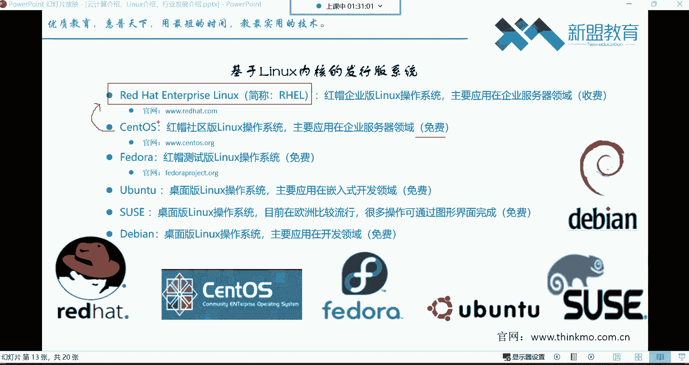

我找一下啊。

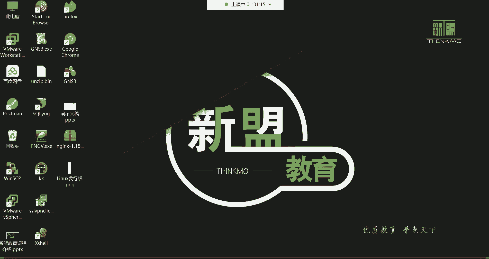

呃，VIP大礼包都领到了吧。在这个群公告里边。哎。嗯。展开一下哈。

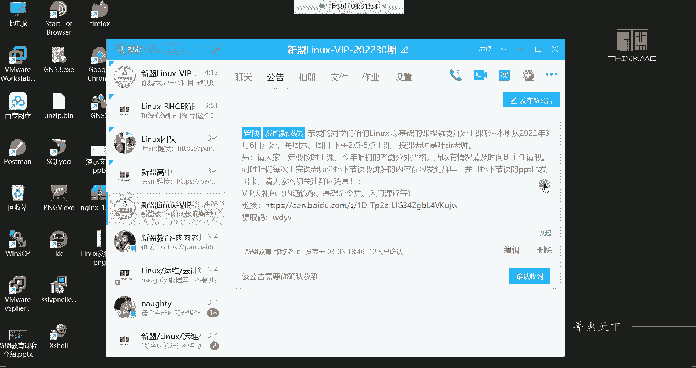

啊，这这里面是不是有个VIP大礼包？然后点一下哈点一下，你装的是7。9的，没关系啊，7。9也可以。😊，然后跟你们说这VIP大礼包里面都有哪些东西？没关系哈，有问题的话，我今天带着你们一起装一遍。😊。

提取码错了吗？啊。好，点一下哈。点进去。啊，这里边就是VIP大礼包，然后这里边有这个什么呢？嗯。这儿哈云计算简介及这个视频安装。那云计算简介的话呢，这个删掉啊删掉哈。啊，没事儿，一会儿我再删吧哈。

然后这个不好，我们这是安装教程。那个系统的镜像呢啊学习工具里面啊，这儿呢哈这里边有一个叫什么呢？有一个叫做系统班的学习工具。😊，啊，安装系统的时候的一个学习工具哈，然后在这个里边。😊，有这个VM威尔啊。

这是一个什么呢？一个虚拟机软件啊，一会儿给你们介绍这个VMV尔这个软件哈。😊，VM。威尔。虚拟机软件介绍。然后这里面呢还有这个软件，呃，你在安装的时候呢，需要的一个叫做激活码的一个密钥啊。

这个激活码就是你在安装这个软件的时候，他给你要一个码。那个码呢，你从文件里面找找到以后呢，然后呢到时候输入进去就可以安装成功了。OK然后这里面还有叫叉啊，这是一个什么呢？这是一个远程的连接工具。

这个连接工具，如果呃你有自己的这个像什么叉已经有的话，没关系，你就用自己就可以了哈。没有的话呢，这个呢然后你给它下载到你的电脑里边，这个也都下载到你的电脑上面哈，下载上去。然后我们用哪个呢？

这个这叫s透S7。😊，这个镜像看到了吧？这个啊可以哈可以哈。呃，这个镜像的话呢，就说我们一会儿安装系统的时候，我们不是要安装一个sintoS的系统吗？那这时候呢哎我们就要用这个镜像。

那这里面还有一个叫reo8啊，这个reo8，就是我们前面给你们介绍的这个红帽企业版的这个啊就是简称IHEL嘛，然后版本是8版本的。😊。

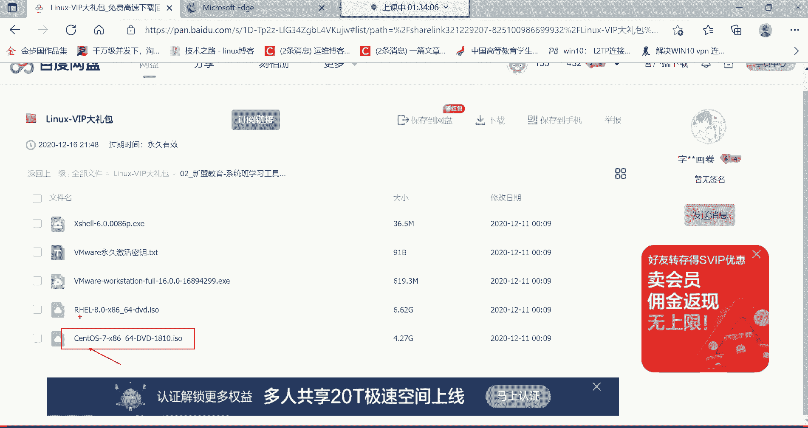

然后我们不安装这个八版本的哈。😊，不安装8了，为什么呢？因为这个8在企业里边那sS也有800万的，但是cinS这个8在企业里面现在已经什么呢？已经这个没有人用了，因为它已经超过它的一个维护期了。😡。

啊就8现在官方不维护了，所以我们现在能用的就是sintoS7啊这个版本的系统。所以大家就下。

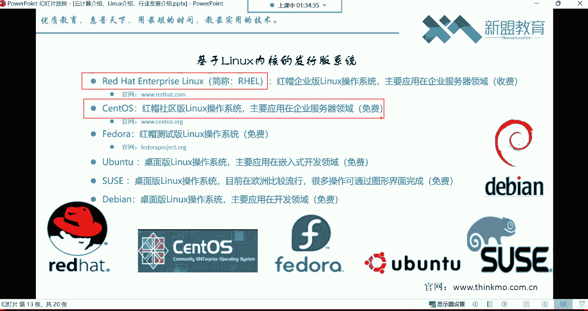

这个啊我这个是7。6的，然后你们也可以用跟我一起的。如果你们自己有，只要是7以上的版本都可以哈。什么7。9的呀，7。6的呀等等等都可以。😊，嗯。没关系啊，图图形渐面也无所谓。OK然后你们知道下哪些吗？

😊，这个哈哎这是我们要下载的。😊，都给它下载到你的电脑上面，知道吧？这个哈要下载的。😊。

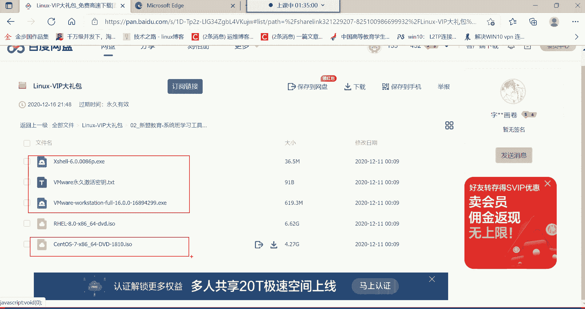

标记一下哈。

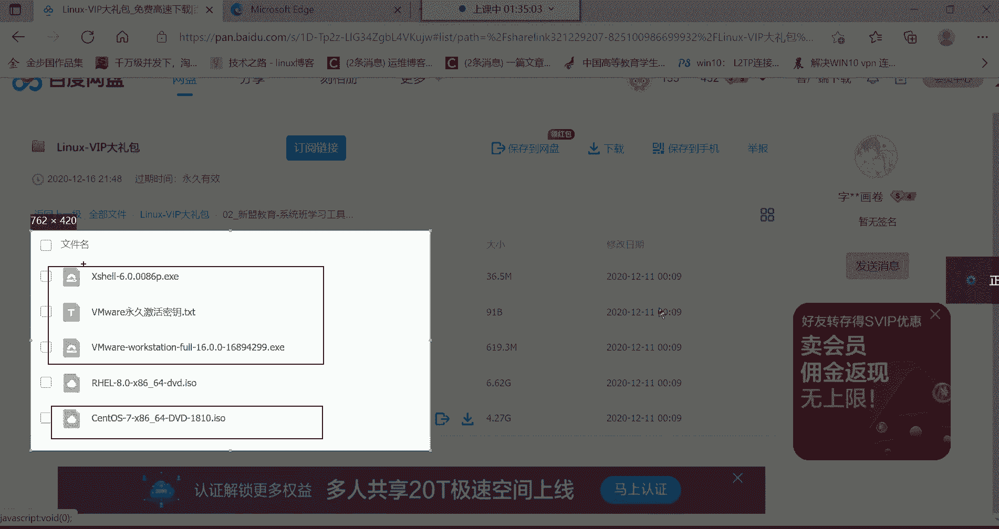

嗯。

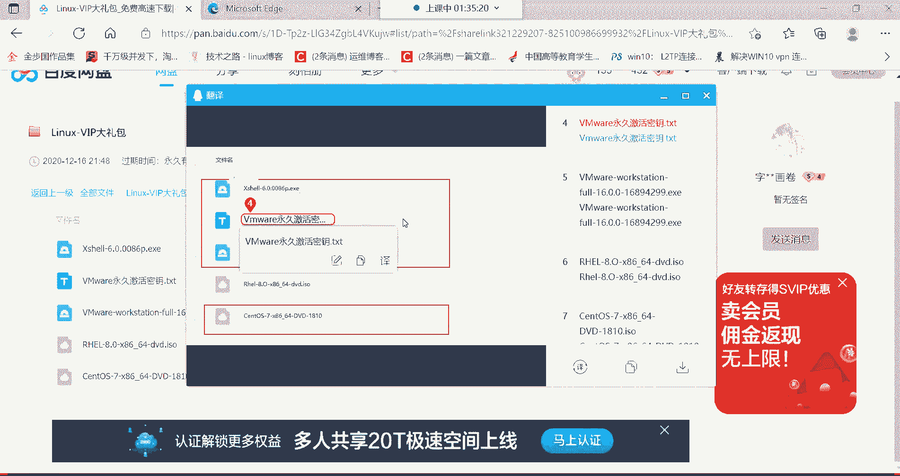

等一下啊。我给你们截个图哈，这是在这个VIP大礼包里边。😊，嗯。然后下单哪些东西，这是VIP大礼包，然后在这边。啊，需要下载的都给你们框起来哈啊还有这个。

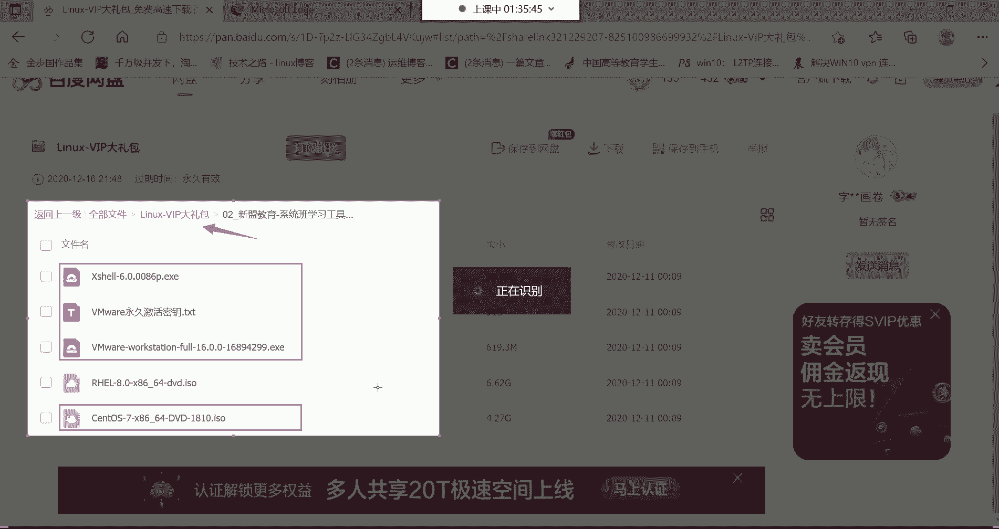

He。

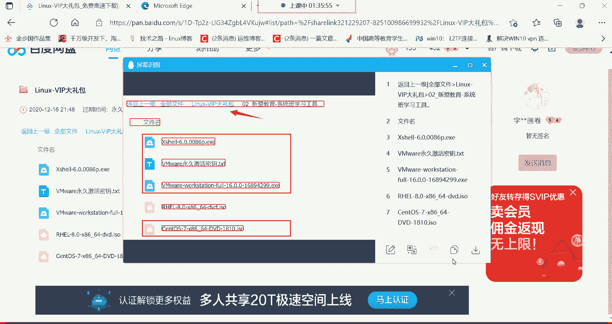

这截图怎么。下载。嗯，红框内的。软件到。电脑。

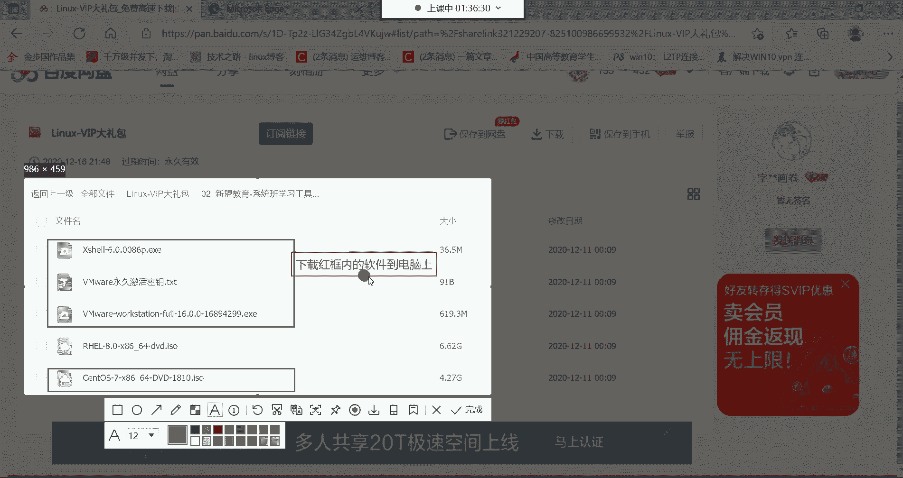

来哈。在网盘里边哈，这个呢我也给你们发到群里面去嗯。对。ok。知道了吧哎。你都下好了是吧？这个八的话呢是给考试人准备的。如果有人你说你想考红帽认证啊，你可以下载一个8的。不影响哈不影响。

再把这个七呢下载一下就可以了。但是你们啊先不用着急哈不用急，因为你你们课后安装系统呢是看着我的录屏啊去安装啊，跟我一起安的话呢，可能跟不上我的节奏。所以你们课后再去安啊，今天呢你们也不用担心跟不上哈。

😊。

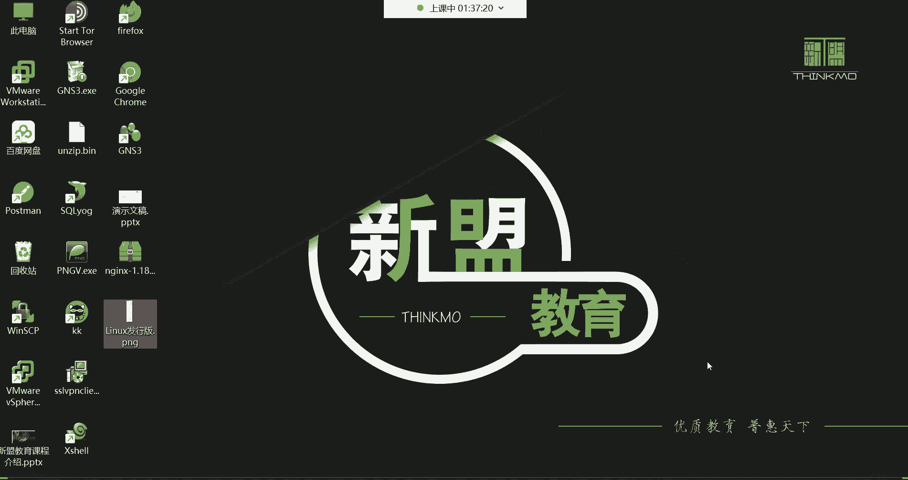

一会儿呢我给大家讲讲这个呃好的学习方法，好吧，好的学习方法啊，好的学习方式吧。

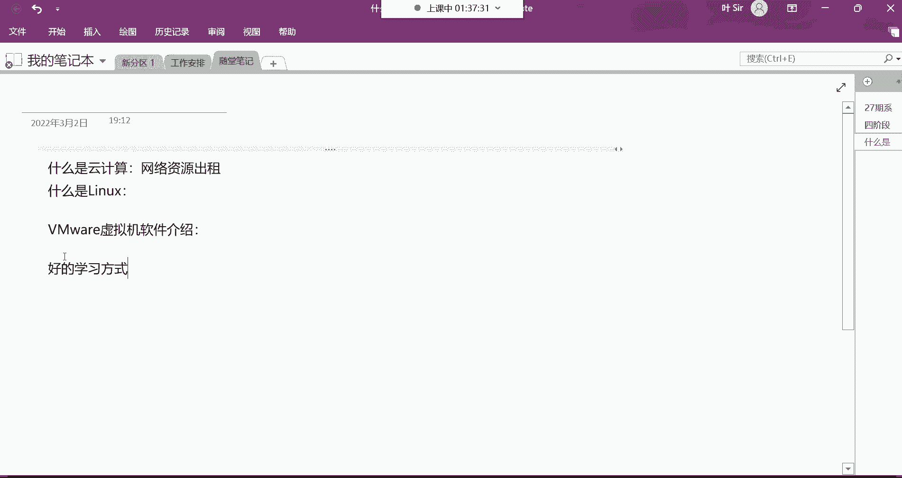

行，那我们说说这个虚拟机软件，你给它下载到你电脑里边以后呢，就是就是这个哈就这个图标看到叫weware worker station。😊，然后呢，双击打开它。

因为呀安装系统它得需要就是特别是系统在安装的时候，它的一个需要时间还是蛮长的。所以我们先安装上，然后呢，再去干嘛呢，再去讲我们后边的内容啊，这样呢我们可以什么呢？把这个时间给它合理的利用上。呃。

这个软件你首次打开的话呢，你看到的可跟我的界面是不一样的哈。因为我这个里边我已经提前创建过很多台虚拟机了啊，你们可以看到我这个左侧左侧呢是这个虚拟机的名称，这里面是不是有很多的虚拟机了呀啊。

有这个sS的，就好几台是吧？还有这个mys数据库的，还有红帽的re8的啊，还有这个上一个班的虚拟机啊，这个有很多哈，而你们左边什么都没有哈，所以呢什么都没有呢？我们要选择什么叫创建新的虚拟机。😊，啊。

第一步，创建新的虚拟机点。然后在这个里边呢，我们就来到了这个创建的向导界面。那他现在就问我了，他说你希望使用什么类型的配置。那创建虚拟机嘛是吧？呃，分为这个典型啊跟自定义这两种方式啊，那我们选择那种呢？

我们选择这种典型的啊，典型的话呢，你看通过几个简单的步骤就可以创建一个虚拟机出来。然后下边呢呃如果自定义呢现在暂时用不到哈，没有特殊需求，我们用不到。所以说呢我们就选择点型默认就可以哈，默认就典型。

所以选择下一步啊，点击下一步哈。啊接下来呢在这里边安装客户机的操作系统，也就说现在你可以选择给这个虚拟机安装一个什么样的系统了。啊，那安装方式呢看哈可以选择用光盘去安装啊。

也可以选择用那个叫做光盘的映象文件去安装这光盘的话是适合在什么样的环境去安装呢？就比如说物理机注意哈，如果你给物理机安装一个呃s托S的操作系统，那你可以去通过光盘去安装。因为物理机嘛，物理机，你想想啊。

它有叫光驱设备。😊，就是一些老式的台式机啊，你们呃应该都接触过那种这个像很多年以前那种台式机啊，它下面有一个像什么呢？嗯，有一个就像这个DVD插光盘的地方，你按个按钮就弹出来一个什么叫光驱设备啊。

把光盘放进去啊，把那个光驱给它推进去。这时候呢那光盘就有有这个操作系统啊，你可以通过光盘启动啊，就帮你去用光盘去安装。但是虚拟机咱没有光驱，是吧是？本来咱咱们是通过软件虚拟的一个机器。

所以说呢你不能选择用这个光盘去安装，你就只能选择什么呢？用映像文件去安装啊，所以我刚刚给你们截图的那个东西，就是映像文件啊，系统的镜像文件。😊，那里面就一个s团斯的系统。但是呢我们也不从这选。不从这选。

我们选择稍后安装系统啊，你先去给我创建一个虚拟机，然后呢再包含一个空白硬盘啊，为什么我要稍后安装呢？因为我们有很多东西是需要我们自定义的，知道吧？所以这时候呢选择下一步。好。

接下来呢选择客户机的操作系统啊，我们要安装一个什么样的系统呢？那这里边有windows的，有linux的啊，有这个后期的这个。呃。就是叫ESXI啊，那我们呢选择这个linux哈。然后版本呢在这里边选。

那你你看这里边啊，它给你支持的系统的版本，有sintoOS的是吧？有de的，有斐多尔的啊，还有这个susy的，还有oracle的，还有红帽read hat的，看到了非常多吧，是不是啊？啊这里非常多哈。

O但是你看包括乌班图的都有啊。那我们选哪个呢？我们选择sintoS的系统往上滑在这，然后找到对应的版本，你看那sinto啊在上面，stoS分为567，我们选择这个7版本，我一会儿会给你们介绍啊。

这个现在这个操作系统的版本。😊，操作系统的版本。介绍介绍什么呢？介绍这个红帽的。跟这个渗透S。它分为这个567版本。红帽也是567567，然后sinS呢也是567版本。然后这个位置呢选好的话呢。

我们直接选择下一步啊，然后在这边啊叫命名虚拟机，这就是让我们给这个虚拟机取个名，这就是左边的名字哈。这个名字呢你随便起啊，叫什么都行，中文英文都可以。你比如说我。😊，我就让他叫什么叫。😡，37。m。

然后系统班学习啊，我我让他叫教学用机。教学机。可以吧，然后后边呢再指定一个它的IP地址啊，IP地址现在还没有配，我们后期再配哈。IP呢我让它变成多少呢？变成。😊，呃，90。那我们后期会会给他配个IP啊。

IP地址的最后一位就给它配成90啊，IP多少，我们一会儿再说，好吧啊，你们可以先按照我这样去什么呢去命名。然后接下来安装位置。那安装位置的话呢，这个你可以自由选择了哈。在预览里边，你觉得你电脑里边。

你看你的哪块盘比较。😊，富裕啊，就空间比较充裕，看到了吧？呃，此电脑。你这里边你觉得你你的C盘充裕啊，还是你的别的盘比较充裕啊是吧，你就给它安装在哪个盘上面就可以了。然后如果C盘。

你的空间如果已经怎么说呢？占用比较高的话啊，对哈，最好是放到固态里边，因为它快嗯。😊，所以呢呃。你就尽量吧啊尽量能放到C盘就放到C盘。为什么呢？因为C盘啊就是如果你电脑是固态硬盘。

你的C盘肯定是固态的啊。如果空间充裕的话，放在C盘。如果空间不不充裕，呢，就别放到C盘了，毕竟C盘。在windows里边，C盘就是你的系统盘啊，就是系统在启动的时候啊，系统在运行的时候啊。

它的相关的重要文件都在这个C盘里面。所以如果你的C盘空间太臃肿的话，会影响你系统的运行速度。啊，所以看情况啊，你们就看情况安，我呢就安装我的安装到我的C盘。那我的C盘。我还可用空间还有1175个G呢啊。

所以我随便随便用哈OK那默认呢就在C盘了，看到吗？C盘这个路径，然后选择下一步。😊，O然后指定磁盘容量啊，这个磁盘容量默认是。他给我们分配了20个G的空间，这20个G的空间是从哪来的呢？注意哈。

它是虚拟机，你看它给我们虚拟一个磁盘，然后呢这个磁盘是20个G的空间。😊，那这个虚拟的磁盘空间，那最终它得从我的真机啊，就是我的windows电脑。的空间去干嘛呢？去划分。

出20个G的空间给这个虚拟机续用。能理解我说的意思吧？你比如说我这个我的电脑总共100个G的空间啊，那这时候呢我给虚拟机呢分配了20个G。😊，啊，那他就会从我的100个G里面去划走20个G分配给虚拟机。

能列了吧。那我的电脑还剩多少呢？是不是还剩80个G啊？😊，没错吧啊，是这样子的哈。😊，但是我告诉你，这个空间呢，它不是说一次性就划走，你给他800，没事哈，它不是一次性就全都把空间分配给虚拟机哈。

它是这样子的，就是随着不断的使用，然后呢再1。1点的给这个虚拟机分配空间。你比如虚拟机运行，总共呃需要占用两个G的什么呢？磁盘空间。那这个时候哎我们这个真机啊，就会给它分配两个G能理解吧？啊。

虚拟机如果说随着不断的使用啊，需要三个G，那就给它分配3个G。它不是说一次性把20个G全都给它。😊，啊，就是随着不断的使用啊，去干嘛呢？啊，去给他分配这个使用量，是这么回事。所以呢呃你们也不要担心。

你说我我给他分配100个G，那是候我真机电脑就没有空间用了，还不是。😡，那这个空间其实是什么呢？这个空间是最多哎，你可以使用我。20个G空间。哎，也就是说我最多会给你分配20个G。

那然后随着不断的使用呢，1。1点分配给你能理解了吧？啊，所以这个你不要担心分大分小都无所谓，在这个位置。然后下边呢。😊，啊，你到底是将虚拟磁盘拆分为啊多个文件盒儿。给他。啊，存储为单个文件。

那这个有什么区别吗？他就告诉你呢，你看如果拆分磁盘以后呢，可以更轻松的在计算机之间移动虚拟机。啊，但可能会降低大容量磁盘的性能啊，这个你不用去管了哈，你就存储为单个文件就行了啊。

这个我们几乎不会去移动虚拟机的，能理解吧啊，所以选择下一步。😊，OK然后接下来呢这个位置哈还是蛮重要的哈，叫自定硬件。😊，所以选择自定义硬件。什么叫自定义硬件啊？啊。

这个时候呢我们就要涉及到虚拟机的本质了。这个虚拟机软件介绍软虚拟机软件干什么用的呀？它是帮我们虚拟出一套完整的。硬件平台。然后呢，我们是在这个硬件。平台之上。去安装什么安装。操作系统。

这个应该比较好理解吧。你比如说你从外边你花钱买个电脑回来。😡，你这个电脑里面有什么呀？😡，你电脑里边无非不就是一堆硬件吗？哪些硬件啊？😡，内存条是不是啊？还有什么呀？还有磁盘，像砖头一样是吧？

磁盘有网卡，是不是啊哎硬盘。嗯啊，当然磁盘就硬盘啊，还有什么显卡之类的。没错吧，哎，鼠标然后键盘是不是？这如果你从外边花钱买个电脑，你的电脑里面不就是这一堆硬件嘛？是不是就一堆硬件哈，然后呢。

你是在这一堆硬件之上去干嘛呀？呃，去才能安装操作系统。因为操作系统是需要底层的硬件资源。😊，他才能够。安装成功的。啊，因为系统最终是安装在你的磁盘里边，那你没有磁盘，你怎么安装系统啊。

是不是那你没有内存的话，你这个系统也开不开机呀，是不是啊，你没有显卡，你想你怎么看呢？是不是嗯？😡，显卡声卡之类的，是不是？那你看啊什么网卡显卡声卡之类的，没错吧，哎，这不就一堆硬件嘛。

所以虚拟机它干的事儿就是帮我们虚拟出一套完整的硬件平台出来。哎，有了硬件平台了，咱们再去干嘛呢？再去安装系统就可以了。所以你看我们前面干的事儿，干了什么事，就是创建了一个虚拟机出来，知道吧？😊。

那这个虚拟机它不就是帮我们虚拟出了一个内存条是吧？CPU。还有什么呢？啊，这是一个叫DVD啊，这是虚拟出一个驱动啊，光驱设备哈。😊，但是呢我们一会儿再说，好吧，还有网络设备器，这叫网卡啊。

帮我们虚拟出一个网卡出来了啊，USB控制器啊，就是USB接口，你看虚拟出一个声卡来啊，打印机的接口啊，显示器。😊，看到了吗？这不就虚拟他干的事吗？😡，啊，但是没有什么鼠标键盘哈，这里边。😊，好。

那接下来我们就得选择一下啊，我们对这一堆硬件，你比如说内存啊，你希望这个虚拟机的内存空间是多大的内存呢？哎，这个就蛮重要了。你看啊那虚拟机呢啊就是我们改啊，就是你的对于这个虚拟机。注意事项啊。注意事项。

呃。Okay。呃，我们在这个什么呢？在学习的环境哈，学习环境，我们是通过虚拟机去安装操作系统的，安装linux的系统。嗯，但是呢我们对于我们真机的一个内存啊，其实我还是什么呢？

还是建议哈建议在16个G以上。为什么呢？因为这个虚拟机特别消耗内存，虚拟机就比较消耗内存。啊，其实也不能说虚拟机消耗内存，而什么呢？而是本身我们的电脑内存就。😡，比较少，没错吧。

你看我你知道我电脑多少内存吗？我的电脑。😡，给你们看一看哈。我的我的电脑总共8个G内存。😡，8个G的内存哈。来给你们看一下，你看我的内存就8个G，看到了吗？😡，8G内存的哈那对于8G内存。

那我们在创建虚拟机的时候，你看我电脑总共8G内存，我电脑一运行是吧？我起的所候的软件。😊，那，都是持我这8个G内存的那这8个G内存的话，你想我再分配给虚拟机点。比如说我这个虚拟机，我分配两个G内存。好。

一台虚拟机分配两个G，那后期你看我这左边我创建了多少台虚拟机啊，1234567台是不是啊？这那再创建，那这台是第是第八台了。那我如果一个虚拟机，我给它分配两个G内存，我2816，我16G内存没了。

是不是那你看我电脑总共才8G内存，我上哪去去淘这16G内存去。这怎么办呢？呃，所以我建议大家内存还是稍微大一点啊，16G以上，特别是后期在做一些这个比如说大型的环境的时候啊，部署集群的时候。

我们都得需要好几台虚拟机、三四台、四五台虚拟机。那如果你内存小的话，你真的是跑不起来。这实验你就没有办法去做。😊，能列吧，所以内存要求呢还是这个。大一点啊，对CPU什么的硬盘那无所谓了哈。

硬盘我们基本上都是至少都是几百个G起步是吧？有的同学硬盘都几个T没错吧，嗯，所以内存大一点。但是呢我们分配内存的话，我给你讲讲，你比如说对于这个虚拟机。

你看默认的是此虚拟机使用内存10241个G吧是吧啊，1个G啊，没有后面那个8。😊，一个G这一个G的话呢，它也是像磁盘一样啊，特点是一样哈，就是随着不断的使用呢给这个虚拟机去最多分配一个G内存啊。

注意啊是最多分配一个G内存，也不是说一次性就给这虚拟机给这个虚拟机一个G内存了。还有就是这个虚拟机如果你一关机的话，那它是不会消耗你的内存的，只有开机的时候才会消耗内存。

如果一关机这内存呢呃这个还是在你的真机上面能理解吧啊，所以这个没有关系哈。你看这机器如果都关机是不消耗我我的物理机的内存的。😊，啊，所以这个呢你分配一个G也行，分配两个G也行，咱们就直接2048。😊。

2048。大点安装系统速度也快一点，好吧，2048。然后接下来呢选择处理器，这处理器是什么？处理器就是CPU的意思。😊，啊，CPU就是处理器啊，全名叫中央处理器啊，就是计算机里的核心啊。

中央嘛是吧在你那个呃电脑的主板上面的最中间啊，就是什么呢？就是CPU啊，叫中央处理器啊，CPU干什么事了呢？CPU我们后边再说啊啊，接来呢你要给这个虚拟机分配啊，多少个CPU你看这CPU的数量几个呀。

这个根据你真机去分配，我的真机就1个CPU。😊，就1个CPU啊，所以那给虚拟机呢也分配一个。😊，那你分配俩也没用，为什么？因为最多他以你的真机为准能理解吧。好，接下来那每个CPU的核心数量啊。

就是这个CPU不是有有什么四核8核的嘛，是不是啊？那你要给这个虚拟机分配几个核？😊，那一个核就可以了，两个核吧，分配两个核，好吧，但是这个东西也是根据我们这个电脑的真机去分配。你比如说我电脑总共4个核。

是不是啊你CPU总共4核，那你的虚拟机你也不能分配超过4核，能理解吧啊，咱就分配两盒，一会儿让它安装系统的时候速度快一点。那接着呢。😊，就正常来讲，一个盒就够用了哈。么接下来呢这个叫新CDDVD啊。

这个位置就还是蛮重要的哈。这个位置就是我们要选择如何安装系统了。那这个位置呢，我们前面并没有安装系统，并没有安装是吧？只是前面你看我们创建了一个空白硬盘，加一个虚拟机，但并没有安装系统。

那接下来在这个位置，我们要选择安装系统。第一种方式使用物理驱动器。😊，什么叫物理驱动器啊？😡，有人知道吗？物理驱动器。吃啥呀？嗯，就是那个。U盘。啊，U盘哈。就是现在服务器安装系统是通过U盘去安装啊。

就是你把那个系统下载到你的U盘里边，然后给它插到你的服务器那个USB那个USB的接口上面。然后到时候呢就可以去通过这个U盘去安装系统啊，但是但是呢咱们并不会通过U盘去安装，是不是啊？那我们用什么呢？哎。

我们就选择下面这个使用ISO的音响文件安装。啊，硬象文件。哎光盘U盘嗯都是叫物理驱动器。然后接下来呢，你看我们选择使用硬象文件的时候，那硬象文件你得找到那个硬象文件呢，那接下来浏览。啊，在浏览里边。

这时候往下滑啊，你就找到你的那个森团式那个镜像文件下下载到你电脑的哪个位置了，你就选择一下。你看我这个呢是在我电脑里边的这个E盘，看到了吧？那这时候呢我就选择一下呗，然后打开OK那现在就什么呢？😊。

到时候呢我一开机注意哈，我一开机，到时候它就会通过这个文件去帮我去安装一个sin头OS的系统。是这么回事。嗯。好了，那接来呢。这个系统选择好了是吧？哦，下边网卡的配置，这叫网络适配器。

这个网络识配器它是干什么用的呢？就是决定我这台虚拟机跟我这个真机之间那他们如何通信。哎，质行意件哈。我怎么退出了呢？啊，前面都选好了是吧，网络适配器。那，接下来呢我们这里边有三种网络连接模式。

三种网络连接模式，这个怎么去理解？来哈，我们得画一图说。😊，最后啊给你们在哪画个图呢？在这儿。我给你们画一个图。然后你看啊这是一台虚拟机。一会儿的吧哈，我这样。😊，我给你们。T。

我给你们找一个图给插进去哈。嗯。这是我们的windows电脑，是不是啊？😊，好，这是一台windows电脑。放大点哈OK。然后接下来呢，我们是不是在这个电脑里边，咱们自己去创建了一台虚拟机呀？啊。

这是在里边，这是一台虚拟机，我们换个颜色哈。当了黄色。虚拟机。字体换成黑色okK这是一台虚拟机。那虚拟机呢正常来讲啊，这台虚拟机你看我们的电脑本身是不是有网卡呀，这是我们的真机网卡。这样哈。真机的绑卡。

那虚拟机里面呢虚拟机它它也是有网卡的那这时候啊虚拟机里边也有网卡。这是虚拟列的网卡。好放到这儿哈，虚拟的网卡。那这个虚拟的这个虚拟机呢，你看正常来讲，我们在使用它在学习的时候，我们要干嘛呢？

有的时候呢需要连接到外网去，注意哈，连到这个外网。😊，比如说虚拟机呢，我想去从这个某一个网站下边去下载一些软件包啊，到我的虚拟机里边。那。这个时候。它这个效果是什么效果呢？这是外部网络哈。好，O。

那这个虚拟机他想访问这个外网的话怎么办呢？那这个时候他得通过你的真机才能够去访问外网，能理解吧？因为并竟虚拟机嘛，是吧，包括网卡都是虚拟出来的。那这时候想去用它真正去访问互联网的话，得通过你的真机。啊。

还有一个问题就是虚拟机，我想跟这个什么呢？哎我想跟我的真机之间相互通信。那这时候他们之间怎么去通信呢？哎，那这时候呢就是我所说的这叫网络模式。所以这网络模式就是用用来决定你的虚拟机。

他跟你真集之间用什么样的方式去通信？还有一个你虚拟机通过一个怎样的方式去访问互联网？啊，所以这就属于叫网络连接模式。三种第一种呢叫做桥接模式。桥接模式呢，它给的解释也非常通俗了，直接连接物理网络。

什么叫桥接？桥接就是嫁接的意思啊，如果是桥接模式，它是干嘛呀？就是把这个虚拟的网卡跟你真集的网卡给你绑定到一起了。注意哈，绑定到一起了。😡，那特点是什么呢？特点就是如果说你的真机啊。

你比如说我用的IP地址是这个192。168。0这个网段的，比如点0点10。点00网段的哈那这个时候虚拟机你想跟你真机之间通信的话，那这个时候你的IP地址也要改成跟你真机的这个网卡在同一个网段。哎。

那你虚拟的网卡也要改成什么呢？比如说。11。只要是这个连网段的就可以哈。啊，要求要在同一个网段。嗯。然后。调接模式。调节模式。那这个时候呢，如果你的真集他可以访问互联网的话。比如你的真机可以访互联网。

好，那你的虚拟机。也可以干嘛呢？啊，也可以通过你的真机去访问互联网。啊，是这么回事。这样哈。就这个意思能理解吧？所以这叫桥接模式啊，要呃迅拟的网卡跟你的真机网卡呢给它做一个叫绑定啊，绑定到一起了。

然后呢，到时候去那绑定到一起，IP是需要在同一个网段是吧？那他们可以通过相互通信啊，它也可以访问互联网，是这么回事，这种叫做叫做桥接模式。😊，调节模式。那NET模式呢呃但这种模式它有有一些这个缺点哈。

什么缺点呢？😊，缺点就是如果你说哎呀那我的真机，比如说你你的这个真机啊，如果是个笔记本，你比如说你换网络了，你去公司了，那你们公司有可能是哪个网段呢？172这个网段的，你不是我们公司是172。16哎。

这个网段的那你看你真机的IP地址跟你虚拟机，是不是它不在同一个网段啊。😡，是不是啊那不在同一个网段。那你讯机就连不上你的真机了，知道吧？就没有办法帮你什么呢？啊，帮你绑定，因为不在同一个网络。

所以这时候怎么办呢？这时要求你虚拟的地址也要改哎，虚拟的地址也得改成172这个网段的啊，跟你的真机的网卡都要在同一个网段。😊，啊，这样才可以。所以这就是敲接模式的缺点。呃。

缺点就是如果你的真机的网络需要频繁啊去什么呢？去更换的话啊，它的环境会频繁更换的话，那就不要选择这种桥接模式。那用什么模式啊？啊，叫NE模式。现在不是才28期吗？不是啊不是28期，37了哈。

因为这个咱们初级叫2020嗯，27，那还有高级、28、29呢啊，这就是30。然后。那这个NET是什么意思呢？用于共享主机的IP地址。啊，这个共享主机的IP啊，它的特点是这样子的。

就是这个虚拟机里面呢啊它这个。我们把这个虚拟机啊安装啊，这个都是一样的嘛？啊，类似啊功能都一样，但是方法还是有略微差别。就是说我们怎么说呢？我们把这个虚拟机安装在我们的电脑里面以后。

你的电脑里边啊会产生2块网卡。第一个呢叫呃VM。耐。8。就是网卡。啊，叫VMnet8这块儿网卡。在我这个电脑里边。然后还有一个叫VMnet一这块网卡。等会儿。还有叫VMnet1。那个一OK。

那这两块网卡啊对台式机就用调节啊，笔记本呢就用NET。那这个这2块网卡呢，在你真机里边啊，你看右击啊选择网络跟internet设置点这个哈。😊，然后你看你往下滑，往下滑的话呢，我给你找找哈。

你们电脑里面也有，你看你的。😊，你看你的这个。网卡信息的时候啊。你就可以发现。你的电脑里面就多出来了什么呢？就这个东西。就这个哈。叫做VMnet1。啊，跟这个VMnet8这2块网卡看到了吧？

这2块网卡哈，那这两块网卡干什么用的呢？就是。虚拟机跟真机之间。的一个什么呢？呃，算是。交换机吧，你这么去理解，你把它可以理解成是一个交换机或者网关都行。它是这样子的啊，就是你看我们这个。

如果我选择的网络模式啊，虚拟里边我用的网络模式是这个NAT的模式。NAT的网络模式。那这个时候呢。它叫做网络地址转换啊，它是怎么转换的呢？你看它叫网网络地址转换，用于共享主机地址的。首先呢NET模式。

他呢是。比如说呀你的真机呃网卡跟你的虚拟网卡呢，比如说不在同一个网段，你放心，他们之间呢是通过什么呢？是通过这个东西。是通过这个VMnet8这块网卡。注意哈，通过这块网卡。去什么呢？去做一个相互的通信。

你比如说。😡，你看看，比如你你这个机器是这个什么呢？是这个哪个网段的呢？比如是172网段的，那我虚拟机里边，比如我就用192这网段可以吗？192点168这网段。没有任何问题啊。为什么呀？他们也能通信。

是因为啊这2块网卡啊都插到同一个交换机上面了啊，他们是通过交换机。😡，注意哈，那都绑在同一个交换机上面，那他们就能通信。啊，都插在同一个交换机上面。那，所以说它跟桥接的差别就是它是得需要一个什么呢？呃。

这个中间的一个网卡的啊，或者是一个中间人做一个什么做一个转换的意思啊，做一个转换。啊，你迅机想跟他通信干嘛呢？哎，你通过VMn8啊，才能跟这个真机通信啊，做做了一个转换。😊，O。那做转换以后呢。

那如果你的这个虚拟想访问外网怎么办呢？啊，虚拟机想访问没没有关系哈呃，那虚拟的里的地址呢，它可以啊通过你的真机网卡的地址也去访问这个互联网。那也就说NET模式。😊，啊，也是可以访问外网的，能理解吧？

OK。那第三种叫什么？第三种叫做仅主机模式。这仅主机模式叫与主机共享的一个专用网络。啊，金主义模式呢，它是通过这个VMnet一这块网卡。啊，通过VMnet一这块网卡，然后干嘛呢？

通过这块网卡跟你的真机网卡去通信。在这哈。啊，这样跟真集网卡去通信。哎哎哎啊，这样哈。换个颜色啊。跟着金去中心。那嗯。嗯。然后说一下哈。😊，但是呢它有个问题哈，你看它叫什么呢？它叫做一个专用网络。

什么叫专用网络呀？其实就是一个局域网的意思。局域网哈，也就说这个外如果你选择的是这个仅主机模式，那你的虚拟机跟你的真机啊，他们通过外net一啊，是可以相互通信的。但是。😊，这个训诫他没有办法访问互联网。

啊，迅息是访访问不了互联网的哈。因为是一个专用网络吗？😡，啊，所以这个你们要搞清楚。好，这以上呢就是给你们所说的这个什么呢？就是三种网络模式。那现在你看我们总结一下。第一种调节模式是吧。

一呢就是可以跟你的真机啊去相互通信。你真机访问外网，但是呢虚拟机也可以访问外网，前提要保证他们得在同一个地址段啊。所以适合什么呢？适合你的这个台式机。去用要网络不频繁更换的环境下可以用它。

那如果你的网络频繁更换，比如说个笔记本啊，来回要换网。那这时候呢。你选择NAT模式NE模式呢没关系哈，虚拟机跟你的真机，你不需要在这个必须得在同一个网段。他们通过NET方式给你做做了一个转换啊。

主要是通过VMnet8那会网卡啊，可以进行相互通信，然后也可以去访问外网啊，只要你的真机可以访问外网。那你的虚拟机也可以访问外网。而这个仅主机模式呢，一般呢就是只适合什么呢？就是虚拟机跟真机之间通信啊。

但是虚拟机不能访问外网。😊，所以由此可见，我们用哪个呀？啊，我是笔记本，我就用NAT。那你们也用NAT吧，是吧，咱都环境给他配一样喽，OK吧。啊，所以选择A模式。

那下边啊USB接口、声卡、打印机这些东西啊，通通删掉，用不到哈。😊，这些东西也也都是虚拟出来的。😡，那虚拟出来的话呢，但是呢我们呃用虚拟机里面根本不会用到什么USB接口，也不会用到声卡。

也不会用到打印机。所以这些东西呢咱们就没有必要浪费它是吧？选择移除啊，选择以后下边叫移除。😊，看到吧？声卡移除。哎，打印机移除。好，那显卡移除不了哈，就放这吧。然后接下来呢选择关闭。😊，那硬件定义好了。

是不是啊？你看我们现在需要哪些硬件，就硬盘内存网卡，是不是CPU。😊，没了。然后选择完成。OK那一台虚拟机就创建好了，注意哈，现在这一个虚拟机就创建好了，而且硬件呢我们我们也都选择完事了。😊，嗯。

那选择完事以后呢，我们选择叫开启虚拟机。这时候他就干嘛呀？他就去帮你去干嘛呢？去安装系统了，注意哈。😊，等一下哈，这时候呢它就会读这个镜像文件，去帮我们通过这个镜像文件去把这个系统给我安装上。

所以这时候呢我们就直接选择开启虚拟机。😊。

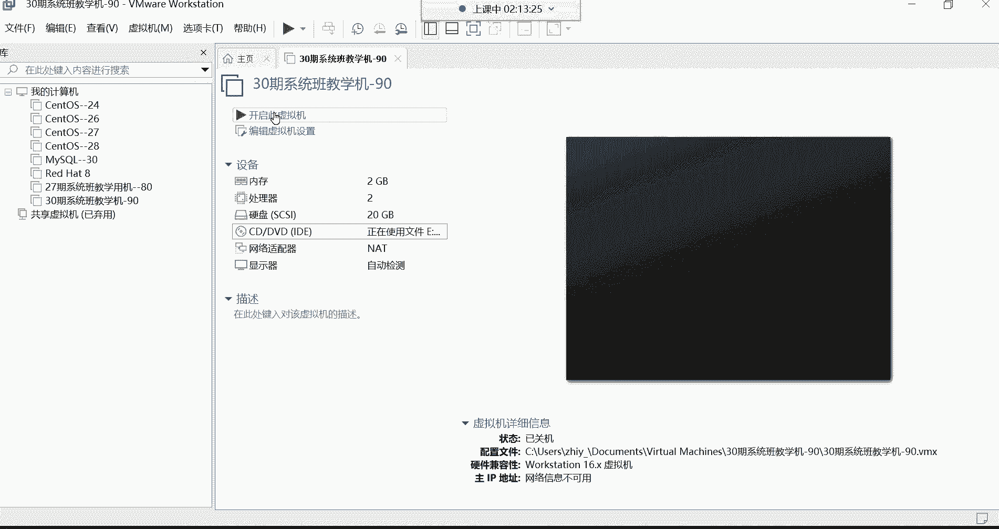

等一下哈，然后来到这个界面呢，这是一个菜单啊，菜单界面。什么叫菜单啊，就可以让你选的。那这时候呢啊你就选择你看先把鼠标点到虚拟机里边哈，看看我这个鼠标先在外面呢点进去，点进去就看不到了是吧？

看不到以后呢，用键盘上下键看到了吗？哎，我这个光标当天在哪呢？哪就显示白色，看到了吗？哎，来回可以看看得到是吧？O啊，选择第一行叫inst到 sentence7，就是直接安装这个s7系统。

那第二行呢啊叫测试我的这个系统，并且再安装它，要不要测试呢，不用测试啊，他想测试你的这个什么呢？镜像文件啊，看看是否这个完整。那不用啊，直接inst到 sentence7，然后开个回车就行了。

这时候呢就开始安装。😊，OK然后你们注意看哈，现在在我这个虚拟机这个黑界面上边，下边有一小部分黄色的提示。这个提示它提示什么呢？他说你按cttrorl加alt释放鼠标。什么意思啊？

就我现在这个鼠标没有在我的真机，是在虚拟机里面的。😡，能理解吧。所以呢你想用你的鼠标的话，你得把这个鼠标从虚拟机里面给它干嘛呢？释放出来。所以这时候按ctrl加。😡，alt键啊。

你看现在我这个鼠标就回来了，看到了吗？你再点进去啊，又跑到虚拟机里边了。😡，那这时候你再cttrorl out哎，又出来了，能列了吧，这时候是在真机点进去就在虚机里边啊，ctrorl out啊。

下面这个提示是吧？😊，然后下面这步呢什么我已完成安装，这个你先不用管哈，插掉就行。😊，调他就行。那就一个提示而已，不影响哈一个提示。然后来到这个界面呢，我们要选择一些什么呢？啊，就是语言。

首先呢就是叫安装界面的语言。我们安装系统呢会这个做一些一系列的操作啊，所以这时候啊你的安装界面啊选择语言。那这时候呢默认是英文的哈那这个这无所谓，你可以。😊，选择中文啊。

下边哈下拉看到这里叫中文安装界面嘛无所谓。右边简体中文默认就行了是吧？然后继续。😊，OK那就是我我们刚刚选择中文以后呢，这个界面就是以中文的形式给我们展现了啊，这样呢你看起来不能看得懂嘛，是吧？啊。

然后在这个界面我们需要做哪些事情呢？😊，呃，第一呢就是把我们当前的这个系统的日期跟时间呢啊给它。啊，调整一下啊，调整到我们一个当前的正确的时间点进去。首先呢地区是亚洲，然后呢，城市选择上海啊。

默认情况下，你们那个应该不是哈，你们要在这里面选择知道吧？哎，亚洲看到了吧？然后呢，城市选择上海啊，选择上海OK。😊，然后接下来呢就是告诉他啊，我当前这个机器啊，就是所在的地区是。亚洲啊。

然后城市呢上海。那接下来呢呃这个日期时间我们就改一改啊，先改这个年月日啊，2022年3月7号啊，但是好像不太对劲吧，是吧？啊，3月6号今天是。在6号，然后时间呢现在是16点05分，那我们给调一调。

在这调一调哈，16点05分okK调整好了吧，调整好以后呢，选双双击完成。😊，啊，完成了哈，那现在日期时间就调整好了。然后接着键盘汉语啊，这就不用管了，默认就行。

语言支持简体中文OK然后下边呃这也不用管哈，安装戒指这位置我们要点进去。😊，呃，哎呀，等会儿啊，这不用管哈，安装介指本地安装啊，这确实是从本地的那个镜像文件安装的，所以这边也不用动，知道吧？不用动。

然后软件选择这边点进去。😊，这里边呢你看我们可以选择这个系统是最小化的安装啊，还是呃带一些这个比如说啊丰富的功能啊啊，一般对于企业来讲，企业喜欢最小安装。看到吗？告诉你了，如果是最小安装。

他就给你带一些最基本的功能。😡，但有的时候你说哎呀，我们你说。😡，我们第一次安装这个系统是吧？可能说呃如果最好安装呢，我们对这个系统不熟悉，后期遇到一些比如说需求的时候，你发现这个有些工具啊。

这个系统里面没有。那怎么办呢？如果没有的话呢，我们可以选择这个。啊，叫做。呃，呃当然哈选择一个带叫带GUI的服务器。😊，这个带GY的服务器呢，你看右边这个可以给你带的功能就有些多了，是不是啊有哪些呀？

😊，啊，你看包括系统的管理工具啊，还有一些开发工具，你看基本的开发环境看了吧？啊，安全工具啊等等等等。然后这种东西啊啊什么java的平台，这些啊支持java的。包括一些什么FTP啊，这些文件共享服务。

电子邮件啊、DNS这些东西。哎呦如果你需要这些的话。他也会帮你安装上，但你得先勾选上，注意哈。那这些东西呢我们通常来讲，我们不需要去在这个位置去选择。

因为这个东西后期我们会随着不断的学习呢自己去手动去安装，能理解吧，在这边大家还不用管，你干嘛呢？啊，我们。😊，在这儿。啊选择最基本的系统管理工具。但是我还要给大家说一下，这个带GI的服务器是什么呀？

带GUI的服务器。😊，是一个啊用于操作网络基础设施的一个服务，就是主要是它带图形界面啊，下面一样，你看gnunuKDE。他们都是给你带一个那非常直观友好的桌面环境。这种啊看到了吗？什么跟no也一样啊。

非常直观的友好的桌面环境。😊，那对于我们来讲，咱们最小安装吧。😡，好吧，兄弟们。嗯，咱们就最小安装吧，然后自带一些系统管理工具。后期呢咱们随着不断的学习，比如说这个系统里面缺少什么东西，咱们自己再去安。

😊，是吧哎，因为我们不需要图形啊。😡，啊，不需要咱就最小安装啊，所以选择完成。😊，因为在企业里面都是最小安装。😡，啊，选择完成OK。啊，带一些最基本的工具就可以了。OK因为往期的话呢，我都是。

会带领大家安装一个什么图形化渐变的。啊，其实我觉得没有必要。你要毕竟在企业里面，我们不需要这种图形。😡，OK然后下边呢看安装位置啊，这位置得点进去啊，安装位置是什么呢？

就是你的这个系统安装在这个虚拟机里的哪块硬盘，我们虚拟机里面不就一块硬盘嘛？20个G的是吧，双击一下，出现一个对勾就可以了哈。好，那这个硬盘分区的话呢，就先让它自动分区就可以了。

因为我们现在并不会分区啊，这边让它自动分。😊，然后接下来完成。O。然，下边的这个是叫做内核的崩溃转储机制啊，这它默认已经开启了啊，这你就不用管了。嗯。然后这这也不用管哈。

这都是那一些这个对于系统的一些这个使用协议了哈，你就不用管完成。😊，好，下边网络和主机点进去网络跟主机这里边看看，首先呢这里边可以给你这个机器取个名。啊，看到了吧？主机名默认叫local host是吧？

注意哈，这主机名不是左边这个左边这叫虚拟机的名字，知吧？这个是我们安装系统以后，进到系统里边的那个主机名啊，所以这个默认就叫这个名字，你先不用管啊，后期通过命令的去改它就可以了。😊，啊，到玩命令呢。

有点紧张了，有啥可紧张的呀。好，然后接下来呢我们这个网络要配置，注意，这是网卡，看了吗？这样以太网ENS32，这是我们虚拟里的一块网卡。😊，那这个网卡呢没有IP地址，那我们得给我们得给他配个IP。

所以呢选择配置在这哈配置。😊，好，然后接下来呢在这哈啊以太网是吧？然后这时候选择IPV4设置。😊，啊，我要给他配个IPV4的地址。然后接下来呢方法呢。下拉选择手动啊手动PIP，然后ADD啊添加一个地址。

那我们用的地址是192点168。0这个网段的。然后呢，最后一位咱们就用什么呢？用这个90啊虚机，我在命名的时候，是不是让它叫90啊，那这时候那我就。把他IP也给他。12乘90，为什么呀？

因为那机器多的时候，你比如说我想连这个机器，如果。你不知道这个机器的IP的话。😡，你得先开机啊，然后呢用这个虚拟机登录，然后才能看到它的IP地址，然后再去远程连接，这就有些麻烦了。

所以你还不如这接干嘛呢？哎，在创建虚拟机的时候，就直接啊把它的IP想好是吧？然后放到虚拟机的名字后边以后呢，你一看一看到这个机器你就知道啊，我这个机器它的IP地址是什么呢？哎，192。168。0。

90啊，反正我们所有的地址用的都是这个192这个网段的啊，具体用剩下就看最后一位了。😊，啊，90，那以后就是一一看到，我就知道他IP是多少，OK吧。😊，好，那下边的子网掩码这个点一下子网掩码24位啊。

然后网关我们用这个哈192。168点儿。😊，点0。254。啊，这个IP地址子网掩码网关之类的。这个应该。呃，都了解吗？有没有一点网络知识都没有的呀？啊，一点网络基础都没有的，给我刷个衣上来。😡。

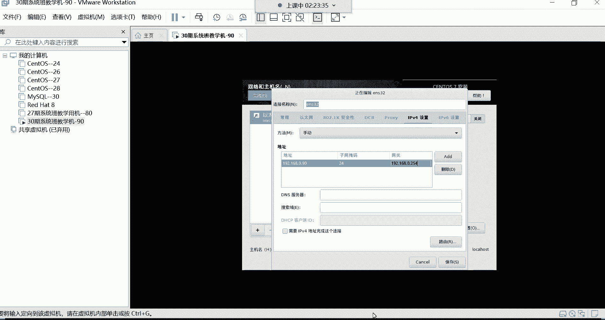

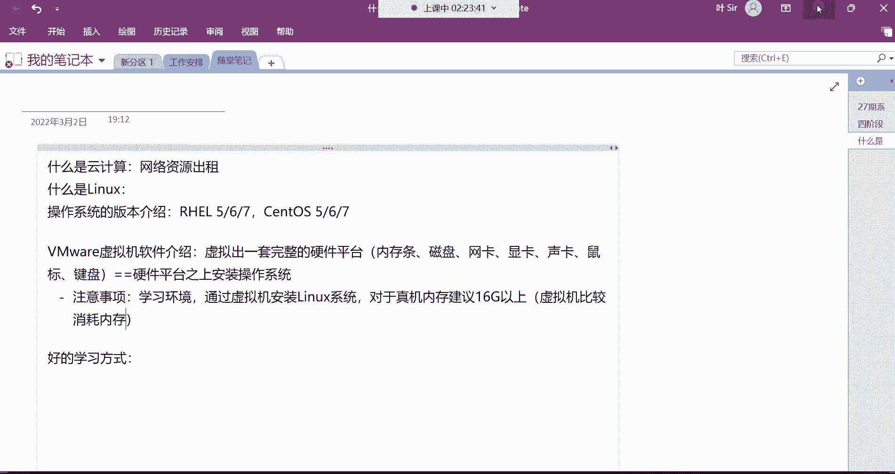

嗯。一点网络基础都没有的。啊，你们这属于一点网络基础都没有是吧？比如什么IP地址，IP地址啊啊子码掩码啊，网关这到底是干什么的，可能也不是很清楚是吧？😊，好，没关系哈。呃，这个呢我也是。😊，嗯，对。

就先跟着我配哈，先跟着我配。这个呢我也考虑到了是吧，你们那个这种确实是。😊。

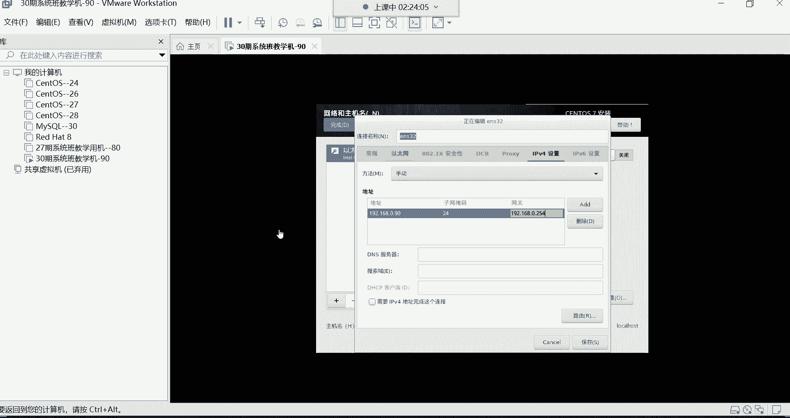

网络也不太懂的那怎么办呢？VIP大礼包哈嗯。😊，说一下啊。没关系哈，这种东西没事看一看就可以了。😊，不需要网络呢不需要掌握太多，只需要把IP地址是吧，还有一些这个OSI7层模型了解就可以了。

看这个VIP大礼包里边啊，看了吗？😊，点进去。孩子。呃。你不用换算IP里，现在不用你换算哈，你换算它干嘛呀？😊，这里面有有一个什么呢？有一个叫做。😊，哎呀哎我我给你们啊，我知道了哈。😊。

然后我得跟你们说一下，如果你们没有没有网络基础的呢。😡，学习工具命令。软件大礼包。看这软件大礼包用不上了哈，为什么呢？软件大礼包。😊，大多数我们都是在线下载的啊，所以没没关系，稍后我再删吧嗯。😊。

如果说没有网络基础的，到时候我。

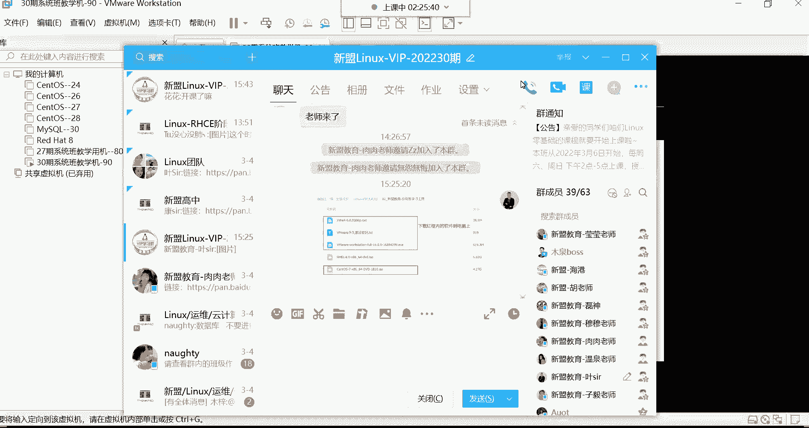

这样吧哈，我发一个网络的。

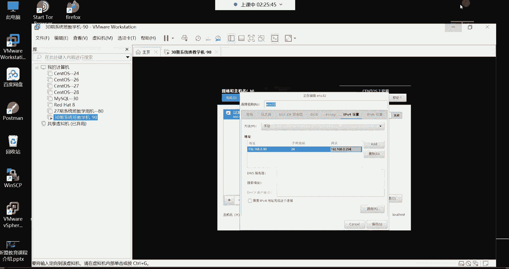

视频啊。嗯，考完C就去干IE啦。哼变删是吧？😊，我们整个学习阶段，我我们用到的所有软件包都是可以在线下载啊。

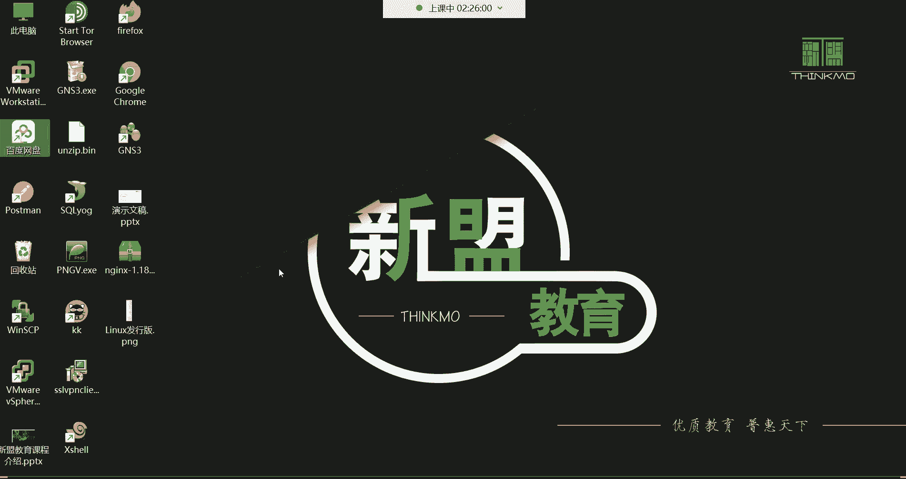

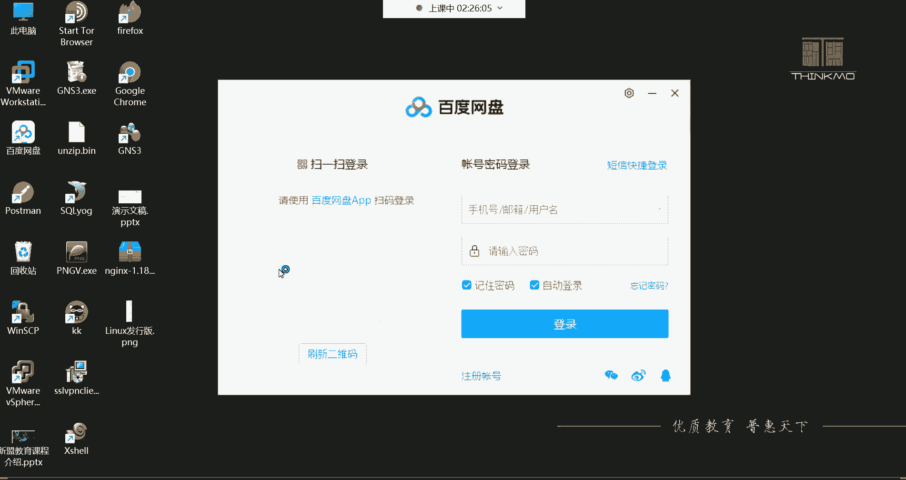

啊，讲的课每天都会上传哈。😊，讲完就上传。包括我们讲课用到的课件。笔记。

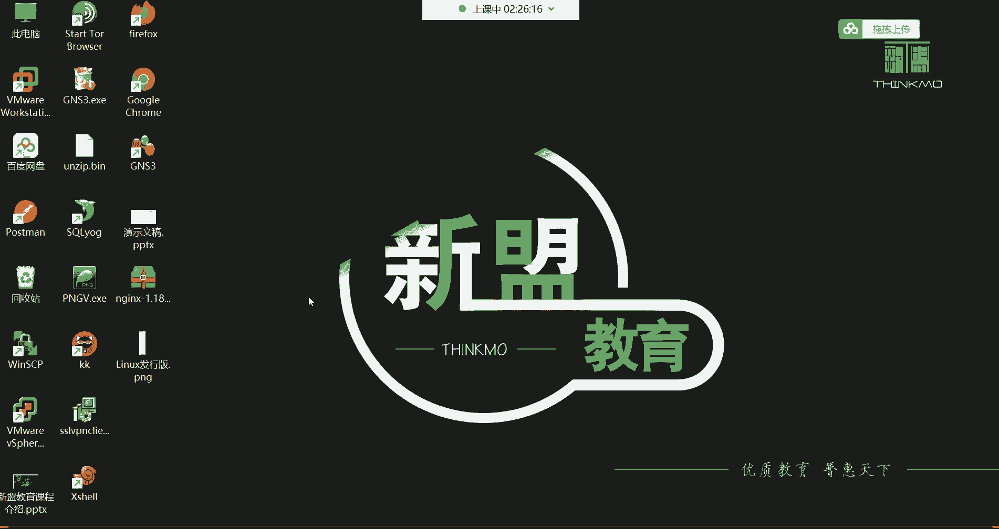

啊，以及相关的所有东西啊，只要课上用到的啊，都会上传。大礼包里边。这里边有一个什么呢？这里边有一个。华为的啊HCA的一个什么呢？一个网络课程哈，这网络课程里边就有什么呢？啊，就有这个。IP地址啊。

网络相关的内容去做的一个详细讲解，我给你们找找哈。😊，这里边。啊，看到了吗？这第几节呢，你看第五节课网络层IP地址分类。看到吗？哎。这就是。给你讲IP地址了哈哎，这里边讲IP地址，子网掩码看到了吗？哎。

等等等等的。😊，然后你们看到哪儿呢？呃。啊，还有什么NAT看到了吗？哎，如果你们有时间的话呢，你们就全都看看吧。OK吧啊，有时间全都看看，没有时间呢可以先看前前边。😊，看到哪儿呢？看到这个。

网络模型啊一直看到这个这个啊这儿哈。一直一啊一直看到这儿吧哈，一直看到第十节课。😊，只需要看，不需要跟着练。OK吧，网络呢你只需要了解就行。啊，你别到时候咱们学运维，你连个IP地址啊吧。

你都不知道怎么配，是不是啊连个网网络模型OI这个OSI模型你都不知道，连个TCP协议你都不知道。😊，那你这不行，能列吧啊，所以可以看到第十节啊，看到第十节课哈，这我都跟你们说说清楚了是吧？啊。

到时候我会把这个网络的课程。😊。

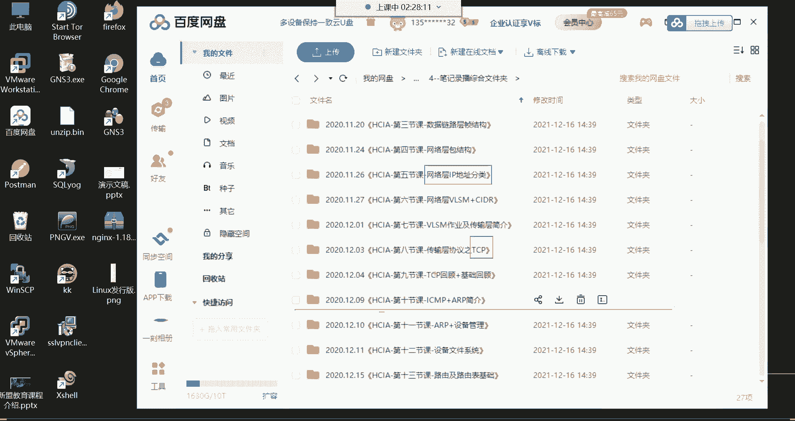

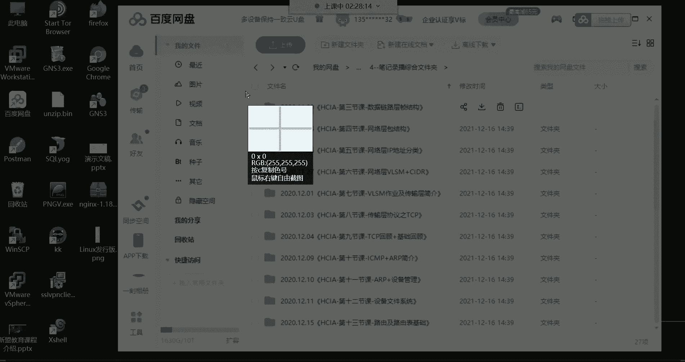

放到我们这个公告里面，华为网络。陆平客。啊，永久有效。创建链接。复制。关毕。啊，放到了。群公告里面37的群公告。IE还要报班吗？呃，你要学IE啊。你如果要学IE的话，那你就得再重新报IE的。啊。

这是华为啊网络初级。录平课。放到这哈。到时候呢啊自己去看前十节哈，发布新公告。ok。补补一补网络的基础就可以了。OK吧。好。😊。

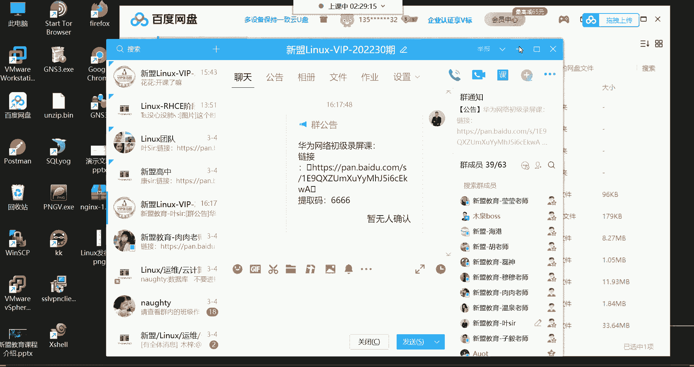

行了，那放进去了吧。😊，嗯。

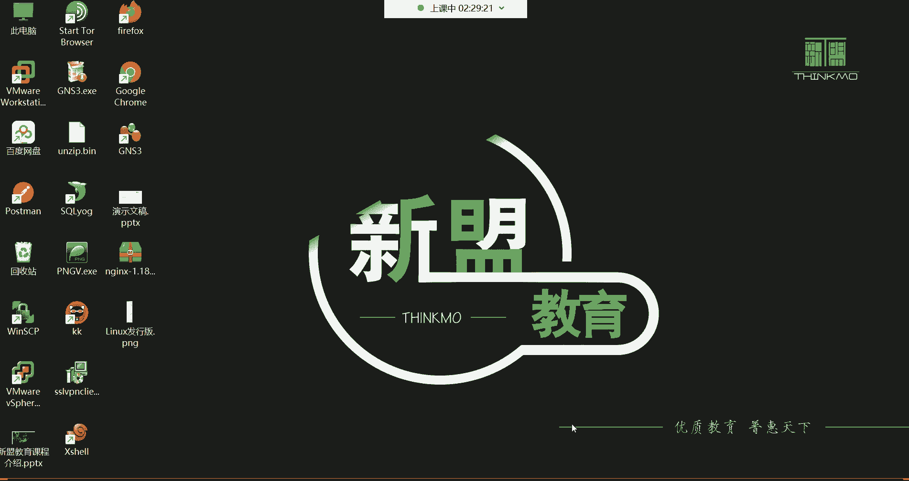

那接下来呢我们再回过头来再说啊，IP地址网关什么的都配好了是吧？啊，下边DNS呢咱也配一个配这个多少呢？233啊点5。5。5。😊，啊，这个谷歌的是2呃，不是这个阿里的是233还是223来着，我忘了哈。

😊，你们知道这个阿里的这个DS到底是223还是233来着？嗯，233是吧？对，那就233。5。5。5哈。行，然后接着它保存就可以了。😊，保存。然后选择开启看到吗？那这时候就可以看到什么呢？

我们IP地址192。168。0。90是吧？子网掩码路由啊，然后DNS然后完成。😊，完成。啊，差不多吧，什么114之类的，然后选择开始安装。这时候开始安装哈，那这时候他就开始帮我们安装系统了。

然后这时候呢，我们呃这还有一个叫root密码未设置。😊，这个时候我们要把这个密码给它设置一下。这个密码主要是干嘛呢？就后期我们在登录系统的时候。我们登录系统啊是得有一个账号去登录的。

然后这个系统呢给我们提供了一个账号叫root啊，这是系统里的超级管理员。那对于它呢，我们后期会详细介绍啊，今天呢暂时也啊现在也暂时先不过多去说它哈，你就先给它设置个密码就行。密码呢不要搞得太复杂啊。

但是也不要搞得太简单啊，完反正这种东西就是你自己用的是不是啊，啊，你自己记得住就可以了啊，一是吧，那咱们就来个一对啊，一。😊，哎，一好，然后完成两下哈两下完成就可以了。然后要不要创建个用户呢。

也可以点一下创建个用户。比如说我就让它叫test。😊，太色用户。哈哈。😊，然后呢，给他设置个密码，密码也是一啊，一完成完成。好。Yeah。呃，得创建一个普通用户哈，这是呃系统呢他得要求的。啊。

223是吧？啊，不是233吧。哈哈没事吧没事啊，那现在都已经安装了，改不了了哈。😊，改改不了了，到时候我们只能。跑到系统里边啊，打开它的那个配置文件啊去改。哎呀，这就有些麻烦了。

那你们在配的时候注意哈啊，你们那个DNS。😊，啊，我对位长。第呃。你的DS要改成223哈。千万就别跟着我一样，配成233了啊，223。行，然后这时候他总共会安装多少个包，你看总共会安装314个包。啊。

能不创建用户，不创建不行，他得需要一个普通用户啊，所以你还得创建一个。

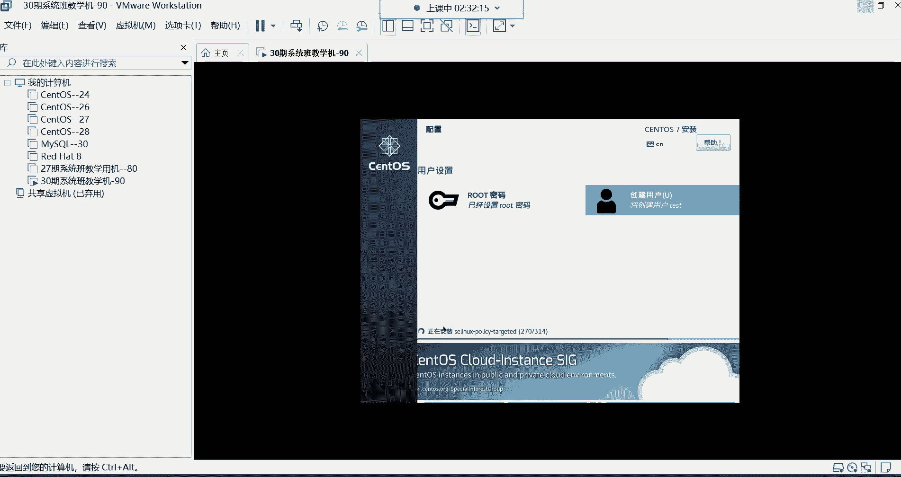

啊，总共安装200啊300多个包，现在已经安装270个了。然后这时候先让它安装上吧，先让它装着哈啊装着的话呢，我看现在我们想多久了。😊，啊，一个小时了是吧？那咱歇一下吧，是不是歇一下哈，嗯，歇一下。

歇一下的话呢，我们一会儿回来再给来再来给大家讲讲啊前面这些东西啊，就是呃对于这个linux啊，它这个应用的领域是吧？我们还并没有说呢，是不是？😊。

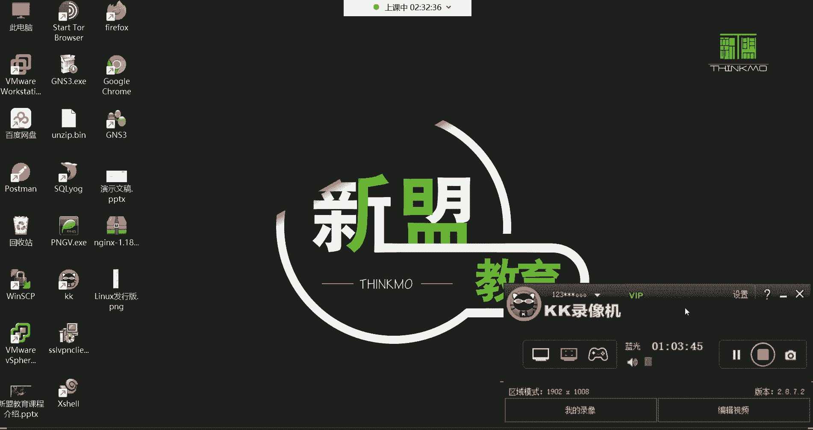

一会儿再说，好吧。

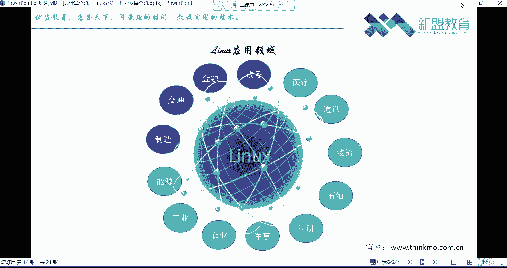

休息一会儿。