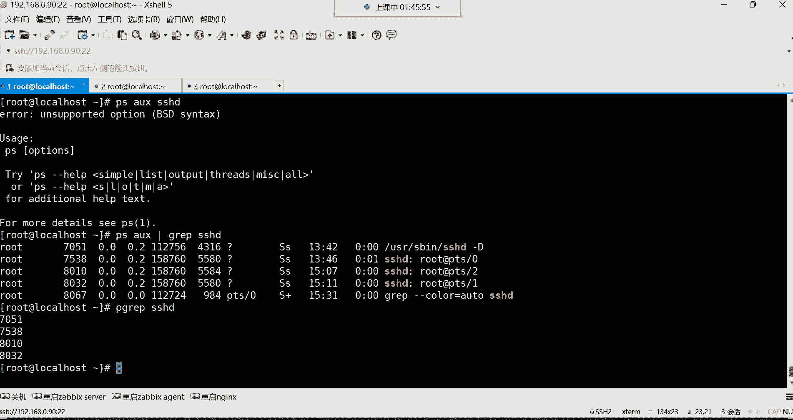

# 零基础入门Linux，红帽认证全套教程！Linux运维工程师的升职加薪宝典！RHCSA+RHCE+中级运维+云计算课程大合集！ - P30：红帽RHCSA-30.进程前后台调度、杀死进程、用户登录分析 - 广厦千万- - BV1ns4y1r7A2

喂喂喂，好，现在还有吗？现在还有这种电流的声音吗？嗯。好没好点，感觉好了是吧？😊，好，那我们继续哈。我来说一说啊这个位置。现在只有一个进程在运行是吧，谁呀谁在运行啊，就top。

因为我们说是不是可以看通过这位置看它的一个当前的状态呀，R不就是running在运行吗？所以只有top命令这个进程在运行着，其他呢都属于休眠状态。然后。那我们再来说有多少进程是属于一个休眠的呢？

174个，然后下边多少个进程在停止0个。哎，这个位置看到吗？这就是僵尸进城。这个哈这就是僵尸进程，然后现在有几个呢，一个都没有，就现在没有这种僵尸进程。😊，其实你也可以通过这个什么呢？

通过这个top命令直接就看那个位置就可以了。你说这样看是不是感觉比我们那个通过PS那个命令直接去那种一个一个翻要痛快的多呀，没错吧，所以。你到时候想判断你系统里面到底有没有僵尸进程。

是不是可以直接从这看了呀，看数字就行了。因为他也是直接帮我们去从这位置去看的。如果有的话，他就直接把数给你显示过来了。一旦找到僵尸，一旦发现哎，这里面有僵尸进程了，怎么办呢？把这个命令拿过去，过滤一下。

过滤一遍，过滤完之后怎么办？直接Q掉他的附进程号，附进程他ID就可以了。就是怎么去查找这个僵尸进程，怎么杀中僵尸进程。好，这是。对于这个进程。的，每一行的一个每一列的讲解，主要是每一列的讲解哈。

那现在是不是也知道这每一列代表什么意思了呀？当前系统的总进程的数量。正在运行的进程的数量，然后正在休眠的进程的数量。正在停止的进程数量。僵尸进程数量。好，然后这个是CPU的。呃，对于这个CPU来讲呢。

我们其实啊就没有那么太多需要关注的了。

在第三行里边呢，这个。拿过来给大家说一下。对对于这个CPU的信息啊。哈哈。这个第一列。第一列它代表是用户进程占用的CPU百分比，就是我们用户自己。在系统里边起的那些进程占的CPU它的一个百分比。然后。

第二列。SY这其实就是系统了，叫系统进程占用的CPU的一个百分比。系统自己起的进程这样的CPU因为其实大多数也都是系统自己的进程啊，我们也没我们几乎也没有怎么起进程，就起个top。😡，好，然后第三列。

第三列，改变过优先级的用户进程占用的CPU百分比。因为这个进程啊确实可以改变优先级。我跟你讲哈，这就是进程的优先级。怎么为啊这个他这个优先级就是进程，哪个进程先启动，哪个进程后启动啊。

可以改变它的优先级。但这个呢怎么改呢？咱们先咱们这个今天也先甭管它，你就知道一般我们不用改哈，一般不用改系统的进程，你需要去改吗，你不需要去改。😊，啊，一般改进程也都是开发，人家开发在开发程序的时候。

这个程序它应该这个基于哪一个进程之后启动，或者说在哪个进程之前启动，或开发的事儿，一般运维啊这活干不了，能理解吧？因为毕竟这程序不是你开发的，所以这这这活你一般是改变不了的。但你就知道如果有的话，那。

在这位置呢。他还给你显示，总之就这个改变过优先级的这个进程占用CPU的一个数量。是量一个，当然他也是百分比哈。😊，那在这行里面我们最关注的就是这个比较关注这个第几列呢？1234第四列这第四列。

第五列了吧啊是第五列123啊第五列哈，当然这也是哈。第五列第五列的话呢，这代表。哎，是。好，我看一下啊，是这哈。这小字儿啊哎看这好第五列。就这个哈。后面有个ID这个关键字的叫空闲的CPU百分比。

这是需要重点关注一下的。嗯，为什么要重点关注这个呢？因为它叫空闲的呀。如果这个值，你比如说现现在空闲多少呢？比如现在空闲10%。如果这个值。如果这个值啊是十的话。那。代表什么呢？代表这CPU太忙了。

因为他这位置如果说空闲的越多的话，就证明你的CPU他没忙，能理解吧。你看我们这是不是都已经是达到什么了，就99。7了，就证明我这CPU非常的闲。😡，非常的闲哈，啊99。8了。😊。

几乎CPU没有任何的工作量可验了。所以在生产环境的这个位置肯定值会相对低一些。因为CPU一直在处理数据嘛，所以这得这值就比较低一些。那但是你重点关注就是它别太低，太低的话就证证明CPU太忙了。好。

这是我们需要关注的那后边这些呢就没有什么太多可关注的了。像什么等待输入输出的硬中断软中断虚拟时间。这个没有什么太太多可说的哈这种东西。啊，下边内存的swa分区的这种东西呢。

都是这个低于多少就能换服务器了。不是它不是低于多少，是它这个低的话，你得看你服务器到底是因为什么原因，CPU才这么忙。😡，你想想，如果你服务器如果真的是这个你们服务器接收的用户访量非常大的话。

那可能说你就得增加服务器了，不能换服务器，可能是确实访量当前已经现有的服务器无法满足了。好，然后我们再来说下面那个。😊，MEM是内存跟spa交换分区这两个数据。但看内存的一般从这看不好看。

因为你从这看的话，你看。哎呦，他以KB给你显示，这就非常非常的让人头疼。你得自己去换算一下这KB我们自己换算非常头疼啊。😊，那我们还不如直业干嘛，是我自己。福瑞杠H自己敲个命令，自己看还不好吗，是吧？

他直接就以这种照记的方式给我们显示出来。福瑞哈福瑞DF是看看磁盘的。所以这样看哈，你看总内存已使用的内存还剩余内存，这样看多好啊，是吧？所以看内存就没有必要从这看了哈。所以在这里面大家有两行。

也是说最下面这两行呢，你不需要去关注它，不需要关注哈。而我们所需要关注的是几行呢啊，前三行前三行里边，第一行可以说是没有那些不重要的数据。第一行没有不重要的数据哈，第二行也没有不重要的数据。

第三行重点关注的是这个带有ID关键字的这一列。如果这个值太低，就证明你的服务器太忙了，CPU太忙了，你得看看到底是由于什么原因，是不是哪个进程太消耗你的CPU了。啊，所以这是不是说清楚了，top命令啊。

每一列它分别代表什么意思啊？好。做一个小做一个小的总结哈。😊，当前系统的。本地时间。当前系统已经运行的时间，多少个终端在登录CPU155的平均负载量。然后当前系统的总共的进程的数量正在运行的进程数量。

正在休眠的进程数量，正在停止的进程数量，僵尸进程数量，然后以及我的CPU的。空闲时间百分比啊，空闲的百分比。好了，那下边这个就没有什么太多可介绍了，这个是那个PS那条命令。PS。

AUX显示出来的就是下面这些信息，这就不介绍了哈，这top命令是不是我们后期就可以通过top去分析系统的一些状态了呀。

然后Q就是退出，Q就退出了哈。然后对于top命令呢，这里边。😊，我给大家说说。这个首先呢。它杠D是指定刷新秒数的，默认是3秒刷新一次，这个没有必要去指，就是我们在使用top框命令的时候。

你发现他为什么一直在动呢？是因为上面那个时间，你发现现在是10。十你看现在变成13了，一会儿呢16。哎，3秒刷新一次哈3秒刷新一次啊，这知道一下。

那没有必要去改变它哈，就默认就3秒就可以啊，这是top命令。嗯，其他的话呢在这里边还可以给大家说说啊，这个当然杠H叫做获取交互的帮助。那一般呢也很少用。

在这里边拿过来，你输入个H呢，可以获取我当前可以使用哪些命令。在这个里边啊，常用的有一个大有一个大M。

嗯。大M跟这个大P，我看看能不能在这边找得到哈。

嗯，大嗯。P。往先翻一翻哈。嗯。非常多哈，你看这个选项看到了吗？大M。嗯。算了，我就不找了哈，因为确实是。嗯。就不找了就不找了哈，然后跟你们说一下哈。😊，大M。

可以帮我们按内存去排序。这两个选项拿过来给大家说一下，就后期啊你可能会发现你这个服务器，比如说它比较忙，但忙的话，你也不知道是哪个进程。

再占用我的这个CPU或者占用我的内存，你这就可以直接用动态的方式去看一看。所以他这里面呢。我们就可以这样去排序。大写的P按CPU的一个使用资源去排序。我输入大写的P的时候。

就是它会把占用CPU最高的那个进程给你排在第一位。哪个进程占用CPU最高，它就给你排在前边了。这样你就可以知道，如果你发现哎我CPU这么忙。但是到底是哪个进程消耗我的CPU的资源呢。

你就可以去排序看一看。那如果你发现这进程，它并没有一些实际的作用。但是呢还占用我CPU资源，那可能就有问题了，你就得干嘛给它干掉。能理吧。啊，这是按照CPU去排序。

你看它永远都是把CPU消耗最多的排在前面了。那。如果说我想看哪个进程占用内存最多呢？大M。按照内存去排序输入大M啊，这时候他就会把那这内存最高的这个进程给你排在第一位了，这就不是按照CPU去排了哈。

看了吗？啊，这按照内存去排，所以就这两个是最常用的这两个。所以大家记的话就记这个，所以你就可以通过这种方式去分析你当前服务器的一个健康状态。那你说我们当前这服务器的健康吗？我们当前服务器太健康了。

他可以说没有任何的负载可言的，是吧？好，Q就退出了，这是top命令。应该都讲清楚了吧，每一行每一列是不是都给大家解释清楚了呀？

那接下来有一个叫检索进程。呃，检索进程呢叫pgra。Pgra是通过匹配进程的名字，我们去检索啊，这个检索的话呢。

这个检索，我们前面这个PSAUS也可以。好。你没看见输入M，你看不到输入不显示，我输入大P，你也看不到，你看不到哈，但是他就是给你排序的。😡，PSAUX比如我想干嘛呢？我想直接。过滤某个进程。

比如SSHD的。要不行哈，得结合管道加grab。😊，哎，这样就可以了。这时候呢他就帮我们列出来，我当前系统里面有多少个SSHD的一个进程，然后每个进程的一个ID号看到了吗？

然后Pgra也可以Pgra跟上SSHD。😊，也可以看到吗？但是pick app呢，他来帮我们过滤的时候，你发现他信息好像没有PSAUS过滤的详细。没错吧。啊，所以说你想简洁的过滤，你可以用p grab。

P股rap盘，然后后边呢再可以结合一些选项，哪个选项呢？比如说这些选项常用的选项在这儿。

第一个选项杠L输出进程名与PID如果我们直接这样过滤的话呢，你发现它只有ID号没有进程名。所以这时候你可以这样再加一个杠L选项杠L。哎，这时候它就。帮我们列出来，就是这个进程的对应的ID号是多少。

因为这ID号同一个进程名，它ID是不一样的。爱你 beyond哈。名字都是同一个进程，但是呢这一个进程又。很多ID号。啊，杠大U叫检索指定用户的进程啊，这样呢也可以哈，我们可以这样，就杠大U跟上。

比如跟上ts的这个用户。有ts用户吗？t用户没有登录系统是吧，ts呢？我们用泰测登录一下。我直接塑杠吧，切换到泰斯用户吧。那t词用户我一旦切换了之后，我再过滤。过滤出来了，看到吗？

但是这时候我还得加一个L选项。😊，但是加L显，你发这怎么。😡，不认识了吗？😡，说什么呀？叫无效的用户名吗？不是哈L我有个位置要求。这样就好了，看到了吗？😊，所以它这里边啊就是什么呢？就是那个。😊。

确实是会出现这种情况，这种情况就是。选项位置哈要有一个严格的要求。选项位置哈。能列了吧。OK呃，然后这样就过滤出来这个ts的用户，他在系统里面起了哪些进程了？其实。对于我们来讲啊，我们。

这条命令呢是可选的哈，你不一定非得记得住。你并不一定非要记这条命令哈。因为毕竟这条命令呢用的还并不是并不是很多，显示信息呢也并不是很。😊，很详细。啊并不是很详细。所以一般呢看情况吧。

毕竟看进程信息有很多种方法，就是看你想看详细的，还是想看一些简洁的，想看简洁的就pick wrap就可以了。然后还有一个杠T选项，对杠T选项叫检索指定终端的进程。这时候。

我们当然啊我们说这个每个用户登系统，是不是都有一个终端呢啊，那这时候你直接来个T。😡，这个终端呢你得知道这个终端怎么看哈，因为这个终端像这种情况下，你看。😊，这终端号PTS代表是远程终端。

一呢就代表是第二个终端。因为它是是这样排的，012看到吗？012。零代表第一个一代表第二个二代表第三个。所以你比如说我现在我想看这个终端起了哪些进程。拿过来回车。起两天起了一个拜事。啊，我想看这个。

第一个终端，那换成0。啊，也起了一个外置。那我想看看第几个呢。第二个终端一是2啊，起了。起了3个。这是bach又诉了一下，然后又来一batch，这应该能看明白了吧。现在第一个bach是谁呢？

是root的root登录系统分配了一个batch，然后root又诉谁呢？又诉了这个泰资用户。然后pa子用户呢又有一个拜事，所以这你看到的就就是这样子，看某个终端的进程。如果这种方式你看的话，你用PS退。

PS。脆看的话。杠P你这样看非常清晰。看到了吗？这样看你就可以看它的进程数了。因为这同1个SSH进程，是不是他。给现在起了三个紫禁城啊，第三个紫禁城就是。给我们提供了三个终端。三个终端哈。

然后现在这每个终端下边都起了哪些进程？第一个终端看到吗？第一个终端。😊，给分配了1个SSH，然后呢。用户呢在这个终端敲1个PS tree命。然后第二个终端呢啥也没干，就只占用个拜ch这个进程了。第三。

只要下面这个呢，你发现。在拜事这个进程里边又执行了一个速命令，然后又切换到了另外一个拜事环境。他就这样看的就这样看的。呵呵。😊，所以这样你可以通过片子翠来看的会它这个结构看的会更加清晰一些。

这就是屁股 life，还有一个。杠大X，所以这条命令啊不是你必须要掌握的哈，不是你必须要掌握的。杠杠大X是叫精确匹配。因为这条命令不是精确匹配哈，我给你们来演示一下P grape。😊。

比如说我直接SS回车可不可以呢？再加一个杠L哈。😊，可以好了吗？精确吗？不精确。因为它是模糊匹配。模糊匹配就是只要包含I包含SSH这两个字母的进程就都给我过滤出来了。但是我想精确匹配。

就是这个名字就得叫SS的。什么前面也不能有多余的字符，后面也不能有多余的字符X就可以了，有吗？没有。好，这要精确匹配。也必必须得叫这个名字的，那就没有。但如果你说我想精确比喻叫SSHD的呢。

这就有看到了吗？😡。

这就是这条命令哈，所以这条命令呢不一定非得记得住。😊，只需要知道一下就行。信息呢不是很详细哈不是很详细。然后下面还有一个叫进程的前后台调度。

这个进城的前后台调度啊嗯主要是让大家了解一下这个进程分为前排跟后台。这个我们先说一下这个。我们怎么把一个进程放入后台吧，用and符将进程放入后台。有一条命令啊，前面学了，但是它一直没怎么用。

叫sleep。sleep命令呢它是一个休眠的命令，就是我一执行，比如说5回车，它会让我当前终端休眠5秒钟。看到了吗？你们数一下啊，那我再撕啊我再蒸一遍哈，撕了一。5。

那我当前中端是不是休眠5就在休眠5秒钟啊。那像这种呢就是叫前台进程，这个就是他命令一执行，它会占我的前台终端，我的前台终端。就被他给占用了，我就不能用了。所以有的时候呢这个进程我希望它运行。

但是我不希望它占我的前台终端，我拿sle来给大家演示，大家感受一下。啊，感受一下呃，这时候呢我就可以通过这个and符，你看我这样sleep，然后这样5。后边呢跟上一个按符就行了。回车。

这样你发现它并没有占我的前台终端吧。我的终端是不是没有被他占用啊，我可以正常敲命令。😡，那进程有没有运行呢？有他在后台运行的。但由于是5秒钟，估计已经是运行结束了。我们来长点哈，sleep，我这样。

我5M5分钟。让他在后台运行5分钟回车。那这时候他首先没有占我的前台终端。😡，能理解吧，没有占用前台终端哈。😊，那这时候我怎么看呢？叫。OBGS。杠L。啊，那就是反了。GOBS。好，这样好了吗？

这条明令呢可以帮我们查看我们用户自己放在后台运行的这些进程。注意是我们用户自己哈放在后台运行的。😊，那这时大家可以看到后台是不是有个sleep呀？😊，啊，他的ID号，这是在后台的一个编号啊。一。

然后这时候呢这是他的ID号，进程的ID号，然后状态是运行中运行多久呢？这是你在让它运行的时候指定的5分钟，它现在会在后台一直运行5分钟。那如果这个我不给它放在后台的话，那你我告诉你。

他就会一直在前台占用我的终端5分钟。

啊，这是给它放在后台运行。那放在后台的运行啊，放在后台运行的镜头，我们怎么看呢？这样看啊GB然后查看后台的进程列表，这样就列出来了。那。当然我们还可以给它做一个调度，怎么调度呢？

就是将后台进程给它调度到前台，让它继续在前台运行。

叫FG。FG这时候。跟上他的编号就可以了。你看他在后台的编号是一是吧，我就FGE回撤。😡，他现在又在前台运行了，但是他只要在前台运行，他是不是就占我前台终端了呀？😡，那我这终端就用不了了，看到了吗？

被他占用了哈。😡，啊，所以这就是前后台的调度。想结束怎么结束呢？contrl C。ctrol C可以结束在前台运行的这个进程。呃，敲命的时候休眠时间是不是暂停了？嗯，敲命令的时候，休眠时间是不？

不是他他这个进程就会让我当前的终端去休眠。好，这是。做一个前做做一个前后台的调度，是不是怎么把这个进程放在后台？怎么敲呢？是不是？Sleep。还有。变成一个时间，比如说4M4M。放到后台。

你说那这种东西我什么时候能用得到啊？😡，什么候什么时候能用得到呢？比如我现在我想拼啊，我现在想想测试一些主机。😡，像拼其他的机器的一个这个一个连通性。这拼命令它有个特点，你比如说拼百度3W。

点儿百度点儿com。你看他是不是一直在我的前台终端呢？😡，拼通了他也在用，拼不通，他也占用。能理解吧？那一般拼呢，我一般不在命令上拼，我一般会自己后期写一个脚本。我们通过脚本呢去测试。

比如我测试我当前的整个网段从多少呢？从一一直到254，整个网段的IP。你把这个拼命令写到脚本里面了，然后通过脚本呢去自动化去拼这所有的地址。但是你即便说放到脚本里面了，它有个问题，什么问题呢？

就是它拼每台机器的时候，它都会把拼的那个结果显示在我的屏幕上边。那我当前这个终端也用不了。所以。怎么办呢？我就可以让他在后台默默的去给我去测试这些主机的联通性。别占我的前台终端，你在后台默默的拼。

拼完以后的话呢，哎我自己去看结果就行了，能理解吧？😡，对对这种东西怎么给他放在后台运行？这个后边才能够给大家实际的演示。所以现在你先知道我们这个按符它主要应用场景是什么？那放到后台是不是安德福啊？那。

如果前面如果是通过脚本的话呢，你前面就写脚本的名字。如果是命令的话呢，我们一般就sleep。这吧。啊，3M就3分钟放到后台了，让GOBS杠L看一下。那这样时候呢他在后台运行，我想给他调度到前台。

那就FG后边跟着它的编号。FG跟编号编号一。好，他现在又在前台了。那现在在前台不行，我又希望它在后台运行conttrol z按cttrol时候再按Z。他首先呢先把这个进程给它停掉，停掉以后呢。

我这时候可以叫做B级。哎，BG后面跟着他的编号回车。他现在又在后台运行了，这种BG。就是再给他。

激活。被挂起的进程，就是我们conttrorl这组合的时候，是把它挂起了，就暂停的状态了。那挂起以后呢，我一会我我一会让它运行了。好，FG跟进程的在后台的挂起的编号就可以了。

这样就是怎么做一个进程的前后台的调度，主要就是按符用的最多，他用的最多哈。然后这个查看下边这些用的就并不是很多了。按的符这个大家一定要记住哈。😊，好。这是前后台的一个调度。然后。那接下来呢怎么杀进程呢？

杀进程。比如说有些进程我想给他结束掉，想给他自己呢不结束，我想手动给他结束掉。那这时候怎么办呢？

啊，来给大家演示一下呃，我们现在多运行几个进程，我们看看后台现在有一个是吧？那再来几个哈sep来1个4M的放到后台。😊，来1个5M的放到后台，来1个6M的。运行6分钟运行7分钟。好，多少个了？

好几个了是吧？看一下现在我这后台啊，你看叫sliep这个进程有7个5个哈，12345有5个。好，那有5个的话呢，我现在。我想给他杀掉，因为他在后台运行，我们没有办法正常结束了。现在你已经他在后台运行。

你现在正常在民行里面，你已经控制不了他了。😡。

控制不了了，我想给它结束掉怎么办呢？那下面杀死金城的命令呢？

呃。来哈常用的。

第一个呢叫Q。

Q。这个s死竞争方式，首先conttrorl加C这个组合键它也可以，但是它特点是什么呢？叫结束当前的命令程序。当前的就比如说我现在拼。我把拼调过来哈拼。骗。这个拼它是不是在我的当前终端在运行啊。

我想给它结束掉啊，ctrl C好，就就直接结束了。但是这个后台如果一旦跑到后，如果这进程一旦跑到后台运行的话，我还想给它结束cttrol C是无能为力的。所以一般我们就得这样用专门。

去可以杀死后台进程的这个命令。就比如说Q就可了。那Q的话呢，它是根据PAID去杀。这个建城是不是有自己的ID号啊？哎，他可以根据这个ID号去杀，你想杀哪个进程，你就指定他的ID就行了。

所以这个比较简单啊。Q因个人ID号，比如我要杀后台的这个叫8113的这个进程回车。嗯，没有这个进程，这进程可能已经结束了哈。😊，8115吧。Q8115回车。没有任何提示，马上看哈。

你发现说8115这个建程已终止了呀。可以看得到是不是已经已经被我们终止了呀。那这时你如果再看的话呢。😊，没了，你看8115这个ID号的进程没了，是不是？被我们杀死了，那我现在要杀了一个。😡。

像这个啊8117的。8117。回车，然后马上看。没了。817没了是吧，我。😊，然后再杀哈再杀。8116。然，马上看回撤，所以我得先终止啊。然后再把它给资源给他回收掉。这直接就给他杀了哈。

你这是再看就没了。因为他需要时间，他需要时间哈，不是说马上就是杀死的。因为什么呢？因为我们这种方法杀进城。😊，他有信号。它是这样子的哈，杀进程的时候常用的信号这里边有很多。跟你们慢一下，慢Q这条命令。

这条命令啊它有非常多的信号。好几十个信号啊，大家看一下哈。等一下哈等一下。嗯，开启一个功能哈。好，大家来看一下哈。他这个信号啊就是。看了吗？什么零啊，一呀，下边还有很多选项是吧？😊，等一下啊。想前面。

他这信号怎么看来着，我都忘了。他这信号。哎呀，他这信号啊。怎么看呢啊，是不是这样哈？Q杠杠ha。啊，无效。我就还有会。啊，无效。嗯。你风呢？哎呦算了吧哈哈算了吧，它有很多个信号哈呃。

上次我是怎么搜的来着，我给忘了。😊。

但是大家没有必要去记太多。这里边呢我给你们已经标注了几个常用的信号了。然后这里边其中。杠一这个信号叫重启进程。当然一般对于对于这个一些应用的话，应用的进程我一般会重启的哈。不是应用。

一般没有必要去用杠一重启它。所以这个呢我想重启一个服务，可以使用杠一，但一般比较少见一些。因为服务有自己的重启命令，杠9呢叫强制杀死金城。强杀。杠15叫正常杀，默认就是这个杠15是正常杀的。

所以我们刚刚这种杀进程的方式。

好。没有加什么信号的话，默认就是杠15。所以我在杀的时候，大家可以能够什么呢？通过一个短暂的时间可以看到他是先把这些精程给他先终止，然后呢再给它结束掉。但如果我们现在再给大家演示杠9的话，强杀。

什么时候会用到强杀呢？就是僵尸进程，无法正常结束的时候要强杀。那我们现在再在后台运行几个进程嗯。还有一个是吧，我们再运行几个哈。😊，sleep5M放到后台。6M放到后台8M放到后台。好。

这时候呢我们来看一下哈呃5678现在是那个有4个进程是吧？那这时候。😊，我再杀哈，我们加杠9我们家杠9哈，加杠9，我杀谁呢？杀8118的那个8118这个进程回车马上看。什么呀，直接杀死了，看到了吗？😡。

什么叫强杀呀？这打游戏。还不知道什么叫强啥吗？上去直接。就干死都不会说给你任何的一个喘息的机会的。😡，而这种普通的沙呢。普通商，你比如8137。啊，对越塔是吧？那这种8137，我如果这样杀。

你以后你马上看，你发现这是先终止。😡，先终止，然后你再看的话，这进程就没了。再看哈就没了。所以这种是属于什么呢？就是他会给你一个缓冲的时间。缓冲的时间。就不是说这个马上就直接给你上去，就这个你干死了。

不是。对于这种这个。我们说这种就属于叫优雅的杀死啊，优雅的结束掉。优雅的结束就是他会先通知这个进程啊，我要结束你了，你呢呃把你所有的工作呢处理完毕以后呢啊你就。自己结束就可以了。但有的进程你正常结束。

他结束不了，你只能上去强杀，这不多此一举嘛，是吧？😡。

啊，然后这是Q，但是它是什么呢？它是按照PID去杀，你要注意哈，它是按照一个进程的PID去查。而下边那个呢Q2Q2呢是按照进程名去杀，唯一的区别就是。😊。

QR呢杀了会什么呢？会更加的彻底一些，怎么彻底呢？

按照名字上，我们来看一下啊，现在后台有几个进程呢？有两个，我再起几个。呃，3M放到后台。4M放到后台，5M放到后台。看一下，现在比如说我想把所有叫sleve的进程都给它杀掉。如果你按照PID上。

那我这进程如果有几十个怎么办呢？如果有几十个进程。你一个一个去杀吗？不现实是吧，那就。Q2Q2跟上进程名就行了。哎，sleep只要叫sep的进程都给他杀掉。回撤哎，这时候就我们说是不是杀的更彻底一些。

只要叫这个名字的就全杀死。就是你在看的话呢。没了，后台的建程全都被我们给杀死了。呃，不杀死以后，内存里面没有数据，他你怎怎么杀，它内存里面的数据都不会保留哈。只不过就是。一般这种这个区别就在于哪里呢？

就是。对一些应用来讲。对一些应用来讲哈，就是有的进程，他可能说正在处理某些事情呢。而这个进程如果正在处理某些事情，你正常杀的话呢，一般他会把自己的这个工作正常给他结束掉，然后他再去自杀。能列吧。啊。

他把自己的手里的工作尽量处理完毕，然后呢自己再去自杀。😡，但如果强杀呢。😡，哪怕这个进城正在手里边有工作。没关系，直接就结束掉了。就这工作处理到什么程度，他不管这些就结束了，能列吧，这是唯一的区别。

一般对于网站应用来讲，一般。你想想，比如说我们拿一个网站。来说。一台网站服务器。如果说呢他接受用户请求的时候。在这哈，如果他在接受用户请求的时候。你就比如说。那进程是不是得响应用户的请求啊？

因为最终我们说这个你访问网站进程去接受你的请求。啊，这是网站的一个进程。那这个进程他在想要用户请求的时候，比如我现在就给这个进程发了一个信号。告诉你，我要把你结束掉。那这个进程呢。

他已经接受到用户的请求了，他会尽量。把这个用户的请求处理完毕，给用户返回他想看的东西。然后他呢自己再去结束掉。是这么回事。但如果是强杀呢。😡，你直接上就直接把进城资源回收了。😡，对用户来讲，哎。

直接中断了，能裂了吧，直接中断了。呵那这就是他的唯一个区别。😊，呃，如果对，有可能啊，如果是你比如说我在这个上传一些东西，没错，那进程他会尽量把你的文件给你上传完毕，给你能够正常断开。😡。

能够正常给你断开哈。😡，啊，尽量把把它工作处理完毕。但如果你是强杀就直接中断了，是这么回事。😡，嗯。对，有个容错。好，然后我们再来说这个Q2Q2的话呢就是。他是按照名字去杀，杀的更彻底是吧？那。

他也有信号。杠9这个信号也都是强杀的意思。比就说我们不加杠9都是属于叫做优雅的给它结束。如果加加杠9呢，就是我们叫暴力的给它结束掉，非常暴力了就。所以这时候呢我们再来演示一下这个暴力的结束。

sleep4M放到后台。然后5M放到后台。5分钟6分钟。就说我们来看。三个进程是吧？好，那我们现在就加个杠9Q2，然后杠9强杀叫sleep的这个进程回车直接杀死了。你看跟前面不一样，前面是不是先终止？

先终止。然后呢，下边呢就直接杀死，叫强杀。就直接你去死吧。就这意思。嗯，Q1-9my circlecle这种夹兴可可以不呢？可以啊。可以哈，就只要是。my circlecle开头的后边叫什么全都啥。

可以啊。😡，哈哈。😊，星号是支持任何的命令去给你匹配的。但是你这要干嘛呀？你要把数据库进程都都干掉。啊，这是Q2哈，然后还可以杀死某一个用户的进程。大家看一下这个Q2，这有个更优的个选项，后面跟用户名。

比如现在这个tax的这个用户在登录系统，没错吧。好，他在登录系统呢哈。好，那现在。😊，我想给他踢出去。😡，啊，注意听哈。ts的用户现在正在登录系统呢。比如正在改某些文件呢，什么叉叉O点TATT。

叉叉5点TAT。我说我们是不是可以看呢？我们可以通过这样PS。翠。然后呢，去过滤它啊，杠P过滤这个太渍用户。好，刚号。我们可以过滤这个太词用户在系统里面正在做哪些事情是吧？你加个A的话呢，你加个A啊。

连他用用连他打开哪个文件，你都能看得到了。啊，他在编辑这个文件。好，那你突然间觉得这个人他妈的思想不纯洁呀，怎么会往这个文件里面写东西呢？是吧？那这时候你就觉得这人可能是啊。😡，有点问题了啊。

这人严重有问题哈，那怎么办呢？我想给他推出去。😊，啊，踢出去哈，那这时候我就这样。Q2杠9必须得强踢了，现在哈你不能给它缓冲时间了。Q2杠9，然后呢，杠U用户叫什么呢？叫test的。😡，没错。杀死了。

杀死了，你看他现在。哎哎哎，你看出现问题了哈，看到了？😊，他现在直接怎怎么了？他他现在你发现这有问题了哈。😊，他有问题了，现在。他被你踢出终端了，所以你看他这界面就。就感觉有些有些不太对劲了。看了吗？

无法正常使用吧。把这上什用了。终端都废了，这这终端都废了，看到吗？出现异常了这种。他当前的终端，就这个用户正在使动终端都废了，就以他就只能是结束掉。只能结束掉哈。然后我们看我们系统有没有受到影响AUX。

😊，呃，直接过滤那个。ISSHD。咱们看看哈。啊，没有，你看咱们系统没有啥影响，都是root在登录。没错吧，但是你看不到ts的信息了。pas的用户是不是直接被你踢出去了呀？😡，😀呵呵。😊。

直接贴出去了哈。😊，所以我们说这个是不是这个杀进程，其实咱们杀进程，你比如我想把一个用户踢出系统，你只要是把用户在登录系统时，那个进程给他结束掉不就可以了吗？结束谁呀？

你想他登录系统必须要起的进程是谁呀？是不是拜师啊？但别的进程，你想想他不起没关系，但是首次登录系统，它的终端就这终端都是拜事给他提供的。😡，这是他必须要起的进程吧。啊，你把它拜出进程一结束。好。

这用户直接出去了。所以后期你比如说你在企业里边，你说这个你发现有一些用户在非法登录系统，那你作为一个超级管理员，你怎么样你人家非法登录，你怎么样才能给他踢出去呢？😡。

是不是就可以通过这种手段呢把他所有的进程都给它结束掉，然后给他踢出去。最后呢再把这个账号的密码，乃至这个账号给它删掉。好，这是沙金城。因为这个系统里面任何的应用它想要运行都得需要。

齐进城。然，下面还有一叫PQPQ呢这个主要是可以按照终端去杀。

按照终端杀就有点意思了。比如我们现在拿这个ts用户来说，它再登录一下。用户名太词。又上来了，那他现在在哪个终端呢？我们怎么看终端呢？在这儿啊，有一条命令叫hoWHOho回车。😊。

后面的呢可以看当就是你当前系统所有的用户是用的哪个终端在登录系统，然后在什么时间登录上来的，看到了吧？然后通过哪个IP连上来的。这时候你比如我想把test这个用户推出去。那太用户可能说他好几个终端。

我再付制一个终端，两个终端哈。😊，我们再呼，你发现这tax用户是不是有两个终端呢？你看test，一个是PTS1，一个是PT3两个终端。我现在我想把ts用户的这个在第三个终端给它贴出去。

那这时候呢我就可以这样叫PQPQ。-9墙梯。这样中呢杠T指定终端哪个终端呢？PTS3这个终端拿过来回撤。终端直接掉了，看到吗？是不是直接退了呀？所以这种就是什么呢？可以按照终端去提。

按照终端题哈。但这就是可选的了，一般看情况了。哼看情况哈，一般你如果想踢他，我管你哪个终端呢，是吧就全都给你踢出去。😊，亮ang。啊，这是怎么去杀进程？然后下面还有一个叫用户的登录分析。然后对杀进程呢。

大家记哪个呀？小的总结哈，我想。😊，精确的去杀某一个进程。用Q加上进程的ID号。我想结束所有。叫同一个名字的进程，那就Q2跟建程名，只要是叫这个名字的进程全都啥。我想踢出某个用户啊。

把它从我的系统里面给他贴出去，那就可以通过这种方式去踢了。好，然后接下来用户登录分析。那用户登录分析呢，这里边有几条命令，然后来给大家说一说。

对于用户登录分析呢是这样子的，就是我想知道我当前系统有哪些用户在登录，其中有一条命令就是ho命令。ho命令呢，当然除了户以外呢，其实有三条命令，第一个叫us，第二个叫ho，第三叫W。这三条命令啊。

首先呢。呃，功能都一样，但是呢详细度不一样。都是可以看已登录的用户信息的。注意啊，它叫已登录。所以这时候我们先来看us色4。回车。他就比较简洁。就是只告诉你当前你的系统有哪些用户在登录。

把用户名给你列出来了，不详细。我想看看用户什么时间登录的，在哪个终端，那ho命令回车看了吗？哎，root这个用户通过哪个终端，就是现在在占用我的哪个终端，然后什么时间登录的，看到吗？

2022年4月16号不就今天吗？1点46。登录的，然后通过哪个IP连过的了，连过来的这IP是我们那个虚拟网卡的那个VMnet8呀。是不是啊VM那他把那块网卡登录过来的。

因为毕竟我们的真机跟讯集通信全依赖于这块网卡嘛，所以通过这块网卡连到我们的虚拟机上面的啊，所有的用户都一样。然后下面就是每个用户的终端了。PTS是不是远程终端呢？TTY就是本地终端TTY就是本机的终端。

这是户命令，那还有一个WW命令呢，你别看你别到最短小，这短小啊，它往往就是我说最精干。你看这W命令它显示的信息都是都是什么呢？😡，这就是top命令的第一行。top meeting令的第一行是什么呀？😡。

呵呵。😊，真的呀，你看这就短小精干呢，你看到了吗？就一个W，但你看人显的显示的信息。😡，当前系统的本地时间，当前系统已经运行多久了，有多少个用户啊，当时是多少个终端在登录CPU啊load。

R rangeCPU的155的平均负载量。还有下边就是用户名，终端哪个IP地址起始时间。当前已经持续多久了啊，这个哈。啊，这个就还有这个包括CPU的信息啊，然后这个。就CPU处理这个。

进城的时间看到了吗？都有。Yeah。😊，你发现这个确实是这个W命证最最详细哈嗯。啊，我看你那个。W。啊哼。😊，你的你的W命令不好用啊。😡，啊。啊，你们看了吗？他的W命令不好用哈。😊。

看到了吗？他这个有点问题哈。什么问题呢？windows意思。这怎么。出来什么windows了呀，你这个。😡。

别的同学别的同学敲W命令是不是跟我的是一样的呀？他这个有些不太对劲哈，确实。嗯哼。我们翻一下哈。一一样是吧。对，就他那不对。对，你看就他那不对是吧？😊，什么你看什么窗口太窄，什么什么窗口太窄。

什么提示啊？😡，啊。啊，窗口啊窗口插销的问题是吗？啊，他。

啊，叉 sale啊，它叉 sale的问题哈。然后这里面具体什么意思，我这边写了哈。😊，登录时间，用户空闲时间。就是这个用户在这个终端已经多多久没有做一些操作了。然后该终端所有的进程占用CPU的处理时间。

看了吗？这里边这个用户什么时间登录的？用户当前他已经空闲了多久了。然后这个用户的这个进程。占用CPU的处理时间是是多久？

那个PCPU呢。PCPU我看一下啊，就当前正在执行的任务啊，不是啊，这进程执行以后消耗的CPU时间，这个就没有太太细节了，没有必要去研究了哈，这个没有必要了哈。😊。

总之，WM呢它主要是可以帮我们显示这个这个上面这个这个信息。能理解吧，所以他是最详细的。那除了这个可以看登录成功的用户以外呢。还可以看什么呢？哎，还可以看。就是。辣啊像辣s跟拉丝B来看一下啊。😊。

当前这条命令我们说一下这三条命令是不是叫已登录的用户啊，查看已登录的那曾经登录过的呢，我能不能看一看呀？就曾经登录成功过的，所以它可以帮显示显示历史登录成功过的用户的，这里面应该加个历史两个字。

历史知道什么意思吗？看一下啊，last。退车。就是你这个系统至今为止。哪些用户登录成功过，这叫历史。这叫历史啊，看了吗？就是我们当前系统是。从什么时候开始算呢？12月14号吧啊，是从1呃哎，不是啊。

这是时间哈，这得翻译一下哈，这是英文的一个日日期。英文的日系哈。其实。其实。什么玩意儿？就是呃，他是。这是3月，我们可以看到这是3月3月、4月看到吗？3月、4月，这3月份不就是我们那个机器的创建时间吗？

然后几点呢？这是一个。就是他有具体的日志的，你要从这看呢，还不如从哪看呢？从这个wa的log下面有个日志。他那个日志就是lasts的日志。嗯，我搜一下啊。小吧log有一个叫。

啊叫last log看到了吗？这个文件就是记录了那个刚刚那条命令里的信息哈。😊，诶。这个文件。啊，这个文件还不能用这种命令打开，这有些尴尬了。这个些尴尬了哈。😊，Last log。嗯。Hey。

他不让这么打开这。不好玩了哈不好玩了，那就这样看吧，last的吧。反正他这个日期是英文的。3月4月，但是这年份好像没有显示，是不是？年份没有显示。你看它这里面年份显示的不是很准确。

但是这个确实是月份月份哈跟这个日期显示的还是蛮对的。然后后面是具体的时间。嗯，但是他这个。年份不显示，这这太阳都出来了，你看到了吗？这太阳都出来了。有。这有些。看的不是很清晰了哈不是很清晰了。嗯。算了。

那。不是呃。周日是吗啊，他他他那里面代表的是周日吗？是吗？哦。😮，啊，是这个意思啊啊，明白了哈，但是他年份没有呃。😊，那这个是表示年份吗？啊，是年啊，这是年哈这是年了，看到了吧？年利率哈但这是4月。

不是这4月哈。😊，是这是这是3月，上面是4月，但是。但是他年份呢他没有年份呢。他没有年份。对呀，就没有年份嘛，就是这就有点儿。可能是可可能没有年份，就显示是今年的吧。那我们就可以这样去理解吧，好吧。

就是它没有年份，就是今年的。然后剩下的就是具体的一个呃，比如说这个几月啊后4月、3月，然后星期几星期几，然后剩下就是具体的这个几号。😊，然后具体的时间了，那就那就这样吧，就这样看吧哈，确实没有年份了。

😊，嗯。所以这里边就是可以看到。在什什么时候，然后有哪些用户登录成功过？当然啊嗯当然他这里边只是记录登录成功的用户。登录成功的哈。那除了这些用户以外呢，还有一个叫last B。我们来敲一下哈。

它是显示失败的。😊，Lasts的 be。你发现这怎么没有任何显示呢？这个last be它叫显示登录失败的用户是吧？好，我这样哈，我退出。😊，我退出哈。嗯，然后这时候呢我再登录一下。登录一下。

但是我在登录的时候，比如说我用太斯登录，我输入密码的时候，我估计输入错哈，12345。我是输入错了，第四。然后。我再来一遍123456。两次错误了吧。好，再来一遍，1234567再来一遍。好，三次错误。

OK那接下来。这边我再敲这个拉丝臂的时候。你看这边他他就给我记录了哈，记录什么呢？他记录了。😊，pas的这个用户。啊。会会报错哈会报错。泰测这个用户。然后呢。

他想SSH登录我们当前登录我们当前的一个系统。但是呢它有叫noTTY是吧？这noTTY是什么意思呢？就是没有终端，因为它没有登录成功嘛，所以就没有给他分配这个终端叫noTTY。😊。

然后从那个地址连过来的，然后这里面也是没有年份，没有年份，可能就是今年啊，具体这就是我们说这个今天啊，今天吧。😊，啊，4月份今天。16号。不是那不对，这应该是周六啊。这个哈这个I这应该是显示周六吧。

不应该是周日吧。啊，是是周六哈，周周周六的缩写，然后这个是这个4月。4月16号周六星期六，然后这个位置是几点？啊，他持续多久呢？没有持续。也就是说这个人他登录失败了啊，连续三次都已经登录失败了。

是不是都已经记录上了呀？啊，那如果你说我再搞一个不存在的用户呢，随便搞1个ABC。密码一。看到吗？再来个一确定都错了吧，因为好像都没有这个用户。所以我们这边再这样。就这样哈，好再看一下拉斯B。哎。

你看是不是他也记录啊，就是你搞一个不存在的用户，他也会帮你记的。因为只要是有人，他想通过SSH登录我们这个系统，只要是他输入用户名了。😡，都记住，因为他不是有一个日志文件嘛？不就在的 log下面吗？

last be啊last log只不过这个文件你用普通命令你还看不了，你用开它还看不了。😡，他可能就是害怕有人会销毁这些消息吧。但是我觉得如果想销毁，直接把这文件删了不就行了。不让看是吧。嗯。啊。啊。

是吗？我实话啊，你看他这个哈这是这是他的云服务器是吧？你看他这云服务器就是。😊。

好多人都没有登录成功，是不是？😀呵。😊，嗯。

靠了吗？这个好就。属于登录失败的哈。好。

行，这是last B这条命，然后。这就是用户的登录分析了。啊，其实常用的命令呢也就这几条也就这几条。到时候大家可以看一看哪些用户登录成功过，哪些用户登录失败过，登录失败过那都可以去看一看。行了。

歇会儿吧，歇会儿我们一会儿讲软件包管理，好吧。

