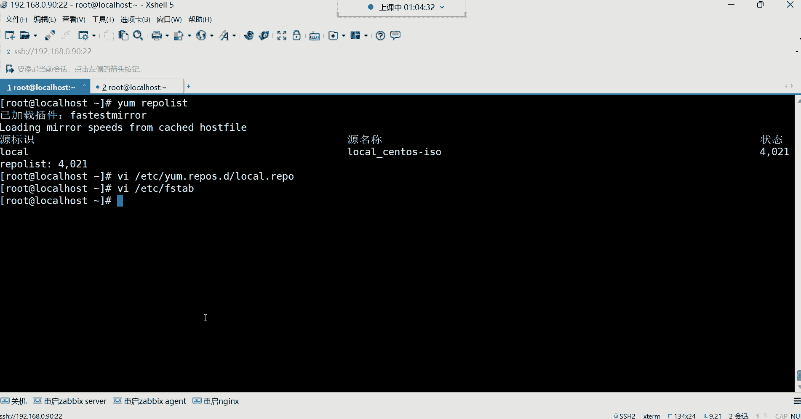

# 零基础入门Linux，红帽认证全套教程！Linux运维工程师的升职加薪宝典！RHCSA+RHCE+中级运维+云计算课程大合集！ - P33：红帽RHCSA-33.RPM软件包管理、YUM本地软件仓库搭建、YUM常用命令学习 - 广厦千万- - BV1ns4y1r7A2

哦，有啊，我们拍 this下边是不是有4000多个包啊，这是不是都是我们可以。😡。

这些包我们是不是都可以用啊啊，各位4000多个是不是啊都可以用。好，那现在软件包有了时后。我们现在应该干嘛了吗？现在是不是。该学习怎么去搭建本地仓库了呀？本地仓库的软件包4000多个。

就在本地的镜像文件里面呢。那我们现在要干的事情就是。😡，我怎么去搭建这个仓库？

那搭建仓库的话呢。来看哈下边。本地仓库的配置。本地仓库呢也叫本地的亚母园来注意听好。有一些关键词汇在这位置呢，我要给大家讲清楚本地的软件仓库也叫本地的亚母园。那这个语源是什么意思？这个源指的是来源。

那本地亚马园就是这个软件包的来源是在我的本机。所以说呢就是本地的软件仓库。软件包在我本地的仓库里面放着就叫本地亚摩员。那怎么配呢？第一哈路径。严格要求用在ETC亚么的reportD下边。因为。

我们在使用y姆命令啊，在安装软件包的时候，y姆那个命令会自动来到系统的这个路径。去找寻他的仓库文件。那这个仓库文件的名字要以这种点reple作为结尾，他才认识。如果你说你在这个路径下边，你创建的文件。

它结尾不是以点rave结尾的。比如说以叉叉O结尾的那不好意思，他不会去读这个文件里的配置的那如果他不读文件里的配置，他就不会去按照这个文件里的内容去帮我们去下载软件包，能理解吧？所以这个位置。

文件的名字啊一定要以点reple结尾。那你说前篇叫什么，这有严格要求吗？这就没有了。你前篇叫什么，他不管，他只看以点reple结尾的。所以。😡，现在我们想创建一个本地的亚目园的话。

大家知道第一路径是不是要在这个路径啊，不能乱写吧，乱写，它不去这个他不会去别的路径去寻找他所需要的文件的。所以路径一定要是在这个路径，文件名一定是点re作为结尾。好，这两个条件满足了。

那就往文件里面开始写配置了。

那接下来咱们就直接VIM呃VI在ETC点reportD下面编写一个文件。这文件叫什么呢？我就让它叫local点repo。写自己的路径不行啊。😡，你比如说我你比如你比如说我把这个文件放在OPT路径可以吗？

不行，你放在OPT路径啊，他不去那个OPT去找，能理解吗？他不去那个路径去找那。😡，所以说这个路径呢一定要在这个路径下边，文件名一定是以点report作为结尾的。打开之后，这文件里面我们应该怎么写？

然后把这两个配置给他拿过来。

这几个配置呢我们。来说啊，放到这儿说第一行第一行要写仓库的名称。这个仓库的名称就是给你这个仓库取个名字，名字放在中括号里面就可以了。名字呢自定义的让呃叫什么都行，但是别取中文。

我就让它叫local本地的意思可以吧，啊就叫本地。然后第二行要写什么呢？第二行要写描述，这个描述的话就是类似于仓库的备注，用name来指定描述信息。name就是固定的一个语法格式。

用来指定仓库的描述的那你说这个name可以布置嘛？也可以。如果不止的话呢，名称就是仓库的描述。也可以，但一般我们都会指描述信息，我也让它叫locco，可以吧？可以。可以哈。本地。那下边呢我是这样写的。

我是local渗S。那有说这个比较见面之义了，就是我的这个就标注一下啊，就是描述一下我这个软件包的来源是来源于我本地的s透OS那个镜像文件杠ISO可以吧？是不可以这样你一看就知道啊。

这个仓库里的软件包都在本地的镜像文件里面来的。叫什么都行。好，这是name叫描述信息，就类似于给仓库加个一个解释。第三行最重要的叫base。URL。这个语法是用来定义软件包的地址的。软件包在哪儿？

你在这个后边就用file冒号两个斜杠，这个固定的格式来指定这个file冒号两个斜杠是用来指定你本地软件包的所在位置的。我们本地软件包在哪儿啊？是不是在这个MNT的s透S这个目录下边呢？

然后这里面有个packs，这我们是我们软件包的存放位置。那我们就要把这个路径。拿过来注意前面的语法是固定格式啊，然后把这个路径粘贴到这个语法的后边就可以了。那具体这里面拍我们不需要指吗？这个不需要。

这个不需要哈，因为什么呢？因为y姆啊它在安装软件的时候，它会自动来到这个路径下面呢去找一个叫pa这么一个目录，然后从这里面去下载软件。所以在这个整个的仓库搭建的。😊，配置项里边正众多的配置项。

就这一行是最最最最最重要的。如果你这个路径指错了。你们觉得他能够找到软件包吗？😡，他找不到软件包是吧？软件包都找不到他怎么下载呢？所以这个是一定不能指错的。你前面像什么名字，描述信息这些东西啊。

不能说没有，但是呢怎么写，看你自己。😡，你说我开心，我他妈叫叉叉O都行。😡，能列吧。但这个不能下线，这路径一定要是软件包的存放位置。好，然后这语法你们别看混了，前面两个小横杠嘛，这固定语法。

前面两个小横杠看到了吗？啊，右斜线哈，两个右斜线，然后这根斜线是什么呀？😊，是不是MNT的？前面的那个根呢。所以那根斜线是根目是根目录哈，你们别搞混了，根目录下的MT的屠S。😊，好。

这是贝aseUL指定软件包的存放位置，然后enable。等于一。这个enable啊。等于一代表是我要启用这个仓库。仓库呢。我们可以让它启处于一个启用状态，也可以让它处于关闭状态。那值呢有两个。

这一呢就代表是启用的一个意思。零呢代表是关闭的意思，就是不启动。那如果说这个位置是零的话，那它就不会去帮我们去从这个仓库的地址去下载软件包。所以在这个里边呢，我们所说的就是。

要不要使用这个仓库去下载软件，如果要的话，就指定为一。啊，在这个位置。那这里边呢还有一个问题，就是如果我不止的话，其实默认它也是启用的。也就说这行其实你也可以不写，如果不写，其实默认就是等于一启用状态。

能理解吧？但我一般都会写。都会写啊，一内部等于一好。然后下边呢还有一行叫GPGcheck等于0。这个GPGche等于0代表的是。是否检测软件包的签名？这个签名呢，我们前面已经给大家演示过了。

就是软件包里边的那个密ID啊，系统会去检查。如果说这个我们在这个y里边，我们在安装软件包的时候，如果这一行不等于零的话，这个软件包是安装不上的。是安装不上的哈，能真的安装不上吗？

也不是你如果一旦等于一的话，它就会去检测那个你想下载的软件包里边的那个签名的那个ID。但如果说你这个位置等于一的话，他去检测那个签名，他发现哎我没有找到签名文件。注意啊啊，目录写错了哈。

没有找到你那个MT的sin透S目录。如果说他没有找到那个签名文件的话，这个软件包就下载失败了。😊，就现在失败了哈。😊，我给大家演示一下，我们就先这样写先这样写哈，本地仓库就配好了。

然后我现在怎么下载软件包呢？😊，啊，当然我这样演示不出来，因为我们已经有那个签名文件了，我想起来了，我们前面有签名文件哈，所以这位置演示不出来。😊，嗯，演示不出来，应该能演示出来。我来试一下啊，yum。

杠外ins一如我安装1个GCC来看一下哈回车。我们看能不能安装成功。哎呦，真安装成功了，那演示不出来了哈，演示不出来了。😊，嗯。在这个里边呢，你就记住我们一般自己建的仓库，这个GPGT一般就等于0。

等于0给它改成零就行了。改成零哈。也不能卸载干净，当然不能卸载干净了。那就没没关系，他卸载的时候也不会帮你卸载依赖的，他不会直接把依赖给你卸掉的哈。😊，这位置注意呀，我们一般都是给它改成零。

就是不检测那个签名就可以了，不检测签名哈。😊。

然后一会儿我再给你介绍那个网络仓库这位置，它呢其实是一他要检测签名，网络仓库一定要检测签名的，他们。

然后我们一般自己的就是这个GBche等于0保存退出就行了。好，那你看我们用y木它有个特点，什么特点呢？我前面是不是安装了这个GCC这个包啊？我安装的是GCC的一个软件包，但是呢GCC需要6个依赖包。

你们看到了吗？它需要6个。那这6个依赖包。是我们自己解决的吗？并不是吧。哪6个呀？这儿呢。来看一下。这6个依赖宝。看到吗？这6个依赖包你发现。是不是y么它自动帮我们安装的呀？😡，所以这就是要么他。最。

对我们来讲感觉最幸福的一种事情，依赖包哪儿来都在本地，依赖包都是在本地仓库里边存在着呢，所以他才能够帮你安装。如果不存在，它也安装不了。😊，啊，会不会不会冲突不会冲突啊。😡。

那在这个里边y么最好的方法啊，不亚么最好的功能就是帮我们解决软件包的依赖了。好，那。这个。对于我们安装软件是一个怎么说呢？算是一种福利吧哈。

然后在这个里边，我们要给大家来回过头来讲讲ym的相关命令。第一条叫做ym report list，列出仓库可用的软件包。你怎么你怎么知道是不是在本地仓库安装是吧？呃，这时候呢我们来回过头来哈嗯。

其实你们这问题呢我现在还没有讲到，但是呢呃来从这看哈。😊。

他在安装的时候，他有一些信息。你们看这儿啊，是不是这个有一些信息啊，什么CPU的架构，就这个软件包适合的CPU架构，还有这个软件包的版本是吧？而这个位置有有个源，这个源是什么意思呢？

就是你这个软件包的来源。来源是来源于哪个仓库？那你通过名字，你就可以知道这个仓库是我们自己手动建的。然后以及这每个软件包的大小看到了吗？然后下边呢其实还有。还有哈呃。其是你不通过从这看。

还有一条命令叫做yple list回车。

这条密令的话呢，它会帮我们列出来什么呢？仓库里边可用的软件包。这个里边我们都能够看到哪些信息呢？首先就是我们这个仓库的名称。

叫local，看到吗？这个名称就是我们在那个中括号里面自己写的那个仓库的名字locco。还有什么呢？还有这个原名称，这个原名称啊，其实就是我们在仓库里边的那个name后边等于的那个叫描述。

我们是不是自己写的centtoOS杠ISO啊？然后后面的状态呢就是在这个仓库里边，总共软件包的数量是多少？能理解吧啊。然后仓库建好了软件哪来的是吧？呃，软件包是我们在文件里边指定的路径来的。

我们文件咱们这个仓库里边指向的路径是哪里呀？是不是？MNT的跟下的MNT的渗透S目录啊。那这个目录里边的软件包是不是我们前面挂载过来的呀？是不是这个路径下边。有个pist这个目录啊。

这个目录里面是不是有非常多的软件包，是在镜像文件里面挂载过来的呀，这里面是不是4000多个？没错吧，所以说仓库里的软件包是我们镜像文件里面的，然后镜像是我们自己挂载到MT的态目录的。

所以到时候亚么这条命令注意，你比如我们在使用亚么在安装软件包的时候，比如安装GCC的时候，亚么它从哪去找GCC这个包呢？它首先是不是亚么会读这个文件呢，它读这个文件。

它就会按照这个文件里的这个baseURL指向的路径去帮你去找在这个路径下面有没有GCC这个包。如果他找到这个包的话呢，他就直接可以帮你下载了。但是他在按他在下载这个包的时候。

这个软件包所需要的依赖没关系，它也都会自动帮你去下载。但是依赖从哪找呢？依赖也都是从这个路径里面去找。如果有，他就帮你下载上。如果没有，他也无能为力了。能理解了吧。就这么回事。

所以对亚文这几项配置最重要的是不是还是这一行呢？哎，还是厉行。嗯。做本地仓国的时候没有介绍挂载是吧？呃，挂载没有载挂载的这种技术内容，并不是今天讲的。我前面讲磁盘管理的时候就已经讲了。

我前面讲磁盘管理的时候，我是不是给你们讲过为什么要挂载呀，还记得吗？记得给我刷个一。😡，可能你们有的同学前边的这个录屏都没有复习是吧？我们在讲磁盘管理的时候，我们就说mount是干嘛用的。嗯。

讲过哈讲过，如果不讲的话，我就直接上去挂载，那你们肯定就懵了。好。然后嗯。我看一下，还有这个有问题是吧，这个。但本地我感觉没有必要去验证K对本地一般不一本地一般不验证哈不验证。

包括ETC的FStable自动挂载，我是不是也给大家讲了？以及这个挂载的一些语法。以及我这里面写的这些参数代表什么意思？我是不是都给大家讲过呀？啊，上周在讲磁盘管理的时候。

我们在讲把分区挂载到某个目录的时候，这些东西我就详细的讲过。那其实挂载分区跟挂载这个系统的镜像文件它是一样的，没什么区别哈嗯。啊讲过啊会不会就不一定是，但是你讲过你你记不住。

就是你记不住这个呃这个很正常啊，但是。😡。

你最起码得有印象啊，这个很重要哈这个很重要。然后下边呢还有一个名字叫ymlist。对于y么来讲啊，我给大家说说哈，ym在安装软件的时候，我们说用ymint跟上软件报名啊，没错吧，那为什么要加个杠Y呢？

对杠外叫自动回答yes。你看这个inst是安装的意思，就我想用亚马安装软件包，你就得用install。然后我想列出仓库里可用的软件包，你得用这个reple list。

但是在安装的时候呢，我加杠外，我如果不加杠外的话，它会有一种什么问题呢？看一下y么，我直接因s死的不加杠外哈，比如我安装一个叫open SSSL杠底位了这么一个包回车。你看如果我不加杠外的话。

首先这个包我们可以看到哈。这是我正在安装的一个主包，然后下边呢是作为依赖而安装的多少个依赖呢？可以从这看9个依赖，这9个依赖是吧？那这时候呢他会在这问我问什么呢？那说你个意思O吗？看到吗？😡。

就这样可以吗？问你这样可以吗？就是嗯我这样帮你安装可以吗？一个主包加这些依赖可以吗？如果你说如果这确实是你想安装的包，那你就输入YY就是yes的意思。看到吗？

这里边哈有三个选项YDNY就是可以N就是no就是不可以。对吧那D呢这D吧，它属于是。先下载下来，但是别安装，而这个Y是直接帮你安装在系统里边了，而D是先下载下来，就别安装。他是这么回事儿嗯。

所以如果说你在安装的时候。我们确定就是要安装的这个包，就是叫这个名字。然后以及这个包所需的依赖都给我安装上，我们就没有必要在这儿再去干嘛，手动输入个歪了吧，是不是？啊，如果你手动说Y也行，就这个位置呢。

😡，他也跟你确认一遍，然后再继续帮你安装。所以有的时候我确定啊部分大小写哈，所以有的时候我确定这它就是我想安装的包，那怎么办呢？我们就安装的时候，就这样y直接杠外就提前回答y思。

你就不要在中间再问我一下了，能理解吧？啊，ym杠外ins套，然后后面跟包名，比如我安装1个VIM。😡，能列吧。然后这个杠外的话呢，它没有严格的位置要求，没有位置要求啊，你放到因此的后边也行。

或者说你习惯的话，你放到最后边也行。😡，最后也行，就是我y么in此的安装VM，然后呢自动回回答个Y。这种也可以。然后我们大家可以看看VIM这个包，这是不是一个文本编辑器啊，看看它需要多少个依赖哈。😊。

你们看到了吗？我现在是把这个屏幕给它定格住了哈，那我现在安装1个VIM，它需要多少个依赖呀？28个依赖看到了吗？那28个依赖，如果说我们用RPM去安装的话。😡。

杠IVH这28个依赖是不是都得我们自己去手动解决呀？那非常痛苦哈，非常痛苦啊，这些依赖你就一个安装吧，一个一个去安装吧。😊，😀Ha。😊，This。所以你看有y么之后呢，就是它自动帮你解决依赖机。

就可以说是很快的时间能够把这个包都给你安装上，你就可以正常使用了。你现在在使用VIM的时候，比如我打开ETC的FStable这文件，你发现VIM有颜色。😡。

VM会以会把这个文件里的这个语法有一个高亮颜色，看到了吗？高亮颜色哈就相同的属性，它就是相同的颜色。看相同的属性就是相同的颜色，能理解了吧。所以这是VIM哈文本编辑器。那VI的话呢没有颜色呀。

你看我们用VI打开，你发现就是都是白色是吧？所以VI。😊，适合去干嘛呢？VI这个这个文本编辑器啊，适合去改一些普通的文件。比如说我打开一个文件，我往文件里面写自己手写点东西。😡，可以。

而VIM呢适合什么呢？我在改一些文件的时候，那个文件啊它自带一些语法，这个文件有自己的语法格式。你比如说我现在改这文件的时候，比如说。😡，我就直接这样。我把这个default，我把X给它删掉，你发现。

😡，变成白色了。看到了吗？这个白色就是这个属性，它无法识别到，它不会认为这个东西是能够帮你实实现具体什么功能的，能理解吧？😡，那这候怎么办？这时候你就知道啊，跟上面不一样，看到了吗？不一样啊，少个S。

那你把这S补上去好哎。所以VIM是和编程。或者说修改配置文件，因为它有一些语法的识别。能列了吧。OK好，保存退出了哈。😊，那VM你说如果你想用的话，你安装的话，我们用y么是不是就非常的省事了呀？啊。

这回知道之前为什么不安装VM了是吧，😊，嗯。啊，就就放在这个位置带领大家安装的哈。

O。好，那这是亚姆。那我们还有一个ym list， ya list是干什么用的呢？叫做查看系统中提供的软件包。当然这个呢也包含没有安装的包呢，它也能够帮我们列出来。

我现在呀比如我想安装某些包。但我想看看他到底在我系统里面有没有可以这样y么list跟包名。当然如果你什么都不跟回车，直接他就把你仓库里面所有的包都给我们列出来了。这是我们仓库里面所有的软件包。😡。

多少个呢？我们可以管道给WC统计一下。4000多个。是不是4000多个包吧。4000多个就是已经安装的，或者说没有安装的。都给你列出来了哈。😊，那你说我想看看哪些是安装的呀，那是不是RPM杠QA呀？😡。

RRPMQA。就是看我系统里面已经安装的包。WC杠L统计一下已经安装的有多少个呢？368个。你发现RPM可不是一无是处啊，很多时候呢它也是非常实用的哈非常实用的哈。😊。

所所以说这两个工具啊我们都都得要掌握。只不过呢每个工具我们只掌握它的核心的重要的。部分就可以了。啊，那亚么呢。我们想搜索一个包就非常方便。你看我想安装一个包，但是我不确定这个包在不在y list。

你可以直接这样跟包名，比如说open。😡，JDK。DDK这个包啊，或者直接这种java。杠open dedicated K。对对可我但我记不住这个包，我忘了这个包到底叫什么名了，注意哈，你们注意一下。

就是我忘这包到底是不是叫这个名。因为毕竟我好长时间我没有我没有用这个软件了呀，我记不住啊，我这样如果直直接这样搜呢，你发现他说没有匹配的。😡，那怎么办呢？哎，没关系哈。😊，管道给grab。

管道给个rap。你这样搜，你发现好像也匹配不到，为什么呢？因为他确实没有搜到一个包叫这个名字的那怎么办呢？好，我记不住全名，难道一部分我我还记不住吗？是不是啊我记得这个包里面包含java。😡。

这个关键词回车，先把所有跟java相关的列出来，你看这是不是就搜索出来了呀？你看这些包是不是全都是跟java相关的呀？那接下来这太多了，好太多了是吧，我在干嘛呀？😡，我再继续管道，可不可以？

不加形再管道。加星不行，继续管道哈，加星也是跟刚刚的效果是一样的。你java星。😊，跟刚刚效果没什么区别，是不是啊？😊，那我现在呢我我想干嘛呢？我想精准的精准的帮我匹配一下。那就是我再交给管道再g。

前面是不是把所有跟java相关的包列出来了？那接下来我只从这众多的包里面再过虑包含什么呢？叫JDK的。哎，是不是又过滤又是不是又少了一部分呢？好，又少了一部分。所以这时候你就可以看到。

这就是我们想要的那个叫做java杠open gDK了。你们注意，你们要注意这个方法哈，你们要注意方法。毕竟你说我们在整个的学习阶段，我们怎么可能说都能记住我们所需要的这个包的一个完整的名字呢？

就是有的时候你咱甭说版本哈，对我们都不说版本，连包的全名，我们有的时候根本都记不住，包括我都一样，我都记不住。😊，那怎么办呢？我们就只能结合这种方式去过滤了。所以我们学的你发现不是一个具体的一个什么呢？

一个固定的一个技能，而是一个灵活的方法。就这种方法你只要掌握了后期你用什么包，你是不是只需要。在你的印象当中啊，这个包里面包含某些关键字，但记不住全名，是不是这种方法对于你来讲就非常的重要了呀。好。

这是亚 list哈ym list这条命令所以非常实用啊。你想安包，但是记不住名字。

啊，是不是很能记呃，也不是，其实很多时候我们我我们学的都是一种方法，我们学的不是某一种固定的一种技技能。学固定的技能，那是死的。但是方法学会了呢，这种东西就灵活运用了，灵活运用了哈。😊。

你比如说今天你把这个包给他记住了，明天你再安装另外一个包，你可能都能记得住吗？你记不住是吧？但如果你旦这种方法了呢，你发现是不是就要比你记死硬背一个包要强多了呀？😡。

它无线套娃是吧啊这亚 list呢后面跟软件包名，可以查看系统中提供的软件包啊，包含未安装的。当然还可以看嘛？结合grab嗯。然后安装我们也讲了是吧，那升级升级这里边呢，y么也可以升级。

用updateupate可以做软件包的升级。那升级呢还是那句话啊，你甭管怎么样做好。备份就可以了。对哈。你只需要去做好相关的备份就可以。毕竟我们现在没有什么高版本的软件包。

所以我现在没有办法给他演示这东西。呃，如果演示吧也行啊，我来给你们演示一下吧。OK吧。各位呃，但是这演示呢很多操作你们可能看不懂。😊。

我现在这样哈，我现在先去。😊，找一个低版本的软件包，低版本的。安谁呢？我们安装N6。N64点ORG。但是这个ND个我们后期还要干嘛？先没关系啊，就先拿它来演示吧。我们来看哈。

我现在这个来到他的官方以后呢，我先找到他的仓库。看不懂没关系啊，这里面可以翻译一下，翻译成中文。无法翻译了，怎么？对，先让你有个印象哈。呃，一般官方文档会有它的什么呢？看到吗？会有文档。

官方会有它的文档哈，这里边看到了吧？这是它的一个文档哈，文档呢就是告诉你这个软件包怎么安装。然后这个里边呢有很多的很多的官方的一个。😊，一个文档的相关的内容有怎么安装的？然后这里面什么指南看到了吗？啊。

具体的一些等等等等，非常多哈，看到了吗？下面非常多，包括什么功能模块啊，非常多哈。我先安我就选择安装这个软件包。然后这里边的话呢。😊，他给我们列出了很多种安装方式。那吧很多种安装方式哈。

这安装方式的话呢，有从源代码手动编译安装的，也可以选择它的什么呢？那种RPM包就二进制安装。所以我们先选择这种二进制，用亚么给它安装。然后选择对应的系统是reo synS的。然后下边这里边我们先。

说说怎么安哈，这里边他给我们提供安装方法。在stoS上边，我们先下载它的这个仓库文件，看到了吧？这是官方给我们提供的仓库配置哈。那怎么配呢？官方让我们的配的配，就是也是在这个路径看到吗？

是不是仓库路径啊，去编辑一个叫N这个字点repo的文件。那这个文件有吗？没有，那我们就直接去创建一个，因为毕竟我们没有那个文件呢，所以接下来我们就VIM在这个路径去创建这个文件，那创建文件配置怎么写呀？

😊。

还可以像我们还还能像我们本地那样去配吗？不能，因为软件包在本地没有软件包是在官方存着呢。所以这时候啊哎你得用官方的这个地址能理解吗？这官方的地址哈。😊。

那下边我记着官方的地址里边，嗯，对于它的版本哈，它这里边啊我跟大家说一下啊，它这里边有两个仓库，看到了吗？这两个仓库主要就是软件包，它存放的路径不太一样。上面这个仓库的路径呢跟下面的仓库的路径不一样。

他说其实这后边不就是一个一个的链接路径吗？看到吗？HTTBN的官方网站能看清吧，对位置哈那是不是它的官网啊啊，这也是他的官网。😊，后边是什么呀？后边就是软件包的，它py。

他把软件包也放到这个pyax这个目录里边了。但是呢由于上边的目录跟下面的目录不一样。这个目录呢其实很好理解，这叫什么呀？你翻译过来以后。😡，叫做什么呢？叫做主线版本，叫主线版本。就是在这个仓库里边看看。

就是在这个仓库里的软件包是主版本的，一般主版本就是最新的版本。而上面这个呢。稳定的。看了吗？这个仓库里的包是稳定版本的，所以就看你想下载哪种类型的包了。如果你想下载稳定版的。

你是不是就用这个仓库就可以了呀？从这个地址去下载。那如果说我想下载主线版本的，是不是用这个仓库啊，那我们用哪个呢？哎，我们一般就用稳定版的，我就复制这段仓库的配置。

复制拿过来粘贴到里边就可以了，不需要你手写。不需要你手写的哈。😊，看到吗？但你看他这个仓库就。GPG这GPG这个是不是就等于一了呀？那他这个GPC这个等于一是什么意思呢？就是他要检测这个软件包的签名。

但一旦检测签名的话，你就得告诉他的一个签名文件在那。所以它下边又指定了叫GPGK。GPGK这个K就是那个密钥的意思。指定了密钥文件在这个地址呢，到时候你去读我这个地址的这个文件。

就能够看到我这个软件包里的那个密钥ID了，能理解吧？所以你看我们本地搭建的仓库，我们一般是是就直接这个位置给它等于零了呀，就不要去检测那个仓库文件。如果一旦检测。

那你也要加这种GPK那再指定本地的那个签名文件。那样才可以。如果我们在本地自己建的那个仓库里边，我们如果也搞那么麻烦的话，一是没有必要。二是你也要像人家配的那个那种方式一样。

就是如果一旦这位置GB这个等于一的等于1。那你下面也要加这种什么呢？叫GBGKGPG。K等于等于什么呀？等于你本地的那个文件，怎么指定本地的，还是这个fi冒号，两个斜杠指定本地的那个签名文件在哪啊？

在本地的MT是不是在MT那个路径啊？你软件包。但那个签名文件在哪放着，你就指定它的路径就可以了。MT的渗透S。下边这个文件名是吧？那你就得把路径。对呀，把路径。还有这个路径下的这个签名文件。就这个文件。

给他放到这个位置。这样的话呢，他在检测签名的时候，就会去这个路径去读这个文件里的那个叫做文那个密钥ID。然后呢，才可以帮你把这个软件宝安装上。所以我们一般是不是就没有必要搞这么麻烦呢？那这个需要纸吗？

说不需要纸，然后这位置直接就不要去检测签名不就行了吗？给它改成0。所以我们一般自己配的仓库没有必要去检测。😡，然后这个官方的话呢，他检测就检测，因为他也给我们指定了签名文件了，所以这就不用管。啊。

这两个仓库以内部都等于一。他优先从这个仓库去什么呢？注意啊，他优先从这个地址去下载。放心吧。呃，他在下载软件包的时候，他有个顺序，永远是网络仓库优先。注意啊，网络的仓库是优先去检测的，本地是最后检测。

好，然后接下来呢我们保存退出。那这时候呢还有一个选项，在这边有叫亚姆se试，ym测试命令可以搜索啊啊，该命令由哪个包产生，等一下哈。呃。嗯，有一条命令可以列出软件包的所有版本，仓库的软件包所有版本。

嗯。哪条命令我忘了，我去搜一下哈。

好久都不用了。因为主要是这种需求用的比较少一些。

啊，y母。如何。啊，是亚么查看。嗯。仓库软件。版本的选项。设试我看设试有没有这个功能啊。

Y。测试跟上N6。试一下哈，看能不能列出他的版本。嗯。啊，设置奥。看到吗？他他给我提示了，他说这个名称和简介匹配什么only是吧？然后让我使用色施奥试试那色施奥。啊。😮，N这个4N这个4。嗯，这个是。

匹配N6。具体的。那我这样吧呃，y list。然后管道给g。Nex。这儿呢来，你们看看各位。这里面可以看到这个版本有这个11，你看啊这是1。18。0的，看了吗？是不是有1。18。0的，还有1。20。

101。20。2的这里面1。20。2的哈。那这里边呢我们先下这种1。18。0的软件包哈啊，但是这个主这它的它这主包是1。20。2的那我们可以这样。把这个名字拿过来。的y。

倍儿费劲。这种倍儿麻烦。

啊，我记得我曾经在讲。

在讲K8S的时候，我记得。

我用过那个选项，但是好久都没用了，都忘了。有要是20分钟了是吧，我们休息我们先休息一下吧，休息一下，然后我去找找那个选项啊，然后我们一会儿再回回过头来说啊，休息一下。😊。

