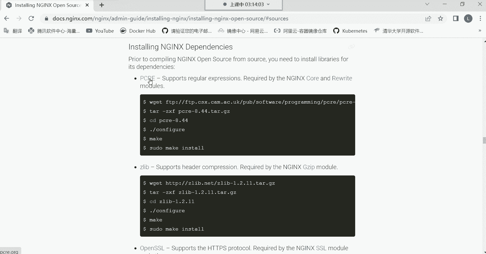
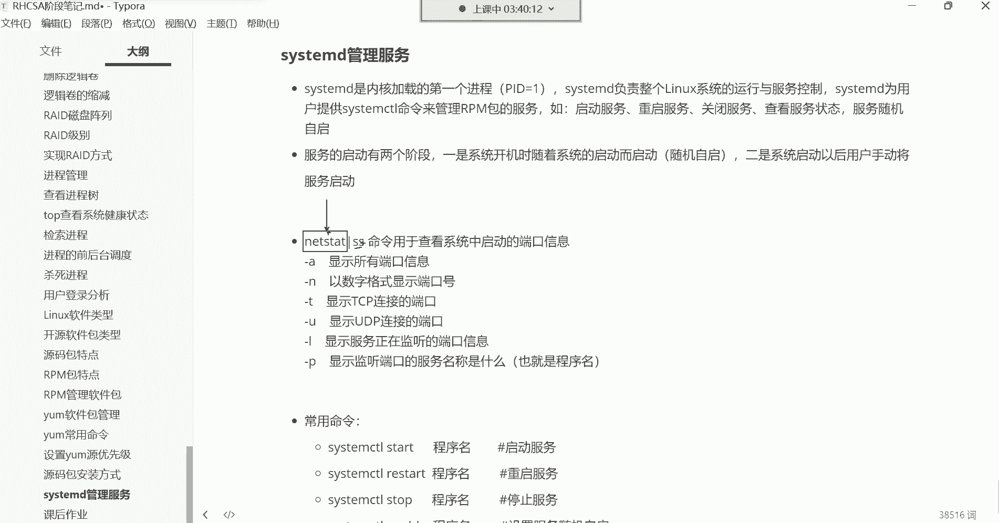

# 零基础入门Linux，红帽认证全套教程！Linux运维工程师的升职加薪宝典！RHCSA+RHCE+中级运维+云计算课程大合集！ - P35：红帽RHCSA-35.源码包管理方式、systemd管理服务 - 广厦千万- - BV1ns4y1r7A2

好，那我们继续吧哈，我们接下来给大家讲讲这个原码包的一个安装方式。原码包呢在整个的学习阶段呢用的不是很多，没有那个RPM应用场景广泛。所以呢我们是把它放在最后了。但是原宝包呢，有的企业呢，他确实需要你。

用这种自定义的方式去安装硬化软件，我们就拿了个哪款软件包来说呢？就是这个N这个词来说啊，N这个词的话呢，有的企业它就需要什么呢？需要我们自己去自定义安装路径与这个安装功能。如果一旦遇到这种需求的话。

当然啊我说的不是说只有一款软件。就是你们在企业当中遇到任何的，比如说这种需求，就是需要你自定义安装软件的路径，还有这个功能的话，我们都可以通过这种源码的方式去安装。毕竟前面我们安装的这个软件包，啊。

我们安装了很多软件包。

有哪些呢？我们。我们就拿这个。我们最熟悉的那个VSFTPD。那那个VSFTPD啊，我们安装完了之后啊。我们无法控制这个软件。他相关的文件在我系统的哪个路径存放。

或者说我无法控制把这个软件安装在我系统的哪个位置。就是这又让我们显得有些就是不是很什么呢，不是很好管理。我这个是不是？看一下哈。重新挂载一下，但是我记得我开机挂载了，杠梦他杠一吧。安装一下。

我们来说一下啊。呃，就像这个软件来讲，你看安装完以后啊。我想管理它，你发现这个软件相关的文件，它是分散存储在系统的不同位置，看到了吧？你看有这个va下边的，有一些文件和目录，还有其他路径的。

还有ETC下边可以看到吧。其实这就让我们有些什么呢？有些不知所措的感觉。就是我想管理这个软件哎呦这个相关的文件呢，在这个路径也有在那个路径也有。我记不住啊，是不是记不住。所以说如果一款软件我能够限制它。

比如说我要给它安装在我系统的哪儿呢？呃，安装的安装在我系统的这个OPT目录，或者说优色这个目录下边。这些呢都是用于用于用户自定义软件的安装路径。那以后我管理这款软件，是不是就直接来到这个路径。

那这个软件相关所有的文件我都能找得到啊。不需要这个路径去找一找那个路径找一找了呀。哎，没错，就是这样子。所以原码包在企业里面呢，如果一旦遇到这种哎，如果在企业里面一旦让你自定义安装的话。

那我们就得用源码的安装方式。

那原码包安装的话呢，它大体需要以下这么个流程。第一呢，你想安装什么软件，你得先有它的源码包。源码包呢一般从官方网站去下载即可。这个呢我们后期在学习一些服务的时候。

比如说我们嗯需要大家源码安装哪些包的时候。到时候呢会带领大家去认识对应的官方网站。

啊，那我们就拿这个哪个软件来说呢？们就拿这个Nd来说，N呢是在企业里边非常非常常用的一款软件包。比如我现在就希望安装它，并且是源码安装。我们刚刚是不是知道怎么用亚么去安装啊，我们前面演示过安装升级啊。

都给大家演示过，那我现在让你源码安装，它怎么办呢？

官方也给你提供鱼帽包了，我们去到他的官方。

嗯，用谷歌浏览器吧。按那个词点ORT关啊这些地址大家不用记哈，这些地址后面我们都会讲，我现在只是带领大家先什么？先熟悉一下。就是我们如果说想原码安装一个软件包，我们大体啊走的一个流程是什么？😊。

第一步呢，你得先来到他的官方网站，然后呢。官方网站呢都会有对应的文档。毕竟你想想一款产品连个手册都没有，这别人怎么用啊，是吧？所以官方网站呢，但是一般都是英文的哈，你可以翻译一下，你看不懂，没关系。

像谷歌浏览器自带这种翻译。所以你可以直接翻译一下啊，在文档里边大部分的软件都有阅读文档。这文档里面会对这个软件的相关的介绍啊，有功能安装方式等等等等，都在都有文档。这里边呢。😊，你看啊拿安定斯来说。

它就有一个什么呢？叫做从源代码构建的这么一个选项。你点进去点进来之后呢，这个里边就是具体告诉你这个软件包它的相关的源代源码安装的这种，你我们可以指定的一些参数。看一下哈，但是前提是我们得下载它的包吧。

最第一步先退回去，先把包给它下载下来哈。😊，包这有个叫download的这个download的就是软件包的下载位置点进去。那当然这个软件的版本呢，我们。由于不同的软件呢，它版本也不太一样。但大体的话呢。

这个咱别翻译了哈。这个我们。你看对于软件的版本呢，如果在英文里面呢一般有这种主线版本的这翻译过来就是主线的意思。然后这种呢就是稳定的意思。看了吗？这种就属于稳定版本。然后下面还有一种哎，这种就是旧的了。

看了吗？这就是什么遗产啊，什么遗产遗物。哎，我觉得这翻译的简直有些不适合人类去理解了哈，这叫旧旧版本的意思。😊，啊，旧版本哈，仪器的版本，你可以把它理解成是仪器的吗？其实离仪器的也不是很准确。😊。

下边好像这个翻译的好像还可以啊，以过时的。啊，如果是在计算机里面，如果是软件或硬件，就代表已过时的。啊，但因为使用范围广而难以替代的啊，可以这样去理解哈。

因为这里边有些这个计算机的专业翻译词汇以过时的版本，其实就是旧的意思啊，过时的版本。😊，所以你这时候你可以看到软件有主版本。稳定版本跟旧版本，然后软件包就在这儿呢，看到吗？主版本的软件包。

稳定版本的软件包，旧的软件包版本。那你比如说我我想下载这个当前的稳定版，这就是它的源码包，右边是适合安装在windows系统里面的，左边是适合安装在windows里面的。因为windows它有标识嘛。

那这时候我们就可以去点击什么呢？点击下载，但是通过浏览器直接点就可以下了，看到吗？直接就下了哈。😊，就是还有一种方法，浏览器下方，如果用浏览器下方也行。还有一种方法，右击。叫复制链接地址。

软件包不是有具体的链接吗？然后呢，我们干嘛呀？我们直接来到系统里边。

不一样哈不一样嗯不一样哈，直接WgeW get哈。哎，看这哈，把链接粘过来粘过来哈。对，这翻翻译工具，有些让我们摸不啊摸不到头脑是吧？😊，然后接下来呢直接回车这个软件包。

当然Wge这条命令就是一个下载文件的命令，从互联网当中帮你把一个文件下载到本地，跟windows里的迅雷是一样的那你看这个包就直接下载到虚拟机里边了。如果你不想下载到虚拟机里边。那这时候你可以看一下。

就直接在浏览器里面了，浏览器不是有个下载吗？😊。

下载内容。你看。到时候你就直接可以干嘛呀？你是不是就直接可以在文件夹中显示，然后把这东西保存到你的。某一个文件夹里面。能列吧，看到了吗？就这意思哈。直接可以保存了哈。然后我就不保存了哈，我就保存了。

我主要是跟你们说一下这个下载方式，很多种吧。接下来呢我们来说它的文档。😊，包有了之后怎么安？这个包有了之后啊，一般的官方有文档，在官方文档里边呢。对于这种官方文档。这个可以翻译一下哈翻译一下。

官方文档大多数你如果细心找的话呢，都有一些具体的详细的信息告诉你。看看，然后这里边什么安装，从如果我们是源代码安装，我们就得选择这个哈，选择这个好点进去。这里边呢是具体的就是我们可以使用的指定的参数了。

因为原码安装我们是可以手动指定的那指定的参数这里边它已经告诉你了，翻译一下。我们可以指定哪些呢？首先告诉你，你可以使用哪个命令去配置它。然后这个命令可以定义系统的各个方面。

就是你可以使用这条命令去指定这个软件的各个功能。那。下边可以支持哪些参数呢？首先你可以使用杠杠 help去打印它的帮助信息。

像这种东西啊就比较简单，来看一下哈。😊。

这个包啊，它首先是一个压缩包，对，这种包你看到吗？是不是压缩包啊啊，当然我们已经下过了是吧？啊，三个版本了，现在呀删两个哈，这搞这么多干嘛呀？呃，3。Yiang。点0的。再三。20。点儿一的。

现在只留一个哈只留一个。我们留了个20。2的，它这个压缩包压缩包，你得先解压。但是前面那个N这个那个目录，我们也给它删掉哈那个。😊，嗯那个是1。18。0的目录啊，删了已经哈没了。已经没了。

第一步呢得先解压它这个压缩包，因为源码包嘛，原码包就是它的源代码都在这个压缩包里边呢，源代码都在这边呢。所以你解压以后呢，它会生成一个目录。哎，其实这个就有点类似于什么呢？

这个就有点类似于如果在企业当中，你比如说在企业里面怎么说这个很多个部门。😡。

有开发，有测试，有运维。你在企业里边啊，如果说开发人员他开发好一款产品了。

一个项目呢，他已经。开发完毕了，这时候他也会把这个项目呢给我们打一个包。这是开发。这是运维啊，当中间还有个测试我就不说了哈，开发运维开发它开发好一款软件之后，它。你像那一个软件，那里边的文件。

还有相关的东西多了去了，他不可能一个一个的传给你，他怎么给你呢？😡。

哎，一般他打个包。打个压缩包。打个压缩包。他直接他不是把这个压缩包交给你。😡，然后你能拿到本地解压。一挤压以后，你就能够看到开发人员的项目相关的所有文件了啊，都在这个压缩包里面。啊。

但是呢我们这种方式哈是不是就可以直接看到这个。这个项目的一些源代码的呀。进去啊进去。在企业里面做项目就是这样子，开发人员直接把他开发好的项目打个包直接传给你，因为传传输速度快呀。传速度快哈。

这里边呢就是所有的项目了，其实这就是一个项目。嗯能理解吧？这其实这就是一个项目。这个项目你拿过来，你想给它呃部署，让它运行起来，那你就经过一系列的配置就可以了。😡，那接下来这里面官方有文档。

当然如果在企业里面开发人员开发我一个项目，他也会给你文档的。他告诉你这个项目里这个项目哪些是我的这个什么一些这个页面文件，哪些是我的原呃源代码一般不给你啊，哪些是我的相关的配置文件的目录等等等等。

它都会有详细的文档的，就跟我们刚刚看那官方文档是一样的。所以你要参与它的文档啊，具体怎么去部署就可以了。那对这种你看文档，你就得知道官方文档呢，一般我们说比较官方相对来讲呢这个不太好理解。但大体来讲。

如果你是看多了，你其实你就明白这个很多这个老外的一个什么呢一个套路了，或者说一个思路。

首先这里边他告诉你，这里边有叫康菲格，这个命令可以配置一些什么呢？呃系统的各个方面。说白了就是说你可以使用这个命令去什么呢？去。安装那款软件，然后这款软，然后这个命令有个帮助，叫刚刚help。

这里边你回过来，你看一下。

你怎么用呢？但是他这个脚本哈就得点杠当前路径执行。当前录音只行这个脚本，然后杠杠ha。也可以。这时候就把他的帮助呢打印出来了。然后他这里面的帮助啊，你看非常多非常多哈，这个帮助。这叫什么呢？这叫参数。

这就叫参数哈。左边是参数的名字，你看这个ha这个参数可以帮我们实现什么功能呢？叫打印此消息，就帮你打印。我这个脚本支持的一些。消息啊，这这翻译的不是很准确了哈，就帮你获取帮助的。

说白了就是hel不就获取帮助的吗。😊，那这个参数可以帮我们干嘛呢？设置安装的前缀。这就是设置安装路径的。安装路径。你比如说我希望把Nex这个包安装在我系统的。哪个目录呢？

安装系统的这个us色loc这个目录下边我取个名啊，放到这个N6这个目录里边。那你怎么样才能指定这个软件包？😡，能够安装在这个位置呢，哎，你就得在什么呢？在这个脚本的后边干嘛呀？就这样我要直这点杠。

点杠是你执行这个脚本。然后呢，哎你抗fig的时候，等一下啊，我们再开个终端哈，我们再开一个终端。然后我们进到那个N这那个目录，我们左边终端看帮助，右边终端那咱然后咱们就直接用哈。就是我可以这样。

我在使用这个脚本的时候，它不是可以这个脚本不是可以让我去指定一些这个配置参数嘛？那我就可以。通过这个叫杠杠profi。拿过来就可以指定什么呢？指定我要给他安装内我系统的us色local下的in目录。

那这个目录存在吗？不存在，压根儿就没有。那没有怎么办呢？没关系。😡，他会帮你创建的。他能帮你创建出来，所以这你就不用管。看了吗？然后下边还有哪些参数，这以此类推。啊，当然啊我今天是给你们讲方法。

我并没有教你们怎么去安装这个软件啊，怎么指定它的相关的功能的。我是在教你们方法，任何的源码包里面都有什么呢？都有这种配置脚本。然后所有的脚本都可以用hel去获取它的帮助，获取到帮助之后。

你就可以基于它的这个提示。去干嘛呀？哎，去指定一些安装路径在这里边。你可以指定它的安装路径。然后用什么功能呢？一般。😡，软件呢有模块，当大家学到这个软件的时候，自然会告诉大家这个模块能够干什么用的。

到时候你指定就行了。你比如说我希望再安装一些模块，安装在这个路径以后呢，我还希望安装一些模块。那这时候哎你就可以直接把模块给它写进去就行了。比如像这种模块名字，你说这模块干嘛用的呀？啊。

一般呢你还可以去。翻译一下叫穷啊，叫使用N的一个什么呢？啊，叫做SSL，这是一个加密的功能。就这样子的哈，就是呃。😊，你要明白什么呢？就是你们要明白，不是怎么去安装它，你们是要明白它具体的流程。

具体的流程就是第一，从官方下载源码包。第二呢。当然还有一些依赖，这里边哈。😊，其实下了元小包以后呢，我们。解压之后，或者说这个Z步跟Z一步他们两个呀。最好是应该先干嘛呢？先执行这一步叫安装原码宝的依赖。

因为这个原宝宝也需要依赖的。依赖哈安装依赖以后呢，解压，然后进到原码路径。我们现在是处于什么呢？处于解压了，也进到这个路径了，然后也指定了安装路径跟安装功能了，安什么呀？安这个模块安在哪儿？

把这个软件给我安装在这个路径，然后这个软件里边给我安装一个这个模块。可不可以呢？这就是自定义。这叫自定义哈那很多企业就是什么啊，除了这个模块以外的功能我不要。😊，不要我就不安。😡。

不然就可以节约夫妻的资源。提升这个软件的运行效率。能列吧。然后。

我们还没有我我们现在这一步没做哈，就是没有安装它的依赖，但没关系不冲突，毕竟我们现在还没有什么呢？还没有执行这个脚本呢。如果说你前面在什么呢？比如说我忘安装依赖了，我这时候我直接啊回车。

我直接回车了啊，就指定安装路径跟指定了那个模块，后期报错。😡，啥时候讲完啊？6点哪6点哈，我们今天不是两点半上课的吗？两两点半上课的晚上半小时吗？哦，它并没有提示错误，你们看到了吗？这并没有提示错误。

为什么呢？因为啊我们这个系统里面它所需到的依赖都有。他所需要依赖，我们前面都已经给他安装上了。因为我们前面在练习的时候，他就已经安装了它相关的依赖了。那这时候你们就开始有疑问了。

我怎么知道他需要哪些依赖呢？😡，是吧。

我告诉你哈，一个软件的依赖呢。😊，从哪看呢？在这个里边。在文档里面一般有一个，当然只有这个里面有针对于管理员的指南哈。在一般软件文档里面也会告诉你我需要哪些依赖。你想原码安装这个包得先安装它的依赖。

N里面呢，它是专门设一个叫管理员指南。在这个里边你点进去。因为毕竟不同的软件，它的官方文档设计是不一样的。因为就是每个人的思路它不一样，所以。你不能把所有的软件的文档都按照我今天给你们讲解的这个什么呢？

n这个文档的套路去看，能理解吧？每个文档都不一样，但是大体肯定会告诉你这个软件怎么安装，怎么使用，有哪些功能，具体怎么配，能理解吧？然后在这里面呢。安装N04哈，点这个，这不是安装N04这个软件吗？

看了吗？安卓NS4跟NS4 plus它有不同的版本。然后点进来之后呢，右边看叫open呃s就是开源的意思。开源的意思哈，好了吗？那么那个open source就是开源的意思。安装win4开源看到了吧？

然后点进去。点进来之后呢，开源的话，那安装哪个版本看到了吗？这里面是不是有具体的主线版本稳定版本。好，你要按哪个？啊，当然具体按哪个呢，它这边它里边就是简单介绍一下哈，这边简单介绍一下。😊。

就这个版本里面包含什么？包含包含最新的特性跟错误的修复。啊，下面这个这个版本里面一些介绍。啊，不包含有最新的特性，那有些错误修复。等等等等。然后下面这个具体的安装看了吗？就是上面这个安装方式。

就是作为一个叫预构建的二进制包，这是一个安装这次开源软件的快速简单方法。这句话就比较好理解了。这二进制包的安装方式。就是我们前面用亚么一键安装的那种方式，亚么杠外。N这个4。in此套。那个是。

这种方式就是二进制，非常简单，一键安装了。但是我现在要原版安装啊，那下面那个。😡，下面这就是源代码安装。啊，那如果说我们作为源代码编译的。去安装的话，编他的这种这个什么呢？这个源代码。那这时候。看看。

这种方法就更加灵活一些，怎么灵活呢？啊，这种方法你可以添加特定的模块。包括什么第三方的，就你自己第三方开发的模块都可以。然后有关详细信息，请参阅源代码编译安装。看到了吗？

是不是让你参是不是让你参与这个呀，这个就是源代码的安装嘛，你看inst。😡，让你参与这个，那我们就点点这个参阅。好，这个时候你发现。这叫什么呢？这叫安装in的依赖。就是说这个软件它需要依赖。

但是你不知道有哪些依赖的时候，你是不是得从官方文档去找一找啊，因为原码安装就是比较麻烦，你没有办法，就是麻烦。😡，他缺什么依赖，他不告诉你的，你得自己去参考官方文档。那这时候你就得先安装它的依赖啊。

但是我们为什么一下就能安装成功了呢？😡。

是因为我们前面在安装的时候，我们搞了很多个依赖包。😡，我们在练习的时候都安装上了，你可以看一下它需要哪些依赖的时候，你看一下哈，它需要哪些依赖呢？叫PCRE这个依赖。😊。

这个依赖具体的功能你也可以翻译一下这里边。帮我们实验什么功能的。什么支持正则表达式的。啊，也是它的一些什么呃核心模块啊，一些模块所需要的好吧？是我告诉你说缺这么一个包啊。好。点一下看有没有什么其他提示。

然后对这个包怎么下载，这个包在哪下呢？在这个get help。😊，看到吗？他说你可以从这儿去下载这个包。你可以从git号官方去下载当前的版本。这是PPCRE2的一个库啊，PCRE就是众多的这个库。

那那这个大仓库啊，P叉里面有很多的这个模块啊里面。非常麻烦吧，非常的麻烦哈。😊，有常麻烦。那具体怎么安没关系啊，下边有地址啊，下边有具体的命令看了吗？这里边哈有具体的安装方法就是。

从这个地址下载相关的包，然后呢解压这套路一样，先下载包解压，然后进到这个路径，你看现这个路径里面也有一个什么呢？也有一个对应的一个。叫康菲哥这么一个脚本好，接下来啊，执行它，然后make。

然后make in一步一步的就可以把这包给它安装上了。然后下面这也一样。还需要这个叫Zlab的一个包。😡，看到了吗？也需要这个Z吧哈。😊，然后这包干什么用的呢？这里面也可以看。

你具体看这什么支持什么头压缩的。然后怎么安装啊啊，下先去下载它的包，然后解压，看到了吗？是不是套路都一样，先下载包解压，然后进到这个目录，然后开始去。直接执行就行了。

比说这种东西你不要去不需要去做任何的配置，只需要去执行就可以啊，其他的话呢。😡，还需要这个叫open SSL需要这三个依赖。也是第一步下载包啊，第二步呢解压进到路径。指定一些相关的参数。然，到此为止呢。

我们再去安装in，这时候你再去下载in的那个源码包，然后再去解压它，然后再进到in的路径。但是这里面由于版本不太一样，看到了吗？因为毕竟这里边第一个是什么版本呢？看。第一个下载的是它的主线版本。

上面的例子啊，你要下载并解压最新的主线版本。那你就得从这个地址去下载。但是我不想用主线版本的，我想用稳定的呢啊，你想用稳定的，你就下载最新的稳定版本的原文件，请运行下边的这一段命令。

就是这个地址可以帮你下载一个最新的稳定版的看到了吗？然后包下载下来之后都是解压进到路径。接下来呢怎么办呢？接下来都这里边是不是都有一个叫康菲格这个脚本啊，然后你就可以去通过各种参数去指定它的。

比如说安装路径等等等等等等等等一系列的东西都可以去指定的。那这种东西具体怎么指，是不是就得由于不同的程序。

它不一样，你就得去参考它的官方文档了呀。嗯。但是你说老师我这一个依赖包，我也需要搞那么麻烦吗？😡，源码包最烦的就是依赖。我跟你讲，原码包最烦的就是依赖。😡，因为依赖包你如果也需要这种编译安装的话。😡。

那是最痛苦的。非常的痛苦啊。所以我们一般怎么办呢？我们一般对于它的依赖呀。我们选择用亚麻安装。压板装也好用。哈。注意啊，就是你要明白啊，就是最终你他有一个我们说有一个核心思想。😡。

什么核心思想呢？一般呢就是做一个依赖包。依赖宝我们一般就没有必要去源代码编译。源代码编译安装。能列吧，我们不是一个软件包给我们提供了给我们提供很多种类型吗？你看一个软件包。😡，一个软件包。

他既给我们提供什么呢？这种原码包。又给我们提供这种二金制包。二进制的RPM包。是不是啊？但最终这两个包的功能是不是都一样的，功能都一样，注意哈，叫功能都一样。那依赖包的话，你有必要去下载什么。

它的源代码再去编译它吗？有这个必要吗？😡，没有必要吧，是吧怎么省事怎么来，因为功能都一样啊，所以对依赖包来讲，没有必要去源码去安装哈。所以依赖包一般呢就用ym去下载就行了。😡。

压么下来。那说我用亚马现的，我怎么知道那个依赖包？😡，他亚么那个包叫什么名啊？😡，这你要明白哈，它的原码包如果叫N这。那他的一他他的那个。二斤制包也叫N那个斯。

知道吧？你就比如说我们拿这个N。

他所需的这几个依赖来说，他需到这几个依赖啊，你看哈有什么PCRE是吧，这个包它的那种。😡，你看它的原码包也叫PCRE，那它的二进制包也叫同同一个名字。都叫同一个名字是吧？只不过我们说二进制包比原码包。

😡，它的名字呢结构上不太一样，但是前面的名字可都叫同一个名字的。

所以这时候你怎么办呢？这时候我们一般啊。在本地干嘛呢？先看一看有没有。它的那个二进制包，所以先yum list干嘛过滤。grape过滤PRE这种类型的软件包。有吗？是不有？是不是有哈？然后呢。

你看这里边有一个这个叫底wa类型的。😡，什么开发包什么开发包是吧？😡，啊，其实就是这个这种dw类型的软件包，就是它的这种。这个我们说就是跟那个原宝宝就是是一样的，或者说就这种PCRE。

你直接安装整个整个PCRE也行。但一般对依赖的话，我们只需要安装这个底位的就行。这底位的他代它代表是开发的意思。叫development。全面叫developide permit，就开发的意思。开发包。

开发包哈。所以我们安装的时候。你甭管什么开发不开发的，你看我们系统里面有没有这包。😡，杠。QA。管道给grape，然后PCRE。有。啊，有哈其实就这包就这包，你直接把这个包一安装，基本上它的依赖。

安装上了，这是主包，这是依赖看到了吗？就你安装这个依赖，你安装它的话，它也会跟一起安装上的。所以对于这种我们说它所需的依赖，我们是不是就既然是已经有这种RPM包了，我们还有必要去源码编译吗？

这不属于增加我们的工作呢呃，跟我们的工作增加这种什么呢？😡，增加这个工作量嘛，没有必要吧。总之你甭管什么包，它是不是都提供同一个功能的呀？所以依赖包别原码便宜了哈，依般依赖包我们一般都是亚母一键安装。

😡，一见装需缺什么依赖。好，我也不知道他这个他所缺缺的这个依赖到底是什么底位了，还是别的，我就直接压杠外insPCRE。😡，安装就行。有的话。就可以。哈，今天脑袋不够用是吧？好。

这就是我们所说的这个依赖，还需要哪个依赖呢？

看一下它还需要这个叫什么Z labZ lab那包我们有没有啊？😡。

看一下哈。看一下杠QA管道给graZ live。有。看到吗？也都是一个主包，再加上这种dwa，加再加上这种d位了这种类型的开发包。这种就是他的所这种这种就是他所依赖的主包，开发包里面一般放的是什么呢？

就是一些。所需的工具，那这两包呢一般都得同时存在才行。所以你一般安装的时候，你也甭管什么底位了，不呃什么底位了不底位了，你直接就亚目杠外ins套他缺什么包，他缺Z live吧，我就安Z live吧。😡。

跟Z板相关的，他都给你安装上。所以这种依赖直接安就行。还需要哪个？你说open SSL好，缺这种是吧？那我也给你安，你看先看你先看有没有。

有啊，它缺open SSL这种包。有吗？有看了我们系统里面本身就有open SSL这个包，这是它的主包。1。0。2版本的。嗯。😀呵呵。😊，所以这一依赖你发现就是如果一个源码包看哈你在安装的时候。

首先你必须得先安装原码包的依赖的那这个依赖到时候官方文档会告诉你需要哪些依赖。接下来依赖包用亚码安装，注意下，依赖包用亚码安装就行，别原码编译，太麻烦了哈。然后接下来。

就用原码包里面自带的这这种程序啊，或者说脚本去检测环境就行了。所以你看我们如果我们自己已经检，我们前边哈，我们是不是已经干完了，我们是不是已经这个。

通过这个。康飞格这个脚本。指定了安装路径跟安装工啊，安装的这个模块了。那接下来。环境如果没有问题，它就不会出现什么 error的关。如果说环境没有问题，它就不会出现什么 error的关键字。😡。

没有报错，他就会告诉你啊，我这个N这这个软件。它的一些相关的文件的安装路径，这些都是相关文件的安装路径的，知道吧？安装路径都在这个里边。到时候你想去管理他。

你看inex pass perfect fix，这就是安装路径。到时候你就直接去这个目录下边去什么呢？去管理它就可以。所有的文件都在这一个目录里边，不需要跑到别的路径去找。这叫自定义了，自定义安装路径。

好。嗯，那接下来呢接来应该干嘛？接下来我们都已经指定完了，安装路径，安装功能都指完了。那接下来哎编辑他了。😊。

这个所谓的编译就是将源代码转换二进制的一个过程。因为毕竟我们说源代码最终它是01，它这个ABCD的英文字母，计算机也不认识，所以啊转换成二进制就行了。怎么转换呢？哎。

make make可以帮我们去做编译。

所以这时候直接make回车。这时候他就会去你看去这个什么呢？去各种路径帮我们去编译这款软件。那它都是在编译谁呢？编译SRC这个目录下边的那个源代码。你看这个目录啊，你看它进的是哪个目录。

是不是都是SRC这个目录啊？😡，因为他搜的源代码都在SIRC目录里边呢，所以他要去帮我们去编译源代码。啊，再编一各种点C的文件，你看这些。在帮我们做各种编译。点C的文件。

他得把这个所有的原言文件给它转换成二进制。转换以后，计算机就认识了，你不转换计算机就不认识。😡，今天这脑袋确实有些不太够用了，是吧？啊，因为今天我们这个命令讲的有些多，我们今天除了命令以外。

相关的概念讲的也非常多。😊，但是没有办法，这软件包管理呀。😡，你想是你在整个运维的基础阶段，可以说是非常重要的一个技能。软件包如果都不知道怎么安的话。那你说这还怎么去什么？😡。

所谓的维护什么这企业的项目，您人家说啊我们做项目需要安装一些软件包。你说啊那怎么安装软件包啊？😡，Right。😊，不能这样是吧？好啊。

接下来你看他是不是把所有的SRC下边的那些源代码文件都给我们编了个遍了呀。啊，编译完了之后啊，能放到后台执行吗？可以哈，可以放到后台。😊，编完了之后的话呢。我们。

接下来就要最后安装了，最后make in store就可以安装了。因为它一旦变成二进制了，计算机认识的，认识了以后，你就可以给它安装上make insal固定的格式啊，固定的命令有回车。

安装就快了。安装速度也很快哈，安装好了，安装好了之后，其实无非就是把什么呢？把我们当前这个目录下面的这些一些文件。😊，拷贝到哪儿了呢？拷贝到它的那个安装路径了，userlocal n这个目录下面。因为。

一旦对所有的源代码文件变译了之后。这时候。计算机可以把这个软件安装上之后，他要把一些相关的文件给你拷贝到你指定的那个安装路径去。看到吗？什么相关的配置文件呢，拷贝在哪个目录这里面。

或者说在你的这个具体的目录下面再去创建一些目录。看了吗？创建一些目录。这些就是。他做的事情。所以这个安装的过程呢，这个安装的过程就是把当前这个目录下的一些这个一些项目文件给你做一些拷贝，拷贝过去。好。

那接下来我们安装好了，安装好了之后呢，我们就直接看一下。优势。Loal这个目录。这里面是不是有1个N6个目录啊，这就是。这个软件相关的安装目录了，所以你打开的时候，你看一下，哎。

这里边就是N这个软件相关的。一些配置都在这里边呢，或者说一些数据都在这个目录里边。那到此为止就安装好了，安装好之后，你说我怎么管理呀？😡，我怎么去管理他呀？😡，那这个得具体学习。

你想管理你得学习N64这个软件。😡，你学完以后你就知道怎么去管理了。比如说对这个软件来讲，我应该啊怎么去修改它的配置，以及这些目录到底是存放的是哪些数据的。嗯，后边要要要后边如果要用其他功能，新增模块。

要重新编译嘛？呃，重新编译，它不要安装。只需要重新编就行。比如我后期我还需要。

还需要一些这个模块。随便搞一个哈随便搞一个模块。比如这个。嗯。就这个比如说我后期我我还想往里面增加一个模块。

那怎么玩呢？看看还是进到他的那个相关的路径，进到这个路径哈。😊，啊，当然呢。进到这个路径的时候呢，我先。这样我先给你们演示一下，没关系，给你们演示一下，我先进到优色local下边。

然后呢再进到那个注意啊，很多东西是你们现在不需要去学习的哈，很多东西是你们现在不需要学习的。😊，我只是就是为了让你们知道一下呃，这这种东西后期我们可以灵活的去配它。嗯，那这时候我可以这样。

我先把这个软件给它起来。源码包它有专门的程序文件，一般都在这个spin下边有一个绿色的脚本，直接你就执行spin下的N。好，这个软件就运行了。然后呢你可以这样。这个一般这个程序脚本会带很多命令。

你直接用杠V杠大V就可以看我们当初安装的时候指定的路径与模块了。哎，那后期你说我想再往里面增加模块怎么办呢？再增加模块，这时候干嘛呀？在抗飞蛾的时候。注意啊。我是不是要增加一个新的这个模块啊。

那原先的东西也要给它加上，注意啊，就原先的配置也要给它写进去哈，不然原先的配置就没了。所以这时候你把原先的配置也要加进去。😊，这是不是我原先指定的路径啊以及安装的功能啊？不覆盖哈不会覆盖的哈。😊。

这时候你再编一遍。检测一下。模块这种东西注意啊，模块这种东西没有什么覆盖不覆盖的。好，没有问题。接下呢make一下。就是再重新编一下。你编的时候，他就能他就能够识别了。😡，那这些你们看不懂啊。

这些你们可以给它忽略掉。因为这个有有的人呢可能多多少有点基础啊，所以他能思考到这一步。如果你们没有基础的，就不要去思考这个问题。因为这些不是你们现在所需要思考的啊。好，没问题。一般注意啊。

到这一步就可以了，一般就不makeinst到了。如果你make in，如果你makeins store，原先的内容就覆盖了。😡，如果你最后再make个in子，那原先的内容就真的覆盖了哈。

所以现在只需要干嘛呢？😊，就完事儿了就已经可以了哈。这个时候。你如果再重新加载一下。如或者说我我重新什么呢？呃，重新把服务给它关掉啊，杠Stop，然后再重新启动一下。

或者重新加载一下就可以reload一下。好，然后再看。没有识别吗？那得那就关掉吧，如果不识别就关掉。然后再再起来。然后再看。你看诶。怎么没有识别呢？刚刚按那个模块。一个。GZ的模块，它怎么没有识别呢？

不应该是这样子的哈，不应该是这样子，把佛再重新起一下。啊哦，弄错了弄错了。注意啊，这一步不执行哈这一步不执行。不联干嘛呢？其实我这个。好久没有做这种原码包的这种那什么的这种那个。这种工作了哈。

后期只需要把它把它在OBGS里边呢有一个程序文件。啊，OBGS里边。把这个新的程序给它重新拷贝一遍就可以了。拿新的程序替换掉原先旧的程序就可以了，一替换就能够识别到了哈。😊，啊，这一步呢啊当然先有印象。

后后期这种东西会详细讲。好久不做了，都忘了。但是肯定是不能执行最后那个安装哈，安装就覆盖了啊。😊。

那以上你说原码安装。哦，捋捋一下哈捋一下，别混哈。第一下载源码包去。第二呢。去安装它的依赖。这依赖啊，一般官方文档他会告诉你，如果不告诉你怎么办？你说不知道，这百度也可以。😡，可以百度搜一搜。

比如我安我要安装这个软件，它的依赖是哪些包？然后你用样板安装哈，接下来呢。安装完依赖之后就解压原宝包呗，解压以后进到路径就开始去指定安装功能，或者说安装路径了。那你说老师。

那如果说我不指定安装路径怎么办呢？如果不指定安装路径。😡，如果你不指定安装路西，它有默认的路径的。注意你放心，你不指定它也有安装的路径。😡，他有默认的。RPM安装不能加模块。RPM所有的模块已经都有了。

然后。这些东西你不止，你说老师那不止，我怎么知道呢？😡。

如果不止的话。如果你不止啊，我告诉你啊，你在这个。获取帮助的时候，我们看看能不能从帮助里面查找得到哈。

啊，从这里边查找不到，那就得去官方了。一般官方会有。一般官方呢他会告诉你，因为对于源码安装，你想你想自定义，你就得要了了你要了解它的官方文档。😡，毕竟官方文档内容还是很多的哈。

这里边你看你比如说对这种指定安装路径的时候，如果不指怎么办？这里面有叫default。默认。他说我不指定安装路径，默认他会给你安装在系统的这个位置。😡，看到了吗？如果你不止哈。

这就是有它的默认的一些安装位置。那如果功能也不止呢，功能模块我都不止呢，你不止，它也有默认的模块。😡，但是具体这个得根根据不同的服务去什么呢？

去阅读了，这这不是绝对的这种东西。

这种东西不是绝对的哈，但具体原码安装大体流程现在搞清楚了吧。😊，嗯。对，RPM安装方便呢。安装方面呢，所以很多人喜欢RRPM。毕竟原原版中对于很多初学者来讲，就是我们说不友好。😡，他就是不要好。

There儿。这种东西可能第一次你刚开始接触的时候，你觉得这种东西太难了。很多东西就是什么呢？很很多东西就是你刚开始的时候觉得难，但是一旦用习惯了，其实它也就没有那么难。😡，嗯。

用多了就不会觉得它有多难了哈。😊，啊，这是原满桩。安装方式。样么删除跟RRPM删除没区别，你删除的时候就都一样了哈，删除的时候就没有就没有什么区别。😡，对，亚么方便RPM你要手动解决依赖关系啊。啊。

然后对于原码包的管理啊，这一般这个不是绝对的了哈，怎么管理这一般我们就。不应该放在这儿了哈不应该放在这儿讲。好。然后下边呢还有还有还有几条命令啊，这几几条命令的讲我们今天就结束了。

这条命令这几条命令讲我们就结束了哈呃这几条命令呢是用来什么？是用来控制。😊，服务的啊C是他么D。是管理系统服务的。什么叫服务呢？就是我们前面安装的那些软件包，我想去对它，比如说我要启动它运行它。

或者说再给它关闭掉。那这些你得知道怎么去管理它啊，所以这些命令。都是由什么呢？C systemtD给我们提供的。因为本身stD就是系统内核加载的第一个进程PAID是一的。我们前面就给大家讲过。

在讲那个什么呢？在讲进程的时候。PS退的时候。看进程数加个P哈加个P。是不是这个C死他们D。他的是系统的一个叫天赋进程啊嗯。啊，天赋建成他的ID号是一。

这个进程它有很多的命令。然后呢，这些命令呢可以让我们去管理系统里边的众多的服务。那这个服务就比如说像启动服务，重启服务、关闭服务，查看状态是服务随机自起，这些都可以。都可以哈。嗯。啊，49分钟。

然后接下来呢嗯。接下来我们来这个说一说怎么用哈，先来给大家讲讲这个服务的启动呢有两个阶段。嗯，第一个阶段呢。是系统开机时随着系统的启动而启动，这叫随机自起的服务。哪些服务随机自起了呢？

南件服务在随机日起呢？啊，这时候你。呃，可以。怎么看呢？比如top。top呢可以让我们看哪些服务是属于正在运行的状态。我翻一翻。但是这样看就有些费事了哈，这样看有些费事。

有飞事啊。我们看服务一般可以看它的这个。

看进程或者说看端口。

但这个东西呢。怎么看呢？有一条命令呢，我应该放到哪儿呢？应该放到放到这个这个系统服务管理这边来看。来来说。我前边。等一下哈。啊，把这名证说一下哈。这个命用呢后边会经常的用到。哎，这个也难，追女生也难。

哎呀，这个世界上哪有不难的事情啊。😔，你们要知道这个世界上没有容易的事情。干啥不难？是不是？😊，我这卡了哈，我这个笔记卡了，你们等一下哈。😡，好。好像是缓过来了啊，好点。哎，没有孩子没有孩子。

哪有孩子连个嗯。😔，对于对于我们这种连对象都不需要的人，我们是不还需要孩子吗？😊，然后来说一下哈，我们来说一下这个。😊，命令哈。

都难呐。你想想现在这个社会。这个社会就是。钱难挣啊，然后妞难泡啊，钱也难挣，是妞也难泡，是心也难交，是不是啊？然后特别是你再看看现在这个经济，你发现这个连个依靠也都没有呃，你就知道这个。

现在学习啊才是最简单的事情啊，我跟你讲啊，这个这个学习真的是提升自己最最简单的成本最低的事情了。你你可以这么去理解吧哈。

这条命令呢用于查看。系统当中。查看系统中启动一些端口信息啊端口信息。这个。

端口信息哈。怎么用呢？这玩意儿啊S呃有两方面的，一个是SS，一个是netstar。😊。

对呀，上海现在连吃都是问题。对呀，你看你看你连吃都是问题，你说你还。😡，还有心情去考虑别的吗？是不是有精神是吧？这两个面的功能是一样的哈。😊，这这不是说找呃这不是说找不到找不，这不是说找到找不到的问题。

😡，能理解吗？没见过米干菜了，是吧？😊，😀哈哈哈。😊，对，哪哪有时间呢？你说对我们来讲没有时间哈，我们而且我们也不需要，说白了不需。这个命令由于查看系统当中启动的端口信息。怎么用呢？

这这一堆选项放在一起。😡，直接用就行了。然后这两个命令功能一样的，只不过在s6里面用的是这个命令。在s7里面呢，这命令啊。它变得简洁了，两个S就可以查看你系统里面起的那些服务了。

直接就这样用SS杠。INP。TUL回车。这时候就看可以看到我们当前系统里面启用的。所有的端口信息注意啊，它主要是看端口，你系统里面起了哪个端口。那个端口代表什么呢？端口代表的就是服务，注意啊。

端口代表的就是服务。因为这个端口是被服务所占用的。是被服务所占用的那这时候你就可以怎么看呢？你说80这个端口是被哪个服务所所占用的呀？你可以去。これ。过滤哈grape80。没车。80端口是被N这个字锁。

是被ND4列服务所占用的啊，22呢。那我想看22。22倍SSHD这个。服务所。占用的端口25呢。25是这个。啊，什么master是吧，这个master是谁呀？master是这个end。嗯，是Nex的哈。

啊，下面还有2225啊，这个就这么几个，一个是n，一个是SSH没了。我们系统里面就起了这两个服务，就起了这俩行。这怎么看当前系统启动的服务？嗯，我记着这个SS有个选项，我看看n可不可以啊。

STST哎n我没有敲错呀。没有这条命令吗？那我得安个包呀。搜一下啊。呃。没有找到。Let start。不是啊，对对对对这个。这怎么可能没有维他命呢？是不是那个兔子？看是不是这包？还真是。还真是哈。

但刚刚没搜到，你们看到了吗？你看我刚刚执行这个命令，是不是提示说没有啊，没有找到吧。😡，然后刚我用亚么说没搜到。我再说一遍哈。有时候会出现这种情况。啊，现在收到了。现在他收到了，看到吧？

所以你发现这这选项里边有时候它也不是很灵光啊。😡，是不是？有时候是不是也不是很灵啊，不能说百分百吧。😡，为啥就不是那么特别的灵验，你就这么去理解吧。😡，不是么特别的灵哈。就在本地没收到。那说那老师。

那我以后我要是遇到这个记不住的命令，我怎么办呢？😡，百度吧，就百度吧哈。😊，就只能百度了，这不能说玄学，这确实可能说他有的时候可能说也有失效的时候。嗯好，接下来呢我们来看一下哈。😊，嗯。更。

这个nstar呢这条命令呢它比SS如果在用这些选项的时候呢，它会帮我们显示出来什么呢？就是呃这个端口看到吗？这是不是。可以看到端口啊。而是哪一个进程在占用？看了吗？是哪个进程在占用这个端口，完看了吗？

这个8联端口是谁呢？是N这个服务的mas的进程在占用。哎，这后面是进程。マスタ？然后下边呢那这也都是你看SSHD这个进程。22号这个端口被SSHD这个进程在。在占用。啊，下面这都是SSHD的。

然后具体这个SSHD有哪些终端？这个显示的比SS会更加的详细一些详细一些。所以这样你可以直接就列出来了，其实这还有些麻烦，你把A给它去掉。嗯。这个选项怎么结合用，我看。呃，UD呃UDP也得用NP。不行。

P，如果不加P的话不行。那就都加上吧。😡，都加上嘛，看他更加呃这个什么呢？就是一般不用加A，一般我们不用加A哈，就是A加上也没事，其实大体也没有太大的区别，看到吗？你加这个A的话跟不加A。

你发现也没有什么太大区别。那一般主要就是看看。这个端口被哪个禁程，或者说哪个服务在占用着，可以使用这个命令，后边会经常用到哈。因为但是这样用不常用，怎么样才算常用呢？结合grape。

我们是结合grara用。比如我想看in这个服务。占用的这个进程以及端口。但你发现这样看，好像就没有那个什么呢嗯。好像又没有那个SS看起来更加的什么呢？就是简洁一些。啊，先差不多吧，我们只能说差不多。

这是PID进程名PID然后这个进程是以哪个用户的身份在运行？啊，这sorry哈，输错了，这这个是这个这个must啊，这代表进程的类型，代表进程的类型。在这里边呢，你们先不用去纠结这些。

你就知道这两条命令可以显示我们当前系统的某些服务的端口号。

后期呢可以通过它结合去通过这个它再配合个rap命令去过滤某一个服务启用的端口。

以及相应的进程。

啊，然后下面这个sst这条命令的话呢，我们。也给大家说一说，在启启动服务的时候呢，比如我想启动一个服务。那这时候呢我们把这个G压5分钟，5分钟就能够演示完了。

第一呢，我想启动一个程序的话呢，就这样。当然啊注意啊，这条命令不适合原码安装的。注意啊，不适合原码安装的哈。只适合RPM包能理解吧？原码安装有自己的程序。那这时候呢我们可以这样啊。

system start起谁呢？VSFTVD。起来了吗？不知道，反正没有任何提示是吧？看状态。看好。s跟程序名是查看服务状态的，这个是s，是启动服务的。服务起来以后呢，我想看它到底真的起来了吗？换ta。

如果这位置是running的状态，running不代表运行吗？好，就代表起来了。几点运行的看到了吗？时间也有。然后下边是它的相关的配置文件，看到吗？就是说首先它启动服务，它启动服务时候。

它会检测这个服务的相关的配置文件。啊，这也是他这个程序所在的路径。啊这是启动一个服务。那服务启动之后呢，它有个问题，就是如果这个机器一关机，下次它又它又关闭了。它不会随着机器的启动而启动。

那如果我希望它随着我的机器的启动而自动起来，可不可以呢？可以就enable。有个enable enable就是设置服务随机自起的。所以这时候你可以这样给它enow一下，enable一下。

随机自起随机自起就是在系统这个什么呢？这个位置，这叫什么呢？叫系统启动的路径啊，系统服务的启动路径会帮我们去生成一个。启动的文件啊叫服务的启动文件，或者说控制文件吧。

那我们可以打开这文件来看一眼这这个文件里的内容。哎呦，非常多是吧？嗯。VSFTVD。第二s号。来看这个嗯。来看一下非常简单，这里边这里边非常简单啊。首先这一些描这这就一些描述信息。这个文件看到吗？

就些描述描述什么呢？啊，当然就是描述一下这个服务，它是干它是它的一些功能吧。这个随便写的哈，这是系统它自动生成的看那么VSFTB的什么守护进程进来呢。😊，给他配个网络。这里面啊啊一些这个网络。给他分呃。

到时候会到时候会给这服务分配网络的那你说这个怎么指的呀？啊这网络的对象，这个是固定格式。任何的服务如果需要网络的话，这都是固定格式啊。然后下边s这里面就代表服务的相关参数了类型。啊。

这个类型都是系统自动创建的，你不用管这里面主要是指谁呢？主要就是指向了它的这个配置文件跟那个程序路径。在启动服务的时候呢，他首先要去。这个路径找这个程序文件，然后还要去检测它的配置文件的语法。

如果有错误服务起不来。能理解吧？所以对于这个里边大家没有必要去没有你需要改的，这里面没有任何事你需要改的。你只需要知道这是一个系统在启动服务的时候的，一个叫做。启动文件。啊，他启动一个服务。

他会按照这个文件的格式，先找他的程序，然后再去读这个服务的相关的配置文件，检测语法。如果没有问题，这个服务就起来了。所以这是一旦设置了服务的随机自起。那以后你的机器一开机，它就跟着的机器的启动起来了。

那我怎么知道我这个服务是随机自写的呢？😡，啊，叫看看。用这个命令哈叫is enable跟程序名，这里面多个D哈，后边多个D，而你在设置随机自起的时候，这后边没有D，这没有D哈。要意思。

Enableable跟程域名VSFTPD。如果你看是已内部的状态。这就是启动的。看到吗？就启用了哈，而且是随机自起的哈那如果我说我想取消它的随机自起，可不可以呢？有。😊。

取消随机自起。

就就这个哈。你直接就用这个选项就可以了，就这个叫d呃dzeable设置服不属于日期，就等于说取消了。给他抵ze一下。Disable。然后再跟上。呃，VSFTPD。这所有的取消就删除了那个服务文件。

看到吗？remo了嘛，就把那个服务的启动文件给删了。对，那就改配置文件，就改配置文件就可以了哈。😊，但是你要知道你要指你要还要指定他的程序文件，还要指定他的配文件就可以了。然后下面还有什么呢？

还有这个这时候你再看我们再看它的意思，你发现它变成dzeable状态了。dzeable就是这个服务它不是一个随机自己的状态。它不是一个随机自己的服务。这怎么取消？其实就等于说设置服务不随机自己。啊。

下边还有什么呢？没了没什么了。其实这个还有一个重启，重启呢。首先啊就是。它包含启动，注意啊，ra它叫重启服务，但是它也包含启动。就比如我这个服务压根就没启，那我可以这样。ra死他。跟上一个服务名。好。

他就起来了。但如果你这个服务已经启动了。你比如说我对它的配置做了一些修改，想让那个配置生效，就一定要什么呢？一定要重启一下，就这时候就不能这样sta了。有的服务你如果你接如有的服务如果已经起来了。

你再死它它就报错。所以一般呢我们对于这个。服务做过更改的话，一般就ra它一下，让它重启一下，让配置生效。这以上就是采用的服务的管理命令。

然后下面呢有一些这个课后作业，大家下去做一做啊做一做哈。啊，这里面作业。好。坐做哈。这就是我们HCSA阶段的内容。可以说这个今天的内容对于你们来讲哈。😊，呃，可以说是有些吃不消了，是吧是？

因为软件包管理很重要哈，软件包管理很重要。所以这个大家一定要下去多练习哈多练习。😊。

行，那今天就讲那么多，然后后期呃我们就换课堂了哈，我们后期要开始从RGCE了哈啊都在笔记里面，我笔记会更新哈，在笔记里面哈。对，作业都在百度网盘，到时候我会更新，OK吧。😊，行了，各位那。对。

网盘是QQ群公告里的，在QQ群公告里边。啊，还可以冲得下是吧？行。关呃power off关机。

😀哈哈哈。😊，对，今天更新笔记啊。行，各位呃，看看还有什么问题吗？没有什么问题给我刷个6，我们就下课，好吧。

