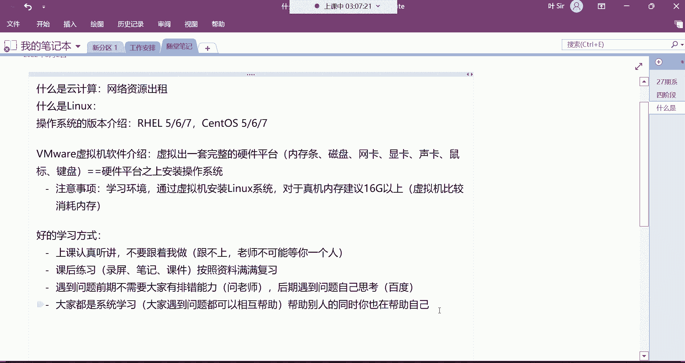

# 零基础入门Linux，红帽认证全套教程！Linux运维工程师的升职加薪宝典！RHCSA+RHCE+中级运维+云计算课程大合集！ - P3：红帽RHCSA-3.虚拟机网络配置、远程连接、Linux岗位介绍 - 广厦千万- - BV1ns4y1r7A2

喂喂喂，hello hello都回来了吗？回来的话，我们来看一下哈，我们这个回来先给我刷波一上来哈，然后。😊，都来了是吧？好，那我们先来看一下这个系统现在已经安装好了是吧？那安装好以后呢。

这个位置啊我们选择重启。😊，选择这个重启哈。😊，就重新启动一下。啊，让它重启一下。点进去点重启好。啊，你们有的系统都已经安装好了是吧？对，这个最小安装速度就是很快。呃。

最小安装就是包的话呢比较少300多个。😡，如果你要是带图形化界面，你知道吗？它1300多个包。呵。😊，如果我们选择带图形化界面的话，就直接多了1000多个包。安装在这个系统里面，如果不选择在图形安装。

最小安装就300多个。那所以对于企业来讲，企业一般他为什么不喜欢图形化界面呢？😡，就是因为它用不到图形化界面。😡，而且呢啊你的就1300多个是吧？对他用不到同文化界面的话。

就你看看这个就直接节约资源了呗，是不是啊啊，节约了1001000000多个软件包。😊，你现在上不了外网是吧？没关系啊，安装好以后，你看我们现在面对的是这样一个界面。😊，看到吗？

然在这个界面里面可以干什么呢？嗯看叫local hostlog in。😊，啊，就让我们登录了。那这时候又由于是没有图形的，没有图形啊，未授权咋办？啊，如果你选择在图形化界面安装的话呢，它会确实你看像。

啊。看一下啊。像他这种。呃，点一下哈，你点进去啊，未接受许可是吧？你点进去打个勾就可以了哈。这种东西就是你用人家的东西，你得遵循人家的一个什么呢？一个这个各种各样的一些这个使用规则，嗯。

点进去打个勾就可以了。😊，嗯，接下来呢你看我们在这登录哈啊不用跳过去，打个勾哈，你跳过去不行。😊，打个勾，在这儿输入root看到吗？把鼠标点进去，输入ROT啊。

root就是我们要用root用户登录这个系统，然后。回车，那这时候呢输入它的密码，密码是多少？一哎，回车注意，我现在密码已经输入了，只不过它不显示。😊，啊，他是为了什么呢？就是保护这个密码的安全性啊。

不被别人所看到。所以呢它是不显示这个密码的。但是我已经输入好了，拍回车就行了，回车。😊，好，那我现在就已经登录到这个系统上面来了。你们看啊现在啊我的这个名字变成什么名字叫。😊，这个名字了是不是？好。

那连上了以后呢，由于我们这个。哎呀，由于我我们这个IP地址啊把那个DNS改的不对，这DNS改的不对的话怎么办呢？你们千万注意啊，你们如果把DNS也改错的话。😊，哎呀，一定要像我这样哈，叫VI啊。

然后呢在这里边编辑一个文件，ETCs configurefinetwork。😊，啊，杠squipped这个路径非常长哈。😊，啊，这个路径非常长。哎呀，我改一下哈，我我先改一下，因为这个DNS有问题啊。

呃114就不用改了哈。😊，我要把这改改，但是这这波操作呢，对于你们现在啊。😡，你们现在根本不会用这波操作呀，是吧？我还得重启一下网络。所以你们在改的时候注意DNS一定要别改错了哈。改错的话。

也你你们不会用你们现在这个阶段啊，没有办法像我一样去改它的配置文件啊，通过配置文件去把这个DNS再给改回来。你们现在还没达到这个水平。所以呢你们尽量要去干嘛呢？去直接一次性配对哈。😊。

啊，你看我们这个机器啊，现在是在一个黑压压的界面里边，是不是？😊。

但是现在呢这个黑压压的界面，你不用管我们干嘛呢？我们通过一个远程连接工具。

远程连接工具叉啊，这叉叉都在VIP大礼包里边，然后你们也可以自己去下。😊。

你们如果说啊你说我想自己去下载可以吗？可以哈，那腾讯软件中心里面就有。😊。

在这个里边直接搜啊，叉sell。看了吗？搜看到了吗？到时候你们点进去。然后直接下载这个也可以选普通下载哈，选择普通下载就可以了。然后一步一步给它安装上就可以用了。😊。

那接下来呢我们来说一说哈，现在这个插座工具展开啊，打开哈，打开以后呢。😊。

它也是一个黑压压的界面。啊，同样哈都是一个黑压压的界面。但是这个黑压压界面我用起来比较舒服一些啊，因为这个在企业里边，你像这个机器啊一般是没有跟我们在同一个位置的。😊。

因为在企业里边这个你比如说现在的云主机啊，如果你们企业里面是租的，是编的云主机怎么办呢？那这个云主机。你想想你根本是没有办法像我们虚拟机一样啊，通过这个虚拟机直接登录到里边，是不是啊？云主机。

你就花钱租了以后，人家就给你个IP地址。

知道吧至于基于这个云主机放在哪儿，你不知道。😡，你只需要干嘛呢？啊，像我们这样啊，通过这个像什么叉ll这一个叫远程连接工具。哎，你就这样啊叫SSH空格。

然后呢，后面跟上那个IP地址就可以了。192。168。0。90。那我们前面那个虚拟机配的IP是不是90啊？那这时候推车。注意哈，但正常来讲，你们第一次连你们是不会出现这样的情况的。你们第一次连。

哼你们是连不上去的。你们不可能说出现像我这样的一个提示。😡，我这样是已经能够连上去了。知道吧？那正常来讲，你们连的话，你们连之前注意哈，在虚集里边左边。

这有个什么呢？叫做网络编辑器。看讯集左边这有个叫编辑，然后这里面有个叫网络编辑器。

啊，点这个虚拟网络编辑器。要配配什么呢？配配虚拟机里面的这个一些信息啊，这网络信息。这里边我们可以看到有这个什么呢？有敲接模式是吧？有紧主机模式，有NAT模式。那我们用的是不是这个呀NAT模式啊？

没错吧。好，那NAT模式这是怎么回事呢？在这儿把你的这个选项选到AAT它变蓝了以后，下边哈。正常来讲，你们是这样子的，看哈。😊，然后你们是这两个选项都是打对勾了，知道吧？打对勾。

然后你要把下边这个叫使用本地的DSCP。这个选项给它取消掉，什么意思呢？如果你勾选这个。选项的话，它会给你自动分配IP地址。啊，就每次给你虚拟机自动分配1个IP，但是IP发生变化了。

那你到时候你不知道这个IP是多少，你就没有办法连接，能列吧。所以把这个取消掉啊，就是我们一直用我们手动设置的那个IP地址。😊，OK然后上面这个呢就不用管了哈，你看将主机啊。

将主机虚拟识别器连接到此网络啊，这个我们用的就是Vn8哈啊。😊，对，这个呢就不用管。然后接下来呢这个子网这个位置注意哈，子网这个位置我要把这个界面给你们截个图啊，虚拟虚拟网络编辑器。这里面我告诉你这个。

这个位置。取消。取消勾选。O。啊，这个呢要选择VMnet，选择选择到这个VMn8。OK然后子网地址，我们用这个用这个网段的注意，这个子网IP就是呃你选择你的这个虚拟机里的网络，用哪一个网段的地址啊。

192的18。0。0这个网段的OK好，然后子网掩码3个2551个0那这时候啊再标记一下。这是一。嗯。然后这是2。嗯。标记下哈。啊，选择。这个。叫取消勾选。诶。取消勾选。O。在这哈2。然下边。这3。

3号呃。指定。地址段儿。地尺对。然后这个4。指定死网源码。我就直接掩码哈，指定掩码。好，然后接下呢5注意哈。在这儿哈这是五了。选择。在这主要是什么呢？叫设置网关的。啊，设置网关。正好。哎。嗯。到时候呢。

先发到群里面哈啊先发到这儿。然后再发到群里边。把这个图呢保存一下虚拟网络编辑器啊怎么配。O。然后选择NT设置吧，在这个里边。看看。谁呢？就他。Wangguan。嗯。

这个地址一定要设置成跟我那个地址是一样的地址哈。😊，19218。0。254哈OK然后。😊，选择啊确定就可以了。选择。来发过去。这个位置一定要保证跟我配的是一样子哈。你因为你只有这样配完以后。

我们的远程连接工具才能连到虚拟机上边啊，确定然后呢应用。应有找的。

我再确定。那这一波配好以后呢，还不行，注意哈，还要去配VMnet8的网卡在这儿。😊。

网络编辑器里边。在这里面呢找到你的那个VMnet8那块网卡。😊，当然你们那个。可能跟我这系统不太一样啊。我这是win11嗯，然后你们那个可能是win10是吧，找到你的自己的那个VF他8这块网卡。双击他。

选择属性。同意哈。然后选择协议版本4。点进去哈，就把这个IP地址呢，我们要给它配一配哈。😊，这个地址的话呢，给他配成什么呢？首先呢在这个界面。

呃，VMn8网卡。写一下，这个是。VM。n8。网卡。配置一个地址。地址哈。然后。第一呢要选择这个哈叫使用下面的地址，然后这儿。把这个地址配成这个地址，192。168。0。1。嗯，然后子网掩码。

看哈网关配置的跟我的一模一样哈。因为我们的这个虚拟机跟这个就是我我们的这个网卡跟虚拟机里的网卡是在同一个地址段的。然后网关指向同一个网关0。254，这样呢我们的虚拟机啊。

通过这块网卡就可以干嘛呢跟我们的真机通信。😊，能列吧。所以这个网卡跟虚拟在同一个网段，那我们的真机呢没关系。就通过微vonet80支网卡跟他虚拟通信了。然后这个网关不能指错，指错，也没有忘通信啊。

DNS啊223啊点5。5。5。

然后选择啊，我给你们截图哈，现在是。你网卡没了。哦。OK好后确定哈确定。呃，只有把。这个网络编辑器，还有VMn8网卡。

都配置完了以后。这个时候呢。你再像我这样看哈，就这样哈，就就这样哈，SSH连192。168。0。90的时候，你们才是这样才是这个样子，不然你是连不上去的哈。那这时候连接的话呢，由于是远程登录啊。

所以说呢啊它要让我们接受主机密钥嘛，我们选择接受并保存就可以了。OK然后在这个位置输入用户名ROOT啊，就是我们那个系统的那个root那个账号，然后回车这能在这呢输入密码看到吗？密码一确定。好。

我们现在是通过远程连接工具登录到了我们这台虚拟机里边。知道了吧？哎，那以后我对这个机器的所有操作都在哪操作呀？就在这个界面去操作。是，注意啊，这时候叫按住ctrl键，再按L叫清屏。

啊，再重复一遍啊，叫conttrol加L。现在哈。啊，control。然后再加。L键。那可以清屏。清屏清屏就让我这个屏幕呢变得更加整洁，看到吗？是啊就是什么都没有OK然后我们现在看到这个叫什么呢？

叫做命令行啊，今后所有的学习都在这个命令行界面去敲命令去管理这个系统。那至于命令怎么去敲怎么学。哎，我们明天再说啊，今天不用急，那系统到此为止安装好了，网络也配置好了。那接下来我们做什么事呢？

接下来我要给大家介绍一下。嗯，介一下这个lins的应用领域啊，然后还有呢一些相关问题，一个好好的学习方式。我先给大家说说一个好的学习方式，好吧。明天几点上课哈呃，明天上课还是两点。😊，哎。

明天明天不上课哈，明天不是礼拜一吗？😡，哎，下周哈下周六日哈两点。对，我们说说好的学习方式哈，好的学习方式的话呢。😊，嗯。第一呢就是上课呢呃认真听讲就可以了。好吧，然后呢不要跟着我做。不要跟着我去做。

嗯。为什么呢？因为你跟着我做呀，你跟不上，知道吧？😡，呃，一呢你跟不上二呢。那老师呢他也哎不可能等你一个人，是不是？所以呢你就。上课就先听啊，先以理解为主。呃，听完以后呢，自己啊课后呢去练习。哎。

你课后练习，咱们这边你想有录屏是吧？有笔记，有课件，你呢。去。按照这些资料啊去干嘛呢？去慢慢去复习它就可以了，也不用急。啊，呃主要是你如果前面啊你跟着我做的话，就会导致什么呢？你跟不上我的节奏。嗯。

我这边讲了是吧，你没跟上是吧，你这边呢就发现你有些这个慌张是吧？慌张的话呢，那可能是我再继续讲呢，你就不会再去什么呢，再去听了啊，你非得把这个问题给他搞清楚是吧？😊，这样不行。啊。

就是会导致你这些课是跟也没跟上，听也没听明白啊，所以这课也白听了，能理解吧？所以上课认真听，嗯，课后呢认真练习就可以了，O吧。然后遇到问题。😊，嗯。遇到问题呢呃。一般呢前期吧怎么说呢？呃。

也呃不需要大家有这个什么呢？有这个排错的能力。为什么？因为前期你也没有排错的能力啊，你说白你对这个系统一无所知，你也不可能去知道怎么排错是吧？那。呃，前期遇到问题呢，怎么说呢？遇到问题呃。

去问老师哈嗯问老师啊，咱们群里面都有专门的答疑老师啊，而且我也在群里边，只不过如果我平时上课的话呢，我看不到，好吧，有专门的答疑老师你艾特答疑老师。😊，然后呃后期呢啊后期遇到问题呢。哎，后期遇到问题啊。

去自己先去什么呢？先去思考别。一遇到问题就想着要先问老师啊，一遇到问题就先想着，哎呀，老师，我这问题出在哪啦等等等，自己先思考哈。😊，啊，思考思考，那你这个思考无非怎么思考，就是说白了查呗，是吧？

遇到问题，先百度嘛，那百度谷歌之类的。多搜一搜。嗯。多搜一搜哈，后期遇到问题，自己思考去排错。行吧，嗯，还有呢就是现在呢。😊，我们。我们大家呀就是都是这个系统的学习，嗯，都是系统学习的话呢呃怎么说呢？

都是一家人了哈，这就不能像以前啊在公开课上边嗯，这个想听就听是吧？不想听就拉倒了，毕竟大家也都是花了钱进来的，是吧？也都是呃希望以后呢通过学习能够找到一份像样的工作，嗯，提升自己的生活水平。

所以呢系统学习的话呢，就认真对待这件事情。啊，毕竟怎么说这谁的钱都不是大风刮来的，是吧？嗯。😊，所以呢就好好学，好吧，然后我也希望你们大家在一起呢，如果大家是吧遇到了问题，都可以什么呢？就是都。

可以相互的去哎帮助一下。这个相互帮助注也，有的时候你不一定是在帮助别人。我们说帮助帮助嘛，就是你在。帮助别人的同时。那你也在。帮助你自己。为什么呀？你比如说咱们这个班里边有个同学遇到一个问题。

然后他把这问题呢发到群里面了。那这个时候。你一看到这问题，你说哎这问题我会呀，这傻逼他不会是吧？哎，这这人可真笨，然后你就在背后偷摸的笑是吧？你说哎呀，我不会告诉你是吧，你自己去研究吧。

有的人可能会有这种心态哈嗯。😡，但是我告诉你哈，可能说有的有的时候你觉得这个问题你会。😡，嗯，那如果说你能够清晰明了的把这个问题哎。给别人解决了，你这才叫真的会。但如果你发现哎这东西你会。

但是呢哎你想清晰明了的告诉别人这个问题。😡，你发现你说不清。😡，说不清道不明的。那这个就证明你还没真的会。能理解吧？哎，所以说你在帮助别人的时候，你可能说也是在间接的帮助你自己。哎。

你如果说说不清楚这问题，你就知道哎哎呀我对这个东西的理解可能也是哎稀里糊涂的含糊不清的，是不是啊？😡，所以说啊互帮互助哈。互相帮助。嗯。毕竟呢大多数人也都是那个从这个小白过来的，是吧？

所以说你们哎呀在这个行业里边呢，可能说以后就是还有可能是同事呢，是吧？

有这个好的学习方式哈。😊。

来，那么。把这个呢也给他记录下来哈。啊，最重要的是什么？最重要的是第一条哈。😊，啊，最终的是第一条，这个呢一定要注意哈一定要注意。OK了。行，说清楚这些事情了呢，接下来啊咱们。嗯。下面呢。

咱们说说这个lin的应用领域吧，好吧。呃，学到第几阶段可以开始找工作是吧？嗯，会有笔记的，看看笔呃。看下啊。学到第几阶段可以开始找工作，当然是学到第四阶段的。那你不第四阶段你不学完，你怎么去找工作。

是不是？😡，因为大部分企业都得要求你会一些你像什么监控啊啊，K8S啊、容器啊，那些都在第四阶段的。所以你第四阶段得学。好了，接下来呢我要给大家说一说哈，就是我们学习这个linux，它现在应用的领域啊。

希望能找到工作是吧？呃，只要你好好学啊，只要你好好学啊，是没有任何问题的。毕竟我们现在这个行业还是非常的缺人。呃，在我们这个lin这个领域哈，你看它已经涉及到我们生活的一个方方面面了啊。

什么制造交通、金融、政务、医疗、通信、物流、石油、科研军事农业是吧，工业能源。这些东西你发现好像。跟我们的生活都是息息相关的，是不是啊？😡，你像这个。在这个。现在比较热门的大数据产业。

还有云计算领域啊人工智能领域，还有这个开发领域。我跟你讲啊呃都离不开linux斯，都有这个linux斯的身影。那这些呢大家其实没有什么强烈的感受，是不是啊？你说这些东西我好像哎也都不知道他是干嘛的。😊。

没错吧。但是我告诉你哈这个。😊，在呃可能这个你们看起来也是有一脸懵逼哈啊也一脸懵逼。你像什么世这个世界超算五百强，这个就是在这个世界上有这个500台啊运行最快的计算机叫超级计算机。😊。

然后这个超级计算机呢，你们可以看一下啊，在16年的一组数据里边，那linux斯就已经排到呃了400，在这500台里边就占了498台。然后un尼斯呢是占了两台嗯。两台哈。别的没有了。

所以你看对于lin斯这个系统，它的应用领域啊，在超算领域啊，都可以说是这个遥遥领先的啊。然后还有那在这个超算领域呢，这个你像我们中国也是非常不错的哈。我们中国是有这个。呃，两台比较啊不错的超算啊。

超级计算机啊，一个叫什么叫神威太湖之光。一个叫天河2号啊，这里面用的系统叫麒麟linux斯。叫麒麟林尼斯，那也是基于临斯二次开发的。那这两个系统它在16年的时候，神为太湖之光排在第一是吧？啊。

天河2号呢是排在第二啊，这是我们中国的哈啊也也算是在这个计计算领域吧哈，我们中国呃也算是非常不错的哈，非常牛逼的哈。😊，O。行了，就是那你说这些好像跟我们也没什么关系。你说这超算领域上。

我们都不知道他干嘛的，是吧？啊，一般做科研用的。😊，做科研哈科学研发。好。但这些你都不知道的话，那咱说点跟我们生活息息相关的，是不是啊？嗯，你说我们生活当中。比如说啊点个外卖是吧，出门打个车啊。

订个飞机票旅个游啥的，是不是啊啊，没事聊天啊，什么微信啊、QQ啊、陌陌之类的，是不是啊啊，这些还有那个平时的充值缴费，你像充个话费，充个水费，充个电费啊，现在几乎都可以是从网上去实现这些功能了。

是不是啊？我告诉你啊。😊，哎呀，这些功能在以前你想都不要想。在以前你们知道你想充个。话费。你知道去哪儿通吗？叫营业厅。你得去营业厅去充，为什么去营业厅呢？因为它的那套系统。是他妈一个专线啊。

是营业厅的专线，你只有在专线上面，人家才能帮你把这个话费给你充上，对吧？而现在呢它不是专线，是把这东西移动到哪儿呢？移动到云平台上面了。那移动到云平台，就大家都可以自己去干嘛呢？哎，通过APP，哎。

然后连接到它的那个云服务器，然后我们自己去充值。😡，加班。对。所以呢你看现在你比如说你现在你这个就包括我们充个水费吧，比如说你在家里面洗洗澡呢啊，你这洗着澡突然间发现停水了。

这以前你知道你充水费去哪儿听啊？😡，自来水公司啊，你得跑到他那个自来水公司那个那个那块去充这个水费哈。😊，但现在你需要去跑到自来子公司吗？是不是啊你打开APP小程序，直接上水费不就充了吗？对哈。

那是因为以前那自来水公司的那套系统。就在他自己的那个站点儿。那，外界的用户根本是连不到他的那个什么呢？他的内部系统的。而现在呢啊都迁移到云平台了，迁移到云音平台。现在呢我们想自己充水费。哎。

你通过APP就直接能够连到云平台的他的那个他的那个什么呢他的那个小程序了啊，直接就自己去充了。😊，咋办。哎。现在方不方便？啊，包括网上购物是吧，你像你。比如说买个衣服，买个化妆品是吧。

买个鞋子啊等等等等，买什么东西，你发现你都可以从这个什么淘宝京东之类的去买，是不是啊多方便呢？哎，还有什么呀？现在娱听歌的看电影的、娱乐软件、打游戏的、王者荣耀、英雄联盟。

你知道这些东西我们生活中就是每天都在用的东西，他们的背后。这些软件。的背后这软件不是天上掉下来让我们用的这软件它背后得运行在什么呢？哎。😡，一个操作系统上边。哎，这个软件只有运行起来，我们才能用。

是不是啊？那它的背后就是什么？一台一台的linux的服务器。啊，这些软件就运行在这个linux的服务器上边，哎，就是常年累月的不关机不重启，让我们一直可以使用这些软件。你看你在这个去这个比如说。

使用一些软件的时候啊，你看这些软，你看这些软件它。有这个。有能够让你这个使用不了的时候吗？没有吧，你包括微信啊，你发现微信这东西，它你几乎长年累月你都可以用它，是不是它没有它没有停下来的时候。

什么时候打开，后半夜打开，跟你女跟女跟你女朋友聊聊天是吧？😡，嗯，没有啥问题是吧？常年累月的都是一台一台的lininux服务器在后边默默的运行啊，然后让给我们提供这些服务。手机系统也是这个开发的吧。

当然了，手机系统安卓安卓系统。苹果系统呃苹果系统的底层是unux。苹果系统的底层是unux，安卓系统的底层是linux。嗯。哼能理解了吧？😊，他你看我们生活息相关的手机啊，每每个人都在用吧。

甭管是安卓还是苹果。😡，是吧。他都得基于这个东西在运行着，是不是？那这些东西你看它应用的领域是就非常的广泛了呀。😡，啊，非常的广泛哈那你们学完这个系统以后。

那你们就去找工作运维工程师、容器K84运维工程师、云平台运维工程师DB数据库管理员啊，存储运维啊，自动化运维架构师等等等等。但是刚开始先找这个运维工程师这个岗位哈。这岗位一个月挣多少钱呢？

一个月8000起步吧啊8000起步，然后平均也要在1万左右块钱。现在游戏还需要停服务维护吗？这一般得看情况。那有的时候他做。有的时候他在做一些，比如说啊。嗯。更新的内容非常多的话。

一般他就得需要停服务器哈。他不是听服务器，是把这服务停下来。啊，小更新不需要啊，小更新就直接啊叫热更新。热更新什么叫热更新呢？就是这个游戏啊，用户呢边玩，我可以对它进行一个更新就可以了。没有叫热更新。

冷更新啊，就把这个呃这个什么呢？把这个游戏啊给它停停下来，大家都不能使用了啊，然后呢我再对它进行一个更新啊，只有管理员啊才能进得去啊，对他进行一个维护。好啊，这样你们以后可以从这个岗位啊。

先从这个岗位入门啊，系统运维工程师入门。后期呢呃像容器运维啊，数据库管理员呢，后期你们到公司里边，比如说你到公司以后，你发现这公司啊数据库用的特别多。哎，然后你平时呢接触数据库呢，你比较熟练了。

那以后再往这个数据库方向发展。😊，如果到公司以后，你发现这公司容器用的比比较多啊，你每天都接触容器啊，容器的这个业务非常熟练，那以后就往容器方向发展啊。如果你发现你们公司啊是搞什么呢？

搞私有云的那你以后就往云平台方向发展。比如说你们公司搞存储的，你往存储方向发展，是不是？搞自动化就往自动化方向发，这是架构师呢，一般得需要懂开发了哈，懂开发才行。😊，啊，以上这都是你们可以去找的工作啊。

然后去哪儿找呢？去bos直聘呢，智联拉钩都可以啊，就直接就搜这些岗位就行。OK这是你们可以从事的岗位。然后还有一些没有技术含量的岗位，这个我还要给大家说一说。毕竟你们如果刚开始接触这个行业的话。

其实呃在找工作的时候啊，你们要知道哪些岗位啊，尽量不要去做。😊。

卡。卡顿了一下是吧？哪些岗位尽量不要去做呢？呃，你就比如像什么IDC运维啊，监控运维呀，技术支持这些岗位尽量不要去做，为什么呢？你看比如说IDC运维，它是一个没有技术含量的岗位，干什么工作呢？

叫机房巡检。嗯，机房巡检的话。主要就是嗯像咱们说不是有一个数据中心嘛，是吧？数据中心里面放的不都是服务器嘛，这服务器呢得需要人每天比如说去干嘛呢？去这个。

对机房里的什么温度啊、湿度啊、网络呀、电力啊、通风度啊等等等等做一系列的巡检。呃，然后发送这个巡检报告哎，这就是他一天的工作。那工作非常轻松哈嗯，但是呢。嗯，白班夜班两班倒这种活就是因为机房嘛。

那这种东西都是。常年都不能离开人的哈，机房里边都是必须那什么时间都要有人，你就逢年过节都得有人在那看着，知道吧？对，那跟林斯没啥关系，确实没啥关系哈。😊，呃，但是这种岗位呢一般第三方外包。注意哈。

这种岗位就是第三方外包。外包的话呢就是。你比如说如果说阿里那阿里阿里云阿里的数据中心，它需要这种这个IDC运维去给他做做巡检。那阿里不值招阿里干嘛呢？阿里把这个活哎。再转给一个第三方的外包公司。

然后这个外包公司呢帮阿里去招这个人，那这个人属于谁的呢？这个人不是属于阿里的。那阿里的所有的福利待遇跟这个人没关系。能列吧，那这个人就属于第三方公司的。H。😊，所以说这这第三方公司叫什么呀？叫中间商。

中间商干什么呀？中间商就赚差价，是不是？啊，就是这个中间商他主要干的活就是。他把。阿里啊给你发的工资，中间再给你扒一层。啊，就是他干的活能力了吧。啊，所以这种活呢呃挣不了多少钱啊。

主要也得不到任何的提升，知道吧？对，这种IDC能不干就尽量不要干哈。😊，得不到任何的提升啊，没什么意思哈。然后第二个叫监控运维，也没什么技术含量，干嘛呀？

看守监控系统的咱企业里边呢有那种专门的监控服务器，就监控你企业里的监控企业里的其他的服务器的。😊，啊，然后呢呃那对着这种岗位呢，你主要干的活就是发送告警消息。

就比如说啊这个监控服务器监控到我们企业的这个哪个机器啊，就是比如说关机了。那这个时候你就得把这个消息干嘛呀？哎，发送给。😡，企业的技术人员让技术人员去解决这个问题，而你是干嘛用的呢？

你就是发送告警报告的啊，给人家发邮件或者发短信或者打电话都行。😡，那这种岗位白班夜班两班倒，因为也是都是不能离开人的。😡，能解了吧？那没什么技术含量就不用说了吧，也是第三方外包啊，人家公司都不会直招哈。

好了接来呢就是技术支持。😊，技术支持也没什么技术含量。一般像哪些地方会招这种技术支持呢？像云厂商啊，云厂商，你比如像什么阿里云，阿里云的话就有那种技术支持的岗位。然后这种岗位的话呢，就是类似于一个客服。

😊，啊，类似于客服。叫处理客户工单的什么意思呢？比如说你从阿里云租了一台云服务器哈，但是这云服务器呢，你就可能说呃遇在使用的时候遇到一些问题，你自己处理不了啊，或者这云服务器出现一些扣费啊。

你不是很清楚啊，这个费怎么扣的是吧？哎，那这时候你怎么办呢？你就得去找这个阿里云去理论，是不是啊？嗯，那这时候你找谁呀啊，你就得找这个叫做技术支持。😊，他就接你的电话啊，问你先生是吧，有有什么问题吗？

啊，然后你有什么需要帮助的吗？那你这时候你就是把你的问题告诉他啊后如如果一旦涉及到一些技术方面的问题，他们就解决不了了啊，他们干嘛呢啊，他们让你说啊，那你把你的问题写到一个工单里边吧啊。

我呢把这个工单啊，转给谁呢？转给我们的专业的技术人员，然后呢，让他们帮您去处理。然后到时候呢，我再把这个工单啊，再返回给您，这就所谓的技术支持岗位，对吧？😊，嗯。没什么技术含量哈那这种也是白夜两边老哈。

然后也是第三方外包，所以这些呢就没太多没有什么太多可说的了哈。😊，嗯。没有太多可说的了哈，就这个。😊，可以。哎，跑哪儿去了？哦，这哈。OK都说了，是不是嗯那这些。😊，O。然后接下来呢。

咱们就说一说这个我们在这个行业里边哈，你比如说前面我跟你们讲了那些是没有技术含量的岗位吧。那接下来呢咱们再说一说。😊，啊，我们的一个运维岗位。怎么样是吧？还有这个开发岗位、测试岗位，他们呢都分别怎么样。

那这个呢也给你们介绍介绍，毕竟有的人呢他不是很了解这个行业是不是啊？因为大多数都是转行过来的嘛，所以咱们就先把这个行业呢给大家说清楚啊，以后最起码你们在这个行业里面最起码知道啊，你们应该往哪个方向发展。

是吧嗯。😊，好了，那接下来呢咱们先说。😊，开发岗位开发岗位呢那毋庸置疑哈。我说叫挣钱啊，一说到开发咋开发挣钱呢？没错吧，一个月好几万块钱。啊，事儿是这么回事哈。😊，呃，但是呢我给大家说说啊，它门槛高啊。

高开发的。搞开发一般对于你的学历来讲啊，都是要求比较高的。还有什么呢？还有你的专业呢啊也必须得对口，就是你的学历至少得是个本科，你的专业呢啊你得是计算机专业了，你才能往这个开发方向去发展。😊，知道吧。

那出呃如果这些你都能满足的话。那对于开发来讲，你还要有一个叫技术的天赋。知道吧？这技术天赋是什么意思呢？因为搞开发要看你这个人的思维逻辑。哎，所以说你的思维逻辑强，你才能去高开发。

你思维逻辑如果不强的话，你也干不了这开发。😡，而且搞开发的人一般得能耐得住寂寞啊，我们说忍受得住孤独是吧？耐得住寂寞是吧？为什么呀？因开发这活他妈的这这跟跟计算机交流啊，时间长你发现你不爱跟人交流了。

是不是啊啊，咱敲着键盘呵呵乐起来了，啊，敲键盘自己敲乐了，这别人一看他们这人傻了，是不是但其实不是啊？这这是啥呢？就是其是叫程序员的快乐是吧？程序员的快乐，就是啊别人理解不了的，是不是？有时候敲掉命啊。

特别开心。😊，但是呢那个苦恼的时候呢，就没事薅薅头发，为啥呢？要搞开发嘛，是吧这个功能开发不出来啊，可能说你卡在这儿哎卡一个礼拜了，这功能我都实现不了，怎么办呢？哎呀，那你没事就薅头发，没事就薅头发。

是不是啊？那这头发薅着薅着，你发现不知不觉哎变少了，不知不觉哎啊变成地中海发型了。😊，这就是我们说这个开发的特点嘛，是不是？😊，啊，桌面认为小白可以干吗？可以干啊，桌面运为小白当然可以干了。😊，呃。

所以说对于开发这些呃它主要是压力大哈，压力大，而且这个节奏也快嘛。啊，咱们说毕竟呃开发嘛是吧需要你不断的去创新啊，不断的去开发新的功能。嗯，而且还要随着现在这个社会的需求啊，这个所以节奏就比较快啊。

然后。😊，但是呢有个致命的缺点就是职业寿命比较短。啊，这是他的致命缺点哈。一般搞开发搞到35岁啊，基本上就差不多了，为什么呢？😡，就是因为节奏快，压力大，年纪大了，根本就不适合去干开发了嗯。😡。

所以说我们说就是至于这种嗯搞开发呢，你得考虑35岁转行。你不转行呢，一般你企业你比如说你三十五六岁，你去招去找一个开发岗位，你发现一般人不爱用你啊。白用你哈，所以一般搞开发，职业生命比较短。

那测试岗位怎么样呢？那对测试来讲呢，咱们所以说呃需要有一些编程的基础啊，你们千万不要觉得测试这个岗位它没什么技术含量。我问你。这个岗位恰巧呢，它确实有技术含量。而且对你的技术含量要求还不低呢。

你们知道吗？这一个测试啊，它等于半个开发了。嗯，一个测试等于方案开发，为什么呀？因为。他的测试工具得需要自己去开发。你比如说人家开发人员啊，开发人员写好了一个程序。

那这时候呢你让你对这个程序进行测试的时候，人家说你给我测试一下我这个程序跟数据库这个的链接啊。😊，那这时候。你走吧。你就得去测试吧。黄，那林你怎么测试，你自己去写。😡，自己去写哈自己去写这个测试工具。

所以对这种东西呢，我还是那句话嗯，测试呢如果你没有变成基础的话呢，我就也不建议你直接去往这个测试方向去发展。因为这活你也干不了。而且这都不是最重要的哈嗯。😊，嗯，懂数据库这都不是最重要的。

熬夜加班也不是最重要的。最重要是小公司没有这个岗位。知道吧，小公司不需要测试，为什么呀？小公司谁去测试呢？小公司。开发自己测试。那小公司一个人顶号一个人干，是不是啊？😊，所以说这种东西呢不像大公司。

大公司呢会招这种专门的测试人员啊，大公司有哈。😊，单向大公司，他招这种测试员，大公司门槛高啊。没错吧。大公司对你的要求。那你是不你一学历得达标。二呢专业得对口吧。😡，如果你说你学历也不够，专业也。

专专业也也不对，你说我你说你的专业是研研究这个什么呢？啊，研究养殖的啊，研究养研究养猪鸡猪猪鸡鸭狗的。😡，那人家发现你这根本就不是计算机专业是吧，你搞什么开发呀？😡，哎，专业不对口，所以这是测试岗位。

哎呀，这就你发现挺难的，是不是啊？那接下来运维呢哎运维的话呢，它不需要你有编程基础了。所以呢你们选的这个运营行业呢还是蛮轻松的。可以这么说吧哈，一般都是零基础就能够入门嗯。😊。

一般哈零基础入门几乎都是零基础入门了，可以这么说吧嗯。H。😊，所以说这个。基本上刚开始入门的时候呢，咱们就学一些系统里的长能命令啊。只要你肯吃苦，你只要是能够什么呢？哎，能够坚持下去哎，把这个。

把这个几个月给他熬过去。就可以了。好吧。所以可以零基础入门哈。而且对于我们这个学历要求呢还不是很高。你比如说你这个大专啊，大专轻轻松松。到吧。大专大专在这行业轻轻松松哈。嗯。

他这个最主要是职业寿命也蛮长的嘛。嗯，像我们这个行业哎呀。你干个几十年没啥问题。因为这个只要是公司，他就需要这种维护人员。所以这个行业呢职职业寿命也完长啊，还有一个岗位需求量大。需求量大。

就是你找工作就比较容易呗。好，那以上就是我们所说的这个运维这个行业啊，但是呢前提是什么呀？前提是这得坚持住啊啊，得坚持下去哈嗯。坚持不下去，说啥都白扯。干什么行业呢？如果说。三天打鱼，两天晒网的啊。

刚开始呢很多人都是哎呀这个行业真不错呀，挣钱呢啊我一定要挣钱是吧？兴致勃勃的融入到这个行业了。😊，但是呢发现啊刚这个刚开始进来的时候呢，啊，可能说还有一些这个什么呢新鲜感啊，去这个去学习啊啊。

去这个去研究一些东西啊，坚能坚持得住。但是呢随着时间一长，可能说哎呀这个耐心啊被磨没了啊，就开始什么呢？啊就开始这个。😊，就是属于嗯。哎呀，不就是可学可不学了啊，就把自己的内心磨没了。我们说人嘛是吧？

人就是。😊，有惰性，有疲劳期是吧？学着学着呢就学不下去了，坚持不住了。所以对于这种情况的话呢，就不能有就不可能有一个好的结果。所以你们现在在这个行业呢干什么事儿啊，年轻人要有一个好的结果，就得啥呀？😊。

就得坚持住。嗯，就得坚持住哈。行了，那我们今天呢该讲的也都讲的差不多了，是吧？嗯挺不错的哈。😊，然后。接下来呢我们就今天就讲到这儿吧，OK吧。然后讲到这儿的话呢，再讲可再讲就是下周的事儿了哈。

下周六日啊，我们还是那个什么呢？😊，还是在这个腾讯课堂哈。啊，上课时间嗯也都是两点哈。也都是两点。好，O。行了，你们看看有没有什么问题，然后。是吧。啊，你5点下班。啊，没关系啊，咱有录屏哈，咱有录屏。

中间对中间这几天晚上没课哈。嗯。这两天晚上没课怎么办呢？😡，呃，没克的话。这样吧，你们如果说哎没什么事儿干。😡，我给你发几节。呃，我给你发几节什么呢？发几节。以前讲过的那个录屏行吧，先复习着。嗯。

可以先预习预习嘛？没没什么事儿干，一周时间，毕竟我们这这周呢就安装个系统，是不是啊？哎没什么事干，所以呢有精力的啊，可以先预习预习。😊，O哈。好。嗯。剩下没有什么问题了吧。呃，这个只周六日上课的话。

上多久啊？就前两个阶段周六日上课，后边不是周六日了哈。因为前两个阶段哎主要是考虑到你们基础，如果给你们留了一周时间复习。😊，你系啊。行了，那接来要是没什么事情的话呢。没关系啊，你们这个啊课程表在哪是吧？

呃，课程表的话。课程表。课程表就是我们会学到哪些技术吗？你是说这个吗？还是说我们这个上课的时间表啊？

具体上课时间呢？

2啊。

啊，课程大纲是吧啊，课程大纲啊，就是讲哪些东西是吧啊？😊。

课程大纲，我一会儿给你们发群里面哈，我一会儿发到群里面。😊。

好来看哈。看到吗？这儿呢大纲哎在这儿哈。啊，我也上传到哪儿呢？上传到这个群文件，好吧。上传到群文件，到时候呢你们也可以从啊后期记不住，也可以从群文件里面去看一看。啊，这儿呢有哈看到吗？有哈这儿有。有。

然后一会儿呢给你们发几节前面讲过的录屏，你们看一看啊，可以预习预习前面的命令，O吧。

行了，没有什么问题的话，来给我刷波6这，我们就下课好吧，然后再上课呢，我会提前给大家发上课链接啊，会提前在群里面通知大家。😊，好，录屏了就停掉吧。

